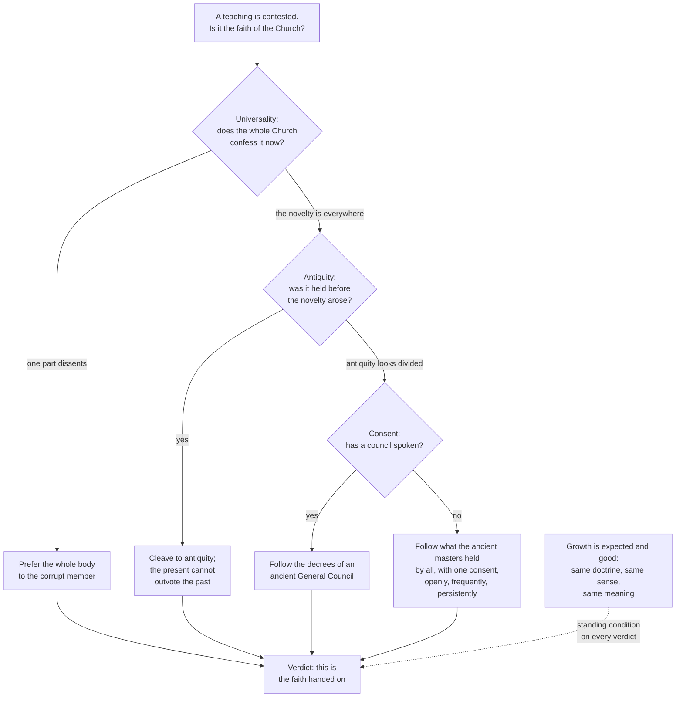

# Fundamental Theology · Lesson 5.1: Vincent of Lérins

> ⏱ ~15 min · Module 5: Development and method · Builds on: [4.5 Reading a document's weight](04-05-reading-a-documents-weight.md) · Unlocks: [5.2 Newman's theory of development](05-02-newmans-theory-of-development.md)

## Why this matters

You can now read a claim and say what act taught it and at what weight. Module 5 asks the question that sits underneath all of that: how can the Church define in 1854 something nobody can show was stated in 431 — and still say it is the same faith? Either doctrine grows, in which case "the Church has never changed anything" is false, or it does not, in which case half the creed is an innovation. A fifth-century monk in Gaul wrote the first serious attempt at the answer, and he is now quoted almost exclusively by people who have read one sentence of him. The sentence they quote is a test for spotting novelties. The chapter they skip is an argument that the faith *develops*. Both are his, and the tension between them is the whole of Module 5.

## The idea

Vincent of Lérins was a monk of the island monastery of Lérins, off the coast of southern Gaul. Around AD 434 — three years after the Council of Ephesus, whose controversy he discusses — he wrote a handbook under the pen name Peregrinus, "the pilgrim." The *Commonitorium* ("a reminder") asks one practical question: **when a new teaching appears and its defenders cite Scripture for it, how does an ordinary Catholic tell the faith from an innovation?**

His answer comes in two halves that most readers never hold together:

- **A test.** Scripture is sufficient and complete, Vincent says, but it is read in different senses by different people — Novatian one way, Arius another — so something besides the text has to fix its ecclesial sense. That something is the faith of the whole Church across time, and it can be checked by three marks: **universality, antiquity, consent**.
- **A doctrine of growth.** Having spent twenty chapters defending antiquity, he devotes his climax to arguing that the Church's understanding *must* increase — that it would be monstrous if it did not — under one condition: the growth must stay in the same doctrine, the same sense, the same meaning.

One historical note, stated plainly because the course is honest about hard record. Vincent wrote in Gaul during the local monastic reaction to Augustine's late teaching on grace and predestination, and many scholars read the *Commonitorium* as shaped by that quarrel: an appeal to the consent of antiquity against a living bishop's novel-sounding doctrine. A set of objections to Augustine (the *Objectiones Vincentianae*) has been attributed to him; **that attribution is disputed** and nothing in this lesson rests on it. What matters is that the canon was forged as a weapon in a real fight, not composed in the abstract — which is part of why it cuts the way it does.

## Source

*Commonitorium*, ch. 2, in the *Nicene and Post-Nicene Fathers*, second series (Heurtley's translation, public domain):

> Moreover, in the Catholic Church itself, all possible care must be taken, that we hold that faith which has been believed everywhere, always, by all. … This rule we shall observe if we follow universality, antiquity, consent.

And from ch. 23, the passage on progress:

> Yet on condition that it be real progress, not alteration of the faith. For progress requires that the subject be enlarged in itself, alteration, that it be transformed into something else … but yet only in its own kind; that is to say, in the same doctrine, in the same sense, and in the same meaning.

## The argument

### The canon, in three marks

The Latin tag is *quod ubique, quod semper, quod ab omnibus creditum est*. Unpack it as three independent questions, because they fail independently:

1. **Universality** (*ubique*) — is this confessed by the Church spread through the whole world, and not by one region or party? *In words: check the map. A teaching held in one province against the rest is a local growth, however loud.*
2. **Antiquity** (*semper*) — did the Church hold this before the present controversy made it convenient to hold it? *In words: check the clock. A novelty is a thing that has a birthday inside living memory.*
3. **Consent** (*omnibus*) — within that antiquity, did the Fathers and teachers agree, or is one man's opinion being passed off as the Church's? *In words: check the vote of the teachers, not of the crowd.*

Vincent's own gloss is tight: follow universality by confessing the faith the whole Church confesses; follow antiquity by not departing from the interpretations plainly held by the fathers before us; follow consent by adhering to what the ancient teachers held in common.

### The cascade: what to do when a mark fails

The part that makes the canon usable, and the part that is almost never quoted, is ch. 3: Vincent knows the three marks will not all be available in a real dispute, so he ranks them as **fallbacks**.

| If | Then |
|---|---|
| A novelty arises in one part of the Church | Prefer the soundness of the whole body to the unsoundness of "a pestilent and corrupt member" — universality decides |
| The novelty has spread over the whole Church in the present | Cleave to antiquity, which "cannot possibly be seduced by any fraud of novelty" — the present cannot outvote the past |
| Antiquity itself looks divided | Prefer the decrees of an ancient General Council to "the rashness and ignorance of a few" |
| No council has spoken to it | Collect the opinions of the ancient masters — but only what was held "by all, equally, with one consent, openly, frequently, persistently" |

Read the order carefully. It is not "majority wins." At each step the appeal moves *further back*, and the last resort is not a head count of everyone who ever wrote but a filter: only the teachers who lived and died in the Church's communion, and only where they agree in the open and repeatedly. Vincent is aware — writing a century after Nicaea — that a great part of the episcopate can go wrong at once. That is exactly the case the second row of the table is for.

### Progress, and its condition

Then ch. 23 turns. Is there no progress in the Church of Christ? Vincent asks, and answers: certainly there is, and let it be great — but let it be *progress* and not *alteration*, for progress means a thing is enlarged in itself, alteration means it is turned into something else.

Two images carry it, and both are organic:

- **The body.** The growth of religion in the soul should be like the growth of a body: the limbs of an infant are small and of a grown man large, yet it is the same person, and nothing appears in the adult that was not already latent in the child. Stature and outward form change; the nature and the person do not.
- **The seed.** The Fathers sowed wheat in the Church's field; it would be monstrous for their children to reap tares. What was sown as wheat must come up as wheat. The ancient doctrines may with time be "cared for, smoothed, polished" — but not changed, not maimed, not mutilated.

Both images do the same work. They license **enormous** visible change (an infant and an adult look nothing alike; a seed and a wheat field look nothing alike) while forbidding change of kind. The condition is the clause quoted above: growth is legitimate when it is in the same doctrine, the same sense, the same meaning.

### What has magisterial weight here, and what does not

This is where the course's signature skill applies to Vincent himself.

- **The *Commonitorium* is a private theological work.** Vincent was a monk and a priest, not a council; the handbook is an argument, and its authority is the authority of its argument plus the esteem of the tradition. No magisterial act has ever adopted the threefold canon as a rule of faith. Treating "everywhere, always, by all" as though it were defined doctrine is an overstatement of level.
- **The growth clause, however, was taken into a conciliar text.** The First Vatican Council's dogmatic constitution *Dei Filius* (1870), ch. 4 — the chapter on faith and reason — incorporates Vincent's sentence: understanding, knowledge and wisdom may increase greatly, in individuals and in the whole Church, across the ages, *but in the same doctrine, the same sense, the same meaning*. And the third canon on faith and reason attaches an anathema to the proposition that a sense may at some point be given to the Church's dogmas different from the sense the Church has understood and understands.

So the doctrinal content is: **development is real and the sense of a dogma is not revisable.** That is taught at conciliar weight, in the heaviest genre the Church has. The three-mark *test* is not. Keep those apart and you will read the whole of Module 5 correctly.

## Argument map

The solid path is the test; the dotted box is the doctrine. Quoting the first without the second is the standard misuse of Vincent.

## Worked examples

**Example 1 (mechanical — running the canon on a clean case).** Is it the Church's faith that Mary may be called *Theotokos*, God-bearer? This was Vincent's own live question; Ephesus had met three years before he wrote.

Run the marks in order.

- *Universality.* The title is in ordinary devotional and theological use across the churches — Alexandria, Asia, the Latin West. Nestorius and his party object to it. One part dissents from the rest, so row one of the cascade applies and universality already decides: prefer the whole body.
- *Antiquity.* The title is attested in Greek Christian usage generations before the controversy, and not as a contested technical term — it is what people were already saying. So the objection, not the title, is the thing with a birthday.
- *Consent.* Row three is available: a General Council (Ephesus, 431) has ruled. That closes the question at the highest rung the cascade offers short of the faith of the whole Church.

Verdict: the teaching passes on all three marks, and passes at the first one. Notice what the canon did and did not do. It did **not** generate the doctrine or prove it from premises; it certified that a disputed formula was the Church's own, against a claim that it was an innovation. That is the only job Vincent designed it for.

**Example 2 (where it strains — the Immaculate Conception).** In 1854, in *Ineffabilis Deus*, Pius IX defined that Mary was preserved immune from all stain of original sin from the first instant of her conception, and defined it as **divinely revealed** — the top rung of the ladder ([4.4](04-04-the-ladder-of-doctrinal-authority.md)). A Catholic who obstinately denied it would be denying a dogma.

Now run the canon on it as a plain historical survey, honestly.

- *Antiquity.* There is no explicit patristic statement of the doctrine in its defined form. There is a long tradition of Mary's holiness and sinlessness; the specific claim about the first instant of conception, framed with the later theology of original sin and its transmission, is not there in those words.
- *Consent.* Worse: the ancient and medieval teachers do not agree. Aquinas, in the *Summa Theologiae* (III, q.27), holds that Mary was sanctified in the womb but after animation, on the grounds that she must have needed redemption by Christ — and the Dominican school followed him for centuries against the Franciscans. The dispute was so open that the Holy See at one stage forbade either party to brand the other heretical.
- *Universality.* By the nineteenth century, yes, overwhelmingly, with the bishops of the world consulted before the definition. In the thirteenth century, no.

So the canon, used as a historical audit, returns a failing grade on a defined dogma. **Say that plainly; it is the difficulty, not a trick question.** Two honest responses are available, and they are the two roads out of this lesson:

1. **Read Vincent by his own ch. 23.** The marks apply to the faith as held, which is the infant body and the seed — not to its later explicit formulation, which is the adult body and the wheat. The Church always held Mary all-holy and untouched by sin; the definition polishes what was sown. The cost of this reply is that "antiquity" now needs a theory of what counts as implicitly present, and Vincent does not supply one.
2. **Admit the canon under-determines the answer.** This is Newman's route in the 1845 *Essay on the Development of Christian Doctrine*. Newman had leaned on the Vincentian rule in his Anglican years and concluded that, applied as a historical test, it is far harder to work than it looks — the Arian crisis being his own devastating case, where the mark of universality at one moment would have gone the wrong way. His answer is not to drop Vincent but to build the richer apparatus [5.2](05-02-newmans-theory-of-development.md) covers: seven notes for telling a development from a corruption.

Both replies are held by Catholic theologians in good standing. Which one you find sufficient is an open question, and a good evaluative one.

## Watch out

- **You might think the canon is a magisterial rule.** It is not taught by any act of the Magisterium. Only Vincent's *growth clause* was taken up, in *Dei Filius* ch. 4. Calling the threefold canon "the Church's test for doctrine" overstates its level, and is graded here as an error.
- **You might think Vincent opposes development.** He is one of its first theorists. The chapter on progress is his climax, not a concession; he calls it monstrous to deny the Church's understanding should grow.
- **You might think "always and by all" means a head count.** It means the consent of the teachers who handed on the faith, filtered by communion and by whether they said it openly and repeatedly. Vincent knew an episcopate could go wrong en masse; the cascade exists precisely so that a bad present cannot outvote the past.
- **You might think "the same sense" forbids new words.** It forbids a new sense. Nicaea's *homoousios* is not a scriptural word, and Vincent has no trouble with conciliar formulations — the ancient doctrines may be smoothed and polished.
- **You might think a doctrine passing the canon is thereby proved.** The canon identifies the faith under dispute; it does not derive doctrine, and it says nothing about *why* the faith is true.
- **You might think the 1854 difficulty is an embarrassment to be explained away.** It is the actual state of the record, and a reader who cannot state it will not understand why Newman wrote a book.

## One-liner

> Vincent gives a test — everywhere, always, by all — and then, in the chapter nobody quotes, argues the faith must grow like a body and a seed, on one condition: same doctrine, same sense, same meaning.

## Problems

**P1 (🟢) *(Exegetical.)*** A theologian proposes that teaching X is a legitimate development of the apostolic faith.

(a) For each of Vincent's three marks, say in one clause what the theologian would have to **demonstrate** — the actual evidence, not the slogan.
(b) Suppose the mark of antiquity cannot be shown because the Fathers are divided on X. Which step of Vincent's cascade applies, and what does it direct you to?
(c) Name one thing a positive verdict on all three marks would **not** establish.

**P2 (🟡) *(Exegetical (a) · Evaluative (b).)*** Levels, then judgement.

(a) At what level is "what has been believed everywhere, always, by all" taught? Name the clause of Vincent that **does** carry magisterial weight, the act that gives it that weight, and what assent is owed to it. Be precise about which is which.
(b) Vincent's canon can be read two ways: as a **historical test** (survey the record and count) or as a **rule of interpretation** (a dogma must be readable as the faith the Church has always held, whatever the documentary record shows). Argue for one reading in **150 words or fewer**, using the Immaculate Conception as your test case, and state what your reading costs you.

**P3 (🔴, optional) *(Exegetical.)*** An invented paragraph from a traditionalist newsletter:

> "The Church's own rule, laid down by St Vincent of Lérins and confirmed by the First Vatican Council, is that we hold only what has been believed everywhere, always, and by all. Anything that cannot be shown in the Fathers is therefore a novelty and may be rejected. That is why the Council of Nicaea was careful to use only the words of Scripture, and why no doctrine can ever be more clearly stated later than it was at the beginning."

Name the errors and correct each in one sentence. For each, say whether the claim is **false**, **overstated as to level**, or **a misuse of a source that says the opposite**. **150 words or fewer.**

Solutions

**P1** *(Exegetical — strict.)*

**Must hit, strict:**
- (a) **Universality:** that the churches spread through the world confess X, not one region, party or school — evidence is the geographical spread of the confession, not the volume of its defenders. **Antiquity:** that X was held before the present dispute arose — evidence is attestation prior to the controversy, so that the *denial*, not the doctrine, is the thing with a birthday. **Consent:** that the ancient teachers agreed on it — evidence is that they held it, in Vincent's own filter, by all, with one consent, openly, frequently, persistently, and that they died in the Church's communion.
- (b) The third and fourth steps of the cascade: prefer the decree of an ancient General Council if one exists; if none does, go to the consentient opinions of the ancient masters, admitting only what was held in common, openly and repeatedly. Credit for noting the order goes *backwards* in time, never to a present majority.
- (c) Any of: that X is true (the canon identifies the Church's faith, it does not prove doctrine); that X is defined or at what level it is taught; that X was held in the same explicit formulation from the start.

**Wrong turns:** treating consent as a majority of everyone who ever wrote — Vincent filters by communion and by open, repeated teaching; answering (b) with "then it fails the canon," when Vincent's whole point in ch. 3 is that a failed mark routes you to the next rung rather than ending the inquiry; treating universality as a claim about the present numerical majority, which row two of the cascade explicitly overrides.

**Model answer:** (a) spread across the churches; attestation prior to the controversy; common, open, repeated teaching by the ancients in communion. (b) Go to a General Council's decree, else to the consentient ancients — backwards, not to the present majority. (c) That X is true, or at what level it is taught.

---

**P2** *(a) exegetical — strict; (b) evaluative — any verdict.*

**Must hit, strict (a):** the canon is taught at **no magisterial level at all**. The *Commonitorium* is a private theological work by a fifth-century monk; its weight is the weight of its argument and its standing in the tradition, exactly as with any theologian ([1.1](01-01-what-fundamental-theology-asks.md)). What carries magisterial weight is the **growth clause** — that understanding may increase, but in the same doctrine, the same sense, the same meaning — because the First Vatican Council incorporated it into *Dei Filius* (1870), ch. 4, a dogmatic constitution, with the third canon on faith and reason anathematizing the claim that a dogma may later be given a sense other than the one the Church has understood. Assent owed: **theological faith**, since the canon's anathema marks it as proposed as divinely revealed — the top rung. Full credit requires saying that the *test* and the *growth clause* sit at opposite ends of the ladder.

**Must hit, any verdict (b):** state the two readings precisely and pick one; run it on the 1854 definition and say what the reading produces there — the historical reading has to confront Aquinas and the Dominicans denying the doctrine as then framed, the interpretive reading has to say what "implicitly held" can bear; **state the cost** of the reading you chose. Either verdict passes.

**Wrong turns:** saying Vatican I "confirmed the canon" — it quoted the growth clause and not the three marks; calling the canon "a dogma" or "the Church's rule"; answering (b) by declaring the Immaculate Conception's definition simply proves the canon false, without distinguishing the canon from the growth clause that *is* taught.

**Model answer (b), one of several:** The interpretive reading. Vincent's own ch. 23 makes the organic images do the work: the marks apply to the faith held, which is the seed, not to its formulation, which is the harvest. On the Immaculate Conception the historical reading simply loses — a doctrine denied by Aquinas and by the Dominican school for centuries cannot have been believed by all in any documentary sense — whereas the interpretive reading says the Church always held Mary untouched by sin and the 1854 definition polished what was sown. The cost is real and I will name it: "implicitly held" now does all the work, and Vincent gives no criterion for it, so the canon stops being a test anyone can fail. That is precisely the gap Newman wrote the *Essay* to fill.

---

**P3** *(Exegetical — strict.)*

**Must hit, strict:**
1. "Confirmed by the First Vatican Council" — **a misuse of a source that says the opposite**, or at least not that: *Dei Filius* ch. 4 quotes Vincent's clause on *growth*, not the three marks. The council's contribution here is that understanding increases; the newsletter cites it for the proposition that nothing may.
2. "The Church's own rule" — **overstated as to level.** The *Commonitorium* is a private work and the canon is taught by no magisterial act.
3. "Anything not shown in the Fathers is a novelty and may be rejected" — **false** as a Catholic principle, and false to Vincent, who devotes his climax to arguing that the Church's understanding must grow, and whose cascade routes a failed mark to a council rather than to rejection.
4. "Nicaea used only the words of Scripture" — **false**: *homoousios* is not a scriptural word, which is the standing counterexample to the newsletter's own rule.
5. "No doctrine can ever be more clearly stated later" — **false**, and directly contrary to Vincent's body and seed: the adult is the infant, stated larger.

**Wrong turns:** conceding point 3 by arguing that antiquity does not matter — Vincent's marks are real and the Church does appeal to the Fathers; the error is the rejection clause, not the interest in antiquity. Attacking the newsletter's motives rather than its claims about texts.

**Model answer:** Vatican I quoted Vincent's growth clause, not his canon, so the citation says the reverse of what is claimed (misuse of a source). The canon itself is a private theologian's rule, not a magisterial one (overstated level). "Not in the Fathers, therefore rejectable" is false to Vincent, whose ch. 3 routes a failed mark to a General Council and whose ch. 23 requires growth. Nicaea's *homoousios* is not a scriptural word (false). And the body-and-seed images exist precisely to license later, clearer statement of the same doctrine (false).

## Flashback

**F1 (🟡) *(Exegetical.)*** From [4.4](04-04-the-ladder-of-doctrinal-authority.md). For each claim, give the **level** on the ladder, the **act or source** that fixes it, and the **assent owed**. One of the three is stated at the wrong level; say which and restate it correctly. **120 words or fewer.**

(a) "There are seven sacraments of the New Law, instituted by Christ."
(b) "The Council of Trent defined that transubstantiation must be explained using Aristotle's categories of substance and accident."
(c) "The death penalty is inadmissible," as taught in the 2018 revision of the Catechism.

Solution

**Must hit, strict:**
- (a) **Divinely revealed and proposed as such** — the top rung. Fixed by the Council of Trent, Session VII (1547), whose first canon on the sacraments in general anathematizes holding more or fewer than seven. Assent owed: **theological faith**; obstinate denial would be heresy.
- (b) **The one stated at the wrong level.** Trent (Session XIII) defined the conversion of the whole substance and said the Church *most aptly* calls it transubstantiation; it defined the term and the reality, **not** a philosophical system. The Aristotelian explanation is a theological account, not a defined doctrine, and Catholics may explain the reality otherwise while holding what was defined.
- (c) **Authentic ordinary magisterium, non-definitive** — the third rung. Fixed by a papal act revising the Catechism's text (2018), not by a definition; and note that the Catechism is a compendium whose entries carry the weight of their source ([4.5](04-05-reading-a-documents-weight.md)). Assent owed: **religious submission of intellect and will**. Whether the teaching is a doctrinal development or a prudential judgement about present conditions is argued among Catholic theologians; saying so is credit, not hedging.

**Wrong turns:** treating (c) as a dogma because it appears in the Catechism — the compendium trap from [1.1](01-01-what-fundamental-theology-asks.md); treating (b) as merely "a bit strong" rather than an overstatement of level; downgrading (a) because most people meet it in a catechism class rather than in Trent.

## Connections

- **Backward:** [3.4](03-04-tradition.md) left standing the question of how something implicit becomes explicit without becoming something else — this lesson is the first answer to it, and Example 2 is the same Marian case that lesson used to test material sufficiency. [4.4](04-04-the-ladder-of-doctrinal-authority.md) and [4.5](04-05-reading-a-documents-weight.md) supply the levels used on Vincent himself, which is the point of P2(a). *Dei Filius* ch. 4 is the chapter [2.3](02-03-fideism-and-rationalism.md) read for the double order of knowledge; this lesson reads its other half.
- **Forward:** [5.2](05-02-newmans-theory-of-development.md) takes up the gap Example 2 opened, with the seven notes. [5.3](05-03-the-sensus-fidei.md) asks whose consent counts, which is Vincent's third mark under a new name and with a much more careful theory of it.
- **Sideways:** [`patristics`](../../patristics/syllabus.md) reads Vincent in his own setting and supplies the Fathers whose consent the canon asks about; [`church-history`](../../church-history/syllabus.md) has the Arian crisis and the Gallic disputes over grace as events, which this lesson only names. The canon is the standing tool in [`theology-of-debt`](../../theology-of-debt/syllabus.md) for usury and in [`moral-theology`](../../moral-theology/syllabus.md) and [`catholic-social-teaching`](../../catholic-social-teaching/syllabus.md) for religious liberty and the death penalty — every one of them a case where someone will ask whether this is growth or alteration.
