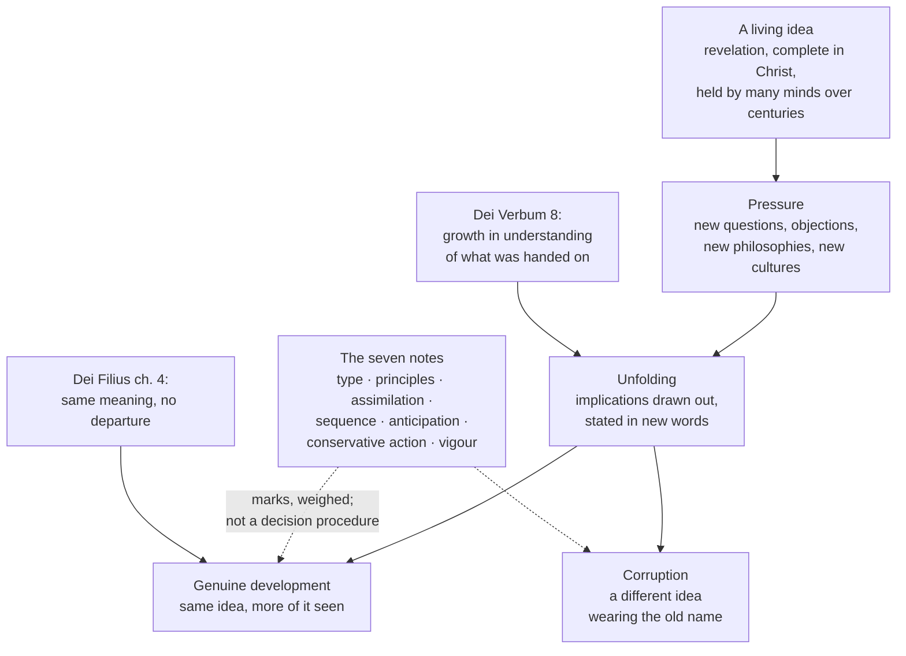

# Fundamental Theology · Lesson 5.2: Newman's theory of development

> ⏱ ~15 min · Module 5: Development and method · Builds on: [5.1 Vincent of Lérins](05-01-vincent-of-lerins.md) · Unlocks: [5.3 The sensus fidei](05-03-the-sensus-fidei.md)

## Why this matters

[5.1](05-01-vincent-of-lerins.md) left you with a rule and a problem. The rule: what is held everywhere, always, by all — and growth only *in the same sense and the same meaning*. The problem: almost nothing important passes that rule on its face. The word *homoousios* was not held always. The Immaculate Conception was not held by all — great saints denied it. The seven-book deuterocanon was disputed for centuries. Vincent himself saw this, which is why his *Commonitorium* has a second half about progress. But he gave you a criterion without a procedure.

Newman gives the procedure. And it is the procedure, not the conclusion, that you need: it is how [5.5](05-05-the-loci-theologici.md)'s boss problem on religious liberty gets argued, how [`theology-of-debt`](../../theology-of-debt/syllabus.md) decides whether the usury teaching changed, and how [`moral-theology`](../../moral-theology/syllabus.md) handles the death penalty. Every one of those is a fight about the same question: *is this the acorn's oak, or a different tree?*

## The idea

John Henry Newman published the *Essay on the Development of Christian Doctrine* in 1845, while he was an Anglican working out whether he could remain one. He was received into the Catholic Church in October of that year, before the book was finished, and published it substantially as it stood; he revised it in 1878, renaming his seven "tests" the seven **notes** and reordering them. The line from the Introduction that made the book famous is his own verdict on what the history did to him: "To be deep in history is to cease to be a Protestant." Whether that verdict follows is argued in [`apologetics-catholic-claims`](../../apologetics-catholic-claims/syllabus.md); what this lesson takes from him is the machinery.

The machinery starts with a claim about **ideas**, not about the Church. A real idea — an idea with content, held by many minds, over generations — cannot simply sit there. People draw its consequences. They apply it to situations its first holders never faced. They defend it against objections that force them to say precisely what they had only assumed. They translate it into the vocabulary of a new philosophy or a new century. All of that is not decay; it is what having an idea *consists of* once more than one person holds it for more than one lifetime.

So the aspects of an idea come out gradually, in a community, under pressure — and the result can be a statement nobody in the first generation ever uttered, which is nevertheless the same idea. That is Newman's **development**. It is not addition (public revelation closed with the apostles — [1.4](01-04-public-and-private-revelation.md)); it is the unfolding of what was given, in minds that now see more of it.

And the obvious objection is the whole reason the book exists: **corruptions unfold too.** Arianism was also a community drawing consequences over generations. So the theory is worthless unless it comes with a way of telling the two apart. That is what the seven notes are for.

## Source

Newman, *Essay on the Development of Christian Doctrine*, from the first chapter (public domain):

> It is indeed sometimes said that the stream is clearest near the spring. Whatever use may fairly be made of this image, it does not apply to the history of a philosophy or belief, which on the contrary is more equable, and purer, and stronger, when its bed has become deep, and broad, and full. It necessarily rises out of an existing state of things, and for a time savours of the soil. … In time it enters upon strange territory; points of controversy alter their bearing; parties rise and fall around it; dangers and hopes appear in new relations; and old principles reappear under new forms. It changes with them in order to remain the same. In a higher world it is otherwise, but here below to live is to change, and to be perfect is to have changed often.

Read the last two sentences slowly. "It changes with them in order to remain the same" is the entire thesis, and it is also exactly the sentence that gets quoted to license things Newman would not license — because he spends the rest of the book saying which changes qualify.

## The argument

Newman sets out the notes in the chapter contrasting genuine developments with corruptions. They are **notes** in the old sense: marks by which you *recognize* a thing, like the marks of the Church. Each one is a question you put to a particular case, and — this is the part to internalize — each one tells you what you are on the hook to **show**.

**1. Preservation of type.** A living thing grows enormously and stays the same kind of thing; the infant and the adult share a structure, not a size. So with an idea: what must persist is its *type* — the characteristic arrangement of its parts, the relation of its elements to each other. *In words: is it still the same shape, or only the same size?* Newman's own case is the Church herself, unrecognizable in outward condition between the catacombs and the empire, and identical in type.
**Show:** state the type first, in your own words and before you look at the later stage, then show the later stage exhibits that arrangement. Sameness of *words* is not sameness of type, and a violent change of circumstances is not a change of type.

**2. Continuity of principles.** Newman separates **doctrines** (what is taught) from **principles** (the underlying axioms on which doctrines are built and by which they are developed) — the principle of dogma itself, the sacramental principle, the priority of faith over private judgment, the reality of grace, the goodness of asceticism. Doctrines develop; a true development runs on the same principles it started with. *In words: did the new teaching come out of the old engine, or was a different engine bolted on?*
**Show:** name the principle operating in the earlier stage, and show the later development is an application of that same principle — not of one imported from outside (a new philosophy, a political need, a foreign religious impulse).

**3. Power of assimilation.** A living body takes in food and converts it to its own substance; a dead one is simply invaded. A living idea absorbs materials from its surroundings — Greek metaphysical vocabulary, Roman legal categories, pagan festivals and customs — and subordinates them to its own type. *In words: did it eat the foreign matter, or did the foreign matter eat it?*
**Show:** the borrowed element, and then the evidence that it was made to serve the original idea rather than to redirect it. Naming the borrowing is not an objection; failing to show the subordination is.

**4. Logical sequence.** A development that is genuine can be laid out afterwards as a chain of reasoning from what went before, even though it was not reached that way. Newman is emphatic that developments arise in the life of a whole body, not in a study; the note asks only that the result survive being analysed. *In words: it wasn't deduced, but it can be defended as a deduction.*
**Show:** actually write the argument from the earlier teaching to the later, with the premises named — and check that no step smuggles in a premise foreign to the deposit.

**5. Anticipation of its future.** If a doctrine is really latent in the original idea, you expect early, scattered, unofficial signs of it long before anyone defines it — a phrase in a Father, a liturgical practice, a devotion, an isolated local custom. *In words: was it hinted at before it was demanded?*
**Show:** early evidence that genuinely points forward, dated and in context. The discipline here is negative: an anticipation must be visible to a reader who does not already hold the later doctrine, or you are reading it in.

**6. Conservative action upon its past.** A true development protects, illustrates and secures what came before; a corruption reverses or dissolves it. Newman's striking instance is Marian doctrine, which he argues has functioned to guard the truth about her Son rather than to compete with it. *In words: does the new teaching make you hold the old one more firmly, or let it go?*
**Show:** that nothing earlier has to be denied in order to hold the new teaching, and, better, that the earlier teaching is stronger for it. This is the note most often decisive in a real dispute.

**7. Chronic vigour.** Corruptions have a course: they flare, run their energy out, and either kill the body or are thrown off by it. A development endures, and remains fruitful, over a long stretch of time. *In words: is it still alive in three hundred years?*
**Show:** duration *with* vitality. The note cuts both ways and slowly: it cannot be applied to anything recent, which is why it is nearly useless for twentieth-century cases and powerful for patristic ones.

**Why these are notes and not a proof.** Newman does not offer a decision procedure, and says so: the notes differ in force from case to case, they are not equally applicable to every development, and the absence of one is not by itself a refutation. They are evidence, weighed. Two honest people can agree on every historical fact and still disagree about preservation of type, because "the same type" is a judgement about what the idea essentially is. That is not a defect in Newman; it is the reason [5.5](05-05-the-loci-theologici.md)'s boss problem is a real dispute rather than a calculation, and the reason a Catholic may hold either side of it without being a heretic.

**Where Newman's own authority sits.** Nowhere on the ladder ([4.4](04-04-the-ladder-of-doctrinal-authority.md)). The *Essay* is a private theologian's book. No magisterial act has adopted the seven notes; they are a tool the tradition found useful, and a rival account of development (there are several) is not an error against the faith. What *is* taught is smaller and more important:

- **Dei Verbum 8** (Vatican II, 1965; paraphrased): the apostolic Tradition develops in the Church under the Holy Spirit, and there is **growth in the understanding of the realities and the words that have been handed on** — through the contemplation and study of believers, through the spiritual understanding they experience, and through the preaching of the bishops; the Church tends constantly toward the fullness of divine truth. Note the object of the growth: *the understanding of* what was handed on. The deposit does not grow.
- **Vatican I, *Dei Filius*, ch. 4** (1870) fixes the limit, in words borrowed from Vincent: the meaning of the sacred dogmas once declared by the Church is to be perpetually retained, and there is never a departure from that meaning under the pretext of a deeper understanding. A canon attached to that chapter anathematizes the contrary. So the limit is dogma, top rung; the machinery for working within it is not.
- ***Mysterium Ecclesiae*** (CDF, 1973, with papal approval; paraphrased) — the careful bit. Dogmatic formulas are **historically conditioned in their expression**: they depend on the expressive resources of a language at a moment; a truth may be stated at first incompletely, though not falsely, and later more fully; a definition aims at the questions and errors of its day, and must be read with those in view. And so the Church may replace an old formula with a new one that conveys the same meaning more clearly or more completely — a judgement reserved to the Magisterium, not to the theologian or the reader. What the declaration explicitly refuses is the inference that dogmatic formulas therefore give only shifting approximations, correctable in meaning as knowledge advances. Historically conditioned in *expression*; true and **determinate** in what they assert.

That last distinction is overstated in both directions constantly. One direction: "the formula is time-bound, so its meaning is negotiable" — refused by *Mysterium Ecclesiae* and by *Dei Filius* ch. 4. The other: "the words are untouchable" — also refused, in the same document, since the Church has in fact restated dogmas in new language and may do so again.

## Argument map

Solid arrows are the process and its two possible outcomes; the dotted arrows are the notes doing the only thing they can do — telling you which branch you are on, with evidence rather than proof.

## Worked examples

**Example 1 (mechanical — running the checklist on a clean case).** Nicaea (325) confesses the Son *homoousios* with the Father: of one substance. The word is not in Scripture, it is Greek philosophical vocabulary, and the fourth-century objection was exactly that — an unbiblical term imposed on the faith. Run the notes.

*Type:* the type is the worship of Christ as God alongside the confession of one God — visible in the New Testament, in early prayer and baptismal practice. *Homoousios* is that arrangement stated in a new register, not a new arrangement. *Principles:* it runs on the principle of dogma (that revelation has definable content) and on the rule that the Church's prayer settles what she believes. *Assimilation:* the borrowed word is the case for this note — a Greek metaphysical term taken in and made to do Christian work, with its philosophical baggage stripped. *Logical sequence:* the argument is short and clean — if the Son is worshipped and not a creature, and there is one God, then he is not of a different substance. *Anticipation:* pre-Nicene writers already speak in ways that require the conclusion, which is why the council could claim to be defending, not innovating. *Conservative action:* the definition secures the earlier faith rather than supplanting it, and it is the denial that forces you to abandon something the Church already had. *Chronic vigour:* seventeen centuries, still load-bearing; Arianism had a sharp and bounded career.

Seven for seven. That is what an easy case looks like, and you should notice how rare it is.

**Example 2 (where it strains — usury).** The Church condemned lending at interest for a very long time. Lateran III (1179) denied manifest usurers communion and Christian burial. The Council of Vienne (1311–12) decreed that anyone obstinately asserting that usury is not a sin is to be punished as a heretic. Benedict XIV's encyclical *Vix Pervenit* (1745) restated the core: the nature of a loan demands that no more be returned than was given, and profit demanded **by reason of the loan itself** is sinful — while allowing that titles entirely extrinsic to the loan may justify a further return, and that money may be put to work through other contracts. In the nineteenth century, a series of replies from Roman congregations told confessors not to disturb penitents who took the legal rate, while pointedly declining to declare interest-taking licit in itself. Today Catholics hold ordinary interest-bearing accounts without a qualm.

Development or reversal? Run two notes and watch them pull.

*Continuity of principles* is the continuity reading's best ground: the principle was always that money lent is sterile of itself, so that gain must have a title in something real — risk, loss, forgone profit, participation in an enterprise. What changed is the factual premise about what money is in a commercial economy, and the extrinsic titles are that same principle applied to a new fact. On this reading the doctrine never moved; the world under it did.

*Conservative action upon its past* is where it strains. Ask honestly: can a Catholic today hold what Vienne's decree presupposes about the act it describes, or has that been quietly let go? A continuity reading has to say what exactly *Vix Pervenit* forbids that is still forbidden, and show that the nineteenth-century practice leaves that intact — which is why the careful wording of those replies matters so much. The strongest opposing reading, associated with John T. Noonan's history of the scholastic analysis, is that a doctrine taught for centuries with sanctions was in substance abandoned, whatever the formulas say.

Notice that both sides accept the same facts. The dispute is about type and about what "the same" means — which is precisely the point of the last section. The substance belongs to [`theology-of-debt`](../../theology-of-debt/syllabus.md), which reads the texts; what is owed here is the method, and the discipline of not pretending the case is easy.

## Watch out

- **You might think development means doctrine can change.** It means the understanding grows (Dei Verbum 8) while the meaning of what was defined stays (*Dei Filius* ch. 4). A theory of development that permits reversal is not Newman's, and "to live is to change" was written by a man who spent four hundred pages restricting which changes count.
- **You might think the notes decide a case.** They are marks, weighed. Anyone can claim preservation of type; the argument is about whether the *type* was stated honestly before the answer was known. An answer that just asserts "all seven are satisfied" has done no work.
- **You might think a missing note refutes a development.** Newman explicitly denies this. Chronic vigour cannot be run on anything recent, and anticipation is weak where the sources are thin. Weigh what you have.
- **You might treat logical sequence as a claim about how it happened.** It is a claim about what can be reconstructed afterwards. Doctrines develop in a praying, arguing, suffering body, not by deduction.
- **You might think Vatican II endorsed the seven notes.** It did not. Dei Verbum 8 teaches that the understanding of the handed-on faith grows; it does not adopt Newman's criteria, and no other document does either. Citing "the seven notes" as though they bound a Catholic is an overstatement of level.
- **You might overstate *Mysterium Ecclesiae* in either direction.** It says the expression is historically conditioned **and** the meaning is true and determinate; and the authority to restate a formula is the Magisterium's. Quoting the first half alone is the standard abuse; denying the first half is the standard overcorrection.
- **You might confuse development with the hierarchy of truths.** A doctrine's nearness to the foundation of the faith and its history of unfolding are unrelated axes ([4.5](04-05-reading-a-documents-weight.md)).

## One-liner

> A living idea unfolds under pressure and stays itself; Newman's seven notes are the marks by which you argue — never simply calculate — that a particular unfolding was growth and not a swap.

## Problems

**P1 (🟢) *(Exegetical.)*** Each item is the sort of evidence an advocate would put forward for a proposed development. Name the single note it most directly supports, and in one clause say why.

(a) Third-century inscriptions and prayers ask the dead to remember the living, centuries before any doctrine of intercession is formulated.
(b) The teaching was defined in Latin scholastic terms, and the same content had earlier been carried in the categories of Greek patristic theology and before that in Semitic imagery.
(c) Holding the later doctrine requires you to affirm, more firmly than before, an earlier teaching that had been under attack.
(d) The movement produced its characteristic works, captured a large part of the Christian world, and was essentially spent within a hundred and fifty years.
(e) Both the earlier and later stages treat the visible Church's judgement as settling what is to be believed, rather than leaving it to the individual reader.
(f) The later doctrine can be derived, premise by premise, from two teachings the earlier period held explicitly.

**P2 (🟡) *(Exegetical (a) and (b) · Evaluative (c).)*** An invented parish bulletin insert:

> "The Second Vatican Council taught that doctrine develops, so a teaching the Church once held can later be understood in a new sense. The Congregation for the Doctrine of the Faith confirmed in 1973 that dogmatic formulas are historically conditioned, which means they capture only the best approximation available in their own age. Newman's seven notes, which the Council adopted, are the Church's official test for whether such a change is legitimate. Since our question is a matter of the hierarchy of truths, nothing much hangs on it in any case."

(a) Four sentences, four errors. Name each error in one clause, and for each say whether it is *false*, *overstated as to level*, or *a true point pushed past what its source says*.
(b) For the 1973 document and for Dei Verbum 8, state the genre and the level of authority each carries, and what assent is owed.
(c) Rewrite the insert's second sentence so that it states what *Mysterium Ecclesiae* actually holds, in one sentence of your own. **150 words or fewer for (a)–(c) together.**

**P3 (🔴, optional) *(Exegetical (a) · Evaluative (b).)*** The Immaculate Conception — that Mary was preserved from original sin from the first instant of her conception — was defined by Pius IX in *Ineffabilis Deus* (1854). It was also denied, or at least not held in that form, by major medieval theologians: Aquinas is standardly read as holding that Mary was sanctified after animation rather than preserved at conception (ST III q.27), and the question was fought over by religious orders for centuries.

(a) Give the claim's level on the ladder, the act that fixes it, and what a Catholic who obstinately denied it would be doing.
(b) Which two of the seven notes does this history put under the most pressure, and what would a continuity reading have to **show** for each? Do not argue the case; state the burden. **150 words or fewer.**

Solutions

**P1** *(Exegetical — strict.)*

**Must hit, strict:**
- (a) **Anticipation of its future** — early, unofficial practice pointing toward a doctrine not yet formulated.
- (b) **Power of assimilation** — the idea takes up successive philosophical vocabularies and makes them carry its own content.
- (c) **Conservative action upon its past** — the development secures rather than supersedes the earlier teaching.
- (d) **Chronic vigour** — read negatively: a bounded career that burns out is the mark of a corruption, not a development.
- (e) **Continuity of principles** — the same underlying principle (the Church's judgement over private judgement) is operating at both stages.
- (f) **Logical sequence** — the later doctrine can be exhibited as a reasoned consequence of the earlier.

**Wrong turns:** calling (b) preservation of type — type is the arrangement of the idea's parts, and the point here is the absorption of *foreign* material; calling (c) logical sequence, which is about derivability, not about protecting what came before; calling (e) preservation of type, a near miss — principles are what the idea runs *on*, type is what it *is*.

**Model answer:** (a) anticipation; (b) assimilation; (c) conservative action; (d) chronic vigour (failing it); (e) continuity of principles; (f) logical sequence.

---

**P2** *(a)–(b) exegetical — strict; (c) evaluative on precision, not on verdict.*

**Must hit, strict (a):**
1. "Understood in a new sense" — **false**: Dei Verbum 8 teaches growth in the *understanding* of what was handed on; *Dei Filius* ch. 4 forbids assigning a dogma a sense different from the one the Church has understood, under the pretext of deeper comprehension.
2. "Only the best approximation available in their own age" — **a true point pushed past what its source says**: *Mysterium Ecclesiae* affirms historical conditioning of the *expression* and explicitly refuses the inference that formulas give only correctable approximations of the truth.
3. "The Council adopted Newman's notes" — **false**, and also **overstated as to level**: the *Essay* is a private theologian's work; no magisterial act adopts the seven notes.
4. "Hierarchy of truths, so nothing hangs on it" — **false**: the hierarchy concerns nearness to the foundation of the faith, not degree of bindingness; a truth low in the hierarchy can still be defined dogma ([4.5](04-05-reading-a-documents-weight.md)).

**Must hit, strict (b):** *Mysterium Ecclesiae* — a declaration of the Congregation for the Doctrine of the Faith, issued with papal approval: an act of the **authentic ordinary magisterium**, non-definitive, owed religious submission of intellect and will; the doctrines it restates keep whatever higher weight they already had. Dei Verbum — a **dogmatic constitution** of an ecumenical council, the council's heaviest genre; Vatican II defined no new dogma, so section 8 is conciliar teaching restating what the tradition holds, not a new definition, and its core (that the understanding of the deposit grows) is settled teaching rather than an open question.

**Wrong turns:** calling *Mysterium Ecclesiae* an infallible act because it comes from the doctrinal congregation — congregations do not define; calling Dei Verbum "merely pastoral" because Vatican II defined nothing — the genre is dogmatic and the teaching binds.

**Model answer (c), one of several:** *Mysterium Ecclesiae* holds that dogmatic formulas are conditioned in their expression by the language, the questions and the errors of their age — so the Church may later state the same meaning more clearly or completely — while the meaning they assert remains true and determinate, not an approximation open to correction.

---

**P3** *(a) exegetical — strict; (b) evaluative — any allocation of burden that is precise passes.*

**Must hit, strict (a):** divinely revealed and proposed as such (*de fide divina et catholica*) — the top rung; fixed by a solemn papal definition, *Ineffabilis Deus* (1854), one of the two uncontested modern *ex cathedra* acts; assent of theological faith is owed, and obstinate denial by a baptized person would be heresy (can. 751).

**Must hit, any verdict (b):** name two of *anticipation of its future*, *conservative action upon its past*, *preservation of type*, or *logical sequence*, and state a burden rather than a conclusion. Good statements of the burden:
- *Anticipation*: produce early evidence — liturgical feast, patristic language about Mary's holiness — that points toward preservation at conception and is visible to a reader who does not already hold the doctrine; the burden is to avoid reading the later doctrine into language about sanctification generally.
- *Conservative action*: show that the definition secures rather than damages what the earlier tradition held, above all the universality of redemption — which is exactly the point the medieval objection pressed, and which the continuity reading answers by showing that preservation is itself a mode of redemption.
- *Logical sequence*: write the derivation from teachings the earlier period held explicitly, with the premise that makes preservative redemption coherent stated openly.
- *Preservation of type*: state what the type is — Mary's holiness as wholly the fruit of her Son's redemption — before showing the later doctrine exhibits it.

**Wrong turns:** treating the medieval denials as showing the doctrine is a corruption without engaging the distinction those theologians were missing (that being preserved from a debt is a *greater* redemption, not an exemption from it); treating saintly disagreement as impossible, or as settling the question either way; arguing the case when the problem asks only for the burden.

## Flashback

**F1 (🟡) *(Exegetical.)*** From [4.5](04-05-reading-a-documents-weight.md). Four sources are cited in an argument about a disputed teaching:

(i) a dogmatic constitution of an ecumenical council; (ii) an instruction from a Roman dicastery; (iii) a paragraph of the Catechism of the Catholic Church; (iv) a book by a theologian, however eminent.

(a) Rank them by the weight their citation carries in a theological argument, and say in a clause what genre each one is doing.
(b) The Catechism paragraph is the trap. State the rule for reading the weight of a claim you find there.
(c) One of your opponent's claims sits low in the hierarchy of truths. Say why that does not lower the assent owed to it. **120 words or fewer.**

Solution

**Must hit, strict:**
- (a) (i) highest — a council's heaviest genre, teaching in its own name; (ii) an act of the authentic ordinary magisterium at the level of a curial instruction, applying or specifying doctrine rather than defining it, and weighed by its content and the pope's approval of it; (iii) a compendium — weight depends on the source it is summarizing; (iv) no magisterial authority at all, only the force of its argument and the standing of its author. Credit for noting that (ii) and (iii) cannot be rank-ordered in the abstract, because both borrow their weight.
- (b) The Catechism **transmits**; it does not create levels. A claim in it keeps the weight of the act it summarizes, so you go to the footnote: a paragraph restating Chalcedon is dogma, a paragraph restating a recent encyclical is authentic non-definitive teaching.
- (c) The hierarchy of truths (Unitatis Redintegratio 11) orders truths by their **relation to the foundation** of the Christian faith, not by how firmly they are taught. A truth distant from the foundation can still be defined dogma and owed the assent of faith. Different axis.

**Wrong turns:** treating the Catechism as a top-rung source because it is official and universal; treating an instruction as negligible because it is not a definition; reading "hierarchy of truths" as a licence to treat peripheral doctrines as optional.

## Connections

- **Backward:** [5.1](05-01-vincent-of-lerins.md) gave the criterion — same sense, same meaning — that Newman's notes are an attempt to operationalize, and that *Dei Filius* ch. 4 turned into a limit with a canon attached. [3.4](03-04-tradition.md) left a question standing: how something implicit in the deposit becomes explicit without becoming something else. This is the answer. [4.4](04-04-the-ladder-of-doctrinal-authority.md) supplies the levels used throughout, and [4.5](04-05-reading-a-documents-weight.md) the genres.
- **Forward:** [5.3](05-03-the-sensus-fidei.md) takes up the organ Newman thought development actually happens in — the believing body, not the study — and his own 1859 essay on consulting the faithful. [5.5](05-05-the-loci-theologici.md)'s boss problem on religious liberty is this lesson's checklist run on the hardest case in the course.
- **Sideways:** [`theology-of-debt`](../../theology-of-debt/syllabus.md) runs the notes on usury, the case Example 2 opened and handed over; [`moral-theology`](../../moral-theology/syllabus.md) does the same for the death penalty. [`church-history`](../../church-history/syllabus.md) supplies the events, including the modernist crisis, where a rival theory of development was condemned. [`ecclesiology-and-mariology`](../../ecclesiology-and-mariology/syllabus.md) carries the content of the Marian dogmas that P3 only weighed.
