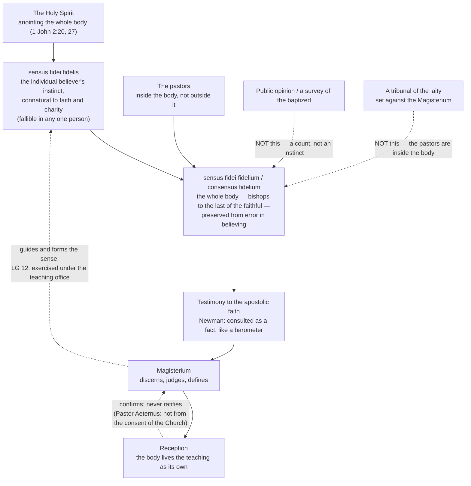

# Fundamental Theology · Lesson 5.3: The sensus fidei

> ⏱ ~15 min · Module 5: Development and method · Builds on: [5.2 Newman's theory of development](05-02-newmans-theory-of-development.md) · Unlocks: [5.4 Sacred doctrine as a science](05-04-sacred-doctrine-as-a-science.md)

## Why this matters

Newman's notes told you how to test a doctrine that has grown. This lesson asks a different question: *where does the growing happen?* Not only in a curia and a council hall. The tradition has always held that the faith lives in the whole believing body, and that this body has an instinct for it — it recognizes the ring of the true and flinches at the false before anyone can say why.

That claim gets pulled in two directions. One side hears "the sense of the faithful" and reaches for a survey: if most Catholics believe X, the Spirit has spoken. The other hears it and reaches for the mute button: the faithful are taught, not consulted. Both treat the *sensus fidei* as a **quantity of opinion**, and then either count it or dismiss it. It is not an opinion at all — which is the difference between a Church with a nervous system and a Church with a suggestion box.

## The idea

**The *sensus fidei* is a supernatural instinct for the truth of the faith, given with faith itself.** Not a conclusion reached by argument, not a preference, not a vote. The believer who has actually received the faith and lives it has an interior fitness for it, the way a chaste person recognizes what chastity requires without consulting a moral treatise. Aquinas calls this judging **by connaturality** — by inclination, because you *are* the kind of thing that the truth is about (ST II-II, q.45, a.2, on the gift of wisdom: the chaste man judges rightly about chastity by inclination, where the moral scientist judges by study). The believer's faith is not aimed at propositions as its terminus but at the reality God has revealed, and that is why the instinct can outrun the formula.

**The whole body of the faithful cannot err in believing.** That is the doctrinal claim, and it is the Church's **indefectibility in faith** — a different thing from the Magisterium's infallibility in teaching. One is *in credendo*, the believing of the whole body; the other is *in docendo*, the teaching of an office. Keep the Latin tags: they are the shortest way to stop the confusion this lesson exists to prevent.

Three words you will need, and two of them look alike:

| Term | What it names | Can it err? |
|---|---|---|
| *sensus fidei fidelis* | the **individual** believer's instinct for the faith, flowing from the theological virtue of faith and sharpened by charity and the gifts of the Spirit | **Yes.** Personal, and no personal instinct is guaranteed |
| *sensus fidei fidelium* (*consensus fidelium*) | the **whole body's** sense — pastors and faithful together — when it converges | **No**, in the sense that the whole body is preserved from error in believing |
| public opinion | what a population happens to think, measurable by survey | Constantly, and it is not a theological category at all |

The middle row is the doctrine. The first row is where each of us actually lives, which is why the top rung is not a licence for personal certainty. The third row is what the first two are chronically mistaken for.

## Source

John Henry Newman, *On Consulting the Faithful in Matters of Doctrine* (the *Rambler*, July 1859; public domain). Newman's first move is to disarm the word "consult," which his critics had heard as "ask permission of":

> …the English word "consult," in its popular and ordinary use, is not so precise and delicate in meaning; it is doubtless a word expressive of trust and deference, but not of submission. It includes the idea of inquiring into a matter of fact, as well as asking a judgment. Thus we talk of consulting a watch or a barometer…

And his account of what the *consensus fidelium* is being consulted *as*:

> …the *consensus* of the faithful… is to be regarded: 1. as a testimony to the fact of the apostolical dogma; 2. as a sort of instinct, or *phronema*, deep in the bosom of the mystical body of Christ; 3. as a direction of the Holy Ghost; 4. as an answer to its prayer; 5. as a jealousy of error, which it at once feels as a scandal.

Read the barometer sentence twice. You consult a barometer to learn a fact about the air, not to hear its opinion of your picnic. On Newman's account the Church consults the faithful the same way — to **ascertain what the apostolic faith is**, as it is actually held and lived, not to collect ballots.

## The argument

**1. The conciliar text.** *Lumen Gentium* 12 (Vatican II, 1965), paraphrased — the conciliar translations are under copyright, so nothing here is quoted. The section teaches that the whole people of God shares in Christ's prophetic office; that the body of the faithful, having an anointing from the Holy One, cannot err in matters of belief; and that it displays this property through the *sensus fidei* of the whole people when, from the bishops down to the last of the lay faithful, it shows a universal agreement in matters of faith and morals. The anointing language is scriptural (1 John 2:20, 27). The phrase about bishops and the last of the faithful is Augustine's, which the council took over.

Three clauses in that paraphrase carry the whole lesson, and each is a fence:

- **"the whole people"** — not a majority of it, and not one rank of it. The bishops are *inside* the body whose consensus is at issue, not an external auditor of it.
- **"cannot err in matters of belief"** — the guarantee attaches to *believing*, not to opining: a promise about the faith the body actually holds, not about whatever the baptized happen to think on a Tuesday.
- **"universal agreement"** — the property shows itself in *universality*. A large fraction is not a universality, and a supernatural guarantee loses its whole point the moment you report it as a percentage.

The same section settles the second misreading before it starts: the people of God exercises this sense **under the guidance of the sacred teaching office**, and in adhering to it receives not a word of men but truly the word of God. The *sensus fidei* is not constituted over against the Magisterium.

**Level.** *Lumen Gentium* is a dogmatic constitution, the council's heaviest genre — but Vatican II defined no new dogma, so section 12 carries the weight of what it restates: the Church's indefectibility in faith, which rests on Christ's promises and is firmly held teaching, not a disputed opinion. Section 12 is not itself a solemn definition, and still less is any particular application of it. So the doctrine is not up for grabs, while what counts as a manifestation of it in a given case is a matter of discernment. That distinction is the practical content of this lesson.

**2. Newman's historical case, and its fate.** Newman's 1859 essay did not stop at the principle. He argued a historical **fact**: that during the fourth-century Arian crisis, the tradition of the Church's faith in the divinity of the Son was carried more by the body of the faithful than by the body of the bishops. He pointed at the mass episcopal subscriptions to ambiguous formulas around the councils of Rimini and Seleucia (359) and the aftermath, and spoke of a temporary suspense of the functions of the *Ecclesia docens* — the teaching Church — while the *Ecclesia docta*, the taught Church, held firm. His conclusion was that indefectibility is a property of the **whole** body precisely because it cannot be guaranteed to any one rank taken alone.

The essay cost him: it was delated to Rome for heresy and he lived under a cloud for years. Republishing the material as an appended note to a new edition of *The Arians of the Fourth Century* (1871), he hedged and qualified it himself.

**Later historians have qualified it further.** Be honest about this; the lesson does not depend on the history coming out Newman's way. The fourth-century laity were not uniformly orthodox — Arian and Homoian Christianity had lay congregations, popular hymnody and imperial backing. The decisive defenders of Nicaea were bishops: Athanasius, Hilary, Basil, the Cappadocians. And twentieth-century scholarship (R. P. C. Hanson's *The Search for the Christian Doctrine of God* is the standard reference point, with Lewis Ayres for the later phase) reframes the century as a long, confused search for adequate vocabulary among several parties, not a two-sided contest between orthodoxy and Arianism; the subscriptions at Rimini were extracted under imperial pressure and widely repudiated soon after, which is a different phenomenon from apostasy.

**What survives is the doctrine, not the dramatization.** Newman's theological point — that the guarantee is given to the whole body, so no rank can be assumed to carry it alone — is what *Lumen Gentium* 12 would say a century later. The fourth century was his illustration, and a contested one. Do not repeat the illustration as though it were the argument.

**3. Discernment: the criteria.** If the *sensus fidei* is not a headcount, how do you tell a genuine manifestation of it from noise? The International Theological Commission's study *Sensus Fidei in the Life of the Church* (2014) devotes a section to the **dispositions required for authentic participation** in it. Described rather than quoted, and without claiming a canonical numbering, they run along these lines:

| Disposition | What it rules out |
|---|---|
| Real participation in the life of the Church — above all sacramental and liturgical | A "sense of the faith" belonging to someone who has left the practice of the faith behind |
| Listening to the word of God, in Scripture and as the Church reads it | An instinct formed by something other than revelation |
| Openness to reason | Sentiment and enthusiasm mistaken for supernatural instinct |
| Docility to the Magisterium — a willingness to be taught | A "sensus fidei" defined by its opposition to the Church's teachers |
| Holiness, expressed in humility, freedom and joy, and above all in charity | An instinct claimed by someone whose life contradicts the faith he claims to sense |
| Seeking to build up the Church rather than to win a faction's point | Partisanship wearing the vocabulary of the Spirit |

**These are not a scoring rubric.** They describe the kind of person in whom the faith has actually taken root deeply enough that the instinct is the faith's and not his own. Which tells you why a survey of the baptized cannot measure the *sensus fidei*: the sample is wrong in principle, not merely noisy.

**A standing warning about the source.** The ITC is an **advisory body, not the Magisterium** — see [1.1](01-01-what-fundamental-theology-asks.md). Its 2014 study is a theological argument published with approval, and it carries the weight of the argument in it, not of a teaching act. Citing it as though it settled a question is an overstatement of level, and it is graded here as an error.

**4. Reception.** The *sensus fidei* shows itself over time in **reception**: the body of the faithful taking a teaching into its life — its prayer, its preaching, its instincts — and living by it. Reception is a sign that the teaching is recognized as the faith. What it is *not* is a condition of the teaching's truth or authority. Vatican I said so in as many words (*Pastor Aeternus*, 1870, in the translation in Schaff's *Creeds of Christendom*), of the pope's *ex cathedra* definitions:

> …such definitions of the Roman Pontiff are irreformable of themselves, and not from the consent of the Church.

Hold both halves. Reception is theologically significant: a definition the believing body recognizes as its own faith is being confirmed in the ordinary way. And reception ratifies nothing — a definition is not on probation pending returns.

## Argument map

Everything solid is the doctrine. The two dotted arrows at the bottom are the two errors, drawn as arrows that do not arrive.

## Worked examples

**Example 1 (mechanical — consulting the faithful, in practice).** Before the two Marian dogmas were defined, the popes asked the bishops of the world what their people believed. Pius IX's encyclical *Ubi Primum* (1849) asked the bishops to report on the devotion of their clergy and people toward the Immaculate Conception and on their own judgment about a definition; Pius XII's *Deiparae Virginis Mariae* (1946) did the same regarding the Assumption. Both definitions followed — 1854 and 1950, the two uncontested *ex cathedra* acts.

Run Newman's distinction on this. Was the pope asking permission? No: the question put to the bishops was *what the faith of the Church is*, as it is actually held and prayed — a barometer reading. Notice three things it therefore was not. Not a poll of individuals: it went through the bishops, who are inside the body, and asked about a faith held rather than an opinion counted. Not binding on the outcome: a negative report would have been a reason to wait, not a veto, and the definitions when they came were irreformable of themselves. And not a novelty — finding out what the Church believes before defining what the Church believes is as old as the councils.

Verdict: the *sensus fidei fidelium* functioning exactly as the doctrine describes it — testimony to the apostolic faith, weighed by the office that must then judge.

**Example 2 (where it strains — non-reception).** In 1439 the Council of Ferrara–Florence promulgated a decree of union with the Greeks. Most of the Greek delegation signed; Mark of Ephesus did not. The union was repudiated in the East within decades and never took hold. Catholic theology holds Florence to be an ecumenical council still.

This cuts both ways. **Against treating reception as ratification:** Florence's status as a council does not depend on the Greek churches' acceptance, and no Catholic account says non-reception unmade it. **Against treating reception as decoration:** something real failed. A teaching the believing body does not take into its life is not operative in that body, whatever its juridical standing, and the tradition treats that as a datum demanding discernment.

Now the modern version, where students go wrong. Surveys regularly report that large fractions of baptized Catholics reject some particular teaching. Does that constitute a contrary *sensus fidei*? On everything above, no — a survey measures opinion, the sample does not select for the dispositions, and the guarantee attaches to the whole body's believing, not to a majority's answering. But the honest reading does not stop at "no." Widespread non-reception is **evidence of something**, and the ITC's treatment says as much: it may signal that a teaching has been badly presented or badly catechized, or that a real difficulty has not been met. What it cannot do is function as a counter-definition. The substance of any particular contested teaching belongs to [`moral-theology`](../../moral-theology/syllabus.md) and [`catholic-social-teaching`](../../catholic-social-teaching/syllabus.md); what belongs here is the shape of the inference — *non-reception raises a question, and answers none.*

## Watch out

- **You might think the *sensus fidei* means the faithful get a vote.** It is not a decision procedure at all. Newman's barometer is consulted for a fact; the judgment remains with those whose office it is to judge. Turning the *consensus fidelium* into a franchise changes the subject from instinct to opinion.
- **You might think it is a rival authority to the Magisterium.** *Lumen Gentium* 12 rules that out in the same breath in which it teaches the doctrine: the sense is exercised under the guidance of the teaching office. And the pastors are *members* of the body whose consensus is at issue — a "consensus of the faithful" with the bishops subtracted is not the *consensus fidelium*, whatever else it is.
- **You might think a majority is a universality.** The guarantee attaches to the agreement of the whole body. Sixty per cent of anything is not that, and neither is ninety.
- **You might think your own instinct is covered by the guarantee.** The *sensus fidei fidelis* is real and fallible; only the *fidelium* is preserved from error. This is what keeps the doctrine from becoming a licence for private infallibility — a temptation on every side of every argument.
- **You might think the ITC's 2014 study is magisterial.** It is not: advisory body, weight of its argument ([1.1](01-01-what-fundamental-theology-asks.md)). Cite it as a careful theological synthesis, which is what it is.
- **You might think Newman proved his fourth-century case.** He argued it, was punished for it, and later hedged it; historians have qualified it considerably. Argue the doctrine from *Lumen Gentium* 12, not from the Arians.
- **You might confuse the *sensus fidei* with popular religiosity.** Devotions, pilgrimages and folk piety are often genuine expressions of the people's faith, and sometimes carry superstition. Material for discernment, not an oracle.

## One-liner

> The *sensus fidei* is the whole believing body's instinct for the faith it actually holds — consulted the way you consult a barometer, not the way you consult an electorate, and never against the pastors who are part of the body.

## Problems

**P1 (🟢) *(Exegetical.)*** For each use of the phrase, say whether it is a **correct** or **incorrect** appeal to the *sensus fidei*, and give the one-clause reason.

(a) "A diocesan survey found 70 per cent of respondents favour the change, so the *sensus fidei* supports it."
(b) "Before defining the Assumption, Pius XII asked the bishops of the world what their people believed."
(c) "The faithful have their own sense of the faith, so the laity can determine doctrine independently of the bishops."
(d) "That a devotion has been prayed by ordinary Catholics in every century is evidence about the faith of the Church, to be weighed."
(e) "I have a deep interior conviction about this, so my *sensus fidei* cannot be wrong."

**P2 (🟡) *(Exegetical (a) · Evaluative (b).)*** Using the Newman passages in **Source** above:

(a) Which words in the first passage decide the meaning of "consult" that Newman is defending, and what would it take to read him as making the faithful a court of appeal? Quote the deciding words.
(b) Newman also argued a historical claim about the fourth century, which later historians have qualified. In **150 words or fewer**: does the qualification of the history weaken the doctrinal point he was using it to make? Any verdict — but say exactly which proposition the history was supposed to support, and what else could support it.

**P3 (🔴, optional) *(Exegetical.)*** An invented pastoral memo from a diocesan synod office:

> "Our listening process is the *sensus fidei* in action. Lumen Gentium 12 teaches infallibly that the faithful cannot err, and the International Theological Commission has laid down the criteria, so where our results show a clear majority we have a magisterial finding that the bishop is bound to accept. Reception by the people is what makes a teaching binding in the first place."

Name the **four** distinct errors. For each, say whether it is *false*, *overstated as to level*, or *a conflation of two distinct things*, and correct it in one sentence. **150 words or fewer.**

Solutions

**P1** *(Exegetical — strict.)*

**Must hit, strict:**
- (a) **Incorrect.** A percentage of respondents is public opinion; the guarantee attaches to the universal agreement of the whole body in believing, not to a majority in a sample.
- (b) **Correct.** This is consultation in Newman's sense — ascertaining what the faith actually held is, through the pastors, prior to a judgment that remains the pope's.
- (c) **Incorrect.** The bishops are inside the body whose consensus is at issue, and *Lumen Gentium* 12 has the sense exercised under the guidance of the teaching office; subtracting the pastors leaves something that is not the *consensus fidelium*.
- (d) **Correct.** Long-standing prayer and practice of the whole body is genuine testimony to the faith — offered as evidence to be weighed, which is the right modality.
- (e) **Incorrect.** That is the *sensus fidei fidelis*, which is personal and fallible; only the *fidelium* carries the guarantee.

**Wrong turns:** marking (d) incorrect because popular devotion can carry superstition — it can, which is why the claim is "evidence to be weighed" and not "an oracle"; marking (b) incorrect on the grounds that the pope does not need permission, which is Newman's own point, not an objection to it.

**Model answer:** (a) incorrect — a count, not a consensus. (b) correct — a barometer reading. (c) incorrect — the pastors are part of the body. (d) correct — testimony, weighed. (e) incorrect — *fidelis*, not *fidelium*, and fallible.

---

**P2** *(a) exegetical — strict; (b) evaluative — any verdict.*

**Must hit, strict (a):** the deciding words are that the word is "expressive of trust and deference, but not of submission," and that it "includes the idea of inquiring into a matter of fact, as well as asking a judgment" — with the barometer as the illustration. To read Newman as making the faithful a court of appeal you would have to take "consult" in the sense he explicitly excludes (submission) and drop the matter-of-fact sense; and you would have to ignore that a barometer is read, not obeyed. Credit for noting that the essay's title says "in matters of doctrine," not "on matters of doctrine" — the faithful are consulted about the faith they hold, not about what the faith should be.

**Must hit, any verdict (b):** identify the proposition precisely — that indefectibility in believing is a property of the **whole** body, so it cannot be assumed to reside in any single rank taken alone. Then say what else supports it: the conciliar text itself (*Lumen Gentium* 12, which locates the property in the whole people from the bishops to the last of the faithful), the scriptural anointing language, and the theological argument from connaturality. Then give a verdict on whether an illustration's failure damages the proposition it illustrated. Either verdict passes.

**Wrong turns:** treating the qualification as showing Newman was condemned and therefore wrong — he was delated, not condemned, and the delation concerned the essay's framing; defending the fourth-century case by asserting the laity were orthodox, which is the claim historians dispute and cannot simply be restated; concluding that because the illustration is contested the doctrine is contested, which conflates an argument's evidence with its conclusion.

**Model answer (b), one of several:** The history was supporting one proposition: that the guarantee of indefectibility is given to the whole body, not to the episcopate as a separable rank. Newman needed a case where a rank failed and the faith survived. Later work shows the fourth century was messier — Arian congregations existed, the great defenders were bishops, and the Rimini subscriptions were coerced and quickly repudiated. So the illustration is weak. The proposition is not, because it never depended on the illustration: *Lumen Gentium* 12 teaches it directly, locating the sense in the whole people from the bishops to the last of the faithful, and the theological argument from connaturality grounds it in what faith itself is. Newman's essay is better read as a theological argument with a contested example than as an argument from history.

---

**P3** *(Exegetical — strict.)*

**Must hit, strict:** the four errors —
1. **"Teaches infallibly that the faithful cannot err"** — **overstated as to level.** *Lumen Gentium* is a dogmatic constitution, but Vatican II defined nothing; section 12 restates the Church's indefectibility in believing, and neither the section nor any application of it is a solemn definition.
2. **"The ITC has laid down the criteria… a magisterial finding"** — **overstated as to level.** The International Theological Commission is an advisory body; its 2014 study carries the weight of its argument, not of a teaching act, and it lays down dispositions for discernment, not a procedure that yields findings.
3. **"A clear majority… the bishop is bound to accept"** — **a conflation**, of public opinion with the *sensus fidei fidelium*, and of testimony with a decision procedure; a majority is not the universal agreement of the whole body, and the results are evidence to be weighed by the one whose office it is to judge.
4. **"Reception by the people is what makes a teaching binding"** — **false.** *Pastor Aeternus*: definitions are irreformable of themselves and not from the consent of the Church. Reception confirms and manifests; it does not confer authority.

**Wrong turns:** listing "a listening process is not the *sensus fidei*" as a flat error — a listening process may well gather genuine testimony; the error is in what the memo does with the results. Attacking the synod itself rather than the four claims. Correcting error 4 by saying reception does not matter at all, which overshoots in the other direction.

**Model answer:** (1) Overstated: LG 12 restates indefectibility in believing; it defines nothing. (2) Overstated: the ITC advises, and describes dispositions, not a finding procedure. (3) Conflation: a majority in a sample is public opinion, and even genuine testimony is weighed by the bishop, not binding on him. (4) False: definitions are irreformable of themselves, not by the consent of the Church; reception manifests the faith rather than conferring authority.

## Flashback

**F1 (🟡) *(Exegetical.)*** From [5.1](05-01-vincent-of-lerins.md). A parish catechist argues: "The Church has recently begun teaching X. Since Vincent's rule is 'what has been believed everywhere, always, and by all,' and X was not taught in the fourth century, X is a corruption. Vincent's rule forbids all novelty."

(a) Name Vincent's three tests and say which one the catechist is actually applying.
(b) Vincent does not in fact forbid all change — name the distinction he draws, and give the phrase in which he says what true growth must preserve.
(c) In one clause, say what the catechist would still have to show for his conclusion to follow. **120 words or fewer.**

Solution

**Must hit, strict:**
- (a) Universality (*ubique* — everywhere), antiquity (*semper* — always), and consent (*ab omnibus* — by all). The catechist is applying antiquity alone, and applying it as a veto.
- (b) Vincent distinguishes **progress** (*profectus*) from **alteration** (*permutatio*): the faith genuinely grows and is consolidated over time, as a body grows from infancy while remaining the same body. What growth must preserve is expressed in his requirement that it be **in the same sense and the same meaning** (*in eodem sensu eademque sententia*) — the formula *Dei Filius* took up.
- (c) That X is an alteration of sense and not an unfolding of it — i.e. that the later teaching means something the earlier faith did not, rather than saying more explicitly what it already held.

**Wrong turns:** reading "always" as requiring an explicit fourth-century formulation, which would condemn *homoousios* along with everything else; treating Vincent's canon as a magisterial rule rather than a fifth-century monk's test, however influential.

## Connections

- **Backward:** [5.2](05-02-newmans-theory-of-development.md) is the same author on the same problem from the other end — his notes test a development's content, while this essay asks who carries it. [5.1](05-01-vincent-of-lerins.md)'s *ab omnibus* is the ancestor of *consensus fidelium*, and comparing them shows what Vatican II added: a *reason* why the body's agreement is testimony, namely the anointing.
- **Sideways:** [3.4](03-04-tradition.md) — the *sensus fidei* is one of the ways Tradition actually lives and is transmitted, rather than sitting in an archive. [4.2](04-02-infallibility-and-its-conditions.md) is the other indefectibility, *in docendo*; [4.3](04-03-religious-submission.md) and [4.4](04-04-the-ladder-of-doctrinal-authority.md) supply the levels this lesson keeps insisting on. [2.1](02-01-the-act-of-faith.md) is where the virtue that grounds the instinct was analysed.
- **Forward:** [5.4](05-04-sacred-doctrine-as-a-science.md) asks how theology argues from authorities, and [5.5](05-05-the-loci-theologici.md) puts the *consensus fidelium* into Cano's list of theological places — where you will see it ranked among the proper loci and have to say what a conclusion resting on it can bear.
- **Elsewhere:** the Church as the body in which this sense lives belongs to [`ecclesiology-and-mariology`](../../ecclesiology-and-mariology/syllabus.md); the fourth-century history Newman leaned on is told properly in [`church-history`](../../church-history/syllabus.md) and [`patristics`](../../patristics/syllabus.md); Orthodox theology's own account of the whole body's role in receiving a council — a serious and different position — is met in [`apologetics-catholic-claims`](../../apologetics-catholic-claims/syllabus.md).
