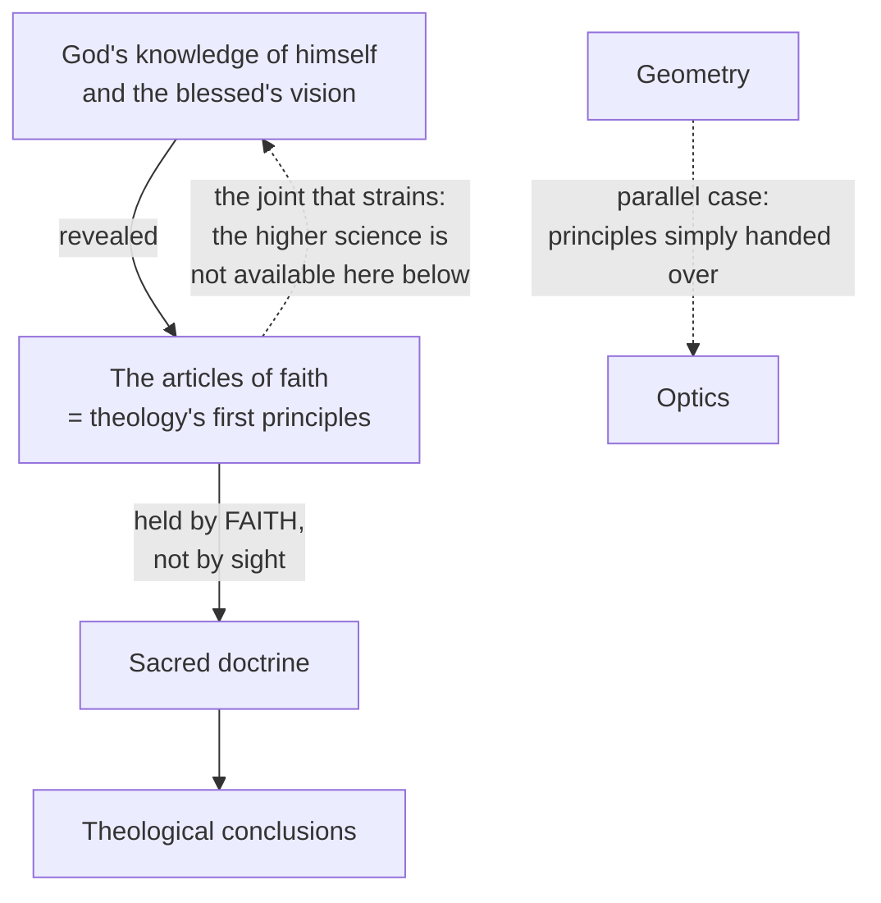
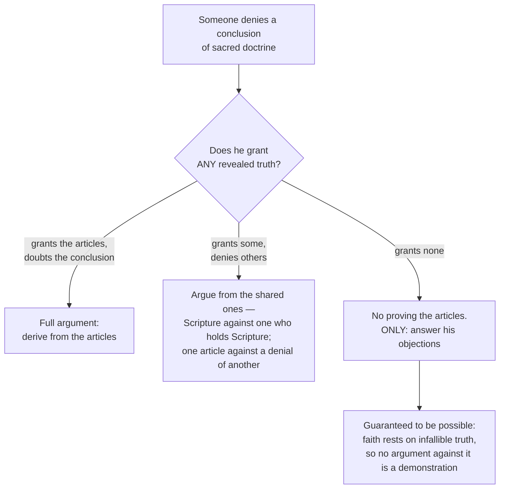

# Fundamental Theology · Lesson 5.4: Sacred doctrine as a science

> ⏱ ~15 min · Module 5: Development and method · Builds on: [5.3 The *sensus fidei*](05-03-the-sensus-fidei.md) · Unlocks: [5.5 The *loci theologici*](05-05-the-loci-theologici.md)

## Why this matters

Four modules of this course have been sorting claims: what is revealed, who teaches it, at what weight, and how it grows. None of that has yet said what *theology itself* is doing when it reasons. That is the last gap, and it is not decorative — it decides two practical things. First, whether a theological conclusion inherits the weight of the doctrine it started from (it does not, automatically, and [5.5](05-05-the-loci-theologici.md) is the machinery for saying how much it inherits). Second, what you can and cannot expect from an argument with someone who does not share your premises. Aquinas answers both in a single question, and the answers are less comfortable and more useful than the slogans they get compressed into.

## The idea

Aquinas asks two questions about theology's own method in *Summa Theologiae* I, q.1: whether it is a **science** (a.2), and whether it is a **matter of argument** (a.8). They are one question in two halves.

First, a warning about the word. *Scientia* in the thirteenth century is Aristotle's word from the *Posterior Analytics*: certain knowledge of conclusions demonstrated from principles. It is not "empirical inquiry," and the claim "theology is a science" is not a bid to stand next to physics. It is a claim about *structure* — that theology has first principles and derives from them.

The obvious objection writes itself. A science is supposed to start from principles you can see to be true. Theology starts from the articles of faith, which are precisely not evident — "all men have not faith," as Aquinas's first objection quotes. So how can theology be a science at all?

His answer is the whole lesson: **not every science sees its own first principles.** Some sciences borrow them from a higher science and get on with the work. Optics does not prove its geometry; it takes it from the geometer. Theology takes its principles from the highest knowledge there is. That borrowing has a name — **subalternation** — and everything that is right and everything that is limited about theology follows from it.

## Source

*Summa Theologiae* I, q.1, a.2, the body of the article (English Dominican Province translation, public domain):

> "Sacred doctrine is a science. We must bear in mind that there are two kinds of sciences. There are some which proceed from a principle known by the natural light of intelligence, such as arithmetic and geometry and the like. There are some which proceed from principles known by the light of a higher science: thus the science of perspective proceeds from principles established by geometry, and music from principles established by arithmetic. So it is that sacred doctrine is a science because it proceeds from principles established by the light of a higher science, namely, the science of God and the blessed. Hence, just as the musician accepts on authority the principles taught him by the mathematician, so sacred science is established on principles revealed by God."

("The science of perspective" is the Dominican rendering of *scientia perspectiva* — optics. The *sed contra* of the article cites Augustine's *De Trinitate*.)

## The argument

**The subalternation argument (a.2), in numbered form:**

> **P1.** A body of knowledge is a science when it demonstrates conclusions from first principles.
> *In words: science is derivation, not data-gathering.*
>
> **P2.** Those first principles are had in one of two ways — seen by the natural light of the mind (arithmetic, geometry), or taken on the authority of a higher science that does see them (optics from geometry, music from arithmetic).
> *In words: a real science can borrow its starting points.*
>
> **P3.** The articles of faith are the first principles of sacred doctrine, and they are known in a higher knowledge: God's knowledge of himself, and the knowledge of the blessed who see him.
> *In words: somebody does see these principles — just not us, not yet.*
>
> **∴ C.** Sacred doctrine is a science of the second kind, subalternated to the knowledge of God and the blessed.

Aquinas's reply to the first objection compresses it: the principles of any science are either self-evident in themselves, or reducible to the conclusions of a higher science — and theology's are the second sort. His reply to the second objection handles the awkward fact that the Bible is full of particular stories, which no science is supposed to be about: individual facts are in sacred doctrine not as its subject but as examples for living and to establish the authority of the men through whom revelation came.

### What subalternation does not buy

Three limits, and missing any of them turns a careful claim into an overreach.

**1. It does not make theology's conclusions provable to someone outside the faith.** Press the analogy and it strains at exactly one joint. The optician can go take the geometry course; the higher science is available to him. The theologian cannot take God's course, and will not until the vision that makes someone "blessed." So he holds the principles *by faith*, on the authority of the one who knows them — and faith, whatever else it is, does not transfer evidence. Aquinas is not hiding this; he says it outright in a.8, below.

**2. It does not turn faith into a hypothesis.** There is a way of doing theology that is pure conditional reasoning — *if* the articles were true, *then* these conclusions follow — and an unbeliever can do it competently. That is not what the subalternated scientist does. The musician does not *suppose* the mathematician's principles; he **assents** to them, on authority. In theology the authority is God revealing, which is the motive of the act of faith from [2.1](02-01-the-act-of-faith.md), and it yields a firmer assent than the evidence available would warrant. Take that away and the whole article collapses into an exercise in consequences.

**3. Whether this makes theology a science *strictly* is a live dispute.** Thomists generally hold that subalternation is enough: theology is a science properly, in the Aristotelian sense. Scotus and others objected that a science requires evidence of its principles, which the wayfarer simply lacks, so the theology we do here below is science only by extension or analogy — genuinely scientific only in God and the blessed. This is **freely disputed among Catholics**; nothing magisterial settles it, and a Catholic may argue either way. Note where it bites: the more strictly you read "science," the more weight the word carries and the less it describes what a theologian in this life actually has.

### Whether sacred doctrine is a matter of argument (a.8)

Same question from the other end. If your principles cannot be proved, what is left to argue about?

Aquinas's answer: **theology does not argue in proof of its principles; it argues from them.** No science proves its own first principles — geometry does not prove that the whole is greater than the part. His example is Paul arguing in 1 Corinthians 15 from Christ's resurrection to the general resurrection: one revealed truth carrying another.

Then the sharp part. What happens when your opponent denies your principles? Aquinas builds a ladder and then knocks it away:

> "In the case of philosophical sciences, the inferior sciences neither prove their principles nor dispute with those who deny them, but leave this to a higher science; whereas the highest of them, viz. metaphysics, can dispute with one who denies its principles, if only the opponent will make some concession; but if he concede nothing, it can have no dispute with him, though it can answer his objections."

Sacred doctrine has no science above it to appeal to, so it is in metaphysics' position, and the same triage applies:

> "Hence Sacred Scripture, since it has no science above itself, can dispute with one who denies its principles only if the opponent admits some at least of the truths obtained through divine revelation; thus we can argue with heretics from texts in Holy Writ, and against those who deny one article of faith, we can argue from another. If our opponent believes nothing of divine revelation, there is no longer any means of proving the articles of faith by reasoning, but only of answering his objections — if he has any — against faith."

("Heretic" is Aquinas's technical term for a baptized person who denies an article while retaining others; read it as a description of a logical position, not as a slur. Arguing the substance of those disagreements belongs to [`apologetics-catholic-claims`](../../apologetics-catholic-claims/syllabus.md), not here.)

And the reason answering objections is not a booby prize:

> "Since faith rests upon infallible truth, and since the contrary of a truth can never be demonstrated, it is clear that the arguments brought against faith cannot be demonstrations, but are difficulties that can be answered."

*In words: you cannot prove a true claim false, so any argument against the faith has a flaw in it somewhere; finding the flaw is honest work with a guaranteed target.* This is the same structure as the no-real-conflict teaching of *Dei Filius* ch. 4 that [2.3](02-03-fideism-and-rationalism.md) reconstructed — a theological guarantee that a flaw exists, not a promise that it is easy to find.

### The ranking of authorities (a.8, reply to the second objection)

The objection Aquinas is answering says: argument from authority is the weakest kind of proof, so a discipline that runs on authority is beneath its own dignity. His reply splits the objector's premise in half. **The argument from authority is the weakest when its authority is human reason, and the strongest when its authority is divine revelation** — and sacred doctrine's is the second. Arguing from authority is therefore not theology's embarrassment but its proper mode.

He then sorts the authorities a theologian actually cites along two independent axes. **Proper or extrinsic**: does the authority belong to theology's own principles, or is it borrowed from outside? **Conclusive or probable**: does citing it settle the point, or only make it likely?

| Authority | Proper or extrinsic | Force of the argument | Aquinas's reason |
|---|---|---|---|
| The canonical Scriptures | **Proper** — theology's own principles | **Conclusive** | Our faith rests on the revelation made to the apostles and prophets, who wrote these books |
| The doctors of the Church | **Proper** — they argue from theology's own principles | **Probable only** | Our faith does not rest on revelations, if any such there are, made to other doctors |
| The philosophers | **Extrinsic** — reached by natural reason | **Probable only** | Used where they were able to know the truth by natural reason — as Paul quotes the poet at Acts 17:28 |

Three things to notice. The two axes are **independent**: a doctor of the Church is a proper authority whose argument is still merely probable, which is the single most-missed cell in the table. The fourth cell — extrinsic *and* conclusive — is **empty**, and that is the whole shape of the thing: nothing from outside revelation can settle a question inside it. And the reason Aquinas gives for demoting the doctors is not that they are unreliable but that public revelation closed with the apostles ([1.4](01-04-public-and-private-revelation.md)) — a doctrinal reason, not a scholarly one.

This three-tier sort is the seed of the formal list. Melchior Cano's *De locis theologicis* (published 1563) expands it into ten *loci* — seven proper to theology and three extrinsic — and adds the rule that a conclusion's weight is set by its weakest premise. That is [5.5](05-05-the-loci-theologici.md), which owns the full list. What you should carry forward is the grid, not the count.

## Argument map

**Where theology's principles come from** — the borrowing, and where it stops:

**The a.8 triage** — what is available against a given opponent:

## Worked examples

**Example 1 (mechanical — running the triage).** Four interlocutors on the same evening. What does a.8 permit against each?

1. *A Catholic who holds every article but doubts a conclusion a theologian has drawn from two of them.* Full argument. Both principles are granted, so the dispute is about the derivation, and it is settled the way any derivation is — by checking the inference. This is theology's home case and, unglamorously, most of what theologians do.
2. *Someone who holds the canonical Scriptures to be God's word but denies that the Church has authority to define anything.* Middle case. He grants a revealed premise, so you argue from it: Scripture against one who holds Scripture. Note precisely what a.8 licenses — an argument *from shared revealed ground*, not a proof from neutral ground, and not the assumption that he must grant more than he has.
3. *Someone who holds every article except the general resurrection.* Aquinas's own case, and his own move: argue from another article. From Christ's resurrection to ours, as Paul does in 1 Corinthians 15. The premise is conceded; the conclusion is carried.
4. *Someone who holds nothing of divine revelation and says the Trinity is incoherent.* No proving the articles. Full stop — and the "full stop" is the point of the article, not a lapse in nerve. What remains is answering the objection, and the objection is answerable in principle, because an incoherence claim would have to be a demonstration, and there is no demonstration of the contrary of a truth. So: take the alleged contradiction apart and show it is not one. That is the *defend, illustrate, answer — never prove* licence from [2.3](02-03-fideism-and-rationalism.md), now with its justification attached.

Notice what changes across the four: not the theologian's confidence, but the **premise set he is allowed to use**. That is the only variable in the triage.

**Example 2 (where it strains — the "it's just consequences" objection).** A sharp reader pushes back:

> "Then theology is a formal game. You assume the articles and grind out consequences. So does a game theorist with his axioms, and nobody calls that knowledge of the world. Subalternation is a flattering word for 'conditional reasoning.'"

Take the objection seriously, because two-thirds of it is right.

*What the objector gets right.* No evidence for the principles transfers down the chain. A subalternated science inherits the *necessity of its inferences* from above; it does not inherit *sight of the principles*. Aquinas does not dispute this — a.8 is him conceding it in advance, in the strongest possible terms: against someone who grants nothing revealed, there is no proving the articles by reasoning. Any presentation of theology that promises a derivation the unbeliever must accept has contradicted a.8 while claiming a.2.

*Where he goes wrong.* He has substituted *supposition* for *assent*. The game theorist does not believe his axioms; the musician does believe the mathematician. Theology's principles are held with the assent of faith, whose motive is the authority of God revealing, and that assent is firmer than the evidence in hand — which is exactly what made it a distinct act back in [2.1](02-01-the-act-of-faith.md) rather than a weak conclusion. A conditional discipline and an assenting one can produce identical sentences and still be doing different things, because they differ in what is being claimed about the world.

*What honesty then requires.* Say it plainly: a theological conclusion is as certain as its weakest premise, and if a premise is held by faith the conclusion is held by faith, not demonstrated. If a premise is a philosopher's, the conclusion is probable, because the philosopher is extrinsic and probable. This is why the grid above is a working tool and not a curiosity — and why [5.5](05-05-the-loci-theologici.md) makes you tag every premise with its source before you are allowed to grade the conclusion.

And notice that the objector has walked straight into the Thomist–Scotist dispute from a.2, which is a point in his favour: the question of how much "science" theology has here below is genuinely open, and he is on one of the two live sides of it rather than outside the conversation.

## Watch out

- **You might think a.2 makes theology's conclusions provable to an outsider.** It makes them *derivable from the articles*. Whether the outsider grants the articles is the whole question of a.8, and the answer there is: if he grants nothing, you cannot prove them to him. Reading a.2 without a.8 is the standard misuse of this question.
- **You might think "answering objections" is what you do when you've lost.** Aquinas's reason makes it the opposite: because faith rests on infallible truth, an argument against faith *cannot* be a demonstration. You are not conceding a draw; you are claiming there is a flaw, and looking for it.
- **Don't attribute "the argument from authority is the weakest form of proof" to Aquinas.** It is the objector's premise in a.8. Aquinas's reply cuts it in half — weakest when the authority is human reason, strongest when it is divine revelation.
- **Don't collapse "proper" into "conclusive."** A doctor of the Church is a *proper* authority whose argument is still only *probable*. Treating any Father or Doctor as conclusive because he is an approved source is the commonest failure of theological citation, and [5.5](05-05-the-loci-theologici.md) exists partly to prevent it.
- **Don't hear "science" as modern natural science.** *Scientia* is demonstrative knowledge from principles. Importing the modern word smuggles in an evidential standard — replicability, publicly checkable data — that Aquinas never claimed and that a.8 explicitly disclaims.
- **Don't give Aquinas's schema a magisterial level.** He is the Church's common doctor, commended by *Fides et Ratio* ([2.4](02-04-fides-et-ratio.md)), and the Code directs that seminary dogmatic theology be taught with him as master. None of that makes ST I q.1 a.2 or a.8 an act of teaching. Its weight is the weight of the argument plus his standing — exactly as [1.1](01-01-what-fundamental-theology-asks.md) said of every theologian.
- **Don't confuse the two things "probable" can mean.** In this tradition it means *supported but not conclusive* — carrying real weight, arguable against. It does not mean "more likely than not," and it is not a statistical claim.

## One-liner

> Theology is a science the way optics is — it borrows its first principles from a knowledge above it, God's own, held here by faith and not by sight; which is why it can argue *from* the articles to everything else, and can never argue anyone *into* them.

## Problems

**P1 (🟢) *(Exegetical.)*** For each claim, say at what level it stands and what fixes it there: **defined doctrine**, **a theologian's position carrying no magisterial weight as such**, or **freely disputed among Catholics**. One sentence each; name the source where you can.

(a) Sacred doctrine proceeds from principles known by a higher science, namely the knowledge of God and the blessed.
(b) Theology as the wayfarer has it is a science in the strict Aristotelian sense.
(c) The canonical Scriptures are inspired and belong to the canon.
(d) In a theological argument the canonical Scriptures argue conclusively while the doctors of the Church argue only probably.

**P2 (🟡) *(Exegetical.)*** Run the a.8 triage. For each interlocutor, say what sacred doctrine may do, what it may not do, and the reason a.8 gives. 150 words or fewer, total.

(a) Someone who holds every article of faith but denies a conclusion two theologians drew from two of them.
(b) Someone who holds the canonical Scriptures to be God's word but denies one article you affirm.
(c) Someone who holds nothing of divine revelation and argues that the Incarnation is self-contradictory.

**P3 (🔴, optional) *(Exegetical (a) · Evaluative (b).)*** An invented paragraph from a seminar handout:

> "Aquinas settles it in article 2: sacred doctrine is a science. Its conclusions therefore have the standing that geometry's conclusions have — they follow necessarily from the principles, and anyone who follows the derivation is obliged to accept them. The apologist's task is simply to walk the unbeliever through the derivation carefully enough. Article 8 confirms this when it says sacred doctrine is a matter of argument."

(a) Name two things this gets wrong about a.2 and one thing it gets wrong about a.8, and for each say which of Aquinas's words decide it. (b) The author replies: a subalternated science *does* transmit necessity — the optician's theorems are as necessary as the geometer's — so nothing is missing except that the unbeliever has not yet taken the higher course, and getting him to take it is exactly the apologist's job. In 150 words, assess the reply. Any verdict passes, provided you say what the subalternation analogy transmits, and what "taking the higher course" would have to mean in theology's case.

Solutions

**P1** *(Exegetical — strict. Overstating a level is an error.)*

**Must hit, strict:**
- (a) **A theologian's position** — *Summa Theologiae* I, q.1, a.2. Aquinas's standing is enormous and his weight here is still the weight of his argument; nothing magisterial defines subalternation.
- (b) **Freely disputed among Catholics.** Thomists hold that subalternation suffices for science properly so called; Scotus and others hold that the wayfarer lacks evidence of the principles, so his theology is science only by extension. No act settles it; either side is open.
- (c) **Defined doctrine** — Trent, Session IV (1546), which is [3.3](03-03-the-canon-as-defined.md)'s text. This is the item that is *not* a theologian's schema, and the distinction from (d) is the point of the problem.
- (d) **A theologian's position** — a.8, reply to the second objection; later absorbed and formalized in Cano's *loci* ([5.5](05-05-the-loci-theologici.md)) and the manuals. That Scripture is inspired is defined; that it functions as a *conclusive* authority in theological method, while the doctors function as *probable* ones, is a methodological schema, however well received.

**Wrong turns:** promoting (a) or (d) to doctrine because Aquinas is the common doctor, or because the Code commends him as a teacher — being commended as a master is not having one's conclusions taught; treating (b) as settled in the Thomists' favour because this course teaches Aquinas's answer; demoting (c) to "common teaching" because it appears here as a premise in a methodological discussion rather than as a dogma.

**Model answer:** (a) Aquinas's own position, no magisterial weight as such; (b) freely disputed, Thomist against Scotist; (c) defined, at Trent Session IV; (d) Aquinas's schema in a.8 ad 2, not a magisterial act, though the inspiration of Scripture it rests on is defined.

---

**P2** *(Exegetical — strict.)*

**Must hit, strict:**
- (a) **Full argument.** Both principles are conceded, so the dispute is over the derivation and is settled by checking the inference. What may not be done: treat the conclusion as carrying the articles' own weight — it carries the weight of its weakest premise.
- (b) **Argue from the shared revealed premises** — Scripture, since he grants Scripture; and more generally, against one who denies one article, argue from another he grants. What may not be done: assume premises he has not granted, or claim a proof from neutral ground.
- (c) **No proving the articles by reasoning** — that is a.8's explicit limit when the opponent grants nothing revealed. What remains is answering the objection, and it is answerable in principle: faith rests on infallible truth, and the contrary of a truth can never be demonstrated, so the self-contradiction charge cannot be a demonstration but is a difficulty with a flaw in it.

**Wrong turns:** giving (c) an apologetic proof of the Incarnation from natural reason, which a.8 forbids and which [2.3](02-03-fideism-and-rationalism.md) already diagnosed as the rationalist shape; treating (b) as if denying one article forfeited the shared ground — Aquinas's whole point is that the remaining shared articles are usable; describing (a) as needing no argument because everything is agreed.

**Model answer:** (a) Argue in full from the shared articles; the quarrel is the inference, and the conclusion holds only as firmly as its weakest premise. (b) Argue from what he grants — the Scriptures he accepts, or another article — never from premises he has not conceded. (c) You cannot prove the articles to him; you can only answer his objection, and a.8 guarantees there is something to find, since faith rests on infallible truth and no demonstration of a truth's contrary exists.

---

**P3** *(a) exegetical — strict; (b) evaluative — any verdict.*

**Must hit, strict (a):** two from a.2 —
1. **It ignores which kind of science a.2 assigns.** Aquinas's own division is between sciences proceeding "from a principle known by the natural light of intelligence, such as arithmetic and geometry" and sciences proceeding "from principles known by the light of a higher science." Geometry is his example of the *first* kind; sacred doctrine is placed in the *second*. The handout has assimilated theology to precisely the case Aquinas contrasts it with.
2. **It confuses the necessity of the inferences with access to the principles.** Subalternation transmits the first; the principles themselves are, in Aquinas's phrase, accepted "on authority" the way the musician accepts the mathematician's — and here that authority is God revealing, so the principles are held by faith and not by sight.

And from a.8 —
3. **"A matter of argument" does not mean "argument to the articles."** Sacred doctrine "does not argue in proof of its principles… but from them." Against one who believes nothing of divine revelation "there is no longer any means of proving the articles of faith by reasoning, but only of answering his objections." The handout's programme is the one sentence a.8 rules out.

**Must hit, any verdict (b):** state what the analogy transmits (the necessity of the derivation, and the truth of the conclusions *given* the principles — not evidence for the principles); and say what "taking the higher course" would have to be here — either the vision of the blessed, which is not available in this life, or faith, which is an assent on God's authority and a gift, not the output of a derivation. Whether the apologist's job is nonetheless well described as *disposing* someone toward that assent, using the motives of credibility from [2.2](02-02-credibility-and-the-preambles-of-faith.md), is exactly where either verdict is available.

**Wrong turns:** conceding the analogy entirely and concluding theology is merely conditional reasoning — that drops the assent and is Example 2's error in the other direction; ruling apologetics out altogether, which a.8 does not do (it licenses arguing from shared revealed premises, and answering objections in every case); arguing about whether the Incarnation is coherent, which is not what was asked.

**Model answer (b), one of several:** The analogy transmits necessity downward and nothing upward. The optician's theorems are necessary *given* the geometry, and the unbeliever's problem is not that he has failed to follow a derivation but that he does not hold what the derivation starts from. "Taking the higher course" has no classroom in this life: the science subalternating theology is God's and the blessed's, so the only way to hold its principles here is faith, which is an assent on God's authority rather than a conclusion. That does not leave the apologist idle — he can argue from any revealed premise his interlocutor grants, answer every objection, and press the motives of credibility until believing is manifestly not rash. What he cannot do is finish the job with a derivation, and a.8 says so in as many words.

## Flashback

**F (🟡) *(Exegetical.)*** From [5.2](05-02-newmans-theory-of-development.md). An invented paragraph from a lecture, defending a technical term as a development rather than an innovation:

> "The word is thirteenth-century; nothing it says is. The earliest liturgies already handle the consecrated elements as the Lord's own body and arrange their whole ritual around that, centuries before there was any controversy to win by saying so. When the Aristotelian vocabulary of substance and accident became available, the Church took it up and made it carry what she had been doing all along. And once the term was fixed, it became harder, not easier, to read the earlier centuries as having meant something thinner."

(a) The paragraph leans on three of Newman's seven notes. Name each and quote the clause that carries it. (b) Name one note it does not address at all, and say in one sentence what the lecturer would have to show to satisfy it. (c) In one sentence: why does the gap you found in (b) not by itself convict the development of being a corruption? Bound the whole answer at 150 words.

Solution

**Must hit, strict (a):** the three, in the order they appear —
- **Anticipation of its future** — "centuries before there was any controversy to win by saying so": early practice pointing at a doctrine not yet formulated, and pointedly without a motive to fabricate it.
- **Power of assimilation** — "took it up and made it carry what she had been doing all along": the idea absorbs a foreign philosophical vocabulary and puts it to its own work, rather than being reshaped by it.
- **Conservative action upon its past** — "harder, not easier, to read the earlier centuries as having meant something thinner": the later formulation secures and protects the earlier stage instead of superseding it.

**Must hit, strict (b):** any one of **preservation of type**, **continuity of principles**, **logical sequence**, or **chronic vigour**, with a burden stated rather than a verdict. Sample burdens: *preservation of type* — state what the idea's own shape is, independently of the technical term, and show the later stage exhibits the same arrangement of parts; *continuity of principles* — identify the principle both stages run on and show it is the same one; *logical sequence* — exhibit the later formulation as a reasoned consequence of what the earlier period held explicitly; *chronic vigour* — show the doctrine's career is not a bounded episode that burned out.

**Must hit, strict (c):** the notes are cumulative tests applied together to a concrete history, yielding a converging judgement, not premises in a demonstration — so an unaddressed note leaves the case incomplete rather than refuted, and a single failed note weakens a case without settling it.

**Wrong turns:** naming *preservation of type* for the assimilation clause — type is what the idea *is*, and the clause is about absorbing foreign material; naming *logical sequence* for the anticipation clause, which reports an early trace rather than a derivation; treating a note the paragraph simply does not mention as a note it *fails*; reading the seven notes as a checklist with a pass mark.

## Connections

- **Backward:** [2.3](02-03-fideism-and-rationalism.md) took the *defend, illustrate, answer — never prove* licence from this same a.8; this lesson supplies the reason behind it and the triage that says when even "defend" has shared ground to stand on. The assent that keeps subalternation from being conditional reasoning is [2.1](02-01-the-act-of-faith.md)'s act of faith, and the motives of credibility that make it responsible are [2.2](02-02-credibility-and-the-preambles-of-faith.md)'s. The demotion of the doctors to *probable* rests on the closure of public revelation with the apostles, from [1.4](01-04-public-and-private-revelation.md).
- **Forward:** [5.5](05-05-the-loci-theologici.md) takes the three-tier grid here — proper and conclusive, proper and probable, extrinsic and probable — and turns it into Cano's ten *loci* plus the rule that a conclusion is graded by its weakest premise. Everything this lesson leaves as a principle becomes a procedure there. The levels a conclusion can end up carrying are [4.4](04-04-the-ladder-of-doctrinal-authority.md)'s ladder.
- **Where it goes:** [`thomistic-synthesis`](../../thomistic-synthesis/syllabus.md) takes up the rest of the *Summa* from exactly here — its 1.3 reads the other articles of q.1 (a.1, and aa.3–7) for what the whole work's plan depends on: one science, whose subject is God, treating everything else under the aspect of God. This lesson owns a.2 and a.8 and that course cites them rather than redoing them. Whether any argument for God's existence succeeds remains [`philosophy-of-religion`](../../philosophy-of-religion/syllabus.md)'s question, and Aquinas read historically, in his thirteenth-century setting, is [`ancient-medieval-philosophy`](../../ancient-medieval-philosophy/syllabus.md)'s.
- **Sideways:** *fides quaerens intellectum* — Anselm's phrase, from [1.1](01-01-what-fundamental-theology-asks.md) — is now fully cashed out. **Faith** supplies the principles, which is why theology is not autonomous and cannot prove its own starting points. **Seeking** is the derivation a.2 licenses, and it is genuine work with genuine results. **Understanding** is what a subalternated science can honestly deliver: conclusions as firm as their sources, an ordered grasp of how the mysteries hang together, and an answer to every objection — but never the sight that would end the seeking. That is reserved for the science this one is subalternated to.
