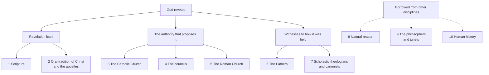

# Fundamental Theology · Lesson 5.5: The loci theologici

> ⏱ ~15 min · Module 5: Development and method · Builds on: [5.4 Sacred doctrine as a science](05-04-sacred-doctrine-as-a-science.md) · Unlocks: nothing — this is the last lesson of the course

## Why this matters

[4.4](04-04-the-ladder-of-doctrinal-authority.md) taught you to read a level off a finished claim: here is the Assumption, here is the act that defined it, here is what denying it would be. But most theological work is not reading finished claims. It is *building* — assembling premises from Scripture, a council, a Father, a theologian, a fact about the world, and drawing a conclusion nobody has defined.

That kind of argument needs its own grading, because a conclusion cannot be firmer than what holds it up. Get it wrong in the generous direction and you announce as "the teaching of the Church" something two theologians inferred; get it wrong the other way and you file a council's definition as one opinion among several. Melchior Cano wrote the map that prevents both.

## The idea

**A *locus* is an address, not an authority.** The word comes from rhetoric and dialectic — Aristotle's *Topics*, Cicero's *Topica* — where a *locus* (Greek *topos*, "place") is a standing place you go to *find* an argument: from the definition, from the contrary, from the consequences. Cano's question is the theological version: when a theologian needs a premise, what addresses may he go to, and how much does a premise weigh depending on which door it came out of?

Melchior Cano (a Spanish Dominican who held a chair of theology at Salamanca and died in 1560) answered with ten. *De locis theologicis* was published posthumously in 1563: twelve books — one introducing the scheme, one on each locus, and a last on using them in actual argument. It did two things at once, which is why it lasted: it **inventoried** the sources exhaustively, so a theologian could tell whether he had missed one, and it **ranked** them, which is what makes it possible to grade a conclusion rather than merely have it.

One confusion to clear immediately. Melanchthon's *Loci communes* (1521) uses the same word for doctrinal headings — sin, law, grace — under which material is organized. Cano's loci are not topics to write about; they are places to argue *from*.

## The argument

**The ten loci, and the division that does the work.** Cano splits them into the *proper* loci, which belong to theology itself, and the *extrinsic* or borrowed loci, which belong to other disciplines and are lent to theology.

| # | Locus | Kind | What it is |
|---|---|---|---|
| 1 | Sacred Scripture | Proper | Revelation itself, written |
| 2 | The oral traditions of Christ and the apostles | Proper | Revelation itself, handed on unwritten ([3.4](03-04-tradition.md)) |
| 3 | The Catholic Church | Proper | The whole Church's faith and practice — what she believes, prays and does |
| 4 | The councils | Proper | Conciliar acts, general councils above the rest |
| 5 | The Roman Church | Proper | The authority of the apostolic see |
| 6 | The Fathers | Proper | The ancient saints, as witnesses to what was held |
| 7 | The scholastic theologians, with the canonists | Proper | The tradition's trained interpreters |
| 8 | Natural reason | Extrinsic | What unaided reason establishes |
| 9 | The philosophers, and the jurists | Extrinsic | The authority of those who follow nature as guide |
| 10 | Human history | Extrinsic | Attested fact — historians, records, the world as it is |

In words: the first seven have theological force *because* they stand in some relation to God's revealing — either they *are* the revealed word (1–2), or they are the authority that tells us what it contains (3–5), or they are the tradition's witnesses to how it has been read (6–7). The last three have no such relation; they are good arguments from outside, brought in.

Two things the list is easy to misread. **The extrinsic loci are not decorative.** Cano's claim is that their force in theology is genuinely probative — a sound argument from reason or a settled historical fact really does support a theological conclusion. They are subordinate, not optional. And **loci 6 and 7 carry weight chiefly by consent.** One Father is a witness; the Fathers *unanimously*, on a matter of faith or morals, is a criterion the Church herself has made binding — both Trent (Session IV) and Vatican I's *Dei Filius* forbid interpreting Scripture against the unanimous consent of the Fathers. A single patristic sentence is evidence, not proof.

**The grading rule.** The tradition's logical tag is *conclusio sequitur debiliorem partem* — the conclusion follows the weaker part. Applied to theological argument:

> **The theological note of a conclusion is capped by the note of its weakest load-bearing premise.**

In words: your conclusion is only as strong as the flimsiest thing it actually stands on. *Load-bearing* means: take the premise away and the conclusion fails. Premises that merely illustrate, confirm or decorate do not count — which is why the first step in grading an argument is to strike out everything that is there for colour.

Three corollaries, and the third is the one people miss.

- **Mixing levels caps at the bottom.** An argument whose minor premise comes from a Father (locus 6) and whose major comes from a philosopher (locus 9) yields a *probable* or at best a commonly held theological conclusion. It does not yield anything *de fide*, no matter how certain the Father and the philosopher each were.
- **Stacking weak premises does not help.** Four probable premises do not make a certain conclusion. They make a better-supported probable one.
- **The cap is on the argument, not on the claim.** "This argument can only reach *theologice certa*" is a statement about your reasoning. The conclusion may nonetheless be defined dogma — established by an act you did not invoke. Confusing the two produces both of the classic errors: denying a dogma because someone's argument for it was weak, and promoting an inference because its conclusion happens to be true.

**The modern restatement.** The International Theological Commission's *Theology Today: Perspectives, Principles and Criteria* (2012) asks Cano's question again. Two cautions before using it. It is an **advisory** document — the ITC is a body of theologians serving the Congregation for the Doctrine of the Faith, not an organ of the Magisterium — so in Cano's own scheme it sits at locus 7, and its weight is the weight of its argument. And it is modern and copyrighted, so it is paraphrased here and cited by name.

Its drift, in summary: theology is Catholic when it listens to the word of God in Scripture and Tradition as its first and governing source, when it is done from inside the faith of the Church rather than about it, and when it keeps company with the sensus fidelium, the liturgy, the Fathers and doctors, the saints, and the authentic Magisterium as the word's authorised interpreter — while engaging philosophy, the human sciences and other cultures as genuine but subordinate partners. Two shifts from Cano. The ITC's list is a set of **criteria for whether theology is Catholic**, where Cano's was an inventory of **authorities to cite**; and it names the liturgy and the sense of the faithful ([5.3](05-03-the-sensus-fidei.md)) as sources in their own right, where Cano folded them into locus 3. The ranking logic is the same: revelation first, the Magisterium as authentic interpreter, the consensus of theologians as real evidence that is not a teaching act.

## The case: an argument about usury, graded

This is the procedure, run end to end. **The question:** is it sinful to take interest on a loan?

Step one — collect the premises and tag each with its locus and its weight. (The substance of usury belongs to [`theology-of-debt`](../../theology-of-debt/syllabus.md); it is here as a method case, because the loci pull in visibly different directions.)

| Premise | Locus | Kind | Weight it can carry |
|---|---|---|---|
| **P1.** Scripture forbids lending at usury — "lend, hoping for nothing thereby" (Luke 6:35); "Thou shalt not lend to thy brother money to usury" (Deuteronomy 23:19), both Douay–Rheims | 1 | Proper | The highest available — but *what* the texts forbid, and whether a counsel of charity is also a precept of justice binding everyone, is interpretation, and no reading of these verses has been defined |
| **P2.** The Fathers condemn interest-taking with near-unanimity | 6 | Proper | Strong, because near-unanimous on a matter of morals — weakened to the extent that what they condemn is a practice in one economy |
| **P3.** Lateran III (1179) barred manifest usurers from communion and from Christian burial; the Council of Vienne (1311–12) declared that anyone obstinately asserting that practising usury is not a sin is to be punished as a heretic | 4 | Proper | Very high. This premise, not P1 or P2, is what actually carries the claim that usury is sinful |
| **P4.** Benedict XIV's *Vix Pervenit* (1745): the sin consists in demanding, **by reason of the loan itself**, more than was given — while titles extrinsic to the loan contract may justify a return | 5 | Proper | Authentic ordinary magisterium (an encyclical, [4.5](04-05-reading-a-documents-weight.md)) — and note that it builds the limit into the doctrine |
| **P5.** Aquinas: to charge for the use of a thing whose use *is* its consumption is to sell the same thing twice (ST II-II, q.78, a.1) | 7 | Proper | A theologian's argument. Weighty, not probative on its own |
| **P6.** Money is barren and does not naturally breed (Aristotle) | 9 | **Extrinsic** | Probable — and it is a claim about money, which is not a revealed subject |
| **P7.** A modern interest-bearing loan is the same contract as the *mutuum* the tradition analysed | 10 + 8 | **Extrinsic** | Whatever the facts about money, risk and forgone use will bear — this is economics and history, not theology |

Step two — read off what each conclusion can honestly claim.

> **Conclusion A.** *To demand a return by reason of the loan itself, beyond what was given, is sinful.*
> Load-bearing: P1–P4, every one of them a proper locus, with P3 and P4 doing the real work. Nothing extrinsic is holding this up. **Note:** at least theologically certain, and a Catholic cannot simply say the tradition was mistaken to call usury a sin — Vienne treated obstinate denial as a matter for the heresy penalty. Whether the claim is *de fide* is itself argued among theologians; say "certain" and say that the rung above is disputed.

> **Conclusion B.** *Therefore taking interest on an ordinary bank loan today is sinful.*
> Load-bearing: everything above **plus P7** — because B follows only if today's loan is that contract. P7 is extrinsic, and it is load-bearing. **Note:** capped at probable. And in fact the tradition did not sustain it: a series of nineteenth-century replies from the Roman congregations told confessors not to disturb penitents taking the legal rate, and the modern law of the Church presumes interest-bearing investment.

That gap is the whole lesson. The proper loci fix the **principle**; the extrinsic loci carry the **minor premise** about what sort of thing a modern loan is — and the minor premise is where the note gets capped. Nothing here required the doctrine to change. What changed was a premise that was never theological to begin with, which is exactly the shape [5.2](05-02-newmans-theory-of-development.md) told you to look for when asking whether a change is development or corruption.

## Worked examples

**Example 1 (mechanical — grade someone else's argument).** A friend writes: "St. Augustine taught that the soul's grasp of unchanging truth shows it cannot perish, and Plato's argument from the soul's simplicity says the same. So Catholics must hold that the soul is immortal."

Tag the premises: one Father, not the Fathers unanimously (locus 6, proper but limited); one philosopher (locus 9, extrinsic). Both load-bearing. Cap: **probable**, or at most a common theological opinion — this argument cannot deliver "must hold."

But now the third corollary. The conclusion *is* taught at a high level — the Fifth Lateran Council (1513) condemned the assertion that the intellectual soul is mortal. So the honest report has two sentences, not one: *your argument establishes a probable conclusion; the claim itself stands on a conciliar act you did not cite.* Fix the argument by fetching the premise from locus 4 and the whole note moves.

**Example 2 (where the rule strains — dogmatic facts).** Consider: *Trent was a genuine ecumenical council*, or *this man is validly the pope*. The matter is plainly historical — who was summoned, who confirmed, who was elected — which is locus 10, extrinsic. By the rule, the conclusion should cap low. Yet [4.4](04-04-the-ladder-of-doctrinal-authority.md) puts dogmatic facts on the ladder's second rung: definitive teaching, to be held.

The rule is not broken, because it never governed this. **The cap applies to what an argument yields, not to what an act of teaching establishes.** Once the Church herself teaches that Trent is ecumenical, a proper locus (3–5) carries the conclusion directly; you are no longer reasoning to it from archives, you are receiving it. History's role changes from *premise* to *occasion* — the thing the judgement is about, not the thing it rests on. The diagnostic question is always: **which locus is actually holding this up right now?**

## Watch out

- **You might treat a locus as an authority in itself.** It is an address. What you find at loci 6 and 7 is evidence whose force comes from consent and argument; what you find at 1–5 is authority. Same list, different currencies.
- **You might read "extrinsic" as "worthless."** Cano's point is the opposite: these arguments are genuinely probative, and theology that ignores reason, philosophy and established fact is bad theology. They just cannot lift a conclusion to the level of faith.
- **You might confuse "this argument caps at X" with "this claim is only X."** Corollary three. They are different sentences about different things.
- **You might cite the ITC as the Magisterium.** *Theology Today* (2012) and *Sensus Fidei* (2014) are advisory studies by theologians — locus 7, not locus 5. Citing them as "the Church teaches" is the same error as citing Denzinger as an authority ([1.1](01-01-what-fundamental-theology-asks.md)).
- **You might over-tidy a genuinely open question.** Whether a conclusion drawn from one revealed premise and one naturally known premise can itself be *de fide* — the "virtually revealed" dispute — is freely argued among Catholic schools. Present it as open.
- **"The Roman Church" is locus 5, meaning the authority of the apostolic see** — not Italian custom, and not everything issued from Rome regardless of genre. Genre still decides weight ([4.5](04-05-reading-a-documents-weight.md)).

## One-liner

> A theological argument is only as strong as its weakest load-bearing source — so name the locus of every premise before you name the level of your conclusion.

## Problems

**P1 (🟢) *(Exegetical.)*** For each source, name its locus by number and say whether it is proper or extrinsic. One clause each.

(a) A canon of the Council of Trent
(b) Aristotle's account of justice in the *Nicomachean Ethics*
(c) The fact that by the fourth century the Church prayed for the dead in both East and West
(d) A carbon-dated manuscript establishing when a text was written
(e) Aquinas on the virtue of religion in the *Summa*

**P2 (🟡) *(Exegetical (a), (b) · Evaluative (c).)*** An invented argument from a theology blog:

> "(1) Scripture says God desires all men to be saved. (2) The Fathers of the fourth century speak of God's universal saving will. (3) Modern psychology shows that no one freely chooses eternal misery with full knowledge. (4) Therefore it is the teaching of the Catholic faith that hell is empty."

(a) Tag each of (1)–(4) with its locus and say which are load-bearing. (b) State the highest note this argument can honestly claim for its conclusion, and rewrite the conclusion's opening clause so that it claims exactly that much. (c) The author replies that (3) is only a confirmation, so it shouldn't cap anything. In **150 words or fewer**, assess the reply — any verdict, provided you say what would make a premise load-bearing and apply that test to (3).

**P3 (🔴, optional) *(Exegetical.)*** A footnote reads: *"See the International Theological Commission, Theology Today (2012), which teaches that the sensus fidelium is a source of theology."*

(a) Name the error in the word "teaches" and say where the ITC sits in Cano's scheme. (b) Say what the footnote *could* honestly claim, and what a writer would have to cite instead to claim more. **100 words or fewer.**

Solutions

**P1** *(Exegetical — strict.)*

**Must hit, strict:**
- (a) Locus 4, the councils — proper.
- (b) Locus 9, the philosophers — **extrinsic**.
- (c) Locus 3, the Catholic Church — **proper**. This is the trap: the Church's universal practice and prayer is a theological locus in its own right, not a fact about the past.
- (d) Locus 10, human history — extrinsic.
- (e) Locus 7, the scholastic theologians — proper, but weighty by consent and argument rather than by authority.

**Wrong turns:** filing (c) under human history because it is a claim about the fourth century — what makes it locus 3 is that it is the Church's own believing and praying, which is the *lex orandi* argument; filing (e) under locus 6 by promoting Aquinas to a Father; assuming "extrinsic" means the premise is weak.

**Model answer:** (a) 4, proper. (b) 9, extrinsic. (c) 3, proper — the Church's practice, not merely a historical datum. (d) 10, extrinsic. (e) 7, proper.

---

**P2** *(a), (b) exegetical — strict; (c) evaluative — any verdict.*

**Must hit, strict (a):** (1) locus 1, Scripture — load-bearing. (2) locus 6, the Fathers — load-bearing as stated, since it is supplying the tradition's witness; note that "speak of God's universal saving will" is not the same as "teach that no one is lost," so as worded it may not support the conclusion at all. (3) locus 8 and/or 9 — **extrinsic**, and load-bearing: without it the argument gets from "God wills all to be saved" to nothing about the actual outcome, because the missing step is about creaturely freedom. (4) is the conclusion, not a locus.

**Must hit, strict (b):** capped by (3), an extrinsic premise from reason and an empirical science — so **probable at best**, and weaker still because (2) is being stretched. The rewritten clause must drop the magisterial claim: something like "Therefore it is a defensible theological opinion that…" or "Therefore there is some reason to hope that…" Anything of the form "the Church teaches," "it is of faith," or "Catholics must hold" is an overstatement and marked wrong.

**Must hit, any verdict (c):** give the test — a premise is load-bearing if removing it breaks the inference — and run it on (3). Either verdict passes; what does not pass is asserting that (3) is confirmatory without testing it.

**Wrong turns:** arguing about whether hell is empty, which is not what was asked; calling (3) extrinsic and therefore worthless rather than extrinsic and therefore capping; treating (1) as settling the conclusion because Scripture is the highest locus — the locus is highest, the *reading* is the inference under scrutiny.

**Model answer (c), one of several:** The reply fails on its own test. Strike (3) and the argument reads: God wills all to be saved, the Fathers say so too, therefore none are lost — which does not follow, because a universal divine will plus creaturely freedom is precisely the gap (3) was hired to close. A premise is confirmatory only when the inference survives its deletion; this one does not. So (3) is load-bearing, it is extrinsic, and it caps the conclusion at probable. That is not a complaint about psychology — it is a statement about which shoulder the weight is on.

---

**P3** *(Exegetical — strict.)*

**Must hit, strict:**
- (a) The ITC does not teach; it is an advisory body of theologians serving the CDF, and *Theology Today* is not a magisterial act. In Cano's scheme it is **locus 7** — theologians — not locus 5.
- (b) Honestly: "the ITC *argues*," or "a study of the ITC sets out the sensus fidelium among the criteria of Catholic theology." To claim that the Church teaches it, the writer must cite the magisterial source — Lumen Gentium 12 for the sensus fidei itself.

**Wrong turns:** thinking the document is worthless because it is advisory; thinking "approved for publication by the CDF" converts a study into a teaching act.

**Model answer:** "Teaches" upgrades an advisory study into a magisterial act. The ITC is a body of theologians — locus 7, whose weight is the weight of its argument. The footnote can say the ITC argues or sets out this position; for "the Church teaches," cite Lumen Gentium 12.

## Flashback

**F1 (🟡) *(Exegetical (a), (b) · Evaluative (c).)*** From [5.3](05-03-the-sensus-fidei.md). A diocesan newspaper reports: "A survey found that 71 percent of Catholics in this diocese disagree with the Church's teaching on X. The sensus fidelium has spoken; the Magisterium should follow."

(a) Say what the sensus fidei is a sense *of*, and why that makes the survey's inference a category mistake rather than merely a weak one. (b) Name two conditions the ITC's 2014 study requires before a widely held view among the faithful counts as an expression of the sensus fidei. (c) In **150 words or fewer**: a reader objects that these conditions let the Magisterium disqualify any inconvenient result, so the sensus fidei does no independent work. Assess — any verdict, provided you say what independent work it would have to do to count, and give one historical or doctrinal case where it plausibly did.

Solution

**Must hit, strict (a):** the sensus fidei is a **supernatural instinct for the faith**, given with faith itself by the Holy Spirit, by which the believing subject recognizes and adheres to the truth of revelation — a connaturality with what is revealed, not a preference about it. So a survey measures opinions held by baptized people; the sensus fidei is an instinct of *faith*, and the two are not the same quantity. That is the category mistake: the survey is not a bad measurement of the thing, it is a measurement of a different thing. Lumen Gentium 12 locates it in the whole body of the faithful, who cannot err *in believing*, and ties it to the guidance of the Magisterium rather than setting it against it.

**Must hit, strict (b):** any two of the ITC's dispositions — participation in the life of the Church (sacraments, prayer, liturgy); listening to the word of God; docility to the Magisterium as the authentic teacher rather than opposition to it; holiness and charity; seeking the building up of the Church rather than a faction. Naming two, in substance, suffices.

**Must hit, any verdict (c):** state what "independent work" means here — the sensus fidei would have to be capable of pressing in a direction the Magisterium had not already taken, and that pressure would have to be recognizable in advance rather than only after ratification. Then give a case and say whether it meets that bar: the classic candidate is the fourth-century laity's adherence to Nicene faith through the Arian crisis, Newman's example in *On Consulting the Faithful in Matters of Doctrine* (1859); the Marian definitions of 1854 and 1950, where the faithful's belief long preceded the act, are another. Either verdict passes.

**Wrong turns:** answering (a) by saying the survey sample was too small — the objection is not statistical; treating the conditions as a scoring rubric with a pass mark; in (c), citing a case without saying whether it actually shows independence or only prior agreement.

## Connections

- **Back:** [5.4](05-04-sacred-doctrine-as-a-science.md) showed that sacred doctrine argues from authorities and ranked them (ST I, q.1, a.8); this lesson is that ranking turned into an inventory and a grading rule. [4.4](04-04-the-ladder-of-doctrinal-authority.md) supplies the levels the rule assigns, and [4.5](04-05-reading-a-documents-weight.md) supplies the genre-reading that fixes what a locus-5 document actually weighs.
- **Sideways:** the "which premise is load-bearing" move is [`philosophical-method`](../../philosophical-method/syllabus.md)'s reconstruction discipline, used here and not retaught. The usury case is [`theology-of-debt`](../../theology-of-debt/syllabus.md)'s subject; here it was only a specimen.
- **Boss problem 5** asks you to run this procedure on religious liberty: premises tagged by locus and note, conclusion graded honestly. The table in "The case" is the template — copy its columns.

## Closing the course

You started with a question about a discipline — what does fundamental theology ask? — and you end holding a set of tools that work on any theological claim you will meet:

- **Read a claim and find its act.** Not "the Church says," but *which* Church organ, in which document, of which genre, in which year ([4.1](04-01-the-magisterium.md), [4.5](04-05-reading-a-documents-weight.md)).
- **Assign its level and say what assent is owed** — and what denying it would amount to. This is the course's signature skill and the one every other Catholic Theology course will assume you have ([4.4](04-04-the-ladder-of-doctrinal-authority.md)).
- **Weigh a document** by genre and insistence, without confusing a compendium with a defining act, an index with an authority, or an advisory study with the Magisterium.
- **Tell development from corruption**, with Vincent's test and Newman's notes in hand, and know which questions the tests leave genuinely open ([5.1](05-01-vincent-of-lerins.md), [5.2](05-02-newmans-theory-of-development.md)).
- **Build and grade a theological argument** from its sources — this lesson.

And underneath all of it, the doctrinal substance those tools operate on: what the Church claims about reason's reach and God's speaking (Module 1), what the act of faith is and why it is neither blind nor a conclusion (Module 2), and how the revealed word reaches you through a book and a living transmission (Module 3).

Where each thread goes next:

- **Scripture and Tradition** → [`old-testament`](../../old-testament/syllabus.md), [`new-testament`](../../new-testament/syllabus.md) and [`patristics`](../../patristics/syllabus.md), which do the exegesis and the reading of the Fathers that this course deliberately ceded.
- **Faith and reason** → [`philosophy-of-religion`](../../philosophy-of-religion/syllabus.md) for the arguments about God's existence this course only pointed at, and [`apologetics-foundations`](../../apologetics-foundations/syllabus.md) for the case made to someone outside.
- **Infallibility and the Magisterium** → [`ecclesiology-and-mariology`](../../ecclesiology-and-mariology/syllabus.md) institutionally, [`church-history`](../../church-history/syllabus.md) for the events, and [`apologetics-catholic-claims`](../../apologetics-catholic-claims/syllabus.md) where the doctrine is argued against its critics.
- **Development** → [`moral-theology`](../../moral-theology/syllabus.md) for disputed moral teaching, [`catholic-social-teaching`](../../catholic-social-teaching/syllabus.md) for religious liberty and the state, and [`theology-of-debt`](../../theology-of-debt/syllabus.md) for the usury case run to the bottom.
- **Method** → [`thomistic-synthesis`](../../thomistic-synthesis/syllabus.md), through the door ST I, q.1 opened in [5.4](05-04-sacred-doctrine-as-a-science.md); and from there the dogmatic sequence, [`christology`](../../christology/syllabus.md) and [`trinity-and-god`](../../trinity-and-god/syllabus.md), where every claim you meet will carry a note you now know how to check.
