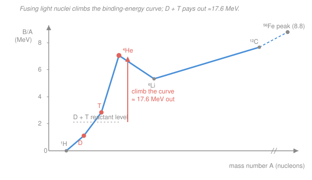

# Fusion & Plasma Engineering · Lesson 1.1: Why fusion, why D-T

> ⏱ ~15 min · Module 1: Fusion Reactions & Confinement Criteria · Builds on: [`intro-nuclear-engineering` syllabus](../../intro-nuclear-engineering/syllabus.md) (binding energy, fusion basics) · Unlocks: [1.2 The Coulomb barrier & tunneling](01-02-coulomb-barrier-tunneling.md)

## Why this matters

Every fusion machine — ITER's 23,000-tonne tokamak, SPARC's high-field bet, NIF's 192 lasers — is an answer to one prior question: *which two nuclei do we slam together, and how much do we get back?* Get the fuel wrong and no amount of confinement engineering saves you. The answer for the first generation of reactors is settled — **deuterium–tritium (D-T)** — and it is settled for reasons you can read straight off the binding-energy curve you already met in [`intro-nuclear-engineering`](../../intro-nuclear-engineering/lessons/01-02-binding-energy-chart-of-nuclides.md). D-T wins on physics (lowest ignition temperature, biggest cross-section) and then hands the engineers two headaches — radioactive tritium and a torrent of 14 MeV neutrons — that the rest of this course is largely about managing.

## The idea

Recall the shape of the binding-energy-per-nucleon curve: it rises steeply from hydrogen, spikes hard at helium-4, keeps climbing more gently, and crests at iron-56 (about 8.8 MeV per nucleon). **Binding energy per nucleon is how deep in the "energy well" each proton and neutron sits** — deeper means more tightly bound, and *dropping into a deeper well releases energy.* Two roads lead downhill toward the iron peak: heavy nuclei splitting (fission, coming *down* from the far side) and light nuclei merging (fusion, climbing *up* the steep near side). Fusion's near side is far steeper, which is why gram-for-gram it pays out several times more than fission.

So the fuel-selection game is: pick light nuclei whose fusion product sits *much* deeper in the well than the reactants. Helium-4 (the alpha particle) is the jackpot — it is anomalously tightly bound, a deep narrow well, so *any* reaction that makes an alpha is strongly exothermic. Deuterium and tritium both sit high and loosely bound; fuse them and the system plunges to the alpha well, releasing the difference. That is the whole story of the energy — the harder question, which we defer to [1.2](01-02-coulomb-barrier-tunneling.md), is how *easily* the two nuclei get close enough to fuse.

## The formal version

**Binding energy and the energy released.** The binding energy of a nucleus with $Z$ protons and $N$ neutrons is the mass that went missing when it assembled:

$$B(Z,N) = \left[\,Z\,m_p + N\,m_n - M(Z,N)\,\right]c^2,$$

where $m_p, m_n$ are the proton and neutron masses, $M$ is the actual nuclear mass, and $c$ is the speed of light. *In words: a bound nucleus weighs less than its loose parts, and that missing mass — times $c^2$ — is the glue energy.* The energy released by a reaction is the total binding energy of the products minus that of the reactants (equivalently, $c^2$ times the drop in mass, the **mass defect**):

$$Q = c^2\,\Delta m = c^2\Big(\textstyle\sum m_{\text{in}} - \sum m_{\text{out}}\Big) = \sum B_{\text{out}} - \sum B_{\text{in}}.$$

*In words: weigh both sides; the mass that vanishes reappears as kinetic energy of the products.* The conversion factor is $1\ \text{u} = 931.494\ \text{MeV}/c^2$.

**The near-term choice, D-T:**

$$\ce{^{2}_{1}H + ^{3}_{1}H -> ^{4}_{2}He + ^{1}_{0}n}, \qquad Q = 17.6\ \text{MeV}.$$

*In words: fuse a deuteron and a triton, get an alpha particle, a neutron, and 17.6 MeV split between them.* Two rival fuels are worth knowing:

$$\text{D-D:}\quad \ce{^{2}_{1}H + ^{2}_{1}H -> ^{3}_{1}H + ^{1}_{1}H}\ (4.0\ \text{MeV}) \quad\text{or}\quad \ce{^{2}_{1}H + ^{2}_{1}H -> ^{3}_{2}He + ^{1}_{0}n}\ (3.3\ \text{MeV}),$$

two branches of roughly equal odds — deuterium is cheap and abundant, but each reaction yields less and needs a far hotter plasma.

$$\text{D-}{}^{3}\text{He:}\quad \ce{^{2}_{1}H + ^{3}_{2}He -> ^{4}_{2}He + ^{1}_{1}H}, \qquad Q = 18.3\ \text{MeV}.$$

Its products are both *charged* (an alpha and a proton), so the primary reaction makes **no neutron** — nearly "aneutronic" — but it needs an even hotter plasma and ${}^{3}\text{He}$ is vanishingly rare on Earth.

**Where the energy goes — the neutron problem.** D-T's 17.6 MeV does not split evenly. Momentum conservation (the alpha and neutron fly apart back-to-back, so equal and opposite momenta) forces the *lighter* particle to carry the *larger* share:

$$\frac{E_n}{E_\alpha} = \frac{m_\alpha}{m_n} \approx 4 \quad\Longrightarrow\quad E_n \approx 14.1\ \text{MeV}\ (80\%), \quad E_\alpha \approx 3.5\ \text{MeV}\ (20\%).$$

*In words: the neutron runs off with four-fifths of the energy.* This one line drives the whole engineering split of a D-T reactor: the charged $3.5\ \text{MeV}$ alpha stays trapped by the magnetic field and **reheats the plasma** (this "alpha heating" is the seed of ignition, Lesson 1.5); the neutral $14.1\ \text{MeV}$ neutron ignores the field, escapes, and must be caught in a **blanket** — great for depositing heat and breeding tritium (Lesson 4.1), but it also activates and damages every structure it hits (Lesson 4.2).

## Picture

The blue curve is $B/A$ for the light nuclei. Notice the **spike at ${}^{4}\text{He}$**: the alpha sits far deeper than its neighbors, which is exactly why landing there — from the loosely-bound D and T perched up the slope — releases so much. Beyond helium the climb continues gently toward the iron peak, but fusion never needs to go that far; the one big step onto the alpha well is where the 17.6 MeV comes from.

## Worked examples

**Example 1 (mechanical — the 17.6 MeV and its 14.1 / 3.5 split).** Confirm the D-T energy release from masses, then split it. Atomic masses (in u): $\text{D}=2.014102$, $\text{T}=3.016049$, ${}^{4}\text{He}=4.002602$, $n=1.008665$. (Using *atomic* masses is fine here: two electrons ride in on the left, two on the right, so they cancel.)

$$\Delta m = (2.014102 + 3.016049) - (4.002602 + 1.008665) = 5.030151 - 5.011267 = 0.018884\ \text{u}.$$

$$Q = 0.018884\ \text{u} \times 931.494\ \tfrac{\text{MeV}}{\text{u}} = 17.59\ \text{MeV}. \checkmark$$

Now the split. The reactant kinetic energies (tens of keV) are negligible against 17.6 MeV, so treat the products as born from rest: total momentum zero, hence $\vec p_\alpha = -\vec p_n$ and $|p_\alpha| = |p_n| \equiv p$. Kinetic energy is $E = p^2/2m$, so at equal $p$,

$$E_n = \frac{p^2}{2m_n}, \quad E_\alpha = \frac{p^2}{2m_\alpha} \;\Longrightarrow\; \frac{E_n}{E_\alpha} = \frac{m_\alpha}{m_n} \approx \frac{4.00}{1.01} \approx 3.97.$$

With $E_n + E_\alpha = 17.6\ \text{MeV}$ and $E_n = 3.97\,E_\alpha$:

$$E_\alpha = \frac{17.6}{1+3.97} \approx 3.5\ \text{MeV}, \qquad E_n = 17.6 - 3.5 \approx 14.1\ \text{MeV}.$$

The neutron takes $14.1/17.6 = 80\%$. *Check:* the lighter particle should be faster and more energetic — the neutron is $\sim\!4\times$ lighter and gets $\sim\!4\times$ the energy. ✓

**Example 2 (why you'd care — pick the first-generation fuel).** Line up the three candidates on the axes that actually decide a reactor: energy per reaction, how hot the plasma must be to ignite, and the neutron burden.

| Fuel | Reaction | Energy $Q$ | Min. ignition $T$ | Neutron burden | Fuel supply |
|---|---|---|---|---|---|
| **D-T** | $\ce{D + T -> ^{4}He + n}$ | 17.6 MeV | $\sim 4$ keV | **heavy** — 80% as 14.1 MeV $n$ | D abundant; **T bred, radioactive** |
| **D-D** | two branches (see above) | $\sim 3.6$ MeV avg | $\sim 35$ keV | moderate — 2.45 MeV $n$ + bred-T $n$ | D abundant, no tritium needed |
| **D-³He** | $\ce{D + ^{3}He -> ^{4}He + p}$ | 18.3 MeV | $\sim 30$ keV | **low** — only from D-D side reactions | ${}^{3}\text{He}$ extremely scarce |

Read it as an engineer. D-T needs the **coldest** plasma to ignite — a minimum ignition temperature near 4 keV versus roughly 30–35 keV for the others — because its reaction cross-section is the largest by far at reactor-relevant temperatures (often $\sim\!100\times$ the D-D rate around 10–20 keV; you'll compute cross-sections and reactivity in [1.2](01-02-coulomb-barrier-tunneling.md)–[1.3](01-03-reactivity-power-density.md)). Lower ignition temperature means *every* downstream requirement — confinement time, field strength, heating power — relaxes. D-D dodges the tritium supply problem (deuterium is 1 in 6,400 of seawater hydrogen) but demands a much hotter, better-confined plasma and still spits out neutrons. D-³He is the dream — most energy in easy-to-capture charged particles, minimal neutrons — but it needs an even hotter plasma *and* a fuel that essentially does not exist on Earth (the ${}^{3}\text{He}$ pipe-dream involves mining the Moon). **Verdict:** for the first generation you take the fuel that ignites easiest and worry about the tritium and neutrons with engineering — so D-T, despite its headaches, wins.

## Watch out

- **You might think "aneutronic means zero neutrons."** D-³He's *primary* reaction makes none, but any deuterium in the mix undergoes D-D side reactions, so a real D-³He plasma still emits some neutrons. "Aneutronic" means *low* neutron yield, not none.
- **You might think the big 17.6 MeV is what heats the plasma.** Only the alpha's $3.5\ \text{MeV}$ (20%) stays behind to heat it — the $14.1\ \text{MeV}$ neutron leaves immediately. Ignition physics (Lesson 1.5) rides on that 20%, not the headline number.
- **You might think higher binding energy per nucleon means a nucleus releases more when it fuses.** It's the *difference* that pays out, not the level. Iron-56 has the highest $B/A$ of all — and precisely because it sits at the bottom of the well, fusing or splitting it releases *nothing*. Fuel value lives in the *climb*, and the steepest climb is at the light end.

## One-liner

> Fusion pays because merging light nuclei drops them into helium-4's deep binding-energy well — and D-T pays first because it makes that drop at the lowest temperature, at the cost of a 14 MeV neutron carrying off four-fifths of the prize.

## Problems

**P1 (🟢)** The aneutronic candidate D-³He, $\ce{^{2}_{1}H + ^{3}_{2}He -> ^{4}_{2}He + ^{1}_{1}H}$, releases $18.3\ \text{MeV}$. The products are an alpha ($A=4$) and a proton ($A=1$). Using momentum conservation, find how the energy splits between them. Which particle carries more, and why does this reaction's energy stay in the plasma?

**P2 (🟡)** Compute the $Q$-value of the neutron branch of D-D, $\ce{^{2}_{1}H + ^{2}_{1}H -> ^{3}_{2}He + ^{1}_{0}n}$, from atomic masses: $\text{D}=2.014102$, ${}^{3}\text{He}=3.016029$, $n=1.008665$ (u). Then find the neutron's energy. (This is the famous "2.45 MeV D-D neutron" used to diagnose deuterium plasmas — check that you land there.)

**P3 (🔴, optional — downstream to the reactor)** A power plant runs at $3\ \text{GW}$ of *fusion* power on D-T. (a) Split it into the power carried by neutrons versus alphas. Which stream heats the plasma, and which must the blanket absorb? (b) Find the reaction rate (reactions per second), using $1\ \text{MeV} = 1.602\times10^{-13}\ \text{J}$. (c) Each reaction burns one tritium atom. Estimate the tritium mass consumed per day (molar mass $3\ \text{g/mol}$, $N_A = 6.022\times10^{23}$) — and say in one sentence why this number makes Lesson 4.1 (tritium breeding) unavoidable.

Solutions

**P1** Products born essentially from rest, so $|p_\alpha| = |p_p| \equiv p$ and, with $E = p^2/2m$,

$$\frac{E_p}{E_\alpha} = \frac{m_\alpha}{m_p} \approx \frac{4}{1} = 4.$$

The proton, being $\sim\!4\times$ lighter, carries $\sim\!4\times$ the energy. With $E_p + E_\alpha = 18.3\ \text{MeV}$:

$$E_\alpha = \frac{18.3}{1+4} \approx 3.7\ \text{MeV}, \qquad E_p = 18.3 - 3.7 \approx 14.7\ \text{MeV}.$$

The proton takes $\sim\!80\%$, the alpha $\sim\!20\%$ — the same split pattern as D-T, but here **both products are charged**, so a magnetic field traps both and *all* $18.3\ \text{MeV}$ stays in the plasma as heating (no energy walks out as a neutron). That is the appeal of aneutronic fuel — offset, as Example 2 noted, by needing a far hotter plasma and a fuel that barely exists.

*Check:* lighter particle → larger share, consistent with P-example 1's neutron. ✓

**P2** Mass defect (atomic masses; electrons balance — two on the left from two D atoms, two on the right from the ${}^{3}\text{He}$ atom):

$$\Delta m = 2(2.014102) - (3.016029 + 1.008665) = 4.028204 - 4.024694 = 0.003510\ \text{u}.$$

$$Q = 0.003510 \times 931.494 = 3.27\ \text{MeV}. \checkmark$$

Neutron energy by the same momentum split, with $m_{{}^{3}\text{He}}\approx 3$, $m_n \approx 1$:

$$\frac{E_n}{E_{{}^{3}\text{He}}} = \frac{m_{{}^{3}\text{He}}}{m_n} \approx 3 \;\Longrightarrow\; E_n = \frac{3}{1+3}\,Q = \tfrac{3}{4}(3.27) \approx 2.45\ \text{MeV}.$$

Right on the textbook 2.45 MeV D-D neutron. *Check:* $Q$ is roughly one-fifth of D-T's 17.6 MeV — consistent with D-D being the weaker, harder reaction. ✓

**P3** (a) Split by the 80/20 energy fractions:

$$P_n = 3\ \text{GW} \times \frac{14.1}{17.6} = 2.40\ \text{GW}, \qquad P_\alpha = 3\ \text{GW} \times \frac{3.5}{17.6} = 0.60\ \text{GW}.$$

The $0.60\ \text{GW}$ of alphas stays and heats the plasma; the $2.40\ \text{GW}$ of neutrons must be caught in the blanket (where it also breeds tritium and drives the steam cycle).

(b) Energy per reaction: $17.6\ \text{MeV} = 17.6 \times 1.602\times10^{-13}\ \text{J} = 2.82\times10^{-12}\ \text{J}$. So

$$R = \frac{P_{\text{fus}}}{E_{\text{fus}}} = \frac{3\times10^{9}\ \text{W}}{2.82\times10^{-12}\ \text{J}} = 1.06\times10^{21}\ \text{reactions/s}.$$

(c) Tritium atoms burned per day: $1.06\times10^{21}\ \text{s}^{-1} \times 86{,}400\ \text{s} = 9.2\times10^{25}$ atoms. In moles and grams:

$$\frac{9.2\times10^{25}}{6.022\times10^{23}} = 152\ \text{mol} \times 3\ \tfrac{\text{g}}{\text{mol}} \approx 460\ \text{g/day} \approx 0.46\ \text{kg/day}.$$

Roughly half a kilogram of tritium a day — and world tritium stocks total only $\sim\!20$ kg, decaying at 5.5%/yr with essentially no natural source. A D-T reactor must therefore breed its own tritium in the blanket faster than it burns it, which is exactly what [Lesson 4.1](04-01-tritium-breeding-fuel-cycle.md) tackles. *Check:* $P_n + P_\alpha = 3.0\ \text{GW}$ ✓, and the burn rate matches the widely-quoted "few hundred grams per day" figure for a GW-scale plant. ✓

## Connections

- **Backward:** the binding-energy curve and the $Q = c^2\Delta m$ bookkeeping are lifted straight from [`intro-nuclear-engineering` 1.2 (binding energy)](../../intro-nuclear-engineering/lessons/01-02-binding-energy-chart-of-nuclides.md) and [1.5 (reaction $Q$-values)](../../intro-nuclear-engineering/lessons/01-05-nuclear-reactions-q-values.md) — fusion is just the steep near side of the same curve that fission descends from the far side.
- **Forward:** having *chosen* D-T, the next question is why it still needs 100-million-degree plasma — the [Coulomb barrier and tunneling (1.2)](01-02-coulomb-barrier-tunneling.md) — which sets the cross-section that feeds the reactivity and power density of [1.3](01-03-reactivity-power-density.md), and ultimately the Lawson triple product of [1.4](01-04-lawson-criterion-triple-product.md). The $3.5\ \text{MeV}$ alpha's self-heating is the engine of [ignition (1.5)](01-05-ignition-breakeven-gain.md), and the $14.1\ \text{MeV}$ neutron is the whole subject of [tritium breeding (4.1)](04-01-tritium-breeding-fuel-cycle.md) and [blankets & activation (4.2)](04-02-neutrons-blankets-activation.md).
- **Sideways (special relativity & nuclear chemistry):** $Q = c^2\Delta m$ is mass–energy equivalence doing real accounting work — the same $E=mc^2$ that dates the Sun's lifetime — and the momentum-conservation energy split is the elementary two-body kinematics you'd use for any decay or recoil problem in mechanics.
