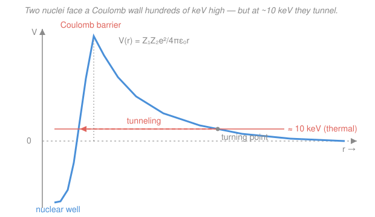
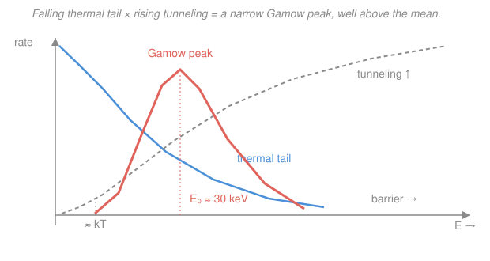

# Fusion & Plasma Engineering · Lesson 1.2: The Coulomb barrier & tunneling

> ⏱ ~15 min · Module 1: Fusion Reactions & Confinement Criteria · Builds on: [1.1 Why fusion, why D-T](01-01-why-fusion-why-dt.md) · Unlocks: [1.3 Reactivity ⟨σv⟩ & power density](01-03-reactivity-power-density.md)

## Why this matters

Lesson 1.1 told you *which* nuclei want to fuse — the binding-energy curve says D-T releases 17.6 MeV. But wanting to fuse and being *allowed* to are different things. Two deuterons are both positively charged, and they repel ferociously as they approach: the electrostatic wall between them peaks at a few **hundred keV**, yet ITER and SPARC plan to run at only ~10–20 keV. Classically that plasma should never fuse at all — it doesn't have the energy to reach the top of the wall. That it fuses anyway, briskly enough to power a reactor, is a purely quantum effect, and it's the single most important reason fusion is *possible but hard*. This lesson is where quantum tunneling meets a thermal gas and hands you the shape of every reactivity curve you'll use for the rest of the course.

## The idea

Picture rolling a ball up a hill. To get over, you need at least the energy of the summit. The Coulomb repulsion between two nuclei is exactly such a hill: the closer they get, the harder they're pushed apart, right up until they're almost touching — at which point the short-range **strong nuclear force** suddenly takes over, yanks them together, and they fuse. So the potential looks like a tall wall (Coulomb) guarding a deep pit (the nuclear well). The summit of that wall is the **Coulomb barrier**.

Here's the catch. A 10 keV thermal plasma is like a crowd of balls each carrying maybe one-fiftieth of the energy needed to crest the hill. Classically: nobody gets over, zero fusion. But quantum mechanics says a particle isn't a ball — it's a wave, and a wave doesn't stop dead at a wall, it *leaks through*. This leakage is **tunneling**, and the probability of it falls off savagely as the barrier gets taller or the particle slower. That exponential sensitivity has a beautiful consequence. In a thermal gas, fast particles are rare (the Maxwell–Boltzmann tail falls exponentially), but slow particles almost never tunnel (tunneling rises exponentially with energy). Multiply "how many particles have energy $E$" by "how likely each is to tunnel," and the two exponentials fight: the product is a sharp bump — the **Gamow peak** — sitting well *above* the average thermal energy but well *below* the barrier top. Almost all fusion in your reactor happens in that narrow window, produced by a rare, lucky, fast minority.

## The formal version

**The Coulomb barrier.** Two nuclei with charges $Z_1 e$ and $Z_2 e$ separated by a distance $r$ have electrostatic potential energy

$$V(r) = \frac{Z_1 Z_2 e^2}{4\pi\varepsilon_0\, r},$$

where $e = 1.6\times10^{-19}\,\text{C}$ is the elementary charge and $\varepsilon_0$ the permittivity of free space. A handy packaging: $\dfrac{e^2}{4\pi\varepsilon_0} = 1.44\ \text{MeV}\cdot\text{fm}$, so $V(r) = \dfrac{Z_1 Z_2 \times 1.44}{r[\text{fm}]}\ \text{MeV}$. *In words: the repulsion energy is inversely proportional to separation — halve the distance, double the push.* The barrier peaks where the nuclei touch, at $r \approx R_1 + R_2$ (a few femtometres); inside that, the strong force plunges $V$ into the deep negative nuclear well.

**The Gamow factor (tunneling).** Solving the Schrödinger equation for a particle of energy $E$ hitting this barrier (the WKB approximation from [`quantum-mechanics`](../../quantum-mechanics/syllabus.md)) gives a transmission probability

$$P(E) \;\propto\; \exp\!\left(-\sqrt{\frac{E_G}{E}}\,\right), \qquad E_G = 2 m_r c^2 (\pi\alpha Z_1 Z_2)^2,$$

where $\alpha = 1/137$ is the fine-structure constant, $m_r = \dfrac{m_1 m_2}{m_1+m_2}$ is the reduced mass, and $E_G$ is the **Gamow energy**. For D-T, $m_r \approx 1.2\,u$ so $m_r c^2 \approx 1118\ \text{MeV}$ and $E_G \approx 1.2\ \text{MeV}$. *In words: the odds of tunneling shrink exponentially as the particle slows, and the whole scale is set by $E_G$ — which grows with charge, so higher-$Z$ fuels are dramatically harder.* At $E = 10\ \text{keV}$ the exponent is $\sqrt{1200/10}\approx 11$, so $P \sim e^{-11}\approx 2\times10^{-5}$: rare, but not zero — and that is the whole ballgame.

**The cross-section shape.** The fusion cross-section $\sigma(E)$ (the effective target area, from [`intro-nuclear-engineering` 2.1](../../intro-nuclear-engineering/lessons/02-01-microscopic-cross-section.md)) bundles three factors:

$$\sigma(E) = \frac{S(E)}{E}\,\exp\!\left(-\sqrt{\frac{E_G}{E}}\,\right).$$

*In words: a geometric $1/E$ (the quantum wavelength shrinks with energy), the tunneling exponential, and a slowly-varying "astrophysical $S$-factor" $S(E)$ carrying the actual nuclear physics.* The tunneling term dominates the shape: $\sigma$ climbs from essentially nothing at low energy to a broad maximum.

**The Gamow peak.** In a plasma at temperature $T$, particles have a Maxwell–Boltzmann energy distribution $\propto e^{-E/kT}$ (from [`stat-mech`](../../stat-mech/syllabus.md)), where $k$ is Boltzmann's constant and we measure $kT$ in keV. The fusion rate integrand is the product

$$\underbrace{e^{-E/kT}}_{\text{fewer fast ions}} \times \underbrace{e^{-\sqrt{E_G/E}}}_{\text{better tunneling}}.$$

Maximizing the exponent $-E/kT - \sqrt{E_G/E}$ gives the peak energy

$$E_0 = \left(\tfrac{1}{2}\sqrt{E_G}\;kT\right)^{2/3}.$$

*In words: fusion concentrates at a special energy $E_0$ — the sweet spot where "still enough particles" meets "enough tunneling."* For D-T at $kT = 10\ \text{keV}$: $E_0 = \big(\tfrac12\sqrt{1200}\times 10\big)^{2/3}\approx 31\ \text{keV}$ — roughly three times the mean thermal energy, yet more than ten times below the barrier top.

## Picture

## Worked examples

**Example 1 (the tunneling gap — barrier height vs. thermal energy).** How high is the D-T Coulomb barrier, and how far below it does a reactor plasma sit?

The barrier peaks where the nuclei touch, $r \approx R_D + R_T$. Nuclear radii go as $R \approx r_0 A^{1/3}$ with $r_0 \approx 1.2\ \text{fm}$: $R_D = 1.2\times2^{1/3}\approx 1.5\ \text{fm}$, $R_T = 1.2\times3^{1/3}\approx 1.7\ \text{fm}$, so $r \approx 3.2\ \text{fm}$. With $Z_1 = Z_2 = 1$,

$$V_{\max} = \frac{1\cdot 1\cdot 1.44\ \text{MeV}\cdot\text{fm}}{3.2\ \text{fm}} \approx 0.45\ \text{MeV} = 450\ \text{keV}.$$

A plasma at $T = 10\ \text{keV}$ has mean particle energy $\tfrac32 kT = 15\ \text{keV}$. The ratio is

$$\frac{V_{\max}}{\tfrac32 kT} \approx \frac{450}{15} = 30.$$

*In words:* a typical ion carries about $1/30$ of the energy needed to reach the summit — classically forbidden by a wide margin. Fusion happens only because the wave function leaks through, and only for the rare fast ions near $E_0 \approx 31\ \text{keV}$, which still sit a factor of ~15 below the top. **This gap is why fusion needs keV of temperature, not eV** (chemical/atomic energies are eV-scale, a thousand times too cold), **and why it can never be a barrier you simply overpower thermally** — you rent tunneling instead.

**Example 2 (why the Gamow peak, and what raising $T$ does).** Why does fusion happen in a narrow band rather than at the average energy, and where does that band move as you heat the plasma?

Write the fusion rate integrand exponent as $f(E) = -\dfrac{E}{kT} - \sqrt{\dfrac{E_G}{E}}$. The first term punishes high energy (fast ions are exponentially rare); the second punishes low energy (slow ions can't tunnel). Neither endpoint wins — the product is largest at the compromise $E_0$ where $f'(E) = 0$:

$$f'(E) = -\frac{1}{kT} + \frac{1}{2}\sqrt{E_G}\,E^{-3/2} = 0 \;\;\Longrightarrow\;\; E_0 = \left(\tfrac12\sqrt{E_G}\,kT\right)^{2/3}.$$

Because both factors are steep exponentials, the product collapses to a narrow bump — its width scales as $\Delta \sim \sqrt{E_0\,kT}$, a few tens of keV at reactor conditions. Now raise the temperature. Since $E_0 \propto (kT)^{2/3}$, going from $kT = 10\ \text{keV}$ to $20\ \text{keV}$ moves the peak from ~31 keV to

$$E_0 = \left(\tfrac12\sqrt{1200}\times 20\right)^{2/3} \approx 49\ \text{keV}.$$

So heating does three things at once: it **shifts** the Gamow peak upward (toward the barrier, where tunneling is easier), **broadens** it (more of the tail qualifies), and **lifts** it (the whole integrand rises). That is precisely why reactivity $\langle\sigma v\rangle$ climbs so steeply with $T$ over 5–20 keV — the subject of the next lesson.

## Watch out

- **You might think 10 keV means every ion has 10 keV.** It doesn't — $T$ is a *distribution*. The fusing ions are the fast outliers in the tail near $E_0 \approx 3\times$ the mean, not the average ion. A modest rise in $T$ fattens that tail disproportionately, which is why fusion power is so temperature-sensitive.
- **You might think "just heat it past the barrier" would be cleaner.** To put the *mean* energy at the 450 keV barrier you'd need $T \sim 3\times10^9\ \text{K}$, and the plasma would radiate and transport itself to death long before. Tunneling lets you fuse at a hundredth of that temperature — it's not a workaround, it's the enabling physics.
- **You might expect all fuels to behave alike.** $E_G \propto (Z_1 Z_2)^2 m_r$, so higher-charge fuels have a vastly taller effective barrier: D-³He ($Z_1 Z_2 = 2$) and p-¹¹B ($Z_1 Z_2 = 5$) need far higher temperatures than D-T for the same tunneling odds. That charge penalty, not just the energy yield, is why D-T is the near-term choice from Lesson 1.1.

## One-liner

> Fusion needs keV not eV because a hundreds-of-keV Coulomb wall is crossed not by climbing it but by quantum-tunneling through it — and the rare fast ions that manage it cluster in the narrow Gamow peak, well above the thermal mean.

## Problems

**P1 (🟢)** Estimate the Coulomb barrier for D-T taking a contact radius $r = 4\ \text{fm}$. About how many times larger is it than the $\tfrac32 kT = 15\ \text{keV}$ mean energy of a 10 keV plasma?

**P2 (🟡)** For D-T the Gamow energy is $E_G \approx 1.2\ \text{MeV}$. Using $E_0 = \left(\tfrac12\sqrt{E_G}\,kT\right)^{2/3}$, the peak sits at ~31 keV when $kT = 10\ \text{keV}$. Find $E_0$ at $kT = 5\ \text{keV}$, and state in one sentence why fusion power drops so sharply when the plasma cools.

**P3 (🔴)** The tunneling exponent is $g(E) = \sqrt{E_G/E}$. For D-T ($E_G = 1.2\ \text{MeV}$), compute the ratio of tunneling probabilities $P = e^{-g}$ between an ion at $E = 20\ \text{keV}$ and one at $E = 5\ \text{keV}$. What does the size of that ratio tell you about the steepness of $\sigma(E)$, and hence about how $\langle\sigma v\rangle$ will behave in [1.3](01-03-reactivity-power-density.md)?

Solutions

**P1** With $Z_1 = Z_2 = 1$ and $\dfrac{e^2}{4\pi\varepsilon_0} = 1.44\ \text{MeV}\cdot\text{fm}$,

$$V(4\ \text{fm}) = \frac{1\cdot 1\cdot 1.44}{4}\ \text{MeV} = 0.36\ \text{MeV} = 360\ \text{keV}.$$

Compared with $\tfrac32 kT = 15\ \text{keV}$:

$$\frac{360}{15} = 24.$$

So the barrier is about **24 times** the mean thermal energy — a bit lower than the ~30 from Example 1 because we used a slightly larger radius (the barrier is lower when the nuclei "touch" farther out). Either way the message holds: the plasma is deep in the classically-forbidden regime, and only tunneling closes the gap. *Check:* units $\text{MeV}\cdot\text{fm}/\text{fm} = \text{MeV}$ ✓; larger $r$ gives smaller $V$, as $1/r$ demands ✓.

**P2** Work in keV: $E_G = 1200\ \text{keV}$, $\sqrt{E_G} = 34.6\ \text{keV}^{1/2}$. At $kT = 5\ \text{keV}$,

$$E_0 = \left(\tfrac12 \times 34.6 \times 5\right)^{2/3} = (86.6)^{2/3}\ \text{keV}.$$

$86.6^{1/3} = 4.42$, squared $= 19.5$, so $E_0 \approx 19.5\ \text{keV}$ (versus 31 keV at 10 keV — the peak dropped, following $E_0 \propto (kT)^{2/3}$: $31\times(5/10)^{2/3} = 31\times0.63 = 19.5$ ✓). Cooling the plasma pulls the Gamow peak to lower energy where tunneling is exponentially weaker *and* thins the high-energy tail feeding it, so the fusion rate — which lives entirely in that peak — collapses far faster than $T$ itself falls.

**P3** The exponents:

$$g(20\ \text{keV}) = \sqrt{\frac{1200}{20}} = \sqrt{60} = 7.75, \qquad g(5\ \text{keV}) = \sqrt{\frac{1200}{5}} = \sqrt{240} = 15.49.$$

The ratio of probabilities:

$$\frac{P(20)}{P(5)} = \frac{e^{-7.75}}{e^{-15.49}} = e^{\,15.49 - 7.75} = e^{\,7.74} \approx 2.3\times10^{3}.$$

An ion at 20 keV is about **2,300 times** more likely to tunnel than one at 5 keV. Because tunneling dominates $\sigma(E) = \frac{S(E)}{E}e^{-g}$, the cross-section rises by roughly this factor over that energy range — $\sigma(E)$ is extraordinarily steep near reactor temperatures. That steepness is exactly what makes the Maxwellian average $\langle\sigma v\rangle$ in [1.3](01-03-reactivity-power-density.md) climb so violently with $T$ (roughly $\langle\sigma v\rangle \propto T^{4}$ near 10 keV for D-T) and why hitting the right temperature matters so much. *Check:* $g$ smaller at higher $E$ (easier tunneling) ✓; ratio $> 1$ since 20 keV tunnels better ✓.

## Connections

- **Backward:** [1.1 Why fusion, why D-T](01-01-why-fusion-why-dt.md) picked D-T for its energy yield and low charge; this lesson shows the *second* reason low charge wins — $E_G \propto (Z_1 Z_2)^2 m_r$, so D-T has the lowest barrier and thus the most tunneling at accessible temperatures.
- **Forward:** [1.3 Reactivity ⟨σv⟩ & power density](01-03-reactivity-power-density.md) integrates $\sigma(E)$ over the Maxwell–Boltzmann distribution — literally computing the area under the Gamow peak — to get $\langle\sigma v\rangle(T)$ and the fusion power density, and to find the optimal operating temperature.
- **Sideways (quantum & statistical mechanics):** the Gamow peak is a collision of two courses — barrier tunneling / WKB from [`quantum-mechanics`](../../quantum-mechanics/syllabus.md) and the Maxwell–Boltzmann tail from [`stat-mech`](../../stat-mech/syllabus.md). The very same calculation, run at solar-core temperatures (~1 keV), explains why the Sun burns hydrogen slowly enough to last billions of years — Gamow first derived it for stellar nucleosynthesis, not reactors.
