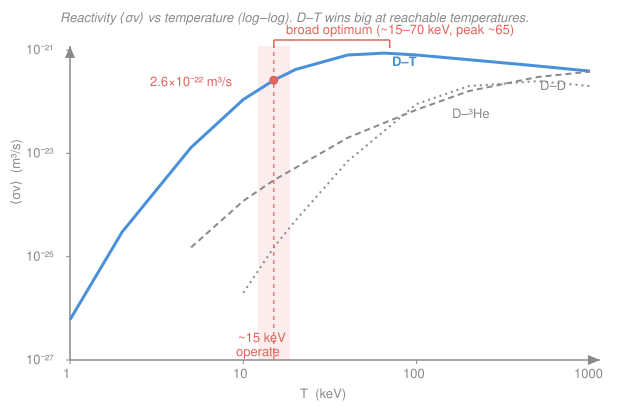

# Fusion & Plasma Engineering · Lesson 1.3: Reactivity ⟨σv⟩ & power density

> ⏱ ~15 min · Module 1: Fusion Reactions & Confinement Criteria · Builds on: [1.2 The Coulomb barrier & tunneling](01-02-coulomb-barrier-tunneling.md) · Unlocks: [1.4 The Lawson criterion & triple product](01-04-lawson-criterion-triple-product.md)

## Why this matters

You now know that a single D-T pair fuses only if it tunnels the Coulomb barrier, and that its cross-section $\sigma(E)$ climbs steeply with collision energy. But a reactor isn't two nuclei — it's $10^{20}$ ions per cubic metre, all buzzing at *different* speeds. The quantity that actually sets how many megawatts a cubic metre of plasma puts out is not $\sigma$ at one energy but its **thermal average**, the reactivity $\langle\sigma v\rangle(T)$. This one number, times densities and the energy per reaction, is the entire fusion power budget — the thing every tokamak, every stellarator, and NIF are ultimately trying to make large enough. Get it, and you can size a reactor on an envelope.

## The idea

Picture a single deuteron drifting through a sea of tritons. Whether it fuses in the next second depends on three things: how *many* tritons are around to hit (their density), how *fast* it sweeps past them (its speed $v$), and how *big a target* each collision presents (the cross-section $\sigma$, which itself depends on $v$). The product $\sigma v$ is a "reaction volume swept per second" — multiply by the triton density and you get that one deuteron's fusion rate.

The catch: in a hot plasma there is no single $v$. The ions carry a spread of speeds — a **Maxwell–Boltzmann distribution** set by the temperature $T$. Slow ions barely tunnel; blazing-fast ones are rare. The reactions that matter come from a compromise energy in the tail — the **Gamow peak** you met in [1.2](01-02-coulomb-barrier-tunneling.md). So instead of $\sigma v$ at one energy we need the **average of $\sigma v$ over the whole velocity distribution**. That average is a function of temperature *only*, and we call it the reactivity:

$$\langle\sigma v\rangle(T).$$

*In words: the reactivity is the fusion rate coefficient you get after letting a Maxwellian spread of ions collide — it bakes the cross-section and the thermal speed distribution into a single number that depends on nothing but temperature.* Once you have it, fusion power density is almost embarrassingly simple: rate per pair, times number of pairs, times the energy each reaction releases.

## The formal version

**Reactivity.** For two species with a relative-velocity distribution $f(v)$ (normalized so $\int f(v)\,d^3v = 1$), the Maxwellian-averaged reactivity is

$$\langle\sigma v\rangle = \int_0^\infty \sigma(v)\,v\,f(v)\,d^3v .$$

*In words: weight $\sigma v$ by how likely each relative speed is, and add it all up.* For a plasma in thermal equilibrium $f$ is Maxwellian, so the result depends only on $T$ — not on how you stir the plasma, only on how hot it is. Units: $\sigma$ in $\text{m}^2$, $v$ in $\text{m/s}$, so $\langle\sigma v\rangle$ is in $\text{m}^3/\text{s}$ (a volume swept per second).

**Volumetric reaction rate.** With $n_D$ deuterons and $n_T$ tritons per cubic metre, the number of D-T reactions per cubic metre per second is

$$R = n_D\, n_T\, \langle\sigma v\rangle \qquad \left[\text{reactions}\,\text{m}^{-3}\,\text{s}^{-1}\right].$$

*In words: (targets) × (projectiles) × (rate coefficient) — a mass-action law, exactly like a chemical reaction rate.* One subtlety: for reactions between **identical** particles (D-D), you'd write $\tfrac12 n_D^2\langle\sigma v\rangle$ to avoid double-counting each pair. D-T mixes two different species, so no factor of $\tfrac12$.

**Power density.** Each D-T reaction $\ce{^{2}_{1}H + ^{3}_{1}H -> ^{4}_{2}He + ^{1}_{0}n}$ releases $E_{\text{fus}} = 17.6$ MeV. Multiply the reaction rate by that energy:

$$\boxed{\,P_{\text{fus}} = n_D\, n_T\, \langle\sigma v\rangle\, E_{\text{fus}}\,} \qquad \left[\text{W}\,\text{m}^{-3}\right].$$

*In words: fusion power per cubic metre is just reactions-per-second-per-cubic-metre times joules-per-reaction.* For a **50-50 D-T** plasma the two ion densities are equal, $n_D = n_T = n/2$, where $n$ is the total ion density. Then $n_D n_T = n^2/4$ and

$$P_{\text{fus}} = \frac{n^2}{4}\,\langle\sigma v\rangle\, E_{\text{fus}} .$$

Two features to burn in. First, $P_{\text{fus}} \propto n^2$ — density is the most powerful knob you have. Second, all the temperature dependence is hiding inside $\langle\sigma v\rangle(T)$, whose shape decides which temperature is worth reaching.

## Picture

The D-T curve (blue) rises almost vertically out of the low-temperature floor — that steep wall is the Gamow tunneling factor from [1.2](01-02-coulomb-barrier-tunneling.md) — then flattens into a **broad optimum** from roughly 15 to 70 keV, peaking near 65 keV at about $8.5\times10^{-22}\,\text{m}^3/\text{s}$. D-D and D-³He (grey) sit one to two orders of magnitude lower at reachable temperatures and peak far hotter: D-³He carries $Z=2$ on the helium, so its Coulomb barrier is twice D-T's and its curve is shoved to the right. That single order-of-magnitude gap is why D-T is the near-term fuel.

## Worked examples

**Example 1 (the boss shape — power from an envelope).** A 50-50 D-T plasma has total ion density $n = 10^{20}\,\text{m}^{-3}$ at $T = 15$ keV, where $\langle\sigma v\rangle = 2.6\times10^{-22}\,\text{m}^3/\text{s}$ and $E_{\text{fus}} = 17.6$ MeV. Find the fusion power density.

Step 1 — count the pairs. With $n_D = n_T = n/2 = 5\times10^{19}\,\text{m}^{-3}$,

$$n_D\, n_T = \frac{n^2}{4} = \frac{(10^{20})^2}{4} = 2.5\times10^{39}\,\text{m}^{-6}.$$

Step 2 — reactions per second per cubic metre.

$$R = n_D\, n_T\, \langle\sigma v\rangle = 2.5\times10^{39}\times 2.6\times10^{-22} = 6.5\times10^{17}\ \text{reactions}\,\text{m}^{-3}\,\text{s}^{-1}.$$

Step 3 — convert the energy per reaction to joules (do this once and carry it):

$$E_{\text{fus}} = 17.6\times10^{6}\ \text{eV} \times 1.602\times10^{-19}\ \tfrac{\text{J}}{\text{eV}} = 2.82\times10^{-12}\ \text{J}.$$

Step 4 — multiply.

$$P_{\text{fus}} = R\, E_{\text{fus}} = 6.5\times10^{17}\times 2.82\times10^{-12} \approx 1.8\times10^{6}\ \text{W/m}^3 = 1.8\ \text{MW/m}^3 .$$

*Sanity check.* A cubic metre of plasma the density of thin air, at a hundred million kelvin, pumps out nearly two megawatts — comparable to a small wind turbine packed into a box. Scale that over an ITER-sized plasma volume (~800 m³) and you are in the gigawatt range. That number is the whole reason the field exists.

**Example 2 (density scaling & the fuel-mix optimum).** Why is $n$ the knob everyone pushes on, and why 50-50?

*Density.* Because $P_{\text{fus}} = \tfrac14 n^2\langle\sigma v\rangle E_{\text{fus}} \propto n^2$, **doubling the density quadruples the power.** Take Example 1's plasma to $n = 2\times10^{20}\,\text{m}^{-3}$ at the same temperature:

$$P_{\text{fus}} = \frac{(2\times10^{20})^2}{4}\,(2.6\times10^{-22})(2.82\times10^{-12}) \approx 7.3\ \text{MW/m}^3,$$

exactly $4\times$ the earlier $1.8\,\text{MW/m}^3$. (This is also why the Greenwald density limit in [2.6](02-06-operational-limits.md) hurts so much — it caps the very knob with the steepest payoff.)

*Fuel mix.* Now hold the **total** ion density $n = n_D + n_T$ fixed and ask which split maximizes power. Write the deuterium fraction as $x$, so $n_D = xn$ and $n_T = (1-x)n$:

$$P_{\text{fus}} \propto n_D\, n_T = x(1-x)\,n^2 .$$

The parabola $x(1-x)$ peaks at $x = \tfrac12$, giving $n_D n_T = n^2/4$ — the $\tfrac14$ in the boxed formula is precisely this optimum. Lopsided mixes waste fuel: a 70-30 split gives $x(1-x) = 0.21$ versus $0.25$, so you throw away

$$1 - \frac{0.21}{0.25} = 16\% \text{ of the fusion power}$$

at the *same* total density and temperature. Skew further and it falls faster. Fifty-fifty isn't a convention — it's the maximum of a parabola.

## Watch out

- **You might think you should run at the peak of $\langle\sigma v\rangle$ (~65 keV).** But reactors aim near **15 keV**, well down the near-vertical part. Two reasons, both cashed out in [1.4](01-04-lawson-criterion-triple-product.md): bremsstrahlung radiation losses grow with $T$ and eat into your net power, and — since the fusion *triple product* $nT\tau_E$ is what actually must be met — the optimum in $\langle\sigma v\rangle/T^2$ (not $\langle\sigma v\rangle$ itself) sits around 15 keV. Higher $T$ buys you little extra reactivity while costing you on radiation and pressure. The broad plateau means 15 keV gives up surprisingly little.
- **You might treat $\langle\sigma v\rangle$ as a fixed constant.** It is a steep function of temperature — between 5 keV and 15 keV the D-T reactivity climbs by roughly a factor of 20. Quote it *with* its temperature or the power number is meaningless.
- **Don't drop the factor of $\tfrac12$ for like-on-like reactions.** D-T needs no such factor (two distinct species), but D-D fusion uses $\tfrac12 n_D^2\langle\sigma v\rangle$ so each identical pair is counted once. Mixing these up double-counts your reactions.

## One-liner

> Fusion power density is $P_{\text{fus}} = \tfrac{n^2}{4}\langle\sigma v\rangle E_{\text{fus}}$ for 50-50 D-T — quadratic in density, and set in temperature by the thermally averaged reactivity $\langle\sigma v\rangle(T)$, whose broad D-T optimum is why we run near 15 keV.

## Problems

**P1 (🟢)** A 50-50 D-T plasma has total ion density $n = 1.5\times10^{20}\,\text{m}^{-3}$ at $T = 20$ keV, where $\langle\sigma v\rangle = 4.2\times10^{-22}\,\text{m}^3/\text{s}$. Using $E_{\text{fus}} = 17.6$ MeV $= 2.82\times10^{-12}$ J, find the fusion power density in MW/m³.

**P2 (🟡)** Same plasma as P1, but a fueling glitch shifts the mix to 65-35 (deuterium-rich) while the *total* density and temperature hold. By what percentage does $P_{\text{fus}}$ drop relative to the 50-50 case? Then, staying 50-50, how much would you have to raise the total density to recover the lost power?

**P3 (🔴)** At $T = 15$ keV the D-T reactivity is $\langle\sigma v\rangle_{DT} = 2.6\times10^{-22}\,\text{m}^3/\text{s}$ while D-D is about $\langle\sigma v\rangle_{DD} = 3.0\times10^{-24}\,\text{m}^3/\text{s}$. Consider a pure-deuterium plasma at the same *total* ion density $n$ as a 50-50 D-T plasma. Using the correct like-particle rate $\tfrac12 n_D^2\langle\sigma v\rangle_{DD}$ for D-D and $\tfrac{n^2}{4}\langle\sigma v\rangle_{DT}$ for D-T (ignore the difference in energy per reaction), find the ratio of D-D to D-T reaction rates. What does this say about why we bother with tritium?

Solutions

**P1** Pairs: $n_D n_T = n^2/4 = (1.5\times10^{20})^2/4 = 2.25\times10^{40}/4 = 5.625\times10^{39}\,\text{m}^{-6}$.

Reaction rate: $R = 5.625\times10^{39}\times 4.2\times10^{-22} = 2.36\times10^{18}\ \text{m}^{-3}\text{s}^{-1}$.

Power: $P_{\text{fus}} = R\,E_{\text{fus}} = 2.36\times10^{18}\times 2.82\times10^{-12} = 6.66\times10^{6}\ \text{W/m}^3 \approx 6.7\ \text{MW/m}^3$.

*Check.* Density is $1.5\times$ Example 1's and $\langle\sigma v\rangle$ is $4.2/2.6 = 1.62\times$ larger, so we expect $1.5^2\times1.62 = 3.6\times$ the $1.8\,\text{MW/m}^3$ result $= 6.6\,\text{MW/m}^3$. ✓

**P2** Power $\propto x(1-x)$ with $x$ the deuterium fraction. At 65-35, $x(1-x) = 0.65\times0.35 = 0.2275$ versus $0.25$ at 50-50. Fractional power:

$$\frac{0.2275}{0.25} = 0.91 \implies \text{a } 9\% \text{ drop.}$$

To recover it staying 50-50, you need $P \propto n^2$ up by a factor $1/0.91 = 1.10$, so $n$ scales by $\sqrt{1.10} = 1.048$ — about a **5% density increase**. (Power is quadratic in $n$, so a modest density bump undoes a fuel-mix imbalance — but density is capped by the Greenwald limit, so you can't lean on this forever.)

*Check.* A near-balanced mix (65-35 is only mildly off) costs single-digit percent — the $x(1-x)$ parabola is flat near its peak, which is reassuring for real fueling control. ✓

**P3** D-T rate: $R_{DT} = \tfrac{n^2}{4}\langle\sigma v\rangle_{DT}$. Pure-deuterium D-D rate at the *same total* density means $n_D = n$, so $R_{DD} = \tfrac12 n^2\langle\sigma v\rangle_{DD}$.

$$\frac{R_{DD}}{R_{DT}} = \frac{\tfrac12 n^2\langle\sigma v\rangle_{DD}}{\tfrac{1}{4} n^2\langle\sigma v\rangle_{DT}} = 2\,\frac{\langle\sigma v\rangle_{DD}}{\langle\sigma v\rangle_{DT}} = 2\times\frac{3.0\times10^{-24}}{2.6\times10^{-22}} = 2\times0.01154 \approx 0.023.$$

So pure deuterium fuses at about **2%** of the D-T rate at 15 keV, even with the favorable $\tfrac12 n^2$ counting — and D-D actually releases *less* energy per reaction, widening the gap further. Tritium's job is exactly this: its lower barrier and larger reactivity buy nearly two orders of magnitude more power at temperatures we can actually reach. That is why tritium breeding ([4.1](04-01-tritium-breeding-fuel-cycle.md)) is worth the engineering pain.

*Check.* The factor-of-2 from like-particle counting partly offsets the ~87× reactivity gap, landing at ~2% — consistent with the order-of-magnitude separation of the curves in the Picture. ✓

## Flashback

**From Lesson 1.2 (The Coulomb barrier & tunneling):** Estimate the Coulomb barrier height for **D-³He** fusion — a deuteron ($Z_1 = 1$, $A_1 = 2$) meeting a helium-3 nucleus ($Z_2 = 2$, $A_2 = 3$). Use the barrier at nuclear contact,

$$U_c = \frac{1}{4\pi\varepsilon_0}\frac{Z_1 Z_2 e^2}{r}, \qquad r \approx r_0\left(A_1^{1/3} + A_2^{1/3}\right),\ r_0 = 1.2\,\text{fm},$$

and the handy constant $\dfrac{e^2}{4\pi\varepsilon_0} = 1.44\ \text{MeV}\cdot\text{fm}$. Compare your answer to D-T's barrier ($\approx 444$ keV, same radii but $Z_1 Z_2 = 1$), and say in one sentence why this pushes the D-³He reactivity curve to the right in the Picture.

Solution

Contact separation:

$$r = 1.2\,(2^{1/3} + 3^{1/3}) = 1.2\,(1.26 + 1.44) = 1.2\times2.70 = 3.24\ \text{fm}.$$

Barrier height (note $Z_1 Z_2 = 1\times2 = 2$):

$$U_c = \frac{1.44\ \text{MeV}\cdot\text{fm}\times 2}{3.24\ \text{fm}} = \frac{2.88}{3.24}\ \text{MeV} \approx 0.89\ \text{MeV} = 890\ \text{keV}.$$

That is very close to **twice** D-T's $\approx 444$ keV — the whole difference is the factor $Z_1 Z_2 = 2$ (helium's double charge), since the radii are identical. A taller barrier means ions must tunnel from further out on the thermal tail, so the Gamow peak sits at higher energy and the D-³He reactivity only catches up at much higher temperature — exactly the rightward shift of the grey D-³He curve. Aneutronic fuels are cleaner but demand hotter plasmas.

*Check.* Units: $\text{MeV}\cdot\text{fm}/\text{fm} = \text{MeV}$ ✓. The barrier scales as $Z_1 Z_2$, so doubling the charge product doubles the height with fixed geometry — consistent. ✓

## Connections

- **Backward:** the steep low-temperature wall of $\langle\sigma v\rangle(T)$ *is* the Gamow tunneling factor from [1.2](01-02-coulomb-barrier-tunneling.md), now thermally averaged over a Maxwellian instead of evaluated at one energy — and the fuel choice traces straight back to the binding-energy argument in [1.1](01-01-why-fusion-why-dt.md).
- **Forward:** [1.4](01-04-lawson-criterion-triple-product.md) sets $P_{\text{fus}}$ against energy losses (conduction + bremsstrahlung) to derive the Lawson criterion and the triple product $nT\tau_E$ — and shows why the *right* quantity to optimize, $\langle\sigma v\rangle/T^2$, peaks near 15 keV rather than at the raw reactivity maximum.
- **Sideways (statistical mechanics):** the Maxwellian velocity distribution that defines $\langle\sigma v\rangle$ is the same equilibrium distribution behind pressure, temperature, and mean free path in kinetic theory — averaging a rate over a Boltzmann distribution is the identical move used for reaction rates in chemistry (the Arrhenius factor) and for thermal ionization in the Saha equation used across plasma physics ([`plasma-physics` syllabus](../../plasma-physics/syllabus.md)).
