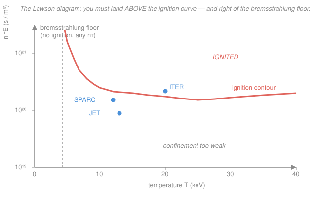

# Fusion & Plasma Engineering · Lesson 1.4: The Lawson criterion & triple product

> ⏱ ~15 min · Module 1: Fusion Reactions & Confinement Criteria · Builds on: [1.3 Reactivity & power density](01-03-reactivity-power-density.md), [`plasma-physics` syllabus](../../plasma-physics/syllabus.md) (energy confinement time $\tau_E$) · Unlocks: [1.5 Ignition, breakeven & gain](01-05-ignition-breakeven-gain.md)

## Why this matters

In [1.3](01-03-reactivity-power-density.md) you learned how much fusion power a plasma *makes* per cubic metre. But a hot plasma also *leaks* energy — to radiation and to particles wandering out to the wall. A reactor works only when the making beats the leaking. That single inequality is the **Lawson criterion**, and its modern packaging, the **triple product** $nT\tau_E$, is the one number every device on Earth is judged by. When JET, SPARC, and ITER quote a milestone, they quote a triple product. This lesson turns "fusion is hard" into a precise target you can check on an envelope.

## The idea

Picture the plasma as a leaky bucket of heat. You pour thermal energy in (from heating, and once it's burning, from the fusion-born alpha particles). Energy drains out at some rate. The bucket stays hot — self-sustaining — only if the inflow at least matches the drain.

Two knobs set the balance. **How hot and dense** the plasma is fixes how fast fusion pours energy in (that's the $\langle\sigma v\rangle$ story from 1.3). **How well the bucket holds heat** is captured by one number, the **energy confinement time** $\tau_E$: roughly, "if you switched off all heating, how long until the plasma cooled down." A big $\tau_E$ is a well-insulated bucket; a small $\tau_E$ is a sieve.

The punchline is that ignition doesn't care about $n$, $T$, and $\tau_E$ separately — it cares about their *product*. You can be diffuse but exquisitely confined (the sun: enormous $\tau_E$, feeble density) or dense and briefly confined (a laser implosion: tiny $\tau_E$, gigantic density). Same criterion, opposite corners. And there's a floor you can't dig under: below a few keV, the plasma radiates energy away as X-rays faster than fusion can replace it, no matter how good your confinement — the **bremsstrahlung floor**.

## The formal version

**The plasma's thermal energy.** A quasineutral plasma of electron density $n$ (in m$^{-3}$) at temperature $T$ (we quote $T$ in energy units, keV) stores thermal energy per unit volume

$$W = \tfrac{3}{2}n_e T_e + \tfrac{3}{2}n_i T_i = 3nT,$$

the last step for a 50–50 D-T plasma with $T_e = T_i = T$ and equal electron and ion densities ($n_e = n_i = n$). *In words: each species carries $\tfrac{3}{2}T$ of energy per particle; electrons plus ions give the factor 3.*

**Loss power.** Define the **energy confinement time** $\tau_E$ (seconds) so that the energy-loss power density is

$$P_{\text{loss}} = \frac{W}{\tau_E} = \frac{3nT}{\tau_E}.$$

*In words: $\tau_E$ is the e-folding time for the stored heat to drain — small $\tau_E$ means fast losses.* It bundles every transport channel (conduction, convection, turbulence) into one measured number; computing it from first principles is the job of confinement-scaling theory (see the [`plasma-physics` syllabus](../../plasma-physics/syllabus.md), and Lesson [3.4](03-04-transport-confinement-scaling.md) here).

**The ignition balance.** A *self-sustaining* plasma is heated entirely by the alpha particles it breeds — the $E_\alpha = 3.5$ MeV alpha stays trapped and deposits its energy, while the 14.1 MeV neutron escapes. Using $n_D = n_T = n/2$ so $n_D n_T = n^2/4$ (from [1.3](01-03-reactivity-power-density.md)), the alpha heating density is $\tfrac{n^2}{4}\langle\sigma v\rangle E_\alpha$. Ignition demands heating $\ge$ loss:

$$\frac{n^2}{4}\langle\sigma v\rangle E_\alpha \;\ge\; \frac{3nT}{\tau_E}.$$

Divide by $n$ and rearrange into the **Lawson criterion**:

$$\boxed{\,n\tau_E \;\ge\; \frac{12\,T}{\langle\sigma v\rangle\,E_\alpha}\,}$$

*In words: the confinement quality $n\tau_E$ must clear a threshold set by temperature and reactivity.* For D-T near 15 keV this threshold bottoms out around $n\tau_E \sim 1.5\text{–}2\times 10^{20}\ \text{m}^{-3}\,\text{s}$.

**The triple product.** The right-hand side still depends on $T$ awkwardly. Multiply both sides by $T$:

$$nT\tau_E \;\ge\; \frac{12\,T^2}{\langle\sigma v\rangle\,E_\alpha}.$$

Here's the magic. Over the operating window $T \approx 10\text{–}20$ keV, the reactivity climbs like $\langle\sigma v\rangle \propto T^2$ (the tail-of-the-Maxwellian result from [1.3](01-03-reactivity-power-density.md)). So $T^2/\langle\sigma v\rangle$ is **nearly constant**, and the target barely moves with temperature:

$$\boxed{\,nT\tau_E \;\gtrsim\; 3\times 10^{21}\ \text{keV}\cdot\text{s}\cdot\text{m}^{-3}\quad(\text{D-T ignition})\,}$$

*In words: the triple product folds the temperature dependence into one nearly $T$-independent number — a single figure of merit for any fusion device.* That is why it, not $n\tau_E$ alone, is the headline metric.

**The bremsstrahlung floor.** Electrons decelerating in the ions' fields radiate X-rays — **bremsstrahlung** ("braking radiation") — draining power at density

$$P_{\text{brem}} = C_B\, n^2 \sqrt{T}, \qquad C_B \approx 5.35\times 10^{-37}\ \text{W}\,\text{m}^3\,\text{keV}^{-1/2}$$

(for $T$ in keV, $n$ in m$^{-3}$, pure D-T). Compare it to alpha heating $\propto n^2\langle\sigma v\rangle \propto n^2 T^2$. **Both scale as $n^2$, so density cancels** — the contest is purely a function of $T$: heating rises like $T^2$, radiation only like $\sqrt{T}$. Below a critical temperature ($T_{\min}\approx 4$ keV for D-T) radiation wins and ignition is *impossible at any density or confinement*. That is the left wall of the operating diagram.

## Picture

The ignition contour is U-shaped: it plunges as you approach the bremsstrahlung floor on the left, flattens into a broad minimum around 25 keV, and creeps back up at high $T$ (where $\langle\sigma v\rangle$ stops improving). You want to sit in that valley — and above the curve.

## Worked examples

**Example 1 (the boss shape — solve for the required $\tau_E$).** Take the ignition target $nT\tau_E = 3\times 10^{21}\ \text{keV}\cdot\text{s}\cdot\text{m}^{-3}$. A plasma runs at $n = 10^{20}\ \text{m}^{-3}$ and $T = 15$ keV. What confinement time must it reach?

Just divide the target by $nT$:

$$\tau_E = \frac{nT\tau_E}{nT} = \frac{3\times 10^{21}}{(10^{20})(15)} = \frac{3\times 10^{21}}{1.5\times 10^{21}} = 2\ \text{s}.$$

*Check units:* $\dfrac{\text{keV}\cdot\text{s}\cdot\text{m}^{-3}}{\text{m}^{-3}\cdot\text{keV}} = \text{s}$ ✓. Two seconds is a genuinely hard target — it took decades of tokamak development to get within reach.

*Why not just crank $T$ higher?* Because past ~15 keV the reactivity $\langle\sigma v\rangle$ flattens out (it stops growing like $T^2$) while bremsstrahlung keeps climbing like $\sqrt{T}$ and the plasma pressure you must hold rises — so more heat buys you almost no extra fusion. The triple-product target is essentially flat from ~10 to ~20 keV; there's no free lunch above it.

**Example 2 (power balance — is this plasma ignited?).** Same plasma, now with $\langle\sigma v\rangle = 2.6\times 10^{-22}\ \text{m}^3/\text{s}$ (the 15 keV value), $E_\alpha = 3.5$ MeV, and suppose we achieve exactly $\tau_E = 2$ s. Compare the alpha heating to the losses.

*Loss power density.* First the stored energy, converting $T = 15$ keV to joules ($1\ \text{keV} = 1.602\times 10^{-16}$ J, so $T = 2.40\times 10^{-15}$ J):

$$W = 3nT = 3\,(10^{20})(2.40\times 10^{-15}) = 7.21\times 10^{5}\ \text{J/m}^3,$$
$$P_{\text{loss}} = \frac{W}{\tau_E} = \frac{7.21\times 10^{5}}{2} = 3.6\times 10^{5}\ \text{W/m}^3 = 0.36\ \text{MW/m}^3.$$

*Alpha heating density.* With $E_\alpha = 3.5\ \text{MeV} = 5.61\times 10^{-13}$ J:

$$P_\alpha = \frac{n^2}{4}\langle\sigma v\rangle E_\alpha = \frac{(10^{20})^2}{4}(2.6\times 10^{-22})(5.61\times 10^{-13}) = 3.6\times 10^{5}\ \text{W/m}^3.$$

Step by step: $\tfrac{n^2}{4} = 2.5\times 10^{39}$; times $\langle\sigma v\rangle$ gives $6.5\times 10^{17}$ reactions m$^{-3}$s$^{-1}$; times $E_\alpha$ gives $3.6\times 10^{5}$ W/m$^3$.

$P_\alpha \approx P_{\text{loss}}$ — the alphas exactly pay the heat bill. This plasma sits **right at ignition**, which is no accident: $\tau_E = 2$ s was precisely the threshold from Example 1. Nudge $\tau_E$ up and the plasma heats itself away; nudge it down and it cools.

## Watch out

- **The triple product is not $n\tau_E$.** $n\tau_E$ (the raw Lawson number) still depends on temperature and needs a $T$ quoted alongside it. $nT\tau_E$ absorbs that dependence, which is exactly why it's the fair cross-device metric. Don't compare a bare $n\tau_E$ from one machine to a triple product from another.
- **Ignition is a stiffer bar than breakeven.** The criterion above uses only the 3.5 MeV *alpha* energy, because ignition means the plasma sustains itself with *no external heating*. "Breakeven" (fusion power = input heating power) uses the full 17.6 MeV and is easier — that whole ladder is [1.5](01-05-ignition-breakeven-gain.md)'s subject. Don't conflate them.
- **The bremsstrahlung floor is about temperature, not confinement.** You cannot buy your way below ~4 keV with a bigger, better-insulated machine — density cancels out of the heating-vs-radiation contest. It's a hard temperature wall, and it's why every D-T reactor targets ~10–20 keV, never 3.
- **Real losses are worse than bremsstrahlung alone.** Line radiation from impurity ions (tungsten from the wall!) can dwarf bremsstrahlung and pushes the effective floor higher — one reason wall material choice ([3.6](03-06-first-wall-plasma-wall-interaction.md)) feeds straight back into this criterion.

## One-liner

> Fusion self-heating beats losses only when $nT\tau_E \gtrsim 3\times 10^{21}\ \text{keV}\cdot\text{s}\cdot\text{m}^{-3}$ — and only above ~4 keV, where reactivity finally outruns bremsstrahlung.

## Problems

**P1 (🟢)** Using the D-T ignition target $nT\tau_E = 3\times 10^{21}\ \text{keV}\cdot\text{s}\cdot\text{m}^{-3}$, a device runs at $n = 2\times 10^{20}\ \text{m}^{-3}$ and $T = 12$ keV. What energy confinement time $\tau_E$ does it need to ignite?

**P2 (🟡)** A D-T plasma has $n = 10^{20}\ \text{m}^{-3}$, $T = 15$ keV, $\langle\sigma v\rangle = 2.6\times 10^{-22}\ \text{m}^3/\text{s}$, $E_\alpha = 3.5$ MeV, and confinement $\tau_E = 1.5$ s. (a) Compute the loss power density $3nT/\tau_E$. (b) Compute the alpha heating density $\tfrac{n^2}{4}\langle\sigma v\rangle E_\alpha$. (c) Is it ignited? If not, what $\tau_E$ would it need?

**P3 (🔴, optional)** The ratio of alpha heating to bremsstrahlung scales as $P_\alpha/P_{\text{brem}} \propto T^2/\sqrt{T} = T^{3/2}$. (a) Explain in one line why the plasma density $n$ does not appear in the minimum ignition temperature. (b) Suppose the ratio equals 1 at $T_{\min} = 4.3$ keV. At what temperature does alpha heating exceed bremsstrahlung by a factor of 8? Comment on where that lands relative to the usual operating window.

Solutions

**P1** Divide the target by $nT$:

$$\tau_E = \frac{nT\tau_E}{nT} = \frac{3\times 10^{21}}{(2\times 10^{20})(12)} = \frac{3\times 10^{21}}{2.4\times 10^{21}} = 1.25\ \text{s}.$$

*Check.* Units: $(\text{keV}\cdot\text{s}\cdot\text{m}^{-3})/(\text{m}^{-3}\cdot\text{keV}) = \text{s}$ ✓. It's a shade easier than Example 1's 2 s because the density is twice as high, so less time is needed for the same product. ✓

**P2** (a) Convert $T = 15$ keV $= 2.40\times 10^{-15}$ J. Stored energy $W = 3nT = 3(10^{20})(2.40\times 10^{-15}) = 7.21\times 10^{5}\ \text{J/m}^3$. Then

$$P_{\text{loss}} = \frac{W}{\tau_E} = \frac{7.21\times 10^{5}}{1.5} = 4.8\times 10^{5}\ \text{W/m}^3 = 0.48\ \text{MW/m}^3.$$

(b) With $E_\alpha = 3.5\ \text{MeV} = 5.61\times 10^{-13}$ J:

$$P_\alpha = \frac{(10^{20})^2}{4}(2.6\times 10^{-22})(5.61\times 10^{-13}) = (2.5\times 10^{39})(2.6\times 10^{-22})(5.61\times 10^{-13}) = 3.6\times 10^{5}\ \text{W/m}^3.$$

(c) $P_\alpha = 0.36\ \text{MW/m}^3 < P_{\text{loss}} = 0.48\ \text{MW/m}^3$, so the alphas cannot pay the heat bill — **not ignited** ($P_\alpha/P_{\text{loss}} \approx 0.75$). To ignite you need $P_\alpha \ge W/\tau_E$, i.e.

$$\tau_E \ge \frac{W}{P_\alpha} = \frac{7.21\times 10^{5}}{3.6\times 10^{5}} \approx 2.0\ \text{s}.$$

*Check.* Same numbers as Example 2 but with $\tau_E$ cut from 2 s to 1.5 s, so losses rise by $2/1.5 = 1.33\times$ while heating is unchanged — pushing an ignited plasma below threshold, exactly as found. ✓

**P3** (a) Both alpha heating ($\tfrac{n^2}{4}\langle\sigma v\rangle E_\alpha$) and bremsstrahlung ($C_B n^2\sqrt{T}$) carry the same $n^2$ factor, so it cancels in the ratio — the balance is set by temperature alone.

(b) The ratio scales as $T^{3/2}$, so

$$\frac{P_\alpha/P_{\text{brem}}\,(T)}{P_\alpha/P_{\text{brem}}\,(T_{\min})} = \left(\frac{T}{T_{\min}}\right)^{3/2} = 8 \;\Longrightarrow\; \frac{T}{T_{\min}} = 8^{2/3} = 4,$$

so $T = 4 \times 4.3 = 17.2\ \text{keV}$. That sits squarely in the 10–20 keV operating window — which is no coincidence: reactors run where alpha heating comfortably dominates radiation, several times above the floor.

*Check.* $8^{2/3} = (2^3)^{2/3} = 2^2 = 4$ ✓, and $17.2$ keV is a factor of 4 above the floor, matching the “several times above” target. ✓

## Flashback

**From Lesson 1.3 (Reactivity & power density):** A 50–50 D-T plasma has $n = 1.5\times 10^{20}\ \text{m}^{-3}$ at a temperature where $\langle\sigma v\rangle = 3.0\times 10^{-22}\ \text{m}^3/\text{s}$. With $E_{\text{fus}} = 17.6$ MeV, compute the total fusion power density $P_{\text{fus}} = \tfrac{n^2}{4}\langle\sigma v\rangle E_{\text{fus}}$.

Solution

Convert $E_{\text{fus}} = 17.6\ \text{MeV} = 17.6\times 10^{6}\times 1.602\times 10^{-19}\ \text{J} = 2.82\times 10^{-12}$ J. Then

$$\frac{n^2}{4} = \frac{(1.5\times 10^{20})^2}{4} = \frac{2.25\times 10^{40}}{4} = 5.63\times 10^{39}\ \text{m}^{-6},$$

$$P_{\text{fus}} = (5.63\times 10^{39})(3.0\times 10^{-22})(2.82\times 10^{-12}) = 4.8\times 10^{6}\ \text{W/m}^3 \approx 4.8\ \text{MW/m}^3.$$

*Check.* Reaction rate $\tfrac{n^2}{4}\langle\sigma v\rangle = 1.69\times 10^{18}$ m$^{-3}$s$^{-1}$; each releases 17.6 MeV; the product lands near 5 MW/m$^3$, a healthy reactor-grade power density. Note the alpha channel is $3.5/17.6 \approx 0.20$ of this ($\approx 0.95\ \text{MW/m}^3$) — that's the piece that must beat losses for ignition. ✓

## Connections

- **Backward:** this is [1.3](01-03-reactivity-power-density.md)'s power density $\tfrac{n^2}{4}\langle\sigma v\rangle E$ set against a loss term $3nT/\tau_E$ — the $\langle\sigma v\rangle \propto T^2$ scaling from that lesson is exactly what makes the triple product $T$-independent. The keV-scale temperatures come from the Coulomb barrier of [1.2](01-02-coulomb-barrier-tunneling.md).
- **Forward:** [1.5](01-05-ignition-breakeven-gain.md) splits this single inequality into the milestone ladder — breakeven, $Q$, and ignition — and shows why $Q = \infty$ *is* ignition. Everything in Modules 2–3 (magnetic geometry, heating, transport) exists to buy the $n$, $T$, and especially the $\tau_E$ this criterion demands.
- **Sideways (transport & radiation):** $\tau_E$ is not a fundamental constant — it's an emergent transport quantity governed by turbulence, the subject of confinement-scaling theory in the [`plasma-physics` syllabus](../../plasma-physics/syllabus.md) and Lesson [3.4](03-04-transport-confinement-scaling.md). The bremsstrahlung floor is the same free-electron braking radiation you meet in E&M and in radiation shielding — see the [`intro-nuclear-engineering` syllabus](../../intro-nuclear-engineering/syllabus.md), which introduces the Lawson idea in its fusion overview.
