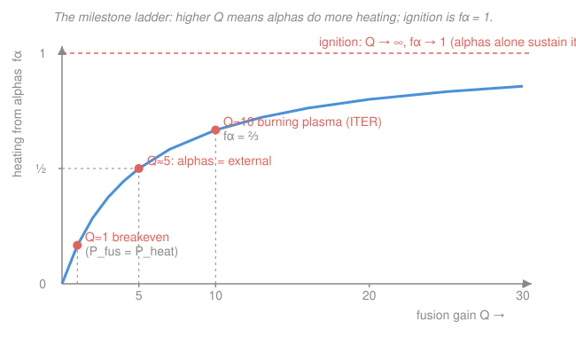

# Fusion & Plasma Engineering · Lesson 1.5: Ignition, breakeven & gain $Q$

> ⏱ ~15 min · Module 1: Fusion Reactions & Confinement Criteria · Builds on: [1.4 The Lawson criterion & triple product](01-04-lawson-criterion-triple-product.md), [1.3 Reactivity & power density](01-03-reactivity-power-density.md) · Unlocks: Module 2 ([2.1 From bottles to tori](02-01-bottles-to-tori.md))

## Why this matters

"Fusion produced more energy than went in" is a headline that hides three completely different achievements. When NIF crossed a threshold in December 2022, and when JET and SPARC quote their numbers, they are all talking about the same ratio — the **fusion gain** $Q$ — but at wildly different points on a ladder. The bottom rung (JET's 1997 record) still lost energy overall; the top rung (**ignition**) is a plasma that heats *itself* and needs no external power at all. ITER is deliberately aimed between them, at $Q=10$. This lesson gives you the one ratio that separates the rungs, and the reason the ladder has a hard ceiling. It closes Module 1: everything after this is about how to actually *build* the confinement that reaches these numbers.

## The idea

Every fusion reactor is a leaky bucket you're trying to keep hot. You pour heating power in; the plasma leaks energy out (radiation, particles hitting the wall). Fusion reactions add a bonus: they release power *inside* the bucket. The whole game is bookkeeping — who supplies the heat that replaces the leak?

Here's the crucial fact that makes the ladder. When deuterium and tritium fuse, the 17.6 MeV splits unevenly: a **neutron** carries off 14.1 MeV (about $4/5$), and a **helium nucleus** — the **alpha particle** — carries 3.5 MeV (about $1/5$). The neutron is electrically neutral, so the magnetic field can't hold it: it flies straight out to the blanket (that's where you'll harvest its energy for electricity, Module 4). But the alpha is *charged*. It stays trapped, ricochets around, and dumps its 3.5 MeV back into the plasma as heat. So **only one-fifth of the fusion power stays home to keep the plasma hot** — but that fifth is free, and it grows as the plasma burns harder.

That sets up three milestones. **Scientific breakeven**: fusion power out equals the heating power you injected ($Q=1$). **Engineering breakeven**: fusion power is large enough that, after all the plant's inefficiencies, you net electricity to the grid (roughly $Q\gtrsim5$–$10$). **Ignition**: the alpha self-heating *alone* replaces every bit of the leak, so you can switch off the external heater entirely and the burn sustains itself ($Q\to\infty$). Ignition is the dream; a finite, controllable high-$Q$ **burning plasma** is the near-term target.

## The formal version

**Fusion gain.** Define

$$Q \equiv \frac{P_{\text{fus}}}{P_{\text{heat}}},$$

where $P_{\text{fus}}$ is the total fusion power released (watts) and $P_{\text{heat}}$ is the external heating power you inject (neutral beams, RF — the subjects of Module 3). *In words: $Q$ is fusion energy out per unit of heating energy you had to pay for.*

**Alpha heating.** Of the fusion power, the charged alphas deposit the fraction $E_\alpha/E_{\text{fus}} = 3.5/17.6 = 0.199 \approx \tfrac15$ back into the plasma:

$$P_\alpha = \frac{1}{5}P_{\text{fus}} = \frac{Q}{5}\,P_{\text{heat}}.$$

*In words: the plasma's free internal heater runs at one-fifth of the fusion power.* The neutrons' $4/5$ leaves immediately and does nothing for the plasma's temperature.

**Total plasma heating and the alpha fraction.** The plasma is actually kept hot by external heating *plus* alpha heating:

$$P_{\text{plasma}} = P_{\text{heat}} + P_\alpha = P_{\text{heat}}\left(1 + \frac{Q}{5}\right).$$

The fraction supplied by alphas is the number that names each rung of the ladder:

$$\boxed{\,f_\alpha = \frac{P_\alpha}{P_{\text{heat}} + P_\alpha} = \frac{Q/5}{Q/5 + 1} = \frac{Q}{Q+5}\,}$$

*In words: as $Q$ climbs, alphas take over the heating; at $Q\to\infty$, $f_\alpha\to1$ and the external heater becomes irrelevant.*

**The three milestones, as values of $Q$:**

| Milestone | Condition | $Q$ | $f_\alpha$ |
|---|---|---|---|
| Scientific breakeven | $P_{\text{fus}} = P_{\text{heat}}$ | $1$ | $1/6 \approx 0.17$ |
| Alphas match external heater | $P_\alpha = P_{\text{heat}}$ | $5$ | $1/2$ |
| Burning plasma (ITER target) | dominated by self-heating | $10$ | $2/3$ |
| **Ignition** | $P_\alpha \ge$ all losses, $P_{\text{heat}}=0$ | $\infty$ | $1$ |

**Ignition condition.** With no external heating, steady state demands that alpha power alone balance the energy leak $W/\tau_E$ (plasma energy content $W$ divided by the energy confinement time $\tau_E$ from [1.4](01-04-lawson-criterion-triple-product.md)):

$$\frac{1}{5}P_{\text{fus}} \;\ge\; \frac{W}{\tau_E}.$$

*In words: ignition is reached when the alphas, by themselves, resupply energy at least as fast as the plasma loses it.* Because only the $1/5$ alpha slice counts, the triple product this demands is **five times** larger than the naive target that would credit the full fusion power — we derive that factor in Example 2.

## Picture

## Worked examples

**Example 1 (a power balance, classified).** ITER is designed to inject about $P_{\text{heat}} = 50$ MW of external heating and produce about $P_{\text{fus}} = 500$ MW of fusion power. Find $Q$, the alpha heating power, the alpha fraction, and classify the plasma.

$$Q = \frac{P_{\text{fus}}}{P_{\text{heat}}} = \frac{500}{50} = 10.$$

Alpha heating is one-fifth of fusion power:

$$P_\alpha = \frac15 P_{\text{fus}} = \frac15(500) = 100\ \text{MW}.$$

Compare that to the 50 MW external heater: the alphas are already supplying **twice** as much heat as you're paying for. The fraction:

$$f_\alpha = \frac{Q}{Q+5} = \frac{10}{15} = \frac{2}{3} \approx 0.67.$$

**Classification:** well past scientific breakeven ($Q=1$), two-thirds self-heated — a genuine **burning plasma**, but *not* ignited, because switching off the 50 MW would let it cool. Contrast the JET 1997 record: $P_{\text{fus}}\approx16$ MW from $P_{\text{heat}}\approx24$ MW gives $Q\approx0.67$ — **sub-breakeven**, with alphas supplying only $f_\alpha = 0.67/5.67 \approx 0.12$, an interesting but net-loss experiment.

**Example 2 (ignition recovers a $5\times$ triple product).** Show that requiring the alphas alone to balance losses gives a triple-product target five times the "full-power" one, and evaluate it at $T = 15$ keV.

Work per unit volume, as in [1.4](01-04-lawson-criterion-triple-product.md). For a 50–50 D–T plasma of total ion density $n$ ($n_D = n_T = n/2$), the fusion power density is $P_{\text{fus}} = \frac{n^2}{4}\langle\sigma v\rangle E_{\text{fus}}$, so the alpha power density is

$$P_\alpha = \frac{n^2}{4}\langle\sigma v\rangle E_\alpha, \qquad E_\alpha = \frac{E_{\text{fus}}}{5} = 3.52\ \text{MeV}.$$

The plasma's stored energy density is $W = 3nT$ (that is $\tfrac32 T$ per particle, summed over $n$ ions and $n$ electrons). The ignition condition $P_\alpha = W/\tau_E$ becomes

$$\frac{n^2}{4}\langle\sigma v\rangle E_\alpha = \frac{3nT}{\tau_E} \;\Longrightarrow\; n\tau_E = \frac{12\,T}{\langle\sigma v\rangle E_\alpha} \;\Longrightarrow\; (nT\tau_E)_{\text{ign}} = \frac{12\,T^2}{\langle\sigma v\rangle E_\alpha}.$$

If you had (wrongly) credited the *whole* fusion power to plasma heating, you'd replace $E_\alpha$ by $E_{\text{fus}} = 5E_\alpha$, shrinking the target by a factor of 5. So ignition — which only gets the alpha slice — demands

$$(nT\tau_E)_{\text{ign}} = 5\times(nT\tau_E)_{\text{full power}}.$$

Numerically at $T=15$ keV with $\langle\sigma v\rangle \approx 2.6\times10^{-22}\ \text{m}^3/\text{s}$ and $E_\alpha = 3.52\ \text{MeV} = 3520\ \text{keV}$:

$$(nT\tau_E)_{\text{ign}} = \frac{12\,(15)^2}{(2.6\times10^{-22})(3520)} = \frac{2700}{9.15\times10^{-19}} \approx 3.0\times10^{21}\ \text{keV}\cdot\text{s}\cdot\text{m}^{-3}.$$

That is exactly the $\sim3\times10^{21}$ ignition triple product you met in [1.4](01-04-lawson-criterion-triple-product.md) — and now you see where the specific number comes from: it is the *alpha-only* balance, five times harsher than if all 17.6 MeV could keep the plasma hot.

## Watch out

- **You might think breakeven and ignition are the same finish line.** They are far apart. Breakeven ($Q=1$) still bleeds energy overall — the heater is doing most of the work and the wall plug is deep in the red. Ignition ($Q=\infty$) needs *zero* external heat. ITER's $Q=10$ sits between them, and even $Q=10$ is not ignition.
- **You might credit all 17.6 MeV to keeping the plasma hot.** Only the alpha's 3.5 MeV stays; the neutron's 14.1 MeV escapes to the blanket. Forgetting this makes ignition look $5\times$ easier than it is — that missing factor of 5 *is* the ignition triple product.
- **You might read "$Q>1$" as "net electricity."** $Q$ ignores wall-plug and thermal-conversion losses. Your heaters might be 40% efficient and your turbine 35% efficient, so you burn far more grid power than $P_{\text{heat}}$ and recover only a fraction of $P_{\text{fus}}$. That is why *engineering* breakeven needs $Q$ of order 5–10, not 1.

## One-liner

> $Q = P_{\text{fus}}/P_{\text{heat}}$ climbs a ladder — breakeven at $1$, burning plasma near $10$, ignition at $\infty$ — and because only the alpha's $1/5$ stays to self-heat, ignition costs five times the triple product you'd naively guess.

## Problems

**P1 (🟢)** A tokamak injects $P_{\text{heat}} = 40$ MW of external heating and produces $P_{\text{fus}} = 40$ MW of fusion power. Compute $Q$, the alpha heating power $P_\alpha$, and the alpha fraction $f_\alpha$. Which milestone is this?

**P2 (🟡)** Using $f_\alpha = \dfrac{Q}{Q+5}$: (a) At what $Q$ do the alphas supply exactly *half* the plasma heating? (b) At what $Q$ do they supply exactly as much as the external heater? (c) Explain in one sentence why $f_\alpha$ can approach but never equal 1 at any finite $Q$.

**P3 (🔴, optional)** Recompute the ignition triple product at $T = 20$ keV, where $\langle\sigma v\rangle \approx 4.2\times10^{-22}\ \text{m}^3/\text{s}$, using $(nT\tau_E)_{\text{ign}} = \dfrac{12\,T^2}{\langle\sigma v\rangle E_\alpha}$ with $E_\alpha = 3520$ keV. Compare it to the $T=15$ keV value from Example 2, and say in one sentence why the target barely improves despite the hotter plasma.

Solutions

**P1** Gain:

$$Q = \frac{P_{\text{fus}}}{P_{\text{heat}}} = \frac{40}{40} = 1.$$

Alpha power: $P_\alpha = \tfrac15 P_{\text{fus}} = \tfrac15(40) = 8$ MW. Alpha fraction:

$$f_\alpha = \frac{Q}{Q+5} = \frac{1}{6} \approx 0.17.$$

This is **scientific breakeven**: fusion power equals injected heating, but the alphas supply only about 17% of the heat, so the plasma is nowhere near self-sustaining — and with real wall-plug and turbine losses this configuration still consumes far more grid power than it returns. *Check:* $f_\alpha = P_\alpha/(P_{\text{heat}}+P_\alpha) = 8/48 = 1/6$ ✓, consistent with the formula.

**P2** (a) Set $\dfrac{Q}{Q+5} = \tfrac12 \Rightarrow 2Q = Q+5 \Rightarrow Q = 5.$ (b) "Alphas equal the external heater" means $P_\alpha = P_{\text{heat}}$, i.e. $\tfrac{Q}{5}P_{\text{heat}} = P_{\text{heat}} \Rightarrow Q = 5$ — the *same* point, which is exactly why $Q=5$ is the natural marker of the transition to self-dominated heating (and $f_\alpha = 1/2$ there ✓). (c) $f_\alpha = \dfrac{Q}{Q+5}$ is a ratio whose denominator always exceeds its numerator by the fixed amount 5, so it stays strictly below 1 for every finite $Q$; only in the limit $Q\to\infty$ — ignition, no external heater at all — does it reach 1.

**P3** With $T = 20$ keV:

$$(nT\tau_E)_{\text{ign}} = \frac{12\,(20)^2}{(4.2\times10^{-22})(3520)} = \frac{12\times400}{1.478\times10^{-18}} = \frac{4800}{1.478\times10^{-18}} \approx 3.2\times10^{21}\ \text{keV}\cdot\text{s}\cdot\text{m}^{-3}.$$

Essentially the same as the $3.0\times10^{21}$ found at 15 keV. **Why:** the target scales as $T^2/\langle\sigma v\rangle$, and over this range $\langle\sigma v\rangle$ grows almost as fast as $T^2$, so the ratio flattens — the D–T triple product bottoms out in a broad valley around 13–20 keV. Pushing to higher $T$ buys almost nothing (and eventually *hurts*, once bremsstrahlung and the falling reactivity slope take over), which is why reactors target this temperature window. *Check:* ratio to the 15 keV value $= 3.2/3.0 \approx 1.07$, a 7% change for a 33% temperature increase — genuinely flat. ✓

## Flashback

**From Lesson 1.4 (Lawson criterion & triple product):** A 50–50 D–T plasma runs at density $n = 1.5\times10^{20}\ \text{m}^{-3}$ and temperature $T = 15$ keV. To reach the ignition triple product $nT\tau_E = 3.0\times10^{21}\ \text{keV}\cdot\text{s}\cdot\text{m}^{-3}$, what energy confinement time $\tau_E$ does it need?

Solution

Solve the triple product for $\tau_E$:

$$\tau_E = \frac{(nT\tau_E)_{\text{target}}}{n\,T} = \frac{3.0\times10^{21}}{(1.5\times10^{20})(15)} = \frac{3.0\times10^{21}}{2.25\times10^{21}} \approx 1.3\ \text{s}.$$

*Check:* units are $\dfrac{\text{keV}\cdot\text{s}\cdot\text{m}^{-3}}{\text{m}^{-3}\cdot\text{keV}} = \text{s}$ ✓. A confinement time of order a second at reactor density is exactly the tall order that Module 2's magnetic bottle has to meet — for scale, JET reached $\tau_E \sim 1$ s and ITER is designed for a few seconds. Raising $n$ or $T$ relaxes the required $\tau_E$ proportionally, which is the whole strategy behind high-field, high-density devices like SPARC.

## Connections

- **Backward:** the loss term $W/\tau_E$ and the triple product come straight from [1.4](01-04-lawson-criterion-triple-product.md)'s power balance; the $P_{\text{fus}} = \frac{n^2}{4}\langle\sigma v\rangle E_{\text{fus}}$ used in Example 2 is [1.3](01-03-reactivity-power-density.md)'s power density, and the 3.5/14.1 MeV split traces back to [1.1](01-01-why-fusion-why-dt.md)'s reaction energetics. This lesson closes Module 1: you can now state exactly what a reactor must achieve *and* which milestone it targets.
- **Forward:** every rung of this ladder is a demand on $\tau_E$, and Module 2 ([2.1 From bottles to tori](02-01-bottles-to-tori.md)) is where we finally build the magnetic confinement that delivers it. The alpha's magnetic confinement — the fact that the charged 3.5 MeV helium *stays* — is itself a Module 2 result; the 14.1 MeV neutron's escape sets up Module 4's blanket ([4.2 Neutrons, blankets & activation](04-02-neutrons-blankets-activation.md)).
- **Sideways (plasma kinetics):** whether the fast alphas actually thermalize in the bulk instead of leaking out or driving instabilities is a slowing-down and fast-particle-confinement problem from the [plasma-physics](../../plasma-physics/syllabus.md) syllabus — the assumption "$1/5$ of $P_{\text{fus}}$ heats the plasma" quietly depends on it holding.
