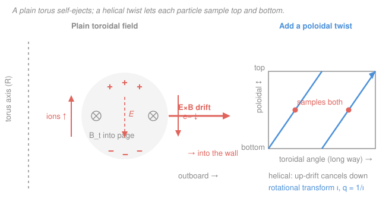

# Fusion & Plasma Engineering · Lesson 2.1: From bottles to tori

> ⏱ ~15 min · Module 2: Magnetic Confinement & MHD · Builds on: [1.5 Ignition, breakeven & gain](01-05-ignition-breakeven-gain.md) · Unlocks: [2.2 MHD equilibrium & flux surfaces](02-02-mhd-equilibrium-flux-surfaces.md), [2.3 The tokamak recipe](02-03-the-tokamak-recipe.md)

## Why this matters

Module 1 told you *what* you need — a 100-million-kelvin plasma held long enough to satisfy the triple product. This module is about *how you hold it*, and the answer is not obvious. A magnetic field is a superb wall in two directions and useless in the third; a straight bottle leaks out its ends; and — the punchline of this lesson — the "obvious" fix of bending the bottle into a doughnut **fails outright**, throwing the entire plasma into the wall in milliseconds. Every tokamak and stellarator on Earth exists to defeat that failure. The trick has a name, *rotational transform*, and by the end of this lesson you'll know exactly why it's non-negotiable.

## The idea

A charged particle in a magnetic field can't cross field lines freely: the Lorentz force bends its motion into a tight helix that spirals *along* a line while barely straying *across* it. So a magnetic field is a wall in the two directions perpendicular to $\mathbf{B}$ — but along $\mathbf{B}$, the particle streams away unimpeded. A straight solenoid confines the plasma radially and dumps it straight out both ends.

Two escalating fixes:

1. **Plug the ends** — squeeze the field tighter at each end (a *magnetic mirror*). A stronger field reflects most particles back. But the ones moving nearly straight along $\mathbf{B}$ — the *loss cone* — slip through anyway, and collisions constantly refill that cone. A mirror leaks steadily.

2. **Remove the ends** — bend the bottle into a circle so there are no ends to leak from. This is the torus, and it's the winning topology. But you get a nasty surprise: a simple toroidal field is stronger on the inside of the doughnut than the outside, and that non-uniformity makes ions and electrons **drift apart vertically**. The charge separation builds an electric field, the electric field crossed with the magnetic field pushes *everything* outward, and the plasma is gone.

The cure is to stop the field lines from being simple circles. Give each line a slow helical twist — part the long way around (toroidal), part the short way around (poloidal) — so a single field line spirals over the top *and* under the bottom of the plasma. A particle following that line spends equal time being pushed one way and the other; the drift averages to zero, and the fast electrons streaming along the now-connected line short out the charge separation before it can build. That helical twist is *rotational transform*.

## The formal version

**Gyromotion.** A particle of charge $q$, mass $m$, moving with speed $v_\perp$ across a field $B$ orbits at the *gyroradius* (Larmor radius) and *gyrofrequency*

$$r_L = \frac{m v_\perp}{|q| B}, \qquad \omega_c = \frac{|q| B}{m}.$$

In words: the field ties each particle to a field line on a leash of length $r_L$ — small $r_L$ (strong field, heavy-but-slow particle) means tight confinement across $\mathbf{B}$. Nothing constrains motion *along* $\mathbf{B}$.

**Magnetic mirror & loss cone.** As a particle moves into stronger field, the invariant $\mu = \tfrac{1}{2} m v_\perp^2 / B$ forces $v_\perp$ up and $v_\parallel$ down; it reflects when $v_\parallel \to 0$. It reflects **only if** its velocity is tilted far enough from $\mathbf{B}$. For a mirror ratio $R_m = B_{\max}/B_{\min}$, particles inside the loss cone escape:

$$\sin^2\theta_c = \frac{B_{\min}}{B_{\max}} = \frac{1}{R_m}.$$

In words: any particle whose velocity points within angle $\theta_c$ of the field line is aimed too straight to be turned around, and it leaks out the end.

**Curvature and grad-$B$ drifts.** In a toroidal field, $B_t \propto 1/R$ (stronger at small major radius $R$), so field lines are both curved and non-uniform. The guiding centre drifts perpendicular to *both* $\mathbf{B}$ and the field's gradient/curvature. Combined, for a thermal particle the vertical drift speed is of order

$$v_d \;\approx\; \frac{2 T}{q B R},$$

where $T$ is the temperature in energy units. In words: the doughnut's geometry gives every particle a steady sideways nudge, and — crucially — because $v_d \propto 1/q$, **ions drift one way and electrons the opposite way**.

**Why the plain torus dies.** Ions pile up at the top, electrons at the bottom (or vice versa). That charge separation is a vertical electric field $\mathbf{E}$, and *every* charged particle then feels the

$$\mathbf{v}_{E\times B} = \frac{\mathbf{E}\times\mathbf{B}}{B^2},$$

which is **independent of charge and sign** — so the whole plasma, ions and electrons together, drifts radially outward into the wall. In words: the torus turns its own geometry into a slingshot pointed at the vessel.

**Rotational transform & safety factor.** Add a poloidal field $B_p$ (the short way around) to the toroidal $B_t$. Field lines become helices. Define the **rotational transform** $\iota$ = poloidal angle advanced per single toroidal loop, and its more common inverse the **safety factor**

$$q = \frac{2\pi}{\iota} \;\approx\; \frac{r\, B_t}{R\, B_p},$$

the number of toroidal loops a field line makes per single poloidal loop ($r$ = minor radius of the surface). In words: $q$ counts how "gentle" the twist is — but as long as $q$ is finite, each field line visits top and bottom, the up-drift and down-drift cancel along the way, and electrons stream freely between the separated charges to neutralize $\mathbf{E}$ before it can eject the plasma.

## Picture

## Worked examples

**Example 1 — Why the separation is fatal (drift direction, reasoned out).**

Set up the outboard poloidal cross-section as in the figure: outboard is $+x$ (right, away from the torus axis), up is $+y$, and let $B_t$ point *into the page* ($-\hat z$). Because $B_t \propto 1/R$, the field gets stronger toward the axis, so $\nabla B$ points *inward*, $-\hat x$.

The grad-$B$ drift goes as $\mathbf{v} \propto \dfrac{\mathbf{B}\times\nabla B}{q}$. Compute the cross product: $(-\hat z)\times(-\hat x) = \hat z \times \hat x = +\hat y$. So for a **positive** ion the drift is $+\hat y$ — **up**; for an **electron** ($q<0$) it flips to $-\hat y$ — **down**. Ions collect at the top ($+$), electrons at the bottom ($-$).

That makes $\mathbf{E}$ point from $+$ to $-$, i.e. downward, $-\hat y$. Now the $E\times B$ drift: $\mathbf{E}\times\mathbf{B} = (-E\hat y)\times(-B\hat z) = EB(\hat y\times\hat z) = EB\,\hat x$ — **outward**. Divide by $B^2$: $v_{E\times B} = E/B$, pointed straight at the outer wall, and **the same for ions and electrons**. Flip the direction of $B_t$ and every arrow reverses *except* the last one: the charges swap top for bottom, $\mathbf{E}$ flips, and $\mathbf{E}\times\mathbf{B}$ still points outward. There is no sign choice that saves you — the plain torus always ejects its plasma. That's the whole reason this course is not one lesson long.

**Example 2 — How the twist rescues it (rotational transform estimate).**

Take a flux surface at minor radius $r = 1\,\text{m}$ in a machine with $R = 3\,\text{m}$, toroidal field $B_t = 5\,\text{T}$, and an added poloidal field $B_p = 0.5\,\text{T}$. How helical is a field line?

Over one trip the long way around (toroidal length $2\pi R$), the poloidal field tilts the line so it also climbs poloidally by a fraction $B_p/B_t$ of that distance:

$$\Delta(\text{poloidal}) = 2\pi R\,\frac{B_p}{B_t}.$$

To complete one full poloidal lap it must cover $2\pi r$, so the number of toroidal loops per poloidal loop is

$$q = \frac{2\pi r}{2\pi R\,(B_p/B_t)} = \frac{r\,B_t}{R\,B_p} = \frac{(1)(5)}{(3)(0.5)} = 3.3.$$

So a field line wraps $3.3$ times the long way for each time around the short way, and the rotational transform is $\iota = 2\pi/q \approx 1.9\,\text{rad} \approx 108^\circ$ of poloidal advance per toroidal loop. **Why that cancels the drift:** the vertical drift $v_d$ is always vertical, but relative to the flux surface, "up" means *outward* when the particle is on top of the surface and *inward* when it's on the bottom. The twist marches the particle steadily from outboard to top to inboard to bottom and back, so the outward and inward pushes alternate and net to nearly zero — the guiding centre stays pinned near the surface. Simultaneously, that same connected field line links the top and bottom, and the light, fast electrons run along it to erase the vertical $\mathbf{E}$. Confinement, restored. (Getting $B_p$ in the first place — by driving a current through the plasma — is the story of [2.3](02-03-the-tokamak-recipe.md).)

## Watch out

- **You might think** the magnetic field confines the plasma like a solid box. **Actually** it only blocks the two directions across $\mathbf{B}$; along $\mathbf{B}$ particles stream freely at thermal speed, which is why open-ended machines (solenoids, mirrors) always leak and why *closing the field lines into a torus* is the real move.
- **You might think** bending the solenoid into a torus is the finish line. **Actually** it's the start of the hard part — the $1/R$ field creates drifts that *must* be cancelled by a twist. A torus without rotational transform confines nothing.
- **You might think** the $E\times B$ drift depends on charge like the others. **Actually** it's the one drift that's charge-*independent* — that's precisely what makes the charge-separation field so lethal: it moves ions and electrons *together*, so nothing cancels and the bulk plasma marches out.

## One-liner

> A magnetic field is a wall in two directions, so close the third into a doughnut — then twist the field lines helically, or the doughnut's own geometry will slingshot the plasma into the wall.

## Problems

**P1 (🟢)** A magnetic mirror has $B_{\min} = 2\,\text{T}$ at its centre and $B_{\max} = 12\,\text{T}$ at each throat. (a) Find the loss-cone half-angle $\theta_c$. (b) The fraction of an isotropic particle population lost through the two cones is $f = 1 - \sqrt{1 - 1/R_m}$. Compute it. What does this say about mirrors as reactors?

**P2 (🟡)** A tokamak flux surface at $r = 0.8\,\text{m}$ sits in a field $B_t = 4\,\text{T}$, $B_p = 0.4\,\text{T}$, with $R = 2.5\,\text{m}$. (a) Estimate the safety factor $q$ and the rotational transform $\iota$ (in degrees per toroidal loop). (b) In one sentence, tie your answer to why the curvature/grad-$B$ drift no longer ejects the plasma. (This $q$ is the same one that governs stability in [2.4](02-04-mhd-instabilities.md) and appears in Boss Problem 2.)

**P3 (🔴, optional)** Estimate the vertical drift speed of a $10\,\text{keV}$ deuteron in a plain torus with $B = 5\,\text{T}$, $R = 6\,\text{m}$, using $v_d \approx 2T/(qBR)$. If nothing cancelled it, roughly how long until the plasma crosses a minor radius $a = 2\,\text{m}$? Comment on the number.

Solutions

**P1.** Mirror ratio $R_m = B_{\max}/B_{\min} = 12/2 = 6$.
(a) $\sin\theta_c = \sqrt{1/R_m} = \sqrt{1/6} = 0.408$, so $\theta_c = \arcsin(0.408) = 24.1^\circ$.
(b) $f = 1 - \sqrt{1 - 1/6} = 1 - \sqrt{0.8333} = 1 - 0.9129 = 0.087$, about $9\%$ of the population sits in the loss cone at any instant. Since collisions continually scatter particles *back into* the empty cone, this fraction leaks out, is refilled, and leaks again — a steady, unavoidable drain. A mirror can't reach reactor-grade confinement by plugging harder; you have to remove the ends entirely. That's the case for the torus.

**P2.** (a) $q \approx \dfrac{r B_t}{R B_p} = \dfrac{(0.8)(4)}{(2.5)(0.4)} = \dfrac{3.2}{1.0} = 3.2$. Rotational transform $\iota = 2\pi/q = 6.283/3.2 = 1.96\,\text{rad}$; in degrees, $360^\circ/q = 360/3.2 = 112.5^\circ$ of poloidal advance per toroidal loop.
(b) Because $\iota \neq 0$, each field line spirals over the top and under the bottom of the plasma, so a particle following it is pushed outward (on top) and inward (on bottom) in turn — the vertical drift averages to nearly zero — while electrons stream along the connected line to neutralize the charge-separation $\mathbf{E}$ before an $E\times B$ ejection can build.

**P3.** Convert: $10\,\text{keV} = 10^4 \times 1.602\times10^{-19}\,\text{J} = 1.602\times10^{-15}\,\text{J}$; $q = 1.602\times10^{-19}\,\text{C}$.
$$v_d \approx \frac{2T}{qBR} = \frac{2(1.602\times10^{-15})}{(1.602\times10^{-19})(5)(6)} = \frac{3.204\times10^{-15}}{4.806\times10^{-18}} \approx 6.7\times10^{2}\,\text{m/s}.$$
Roughly $670\,\text{m/s}$ vertically. But that's not what ejects the plasma directly — it's the charge separation it builds, and the resulting $E\times B$ drift is far faster. Even taking this drift as a crude proxy, crossing $a = 2\,\text{m}$ takes $t \sim a/v_d \approx 2/670 \approx 3\times10^{-3}\,\text{s}$ — a few milliseconds. Against a required energy-confinement time of order a second (Lesson 1.4), that's catastrophic: the plain torus loses its plasma essentially instantly. Rotational transform isn't an optimization; it's what makes toroidal confinement possible at all.

## Flashback

**From Lesson 1.5 (Ignition, breakeven & gain):** A tokamak design reaches gain $Q = 8$ (fusion power over external heating power). The alpha particle carries $3.5\,\text{MeV}$ of the $17.6\,\text{MeV}$ D–T yield and stays in the plasma to heat it, while the neutron's $14.1\,\text{MeV}$ escapes. (a) What multiple of the external heating do the alphas supply? (b) Does this qualify as a "burning plasma," defined by $P_\alpha \geq P_\text{heat}$?

Solution

The alpha (self-heating) fraction of fusion power is $f_\alpha = 3.5/17.6 = 0.199$.
(a) Alpha heating relative to external heating is
$$\frac{P_\alpha}{P_\text{heat}} = \frac{f_\alpha\, P_\text{fus}}{P_\text{heat}} = f_\alpha\, Q = (0.199)(8) = 1.59,$$
so the alphas deliver about $1.6\times$ the external heating.
(b) Yes: $P_\alpha/P_\text{heat} = 1.59 \geq 1$, so it's a burning plasma — self-heating dominates the external drive. (The threshold is $f_\alpha Q = 1$, i.e. $Q \approx 5$; full ignition, needing no external heat at all, is $Q \to \infty$.) None of that matters, of course, unless the field configuration actually holds the plasma together long enough to reach these temperatures — which is exactly what this module builds.

## Connections

- **Backward:** Lesson 1.5 defined the prize ($Q$, ignition) in terms of a confinement time $\tau_E$; this lesson begins explaining the *machine* that delivers $\tau_E$ — and why the naive machine delivers zero.
- **Forward:** The poloidal field and safety factor $q$ introduced here are assembled into a working device in [2.3 The tokamak recipe](02-03-the-tokamak-recipe.md), and the nested helical surfaces become the equilibrium of [2.2 MHD equilibrium & flux surfaces](02-02-mhd-equilibrium-flux-surfaces.md); $q$ returns as the stability knob in [2.4 MHD instabilities](02-04-mhd-instabilities.md).
- **Sideways:** The single-particle drifts ($\nabla B$, curvature, $E\times B$) are worked out in full in the [plasma-physics](../../plasma-physics/syllabus.md) course, and they follow directly from the Lorentz force and $\nabla B$ of the [em-refresher](../../em-refresher/syllabus.md) — this lesson is where that electromagnetics turns into an engineering constraint.
