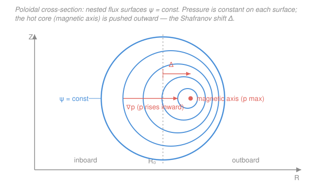

# Fusion & Plasma Engineering · Lesson 2.2: MHD equilibrium & flux surfaces

> ⏱ ~15 min · Module 2: Magnetic Confinement & MHD · Builds on: [2.1 From bottles to tori](02-01-bottles-to-tori.md) · Unlocks: [2.3 The tokamak recipe](02-03-the-tokamak-recipe.md), [2.4 MHD instabilities](02-04-mhd-instabilities.md)

## Why this matters

Lesson 2.1 left us with a demand: bend the field into a torus and twist it so drifts cancel. But *twisting field lines* is only half the story — you also have to hold back a plasma that is 100 million degrees and pushing outward like a compressed gas. Every tokamak (ITER, SPARC, JET) is, at its core, a solution to one static balance: the magnetic force pushing in exactly equals the pressure pushing out. The remarkable payoff is that this balance forces the plasma to organize itself into **nested surfaces of constant pressure** — the flux surfaces — and hands you a single elliptic equation, Grad–Shafranov, that draws them for you. Reading that equation is how engineers know the shape of the fire before they light it.

## The idea

Think of the plasma as a very hot, very slippery fluid — a magnetized gas. Like any gas it wants to expand: it has a pressure $p$ that is high in the hot core and drops to zero at the edge, so there is a pressure gradient $\nabla p$ pointing inward-to-outward, shoving fluid toward the wall. Something has to push back. In a magnetically confined plasma that something is the **magnetic force** $\mathbf{J}\times\mathbf{B}$ — the current flowing in the plasma, crossed with the field it sits in, gives a Lorentz force per unit volume. Equilibrium is just the statement that these two cancel everywhere:

> the magnetic force plugs the leak that pressure keeps trying to open.

Here is the beautiful consequence. The force $\mathbf{J}\times\mathbf{B}$ is, by construction, perpendicular to **both** $\mathbf{J}$ and $\mathbf{B}$. If it has to equal $\nabla p$, then $\nabla p$ must also be perpendicular to $\mathbf{J}$ and $\mathbf{B}$. But "$\nabla p$ is perpendicular to $\mathbf{B}$" means pressure *doesn't change* as you walk along a field line — the whole field line sits at one pressure. Do this for every field line and they knit together into **nested tubes of constant pressure**, like the layers of an onion. Those layers are the flux surfaces. The field lines and the current lines both lie *within* the layers; pressure only changes as you cross from one layer to the next.

## The formal version

**Ideal-MHD force balance.** In steady state, for a plasma slow compared to the field's response,

$$\mathbf{J}\times\mathbf{B} = \nabla p.$$

In words: the magnetic force per unit volume ($\mathbf{J}$ = current density, $\mathbf{B}$ = magnetic field) exactly balances the pressure-gradient force per unit volume ($p$ = plasma pressure). Nothing accelerates; it is a tug-of-war in a dead heat.

**Pressure is a flux-surface label.** Dotting the balance with $\mathbf{B}$ and with $\mathbf{J}$ kills the left side (a cross product is perpendicular to its own factors), leaving

$$\mathbf{B}\cdot\nabla p = 0, \qquad \mathbf{J}\cdot\nabla p = 0.$$

In words: pressure is constant along any field line **and** along any current line. So both $\mathbf{B}$ and $\mathbf{J}$ lie *in* the surfaces $p=\text{const}$ — these are the nested **flux surfaces**.

**The poloidal flux $\psi$.** In an axisymmetric torus (everything independent of the toroidal angle $\phi$), one scalar function $\psi(R,Z)$ — the poloidal magnetic flux, with $R$ the major radius and $Z$ the height — is *itself* constant on each surface. So $\psi$ is a clean coordinate that **labels** the surfaces: pick a value of $\psi$, get a surface; and $p=p(\psi)$, a function of the label alone.

**The Grad–Shafranov equation.** Feeding $p=p(\psi)$ and $F=RB_\phi=F(\psi)$ (the poloidal-current function, with $B_\phi$ the toroidal field) into force balance collapses the whole 3D vector problem to *one* 2D scalar PDE for $\psi(R,Z)$:

$$\Delta^{*}\psi \;=\; -\,\mu_0 R^{2}\,\frac{dp}{d\psi} \;-\; F\,\frac{dF}{d\psi},\qquad \Delta^{*}\psi \equiv R\frac{\partial}{\partial R}\!\left(\frac{1}{R}\frac{\partial\psi}{\partial R}\right)+\frac{\partial^{2}\psi}{\partial Z^{2}}.$$

In words: a Poisson-like elliptic operator acting on $\psi$ equals a source built from how fast pressure ($p'$) and toroidal field ($FF'$) change across the surfaces. You choose the two free profiles $p(\psi)$ and $F(\psi)$; the equation returns the surface shapes. It is **nonlinear** (the right side depends on $\psi$) and **elliptic** (a boundary-value problem, like electrostatics) — so it is solved numerically, not by hand. Our job this lesson is to *read* it: it is nothing but $\mathbf{J}\times\mathbf{B}=\nabla p$ rewritten as a BVP.

## Picture

Notice the surfaces are **not** concentric: as you move inward toward the hot core, their centers march *outward* in major radius. That outward crowding is the **Shafranov shift** $\Delta$ — the plasma pressure and the hoop force of the current push the inner surfaces toward the outboard wall. The innermost point, the single field line where $\nabla p = 0$ and $p$ peaks, is the **magnetic axis**; it sits shifted outward from the geometric center $R_0$ of the boundary. Reading an equilibrium *is* reading this picture: where the axis sits, how tightly the surfaces bunch on the outboard side, how much pressure each surface carries.

## Worked examples

**Example 1 (force-balance reasoning — why $p$ labels the surfaces).** Start from $\mathbf{J}\times\mathbf{B}=\nabla p$ and prove $\mathbf{B}\cdot\nabla p = 0$, then say what it *means*.

Dot both sides with $\mathbf{B}$:

$$\mathbf{B}\cdot(\mathbf{J}\times\mathbf{B}) = \mathbf{B}\cdot\nabla p.$$

The left side is a scalar triple product with a repeated vector, $\mathbf{B}\cdot(\mathbf{J}\times\mathbf{B})$ — geometrically, $\mathbf{J}\times\mathbf{B}$ is perpendicular to $\mathbf{B}$, so its projection onto $\mathbf{B}$ is zero. Hence

$$\mathbf{B}\cdot\nabla p = 0.$$

Now read it. The directional derivative of $p$ along $\mathbf{B}$ vanishes: **walk along a field line and the pressure never changes.** A field line therefore never leaves its constant-$p$ surface — it wraps around inside it forever. Repeat with $\mathbf{J}$ (dot with $\mathbf{J}$: same triple-product cancellation) to get $\mathbf{J}\cdot\nabla p=0$, so current lines lie in the surfaces too. Both the field and the current are *woven into* the pressure layers. That is exactly why a single label $\psi$ can stand in for a whole surface — and why plasma physicists quote profiles as $p(\psi)$, $T(\psi)$, $n(\psi)$ rather than $p(R,Z)$: the surface is the natural coordinate.

**Example 2 (a pressure-balance estimate — plasma pressure vs. field, i.e. $\beta$).** How much plasma pressure can a field hold, and what fraction is a real machine using? Define the ratio

$$\beta \equiv \frac{p}{B^{2}/2\mu_0},$$

In words: $\beta$ is plasma pressure divided by **magnetic pressure** $B^2/2\mu_0$ — the fraction of the confining field's "muscle" that the plasma is actually leaning on. $\beta=1$ is the crude ceiling where plasma pressure would equal the full magnetic pressure.

Take a reactor-scale field $B = 5\,\text{T}$ ($\mu_0 = 4\pi\times10^{-7}$). The magnetic pressure is

$$\frac{B^{2}}{2\mu_0} = \frac{(5)^{2}}{2(4\pi\times10^{-7})} = \frac{25}{2.513\times10^{-6}} \approx 9.9\times10^{6}\,\text{Pa} \approx 100\ \text{atm}.$$

Now the plasma's own pressure. For a quasi-neutral D–T plasma with electron and ion densities each $n$ and both species at temperature $T$, $p = n_e k T_e + n_i k T_i = 2nkT$ ($k$ = Boltzmann constant). At $n = 10^{20}\,\text{m}^{-3}$ and $T = 15\,\text{keV}$ (so $kT = 15{,}000\times1.602\times10^{-19} = 2.40\times10^{-15}\,\text{J}$):

$$p = 2\,(10^{20})(2.40\times10^{-15}) \approx 4.8\times10^{5}\,\text{Pa} \approx 5\ \text{atm}.$$

So the operating $\beta$ is

$$\beta = \frac{4.8\times10^{5}}{9.9\times10^{6}} \approx 0.049 \approx 5\%.$$

Read that: a 5 T field could in principle balance ~100 atm of plasma, but the plasma is running at only ~5 atm — the field is loafing at 5% of its pressure budget. Real tokamaks live near a few percent $\beta$ not because the field can't push harder, but because **stability** (Lesson 2.4) caps $\beta$ long before pressure balance does. Rearranged, this same estimate is a design rule: to confine more pressure at fixed $\beta$ you need $B\propto\sqrt{p}$ — which is exactly why SPARC and ITER chase high field.

## Watch out

- You might think $\mathbf{J}\times\mathbf{B}=\nabla p$ means the field is *pushing the plasma around*. Actually it is a **static** balance — nothing moves. And $\mathbf{J}$ and $\mathbf{B}$ do **not** point along $\nabla p$; they point *across* it, lying inside the constant-pressure surfaces. The force points up the gradient; the field and current run perpendicular to it.
- You might think the flux surfaces are centered on the vacuum vessel. They are not — pressure shoves them outward, so the **magnetic axis** (where $p$ peaks) sits at larger $R$ than the geometric center of the boundary. That offset is the Shafranov shift, and it grows with $\beta$; ignore it and your field probes and heating aim at the wrong spot.
- You might think Grad–Shafranov is a formula you evaluate. It is a **nonlinear elliptic boundary-value problem** — you supply the profiles $p(\psi)$, $F(\psi)$ and the boundary shape, and a code returns $\psi(R,Z)$. "Reading an equilibrium" means interpreting that computed field, not solving the PDE with a pencil.

## One-liner

> Force balance $\mathbf{J}\times\mathbf{B}=\nabla p$ forces pressure to lie flat on nested magnetic flux surfaces labeled by $\psi$, whose shapes the Grad–Shafranov equation computes — read the surfaces, don't solve the PDE.

## Problems

**P1 (🟢)** SPARC-class high-field machine: $B = 12\,\text{T}$. (a) Compute the magnetic pressure $B^2/2\mu_0$. (b) If the plasma runs at $\beta = 0.04$, what plasma pressure $p$ is it holding, in Pa and in atm ($1\ \text{atm}\approx10^{5}\,\text{Pa}$)?

**P2 (🟡)** Starting from $\mathbf{J}\times\mathbf{B}=\nabla p$, prove that $\mathbf{J}\cdot\nabla p = 0$, and state in one sentence what this tells you about where the current flows relative to the pressure layers. Then explain why, on the magnetic axis, $\nabla p = 0$ forces $\mathbf{J}\times\mathbf{B}=0$ there.

**P3 (🔴, optional)** Sharp-boundary pressure balance (a "theta-pinch" cartoon of confinement). Across a thin plasma boundary the total pressure — plasma plus magnetic — is continuous: $p + \dfrac{B_{\text{in}}^{2}}{2\mu_0} = \dfrac{B_{\text{out}}^{2}}{2\mu_0}$, where $B_{\text{out}}$ is the field just outside and $B_{\text{in}}$ the (weaker, because the diamagnetic plasma expels field) field just inside. With $B_{\text{out}} = 6\,\text{T}$ and $B_{\text{in}} = 5.8\,\text{T}$, find the plasma pressure $p$ it confines. Comment on whether this is a high- or low-$\beta$ plasma.

Solutions

**P1** (a) Magnetic pressure:
$$\frac{B^{2}}{2\mu_0} = \frac{(12)^{2}}{2(4\pi\times10^{-7})} = \frac{144}{2.513\times10^{-6}} \approx 5.73\times10^{7}\,\text{Pa} \approx 573\ \text{atm}.$$
Four times the 5 T value from Example 2, since magnetic pressure scales as $B^2$ and $12/5 = 2.4$, $2.4^2\approx5.76$. ✓
(b) At $\beta = 0.04$: $p = \beta\,(B^2/2\mu_0) = 0.04\times5.73\times10^{7} \approx 2.3\times10^{6}\,\text{Pa} \approx 23\ \text{atm}.$ High field buys high confined pressure — roughly $4\times$ the 5 T machine at the same $\beta$, which (via $P_{\text{fus}}\propto p^2$) is the whole high-field bet.

**P2** Dot force balance with $\mathbf{J}$:
$$\mathbf{J}\cdot(\mathbf{J}\times\mathbf{B}) = \mathbf{J}\cdot\nabla p.$$
The left side is a triple product $\mathbf{J}\cdot(\mathbf{J}\times\mathbf{B})$ with the vector $\mathbf{J}$ repeated; since $\mathbf{J}\times\mathbf{B}\perp\mathbf{J}$, its projection on $\mathbf{J}$ is zero. Hence $\mathbf{J}\cdot\nabla p = 0$. **Meaning:** the current has no component across the pressure layers — current flows *within* the flux surfaces, never from one to the next. (Combined with $\mathbf{B}\cdot\nabla p=0$: both field and current are tangent to the surfaces.)

On the magnetic axis, $p$ reaches its maximum, so its gradient vanishes: $\nabla p = 0$ there. Force balance then reads $\mathbf{J}\times\mathbf{B} = 0$ at the axis — the magnetic force must vanish exactly where there is no pressure gradient to oppose. (Physically the axis is the one closed field line at the pressure peak; there is nothing to balance, so the net magnetic force is zero.)

**P3** Solve for $p$:
$$p = \frac{B_{\text{out}}^{2}-B_{\text{in}}^{2}}{2\mu_0} = \frac{(6)^{2}-(5.8)^{2}}{2(4\pi\times10^{-7})} = \frac{36 - 33.64}{2.513\times10^{-6}} = \frac{2.36}{2.513\times10^{-6}} \approx 9.4\times10^{5}\,\text{Pa}\ (\approx 9\ \text{atm}).$$
Compare to the outside magnetic pressure $B_{\text{out}}^2/2\mu_0 = 36/2.513\times10^{-6}\approx1.43\times10^{7}\,\text{Pa}$: the ratio $\beta \approx 9.4\times10^{5}/1.43\times10^{7}\approx0.066\approx7\%$. A **low-$\beta$** plasma — the field only had to give up a small sliver ($6\to5.8\,\text{T}$, about 7% of its pressure) to hold the plasma. That tiny field difference *is* the confinement; a machine leaning on nearly all its field ($\beta\to1$) would be violently unstable.

## Flashback

**From Lesson 2.1 (why a plain torus fails):** In a purely toroidal field of magnitude $B = 5\,\text{T}$ at major radius $R = 6\,\text{m}$, estimate the vertical curvature-plus-grad-$B$ drift speed of a $15\,\text{keV}$ deuteron using the order-of-magnitude form $v_d \approx \dfrac{2W}{qBR}$ (with $W$ the particle energy, $q$ the charge). Then state, in one sentence, why this drift wrecks confinement in an *un-twisted* torus.

Solution

$W = 15\,\text{keV} = 15{,}000\times1.602\times10^{-19} = 2.40\times10^{-15}\,\text{J}$, $q = 1.602\times10^{-19}\,\text{C}$:
$$v_d \approx \frac{2(2.40\times10^{-15})}{(1.602\times10^{-19})(5)(6)} = \frac{4.81\times10^{-15}}{4.81\times10^{-18}} \approx 1\times10^{3}\ \text{m/s} \approx 1\ \text{km/s}.$$
(An order-of-magnitude estimate; the exact coefficient depends on the split between parallel and perpendicular energy.) **Why it wrecks confinement:** the drift is *vertical and opposite for ions and electrons*, so charge piles up top and bottom, building a vertical electric field $E$; the resulting $\mathbf{E}\times\mathbf{B}$ drift is the *same direction for both signs* and points radially outward, sweeping the whole plasma into the outboard wall in milliseconds. Twisting the field lines (rotational transform) short-circuits that charge separation — the reason we need the poloidal field of Lesson 2.3.

## Connections

- **Backward:** [2.1](02-01-bottles-to-tori.md) showed *why* we bend the field into a twisted torus (kill the drifts). This lesson shows *what shape* the confined plasma then takes — nested flux surfaces — and the equilibrium that presupposes those closed surfaces exist.
- **Forward:** [2.3](02-03-the-tokamak-recipe.md) builds the actual field (toroidal + poloidal + plasma current) that realizes these surfaces and defines the safety factor $q(\psi)$; [2.4](02-04-mhd-instabilities.md) perturbs this equilibrium and asks which flux-surface configurations tear themselves apart.
- **Sideways:** $\mathbf{J}\times\mathbf{B}=\nabla p$ is the magnetized twin of the static force balances in [fluid dynamics](../../fluid-dynamics/syllabus.md) (there gravity or a wall balances $\nabla p$; here the Lorentz force does — a plasma is a fluid that carries its own confining stress). And Grad–Shafranov is a nonlinear **elliptic boundary-value problem** — the same mathematical animal as the Poisson/Laplace BVPs in [PDEs](../../pdes/syllabus.md) and the electrostatics of [E&M](../../em-refresher/syllabus.md), just with a $\psi$-dependent source. The plasma-physics background for MHD lives in [plasma physics](../../plasma-physics/syllabus.md).
