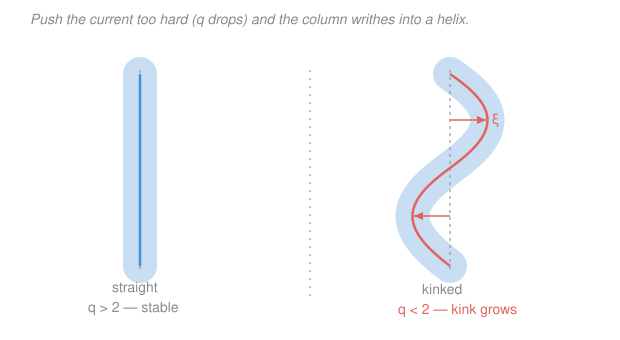
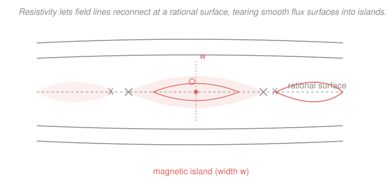

# Fusion & Plasma Engineering · Lesson 2.4: MHD instabilities

> ⏱ ~15 min · Module 2: Magnetic Confinement & MHD · Builds on: [2.3 The tokamak recipe](02-03-the-tokamak-recipe.md), [2.2 MHD equilibrium & flux surfaces](02-02-mhd-equilibrium-flux-surfaces.md) · Unlocks: [2.5 Stellarators](02-05-stellarators.md), [2.6 Operational limits](02-06-operational-limits.md)

## Why this matters

In [2.3](02-03-the-tokamak-recipe.md) you assembled an equilibrium: toroidal field, plasma current, nested flux surfaces, a safety factor $q$. But *equilibrium is not the same as stable*. A pencil balanced on its tip is in equilibrium too. The plasma stores enormous free energy in its current and its pressure gradient, and given a way to release it, it will. The mild versions (sawteeth, tearing modes) quietly degrade confinement; the catastrophic version — a **disruption** — dumps the entire plasma energy and current into the wall in a few milliseconds. Disruptions are the single most dangerous event in a tokamak and the reason ITER has a whole disruption-mitigation system. Learning which modes exist, and what keeps each one caged, is how you read a machine's operating limits (that's [2.6](02-06-operational-limits.md)) and why stellarators ([2.5](02-05-stellarators.md)) throw away the plasma current entirely.

## The idea

Two reservoirs of free energy drive everything here. **Current** flowing along the field wants to writhe — parallel currents attract, so a slightly bent current channel bends further (the same instinct that makes a garden hose whip). **Pressure** pushing outward wants to trade places with the cold gas beyond it — like water sitting on top of oil, heavy-on-light is unstable and the two want to interchange. Magnetic tension is the rubber band that fights back. Whether a mode grows comes down to a tug-of-war: does the released free energy beat the energy cost of bending the field?

The organizing knob is the **safety factor** $q$ from [2.3](02-03-the-tokamak-recipe.md) — the number of times you go the long way around the torus per one time the short way, following a field line. High $q$ means tightly wound, stiff field lines that resist bending; low $q$ means loosely wound field the plasma can shove aside cheaply. Push the current up and $q$ drops (more current = more poloidal field = field lines wind up faster), and one by one the instabilities switch on. Keep $q$ high enough and the plasma stays a quiet column.

## The formal version

**The kink mode (current-driven).** A helical displacement of the whole plasma column — it bows sideways into a corkscrew. It is unstable when the field lines are wound *too loosely* relative to the perturbation. The bounding result is the **Kruskal–Shafranov limit**: a current-carrying column is kink-unstable to the most dangerous ($m=1$) helical mode once the edge safety factor drops below 1,

$$q_a > 1 \quad\text{(Kruskal–Shafranov)}, \qquad\text{in a real tokamak, keep } q_a \gtrsim 2.$$

*In words: if the field lines don't wind around at least once per trip the long way, the column kinks; toroidal geometry and internal modes are unforgiving, so operators leave a safety margin and demand $q_a > 2$.* Recall $q_a = \dfrac{2\pi a^2 B_t}{\mu_0 R I_p}$ (cylindrical estimate, [2.3](02-03-the-tokamak-recipe.md)): since $q_a \propto 1/I_p$, **raising the plasma current lowers $q_a$** and marches you toward the kink. You also need $q>1$ *at the axis* to avoid the internal $m=1$ kink — that's what drives sawteeth, below.

**Interchange & ballooning modes (pressure-driven).** These are the magnetic cousins of the **Rayleigh–Taylor instability** (heavy fluid on light). The role of "gravity" is played by magnetic **field-line curvature**. Where the field curves *away* from the plasma (convex toward the plasma — "bad curvature," the outboard side of the torus), the pressure gradient and curvature align to push plasma out, and a finger of hot plasma can interchange with cold edge gas. Localized to the bad-curvature region, these fingers are **ballooning modes**. The pressure that can be held before they grow is capped — a $\beta$ limit, made quantitative in [2.6](02-06-operational-limits.md).

*In words: hot plasma sitting on the outboard side, where the field bulges outward, is like water perched on oil — it wants to fall outward, and only good average curvature and shear hold it.*

**Sawteeth.** When $q$ dips below 1 on axis, the internal $m=1$ kink flattens the hot core, crashes the central temperature, then the core reheats and the cycle repeats — a periodic sawtooth on the central temperature trace. Usually benign (even useful, for flushing impurities), but a large sawtooth crash can *seed* the next mode.

**Tearing modes (resistive).** Ideal MHD forbids field lines from breaking. But a real plasma has finite resistivity $\eta$ (Spitzer, $\eta \propto T^{-3/2}$, [3.1](03-01-ohmic-heating-ceiling.md)). At a **rational surface** where $q = m/n$ (field lines close on themselves), resistivity lets them *reconnect* into a chain of **magnetic islands**. Inside an island, heat short-circuits straight across what used to be nested surfaces, so confinement degrades. The island grows to a saturated width $w$; the **neoclassical tearing mode (NTM)** is the pressure-bootstrapped version that limits performance in long pulses.

**Disruptions.** When a mode (or a density/current limit) triggers a *global* loss of stability, the plasma suffers a **thermal quench** — its stored thermal energy $W$ is dumped in $\sim 1$ ms — followed by a **current quench** — the plasma current decays in tens of milliseconds, driving huge eddy and **halo currents** in the vessel and, via runaway electrons, a possible beam of MeV electrons into the wall.

$$W = 3\,n T\,V,$$

*In words: the thermal energy stored in the plasma is about $3nT$ per cubic metre (electrons plus ions, each carrying $\tfrac32 nT$) times the plasma volume $V$* — hundreds of megajoules in a reactor, deposited on the wall faster than any coolant can carry it away. That is why disruption avoidance and mitigation (massive gas or shattered-pellet injection to radiate the energy uniformly *before* it lands as a spot) is a first-order reactor design problem.

## Picture

The kink: below the $q_a \approx 2$ line the current channel bows into a growing helix (displacement $\xi$). Now the resistive island that quietly eats confinement even when the column stays put:

## Worked examples

**Example 1 (Kruskal–Shafranov — how much current before the column kinks?).** Take the [2.3](02-03-the-tokamak-recipe.md) tokamak: $R = 6\,\text{m}$, $a = 2\,\text{m}$, $B_t = 5\,\text{T}$, $I_p = 7.5\,\text{MA}$. First the edge safety factor,

$$q_a = \frac{2\pi a^2 B_t}{\mu_0 R I_p} = \frac{2\pi (2)^2 (5)}{(4\pi\times10^{-7})(6)(7.5\times10^6)} = \frac{125.7}{56.5} \approx 2.2.$$

Since $2.2 > 2$, the column clears the practical kink rule — stable, but with little margin. Now: at what current does $q_a$ fall to the threshold $q_a = 2$? Because $q_a \propto 1/I_p$, hold everything else fixed and scale:

$$I_p^{\text{crit}} = I_p \cdot \frac{q_a}{2} = 7.5\,\text{MA} \times \frac{2.2}{2} \approx 8.3\,\text{MA}.$$

*Check by direct substitution:* $I_p^{\text{crit}} = \dfrac{2\pi a^2 B_t}{\mu_0 R \,(2)} = \dfrac{125.7}{(4\pi\times10^{-7})(6)(2)} = \dfrac{125.7}{1.51\times10^{-5}} = 8.3\times10^{6}\,\text{A}$ ✓. So pushing the current past $\sim 8.3\,\text{MA}$ — only $\sim 11\%$ more — drops $q_a$ below 2 and invites the external kink. This is exactly why you can't just crank up current to raise fusion power: $q$-safety fights you.

**Example 2 (disruption energetics — why milliseconds terrify engineers).** Same machine. Estimate the stored thermal energy at $n = 10^{20}\,\text{m}^{-3}$ and $T = 10\,\text{keV}$. Plasma volume of a torus (from [2.2](02-02-mhd-equilibrium-flux-surfaces.md)),

$$V = 2\pi R \cdot \pi a^2 = 2\pi^2 R a^2 = 2\pi^2 (6)(2)^2 \approx 474\,\text{m}^3.$$

Convert temperature to joules: $T = 10^4\,\text{eV} \times 1.602\times10^{-19}\,\text{J/eV} = 1.60\times10^{-15}\,\text{J}$. Then

$$W = 3\,nT\,V = 3\,(10^{20})(1.60\times10^{-15})(474) \approx 2.3\times10^{8}\,\text{J} = 230\,\text{MJ}.$$

That's the kinetic-energy equivalent of a small car at highway speed, sitting in the plasma. In a thermal quench it lands on the wall in $\tau_{\text{TQ}} \sim 1\,\text{ms}$. Spread even *uniformly* over the first-wall area $A \approx (2\pi R)(2\pi a) \approx 474\,\text{m}^2$, the energy fluence is $W/A \approx 0.48\,\text{MJ/m}^2$, i.e. a heat flux of

$$\frac{W}{A\,\tau_{\text{TQ}}} \approx \frac{0.48\,\text{MJ/m}^2}{10^{-3}\,\text{s}} \approx 480\,\text{MW/m}^2,$$

nearly *fifty times* the $\sim 10\,\text{MW/m}^2$ steady engineering limit of a divertor target ([3.5](03-05-scrape-off-layer-divertor.md)) — and real disruptions concentrate on a fraction of the wall, so local loads are worse. A pulse that intense in a millisecond can melt or vaporize tungsten before conduction carries the heat away. The current quench then adds mechanical (halo-current $\mathbf J\times\mathbf B$) and runaway-electron loads on top. This arithmetic is the entire case for disruption mitigation.

## Watch out

- **You might think $q > 1$ is the rule to remember.** $q_a > 1$ is the textbook Kruskal–Shafranov result for an ideal straight column, but real tokamaks demand $q_a \gtrsim 2$ at the edge (toroidal effects, internal modes, and pressure lower the true threshold). Separately you want $q > 1$ *on axis* to avoid sawteeth. Two different surfaces, two different reasons.
- **You might think tearing modes need a stability limit to be crossed.** They don't — they're *resistive*, so they can grow slowly even in a plasma that ideal MHD calls perfectly stable. Finite resistivity is the enabler; the price is a magnetic island and degraded confinement, not (usually) an instant crash.
- **You might picture a disruption as a slow leak.** It's the opposite: the thermal quench is sub-millisecond and the current quench is milliseconds. The danger isn't total energy so much as the *rate* — power is energy over time, and a millisecond in the denominator is what turns 200 MJ into a wall-destroying flux.

## One-liner

> Current-drive kinks the column (keep $q_a > 2$), pressure-drive interchanges it on the bad-curvature side, resistivity tears it into islands — and when global stability fails, a disruption dumps the whole plasma into the wall in milliseconds.

## Problems

**P1 (🟢)** A tokamak runs at $q_a = 3.0$ with plasma current $I_p = 5\,\text{MA}$ (fixed $R$, $a$, $B_t$). Using $q_a \propto 1/I_p$, find the current at which $q_a$ falls to the practical kink threshold of 2. By what percentage can the current be raised before the column is expected to kink?

**P2 (🟡)** Estimate the thermal energy stored in a compact high-field tokamak with $R = 1.85\,\text{m}$, $a = 0.57\,\text{m}$, $n = 3\times10^{20}\,\text{m}^{-3}$, $T = 12\,\text{keV}$. Take $V = 2\pi^2 R a^2$ and $W = 3nTV$. If a thermal quench dumps this in $0.5\,\text{ms}$, what is the average power delivered to the wall (in GW)?

**P3 (🔴)** A tearing mode grows at a rational surface where $q = 2$. In the cylindrical picture $q(r) = \dfrac{2\pi r^2 B_t}{\mu_0 R\, I(r)}$, where $I(r)$ is the current enclosed within radius $r$. For a tokamak with $B_t = 5\,\text{T}$, $R = 6\,\text{m}$, and a uniform current density giving total current $I_p = 7.5\,\text{MA}$ over minor radius $a = 2\,\text{m}$, find the minor radius $r_s$ of the $q = 2$ surface. (Hint: uniform current density means $I(r) = I_p\,(r/a)^2$.)

Solutions

**P1** Since $q_a \propto 1/I_p$, the product $q_a I_p$ is fixed:

$$I_p^{\text{crit}} = I_p \cdot \frac{q_a}{q_a^{\text{crit}}} = 5\,\text{MA} \times \frac{3.0}{2.0} = 7.5\,\text{MA}.$$

The current can rise from 5 to 7.5 MA, a $\dfrac{7.5 - 5}{5} = 0.5 = 50\%$ increase, before $q_a$ hits 2.

*Check.* Larger $q_a$ margin means more headroom, and indeed $q_a = 3$ (vs Example 1's 2.2) gave 50% vs 11% — consistent. Units cancel (ratio of currents). ✓

**P2** Volume:

$$V = 2\pi^2 R a^2 = 2\pi^2 (1.85)(0.57)^2 = 2\pi^2 (1.85)(0.3249) \approx 11.9\,\text{m}^3.$$

Temperature in joules: $T = 1.2\times10^4\,\text{eV} \times 1.602\times10^{-19} = 1.92\times10^{-15}\,\text{J}$. Stored energy:

$$W = 3nTV = 3(3\times10^{20})(1.92\times10^{-15})(11.9) \approx 2.06\times10^{7}\,\text{J} \approx 21\,\text{MJ}.$$

Average power over a $0.5\,\text{ms}$ quench:

$$P = \frac{W}{\tau} = \frac{2.06\times10^{7}\,\text{J}}{5\times10^{-4}\,\text{s}} \approx 4.1\times10^{10}\,\text{W} \approx 41\,\text{GW}.$$

*Check.* A small machine stores ~20 MJ (vs ~230 MJ for the big one in Example 2 — smaller volume, though higher $n$ partly compensates), yet the tiny quench time still yields tens of GW instantaneous — the same lesson: it's the timescale, not just the energy. Units: $\text{J/s} = \text{W}$ ✓.

**P3** Set $q(r_s) = 2$ with $I(r) = I_p (r/a)^2$:

$$q(r) = \frac{2\pi r^2 B_t}{\mu_0 R\, I_p (r/a)^2} = \frac{2\pi a^2 B_t}{\mu_0 R\, I_p} = q_a.$$

The $r^2$ cancels — with **uniform** current density $q$ is *constant* across the minor radius, equal to $q_a \approx 2.2$ (Example 1). So $q$ never equals exactly 2 inside; the $q = 2$ surface sits just outside the plasma. The physics point: a real tokamak has *peaked* current density, so $q$ rises from a low value on axis (near 1) to $q_a$ at the edge, and $q = 2$ lands on an interior surface. To actually place $r_s$ you need the real current profile, not a uniform one.

$$\boxed{\text{Uniform } j \Rightarrow q(r) = q_a = 2.2 \text{ everywhere; no interior } q=2 \text{ surface.}}$$

*Check.* This is a "the setup is a trick" problem — recognizing that uniform current gives flat $q$ (a known result) is the insight. With a peaked profile you would instead solve $q(r_s) = 2$ numerically, and $r_s < a$. ✓

## Flashback

**From Lesson 2.3 (plasma $\beta$):** A tokamak confines a plasma of density $n = 1.5\times10^{20}\,\text{m}^{-3}$ at temperature $T = 12\,\text{keV}$ in a field $B = 5.3\,\text{T}$. Using $\beta = \dfrac{p}{B^2/2\mu_0}$ with total pressure $p = 2nT$ (electrons plus ions), compute $\beta$ and express it as a percentage. Is this a comfortable value for a tokamak?

Solution

Pressure (with $T = 1.2\times10^4 \times 1.602\times10^{-19} = 1.922\times10^{-15}\,\text{J}$):

$$p = 2nT = 2(1.5\times10^{20})(1.922\times10^{-15}) \approx 5.77\times10^{5}\,\text{Pa}.$$

Magnetic pressure:

$$\frac{B^2}{2\mu_0} = \frac{(5.3)^2}{2(4\pi\times10^{-7})} = \frac{28.1}{2.51\times10^{-6}} \approx 1.12\times10^{7}\,\text{Pa}.$$

Therefore

$$\beta = \frac{5.77\times10^{5}}{1.12\times10^{7}} \approx 0.052 = 5.2\%.$$

A few percent is exactly the typical tokamak range — comfortably below the Troyon $\beta$ limit ([2.6](02-06-operational-limits.md)), where the pressure-driven ballooning modes of *this* lesson would switch on. It says the magnetic field is doing most of the work holding the plasma: magnetic pressure exceeds plasma pressure roughly twentyfold.

*Check.* Units: $\text{Pa}/\text{Pa}$, dimensionless ✓. Order of magnitude: $\beta \sim 0.05$ matches real machines (ITER targets a few percent). ✓

## Connections

- **Backward:** every mode here is measured against the safety factor $q$ and the equilibrium force balance $\mathbf J \times \mathbf B = \nabla p$ from [2.3](02-03-the-tokamak-recipe.md) and [2.2](02-02-mhd-equilibrium-flux-surfaces.md) — kinks eat the current's free energy, interchanges eat the pressure gradient's.
- **Forward:** [2.6 Operational limits](02-06-operational-limits.md) turns the qualitative "keep $q_a > 2$" and "$\beta$ can't be too big" into the hard walls of the operating diagram (Kruskal–Shafranov, Troyon, Greenwald), and disruptions reappear as what happens when you cross one. [2.5 Stellarators](02-05-stellarators.md) sidesteps kinks and disruptions by carrying **no plasma current** — the twist comes from external 3D coils instead.
- **Sideways (fluid dynamics & E&M):** interchange and ballooning modes are the magnetized Rayleigh–Taylor instability of fluid dynamics, with field-line curvature standing in for gravity; tearing modes are **magnetic reconnection**, the same E&M process that powers solar flares and magnetospheric substorms — a bridge to plasma astrophysics (see the [plasma-physics](../../plasma-physics/syllabus.md) syllabus for the MHD stability spine).
