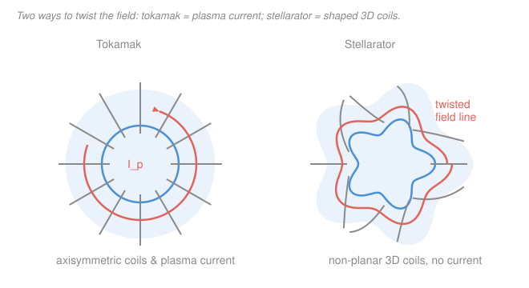

# Fusion & Plasma Engineering · Lesson 2.5: Stellarators

> ⏱ ~15 min · Module 2: Magnetic Confinement & MHD · Builds on: [2.4 MHD instabilities](02-04-mhd-instabilities.md), [2.3 The tokamak recipe](02-03-the-tokamak-recipe.md) · Unlocks: [2.6 Operational limits](02-06-operational-limits.md)

## Why this matters

The tokamak's genius — driving a big toroidal plasma current to twist the field — is also its curse. That current is a loaded spring: it drives kink instabilities and can dump the whole plasma in a millisecond-scale **disruption** ([2.4](02-04-mhd-instabilities.md)), and because it's induced by a transformer, it *runs down* — so a tokamak is inherently a pulsed machine. The stellarator asks a radical question: what if we get the twist from the **coils** instead of the plasma, and carry **no net plasma current at all**? You lose the elegant symmetry of a tokamak and inherit fiendishly complicated 3D coils — but you win steady-state operation and delete the entire disruption/kink problem. Germany's W7-X (operating since 2015) is the flagship bet that this trade is worth making.

## The idea

Recall the core problem from [2.1](02-01-bottles-to-tori.md): in a pure toroidal field, charged particles drift vertically (curvature and grad-$B$ drifts), ions one way and electrons the other. That charge separation builds an electric field, the resulting $\mathbf{E}\times\mathbf{B}$ drift throws the whole plasma at the wall, and confinement is lost in microseconds. The fix is **rotational transform**: make the field lines *spiral*, so a particle riding a line spends time above *and* below the midplane and the drifts cancel out over a lap.

A tokamak generates that spiral by pushing a toroidal current through the plasma — the current makes a poloidal (short-way-around) field that, added to the toroidal (long-way-around) field, gives every line a helical twist. The stellarator does the *same twisting* with **external coils bent into 3D shapes**. No plasma current required. Picture a plain circular donut versus a donut that's been grabbed and given a five-lobed twist as it goes around (right side of the figure): that twist, built into the vacuum field by the coils, is what does the confining.

The catch is geometry. A tokamak is **axisymmetric** — spin it about the vertical axis and nothing changes — and that symmetry guarantees good particle orbits. Break the symmetry to build the twist externally, and you reopen the drift-loss problem in a subtler form: particles can get trapped in the field's 3D "ripples" and drift out. That extra loss channel is why classic stellarators confined *worse* than tokamaks for decades — until designers learned to hide a symmetry inside the 3D field (**quasi-symmetry**), the modern breakthrough.

## The formal version

**Rotational transform.** Quantify the twist by the **rotational transform** $\iota$ (Greek iota):

$$\iota = \frac{\text{poloidal turns a field line makes}}{\text{one toroidal turn}} = \frac{1}{q},$$

where $q$ is the **safety factor** from [2.3](02-03-the-tokamak-recipe.md). *In words: $\iota$ counts how many times a field line winds the short way around for each trip the long way around; it's just the reciprocal of $q$.* Confinement needs $\iota \neq 0$ on every flux surface.

**Where the twist comes from.** The poloidal field $B_\theta$ that supplies the twist obeys Ampère's law. For a tokamak, the source is the plasma current $I_p$ threading the torus:

$$B_\theta(a) = \frac{\mu_0 I_p}{2\pi a}, \qquad \iota \propto \frac{B_\theta}{B_\phi} \propto \frac{I_p}{B_\phi},$$

with $a$ the minor radius (m), $B_\phi$ the toroidal field (T), and $\mu_0 = 4\pi\times10^{-7}$ (T·m/A). *In words: no plasma current, no twist — the tokamak's confinement is hostage to a current it must keep flowing.* The stellarator instead builds $B_\theta$ from **non-planar external coils** (helical windings, or modern "modular" coils each bent into its own 3D shape). The vacuum field they produce is already twisted, so $\iota \neq 0$ with $I_p = 0$.

**Quasi-symmetry.** A charged particle's confinement depends, through its guiding-center orbit, not on the full vector field $\mathbf{B}$ but essentially on the *magnitude* $|\mathbf{B}|$. A field is **quasi-symmetric** if, written in flux coordinates $(\psi, \theta, \phi)$ — $\psi$ labels the flux surface, $\theta$ is poloidal angle, $\phi$ toroidal angle — the magnitude depends on the angles only through a single helical combination:

$$|\mathbf{B}| = |\mathbf{B}|\big(\psi,\; m\theta - n\phi\big).$$

*In words: even though the coils are fully 3D, arrange the field so its **strength** has a hidden 1D symmetry.* That symmetry gives a conserved momentum (Noether-style), which pins particle orbits to flux surfaces just as axisymmetry does in a tokamak — recovering tokamak-quality confinement in a currentless 3D device. HSX (Wisconsin) demonstrated quasi-*helical* symmetry; W7-X uses the closely related omnigenity/quasi-isodynamic optimization. This is the idea that made the modern stellarator competitive.

## Picture

## Worked examples

**Example 1 — the tokamak/stellarator trade, tabulated.** Line the two up on the five axes that decide the machine:

| Axis | Tokamak | Stellarator |
|---|---|---|
| Source of rotational transform | Internal plasma current $I_p$ | External 3D coils (currentless plasma) |
| Steady-state capability | Pulsed (inductive current runs down); steady state only via costly current drive | Intrinsically steady-state |
| Disruption / kink risk | High — current-driven kinks, Kruskal–Shafranov limit, disruptions ([2.4](02-04-mhd-instabilities.md)) | Essentially none — no current to kink or disrupt |
| Coil complexity | Modest — planar, axisymmetric coils | Severe — non-planar coils, tight tolerances |
| Confinement quality | Excellent (symmetry-protected orbits) | Historically worse; **quasi-symmetry** closes the gap |

*When each wins.* If you value a proven, well-confined burning plasma and can live with pulses and disruption mitigation, the tokamak leads (ITER, SPARC). If you want a machine that runs continuously and can *never* disrupt — the two properties a utility craves most — the stellarator is the bet, provided you can afford to build and align the coils and you've optimized $|\mathbf{B}|$ for confinement (W7-X).

**Example 2 — why a tokamak is pulsed but a stellarator isn't.** The tokamak's plasma current is the secondary of a transformer: a central solenoid's changing flux $\Psi$ drives a loop voltage around the torus (Faraday's law),

$$V_{\text{loop}} = \frac{d\Psi}{dt},$$

and that voltage pushes $I_p$. Even after the current is established, the finite-resistance plasma dissipates it, so you must keep supplying voltage — which means the solenoid flux must keep *ramping in one direction*. But a solenoid has a finite flux swing $\Delta\Psi$ (its **volt-second budget**) before it saturates. Once you've spent it, the drive stops and the current decays. The flat-top duration is roughly

$$t_{\text{pulse}} \approx \frac{\Delta\Psi}{V_{\text{loop}}}.$$

Take an illustrative $\Delta\Psi = 100$ Wb and a resistive flat-top loop voltage $V_{\text{loop}} = 1$ V:

$$t_{\text{pulse}} \approx \frac{100\ \text{Wb}}{1\ \text{V}} = 100\ \text{s}.$$

Units check: $\text{Wb}/\text{V} = (\text{V·s})/\text{V} = \text{s}$ ✓. A hundred seconds, then you must ramp down, re-cock the transformer, and fire again — a **pulsed** power plant, with thermal fatigue every cycle and energy storage to smooth the output. The stellarator carries *no* inductively driven current, spends *no* volt-seconds, and its coils hold the twist indefinitely: $t_{\text{pulse}} \to \infty$. For a grid that wants continuous baseload, that difference is the whole ballgame. (W7-X is built to sustain plasmas for 30 minutes; the twist itself would last as long as the coils are powered.)

## Watch out

- **You might think a stellarator's currentless plasma means it can never confine as well as a tokamak.** Historically true, but *not* fundamental: quasi-symmetry engineers a hidden symmetry into $|\mathbf{B}|$ that restores tokamak-grade orbit confinement — HSX and W7-X measured neoclassical losses far below classic stellarators.
- **You might think tokamaks are doomed to be pulsed.** They have escapes — RF and neutral-beam **current drive** ([3.2](03-02-neutral-beam-injection.md), [3.3](03-03-rf-heating-current-drive.md)) plus the self-generated **bootstrap current** can sustain $I_p$ non-inductively. But driving current costs recirculating power, whereas the stellarator gets steady-state *for free* from its geometry.
- **You might think "no plasma current" means "no instabilities at all."** Stellarators still face pressure-driven modes (ballooning, interchange) and a $\beta$ limit ([2.6](02-06-operational-limits.md)). What they delete is the entire *current-driven* family — kinks, sawteeth, tearing, and the disruptions those trigger.

## One-liner

> A stellarator buys steady-state, disruption-free operation by twisting the field with intricate external 3D coils instead of a plasma current — then uses quasi-symmetry to win back the confinement that breaking axisymmetry gave away.

## Problems

**P1 (🟢) — rotational-transform bookkeeping.** A stellarator is designed so its field lines make $\iota = 0.4$ poloidal turns per toroidal turn. (a) What is the equivalent safety factor $q$? (b) A tokamak would need the same $q$ — where must its twist come from, and name one consequence for how it operates that the stellarator avoids.

**P2 (🟡) — volt-second budget.** A tokamak sustains its current purely inductively at a flat-top loop voltage $V_{\text{loop}} = 0.3$ V. Its central solenoid can deliver a flux swing of $\Delta\Psi = 45$ Wb before saturating. (a) How long can it hold the current flat? (b) What is the corresponding number for an equivalent stellarator, and in one sentence why does this matter for a power plant?

**P3 (🔴) — quasi-symmetry pays off in the triple product.** Optimizing a stellarator for quasi-symmetry raises its energy confinement time from $\tau_E = 0.15$ s (classic) to $\tau_E = 0.30$ s, at fixed density $n = 2\times10^{20}\ \text{m}^{-3}$ and temperature $T = 10$ keV. (a) Compute the fusion triple product $nT\tau_E$ before and after. (b) The D-T ignition threshold is roughly $nT\tau_E \gtrsim 3\times10^{21}\ \text{keV·m}^{-3}\text{·s}$ ([1.4](01-04-lawson-criterion-triple-product.md)). What fraction of the way to ignition does each case reach, and what does that say about why quasi-symmetry was the enabling breakthrough?

Solutions

**P1.** (a) By definition $\iota = 1/q$, so

$$q = \frac{1}{\iota} = \frac{1}{0.4} = 2.5.$$

(b) A tokamak has no external twist, so this $q$ must come from its **plasma current** $I_p$ (via the poloidal field $B_\theta = \mu_0 I_p/2\pi a$). Consequence: that current has to be driven — inductively, so the machine is **pulsed** — and it is kink/disruption-prone ([2.4](02-04-mhd-instabilities.md)). The stellarator gets the identical $q = 2.5$ from its coils, so it runs steady-state and can't disrupt. *(Either the pulsed-operation or the disruption point earns full credit.)*

**P2.** (a) Flat-top duration is the volt-second budget divided by the sustaining voltage:

$$t_{\text{pulse}} \approx \frac{\Delta\Psi}{V_{\text{loop}}} = \frac{45\ \text{Wb}}{0.3\ \text{V}} = 150\ \text{s}.$$

Units: $\text{Wb}/\text{V} = \text{V·s}/\text{V} = \text{s}$ ✓.

(b) The stellarator needs no inductive current, spends no volt-seconds, so $t_{\text{pulse}} \to \infty$ (limited only by keeping the coils powered and cooled) — effectively **steady-state**. It matters because a utility wants continuous baseload output; a 150 s pulse forces energy storage to smooth delivery and inflicts a thermal-fatigue cycle on the structure every shot.

**P3.** (a) The triple product is $nT\tau_E$:

$$\text{classic: } (2\times10^{20})(10)(0.15) = 3.0\times10^{20}\ \text{keV·m}^{-3}\text{·s},$$
$$\text{quasi-symmetric: } (2\times10^{20})(10)(0.30) = 6.0\times10^{20}\ \text{keV·m}^{-3}\text{·s}.$$

Doubling $\tau_E$ doubles the triple product (it enters linearly).

(b) As fractions of the ignition threshold $3\times10^{21}$:

$$\text{classic: } \frac{3.0\times10^{20}}{3\times10^{21}} = 0.10 \;(10\%), \qquad \text{quasi-symmetric: } \frac{6.0\times10^{20}}{3\times10^{21}} = 0.20 \;(20\%).$$

Quasi-symmetry doubles the reach toward ignition (10% → 20%) purely by cutting the 3D drift losses that shorten $\tau_E$. A classic stellarator's extra transport made ignition look hopeless; recovering tokamak-like confinement is exactly what put the stellarator back in the reactor conversation. *(Both cases are still short of ignition — the point is the direction and size of the gain, not that either device ignites here.)*

## Flashback

**From Lesson 2.4 (kink instability / Kruskal–Shafranov).** A tokamak has major radius $R = 5$ m, minor radius $a = 1.5$ m, toroidal field $B_\phi = 4$ T, and plasma current $I_p = 4$ MA. Using the cylindrical estimate $q_a = \dfrac{2\pi a^2 B_\phi}{\mu_0 R I_p}$, compute the edge safety factor. Does it clear the Kruskal–Shafranov stability limit $q_a > 1$ and the operational rule of thumb $q_a > 2$? Then: what does a stellarator do to sidestep this limit entirely?

Solution

Numerator: $2\pi a^2 B_\phi = 2\pi (1.5)^2 (4) = 2\pi(9) = 56.5$ (T·m²).

Denominator: $\mu_0 R I_p = (4\pi\times10^{-7})(5)(4\times10^{6}) = (4\pi\times10^{-7})(2\times10^{7}) = 8\pi \approx 25.1$ (T·m·A · A⁻¹… giving T·m²).

$$q_a = \frac{56.5}{25.1} \approx 2.25.$$

It clears the Kruskal–Shafranov limit $q_a > 1$ comfortably, and also clears the operational $q_a > 2$ with a little margin — this plasma is kink-stable. Units cancel to dimensionless (T·m² over T·m²) ✓.

The stellarator sidesteps the whole limit: Kruskal–Shafranov bounds the plasma *current* (small $I_p$ → large $q_a$ → stable), but a stellarator carries $I_p \approx 0$, so there is no current-driven external kink to stabilize in the first place. The constraint simply doesn't apply.

## Connections

- **Backward:** this closes the loop opened in [2.1](02-01-bottles-to-tori.md) — rotational transform is the cure for toroidal drift losses, and here we get it *without* the plasma current whose instabilities [2.4](02-04-mhd-instabilities.md) catalogued. The safety factor $q$ and poloidal field are straight from [2.3](02-03-the-tokamak-recipe.md).
- **Forward:** [2.6 Operational limits](02-06-operational-limits.md) shows what *still* binds a currentless device — the Troyon $\beta$ limit and density limits survive even when disruptions don't. And the confinement gap the stellarator fights is quantified by the transport scaling of [3.4](03-04-transport-confinement-scaling.md).
- **Sideways (E&M):** the pulsed-vs-steady distinction is pure Faraday and Ampère — the transformer's $V_{\text{loop}} = d\Psi/dt$ and the current's $B_\theta = \mu_0 I_p/2\pi a$ (see the [`em-refresher` syllabus](../../em-refresher/syllabus.md)). The stellarator's coil-shaping problem is an inverse magnetostatics problem: solve for 3D currents that produce a prescribed quasi-symmetric $|\mathbf{B}|$ — the same field-design mindset the [`plasma-physics` syllabus](../../plasma-physics/syllabus.md) builds toward.
