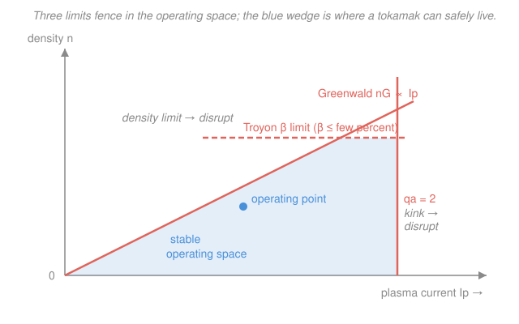

# Fusion & Plasma Engineering · Lesson 2.6: Operational limits

> ⏱ ~15 min · Module 2: Magnetic Confinement & MHD · Builds on: [2.4 MHD instabilities](02-04-mhd-instabilities.md), [2.3 The tokamak recipe](02-03-the-tokamak-recipe.md) · Unlocks: Module 3 — [3.1 The ohmic-heating ceiling](03-01-ohmic-heating-ceiling.md)

## Why this matters

In [2.4](02-04-mhd-instabilities.md) you met the zoo of instabilities — kinks, ballooning modes, tearing, and the disruption they can trigger. This lesson turns that qualitative catalogue into three hard walls you can put numbers on. Every tokamak has an **operating space**: a fenced-off region of density, current, and pressure inside which the plasma is quiet and outside which it disrupts. ITER's control system spends its life keeping the machine inside this box; SPARC's whole design is a bet about how big the box is at high field. If you remember one practical thing from Module 2, make it this: you cannot independently crank up current, density, and pressure to chase fusion power — push any one too far and the plasma bites back. Knowing where the fences are *is* reactor design.

## The idea

Three knobs, three fences.

- **Density.** Pump in too many particles and the plasma edge cools, radiates, and destabilizes — you disrupt. The ceiling on density rises with plasma current: more current lets you hold more particles. This is the **Greenwald limit**.
- **Pressure.** Store too much plasma pressure relative to the magnetic pressure holding it, and the pressure-driven ballooning modes from [2.4](02-04-mhd-instabilities.md) switch on. The ceiling on $\beta$ (pressure over magnetic pressure) is set by current, size, and field — the **Troyon limit**.
- **Current.** Push the current too high and the field lines wind too loosely, and the column kinks (Kruskal–Shafranov, [2.4](02-04-mhd-instabilities.md)). The rule of thumb is keep the edge **safety factor** $q_a > 2$.

Notice they pull against each other. Raising current helps density (Greenwald goes up) and helps pressure headroom (Troyon goes up) — but too much current triggers the kink. So the operating space is a *bounded* region: a wedge with a rising density ceiling, a pressure ceiling, and a current wall on the right. Live inside it and you have a plasma; step over any edge and you have a wall-repair bill.

## The formal version

**Greenwald density limit.** The empirical maximum line-averaged density is

$$n_G\,[10^{20}\,\text{m}^{-3}] = \frac{I_p\,[\text{MA}]}{\pi a^2\,[\text{m}^2]},$$

where $I_p$ is the plasma current and $a$ the minor radius. *In words: the density ceiling (in units of $10^{20}$ particles per cubic metre) equals the current in mega-amps divided by the plasma's cross-sectional area.* Operate above $n_G$ and the plasma tends to disrupt. It is **empirical, not fundamental** — machines routinely run at $0.8$–$1.0$ of $n_G$, and clever fueling (pellets injected deep into the core) can locally exceed it. But it is a remarkably robust fence across every tokamak ever built, and it scales only with $I_p/a^2$ — not with field, not with temperature.

**Troyon $\beta$ limit.** Recall plasma beta $\beta = \dfrac{p}{B_t^2/2\mu_0}$ from [2.3](02-03-the-tokamak-recipe.md) — the ratio of plasma pressure $p$ to magnetic pressure. Ideal-MHD stability caps it at

$$\beta_{\max}\,[\%] \approx \beta_N\,\frac{I_p\,[\text{MA}]}{a\,[\text{m}]\,B_t\,[\text{T}]}, \qquad \beta_N \approx 3,$$

where $B_t$ is the toroidal field and $\beta_N$ (the **normalized beta**, or Troyon factor) is a dimensionless number around $3$ that packages the plasma shape and profile. *In words: the fraction of magnetic pressure you can fill with plasma pressure is set by current over (size times field), and even at the stability edge it lands at only a few percent.* Cross it and the ballooning modes of [2.4](02-04-mhd-instabilities.md) grow. The headline consequence: **$\beta$ is capped at a few percent** — the magnetic field always does the overwhelming majority of the confining work.

**Kink / safety-factor limit.** From [2.4](02-04-mhd-instabilities.md), keep the edge safety factor above the practical kink threshold,

$$q_a = \frac{2\pi a^2 B_t}{\mu_0 R\,I_p} > 2,$$

with $R$ the major radius and $\mu_0 = 4\pi\times10^{-7}$. *In words: the field lines must wind the long way around the torus at least twice per trip the short way, or the current column corkscrews.* Since $q_a \propto 1/I_p$, this is a **ceiling on current**: raise $I_p$ and $q_a$ falls toward 2.

Put the three together on a density-versus-current plane and they carve out the operating space: the rising Greenwald line is the density ceiling, the Troyon condition caps the pressure (roughly a density cap at fixed $T$ and $B$), and the kink condition is a vertical wall at maximum current.

## Picture

The blue wedge is the safe operating space. Its upper-left edge is the Greenwald line rising with current; its top is clipped by the Troyon $\beta$ ceiling; its right edge is the $q_a = 2$ kink wall. Every point outside a coral line is a disruption waiting to happen.

## Worked examples

**Example 1 (Greenwald limit for the boss shape — and a design tension).** Take the Module-2 reactor: $I_p = 7.5\,\text{MA}$, $a = 2\,\text{m}$. The Greenwald density:

$$n_G = \frac{I_p}{\pi a^2} = \frac{7.5}{\pi (2)^2} = \frac{7.5}{12.57} \approx 0.60\times10^{20}\,\text{m}^{-3}.$$

Now compare it to a typical reactor operating density of $10^{20}\,\text{m}^{-3}$. The **Greenwald fraction** is

$$f_G = \frac{n}{n_G} = \frac{1.0}{0.60} \approx 1.7.$$

The operating point sits at $170\%$ of the Greenwald limit — *above* the fence. That is a real, deliberate design tension: to make a reactor you want high density (fusion power $\propto n^2$), but Greenwald says this current and size can't hold it. Could you legalize $n = 10^{20}$ by raising the current until $n_G = 1.0$? That needs $I_p = \pi a^2 n_G = \pi(4)(1.0) \approx 12.6\,\text{MA}$. But from [2.4](02-04-mhd-instabilities.md), $q_a \propto 1/I_p$ was already only $2.2$ at $7.5\,\text{MA}$; at $12.6\,\text{MA}$ it drops to $q_a \approx 2.2\times\frac{7.5}{12.6} \approx 1.3 < 2$ — straight into the kink. **The Greenwald fix collides with the kink limit.** The only way out is a bigger machine (larger $a$) or higher field — which is exactly the argument for ITER's size and SPARC's field.

**Example 2 (Troyon $\beta$ limit for the boss shape).** Same machine plus $B_t = 5\,\text{T}$, and take $\beta_N = 3$. The Troyon ceiling:

$$\beta_{\max} = \beta_N\,\frac{I_p}{a\,B_t} = 3\times\frac{7.5}{(2)(5)} = 3\times 0.75 = 2.25\%.$$

Now the operating $\beta$ this plasma actually wants, at $n = 10^{20}\,\text{m}^{-3}$ and $T = 10\,\text{keV}$. Total pressure $p = 2nT$ (electrons plus ions), with $T = 10^4\,\text{eV}\times1.602\times10^{-19} = 1.602\times10^{-15}\,\text{J}$:

$$p = 2nT = 2(10^{20})(1.602\times10^{-15}) = 3.20\times10^{5}\,\text{Pa}.$$

Magnetic pressure $\dfrac{B_t^2}{2\mu_0} = \dfrac{(5)^2}{2(4\pi\times10^{-7})} = \dfrac{25}{2.51\times10^{-6}} \approx 9.95\times10^{6}\,\text{Pa}$. So

$$\beta = \frac{p}{B_t^2/2\mu_0} = \frac{3.20\times10^{5}}{9.95\times10^{6}} \approx 0.032 = 3.2\%.$$

The operating $\beta$ of $3.2\%$ sits *above* the conventional Troyon ceiling of $2.25\%$ — it would demand $\beta_N \approx 3\times\frac{3.2}{2.25} \approx 4.3$, the realm of "advanced tokamak" scenarios with carefully tailored profiles. Same lesson as Example 1: the boss reactor is deliberately parked near or past the empirical fences, which is precisely why burning-plasma design is hard. The honest engineering levers are more current, more field, or a bigger machine — never a free lunch.

## Watch out

- **You might think the Greenwald limit is a hard wall of physics.** It isn't — it's *empirical*. Nothing fundamental forbids $n > n_G$; deep pellet fueling and some regimes exceed it locally. Contrast the Troyon and kink limits, which come straight from ideal-MHD stability. Treat Greenwald as a strong warning line, not a law of nature.
- **You might think a high $\beta$ is the goal, so bigger is always better.** $\beta$ is capped at a few percent by Troyon no matter what — the field does the confining. What you actually chase is the fusion **triple product** ([1.4](01-04-lawson-criterion-triple-product.md)); high field lets you raise density and pressure in absolute terms while keeping $\beta$ (the *ratio*) modest. That is the entire high-field-tokamak thesis.
- **You might blur $q_a > 2$ with $q_0 > 1$.** They are different fences on different surfaces: $q_a > 2$ at the *edge* guards against the external kink (a current limit); $q_0 > 1$ on *axis* guards against sawteeth ([2.4](02-04-mhd-instabilities.md)). Both matter; don't collapse them into one.

## One-liner

> Greenwald caps density ($n_G = I_p/\pi a^2$), Troyon caps pressure ($\beta \lesssim 3\,I_p/aB_t$, a few percent), and the kink caps current ($q_a > 2$) — three fences whose intersection is the only place a tokamak can safely live.

## Problems

**P1 (🟢)** An ITER-scale tokamak runs at $I_p = 15\,\text{MA}$ with minor radius $a = 2\,\text{m}$. (a) Compute the Greenwald density $n_G$. (b) If it operates at $n = 1.0\times10^{20}\,\text{m}^{-3}$, find the Greenwald fraction and say whether it is inside the limit.

**P2 (🟡)** A compact high-field tokamak (SPARC-like) has $B_t = 12.2\,\text{T}$, $a = 0.57\,\text{m}$, $I_p = 8.7\,\text{MA}$. Using $\beta_N = 3$, compute the Troyon $\beta$ limit $\beta_{\max}$. If the design targets an operating $\beta = 2\%$, is that inside the stability fence, and with how much margin?

**P3 (🔴)** For a machine with $a = 1.5\,\text{m}$, $B_t = 6\,\text{T}$, $R = 5\,\text{m}$, map the corner of the operating box set by the kink limit. (a) Using $q_a = \dfrac{2\pi a^2 B_t}{\mu_0 R I_p}$, find the maximum current $I_p^{\max}$ allowed by $q_a > 2$. (b) At that current, compute the Greenwald density $n_G$. (c) At that current, compute the Troyon limit $\beta_{\max}$ ($\beta_N = 3$). State the three-number operating ceiling in one sentence.

Solutions

**P1.** (a) Greenwald density:

$$n_G = \frac{I_p}{\pi a^2} = \frac{15}{\pi (2)^2} = \frac{15}{12.57} \approx 1.19\times10^{20}\,\text{m}^{-3}.$$

(b) Greenwald fraction $f_G = \dfrac{n}{n_G} = \dfrac{1.0}{1.19} \approx 0.84$, i.e. $84\%$ of the limit — comfortably **inside** the fence. This is why ITER's much larger current (15 MA vs the 7.5 MA boss) lets it hold $n = 10^{20}$ where the small machine of Example 1 could not: Greenwald scales with $I_p$.

*Check.* $f_G < 1$, and $n_G$ grew by exactly the current ratio $15/7.5 = 2$ relative to Example 1's $0.60$ (same $a$): $2\times0.60 = 1.19$ ✓.

**P2.** Troyon limit:

$$\beta_{\max} = \beta_N\,\frac{I_p}{a\,B_t} = 3\times\frac{8.7}{(0.57)(12.2)} = 3\times\frac{8.7}{6.95} = 3\times1.25 \approx 3.75\%.$$

A target of $\beta = 2\%$ sits below $3.75\%$, so it is **inside** the fence, with margin $3.75 - 2.0 = 1.75$ percentage points — roughly a factor $\frac{3.75}{2.0} \approx 1.9$ of headroom in $\beta_N$ terms (the design would run at effective $\beta_N \approx 3\times\frac{2.0}{3.75} \approx 1.6$).

*Check.* Units: $\text{MA}/(\text{m}\cdot\text{T})$ times the (implicit) $\beta_N$ units give percent ✓. A few percent is the expected tokamak range ✓.

**P3.** (a) Set $q_a = 2$ and solve for current:

$$I_p^{\max} = \frac{2\pi a^2 B_t}{\mu_0 R\,(2)} = \frac{2\pi (1.5)^2 (6)}{(4\pi\times10^{-7})(5)(2)} = \frac{84.8}{1.257\times10^{-5}} \approx 6.75\times10^{6}\,\text{A} = 6.75\,\text{MA}.$$

(b) Greenwald density at that current:

$$n_G = \frac{I_p^{\max}}{\pi a^2} = \frac{6.75}{\pi (1.5)^2} = \frac{6.75}{7.07} \approx 0.95\times10^{20}\,\text{m}^{-3}.$$

(c) Troyon limit at that current:

$$\beta_{\max} = 3\,\frac{I_p^{\max}}{a\,B_t} = 3\times\frac{6.75}{(1.5)(6)} = 3\times\frac{6.75}{9} = 3\times0.75 = 2.25\%.$$

**In one sentence:** at this size and field the kink caps the current at $\approx 6.75\,\text{MA}$, and at that ceiling you may hold at most $n \approx 0.95\times10^{20}\,\text{m}^{-3}$ and $\beta \approx 2.25\%$ — the corner of the operating box.

*Check.* All three fences meet at the same current, as they must at the right-hand corner of the wedge in the Picture. $q_a = 2$ back-substituted: $q_a = 84.8/[(1.257\times10^{-6})(5)(6.75\times10^6)] = 84.8/42.4 = 2.0$ ✓.

## Flashback

**From Lesson 2.3 (safety factor):** A compact tokamak has major radius $R = 1.6\,\text{m}$, minor radius $a = 0.5\,\text{m}$, toroidal field $B_t = 3\,\text{T}$, and plasma current $I_p = 1.0\,\text{MA}$. Using the cylindrical estimate $q_a = \dfrac{2\pi a^2 B_t}{\mu_0 R\,I_p}$, compute the edge safety factor. Does it clear the practical kink rule $q_a > 2$, and to what current could you raise $I_p$ before hitting the fence?

Solution

Edge safety factor:

$$q_a = \frac{2\pi a^2 B_t}{\mu_0 R\,I_p} = \frac{2\pi (0.5)^2 (3)}{(4\pi\times10^{-7})(1.6)(1.0\times10^{6})} = \frac{4.712}{2.011} \approx 2.34.$$

Since $2.34 > 2$, it **clears** the kink rule — but with slim margin. Because $q_a \propto 1/I_p$, the current at which $q_a$ falls to $2$ is

$$I_p^{\text{crit}} = I_p\,\frac{q_a}{2} = 1.0\,\text{MA}\times\frac{2.34}{2} \approx 1.17\,\text{MA}.$$

So you have only $\sim 17\%$ of current headroom before the column is expected to kink — a tight box, exactly the kind of margin the operating diagram of this lesson makes visible.

*Check.* $q_a > 2$ and the critical current exceeds the operating current, both consistent. Numerator $2\pi(0.25)(3) = 4.71$; denominator $1.257\times10^{-6}\times1.6\times10^{6} = 2.01$ ✓.

## Connections

- **Backward:** the three fences are the quantitative faces of [2.4](02-04-mhd-instabilities.md)'s instabilities — the kink wall is Kruskal–Shafranov, the Troyon ceiling is the ballooning-mode $\beta$ limit, and crossing any fence is the disruption trigger — all measured against the safety factor $q$ and $\beta$ you built in [2.3](02-03-the-tokamak-recipe.md).
- **Forward:** Module 3 asks how to *fill* this box. [3.1 The ohmic-heating ceiling](03-01-ohmic-heating-ceiling.md) shows why current alone can't heat you to ignition, and [3.4 transport & confinement scaling](03-04-transport-confinement-scaling.md) explains why the density and $\beta$ you can actually sustain depend on how fast heat leaks out — the empirical Greenwald limit itself is a cousin of edge-transport physics.
- **Sideways (plasma physics & empirical scaling):** the Greenwald limit is a data-driven law, not a first-principles one — the same status as the $\tau_E$ confinement scalings. It is a reminder that fusion engineering leans on empirical operating boundaries where theory is incomplete; see the [plasma-physics](../../plasma-physics/syllabus.md) syllabus for the MHD-stability and edge-physics spine behind these fences.
