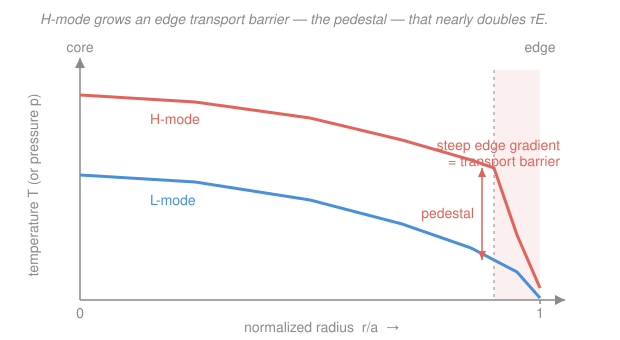

# Fusion & Plasma Engineering · Lesson 3.4: Transport & confinement scaling

> ⏱ ~15 min · Module 3: Heating, Transport & Plasma–Wall Interaction · Builds on: [3.3 RF heating & current drive](03-03-rf-heating-current-drive.md), [3.2 Neutral-beam injection](03-02-neutral-beam-injection.md) · Unlocks: [3.5 The scrape-off layer & divertor](03-05-scrape-off-layer-divertor.md)

## Why this matters

Everything in Module 3 so far has been about pouring power *in* — ohmic, beams, waves. This lesson is about how fast it leaks *out*, and that leak is the single number the whole reactor lives or dies by: the energy confinement time $\tau_E$ from [1.4](01-04-lawson-criterion-triple-product.md). Here's the humbling part — no one can compute $\tau_E$ from first principles for a real tokamak. The heat escapes far faster than clean collisional theory predicts, so the field runs on **empirical scaling laws** fit to decades of machine data. ITER's entire size was set by one such formula. And the biggest lever anyone ever found wasn't in the formula at all: a sudden, self-organizing edge barrier called **H-mode** that nearly doubles $\tau_E$ for free. That discovery is why ITER expects to work.

## The idea

Heat crosses the magnetic field by a **random walk**. A particle takes a step, gets knocked sideways by a collision, takes another step in a new direction. Random walks give diffusion, and a diffusion coefficient is roughly $D \sim (\text{step size})^2 \times (\text{step rate})$. So the whole game is: *how big is one step?*

- **Classical transport.** The smallest possible step is one gyro-orbit: a charged particle spirals around a field line with a tiny radius (the Larmor radius, millimetres). Collisions bump it over by about one such radius. Plug that in and you predict a *superb* $\tau_E$ — minutes. Reality laughs at this.
- **Neoclassical transport.** A torus isn't a straight tube. Its field is stronger on the inboard side, so some particles get magnetically trapped and trace fat "banana" orbits whose width is much larger than a gyroradius. Bigger step → bigger $D$. Neoclassical theory is classical transport corrected for toroidal geometry, and it's typically tens of times worse. Still not enough.
- **Anomalous transport.** What actually dominates is **microturbulence**: the temperature and density gradients themselves drive small-scale drift-wave instabilities, and the resulting swirling eddies convect heat outward like stirring cream into coffee. The effective "step" is an eddy width, far larger than a banana. This channel runs **10–100× above neoclassical** and sets the real $\tau_E$ in every tokamak.

Because turbulence is a messy, self-driven, nonlinear beast, we don't put $\tau_E$ in a clean formula — we *measure* it across many machines and fit a power law. And that fit hides a nasty surprise: **the harder you heat, the worse the confinement gets.**

## The formal version

**Cross-field diffusion.** A random walk with step $\Delta$ and collision frequency $\nu$ gives a heat diffusivity

$$\chi \sim \Delta^2\,\nu, \qquad \tau_E \sim \frac{a^2}{\chi},$$

with $a$ the plasma minor radius (m). *In words: fatter steps or a smaller machine drain heat faster; $\tau_E$ is how long heat takes to diffuse from core to edge.* Classical uses $\Delta \approx$ gyroradius; neoclassical uses $\Delta \approx$ banana width; anomalous replaces $\chi$ with a turbulent value that no envelope calculation reproduces.

**The empirical scaling law.** Because anomalous transport rules, $\tau_E$ is taken from a regression fit to a multi-machine database. The workhorse for tokamak H-mode is **ITER-98(y,2)**; a simplified form of its dependences is

$$\tau_E \;\propto\; I_p^{0.93}\, B^{0.15}\, n^{0.41}\, P^{-0.69}\, R^{2},$$

with plasma current $I_p$, toroidal field $B$, density $n$, total heating power $P$, and major radius $R$ (the full law adds elongation and shape factors). *In words: confinement is bought mainly with plasma current and sheer size, barely helped by field or density — and actively hurt by heating power.*

Read the exponents like a design memo:

- $I_p^{0.93}$ — **current is king.** Nearly linear; the strongest favorable knob, which is why tokamaks push $I_p$ to the disruption limit.
- $R^{2}$ — **bigger is better,** and steeply. This exponent is why ITER is enormous ($R = 6.2$ m): you can't cheat your way to $\tau_E$ with a small device.
- $P^{-0.69}$ — **power degradation.** More heating gives *worse* confinement. The plasma responds to extra power by leaking faster, so the stored energy $W = P\,\tau_E \propto P\cdot P^{-0.69} = P^{0.31}$ grows only weakly. Doubling your heating does *not* double the temperature.

**The L→H transition.** Above a heating-power **threshold** $P_{\text{LH}}$, the plasma edge spontaneously flips into a **high-confinement mode (H-mode)**: turbulence is sheared apart in a thin edge layer, a **transport barrier** forms, and a steep **pedestal** appears in the temperature and pressure profiles at the boundary. The whole core profile sits on top of that raised pedestal, so

$$\tau_E^{\,H} \approx 2\,\tau_E^{\,L}.$$

*In words: cross the power threshold and the edge stops leaking, roughly doubling confinement in one step.* H-mode was discovered on the **ASDEX** tokamak in 1982 and is the baseline operating regime for ITER, SPARC, and every planned reactor. The pedestal isn't free, though: its steep edge gradient periodically goes unstable and ejects bursts of heat — **edge-localized modes (ELMs)** — that hammer the wall, a load we'll meet in [3.5](03-05-scrape-off-layer-divertor.md) and [3.6](03-06-first-wall-plasma-wall-interaction.md).

## Picture

The barrier is a thin edge layer (the shaded band) where turbulence is quenched. It pins up the edge temperature — the pedestal — and because core profiles are "stiff," the entire plasma rides higher. Same machine, same power, nearly twice the stored energy.

## Worked examples

**Example 1 (power degradation — the exponent that stings).** A tokamak achieves $\tau_E = 0.20$ s. An engineer wants a hotter plasma and doubles the heating power $P$, holding $I_p$, $B$, $n$, $R$ fixed. What happens to $\tau_E$, and to the stored energy $W$?

Only the $P^{-0.69}$ factor changes, so scale by the ratio:

$$\frac{\tau_E^{\text{new}}}{\tau_E^{\text{old}}} = 2^{-0.69} = 0.62 \;\Longrightarrow\; \tau_E^{\text{new}} = 0.20 \times 0.62 = 0.124\ \text{s}.$$

Confinement *drops 38%* just from turning up the heat. Now the stored energy $W = P\,\tau_E$:

$$\frac{W^{\text{new}}}{W^{\text{old}}} = \frac{2\,\tau_E^{\text{new}}}{\tau_E^{\text{old}}} = 2 \times 0.62 = 1.24,$$

i.e. $W \propto P^{0.31}$. *You doubled the heating and got only 24% more stored energy* — the plasma "spent" most of the extra power leaking. This power degradation is the central frustration of tokamak scaling.

**Example 2 (the current lever, and then H-mode).** Same machine. Instead of raising power, you double the plasma current $I_p$ (everything else fixed). Then close the remaining gap with H-mode.

Current enters as $I_p^{0.93}$:

$$\frac{\tau_E^{\text{new}}}{\tau_E^{\text{old}}} = 2^{0.93} = 1.91 \;\Longrightarrow\; \tau_E \to 0.20 \times 1.91 = 0.38\ \text{s}.$$

Doubling the current *nearly doubles* $\tau_E$ — the opposite outcome to doubling power, and why $I_p$ is the knob operators reach for first.

Now put a plasma at $n = 10^{20}\ \text{m}^{-3}$, $T = 15$ keV, and an L-mode confinement $\tau_E^L = 1.0$ s. Its triple product (the [1.4](01-04-lawson-criterion-triple-product.md) figure of merit) is

$$nT\tau_E^L = (10^{20})(15)(1.0) = 1.5\times 10^{21}\ \text{keV}\cdot\text{s}\cdot\text{m}^{-3},$$

exactly **half** the D-T ignition target $3\times 10^{21}$. Cross the L→H threshold, $\tau_E \to 2.0$ s, and

$$nT\tau_E^H = (10^{20})(15)(2.0) = 3.0\times 10^{21}\ \text{keV}\cdot\text{s}\cdot\text{m}^{-3}.$$

One transition, at the *same* density and temperature, moves the operating point straight up the triple-product diagram from "halfway there" to the ignition line. That is why H-mode isn't a nicety — it's the enabling discovery of magnetic fusion.

## Watch out

- **You might think more heating power buys better confinement.** It's the reverse: $P^{-0.69}$ means adding power *degrades* $\tau_E$, and stored energy climbs only as $P^{0.31}$. Heating buys temperature grudgingly, not insulation — so you can't just power your way to ignition, which is exactly the ohmic-ceiling lesson from [3.1](03-01-ohmic-heating-ceiling.md) generalized.
- **You might treat classical/neoclassical transport as the real answer.** They're the *floor*. Anomalous turbulent transport runs 10–100× larger and sets the actual $\tau_E$ — which is precisely why we need empirical scaling instead of a clean derivation. Quoting neoclassical confinement for a tokamak overestimates it by an order of magnitude.
- **You might think H-mode is a pure win.** The pedestal that doubles $\tau_E$ also builds a steep edge gradient that periodically erupts as ELMs, dumping heat onto divertor targets ([3.5](03-05-scrape-off-layer-divertor.md), [3.6](03-06-first-wall-plasma-wall-interaction.md)). H-mode trades a confinement gain for an exhaust-handling problem.
- **You might treat the scaling law as physics.** It's a fit, valid inside its database. ITER extrapolates well beyond the machines that built ITER-98(y,2) — a real and much-debated risk, not a law of nature.

## One-liner

> Turbulence, not collisions, sets $\tau_E$, so we read it off an empirical scaling ($\tau_E \propto I_p^{0.93} B^{0.15} n^{0.41} P^{-0.69} R^{2}$) where more heating hurts — until the edge flips into H-mode and confinement nearly doubles.

## Problems

**P1 (🟢)** A tokamak has $\tau_E = 0.15$ s. You triple the heating power $P$ (×3), holding $I_p$, $B$, $n$, $R$ fixed. Using $\tau_E \propto P^{-0.69}$: (a) find the new $\tau_E$; (b) find the factor by which the stored energy $W = P\,\tau_E$ changes, and state in one sentence what "power degradation" means.

**P2 (🟡)** A plasma runs at $n = 1.2\times 10^{20}\ \text{m}^{-3}$, $T = 12$ keV, with L-mode $\tau_E^L = 0.8$ s. The D-T ignition triple product is $3\times 10^{21}\ \text{keV}\cdot\text{s}\cdot\text{m}^{-3}$. (a) Compute the L-mode triple product. (b) The L→H transition doubles $\tau_E$; compute the H-mode triple product. (c) Is it ignited? If not, what $\tau_E$ would ignition require at this $n$ and $T$?

**P3 (🔴, optional)** An operator wants to double the heating power $P$ (to raise $T$) *without losing any confinement* — keeping $\tau_E$ fixed — by raising the plasma current $I_p$ instead. Using $\tau_E \propto I_p^{0.93} P^{-0.69}$ with all else fixed, by what factor must $I_p$ increase? Comment on which operational limit from [2.6](02-06-operational-limits.md) this eventually runs into.

Solutions

**P1** (a) Only the $P^{-0.69}$ factor changes:

$$\tau_E^{\text{new}} = 0.15 \times 3^{-0.69} = 0.15 \times 0.469 = 0.070\ \text{s}.$$

($3^{-0.69} = e^{-0.69\ln 3} = e^{-0.758} = 0.469$.) Confinement more than halves.

(b) Stored energy $W = P\,\tau_E$, so

$$\frac{W^{\text{new}}}{W^{\text{old}}} = 3 \times 3^{-0.69} = 3^{0.31} = 1.41.$$

Tripling the heating power raised the stored energy by only ~41% ($W \propto P^{0.31}$). *Power degradation* means the plasma responds to extra heating by leaking energy faster, so confinement falls and you get far less stored energy — and temperature — than a fixed-$\tau_E$ picture would promise.

*Check.* $3^{0.31} = e^{0.31\times 1.0986} = e^{0.341} = 1.41$ ✓, and $3^{0.31} = 3\times 3^{-0.69}$ since $0.31 = 1 - 0.69$ ✓.

**P2** (a) $nT\tau_E^L = (1.2\times 10^{20})(12)(0.8) = 1.152\times 10^{21}\ \text{keV}\cdot\text{s}\cdot\text{m}^{-3}$.

(b) Doubling $\tau_E$ to 1.6 s: $nT\tau_E^H = (1.2\times 10^{20})(12)(1.6) = 2.30\times 10^{21}\ \text{keV}\cdot\text{s}\cdot\text{m}^{-3}$.

(c) $2.30\times 10^{21} < 3\times 10^{21}$, so **not ignited** even in H-mode ($\approx 77\%$ of target). The required confinement time is

$$\tau_E = \frac{3\times 10^{21}}{nT} = \frac{3\times 10^{21}}{(1.2\times 10^{20})(12)} = \frac{3\times 10^{21}}{1.44\times 10^{21}} = 2.08\ \text{s}.$$

H-mode gets you to 1.6 s — a huge help, but here you'd still need higher density, a bigger machine, or more current on top of it. *Moral: H-mode's factor of 2 is necessary but not always sufficient.*

*Check.* $\tau_E$ needed / H-mode $\tau_E$ = $2.08/1.6 = 1.30$, matching the $1/0.77$ shortfall in (c) ✓.

**P3** Hold $\tau_E$ constant with $P \to 2P$. From $\tau_E \propto I_p^{0.93} P^{-0.69}$, constancy requires $I_p^{0.93} \propto P^{0.69}$, so

$$I_p^{\text{new}}/I_p^{\text{old}} = 2^{0.69/0.93} = 2^{0.742} = 1.67.$$

You must raise the current by ~67% just to hold the line against doubling the power. But $I_p$ can't rise indefinitely: it drives the **Greenwald density limit** $n_G = I_p/(\pi a^2)$ up (helpful) yet also pushes the plasma toward the **kink/disruption limit** at low edge safety factor $q \propto 1/I_p$ ([2.6](02-06-operational-limits.md)). The current lever is powerful but bounded by disruption physics.

*Check.* $2^{0.742} = e^{0.742\times 0.693} = e^{0.514} = 1.67$ ✓. Sanity: the exponent ratio $0.69/0.93 < 1$, so you need *less* than a doubling of current to offset a doubling of power — consistent with current being the stronger lever. ✓

## Flashback

**From Lesson 1.4 (Lawson criterion & triple product):** A device operates at $n = 2\times 10^{20}\ \text{m}^{-3}$, $T = 10$ keV, and $\tau_E = 0.9$ s. The D-T ignition target is $nT\tau_E \gtrsim 3\times 10^{21}\ \text{keV}\cdot\text{s}\cdot\text{m}^{-3}$. Compute its triple product, say whether it's ignited, and find the $\tau_E$ ignition would require.

Solution

$$nT\tau_E = (2\times 10^{20})(10)(0.9) = 1.8\times 10^{21}\ \text{keV}\cdot\text{s}\cdot\text{m}^{-3}.$$

That's $0.6\times$ the target, so **not ignited**. The required confinement time is

$$\tau_E = \frac{3\times 10^{21}}{nT} = \frac{3\times 10^{21}}{(2\times 10^{20})(10)} = \frac{3\times 10^{21}}{2\times 10^{21}} = 1.5\ \text{s}.$$

*Check.* Units: $(\text{keV}\cdot\text{s}\cdot\text{m}^{-3})/(\text{m}^{-3}\cdot\text{keV}) = \text{s}$ ✓. Nice tie-in to this lesson: if the L→H transition doubles this device's $\tau_E$ from 0.9 s to 1.8 s, its triple product jumps to $3.6\times 10^{21}$ — past the ignition line. The single H-mode step does what no amount of extra heating (with its $P^{-0.69}$ penalty) could. ✓

## Connections

- **Backward:** $\tau_E$ is the confinement time defined in [1.4](01-04-lawson-criterion-triple-product.md), and the heating power $P$ in the scaling law is exactly what ohmic ([3.1](03-01-ohmic-heating-ceiling.md)), beams ([3.2](03-02-neutral-beam-injection.md)), and RF ([3.3](03-03-rf-heating-current-drive.md)) deliver — but the $P^{-0.69}$ degradation is the same "you can't just heat harder" wall that stalled ohmic heating, now made quantitative.
- **Forward:** the $R^2$ size scaling and H-mode's factor of 2 are what let ITER reach $Q=10$; the pedestal's ELMs and the power $P$ that must cross the separatrix set the exhaust problem of [3.5](03-05-scrape-off-layer-divertor.md) and the wall loads of [3.6](03-06-first-wall-plasma-wall-interaction.md). Raising $I_p$ for confinement runs into the operational limits of [2.6](02-06-operational-limits.md).
- **Sideways (turbulent transport):** anomalous transport is turbulent diffusion — the same random-walk-to-diffusion logic that governs heat and mass transport in fluid-dynamics and the mean-free-path picture in statistical mechanics; the underlying drift-wave microturbulence and its gyrokinetic treatment live in the [`plasma-physics` syllabus](../../plasma-physics/syllabus.md). Confinement scaling laws are, at heart, a physicist's regression fit — dimensional analysis plus a machine database.
