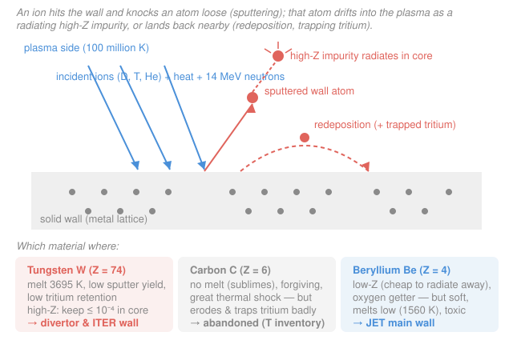

# Fusion & Plasma Engineering · Lesson 3.6: First-wall & plasma–wall interaction

> ⏱ ~15 min · Module 3: Heating, Transport & Plasma–Wall Interaction · Builds on: [3.5 The scrape-off layer & divertor](03-05-scrape-off-layer-divertor.md), [2.4 MHD instabilities](02-04-mhd-instabilities.md) · Unlocks: [Module 4 (tritium & reactor engineering)](04-01-tritium-breeding-fuel-cycle.md), [nuclear-materials](../../nuclear-materials/syllabus.md)

## Why this matters

Every other lesson worried about keeping the plasma *away* from the wall. This one asks the unavoidable question: what happens where they meet anyway? The scrape-off layer ([3.5](03-05-scrape-off-layer-divertor.md)) dumps its power onto a surface, the plasma edge is always leaking ions into it, and the 14 MeV D-T neutron sails straight through the field and slams into the structure regardless of how good your confinement is. That surface — the **first wall** and the **divertor target** — is where fusion stops being plasma physics and becomes a materials problem. Pick the wrong material and it erodes, poisons your plasma with radiating impurities, and hoards your scarce tritium. ITER spent two decades and a design change getting this choice right. This lesson is how you make it and defend it, and it closes Module 3 by turning "route the heat somewhere" into "route it onto *what*."

## The idea

The wall lives under three simultaneous assaults. **Particles:** edge ions (D, T, helium "ash") strike the surface. **Heat:** the SOL power flux, up to $\sim10\,\text{MW/m}^2$ steady on the divertor. **Neutrons:** 14 MeV, which pass through the surface and damage the bulk (that's [4.2](04-02-neutrons-blankets-activation.md)'s problem). The near-surface story is dominated by the particles, and the key process is **sputtering**: an incoming ion, if it arrives with enough energy, knocks a wall atom clean out of the lattice — like a cue ball scattering a rack. Sputtering does two bad things at once. It **erodes** the wall (a slow structural death), and it launches wall atoms *into the plasma* as **impurities**.

Why is a stray wall atom in the plasma such a disaster? Because it radiates. A hydrogen ion in a fusion plasma is fully stripped — bare proton, no electrons left to make light. A heavy atom like tungsten (74 electrons) is *never* fully stripped even at 100 million degrees; it keeps a few bound electrons that get excited and dump the plasma's energy out as photons. The radiated power scales steeply with atomic number $Z$, so a *tiny* trace of a **high-Z** metal can radiate away the power you spent millions of dollars heating in. A **low-Z** atom (carbon, beryllium) strips clean in the hot core and radiates far less — it's *forgiving*. That single fact — high-Z radiates, low-Z forgives — drives the whole material fight.

Then there's the atom that gets sputtered but doesn't reach the core: it flies a short hop and lands back down nearby (**redeposition**). Good news for erosion — most sputtered material comes home. Bad news for tritium: the redeposited layers are spongy **codeposits** that trap tritium atom-for-atom with the wall material. Since tritium is radioactive, scarce, and inventory-limited by your safety license, a wall that builds tritium-soaked layers is a wall that eats your fuel and your permit at once.

## The formal version

**Sputtering yield.** Define the yield $Y$ as atoms removed per incident ion:

$$Y \equiv \frac{\text{wall atoms sputtered}}{\text{incident ion}}, \qquad \text{gross erosion flux } \Gamma_{\text{out}} = Y\,\Gamma_{\text{in}}.$$

*In words: multiply how many ions hit each second by how many atoms each ion knocks out, and you get how fast the wall leaves.* $Y$ rises with ion energy above a **threshold** (below it, the ion just bounces) and *falls* as the wall atom gets heavier — a light deuteron struggles to eject a heavy tungsten atom, so tungsten has a low $Y$ (good). The **net** erosion is smaller than gross because a fraction $r$ redeposits: $\Gamma_{\text{net}} = (1-r)\,Y\,\Gamma_{\text{in}}$, and $r$ can exceed 0.9.

**Impurity radiation.** The power radiated per unit volume by an impurity of density $n_Z$ in a plasma of electron density $n_e$ is, to good approximation,

$$P_{\text{rad}} = n_e\,n_Z\,L_Z(T),$$

where $L_Z(T)$ is the **cooling rate** (units $\text{W}\,\text{m}^3$), a tabulated function that grows dramatically with $Z$. *In words: radiation losses are proportional to how many radiators there are ($n_Z$), how many electrons collide with them ($n_e$), and how good a radiator each one is at this temperature ($L_Z$).* For tungsten at reactor temperatures $L_W\sim10^{-31}\,\text{W}\,\text{m}^3$; for a low-Z ion that fully strips in the core it is orders of magnitude smaller. The tolerable impurity concentration $f_Z=n_Z/n_e$ is set by demanding $P_{\text{rad}}$ stay well below the alpha self-heating — Example 1 does this and lands on $f_W\lesssim10^{-4}$ for tungsten versus percent-level for beryllium.

**Transient loads.** The steady $\sim10\,\text{MW/m}^2$ is not the wall's worst day. Two transients dwarf it. **ELMs** (edge-localized modes) — bursts from the H-mode pedestal ([3.4](03-04-transport-confinement-scaling.md)) — periodically eject a few percent of the stored energy onto the divertor in under a millisecond. **Disruptions** ([2.4](02-04-mhd-instabilities.md)) dump the *entire* thermal energy in $\sim1\,\text{ms}$, hundreds of $\text{MJ/m}^2\cdot\text{s}^{-1}$ of flux — enough to melt and crack even tungsten. The wall must survive not the average but the pulse.

## Picture

Top: the surface event — blue incident flux (ions + heat + neutrons), a coral sputtered atom that either climbs into the core to radiate or arcs back down as tritium-trapping redeposition. Bottom: the three candidate materials with the property that decides each one's fate.

## Worked examples

**Example 1 (why high-Z is only tolerable in trace amounts — a tolerable-concentration estimate).** Take a burning D-T plasma at $n_e=10^{20}\,\text{m}^{-3}$, $T=15\,\text{keV}$, 50–50 fuel. First, how much power is alpha self-heating providing per cubic metre? From [1.3](01-03-reactivity-power-density.md) with $n_D=n_T=5\times10^{19}\,\text{m}^{-3}$, $\langle\sigma v\rangle=2.6\times10^{-22}\,\text{m}^3/\text{s}$, $E_{\text{fus}}=17.6\,\text{MeV}=2.82\times10^{-12}\,\text{J}$:

$$P_{\text{fus}}=n_D n_T\langle\sigma v\rangle E_{\text{fus}}=(5\times10^{19})^2(2.6\times10^{-22})(2.82\times10^{-12})\approx1.8\,\text{MW/m}^3.$$

The alphas carry $3.5/17.6\approx20\%$ of that back into the plasma as heat:

$$P_\alpha\approx0.20\times1.8\,\text{MW/m}^3\approx0.36\,\text{MW/m}^3.$$

Now demand that tungsten radiation not exceed this heating (if it did, the impurity alone would cool the plasma faster than fusion warms it — a radiative collapse). Set $P_{\text{rad}}=n_e n_W L_W=P_\alpha$ with $L_W\approx10^{-31}\,\text{W}\,\text{m}^3$:

$$n_W=\frac{P_\alpha}{n_e L_W}=\frac{3.6\times10^{5}}{(10^{20})(10^{-31})}=3.6\times10^{16}\,\text{m}^{-3}, \qquad f_W=\frac{n_W}{n_e}=\frac{3.6\times10^{16}}{10^{20}}\approx3.6\times10^{-4}.$$

So a tungsten fraction of just a few parts in ten thousand radiates away as much power as the entire alpha heating. Since you want radiation *well below* heating — not merely equal — the real core budget is $f_W\lesssim10^{-4}$, and machines quote $\sim10^{-5}$. Contrast beryllium (Z = 4): it fully strips in the core, its $L_Z$ is smaller by orders of magnitude, and it survives at $f_{\text{Be}}\sim10^{-2}$ — a **hundred times more forgiving**. That factor is the whole reason low-Z was ever attractive, and why a little tungsten in the core is a five-alarm fire while a little beryllium is a shrug.

**Example 2 (the material tradeoff — what goes on the divertor, what goes on the main wall).** You must place a material at two locations: the **divertor strike point** (highest heat flux, $\sim10\,\text{MW/m}^2$, most erosion) and the **main first wall** (larger area, gentler flux, but sputtered atoms sit closest to the confined plasma). Score the three candidates:

| Property | Tungsten (Z = 74) | Carbon (Z = 6) | Beryllium (Z = 4) |
|---|---|---|---|
| Melting point | 3695 K (highest of any metal) | sublimes ~3900 K (no melt) | 1560 K (low) |
| Sputter yield | low (heavy lattice) | high + *chemical* erosion | moderate |
| Tritium retention | low | very high (codeposits) | moderate |
| Core radiation if it leaks | severe (high-Z) | mild (low-Z) | mild (low-Z) |

**Divertor → tungsten.** The strike point demands the highest melting point and the lowest erosion, and tungsten wins both decisively. Its high-Z radiation penalty is *acceptable here* because the divertor is far from the confined core — and in fact a little radiation in the divertor is *welcome*, it's exactly the $f_{\text{rad}}$ you engineered in [3.5](03-05-scrape-off-layer-divertor.md) to spread the heat. Beryllium is disqualified outright: at 1560 K it would melt under steady divertor flux.

**Main wall → beryllium (in JET/ITER's original design).** Low-Z means a sputtered beryllium atom that *does* reach the core barely radiates, and beryllium is an **oxygen getter** — it chemically binds stray oxygen that would otherwise itself contaminate the plasma. Its low melting point is tolerable because the main-wall flux is far below the divertor's.

**Carbon → abandoned.** Carbon was beloved (no melting, superb thermal-shock resistance for ELMs and disruptions, low-Z and forgiving) and flew in many machines. But it is chemically eroded by hydrogen even at low energy, and the eroded carbon **codeposits into tritium-soaked hydrocarbon films**. In a D-T machine that trapped tritium inventory is a licensing showstopper — JET measured it, ITER studied it, and both walked away from carbon. The lesson: the winning material is not the one that survives the heat best, it's the one that survives the heat *without* poisoning the plasma or swallowing the fuel.

*The verdict ITER reached:* tungsten divertor, and (after starting with beryllium) a full-tungsten wall for the D-T phase — because tritium retention beat every other consideration.

## Watch out

- **You might think erosion is the main danger of sputtering.** Net erosion is often small — most sputtered atoms redeposit right next to where they left ($r>0.9$). The two sharper dangers are (i) the fraction that reaches the *core* and radiates, and (ii) the tritium those redeposited layers trap. A wall can look barely eroded and still be poisoning your plasma and hoarding your fuel.
- **You might think high-Z is simply bad.** High-Z is bad *in the core* and good *everywhere else*: tungsten's high-Z radiation is a liability near the confined plasma but a feature in the divertor, where you *want* to radiate the exhaust away before it lands. Location decides whether a property is a bug or a feature.
- **You might size the wall for the steady heat flux.** The transients set the design. A $10\,\text{MW/m}^2$ steady load is survivable; an ELM or a disruption delivering a comparable *energy* in under a millisecond is a flux hundreds of times higher ([2.4](02-04-mhd-instabilities.md)) — that's what melts and cracks tungsten, and why ELM control and disruption mitigation are wall-survival systems, not just confinement niceties.

## One-liner

> The first wall must eat the plasma's particles, heat, and neutrons without eroding away, poisoning the core with high-Z radiation, or hoarding tritium — which is why the exhaust-blasted divertor is tungsten and carbon, for all its virtues, was abandoned.

## Problems

**P1 (🟢)** A plasma at $n_e=10^{20}\,\text{m}^{-3}$ has alpha self-heating of $P_\alpha=0.40\,\text{MW/m}^3$. A high-Z impurity has cooling rate $L_Z=2\times10^{-31}\,\text{W}\,\text{m}^3$. Find the impurity concentration $f_Z=n_Z/n_e$ at which its radiation equals half the alpha heating. Comment on whether this is a comfortable operating margin.

**P2 (🟡)** Estimate the gross erosion rate of a tungsten divertor tile. The ion flux is $\Gamma_{\text{in}}=1\times10^{22}\,\text{m}^{-2}\text{s}^{-1}$ and the sputter yield is $Y=5\times10^{-3}$. Tungsten's atomic number density is $n_W=6.3\times10^{28}\,\text{m}^{-3}$. (a) Find the gross erosion velocity (surface recession, m/s) and convert to mm per full-power year ($3.15\times10^{7}\,\text{s}$). (b) If 95% of sputtered atoms redeposit, what is the *net* erosion in mm/year — and what does the trapped-tritium implication of that redeposit connect to downstream?

**P3 (🔴)** Two materials, tungsten ($f_{\text{tol}}\approx10^{-4}$) and beryllium ($f_{\text{tol}}\approx10^{-2}$), are eroded into the core at the *same* atom flux, so both reach the same core impurity density $n_Z=10^{16}\,\text{m}^{-3}$ in a plasma with $n_e=10^{20}\,\text{m}^{-3}$. For each, compute $f_Z$ and state whether it exceeds the tolerable limit. What single sentence does this justify about where each material belongs?

Solutions

**P1** Set $P_{\text{rad}}=n_e n_Z L_Z=\tfrac12 P_\alpha$:

$$n_Z=\frac{0.5\,P_\alpha}{n_e L_Z}=\frac{0.5\,(4.0\times10^{5}\,\text{W/m}^3)}{(10^{20})(2\times10^{-31})}=\frac{2.0\times10^{5}}{2\times10^{-11}}=1.0\times10^{16}\,\text{m}^{-3}.$$

$$f_Z=\frac{n_Z}{n_e}=\frac{1.0\times10^{16}}{10^{20}}=1.0\times10^{-4}.$$

So one part in ten thousand of this high-Z impurity already radiates away *half* the alpha heating — nowhere near comfortable. You would want to stay an order of magnitude below this, $f_Z\sim10^{-5}$, which is exactly why high-Z wall material must be kept out of the core almost perfectly.

*Check.* Units: $\text{(W/m}^3)/(\text{m}^{-3}\cdot\text{W}\,\text{m}^3)=\text{m}^{-3}$ ✓. Larger $L_Z$ (here $2\times$ Example 1's) gives a smaller tolerable $n_Z$ — a better radiator is tolerable in smaller amounts, consistent. ✓

**P2** (a) Gross sputtered flux leaving the surface:

$$\Gamma_{\text{out}}=Y\,\Gamma_{\text{in}}=(5\times10^{-3})(1\times10^{22})=5\times10^{19}\,\text{m}^{-2}\text{s}^{-1}.$$

Recession velocity = atoms leaving per area per second, divided by atoms per volume:

$$v=\frac{\Gamma_{\text{out}}}{n_W}=\frac{5\times10^{19}}{6.3\times10^{28}}\approx7.9\times10^{-10}\,\text{m/s}.$$

Per full-power year:

$$\Delta x = v\,t=(7.9\times10^{-10})(3.15\times10^{7})\approx2.5\times10^{-2}\,\text{m}=25\,\text{mm/year}.$$

(b) Net erosion with 95% redeposition is $(1-0.95)\times25\approx1.2\,\text{mm/year}$. So gross sputtering *alone* would strip 25 mm — destroying a tile in a year — but redeposition brings the net down to a survivable ~1 mm. The catch: that redeposited material forms codeposited layers that trap tritium, which is a fuel-inventory and safety problem — the bridge to tritium accounting in [4.1 Tritium breeding & the fuel cycle](04-01-tritium-breeding-fuel-cycle.md) and the broader nuclear-fuel-cycle course.

*Check.* Units: $(\text{m}^{-2}\text{s}^{-1})/(\text{m}^{-3})=\text{m/s}$ ✓. The huge gap between 25 mm gross and 1.2 mm net is the entire reason redeposition matters — recompute confirms the factor of 20 is just $1/(1-r)$. ✓

**P3** For both materials at $n_Z=10^{16}\,\text{m}^{-3}$, $n_e=10^{20}\,\text{m}^{-3}$:

$$f_Z=\frac{n_Z}{n_e}=\frac{10^{16}}{10^{20}}=10^{-4}.$$

- **Tungsten:** $f_Z=10^{-4}$ equals its tolerable limit $f_{\text{tol}}\approx10^{-4}$ — right at the edge of a radiative collapse. Unacceptable this close to the core.
- **Beryllium:** $f_Z=10^{-4}$ is **100× below** its tolerable $10^{-2}$ — completely harmless.

*The sentence it justifies:* the **same** amount of leaked material is fatal for high-Z tungsten but negligible for low-Z beryllium, so tungsten must be banished to where it can't reach the core (the divertor), while low-Z material can face the confined plasma directly (the main wall).

*Check.* Both share the identical $n_Z$, so the verdict turns entirely on $f_{\text{tol}}$, which is set by $Z$ (via $L_Z$) — exactly the high-Z-vs-low-Z distinction from Example 1. ✓

## Flashback

**From Lesson 3.5 (divertor heat flux & radiated fraction):** 60 MW of power crosses the separatrix into the scrape-off layer and lands on two divertor targets, each with wetted area $2\pi R\,w$ where $R=6\,\text{m}$ and $w=0.05\,\text{m}$. (a) Compute the average target heat flux and compare it to the $\sim10\,\text{MW/m}^2$ engineering limit. (b) What radiated fraction $f_{\text{rad}}$ brings the target flux under that limit, and what operating regime achieves it?

Solution

(a) Total wetted area over both targets:

$$A=2\times(2\pi R\,w)=4\pi R\,w=4\pi(6)(0.05)\approx3.77\,\text{m}^2.$$

Average heat flux:

$$q_\perp=\frac{P_{\text{SOL}}}{A}=\frac{60\times10^{6}\,\text{W}}{3.77\,\text{m}^2}\approx1.59\times10^{7}\,\text{W/m}^2\approx16\,\text{MW/m}^2.$$

That is above the $\sim10\,\text{MW/m}^2$ limit — the bare target would overheat.

(b) A radiated fraction $f_{\text{rad}}$ removes power before it reaches the target, leaving $(1-f_{\text{rad}})q_\perp\le10\,\text{MW/m}^2$:

$$1-f_{\text{rad}}\le\frac{10}{15.9}=0.629 \quad\Rightarrow\quad f_{\text{rad}}\ge0.37.$$

Radiating $\gtrsim37\%$ of the exhaust in the SOL/divertor — approaching a **radiative (partially detached) divertor** — pulls the target flux under the limit. This is exactly the regime that lets a *tungsten* target survive, tying [3.5](03-05-scrape-off-layer-divertor.md) to this lesson's material choice.

*Check.* Units: $\text{W}/\text{m}^2$ ✓. $f_{\text{rad}}=0.37$ gives $(1-0.37)(15.9)=10.0\,\text{MW/m}^2$, exactly at the limit ✓.

## Connections

- **Backward:** this lesson consumes the exhaust power routed by [3.5 The scrape-off layer & divertor](03-05-scrape-off-layer-divertor.md) and the transient loads quantified in [2.4 MHD instabilities](02-04-mhd-instabilities.md) — the disruption flux you computed there is what sets the wall's survival requirement, not the steady heat.
- **Forward:** [4.1 Tritium breeding & the fuel cycle](04-01-tritium-breeding-fuel-cycle.md) inherits the tritium-retention problem raised here (codeposits are a debit in the fuel inventory), and [4.2 Neutrons, blankets & activation](04-02-neutrons-blankets-activation.md) takes over the *other* wall assault — the 14 MeV neutron that this lesson let pass straight through the surface.
- **Sideways (materials science):** sputter yields, radiation-damage swelling, and tritium diffusion in metals are the core of the [nuclear-materials](../../nuclear-materials/syllabus.md) course; the high-Z-radiation argument also bridges to atomic physics (why a partially-stripped ion radiates and a bare one cannot), the same line-radiation physics used in [radiation-detection-shielding](../../radiation-detection-shielding/syllabus.md).
