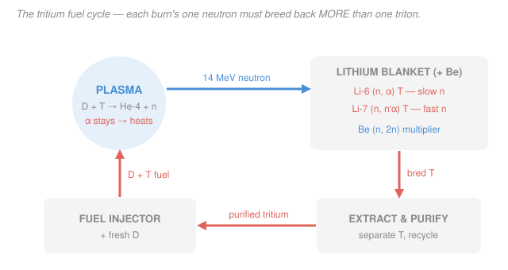

# Fusion & Plasma Engineering · Lesson 4.1: Tritium breeding & the fuel cycle

> ⏱ ~15 min · Module 4: Tritium, Inertial Fusion & Reactor Engineering · Builds on: [1.1 Why fusion, why D-T](01-01-why-fusion-why-dt.md), [`intro-nuclear-engineering` syllabus](../../intro-nuclear-engineering/syllabus.md) (neutron reactions, cross-sections) · Unlocks: [4.2 Neutrons, blankets & activation](04-02-neutrons-blankets-activation.md)

## Why this matters

Back in [1.1](01-01-why-fusion-why-dt.md) we picked D-T because it ignites at the lowest temperature — and then waved at "the tritium headache." Here is the headache in full: **tritium barely exists.** It is radioactive with a 12.3-year half-life, so there is essentially none in nature, and the entire world civilian stockpile — a byproduct of Canadian CANDU reactors — is roughly 20 kg, shrinking every year. A single GW-scale D-T plant would burn through that in months. There is no tritium mine and no tritium supplier at reactor scale. So a fusion power plant cannot be *fuelled* with tritium; it must **manufacture its own**, faster than it burns it, inside a lithium blanket wrapped around the plasma. Whether that closed loop actually closes — the tritium breeding ratio — is one of the hard yes/no gates between a burning plasma and a power plant. Get it below one and the reactor starves.

## The idea

Every D-T reaction throws off exactly **one neutron** ([1.1](01-01-why-fusion-why-dt.md)): $\ce{D + T -> ^{4}He + n}$. That neutron is neutral, so the magnetic field can't hold it — it flies straight out of the plasma carrying 14.1 MeV. Instead of letting it just deposit heat in the wall, we put a **lithium blanket** in its path and let it do a second job: hit a lithium nucleus and transmute it into a fresh tritium atom. Lithium is the magic ingredient because it *breeds tritium when a neutron strikes it*:

- **Slow neutrons** love ${}^{6}\text{Li}$: $\ce{^{6}Li + n -> ^{4}He + ^{3}H}$ — a clean, energy-*releasing* reaction that makes one triton.
- **Fast neutrons** (like our 14 MeV one) can split ${}^{7}\text{Li}$: $\ce{^{7}Li + n -> ^{4}He + ^{3}H + n'}$ — this also makes a triton, and crucially it **spits the neutron back out** (slowed down), which can then go breed *again* on a ${}^{6}\text{Li}$.

So the plan writes itself: burn a triton in the plasma, catch the neutron in the blanket, breed a new triton, pipe it out, purify it, mix it with fresh deuterium, and inject it back. A closed fuel loop (the picture below).

Here's the catch that makes this a *problem* and not just a *procedure.* You start with **one** neutron per triton burned, and you need to end with **more than one** new triton — because neutrons leak out the edges, get swallowed by the steel structure, and because you also have to grow a stockpile to start up the *next* reactor and to cover the tritium that radioactively decays while it sits in your pipes. One neutron can only make one triton. The arithmetic is impossible... unless you **multiply the neutrons** first, with a material that turns one neutron into two ($\ce{^{9}Be(n,2n)}$, or lead). That multiplier is what buys back the losses and lets the loop close with margin to spare.

## The formal version

**Tritium scarcity.** Tritium decays by beta emission,

$$\ce{^{3}H -> ^{3}He + e^- + \bar{\nu}_e}, \qquad t_{1/2} = 12.3\ \text{yr} \;\Rightarrow\; \text{decay rate} \approx 5.5\%\ \text{per year.}$$

*In words: tritium is not a fuel you store indefinitely — it evaporates, and there is no natural reservoir to top it up from.*

**The two breeding reactions.** With natural lithium (7.5% ${}^{6}\text{Li}$, 92.5% ${}^{7}\text{Li}$):

$$\ce{^{6}Li(n,\alpha)^{3}H}, \qquad Q = +4.78\ \text{MeV} \quad (\text{exothermic; cross-section large for SLOW neutrons}),$$

$$\ce{^{7}Li(n,n'\alpha)^{3}H}, \qquad Q = -2.47\ \text{MeV} \quad (\text{THRESHOLD reaction; needs a FAST neutron}).$$

*In words: ${}^{6}\text{Li}$ absorbs a slow neutron and hands back heat plus a triton; ${}^{7}\text{Li}$ needs a fast neutron to fire but rewards you by returning the neutron for a second breeding chance.* The ${}^{7}\text{Li}$ reaction is a mild neutron *multiplier* on its own (one neutron in, one triton and one neutron out), which is why blanket designers care about the fast-neutron flux and don't just moderate everything to slow speeds.

**The tritium breeding ratio (TBR).** Define

$$\text{TBR} = \frac{\text{tritons bred in the blanket}}{\text{tritons burned in the plasma}}.$$

*In words: how many new tritium atoms you make for every one you consume.* **Self-sufficiency requires $\text{TBR} > 1$** — strictly greater, not equal. Since each D-T reaction supplies exactly one neutron and each new triton needs at least one neutron, the *ideal* ceiling is $\text{TBR} = 1$, and real losses (leakage, parasitic absorption, decay, startup inventory) push you below it. You recover the deficit with a **neutron multiplier**:

$$\ce{^{9}Be + n -> 2\,^{4}He + 2n}, \qquad \ce{^{208}Pb(n,2n)}\ (\text{threshold} \approx 7\ \text{MeV}),$$

each of which converts one incoming neutron into two, so the blanket can breed on more neutrons than the plasma alone provides. Design targets sit around $\text{TBR} \approx 1.05$–$1.15$ to leave headroom.

**Closing the loop.** The tritium fuel cycle is a mass balance on a radioactive, mobile gas: breed in the blanket → extract from the breeder material → purify (strip out helium, protium, impurities) → store briefly → re-inject with fresh deuterium → burn. Only a small fraction (the **burnup fraction**, a few percent) of injected tritium actually fuses on each pass; the rest is pumped out and recycled, so the *in-process inventory* is far larger than the *burn rate* — and every kilogram sitting in the plant is both a decay loss and a safety liability.

## Picture

Follow the loop clockwise. The **blue** neutron is the only thing that crosses from plasma to blanket — it carries the 14.1 MeV *and* the entire breeding budget on its back. Inside the **grey** blanket it either breeds directly (${}^{6}\text{Li}$), breeds-and-returns (${}^{7}\text{Li}$), or gets multiplied first (Be). The **coral** tritium is then extracted, purified, and fed back to the injector with fresh deuterium. The alpha, note, never leaves the plasma — it stays trapped and heats it. The whole diagram is a single accounting statement: *tritium out of the blanket must exceed tritium into the plasma, or the loop runs dry.*

## Worked examples

**Example 1 (why TBR must exceed 1 — and how a multiplier gets you there).** Argue from the neutron budget why $\text{TBR}=1$ is not good enough, then show numerically how beryllium rescues the balance.

*The naive count.* Each fusion reaction burns one triton and makes one neutron. If every neutron were captured by a ${}^{6}\text{Li}$ with zero waste, you'd breed exactly one triton — $\text{TBR}=1$, break-even, the loop just barely closes. But three leaks make "every neutron" a fantasy:

1. **Geometric leakage & ports.** The blanket can't be a perfect sphere — you need holes for heating beams, diagnostics, and the divertor. Neutrons escape those gaps and never breed. Call this a loss.
2. **Parasitic absorption.** The structural steel, coolant, and the tritium-extraction plumbing all eat neutrons via $(n,\gamma)$ captures that make no tritium.
3. **Decay + startup inventory.** Tritium decays at 5.5%/yr while it sits in the loop, and you must breed a *surplus* to accumulate the ~kg of startup inventory for the next plant. Both demand $\text{TBR}>1$, not $=1$.

With one neutron per triton and any of these losses, unmultiplied breeding gives $\text{TBR}<1$ — the reactor starves. **You need more neutrons than the plasma provides**, which only a multiplier can do.

*The rescued count.* Put a beryllium layer up front. Model it as a single effective neutron-multiplication factor $M_n$ (neutrons available per source neutron) and a single effective capture efficiency $\varepsilon$ (fraction of available neutrons that end up breeding a triton in lithium):

$$\text{TBR} = M_n \times \varepsilon.$$

Take a well-designed blanket with $M_n = 1.85$ (beryllium plus the ${}^{7}\text{Li}$ contribution) and $\varepsilon = 0.72$ (28% lost to leakage and parasitic capture):

$$\text{TBR} = 1.85 \times 0.72 \approx 1.33.$$

Comfortably above the $\approx 1.1$ target — that 0.33 of headroom is exactly what covers decay and builds the startup stockpile. Kill the multiplier ($M_n \to 1$) and the same blanket gives $\text{TBR} = 0.72 < 1$: dead. **The multiplier is not an optimization; it is the difference between a reactor that fuels itself and one that doesn't.** *Check:* the logic is monotone — more multiplication or less leakage raises TBR, and both knobs are things blanket engineers actually design ([4.2](04-02-neutrons-blankets-activation.md)). ✓

**Example 2 (the burn rate — why breeding is non-negotiable).** A DEMO-class plant runs at $P_{\text{fus}} = 3\ \text{GW}$ of fusion power on D-T. Each reaction consumes one triton, releases $E_{\text{fus}} = 17.6\ \text{MeV}$, and the tritium atom has mass $m_T = 5.01\times10^{-27}\ \text{kg}$. Find the tritium consumption in kg/day.

*Step 1 — energy per reaction in joules.* Using $1\ \text{MeV} = 1.602\times10^{-13}\ \text{J}$,

$$E_{\text{fus}} = 17.6\ \text{MeV} \times 1.602\times10^{-13}\ \tfrac{\text{J}}{\text{MeV}} = 2.82\times10^{-12}\ \text{J}.$$

*Step 2 — reactions per second.* The plant makes $P_{\text{fus}}$ watts (joules per second), so

$$R = \frac{P_{\text{fus}}}{E_{\text{fus}}} = \frac{3\times10^{9}\ \text{W}}{2.82\times10^{-12}\ \text{J}} = 1.06\times10^{21}\ \text{reactions/s}.$$

*Step 3 — mass of tritium burned per second.* One triton per reaction:

$$\dot m_T = R\, m_T = 1.06\times10^{21}\ \text{s}^{-1} \times 5.01\times10^{-27}\ \text{kg} = 5.33\times10^{-6}\ \text{kg/s}.$$

*Step 4 — per day.* Multiply by $86{,}400\ \text{s/day}$:

$$\dot m_T = 5.33\times10^{-6}\ \tfrac{\text{kg}}{\text{s}} \times 86{,}400\ \tfrac{\text{s}}{\text{day}} \approx 0.46\ \text{kg/day}.$$

Roughly **half a kilogram of tritium per day.** Set that against the entire world stockpile of $\sim 20$ kg: an unbred 3 GW plant would drain the planet's tritium in about **six weeks**, and CANDU reactors replenish it at only tens of grams per year. There is no external supply that keeps up — the reactor *must* breed at $\text{TBR}>1$ or it simply cannot run. *Check:* this matches the widely-quoted "a fusion plant burns a few hundred grams of tritium a day," and $\dot m_T \propto P_{\text{fus}}$ scales sensibly (1 GW $\to$ ~0.15 kg/day). ✓

## Watch out

- **You might think "make TBR = 1 and you're self-sufficient."** No — $\text{TBR}=1$ means you replace exactly what you burn *with zero margin*, but tritium decays (5.5%/yr) in your pipes and you must also breed the startup inventory for the next reactor. Real designs need $\text{TBR}>1$ (target ~1.05–1.15). Break-even breeding is a losing reactor.
- **You might think slow neutrons are always better for breeding.** ${}^{6}\text{Li}$ loves slow neutrons, so it's tempting to moderate everything. But if you slow *every* neutron you lose the ${}^{7}\text{Li}(n,n'\alpha)$ channel and, worse, the ${}^{9}\text{Be}(n,2n)$ multiplication — both of which are *fast*-neutron reactions. A good blanket keeps a fast region (multiplier) and a slow region (${}^{6}\text{Li}$ breeder). Speed is a design variable, not a nuisance.
- **You might think the tritium you must handle equals the ~0.5 kg/day you burn.** The *inventory* in the plant is far larger, because only a few percent of injected tritium fuses per pass — the rest is pumped, purified, and recycled. Kilograms are in circulation at any moment, which dominates both the decay loss and the safety/licensing picture, not the burn rate.

## One-liner

> A D-T reactor is the only power plant that must mine its own fuel from its own exhaust — catching each burn's single 14 MeV neutron in a lithium blanket and, with a neutron multiplier's help, breeding back *more* than the one triton it just consumed.

## Problems

**P1 (🟢)** A fusion plant runs at $P_{\text{fus}} = 1.5\ \text{GW}$. Using $E_{\text{fus}} = 17.6\ \text{MeV}$ ($=2.82\times10^{-12}\ \text{J}$) and $m_T = 5.01\times10^{-27}\ \text{kg}$, find the tritium burn rate in kg/day. Then estimate how many days it would take to consume the entire world stockpile of $\sim 20$ kg if none were bred.

**P2 (🟡)** A blanket design achieves an effective neutron multiplication $M_n = 1.6$ and a capture-into-lithium efficiency $\varepsilon = 0.68$. (a) Compute the TBR and state whether the reactor is self-sufficient. (b) The engineers must raise TBR to at least $1.10$ by improving *one* knob. If they leave $M_n$ fixed, what minimum $\varepsilon$ is required? If they instead leave $\varepsilon$ fixed, what minimum $M_n$? (c) One sentence: which is physically the harder ask, and why?

**P3 (🔴, optional — bridge to the fuel cycle)** Only a fraction $f_b$ (the burnup fraction) of injected tritium actually fuses per pass; the rest is recycled. A 3 GW plant burns $\dot m_T \approx 0.46\ \text{kg/day}$ (Example 2). If $f_b = 3\%$, what mass of tritium must be *injected* per day, and hence roughly cycled through the extraction/purification plant? Comment in one sentence on why this makes the in-plant tritium inventory — not the burn rate — the dominant safety and startup concern. (This is the quantity that connects to reactor licensing and the [`nuclear-fuel-cycle`](../../nuclear-fuel-cycle/syllabus.md) course's front-end/back-end inventory accounting.)

Solutions

**P1** Reactions per second: $R = P_{\text{fus}}/E_{\text{fus}} = (1.5\times10^{9})/(2.82\times10^{-12}) = 5.32\times10^{20}\ \text{s}^{-1}$. Mass rate: $\dot m_T = R\,m_T = 5.32\times10^{20}\times 5.01\times10^{-27} = 2.66\times10^{-6}\ \text{kg/s}$. Per day: $\times 86{,}400 = 0.23\ \text{kg/day}$. (Half the 3 GW answer, as expected since $\dot m_T \propto P_{\text{fus}}$.)

Time to drain 20 kg: $20 / 0.23 \approx 87\ \text{days}$ — under three months. *Check:* consistent with the "six weeks for 3 GW" figure in Example 2, scaled up by the factor-of-two lower power. ✓

**P2** (a) $\text{TBR} = M_n \varepsilon = 1.6 \times 0.68 = 1.088$. That is **just above 1**, so it technically breeds a surplus — but $1.088 < 1.10$, so it falls short of the design target that covers decay and startup inventory. Marginal, not safe.

(b) Need $M_n\,\varepsilon \ge 1.10$.
- Fixing $M_n = 1.6$: $\varepsilon \ge 1.10/1.6 = 0.6875 \approx 0.69$ (up from 0.68 — a tiny gain).
- Fixing $\varepsilon = 0.68$: $M_n \ge 1.10/0.68 = 1.618 \approx 1.62$ (up from 1.60).

(c) Both required improvements are small here because the starting point is already close to target; but in general **raising $\varepsilon$ (reducing leakage/parasitic loss) is the harder ask**, because leakage is set by unavoidable geometry — ports for heating, diagnostics, and the divertor — that you can't fully close, whereas $M_n$ can be raised by simply adding more beryllium or lead multiplier. *Check:* the product $M_n\varepsilon$ is symmetric in the two factors, so equal *fractional* bumps have equal effect; the asymmetry is in engineering feasibility, not arithmetic. ✓

**P3** Injected mass = burned mass / burnup fraction: $\dot m_{\text{inj}} = 0.46 / 0.03 \approx 15.3\ \text{kg/day}$. So roughly **15 kg of tritium per day** must pass through the injection, pumping, and extraction/purification loop — about 33× the amount actually consumed. The in-process inventory (kilograms resident in the plant at any instant) therefore dwarfs the daily *burn*, and since tritium decays and can permeate through hot metal, that circulating inventory — not the ~0.5 kg/day burned — dominates the tritium accountancy, safety case, and startup-stockpile requirement. *Check:* with a few-percent burnup, the recycle stream is tens of times the burn rate, matching the standard result that fusion plants circulate far more tritium than they consume. ✓

## Flashback

**From Lesson 1.1 (the D-T energy split):** A fusion plant produces $P_{\text{fus}} = 2.5\ \text{GW}$. Recall that the 17.6 MeV of each D-T reaction splits into a 14.1 MeV neutron and a 3.5 MeV alpha. How much power leaves as neutrons (and must be caught by the blanket, where it does the breeding of this lesson), and how much stays as alpha heating in the plasma?

Solution

The energy split fixes the power split, since every reaction partitions the *same* way. Neutron fraction $14.1/17.6 = 0.801$, alpha fraction $3.5/17.6 = 0.199$:

$$P_n = 2.5\ \text{GW} \times \frac{14.1}{17.6} = 2.00\ \text{GW}, \qquad P_\alpha = 2.5\ \text{GW} \times \frac{3.5}{17.6} = 0.50\ \text{GW}.$$

So **2.0 GW streams out as 14 MeV neutrons** into the blanket — that's the power that both drives the steam cycle *and* carries the entire tritium-breeding budget — while **0.5 GW of alphas** stays trapped and heats the plasma (the seed of ignition, [1.5](01-05-ignition-breakeven-gain.md)). *Check:* $P_n + P_\alpha = 2.5\ \text{GW}$ ✓, and the 80/20 split matches the lighter particle carrying the larger share ([1.1](01-01-why-fusion-why-dt.md)). ✓

## Connections

- **Backward:** this is the payoff of the neutron half of [1.1](01-01-why-fusion-why-dt.md)'s energy split — the 14.1 MeV neutron we set aside as "the blanket's problem" turns out to carry the reactor's entire fuel supply, and the burn rate is the same reaction-rate arithmetic as [1.3](01-03-reactivity-power-density.md)'s power density, now read as tritons consumed instead of joules produced.
- **Forward:** [4.2 (Neutrons, blankets & activation)](04-02-neutrons-blankets-activation.md) opens up the black box we treated as a single efficiency $\varepsilon$ — neutron wall loading, moderation, energy multiplication ($M=1.2$ in Boss problem 4), and the activation/shielding costs of stopping a 14 MeV flux — and the breeding margin here feeds directly into the [4.5](04-05-burning-plasma-to-power-plant.md) power-plant balance.
- **Sideways (nuclear fuel-cycle engineering):** the breed → extract → purify → recycle loop, with a large in-process inventory and only a few-percent burnup per pass, is a fusion analogue of the fissile-material accounting in the [`nuclear-fuel-cycle`](../../nuclear-fuel-cycle/syllabus.md) course; and the ${}^{6}\text{Li}(n,\alpha){}^{3}\text{H}$ cross-section behind it all is the same neutron-reaction physics you met in [`intro-nuclear-engineering`](../../intro-nuclear-engineering/syllabus.md).
