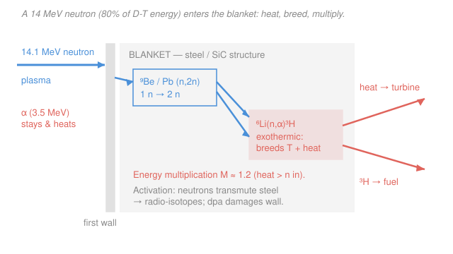

# Fusion & Plasma Engineering · Lesson 4.2: Neutrons, blankets & activation

> ⏱ ~15 min · Module 4: Tritium, Inertial Fusion & Reactor Engineering · Builds on: [4.1 Tritium breeding & the fuel cycle](04-01-tritium-breeding-fuel-cycle.md), [1.1 Why fusion, why D-T](01-01-why-fusion-why-dt.md) · Unlocks: [4.5 From burning plasma to power plant](04-05-burning-plasma-to-power-plant.md)

## Why this matters

Here is the quiet twist at the heart of a D-T reactor: the plasma you spent four modules learning to confine is **not where the power comes out**. Of the 17.6 MeV per reaction, the charged alpha keeps only 3.5 MeV inside the magnetic bottle — the other **14.1 MeV rides out on a neutron that the field cannot touch**, straight through the first wall and into a blanket. That blanket is the actual power station: it stops the neutron (heat), breeds the tritium that keeps the fuel cycle alive (from [4.1](04-01-tritium-breeding-fuel-cycle.md)), and even *amplifies* the energy on the way. It is also where fusion earns its one genuine radioactive-waste problem. Follow this one neutron and you've found where a fusion plant makes its electricity, its fuel, and its headaches — all at once.

## The idea

A 14 MeV neutron is a wrecking ball with no charge. Magnetic fields steer charged particles; a neutron ignores them and flies out of the plasma in a straight line until it hits *nuclei*. So the engineering job moves from "hold the plasma" to "catch the neutron," and you catch it in a thick shell wrapped around the plasma called the **blanket**. The blanket does three things to that neutron, and they happen together in the same volume:

1. **Heat.** The neutron scatters off nucleus after nucleus, dumping its 14 MeV as recoil energy — atoms jiggling — which is just heat. That heat boils a coolant and spins a turbine. *This is the reactor's power source.*
2. **Breed.** Some neutrons are absorbed by lithium-6, which splits into helium and a fresh triton: $\ce{^{6}Li + ^{1}_{0}n -> ^{4}_{2}He + ^{3}_{1}H}$. That's how the plant makes its own fuel (all of [4.1](04-01-tritium-breeding-fuel-cycle.md)).
3. **Multiply.** You have exactly *one* neutron per reaction but you need to breed *more* than one triton (to cover losses — the breeding ratio must exceed 1). So the blanket includes a **neutron multiplier** — beryllium or lead — that runs an $(n,2n)$ reaction: one fast neutron in, two slower neutrons out. Now you have neutrons to spare for breeding.

Two bonuses and one cost fall out of this. **Bonus one:** the $\ce{^{6}Li}$ breeding reaction is *exothermic* — it hands back extra energy on top of the neutron's 14 MeV — so the blanket delivers **more** thermal energy than the neutron carried in. That's **energy multiplication**. **Bonus two:** the alpha's 3.5 MeV, exhausted from the plasma as heat, gets collected too. **The cost:** those same neutrons smash into the *structural* atoms — the steel holding everything up — knocking atoms out of place (damage) and transmuting some into radioactive isotopes (**activation**). That's the fusion waste story.

## The formal version

**Neutron wall loading.** The intensity of the neutron bombardment is set by how much neutron power crosses each square metre of first wall:

$$\Gamma_n \equiv \frac{P_n}{A_{\text{wall}}} \qquad \left[\text{MW/m}^2\right],$$

where $P_n$ is the total neutron power (MW) leaving the plasma and $A_{\text{wall}}$ is the first-wall surface area (m²). *In words: wall loading is neutron power per unit wall area — the single number that sets how fast the wall accumulates damage.* For a torus of major radius $R$ and minor radius $a$, a serviceable estimate of the wall area is $A_{\text{wall}} \approx 4\pi^2 R a$ (the surface of the doughnut).

**The neutron energy fraction.** Momentum conservation splits the 17.6 MeV between the products in inverse proportion to their masses, so the light neutron takes the lion's share:

$$P_n = \frac{14.1}{17.6}\,P_{\text{fus}} \approx 0.80\,P_{\text{fus}}, \qquad P_\alpha = \frac{3.5}{17.6}\,P_{\text{fus}} \approx 0.20\,P_{\text{fus}}.$$

*In words: 80% of D-T fusion power leaves as neutron kinetic energy; only 20% stays with the alpha to heat the plasma.* (That 20% is exactly the alpha heating that drives ignition back in [1.5](01-05-ignition-breakeven-gain.md); here we follow the other 80%.)

**Energy multiplication.** Define the blanket's thermal output relative to the neutron power that enters it. Because $\ce{^{6}Li}$ breeding is exothermic and $(n,2n)$ reactions release energy, the blanket returns more heat than it received:

$$P_{\text{th}} = P_\alpha + M\,P_n, \qquad M \approx 1.1\text{–}1.3.$$

*In words: total thermal power is the recovered alpha heat plus the neutron power scaled up by an energy-multiplication factor $M$* — typically 1.1 to 1.3, so a blanket built around lithium and a multiplier turns 14 MeV of neutron into ~17 MeV of collectable heat. This $M$ is the hinge of the whole power-plant balance in [4.5](04-05-burning-plasma-to-power-plant.md).

**Activation and displacement damage.** A 14 MeV neutron does two kinds of harm to the structure:

- **Displacement damage**, measured in **displacements per atom (dpa)**: each energetic neutron knocks structural atoms off their lattice sites, creating defects that make the metal swell and embrittle. Fluence accumulates as $\text{dpa} \propto \Gamma_n \times t$. A useful rule of thumb for steel first walls is roughly $10\ \text{dpa}$ per $\text{MW}\!\cdot\!\text{yr/m}^2$ of 14 MeV neutron fluence.
- **Activation**: some neutrons are captured or $(n,p)/(n,\alpha)$ transmute structural nuclei into *radioactive* isotopes. *In words: the neutrons make the reactor's own steel radioactive.* The saving grace versus fission: no uranium or plutonium is present, so no long-lived actinides are produced — and **reduced-activation** alloys (RAFM steels like EUROFER, or SiC composites) are engineered from elements whose activation products decay in decades to a century, not the tens of thousands of years of fission waste.

## Picture

## Worked examples

**Example 1 (energy multiplication — the power a blanket actually delivers).** A reactor burns D-T at $P_{\text{fus}} = 2000\ \text{MW}$. Its blanket has energy multiplication $M = 1.2$. Find the total thermal power reaching the coolant.

Split the fusion power into its neutron and alpha shares:

$$P_n = \frac{14.1}{17.6}\times 2000 = 1602\ \text{MW}, \qquad P_\alpha = \frac{3.5}{17.6}\times 2000 = 398\ \text{MW}.$$

(Check: $1602 + 398 = 2000$ ✓.) The alpha power is exhausted from the plasma and collected as heat unchanged; the neutron power is amplified by the blanket:

$$P_{\text{th}} = P_\alpha + M\,P_n = 398 + 1.2\times 1602 = 398 + 1922 = 2320\ \text{MW}.$$

So a 2000 MW fusion source delivers **2320 MW of heat** — an overall thermal amplification of $P_{\text{th}}/P_{\text{fus}} = 1.16$. The blanket handed you 320 MW you didn't pay for at the plasma, courtesy of exothermic breeding. (Feed this into a thermal-to-electric efficiency and you have the gross electric power — the job of [4.5](04-05-burning-plasma-to-power-plant.md).)

**Example 2 (neutron wall loading — how hard the wall is being hit).** Take the same reactor: $P_n = 1602\ \text{MW}$ of neutrons, on a tokamak first wall with $R = 6\ \text{m}$, $a = 2\ \text{m}$. What is the wall loading, and what does it imply for wall lifetime?

Estimate the first-wall area as a torus surface:

$$A_{\text{wall}} \approx 4\pi^2 R a = 4\pi^2 (6)(2) \approx 474\ \text{m}^2.$$

Then the neutron wall loading is

$$\Gamma_n = \frac{P_n}{A_{\text{wall}}} = \frac{1602}{474} \approx 3.4\ \text{MW/m}^2.$$

That's a reactor-class load (ITER runs near $0.5$; DEMO-class designs aim for $\sim 1\text{–}3$). Now the damage: at $\sim 10\ \text{dpa}$ per $\text{MW}\!\cdot\!\text{yr/m}^2$,

$$\text{rate} \approx 3.4\ \tfrac{\text{MW}}{\text{m}^2}\times 10\ \tfrac{\text{dpa}}{\text{MW}\cdot\text{yr/m}^2} \approx 34\ \text{dpa per full-power-year}.$$

Structural steels are currently qualified to roughly $150\ \text{dpa}$ before embrittlement forces retirement, so this wall survives only about $150/34 \approx 4\ \text{full-power-years}$. *That is why the first wall and blanket are designed as replaceable modules* — and why raising the allowable dpa is one of the central materials problems for fusion.

## Watch out

- **You might think the plasma is where a fusion plant makes power. It isn't.** 80% of the energy leaves immediately on neutrons, and the electricity is generated in the *blanket*, not the plasma. The plasma's job is to make neutrons; the blanket's job is to make power and fuel.
- **You might think breeding ratio and energy multiplication are the same knob.** They're separate blanket outputs: **TBR** counts *tritons bred per fusion neutron* (must exceed 1, from [4.1](04-01-tritium-breeding-fuel-cycle.md)); **$M$** counts *thermal energy out per neutron energy in* (typically 1.1–1.3). A multiplier like beryllium helps *both* — more neutrons to breed with, and the reactions add heat — but the two numbers answer different questions.
- **You might think "fusion is radioactive too, so it's no cleaner than fission."** The activation is real, but it's a *different* problem: no actinides, no fission products, and reduced-activation materials are chosen so the activity decays in ~decades to a century rather than tens of thousands of years. It's a shielding-and-recycling problem, not a geological-repository problem.

## One-liner

> The 14 MeV neutron carries 80% of D-T's energy out of the plasma into a blanket that heats a coolant, breeds its own fuel, and multiplies the energy ($M\approx1.2$) — while slowly wrecking and activating the wall it passes through.

## Problems

**P1 (🟢)** A compact reactor burns D-T at $P_{\text{fus}} = 500\ \text{MW}$ with a blanket of energy multiplication $M = 1.25$. Using the 80/20 neutron/alpha split, find the neutron power, the alpha power, and the total thermal power delivered to the coolant.

**P2 (🟡)** A DEMO-class blanket receives $P_n = 1200\ \text{MW}$ of neutron power on a first wall of area $A_{\text{wall}} = 600\ \text{m}^2$. (a) Compute the neutron wall loading. (b) Using $\sim 10\ \text{dpa}$ per $\text{MW}\!\cdot\!\text{yr/m}^2$, estimate the accumulated dpa after 5 full-power-years and comment on whether the wall clears a $150\ \text{dpa}$ material limit.

**P3 (🔴, cross-subject → shielding/materials)** After shutdown, an activated first-wall component's dose is dominated by one radioisotope with half-life $t_{1/2} = 2.6\ \text{yr}$. How long until its activity falls to $10^{-3}$ of the shutdown value? Contrast this timescale with fission's $\ce{^{239}Pu}$ ($t_{1/2} = 2.4\times10^{4}\ \text{yr}$), and say in one sentence what this means for fusion "waste."

Solutions

**P1** Split the fusion power:

$$P_n = 0.80\times 500 = 400\ \text{MW}, \qquad P_\alpha = 0.20\times 500 = 100\ \text{MW}.$$

Amplify the neutron part and add the alpha heat:

$$P_{\text{th}} = P_\alpha + M\,P_n = 100 + 1.25\times 400 = 100 + 500 = 600\ \text{MW}.$$

So 500 MW of fusion yields **600 MW of thermal power** — overall amplification $600/500 = 1.20$. *Check:* the neutron share alone went from 400 to 500 MW (the exothermic breeding + $(n,2n)$ bonus), while the alpha's 100 MW passes through unamplified; total 600 MW ✓.

**P2** (a) Wall loading:

$$\Gamma_n = \frac{P_n}{A_{\text{wall}}} = \frac{1200}{600} = 2.0\ \text{MW/m}^2.$$

(b) Accumulated damage over 5 full-power-years:

$$\text{dpa} \approx 2.0\ \tfrac{\text{MW}}{\text{m}^2}\times 10\ \tfrac{\text{dpa}}{\text{MW}\cdot\text{yr/m}^2}\times 5\ \text{yr} = 100\ \text{dpa}.$$

That's under the $150\ \text{dpa}$ limit, so the wall survives the 5-year campaign — with margin for roughly $150/20 \approx 7.5$ full-power-years before retirement. *Check:* units cancel as $(\text{MW/m}^2)\times(\text{dpa}\cdot\text{m}^2/(\text{MW}\cdot\text{yr}))\times\text{yr} = \text{dpa}$ ✓; lower loading than Example 2 (2.0 vs 3.4 MW/m²) buys a proportionally longer life, as it must.

**P3** Activity decays as $A(t) = A_0\,(1/2)^{t/t_{1/2}}$. Set the ratio to $10^{-3}$:

$$\left(\tfrac12\right)^{t/t_{1/2}} = 10^{-3} \;\Longrightarrow\; \frac{t}{t_{1/2}} = \log_2(10^{3}) = \frac{3\ln 10}{\ln 2} \approx 9.97.$$

$$t = 9.97\times 2.6\ \text{yr} \approx 26\ \text{yr}.$$

So the dominant activity is gone (down by a factor of a thousand) in about **26 years** — within a working lifetime. The $\ce{^{239}Pu}$ comparison: $\log_2(10^3)\times 2.4\times10^4 \approx 2.4\times10^5\ \text{yr}$ for the same thousand-fold drop, ten thousand times longer. *In one sentence:* fusion activation is a hands-off-for-decades, then recycle-or-near-surface-dispose problem — categorically shorter than the geological-timescale storage that fission actinides demand, which is exactly why reduced-activation steels are worth engineering. (This decay bookkeeping is the daily bread of [radiation-detection-shielding](../../radiation-detection-shielding/syllabus.md).)

## Flashback

**From Lesson 4.1 (tritium burn rate & breeding):** A reactor burns D-T at $P_{\text{fus}} = 1\ \text{GW}$. Each reaction consumes one triton; take $E_{\text{fus}} = 17.6\ \text{MeV} = 2.82\times10^{-12}\ \text{J}$ and $m_T = 5.01\times10^{-27}\ \text{kg}$. (a) Find the tritium burn rate in kg/day. (b) If the blanket breeds with $\text{TBR} = 1.15$, what is the *net* tritium surplus per day, and why do you want a surplus?

Solution

(a) Reaction rate is power over energy per reaction:

$$\dot N = \frac{P_{\text{fus}}}{E_{\text{fus}}} = \frac{10^{9}\ \text{W}}{2.82\times10^{-12}\ \text{J}} = 3.55\times10^{20}\ \text{reactions/s}.$$

Each burns one triton, so the mass burn rate is

$$\dot m = \dot N\,m_T = 3.55\times10^{20}\times 5.01\times10^{-27} = 1.78\times10^{-6}\ \text{kg/s}.$$

Over a day ($86{,}400\ \text{s}$): $\dot m \approx 1.78\times10^{-6}\times 86{,}400 \approx 0.15\ \text{kg/day}$.

(b) The blanket breeds $\text{TBR} = 1.15$ tritons per triton burned, so it produces $1.15\times 0.15 \approx 0.177\ \text{kg/day}$ and the **net surplus** is

$$\Delta \dot m = (\text{TBR} - 1)\times \dot m = 0.15\times 0.15 \approx 0.023\ \text{kg/day} \approx 23\ \text{g/day}.$$

You want a surplus because a new plant must breed the startup inventory for *the next* reactor (and cover radioactive decay and processing losses) — merely matching consumption ($\text{TBR}=1$) leaves no margin and the fleet can never grow. *Check:* burn rate scales linearly with power, so this 1 GW figure is one-third of a 3 GW machine's ~0.46 kg/day — consistent with the module boss problem ✓.

## Connections

- **Backward:** the 80/20 energy split is the same physics as [1.1](01-01-why-fusion-why-dt.md)'s reaction products and [1.5](01-05-ignition-breakeven-gain.md)'s alpha heating — here we finally chase the neutron 80% instead of the alpha 20%. The breeding chemistry and TBR are straight out of [4.1](04-01-tritium-breeding-fuel-cycle.md).
- **Forward:** energy multiplication $M$ and the thermal power computed here are the direct inputs to [4.5 From burning plasma to power plant](04-05-burning-plasma-to-power-plant.md), where $P_{\text{th}}$ becomes gross electric power through the thermal efficiency and recirculating-power budget.
- **Sideways (nuclear engineering):** neutron slowing-down, activation, and dose decay are the core of [radiation-detection-shielding](../../radiation-detection-shielding/syllabus.md), while displacement damage, swelling, and reduced-activation alloy design belong to [nuclear-materials](../../nuclear-materials/syllabus.md) — a fusion blanket is where plasma physics hands the problem to a neutronics-and-materials engineer, the same handoff you saw entering from [intro-nuclear-engineering](../../intro-nuclear-engineering/syllabus.md).
