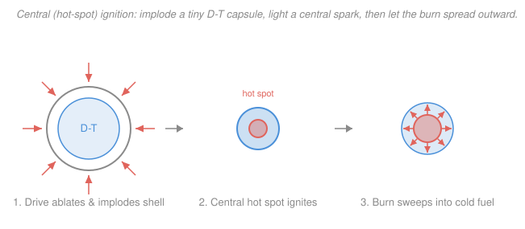
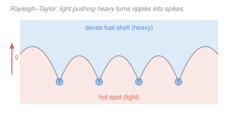

# Fusion & Plasma Engineering · Lesson 4.3: Inertial confinement I — implosion

> ⏱ ~15 min · Module 4: Tritium, Inertial Fusion & Reactor Engineering · Builds on: [1.4 Lawson criterion & triple product](01-04-lawson-criterion-triple-product.md), [1.5 Ignition, breakeven & gain](01-05-ignition-breakeven-gain.md) · Unlocks: [4.4 Inertial confinement II — drivers & NIF](04-04-inertial-confinement-drivers-nif.md)

## Why this matters

Everything so far — tokamaks, stellarators, the whole confinement zoo — chases the same triple product $nT\tau_E$ by making $\tau_E$ *big*: hold a wispy plasma for seconds behind a magnetic wall. Inertial confinement fusion (ICF) attacks the identical inequality from the opposite corner. It gives up on holding the plasma at all. Instead it crushes a millimetre pellet of frozen D-T to densities beyond the centre of the sun, so hot and dense that it burns in the ~100 picoseconds it takes to blow itself apart — confined by nothing but its own inertia. In August 2021, and decisively in December 2022, the National Ignition Facility (NIF) got more fusion energy out of such a capsule than the laser put in. This lesson is how that trick works, and why one instability nearly kills it every time.

## The idea

Here is the same leaky-bucket picture from [1.4](01-04-lawson-criterion-triple-product.md), but run at the other extreme. The Lawson target $nT\tau \gtrsim 3\times 10^{21}\ \text{keV}\cdot\text{s}\cdot\text{m}^{-3}$ is a *product*. A tokamak buys it with a tiny $n$ (about $10^{20}\ \text{m}^{-3}$, ten-thousand times thinner than air) and a huge $\tau_E$ (a second or two). ICF flips both dials to their stops: an enormous $n$ and a laughably short $\tau$.

How short? Nothing is holding the fuel. The instant you stop pushing, the hot ball flies apart at its own sound speed. The "confinement time" is just how long it takes a rarefaction to cross the ball — roughly its radius divided by the sound speed. For a compressed capsule that is a fraction of a nanosecond. So to clear the same triple-product bar, the density has to be *staggering* — hundreds of grams per cubic centimetre, denser than lead, a thousand times solid D-T.

You reach that density the way you'd crush a grape: squeeze from every side at once. A driver (lasers, in the next lesson) blasts the outer surface of the capsule. That surface boils off — **ablates** — and by rocket recoil the rest of the shell is driven violently inward. The shell converges, compressing the fuel and, at the very centre, forming a small blob that is both dense and hot: the **hot spot**. If that hot spot is hot enough *and* big enough that its own fusion alphas stay trapped inside it, it ignites — and a burn front tears outward through the surrounding cold dense fuel like a spark through gunpowder. That is **central (hot-spot) ignition**.

## The formal version

**Inertial confinement time.** With no magnetic bottle, a compressed sphere of radius $R$ (metres) disassembles on the timescale a pressure wave needs to cross it:

$$\tau \;\sim\; \frac{R}{c_s}, \qquad c_s = \sqrt{\frac{T}{m_i}},$$

where $c_s$ is the ion sound speed (m/s), $T$ the temperature in energy units (joules), and $m_i$ the mean ion mass (kg). *In words: the fuel stays together only as long as it takes sound to run across it — a few tens of picoseconds — and that IS the confinement time.* (Careful models put a factor of $\sim 4$ in the denominator; for envelope work $R/c_s$ is enough.)

**The Lawson product, ICF-style.** The exact same target must be met:

$$nT\tau \;\gtrsim\; 3\times 10^{21}\ \text{keV}\cdot\text{s}\cdot\text{m}^{-3}.$$

*In words: identical bar to the tokamak — but with $\tau$ ten orders of magnitude smaller, $n$ must be ten-plus orders larger to compensate.* The physics of "making beats leaking" hasn't changed; only which knob does the work.

**Areal density — the ICF figure of merit.** The number every implosion is graded on is not $n$ or $\tau$ separately but their geometric fingerprint, the **areal density**

$$\rho R \quad (\text{g/cm}^2),$$

the product of mass density $\rho$ and radius $R$. *In words: how many grams of fuel a particle must plough through on its way out.* Two things ride on it. First, it sets the confinement time: since $n \propto \rho$ and $\tau \propto R/c_s$, the product $n\tau \propto \rho R / c_s$ — so $\rho R$ *is* the confinement quality. Second, and this is the crux, it decides whether the fusion alphas deposit their energy before escaping.

**The hot-spot ignition condition.** A 3.5 MeV alpha born in the hot spot travels a characteristic distance before it stops — a range that, expressed as an areal density, is about

$$\rho R_\alpha \;\approx\; 0.3\ \text{g/cm}^2$$

in a ~10 keV D-T plasma. For the hot spot to heat *itself* (the whole point of ignition), the alpha must stop *inside* it. That demands

$$\boxed{\;\rho R \;\gtrsim\; 0.3\ \text{g/cm}^2\;}\quad(\text{hot spot}).$$

*In words: the hot spot must be at least one alpha-range thick, or the alphas leak out and the spark never catches.* This is the ICF analogue of the tokamak Lawson threshold — and note the payoff of compression: at fixed fuel mass $M = \tfrac{4}{3}\pi R^3 \rho$, one has $R \propto (M/\rho)^{1/3}$, so $\rho R \propto \rho^{2/3}$. Squeezing the fuel raises $\rho R$; a 1000-fold compression buys a 100-fold increase in areal density. That is *why* you implode. (Full burn propagation into the cold fuel wants a total $\rho R \sim 1\text{–}3\ \text{g/cm}^2$ — even more.)

**The instability that ruins it.** Compression only works if the shell stays a smooth, symmetric sphere. It doesn't want to. Whenever a light fluid pushes on a heavy one — as the light ablated plasma drives the dense shell inward — the interface is **Rayleigh–Taylor (RT) unstable**: a small ripple of wavelength $\lambda$ grows exponentially,

$$\gamma \;=\; \sqrt{A\,g\,k}, \qquad k = \frac{2\pi}{\lambda}, \qquad A = \frac{\rho_h - \rho_l}{\rho_h + \rho_l},$$

with $\gamma$ the growth rate (1/s), $g$ the interface acceleration (m/s²), $k$ the perturbation wavenumber (1/m), and $A$ the **Atwood number** (0 to 1) measuring the density contrast. *In words: dense-on-light is top-heavy, and the top-heaviness grows fastest for short wavelengths and large acceleration.* At implosion accelerations ($g \sim 10^{14}\ \text{m/s}^2$, ten trillion gees) even nanometre surface roughness can grow into shell-shredding spikes in a nanosecond. Taming RT — through smoother capsules, gentler drives, and ablative stabilization — is *the* central engineering fight of ICF.

## Picture

Left to right: the driver ablates the outer shell and rocket-recoil drives it inward; the converging shell compresses a central **hot spot** (coral) to ignition inside the cold dense fuel (blue); the ignited spot launches a burn front that propagates outward through the rest of the fuel. Now the villain — the imploding interface is Rayleigh–Taylor unstable:

The dense shell (blue) is being pushed by lighter ablated/hot-spot plasma (coral); tiny ripples grow into spikes of cold dense fuel that stab into the hot spot and quench it, while light bubbles rise into the shell. Every micron of asymmetry costs you compression.

## Worked examples

**Example 1 (confinement by density, not time).** A hot spot is compressed to radius $R = 30\ \mu\text{m} = 3.0\times 10^{-5}$ m at temperature $T = 5$ keV and density $\rho = 100\ \text{g/cm}^3$. Estimate its inertial confinement time and check the triple product. Take the mean D-T ion mass $m_i = 2.5\,u = 4.15\times 10^{-27}$ kg.

*Sound speed.* Convert $T = 5\ \text{keV} = 5000\times 1.602\times 10^{-19} = 8.01\times 10^{-16}$ J:

$$c_s = \sqrt{\frac{T}{m_i}} = \sqrt{\frac{8.01\times 10^{-16}}{4.15\times 10^{-27}}} = \sqrt{1.93\times 10^{11}} = 4.4\times 10^{5}\ \text{m/s}.$$

*Confinement time.*

$$\tau \sim \frac{R}{c_s} = \frac{3.0\times 10^{-5}}{4.4\times 10^{5}} = 6.8\times 10^{-11}\ \text{s} \approx 68\ \text{ps}.$$

*Density in number terms.* $\rho = 100\ \text{g/cm}^3 = 10^{5}\ \text{kg/m}^3$, so

$$n = \frac{\rho}{m_i} = \frac{10^{5}}{4.15\times 10^{-27}} = 2.4\times 10^{31}\ \text{m}^{-3}.$$

*Triple product.*

$$nT\tau = (2.4\times 10^{31})(5\ \text{keV})(6.8\times 10^{-11}\ \text{s}) = 8.2\times 10^{21}\ \text{keV}\cdot\text{s}\cdot\text{m}^{-3}.$$

That clears the $3\times 10^{21}$ ignition bar by a factor of $\sim 2.7$ ✓. Look at *how*: the density is $2.4\times 10^{11}$ times a tokamak's $10^{20}\ \text{m}^{-3}$, while the confinement time is $\sim 10^{10}$ times *shorter* than a tokamak's ~1 s. The two extremes very nearly cancel — that's the whole ICF bargain. Same target, opposite corner.

**Example 2 (why $\rho R \gtrsim 0.3\ \text{g/cm}^2$, and why you must compress).** Take the alpha range as $\rho R_\alpha \approx 0.3\ \text{g/cm}^2$. (a) At the hot-spot density $\rho = 100\ \text{g/cm}^3$, what minimum radius traps the alphas? (b) Show that the *same fuel mass* left uncompressed at solid density $\rho_0 = 0.2\ \text{g/cm}^3$ would utterly fail the condition — which is the argument for imploding.

*(a)* The self-heating condition is $\rho R \ge 0.3\ \text{g/cm}^2$, so

$$R \ge \frac{0.3\ \text{g/cm}^2}{100\ \text{g/cm}^3} = 3.0\times 10^{-3}\ \text{cm} = 30\ \mu\text{m}.$$

A 30 μm hot spot at 100 g/cm³ sits *exactly* at threshold — which is why Example 1's capsule was drawn at 30 μm. The numbers are designed to just close.

*(b)* That hot spot holds a fuel mass

$$M = \tfrac{4}{3}\pi R^3 \rho = \tfrac{4}{3}\pi (3.0\times 10^{-3}\,\text{cm})^3 (100\ \text{g/cm}^3) = 1.1\times 10^{-5}\ \text{g} \approx 11\ \mu\text{g}.$$

Now put that *same* 11 μg back at solid density $\rho_0 = 0.2\ \text{g/cm}^3$. Its radius balloons to

$$R_0 = \left(\frac{3M}{4\pi\rho_0}\right)^{1/3} = \left(\frac{3(1.1\times 10^{-5})}{4\pi(0.2)}\right)^{1/3} = 2.4\times 10^{-2}\ \text{cm} = 240\ \mu\text{m},$$

giving an areal density of only

$$\rho_0 R_0 = (0.2)(2.4\times 10^{-2}) = 4.8\times 10^{-3}\ \text{g/cm}^2,$$

about **60 times below** the 0.3 threshold. Uncompressed, the alphas stream straight out and the fuel can never ignite itself. Compressing it 500-fold (from 0.2 to 100 g/cm³) shrinks $R$ by $500^{1/3} \approx 7.9$ while raising $\rho$ by 500, so $\rho R$ climbs by $500/7.9 \approx 63$ — exactly bridging that gap. This is $\rho R \propto \rho^{2/3}$ in action: **you don't implode to get the fuel hot, you implode to get the alphas trapped.**

## Watch out

- **ICF isn't "no confinement" — it's inertial confinement.** People say the fuel is "unconfined." It isn't: its own mass-inertia holds it together for the ~100 ps it takes a rarefaction wave to reach the centre. That short but nonzero $\tau$ is a real term in a real Lawson product — the fuel is confined by Newton's first law instead of by Maxwell's equations.
- **The figure of merit is $\rho R$, not temperature or density alone.** You might reach for "how hot?" or "how dense?" the way a tokamak asks "how well confined?". For ICF the single number that decides ignition is the areal density $\rho R$: it simultaneously sets the confinement time *and* whether the alphas deposit. A hotter, denser fuel with too small $\rho R$ still fails.
- **You compress for the alphas, not (mainly) for the heat.** It's tempting to think the implosion's job is heating. Heating the central spark matters, but the deeper reason for the extreme 1000× compression is to push $\rho R$ above the alpha range so the hot spot self-heats. Density is a means to areal density.
- **Rayleigh–Taylor doesn't need gravity.** RT is often taught with a heavy fluid resting on a light one under gravity. Here "gravity" is the implosion's acceleration, $\sim 10^{14}$ times Earth's — and the instability grows fastest at *short* wavelengths, so surface finish at the nanometre scale, not just gross sphericity, is what limits real capsules.

## One-liner

> Inertial fusion meets the same $nT\tau$ target by crushing D-T to a thousand times solid density, so its own inertia confines it for ~100 ps — long enough, if $\rho R \gtrsim 0.3\ \text{g/cm}^2$ keeps the alphas home and Rayleigh–Taylor doesn't shred the shell first.

## Problems

**P1 (🟢)** A compressed hot spot reaches density $\rho = 80\ \text{g/cm}^3$. Using the alpha self-heating condition $\rho R \gtrsim 0.3\ \text{g/cm}^2$, what is the minimum hot-spot radius $R$ (in μm) needed for the alphas to deposit their energy internally?

**P2 (🟡)** A hot spot is compressed to radius $R = 40\ \mu\text{m}$ at temperature $T = 8$ keV. Take $m_i = 2.5\,u = 4.15\times 10^{-27}$ kg. (a) Estimate the ion sound speed $c_s = \sqrt{T/m_i}$ and the inertial confinement time $\tau \sim R/c_s$. (b) What ion number density $n$ is then required to reach the ignition triple product $nT\tau = 3\times 10^{21}\ \text{keV}\cdot\text{s}\cdot\text{m}^{-3}$? Comment on how that compares to a tokamak's $10^{20}\ \text{m}^{-3}$.

**P3 (🔴, optional — bridge to fluid dynamics)** During the acceleration phase, the imploding interface (dense fuel shell, light ablated plasma) suffers Rayleigh–Taylor growth at rate $\gamma = \sqrt{A\,g\,k}$, with $k = 2\pi/\lambda$. Take Atwood number $A = 0.9$, acceleration $g = 1\times 10^{14}\ \text{m/s}^2$, and a perturbation wavelength $\lambda = 10\ \mu\text{m}$. (a) Compute $\gamma$ and the e-folding time $1/\gamma$. (b) Over an acceleration phase lasting $t = 1$ ns, how many e-foldings $N = \gamma t$ occur, and by what factor does the ripple amplify? If the initial surface roughness is 10 nm, how big does the spike get — and what does that say about capsule finish?

Solutions

**P1** Solve $\rho R = 0.3\ \text{g/cm}^2$ for $R$:

$$R = \frac{0.3\ \text{g/cm}^2}{80\ \text{g/cm}^3} = 3.75\times 10^{-3}\ \text{cm} = 37.5\ \mu\text{m}.$$

*Check.* A lower density than Example 2's 100 g/cm³ needs a *larger* radius to accumulate the same 0.3 g/cm² of stopping mass — 37.5 μm vs 30 μm ✓. Areal density is the currency, and you can pay in either $\rho$ or $R$.

**P2** (a) Convert $T = 8\ \text{keV} = 8000\times 1.602\times 10^{-19} = 1.28\times 10^{-15}$ J:

$$c_s = \sqrt{\frac{1.28\times 10^{-15}}{4.15\times 10^{-27}}} = \sqrt{3.09\times 10^{11}} = 5.6\times 10^{5}\ \text{m/s},$$
$$\tau \sim \frac{R}{c_s} = \frac{40\times 10^{-6}}{5.6\times 10^{5}} = 7.2\times 10^{-11}\ \text{s} \approx 72\ \text{ps}.$$

(b) Rearrange the triple product for $n$:

$$n = \frac{3\times 10^{21}}{T\,\tau} = \frac{3\times 10^{21}}{(8)(7.2\times 10^{-11})} = \frac{3\times 10^{21}}{5.76\times 10^{-10}} = 5.2\times 10^{30}\ \text{m}^{-3}.$$

*Check units:* $\dfrac{\text{keV}\cdot\text{s}\cdot\text{m}^{-3}}{\text{keV}\cdot\text{s}} = \text{m}^{-3}$ ✓. That density is about $5\times 10^{10}$ — fifty billion — times a tokamak's $10^{20}\ \text{m}^{-3}$. In mass terms $n = 5.2\times 10^{30}\ \text{m}^{-3}$ is $\rho = n m_i \approx 22\ \text{g/cm}^3$, a compression of order 100× solid D-T just to reach threshold (real designs push several times further for burn and margin). The lesson: with $\tau$ pinned at tens of ps by inertia, *density does all the work*.

**P3** (a) Wavenumber $k = 2\pi/\lambda = 2\pi/(10\times 10^{-6}) = 6.28\times 10^{5}\ \text{m}^{-1}$. Then

$$\gamma = \sqrt{A\,g\,k} = \sqrt{(0.9)(10^{14})(6.28\times 10^{5})} = \sqrt{5.65\times 10^{19}} = 7.5\times 10^{9}\ \text{s}^{-1},$$

so the e-folding time is $1/\gamma = 1.3\times 10^{-10}\ \text{s} = 130\ \text{ps}$.

(b) Number of e-foldings over $t = 1\ \text{ns} = 10^{-9}$ s:

$$N = \gamma t = (7.5\times 10^{9})(10^{-9}) = 7.5,$$

an amplification of $e^{7.5} \approx 1.8\times 10^{3}$. A 10 nm initial ripple grows to

$$10\ \text{nm} \times 1800 \approx 1.8\times 10^{4}\ \text{nm} = 18\ \mu\text{m}.$$

That is comparable to the shell thickness itself — the perturbation has eaten the shell. The takeaway: classical RT growth is catastrophic, so ICF lives or dies on (i) nanometre-scale surface *finish* to keep the seed tiny, and (ii) **ablative stabilization**, where mass flow through the ablation front cuts the effective growth rate well below this classical $\gamma$. This is the very same Rayleigh–Taylor mechanism analysed in the [`fluid-dynamics` syllabus](../../fluid-dynamics/syllabus.md) — only with acceleration $10^{14}$ times gravity.

*Check.* $8^{2/3}$-style sanity: $\gamma \propto \sqrt{g}$, so a 100× larger acceleration than "everyday" fluids ($g\sim 10^{12}$?) inflates growth by 10× — small seeds still explode. The order of magnitude $N \sim$ a few to ten e-foldings is exactly the regime real capsule specs are written to survive. ✓

## Flashback

**From Lesson 1.4 (Lawson criterion & triple product):** A magnetically confined D-T plasma runs at $n = 1.2\times 10^{20}\ \text{m}^{-3}$ and $T = 10$ keV. Using the ignition target $nT\tau_E = 3\times 10^{21}\ \text{keV}\cdot\text{s}\cdot\text{m}^{-3}$, what energy confinement time $\tau_E$ must it achieve? Contrast this with the confinement time you found for the ICF hot spot in this lesson.

Solution

Divide the target by $nT$:

$$\tau_E = \frac{nT\tau_E}{nT} = \frac{3\times 10^{21}}{(1.2\times 10^{20})(10)} = \frac{3\times 10^{21}}{1.2\times 10^{21}} = 2.5\ \text{s}.$$

*Check units:* $(\text{keV}\cdot\text{s}\cdot\text{m}^{-3})/(\text{m}^{-3}\cdot\text{keV}) = \text{s}$ ✓. The magnetic route needs to *hold* this plasma for 2.5 seconds. The ICF hot spot of Example 1 met the identical triple product with a confinement time of $\sim 7\times 10^{-11}$ s — about **eleven orders of magnitude shorter** — by carrying a density eleven-plus orders of magnitude higher. Same inequality; opposite engineering.

## Connections

- **Backward:** this is [1.4](01-04-lawson-criterion-triple-product.md)'s triple product and [1.5](01-05-ignition-breakeven-gain.md)'s ignition condition read at the high-$n$, low-$\tau$ limit. The alpha self-heating that defines ignition there ($E_\alpha = 3.5$ MeV alpha stays trapped) becomes, here, the geometric statement $\rho R \gtrsim 0.3\ \text{g/cm}^2$ — trapping is now about areal density instead of a magnetic field.
- **Forward:** [4.4](04-04-inertial-confinement-drivers-nif.md) asks *how you actually drive the implosion* — direct laser illumination vs an X-ray hohlraum (indirect drive) — and reads the December 2022 NIF ignition result and its gain against everything above. The RT fight in this lesson is exactly why indirect drive and beam smoothing exist.
- **Sideways (fluid dynamics & astrophysics):** the Rayleigh–Taylor instability $\gamma = \sqrt{Agk}$ is a cornerstone of the [`fluid-dynamics` syllabus](../../fluid-dynamics/syllabus.md) — the same math governs mushroom clouds, supernova remnants, and salt fingers in the ocean. And the compressed hot spot briefly reaches densities and pressures found only in stellar interiors, making ICF a tabletop laboratory for the physics in the [`plasma-physics` syllabus](../../plasma-physics/syllabus.md).
