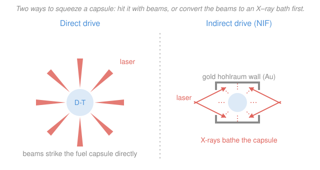

# Fusion & Plasma Engineering · Lesson 4.4: Inertial confinement II — drivers & NIF

> ⏱ ~15 min · Module 4: Tritium, Inertial Fusion & Reactor Engineering · Builds on: [4.3 Inertial confinement I: implosion](04-03-inertial-confinement-implosion.md), [1.5 Ignition, breakeven & gain $Q$](01-05-ignition-breakeven-gain.md) · Unlocks: [4.5 From burning plasma to power plant](04-05-burning-plasma-to-power-plant.md)

## Why this matters

On 5 December 2022, the National Ignition Facility (NIF) at Livermore fired 2.05 MJ of laser light at a peppercorn-sized fuel capsule and got **3.15 MJ of fusion energy back out** — the first time in history a lab produced more fusion energy than the energy delivered to the target. It made headlines as "fusion ignition," and it genuinely was a scientific milestone that people chased for sixty years. But the same experiment is also a brutal lesson in what "gain" means: the lasers that delivered those 2.05 MJ drew roughly **300 MJ from the wall**, so as a *power plant* NIF ran at a loss of about a hundred to one. This lesson is about the machine that does the squeezing — the **driver** — the two philosophies for using it (direct vs indirect drive), and how to read the NIF result honestly.

## The idea

In [4.3](04-03-inertial-confinement-implosion.md) you learned the physics goal of inertial confinement: implode a D-T capsule so fast and so symmetrically that its center reaches ignition conditions before it can fly apart, held together only by its own inertia for a fraction of a nanosecond. That lesson took the implosion as given. Now: **what launches it?**

Whatever heats and blows off (ablates) the capsule's outer shell is the **driver**. As the shell material rockets outward, the rest of the capsule is pushed inward — a spherical rocket turned inside out. Three driver technologies are in the running:

- **Lasers** — the mainstream approach, and NIF's: 192 beams of ultraviolet light delivering megajoules in a few nanoseconds. Precise, but wall-plug-inefficient (flashlamp-pumped glass lasers turn less than 1% of grid power into laser light).
- **Heavy-ion beams** — accelerator-driven, potentially far more efficient (tens of percent) and able to fire many times a second, which is why they are a favorite for a *plant* even though no ignition facility uses them yet.
- **Pulsed power / Z-pinch** — Sandia's Z machine drives a huge current pulse that magnetically implodes a target, converting stored electrical energy with high efficiency.

Given a laser driver, there are two ways to aim it, and they trade the same thing every ICF design fights over: **symmetry versus efficiency.**

- **Direct drive:** point the beams straight at the capsule and let them ablate it. Nothing is wasted on an intermediate step, so more of your laser energy does useful work — but now the *illumination* must be almost perfectly uniform. Any hot or cold spot on the surface seeds the Rayleigh–Taylor instability from [4.3](04-03-inertial-confinement-implosion.md) and the implosion goes lopsided.
- **Indirect drive:** don't touch the capsule with the laser at all. Sit it inside a tiny gold can — a **hohlraum** (German for "hollow space") — and fire the beams onto the *inside walls* of the can. The gold heats to millions of degrees and re-radiates a bath of soft **X-rays**, which fill the cavity like light in an oven and squeeze the capsule from every direction at once. The X-ray bath is naturally far more uniform than any arrangement of laser spots — but you pay for it: most of the laser energy ends up heating gold and leaking back out the holes, never reaching the fuel.

NIF chose indirect drive. The bet was that a smooth, symmetric X-ray drive would beat the murderous uniformity demands of direct drive — and in 2022 that bet paid off. The cost of the bet is exactly the efficiency gap that keeps plant-level gain far below one.

## The formal version

**Target gain (capsule gain).** The number NIF reported is

$$Q_{\text{target}} \equiv \frac{E_{\text{fus}}}{E_{\text{laser}}},$$

the fusion energy released divided by the laser energy delivered **to the target**. *In words: energy out of the capsule per unit of laser energy that reached it.* This is the pulsed, energy-per-shot cousin of the magnetic-confinement gain $Q = P_{\text{fus}}/P_{\text{heat}}$ from [1.5](01-05-ignition-breakeven-gain.md): same ratio, but "input" is a joule budget for one shot rather than a continuous power. The December 2022 shot reached $Q_{\text{target}} = 3.15/2.05 \approx 1.54$ — the first $Q_{\text{target}} > 1$ ever, which is what "ignition" meant here.

**Plant gain (wall-plug gain).** A power plant cares about a completely different ratio:

$$Q_{\text{plant}} \equiv \frac{E_{\text{fus}}}{E_{\text{wall}}},$$

where $E_{\text{wall}}$ is the electrical energy the *whole driver* drew from the grid. *In words: fusion energy out per unit of grid energy in — the number that decides whether the lights stay on.* These are related by the driver's wall-plug efficiency $\eta_{\text{driver}} = E_{\text{laser}}/E_{\text{wall}}$:

$$\boxed{\,Q_{\text{plant}} = \eta_{\text{driver}}\,Q_{\text{target}}\,}$$

For NIF, $\eta_{\text{driver}} \approx 2.05\,\text{MJ}/300\,\text{MJ} \approx 0.7\%$, so a target gain of 1.54 becomes a plant gain of about 0.01. *In words: crossing $Q_{\text{target}} = 1$ is a scientific finish line; crossing $Q_{\text{plant}} = 1$ is a completely separate, much farther one.*

**What a plant additionally needs.** Even a hypothetical $Q_{\text{plant}} > 1$ isn't enough. To close the loop you must (i) convert fusion heat to electricity at efficiency $\eta_{\text{th}} \sim 0.35$, then (ii) recirculate a chunk of that to re-power the driver, so you actually need something like $\eta_{\text{th}}\,\eta_{\text{driver}}\,Q_{\text{target}} \gtrsim$ a few before there is net electricity — implying **target gains of order 50–100** with an efficient driver. And you must fire not once a day but roughly ten times a second, with a fresh target and a survivable chamber each time. Those are 4.5's problems; here we just size the gap.

## Picture

## Worked examples

**Example 1 (read the NIF result — target gain, then the honest plant gain).** The 5 December 2022 shot delivered $E_{\text{laser}} = 2.05$ MJ to the target and produced $E_{\text{fus}} = 3.15$ MJ. The laser system drew $E_{\text{wall}} \approx 300$ MJ from the grid. Find the target gain, the driver wall-plug efficiency, and the plant-level gain.

Target gain:

$$Q_{\text{target}} = \frac{E_{\text{fus}}}{E_{\text{laser}}} = \frac{3.15}{2.05} \approx 1.54.$$

More energy out of the capsule than laser energy into it — the milestone. Driver wall-plug efficiency:

$$\eta_{\text{driver}} = \frac{E_{\text{laser}}}{E_{\text{wall}}} = \frac{2.05}{300} \approx 0.0068 = 0.68\%.$$

Plant gain:

$$Q_{\text{plant}} = \eta_{\text{driver}}\,Q_{\text{target}} = 0.0068 \times 1.54 \approx 0.011,$$

or equivalently $Q_{\text{plant}} = E_{\text{fus}}/E_{\text{wall}} = 3.15/300 \approx 0.011$. So the facility produced about **1% of the grid energy it consumed** — and that is *before* accounting for the ~35% turbine efficiency you'd need to turn that 3.15 MJ of heat back into electricity. The scientific gain is real; the engineering gap is a factor of roughly 100 in efficiency on top of everything else. (Follow-up shots in 2023–2024 pushed $E_{\text{fus}}$ higher — up to about 5.2 MJ from 2.05 MJ, $Q_{\text{target}} \approx 2.5$ — which is genuine progress but doesn't change the wall-plug story.)

**Example 2 (why NIF chose indirect drive).** Compare the two drive schemes on the three axes that decide an ICF design, and say why the more wasteful one won.

| Axis | Direct drive | Indirect drive (NIF) |
|---|---|---|
| Coupling (laser → capsule ablation) | **higher** — no conversion step; a large fraction of absorbed light does useful work | **low** — only ~10–15% of laser energy reaches the capsule; the rest heats gold and escapes the entrance holes |
| Symmetry of the drive | demands near-perfect illumination uniformity (better than ~1%) from many overlapped beams | X-ray bath is naturally near-uniform; relaxes beam pointing and smoothing |
| Instability sensitivity | laser "imprint" stamps nonuniformities straight onto the shell, seeding Rayleigh–Taylor | smooth X-ray drive washes out imprint before it can seed | 

Put a number on the coupling penalty: of NIF's 2.05 MJ, only about $0.12 \times 2.05 \approx 0.25$ MJ ($\approx 12\%$) is actually absorbed by the capsule as X-ray ablation. The other ~88% heats the hohlraum walls and leaks out the laser entrance holes — thrown away *before* the implosion even begins.

So why accept that? Because in ICF, **symmetry is destiny.** From [4.3](04-03-inertial-confinement-implosion.md), a lopsided implosion never reaches the areal density and hot-spot temperature ignition needs — the Rayleigh–Taylor instability amplifies any asymmetry as the shell converges. Indirect drive attacks that problem at the root: a hohlraum full of X-rays squeezes a sphere far more evenly than 192 laser spots ever could, and it smears out the tiny beam-to-beam imperfections ("imprint") that would otherwise seed the instability. NIF's designers judged the symmetry problem more dangerous than the efficiency problem — and the 2022 ignition shot vindicated that call. A *plant*, which cannot afford to throw away 88% of its driver energy, may well have to solve direct drive (or switch to heavy-ion or pulsed-power drivers) instead — a live debate to this day.

## Watch out

- **You might read "ignition" as "power plant."** NIF's ignition means $Q_{\text{target}} > 1$: fusion energy out exceeded laser energy *delivered to the capsule*. It says nothing about the ~300 MJ the lasers drew, the turbine that would convert the heat, or firing more than once a day. Plant-level $Q$ is still about $10^{-2}$.
- **You might think indirect drive is simply "better" because NIF used it.** It isn't better — it's *more symmetric and more forgiving*, bought by throwing away most of the laser energy. Direct drive is more efficient but far less tolerant of illumination flaws. It's a trade, not a ranking; a reactor may reverse the choice.
- **You might credit the whole $E_{\text{fus}}$ as usable output.** As in [1.5](01-05-ignition-breakeven-gain.md), the neutrons carry ~80% of D-T fusion energy — useful for a blanket, but you still owe a factor $\eta_{\text{th}} \sim 0.35$ to turn that heat into electricity, and then you must re-power the driver from what's left.

## One-liner

> NIF's 2022 shot crossed **target** gain ($3.15/2.05 \approx 1.5$) by trading laser efficiency for X-ray symmetry in a gold hohlraum — but the ~300 MJ wall-plug means **plant** gain is still $\approx 0.01$, and $Q_{\text{plant}} = \eta_{\text{driver}}\,Q_{\text{target}}$ is the whole gap in one equation.

## Problems

**P1 (🟢)** A later NIF-class shot delivers $E_{\text{laser}} = 2.2$ MJ to the target and yields $E_{\text{fus}} = 4.0$ MJ of fusion energy. The laser drew $E_{\text{wall}} = 330$ MJ from the grid. Compute (a) the target gain $Q_{\text{target}}$, (b) the driver wall-plug efficiency $\eta_{\text{driver}}$, and (c) the plant-level gain $Q_{\text{plant}}$.

**P2 (🟡)** Suppose only 12% of the 2.05 MJ laser energy is actually absorbed by the capsule as X-ray ablation (the rest heats the gold and escapes). (a) How much energy drives the implosion? (b) Using the 3.15 MJ fusion yield, compute the "capsule gain" relative to the energy that *reached the fuel*, $E_{\text{fus}}/E_{\text{absorbed}}$. (c) In one sentence, explain why this number is so much larger than the target gain of 1.5 — and why it does **not** help a power plant.

**P3 (🔴, optional)** A conceptual laser-fusion plant wants $P_{\text{fus}} = 1$ GW of fusion power, with each target yielding $E_{\text{fus}} = 100$ MJ. (a) How many shots per second must it fire? (b) NIF currently fires roughly once per day. By what factor must the repetition rate increase to reach the plant value? (Connect your answer to why heavy-ion or diode-pumped-laser drivers, not NIF's flashlamp lasers, are studied for plants.)

Solutions

**P1** (a) Target gain:

$$Q_{\text{target}} = \frac{E_{\text{fus}}}{E_{\text{laser}}} = \frac{4.0}{2.2} \approx 1.82.$$

(b) Wall-plug efficiency of the driver:

$$\eta_{\text{driver}} = \frac{E_{\text{laser}}}{E_{\text{wall}}} = \frac{2.2}{330} \approx 0.0067 = 0.67\%.$$

(c) Plant gain, either way:

$$Q_{\text{plant}} = \eta_{\text{driver}}\,Q_{\text{target}} = 0.0067 \times 1.82 \approx 0.012,$$

or directly $Q_{\text{plant}} = 4.0/330 \approx 0.012$. *Check:* the two routes agree, and even a healthy target gain of 1.8 collapses to ~1% at the wall because the flashlamp laser is <1% efficient. The lever that matters most for a plant is $\eta_{\text{driver}}$, not another 20% of yield.

**P2** (a) Absorbed energy:

$$E_{\text{absorbed}} = 0.12 \times 2.05\ \text{MJ} \approx 0.246\ \text{MJ} = 246\ \text{kJ}.$$

(b) Capsule gain relative to absorbed energy:

$$\frac{E_{\text{fus}}}{E_{\text{absorbed}}} = \frac{3.15}{0.246} \approx 12.8.$$

(c) The capsule itself is a spectacular amplifier — the fuel returns roughly 13 times the energy that actually reached it — but the target gain of 1.5 is measured against the *full* 2.05 MJ laser pulse, ~88% of which was spent heating gold and leaking out the hohlraum holes before ignition. It doesn't help a plant because you pay the grid for the whole 2.05 MJ (indeed the whole ~300 MJ), not just the sliver that couples; the wasted 88% is a real bill, and cutting it is exactly why direct drive and more-efficient drivers are studied. *Check:* $12.8 \times 0.12 \approx 1.5 = Q_{\text{target}}$ ✓ — the coupling fraction is precisely the factor between capsule gain and target gain.

**P3** (a) One gigawatt is $10^9$ J/s; each shot delivers $100\ \text{MJ} = 10^8$ J of fusion energy. Shots per second:

$$f = \frac{P_{\text{fus}}}{E_{\text{fus,shot}}} = \frac{10^9\ \text{J/s}}{10^8\ \text{J}} = 10\ \text{shots/s} = 10\ \text{Hz}.$$

(b) NIF's rate is about one shot per day: $f_{\text{NIF}} = 1/86400 \approx 1.16\times10^{-5}$ Hz. The required increase is

$$\frac{f}{f_{\text{NIF}}} = \frac{10}{1.16\times10^{-5}} \approx 8.6\times10^{5},$$

nearly a **million-fold**. *Check:* units cancel (Hz/Hz), and the scale is right — going from "a few shots a day" to "ten a second." NIF's flashlamp glass lasers need hours to cool between shots and are <1% efficient, so they physically cannot run at 10 Hz; heavy-ion accelerators and diode-pumped solid-state lasers are studied precisely because they can fire rapidly *and* convert grid power at tens of percent, attacking the rep-rate and $\eta_{\text{driver}}$ gaps at once.

## Flashback

**From Lesson 1.5 (Ignition, breakeven & gain $Q$):** A magnetically confined burning plasma injects $P_{\text{heat}} = 30$ MW of external heating and produces $P_{\text{fus}} = 450$ MW of fusion power. Compute the gain $Q$, the alpha heating power $P_\alpha$, and the alpha heating fraction $f_\alpha = Q/(Q+5)$. Classify the plasma, and note one way this steady-state $Q$ differs from the ICF **target gain** of this lesson.

Solution

Gain:

$$Q = \frac{P_{\text{fus}}}{P_{\text{heat}}} = \frac{450}{30} = 15.$$

Alpha power is one-fifth of the fusion power (the 3.5 MeV alpha out of 17.6 MeV stays in the plasma):

$$P_\alpha = \tfrac15 P_{\text{fus}} = \tfrac15(450) = 90\ \text{MW}.$$

Alpha fraction:

$$f_\alpha = \frac{Q}{Q+5} = \frac{15}{20} = 0.75.$$

This is a **strongly burning plasma** — past the ITER target of $Q = 10$, with alphas supplying three-quarters of the heating — but *not* ignited: switch off the 30 MW and it cools, so $Q$ is finite, not infinite. **Difference from ICF target gain:** this $Q$ is a ratio of continuous *powers* in a steady-state magnetic bottle, whereas the NIF target gain $Q_{\text{target}} = E_{\text{fus}}/E_{\text{laser}}$ is a ratio of *energies* delivered in a single ~nanosecond pulse. Both are "fusion out over input in," but one is a sustained wattage balance and the other is a per-shot joule budget — and both still hide the wall-plug and turbine losses that separate them from a power plant. *Check:* $f_\alpha = P_\alpha/(P_{\text{heat}}+P_\alpha) = 90/120 = 0.75$ ✓.

## Connections

- **Backward:** the driver is what launches [4.3](04-03-inertial-confinement-implosion.md)'s implosion, and indirect drive's whole reason for existing is to defeat that lesson's Rayleigh–Taylor instability by delivering a symmetric X-ray squeeze. The gain ratio $E_{\text{fus}}/E_{\text{laser}}$ is the pulsed twin of [1.5](01-05-ignition-breakeven-gain.md)'s $Q = P_{\text{fus}}/P_{\text{heat}}$, and the neutron/alpha energy split that limits usable output traces to [1.1](01-01-why-fusion-why-dt.md).
- **Forward:** the wall-plug and rep-rate gaps quantified here — $Q_{\text{plant}} = \eta_{\text{driver}}Q_{\text{target}} \approx 0.01$, ~$10^6$ in firing rate — are exactly the recirculating-power and balance-of-plant problems of [4.5 From burning plasma to power plant](04-05-burning-plasma-to-power-plant.md), where ICF and magnetic confinement face the same final ledger by different roads.
- **Sideways (high-energy-density physics):** how laser light is absorbed at the hohlraum wall and re-emitted as an X-ray bath is a problem of laser–plasma interaction and radiation hydrodynamics — the domain of the [plasma-physics](../../plasma-physics/syllabus.md) syllabus (wave–plasma coupling, radiative transfer) carried into the megabar, hundred-million-kelvin regime that ICF and stockpile-stewardship science share.
