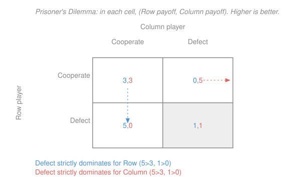

# Game Theory · Lesson 1.1: Normal form, dominance, and rationalizability

> ⏱ ~15 min · Module 1: Static games of complete information · Builds on: [`prob-stat-refresher`](../../prob-stat-refresher/syllabus.md) · Unlocks: 1.2 (Nash equilibrium)

## Why this matters

Before you can *solve* a game you need a language to *write* one down, and a first blade to trim it. The normal form is that language — the object every later solution concept (Nash, Bayes–Nash, sequential equilibrium) is defined on. Dominance is the first blade: it asks only "would a rational player ever do this?" and throws out what fails, no equilibrium reasoning required. Remarkably, iterating that one question — *and* the knowledge that everyone iterates it — sometimes pins down a unique prediction outright. When it doesn't, it still tells you exactly which strategies are defensible, which is the concept called rationalizability.

## The idea

A strategy is **strictly dominated** if you have another option that does *strictly better no matter what the others do*. No belief about opponents, however paranoid or optimistic, can rationalize playing it — so a rational player never does. That is domination in one sentence.

The power comes from *iterating*. Once you delete everyone's dominated strategies, the game shrinks; in the smaller game new strategies may become dominated that weren't before, because the profiles you were hedging against are gone. Delete those too, and repeat. Each round quietly uses a stronger assumption: round one needs "players are rational"; round two needs "players know players are rational"; round $k$ needs $k$ layers of *common knowledge of rationality*. When the dust settles, whatever survives is exactly what rational, mutually-aware players could conceivably play. In the Prisoner's Dilemma the dust settles on a single cell.

## The formal version

**Normal-form (strategic) game.** A tuple
$$G = \big(N,\; \{S_i\}_{i\in N},\; \{u_i\}_{i\in N}\big),$$
where $N=\{1,\dots,n\}$ is the set of **players**; $S_i$ is player $i$'s set of (pure) **strategies**; and $u_i:\prod_{j\in N} S_j \to \mathbb{R}$ is $i$'s **payoff function** — a von Neumann–Morgenstern utility, so expected values are meaningful. Write a **strategy profile** as $s=(s_i,s_{-i})$, where $s_{-i}$ collects everyone *but* $i$. *In words:* players, the menus they choose from simultaneously, and a number scoring each combination of choices.

A **mixed strategy** $\sigma_i \in \Delta(S_i)$ is a probability distribution over $S_i$; payoffs extend by expectation, $u_i(\sigma_i,s_{-i}) = \sum_{s_i} \sigma_i(s_i)\,u_i(s_i,s_{-i})$.

**Bimatrix.** For two players, $G$ is a table: rows = $S_1$, columns = $S_2$, each cell holding the pair $(u_1,u_2)$. (See the Picture.)

**Strict dominance.** Strategy $s_i$ is **strictly dominated** if there exists a (possibly mixed) $\sigma_i' \in \Delta(S_i)$ with
$$u_i(\sigma_i',\,s_{-i}) \;>\; u_i(s_i,\,s_{-i}) \qquad \text{for every } s_{-i}\in \textstyle\prod_{j\ne i}S_j.$$
*In words:* $\sigma_i'$ beats $s_i$ against **every** rival profile, strictly. "Possibly mixed" matters — a pure strategy can be beaten by no single alternative yet crushed by a coin-flip between two (Example 1).

**Weak dominance.** Same, with $\ge$ everywhere and $>$ for at least one $s_{-i}$: never worse, sometimes better.

**Best response.** $s_i$ is a **best response** to a belief $\sigma_{-i}$ about opponents if $u_i(s_i,\sigma_{-i}) \ge u_i(s_i',\sigma_{-i})$ for all $s_i'\in S_i$. A strategy is a **never-best-response** if no belief makes it optimal.

**IESDS.** *Iterated Elimination of Strictly Dominated Strategies*: repeatedly delete every strictly dominated strategy of every player until none remain. Two facts you may lean on:

- **Order independence.** The set of surviving profiles does not depend on the order of deletions. (A strategy dominated at some stage stays dominated after further deletions, so nothing legitimate is ever lost by waiting.)
- **Justification.** The survivors are precisely the profiles consistent with *common knowledge of rationality*.

**Rationalizability.** Iteratively delete never-best-responses (to any belief over surviving opponent strategies); survivors are **rationalizable**. Key link: in a **two-player** game a pure strategy is a never-best-response **iff** it is strictly dominated by a (possibly mixed) strategy — so *rationalizable = IESDS survivors*. (With $\ge 3$ players the two coincide only if beliefs may be correlated; under independent beliefs, IESDS can cut more. We work with two players, where they agree.)

## Picture

## Worked examples

**Example 1 (domination requires a mixture).** Only Row's payoffs matter here; leave Column's as $\cdot$:
$$\begin{array}{c|cc} & L & R\\\hline T & 3,\cdot & 0,\cdot\\ M & 1,\cdot & 1,\cdot\\ B & 0,\cdot & 3,\cdot\end{array}$$
Is $M$ dominated? Not by $T$ ($0<1$ against $R$) and not by $B$ ($0<1$ against $L$) — no *pure* strategy works. But the mixture $\sigma' = \tfrac12 T + \tfrac12 B$ yields $\tfrac12(3)+\tfrac12(0)=1.5$ against $L$ and $\tfrac12(0)+\tfrac12(3)=1.5$ against $R$. Since $1.5 > 1$ against both, $\sigma'$ **strictly dominates** $M$. Moral: always allow mixtures before declaring a strategy undominated.

**Example 2 (dominance = best response, in the PD).** Take the figure's game. For Row, is $C$ (Cooperate) ever a best response? Against Column-$C$, Row gets $3$ from $C$ vs $5$ from $D$; against Column-$D$, $0$ vs $1$. Against *any* belief $\sigma_2 = (q,1-q)$ over Column's play, $D$ yields $5q+1(1-q)=1+4q$ and $C$ yields $3q$, and $1+4q > 3q$ for all $q\in[0,1]$. So $C$ is a **never-best-response** — equivalently, $D$ strictly dominates $C$. Deleting $C$ for both players (symmetry) leaves the single profile $(D,D)$: the unique rationalizable / IESDS outcome, and the whole reason the dilemma bites.

## Watch out

- **Weak-dominance elimination is order-dependent.** Deleting *weakly* dominated strategies can leave different survivors depending on the order (P3 builds the counterexample). Strict dominance is safe; weak is not — never quote "the" weak-dominance solution.
- **"Dominated" ≠ "never the highest payoff you'll see."** Domination compares two of *your own* strategies column-by-column against the *same* opponent profile — not against different ones. A strategy can yield your game's best-ever cell yet still be dominated (Example 1's $B$ hits $3$, yet in a fuller game could be dominated).
- **Undominated is not the same as optimal.** Surviving IESDS only means "defensible under some coherent belief." It rarely predicts a single outcome — that's the job of Nash equilibrium next lesson, which adds *correct* beliefs on top of rational ones.

## One-liner

> Delete what no belief could justify — strictly, and iterate; in two-player games that is exactly "survives against every rational belief," and in the Prisoner's Dilemma it leaves only mutual defection.

## Problems

**P1 (🟢)** Write the Prisoner's Dilemma from the figure as a bimatrix. Prove that Defect strictly dominates Cooperate for each player, name the surviving (dominant-strategy) profile, and explain precisely why it is Pareto-inferior.

**P2 (🟡)** In the game below (Row picks $U,M,D$; Column picks $L,C,R$; entries $(u_{\text{Row}},u_{\text{Col}})$), solve by IESDS. Give an explicit elimination order, justify each step, and identify the unique surviving profile.
$$\begin{array}{c|ccc} & L & C & R\\\hline U & 3,1 & 2,4 & 0,3\\ M & 4,2 & 6,5 & 1,1\\ D & 1,0 & 5,3 & 2,2\end{array}$$

**P3 (🔴, optional)** Exhibit a two-player game in which the *order* of iterated **weak**-dominance elimination changes the surviving set. Carry out two different orders and show the survivor sets differ.

Solutions

**P1.** With strategy sets $S_i=\{C,D\}$ and payoffs $(u_{\text{Row}},u_{\text{Col}})$:
$$\begin{array}{c|cc} & C & D\\\hline C & 3,3 & 0,5\\ D & 5,0 & 1,1\end{array}$$
*Row.* Compare $D$ against $C$ column-by-column: vs Column-$C$, $u_{\text{Row}}(D,C)=5 > 3 = u_{\text{Row}}(C,C)$; vs Column-$D$, $u_{\text{Row}}(D,D)=1 > 0 = u_{\text{Row}}(C,D)$. Strictly greater against every rival choice, so $D$ strictly dominates $C$. By symmetry (the payoff matrix is symmetric across the diagonal) the same holds for Column. Each player's $C$ is strictly dominated, so IESDS deletes both, leaving the unique profile $(D,D)$ with payoffs $(1,1)$.

*Pareto comparison.* An outcome is Pareto-inferior if another outcome makes **no** player worse off and **at least one** strictly better. Compare $(D,D)=(1,1)$ to $(C,C)=(3,3)$: $3>1$ for **both** players. So $(C,C)$ Pareto-dominates $(D,D)$ — mutual cooperation is strictly better for everyone, yet individual dominance forces the group to the worse cell. Individually rational play $\ne$ collectively efficient play. $\blacksquare$

**P2.** One valid order (order-independence guarantees any valid order lands here):

1. *Column deletes $R$ via $C$.* Compare Column's payoff under $C$ vs $R$ in each row: $U$: $4>3$; $M$: $5>1$; $D$: $3>2$. Strictly greater in every row $\Rightarrow$ $C$ strictly dominates $R$; delete $R$.
2. *Row deletes $U$ via $M$.* With columns $\{L,C\}$ remaining, Row's payoff $M$ vs $U$: $L$: $4>3$; $C$: $6>2$. So $M$ strictly dominates $U$; delete $U$. (In fact $M$ dominates $U$ even in the full game — $1>0$ in column $R$ too — so this step was legal from the start, a concrete taste of order-independence.)
3. *Column deletes $L$ via $C$.* Remaining rows $\{M,D\}$; Column's payoff $C$ vs $L$: $M$: $5>2$; $D$: $3>0$. So $C$ strictly dominates $L$; delete $L$.
4. *Row deletes $D$ via $M$.* Only column $C$ remains; Row's payoff $M$ vs $D$: $6>5$. Delete $D$.

Surviving profile: $(M,C)$ with payoffs $(6,5)$ — unique. Check: at $(M,C)$, Row's $M$ gives $6$ vs alternatives $2\ (U),5\ (D)$ against $C$, and Column's $C$ gives $5$ vs $2\ (L),1\ (R)$ against $M$ — each is a strict best response, so $(M,C)$ is internally consistent and no further deletion is possible. $\blacksquare$

**P3.** Take (Row $\in\{T,B\}$, Column $\in\{L,R\}$):
$$\begin{array}{c|cc} & L & R\\\hline T & 1,1 & 0,0\\ B & 1,1 & 2,1\end{array}$$
Two legitimate first moves exist:

- *Row's $B$ weakly dominates $T$*: $u_{\text{Row}}(B,L)=1\ge 1=u_{\text{Row}}(T,L)$ and $u_{\text{Row}}(B,R)=2 > 0=u_{\text{Row}}(T,R)$ — $\ge$ throughout, strict at $R$. ✓
- *Column's $L$ weakly dominates $R$*: $u_{\text{Col}}(T,L)=1 > 0 = u_{\text{Col}}(T,R)$ and $u_{\text{Col}}(B,L)=1\ge 1=u_{\text{Col}}(B,R)$ — $\ge$ throughout, strict at $T$. ✓

**Order A — delete $T$ first.** Only row $B$ remains. Against $B$, Column gets $1$ from both $L$ and $R$: neither weakly dominates the other, so nothing more is deleted. Surviving profiles: $\{(B,L),\,(B,R)\}$.

**Order B — delete $R$ first.** Only column $L$ remains. Against $L$, Row gets $1$ from both $T$ and $B$: neither weakly dominates, nothing more deleted. Surviving profiles: $\{(T,L),\,(B,L)\}$.

The two survivor sets differ: $(B,R)$ survives only under Order A, $(T,L)$ only under Order B; their intersection is just $(B,L)$. So iterated weak-dominance elimination is **order-dependent** — the surviving set is not well-defined without fixing an order. (Contrast IESDS in P2, where every order gives the identical survivor.) $\blacksquare$

## Connections

- **Backward (`prob-stat-refresher`):** the "possibly mixed" clause and best responses to a belief $\sigma_{-i}$ are just expected-value comparisons over a distribution — the linearity of expectation is doing the work in Examples 1–2 and returns in force in [1.3](01-03-mixed-strategies.md).
- **Forward (1.2):** Nash equilibrium keeps the *rational* part but adds *correct beliefs* — each player best-responds to what others actually do. Every strict-dominant-strategy profile (like $(D,D)$) is automatically Nash, but Nash also selects among IESDS survivors when dominance alone leaves many. See [1.2 Nash equilibrium](01-02-nash-equilibrium.md).
- **Sideways (economics):** IESDS is the engine behind solving [Cournot and Bertrand](01-04-cournot-bertrand-applications.md) — the Cournot best-response iteration is literally deleting non-best-responses until only the equilibrium quantity survives. The Prisoner's Dilemma structure recurs whenever private incentives and joint efficiency diverge (public goods, cartels, arms races).
