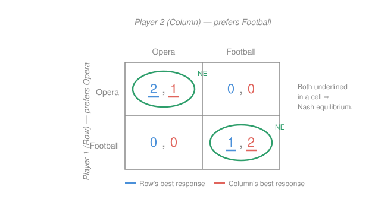

# Game Theory · Lesson 1.2: Nash equilibrium

> ⏱ ~15 min · Module 1: Static games of complete information · Builds on: [1.1 Normal form, dominance, and rationalizability](01-01-normal-form-dominance.md) · Unlocks: 1.3 (mixed strategies)

## Why this matters

Iterated deletion (1.1) is powerful but often stops early: in most interesting games no strategy is dominated, and rationalizability leaves a whole set of survivors. To get a *sharp prediction* — a single profile, or a short list — you need a stronger requirement than "not obviously stupid." Nash equilibrium is that requirement, and it is the workhorse concept of all of economics: Cournot's oligopoly, Bertrand's price war, the Prisoner's Dilemma's tragic logic, and every model in Modules 2–4 is ultimately a Nash equilibrium computation. It is the definition of a *consistent prediction*: an outcome that, once everyone expects it, no one wants to break.

## The idea

A prediction about how a game is played is only credible if it doesn't unravel the moment players see it coming. Suppose a wise oracle announces the outcome in advance and everyone believes it. If some player, hearing the prophecy, could do strictly better by quietly changing their own move, the prophecy is self-defeating — a rational person would deviate, and the announced outcome never happens. A **Nash equilibrium** is a prophecy that survives being announced: every player, taking everyone else's move as *given and correct*, is already doing the best they can. Nobody has a reason to move first.

That is the whole content of the concept — *mutual best response*. Each player is playing optimally **against the actual choices of the others**. Crucially this is a statement about **unilateral** deviations: we ask only whether *one* player, changing *alone*, can gain. We never ask whether the players could *jointly* rearrange to everyone's benefit — that is a different (and weaker-binding) question, and its answer is why the Prisoner's Dilemma has a bad-but-stable outcome.

## The formal version

Fix a finite normal-form game with players $i = 1, \dots, n$, strategy set $S_i$ for each, and payoff $u_i(s_1,\dots,s_n)$. Write a profile as $s = (s_i, s_{-i})$, where $s_{-i}$ denotes everyone's choice *except* $i$'s.

**Best-response correspondence.** Player $i$'s best responses to the others' profile $s_{-i}$ is the set

$$BR_i(s_{-i}) = \{\, s_i \in S_i : u_i(s_i, s_{-i}) \ge u_i(s_i', s_{-i}) \ \text{for all } s_i' \in S_i \,\}.$$

In words: given what everyone else does, $BR_i(s_{-i})$ collects every strategy that maximizes $i$'s own payoff. It is a *correspondence* (set-valued), not a function, because ties are allowed — sometimes several strategies are equally good.

**Nash equilibrium.** A profile $s^* = (s_1^*, \dots, s_n^*)$ is a (pure-strategy) **Nash equilibrium** if

$$s_i^* \in BR_i(s_{-i}^*) \qquad \text{for every player } i.$$

In words: *simultaneously*, each player's chosen strategy is a best response to the others' chosen strategies. Equivalently, the **no-profitable-deviation** form: for every player $i$ and every alternative $s_i' \in S_i$,

$$u_i(s_i^*, s_{-i}^*) \ge u_i(s_i', s_{-i}^*).$$

No one can strictly gain by deviating alone. (If every inequality is *strict* for $s_i' \ne s_i^*$, the equilibrium is called **strict**.)

**The best-response method.** To find every pure NE of a bimatrix: in each column, mark Player 1's payoff-maximizing row (Row's best response to that column); in each row, mark Player 2's payoff-maximizing column. Any cell where **both** payoffs are marked is a Nash equilibrium — because both players are simultaneously best-responding there. That's it; the whole algorithm is "mark and intersect."

**Relation to dominance (1.1).** The two tools nest cleanly:

- A strictly dominant strategy is a best response to *everything*, so a profile of strictly dominant strategies is the **unique** NE (Prisoner's Dilemma).
- Every NE **survives** iterated elimination of strictly dominated strategies (IESDS) — a dominated strategy is never a best response, so it can't be part of a mutual best response. The converse fails: surviving IESDS is necessary but not sufficient. Nash is the strictly finer test, i.e. the set of Nash outcomes is contained in the set of IESDS survivors. (P3 makes the sharp version precise.)

## Picture

Row prefers the Opera cell, Column the Football cell, but both prefer being *together* to being apart. Underline Row's best payoff in each column (blue) and Column's best in each row (red); the two cells with both underlines — $(\text{Opera},\text{Opera})$ and $(\text{Football},\text{Football})$ — are the pure Nash equilibria. Notice the anti-diagonal cells have *no* underlines: mismatching is nobody's best response.

## Worked examples

**Example 1 (mechanical — the method on a coordination game).** Two firms pick a technology standard, A or B; payoffs $(u_1, u_2)$:

| | **A** | **B** |
|---|---|---|
| **A** | $3,\,3$ | $0,\,0$ |
| **B** | $0,\,0$ | $2,\,2$ |

Best responses. Row: against column A, compare $3$ vs $0$ → play A; against column B, compare $0$ vs $2$ → play B. Column is symmetric. So both best responses coincide on the main diagonal: $(A,A)$ and $(B,B)$ are Nash equilibria. Check $(A,A)$: Row deviating to B earns $0 < 3$; Column likewise — no profitable unilateral deviation, confirmed. The off-diagonal cells fail: at $(A,B)$, Row earns $0$ but would get $2$ by switching to B. This is the signature of a **coordination game** — multiple equilibria, here **Pareto-ranked** ($(A,A)$ beats $(B,B)$ for both), yet $(B,B)$ is still a genuine equilibrium: once both expect B, neither will unilaterally jump to A (jumping alone yields $0$). Multiplicity, not efficiency, is the lesson.

**Example 2 (why you'd care — the Prisoner's Dilemma, NE ≠ Pareto).** Two suspects each Cooperate (stay silent) or Defect (confess); payoffs $(u_1,u_2)$:

| | **C** | **D** |
|---|---|---|
| **C** | $3,\,3$ | $0,\,5$ |
| **D** | $5,\,0$ | $1,\,1$ |

For Row: against C, $5 > 3$ → D; against D, $1 > 0$ → D. D is *strictly dominant*, and by symmetry so is Column's D. Both best responses land only on $(D,D)$: the **unique** Nash equilibrium, payoff $(1,1)$. But $(C,C)$ gives $(3,3)$ — strictly better for *both*. The equilibrium is Pareto-inefficient, and there is no contradiction: Nash rules out only *unilateral* gains, and from $(D,D)$ a lone switch to C drops you from $1$ to $0$. The jointly-better move requires *both* to change at once, which the concept never permits. This gap — individually rational, collectively ruinous — is the entire subject of repeated games in [2.3](02-03-repeated-games-folk-theorem.md), where the "shadow of the future" is what finally sustains $(C,C)$.

## Watch out

- You might think a Nash equilibrium is an outcome that's *good for the players*. It need not be: the Prisoner's Dilemma's only NE is the worst symmetric outcome. NE means "no one can improve *by moving alone*," which is silent about joint improvements — do not conflate it with Pareto efficiency.
- You might think every game has exactly one pure-strategy NE. It can have several (coordination games, Battle of the Sexes) or **none at all** (Matching Pennies, P2) — the non-existence of pure equilibria is exactly what forces mixed strategies in [1.3](01-03-mixed-strategies.md).
- You might check deviations to a *jointly* different profile. The definition holds $s_{-i}^*$ **fixed** and varies only $s_i$. When you verify an equilibrium, change one player's strategy at a time; a "deviation" where two players move together is not a test of Nash stability.

## One-liner

> A Nash equilibrium is a prophecy no single player wants to break: everyone is best-responding to everyone else at once — which guarantees stability against lone deviations, never efficiency.

## Problems

**P1 (🟢)** Two hunters each choose to hunt Stag (S) or Hare (H). A stag needs both; a hare needs only oneself. Payoffs $(u_1,u_2)$:

| | **S** | **H** |
|---|---|---|
| **S** | $4,\,4$ | $0,\,3$ |
| **H** | $3,\,0$ | $3,\,3$ |

Find all pure-strategy Nash equilibria by the best-response method, and say how they are ranked.

**P2 (🟡)** *(a)* Matching Pennies: each player shows Heads or Tails; Row wins (payoff $+1$) on a match, Column wins on a mismatch; the loser gets $-1$.

| | **H** | **T** |
|---|---|---|
| **H** | $1,\,-1$ | $-1,\,1$ |
| **T** | $-1,\,1$ | $1,\,-1$ |

Show by the best-response method that there is **no** pure-strategy Nash equilibrium. *(b)* Now suppose *both* players instead prefer to match (payoff $1$ on a match, $0$ on a mismatch, for both). How many pure NE are there? Explain in one sentence what structural feature of Matching Pennies destroys existence.

**P3 (🔴, optional)** Prove the sharp link between IESDS and Nash. *(a)* Show that if a strategy profile $s^*$ is a Nash equilibrium, then no strategy $s_i^*$ is ever removed by iterated elimination of strictly dominated strategies — i.e. every NE survives IESDS. *(b)* Conclude: if IESDS leaves a **unique** surviving profile $s'$, then $s'$ is the **unique** Nash equilibrium. *(c)* Exhibit a game with a Nash equilibrium in which some player uses a strategy that is *not* dominant, demonstrating that the Nash set is strictly larger than the set of dominant-strategy outcomes.

Solutions

**P1** Best responses. Row: against column S, compare $u_1=4$ (play S) vs $3$ (play H) → **S**; against column H, compare $0$ (S) vs $3$ (H) → **H**. Column is symmetric (identical payoff structure). The best responses coincide exactly on the diagonal:

- $(S,S)$: both underlined → NE, payoff $(4,4)$.
- $(H,H)$: both underlined → NE, payoff $(3,3)$.

Off-diagonal cells fail: at $(S,H)$ Row gets $0$ but would get $3$ switching to H, so it is not mutual. **Two pure NE**, Pareto-ranked: $(S,S)$ is **payoff-dominant** (better for both), while $(H,H)$ is **risk-dominant** (the safe choice — H guarantees $3$ regardless of the partner, whereas S risks $0$). This tension between the efficient and the safe equilibrium is the whole point of the Stag Hunt.

*Check (no profitable unilateral deviation).* At $(S,S)$: either hunter switching to H drops from $4$ to $3$ — no gain. At $(H,H)$: either switching to S drops from $3$ to $0$ — no gain. Both confirmed as Nash equilibria. ✓

**P2** *(a)* Best responses in Matching Pennies. Row (wants to match): against column H, $1 > -1$ → play **H**; against column T, $1 > -1$ → play **T**. So Row's underline sits on the *main diagonal* cells $(H,H),(T,T)$. Column (wants to mismatch): against row H, compare Column's payoffs $-1$ (col H) vs $1$ (col T) → play **T**; against row T, $1$ (col H) vs $-1$ (col T) → play **H**. So Column's underline sits on the *anti-diagonal* cells $(H,T),(T,H)$. The two sets of marks **never share a cell** — Row wants the diagonal, Column wants the anti-diagonal — so no cell has both underlined: **no pure-strategy Nash equilibrium**.

*Check.* Verify directly that each cell has a profitable deviation. $(H,H)$: Column gets $-1$, deviates to T for $+1$. $(H,T)$: Row gets $-1$, deviates to T for $+1$. $(T,H)$: Row deviates to H. $(T,T)$: Column deviates to H. Every cell is broken by *someone* — confirming no NE. ✓ (This is precisely why [1.3](01-03-mixed-strategies.md) introduces mixing: randomizing $\tfrac12,\tfrac12$ restores an equilibrium.)

*(b)* If both prefer to match: Row plays H vs H, T vs T (diagonal); Column now *also* wants to match, so Column plays H vs H, T vs T (diagonal too). Both underlines coincide on $(H,H)$ and $(T,T)$ → **two pure NE**. The destructive feature of Matching Pennies is that it is a **strictly competitive (zero-sum) game of pure conflict**: one player's best response is to match, the other's is to mismatch, so their best-response marks live on *disjoint* diagonals and can never intersect in pure strategies. Coordination (aligned interests) puts the marks on the *same* cells; conflict (opposed interests) forces them apart.

**P3** *(a)* Suppose $s^*$ is a Nash equilibrium; we show by induction on elimination rounds that no component $s_i^*$ is ever deleted, so the surviving set always contains $s^*$. Inductively assume that after some round every player's NE component $s_j^*$ still survives — in particular the full profile $s_{-i}^*$ is available. Suppose, for contradiction, that $s_i^*$ is strictly dominated at this round by some surviving strategy $\sigma_i$, meaning $u_i(\sigma_i, s_{-i}) > u_i(s_i^*, s_{-i})$ for **all** surviving opponent profiles $s_{-i}$. Since $s_{-i}^*$ is one such surviving profile, this gives $u_i(\sigma_i, s_{-i}^*) > u_i(s_i^*, s_{-i}^*)$ — contradicting the Nash condition that $s_i^* \in BR_i(s_{-i}^*)$. Hence $s_i^*$ is never eliminated. By induction $s^*$ survives every round.

*(b)* Suppose IESDS terminates with a **single** surviving profile $s'$. By part (a) every Nash equilibrium survives, so any NE must equal $s'$ — there is **at most one** NE. It remains to show $s'$ *is* one. Fix a player $i$ and any deviation $t_i \ne s_i'$. Since only $s_i'$ survives for player $i$, the strategy $t_i$ was eliminated at some round, strictly dominated there by a strategy $\sigma_i$ with $u_i(\sigma_i, s_{-i}) > u_i(t_i, s_{-i})$ for all opponent profiles surviving at that round. Because $s_{-i}'$ survives to the very end, it survived that round, so $u_i(\sigma_i, s_{-i}') > u_i(t_i, s_{-i}')$. Now either $\sigma_i = s_i'$, and we are done, or $\sigma_i$ was itself later eliminated — in which case repeat the argument with $\sigma_i$ in place of $t_i$. Each step strictly increases the payoff against $s_{-i}'$, and the chain is finite (finitely many strategies) and can only terminate at the unique never-eliminated strategy $s_i'$. Therefore $u_i(s_i', s_{-i}') > u_i(t_i, s_{-i}')$ for every $t_i \ne s_i'$. This holds for every $i$, so $s'$ is a (strict) Nash equilibrium — and by the first line, the only one.

*(c)* Take the coordination game of Example 1 (or Battle of the Sexes from the Picture). At the equilibrium $(A,A)$, Row plays A — but A is **not** a dominant strategy, since A is a best response only when Column plays A; against Column's B, Row strictly prefers B. Neither player has any dominant strategy, so IESDS deletes nothing, yet $(A,A)$ and $(B,B)$ are both Nash equilibria. Thus the Nash concept predicts strictly more than dominance can: $\{\text{Nash equilibria}\} \supsetneq \{\text{dominant-strategy outcomes}\}$.

*Check.* Part (b)'s conclusion is an inequality that is **strict**, so the identified profile leaves no room for even a weakly profitable deviation — it is not merely a Nash equilibrium but a strict one, exactly as required. And part (c)'s $(A,A)$ withstands unilateral deviation ($3 \to 0$ for either player) despite using a non-dominant strategy, confirming the strict inclusion. ✓

## Connections

- **Backward:** Nash refines [1.1](01-01-normal-form-dominance.md). Dominance and IESDS prune strategies that are *never* best responses; Nash keeps only profiles that are *mutually* best responses — a strict subset of the rationalizable survivors (P3). The best-response correspondence $BR_i$ is the same object that drove rationalizability, now required to close on itself.
- **Forward:** [1.3](01-03-mixed-strategies.md) rescues Matching Pennies (P2) by letting players randomize; Nash's existence theorem will guarantee that *every* finite game has at least one equilibrium once mixing is allowed. [1.4](01-04-cournot-bertrand-applications.md) computes Nash equilibria in continuous strategy spaces (Cournot quantities, Bertrand prices) by intersecting best-response *functions*. In Module 2, subgame-perfect equilibrium ([2.2](02-02-subgame-perfection-commitment.md)) is Nash-plus-credibility for dynamic games.
- **Sideways (economics):** the coordination game (Example 1) is the mathematics of standards wars, bank runs, and adoption of a common currency; the Prisoner's Dilemma (Example 2) is the logic of arms races, overfishing, and cartel cheating — all "individually rational, collectively worse" equilibria, the exact structure the tragedy of the commons in [1.4](01-04-cournot-bertrand-applications.md) generalizes to $n$ players.
