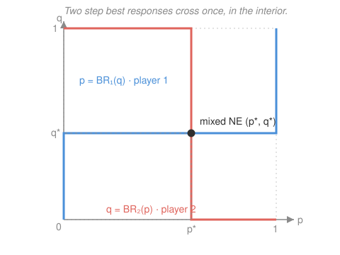

# Game Theory · Lesson 1.3: Mixed strategies and existence

> ⏱ ~15 min · Module 1: Static games of complete information · Builds on: [1.2 Nash equilibrium](01-02-nash-equilibrium.md), [`prob-stat-refresher` 2.1](../../prob-stat-refresher/lessons/02-01-expectation-variance-moments.md) · Unlocks: 1.4 (strategic market models)

## Why this matters

Matching Pennies ([1.2](01-02-nash-equilibrium.md), P2) has **no** pure-strategy equilibrium: whatever you plan, your opponent wants to outguess you, and you them, forever. That looks like a fatal hole in the whole enterprise — a game with no consistent prediction. Mixed strategies patch it, and they patch it *completely*: allow players to randomize, and **every finite game has an equilibrium** (Nash, 1950). That existence guarantee is the license for the entire rest of the subject — every model in Modules 2–4 assumes an equilibrium exists to solve for. Mixing is also how real strategic randomness gets modeled: a penalty-taker who always shoots left gets saved, an auditor who inspects on a schedule gets gamed. Unpredictability is an equilibrium object.

## The idea

Instead of committing to one action, a player rolls a private die and lets it choose — Heads with probability $p$, Tails with $1-p$. Against an opponent who is *also* randomizing, your payoff is now an **expected** payoff, and here is the one fact that runs everything: expected payoff is a **weighted average** of your pure-action payoffs, with your own probabilities as the weights. Averages are linear, so nothing you can do to your own mix ever beats putting all your weight on your single best pure response — *unless several pure responses are exactly tied*.

That "unless" is the whole engine. You will only genuinely randomize between two actions if you are **indifferent** between them — otherwise you'd dump all your probability on the better one. So in a mixed equilibrium every action you actually play must earn you the same expected payoff. Now flip it: your expected payoff from "shoot left" versus "shoot right" depends on where the *goalie* dives. The condition that makes *you* indifferent is therefore an equation in the *goalie's* probabilities. This is the counterintuitive heart of the method: **you choose your mix to make your opponent indifferent, not yourself.** Each player's randomization is calibrated to keep the *other* guessing.

## The formal version

**Mixed strategy.** For a finite pure-strategy set $S_i$, a **mixed strategy** $\sigma_i$ is a probability distribution over $S_i$ — a point in the simplex

$$\Delta(S_i) = \Big\{\, \sigma_i : S_i \to [0,1] \ \Big|\ \textstyle\sum_{s_i \in S_i} \sigma_i(s_i) = 1 \,\Big\}.$$

In words: $\sigma_i(s_i)$ is the probability $i$ plays pure action $s_i$; the weights are nonnegative and sum to one. The **support** of $\sigma_i$ is the set of actions it plays with positive probability. A pure strategy is the degenerate mix putting weight $1$ on one action.

**Expected payoff.** With everyone randomizing independently, $i$'s payoff is the expectation

$$u_i(\sigma_i, \sigma_{-i}) = \mathbb{E}\big[u_i\big] = \sum_{s_i \in S_i} \sigma_i(s_i)\, u_i(s_i, \sigma_{-i}), \qquad u_i(s_i,\sigma_{-i}) = \sum_{s_{-i}} \Big(\textstyle\prod_{j\ne i}\sigma_j(s_j)\Big) u_i(s_i, s_{-i}).$$

In words: average $i$'s payoff over the die rolls. The key structural fact is visible on the left — $u_i(\sigma_i,\sigma_{-i})$ is **linear** in $i$'s own weights $\sigma_i(\cdot)$, with coefficients $u_i(s_i,\sigma_{-i})$ = the expected value of each pure action against the opponents' mix.

**Nash equilibrium (mixed).** A profile $\sigma^* = (\sigma_1^*,\dots,\sigma_n^*)$ is a Nash equilibrium if for every $i$ and every $\sigma_i \in \Delta(S_i)$, $\ u_i(\sigma_i^*, \sigma_{-i}^*) \ge u_i(\sigma_i, \sigma_{-i}^*)$ — no *mixed* deviation helps. Same definition as [1.2](01-02-nash-equilibrium.md), now on the simplex.

**Indifference principle (the computational tool).** Because $u_i$ is linear in $\sigma_i$, the best mix can only spread weight across actions that are *tied* for best. Formally: $\sigma_i^*$ is a best response to $\sigma_{-i}^*$ **iff** every action in its support earns the maximal expected payoff,

$$\sigma_i^*(s_i) > 0 \ \Longrightarrow\ u_i(s_i, \sigma_{-i}^*) = \max_{s_i' \in S_i} u_i(s_i', \sigma_{-i}^*).$$

In words: **a player is indifferent among all the pure strategies they actually mix over, and weakly prefers them to the ones they don't.** To find the equilibrium you *write down player $i$'s indifference equations and solve them for $\sigma_{-i}^*$* — $i$'s conditions pin down everyone *else's* probabilities.

**Nash's existence theorem.** *Every finite normal-form game — finitely many players, each with a finite pure-strategy set — has at least one Nash equilibrium in mixed strategies.* One-line reason: the profile space $\prod_i \Delta(S_i)$ is **compact and convex**, and the best-response correspondence $\sigma \mapsto \prod_i BR_i(\sigma_{-i})$ is nonempty-valued, **convex-valued** (best responses to a fixed $\sigma_{-i}$ form a face of the simplex — linearity again) and **upper hemicontinuous** (expected payoffs are continuous). **Kakutani's fixed-point theorem** then delivers a $\sigma^*$ with $\sigma^* \in BR(\sigma^*)$ — which is exactly a Nash equilibrium. (The fixed-point machinery is stated and used here; its proof is the opening of `grad-game-theory`.)

## Picture

Plot Row's mixing probability $p$ against Column's $q$. Row's best response is a *step*: play $p=1$ when $q$ is above Column's indifference level, $p=0$ below, and **anything** ($p\in[0,1]$) exactly at it — a vertical segment. Column's best response is the mirror step. The two staircases cross at one interior point: the mixed-strategy Nash equilibrium, where each player sits on their flat indifferent stretch precisely because the *other's* probability holds them there.

## Worked examples

**Example 1 (mechanical — the indifference method).** Matching Pennies: Row wins ($+1$) on a match, Column ($+1$) on a mismatch; loser gets $-1$.

| | **H** | **T** |
|---|---|---|
| **H** | $1,\,-1$ | $-1,\,1$ |
| **T** | $-1,\,1$ | $1,\,-1$ |

Let Row play H with probability $p$, Column play H with probability $q$. **Make the opponent indifferent.** Row's expected payoffs: from H, $\ q(1)+(1-q)(-1)=2q-1$; from T, $\ q(-1)+(1-q)(1)=1-2q$. Indifference $2q-1=1-2q \Rightarrow q=\tfrac12$. By the symmetric computation on Column's payoffs, $p=\tfrac12$. The unique equilibrium is both playing $(\tfrac12,\tfrac12)$; each earns $2q-1 = 0$. Randomize *at all* unevenly and you become predictable — the fair coin is the only unexploitable mix.

**Example 2 (why you'd care — mixing can leave everyone worse off).** Battle of the Sexes: a couple prefers being together, but Row wants Opera (O), Column wants Football (F).

| | **O** | **F** |
|---|---|---|
| **O** | $2,\,1$ | $0,\,0$ |
| **F** | $0,\,0$ | $1,\,2$ |

Two pure NE ($(O,O)$ giving $(2,1)$, $(F,F)$ giving $(1,2)$) plus a mixed one. Let Row play O w.p. $p$, Column play O w.p. $q$. Row's mix must make **Column** indifferent: Column's payoff from O is $p(1)+(1-p)(0)=p$; from F it is $p(0)+(1-p)(2)=2(1-p)$; set equal $\Rightarrow p=\tfrac23$. Column's mix must make **Row** indifferent: $2q = 1-q \Rightarrow q=\tfrac13$. So Row plays $(O:\tfrac23,\ F:\tfrac13)$, Column $(O:\tfrac13,\ F:\tfrac23)$. Each earns $2q=\tfrac23$ — *worse than the worst pure equilibrium* (where the loser still gets $1$). The reason: they now miscoordinate with probability $1 - (pq + (1-p)(1-q)) = 1 - (\tfrac29+\tfrac29)=\tfrac59$, ending up in a $(0,0)$ cell more than half the time. Symmetric randomization is "fair," but fairness here is Pareto-dominated by either pure convention.

## Watch out

- You might think you tune your own mix to maximize your own payoff. **No** — you tune it to make the *opponent* indifferent. Your own indifference is what the opponent's mix arranges. Solving "my indifference for my own probabilities" is the single most common error; my indifference equation contains the *opponent's* probabilities.
- You might think a mixed equilibrium requires every action to be in the support. Actions *outside* the support only need to be **weakly worse** ($\le$), not tied. Always check: after solving, confirm any unplayed action doesn't strictly beat the equilibrium payoff.
- You might think "existence" means *unique* or *nice*. Nash guarantees $\ge 1$ equilibrium for finite games; there can be many (Battle of the Sexes has three), and the theorem is non-constructive — it says a fixed point exists, not how to find it. It also needs **finiteness** (or compact strategy sets with quasiconcave payoffs); drop that and equilibria can vanish.

## One-liner

> In a mixed equilibrium you randomize precisely enough to make your opponent indifferent — and Kakutani guarantees such a mutually-indifferent point always exists in any finite game.

## Problems

**P1 (🟢)** In Matching Pennies (Example 1), suppose instead the match payoff to the winner is $+2$ (loser still $-1$), keeping the structure:

| | **H** | **T** |
|---|---|---|
| **H** | $2,\,-1$ | $-1,\,2$ |
| **T** | $-1,\,2$ | $2,\,-1$ |

Find the mixed-strategy Nash equilibrium and each player's equilibrium expected payoff.

**P2 (🟡)** Take Battle of the Sexes with payoffs $(3,1)$ on $(O,O)$ and $(1,3)$ on $(F,F)$, zeros off-diagonal. Compute the mixed-strategy equilibrium via the indifference principle, give each player's equilibrium payoff, and confirm it is Pareto-worse than *both* pure equilibria.

**P3 (🔴, optional)** Consider the game (Row mixes $p$ on U, Column mixes $q$ on L):

| | **L** | **R** |
|---|---|---|
| **U** | $4,\,0$ | $0,\,3$ |
| **D** | $0,\,3$ | $3,\,0$ |

*(a)* Find the mixed NE $(p^*,q^*)$ and verify both indifference conditions. *(b)* Now **raise Row's own payoff** in cell $(U,L)$ from $4$ to $8$, everything else fixed. Recompute the equilibrium and show the **comparative-statics paradox**: Row's *own* equilibrium mix $p^*$ is unchanged, and only *Column's* mix $q^*$ moves. Explain in one sentence why, and which direction $q^*$ shifts.

Solutions

**P1** Make the opponent indifferent. Row's expected payoffs against Column's $q$: from H, $\ 2q+(-1)(1-q)=3q-1$; from T, $\ -q+2(1-q)=2-3q$. Set equal: $3q-1=2-3q \Rightarrow 6q=3 \Rightarrow q^*=\tfrac12$. Column's payoffs are the same structure with roles swapped, so $p^*=\tfrac12$ identically. **Equilibrium: both play $(\tfrac12,\tfrac12)$.** Row's payoff $=3q-1 = \tfrac12$; Column's, by the mirror computation $3p-1=\tfrac12$.

*Check.* At $q=\tfrac12$: $u_{\text{Row}}(H)=3(\tfrac12)-1=\tfrac12$ and $u_{\text{Row}}(T)=2-3(\tfrac12)=\tfrac12$ — indifferent, so any $p$ is a best response and $p=\tfrac12$ is consistent. Symmetric for Column. ✓ (Scaling the winner's prize didn't move the mix — the fair coin is forced by symmetry, not by magnitudes.)

**P2** Row plays O w.p. $p$, Column O w.p. $q$. **Row's mix makes Column indifferent:** Column's payoff from O is $p(1)+(1-p)(0)=p$; from F is $p(0)+(1-p)(3)=3(1-p)$. Equate: $p=3-3p \Rightarrow p^*=\tfrac34$. **Column's mix makes Row indifferent:** Row from O is $3q$; from F is $1-q$. Equate: $3q=1-q \Rightarrow q^*=\tfrac14$. So Row plays $(O:\tfrac34, F:\tfrac14)$, Column plays $(O:\tfrac14, F:\tfrac34)$.

Equilibrium payoffs: Row $=3q^*=\tfrac34$; Column, by symmetry of the setup, $=3(1-p^*)=\tfrac34$. Each gets $\tfrac34$.

*Pareto comparison.* The pure NE give payoff vectors $(3,1)$ and $(1,3)$; the mixed NE gives $(\tfrac34,\tfrac34)$. Since $\tfrac34 < 1 \le$ each player's payoff in *either* pure equilibrium, the pair $(\tfrac34,\tfrac34)$ is strictly dominated by both $(3,1)$ and $(1,3)$ — the mixed equilibrium is Pareto-worse than *either* pure convention.

*Check.* At $q=\tfrac14$: $u_{\text{Row}}(O)=3(\tfrac14)=\tfrac34$, $u_{\text{Row}}(F)=1-\tfrac14=\tfrac34$ — Row indifferent ✓. At $p=\tfrac34$: $u_{\text{Col}}(O)=\tfrac34$, $u_{\text{Col}}(F)=3(\tfrac14)=\tfrac34$ — Column indifferent ✓. Both mixes are mutual best responses, confirming the NE. ✓

**P3** *(a)* **Row's indifference sets $q^*$.** Row from U: $q(4)+(1-q)(0)=4q$; from D: $q(0)+(1-q)(3)=3(1-q)$. Equate: $4q=3-3q \Rightarrow 7q=3 \Rightarrow q^*=\tfrac37$. **Column's indifference sets $p^*$** (Column's payoffs are the second entries): from L, $p(0)+(1-p)(3)=3(1-p)$; from R, $p(3)+(1-p)(0)=3p$. Equate: $3(1-p)=3p \Rightarrow p^*=\tfrac12$. So $(p^*,q^*)=(\tfrac12,\tfrac37)$.

*Check.* Row at $q=\tfrac37$: $u(U)=4\cdot\tfrac37=\tfrac{12}{7}$, $u(D)=3\cdot\tfrac47=\tfrac{12}{7}$ ✓. Column at $p=\tfrac12$: $u(L)=3\cdot\tfrac12=\tfrac32$, $u(R)=3\cdot\tfrac12=\tfrac32$ ✓.

*(b)* Replace $u_{\text{Row}}(U,L)=4$ with $8$. **Row's new indifference:** from U, $8q$; from D, $3(1-q)$. Equate: $8q=3-3q \Rightarrow 11q=3 \Rightarrow q^*=\tfrac{3}{11}$. **Column's payoffs are untouched**, so Column's indifference equation $3(1-p)=3p$ is exactly as before $\Rightarrow p^*=\tfrac12$, **unchanged**.

So raising Row's *own* payoff to U left Row's *own* equilibrium mix at $p^*=\tfrac12$, and shifted only Column's mix, from $q^*=\tfrac37\approx0.43$ to $q^*=\tfrac{3}{11}\approx0.27$ — **Column now plays L less often.**

*Why:* in equilibrium Row must be *indifferent* between U and D, and that indifference is enforced by **Column's** choice of $q$ — so when U becomes more attractive, Column restores indifference by steering probability away from L (the column where U's payoff jumped), lowering $q$. Row's own mix $p$ exists only to keep *Column* indifferent, and Column's payoffs never changed, so $p$ cannot move. Each player's equilibrium mix is a function of the *opponent's* payoffs alone.

*Check.* New game, Row at $q=\tfrac{3}{11}$: $u(U)=8\cdot\tfrac{3}{11}=\tfrac{24}{11}$, $u(D)=3\cdot\tfrac{8}{11}=\tfrac{24}{11}$ — indifferent ✓. Column at $p=\tfrac12$: $u(L)=\tfrac32=u(R)$ ✓. Both conditions hold, and $p^*$ is provably fixed because its defining equation never referenced the altered entry. ✓

## Flashback

**From Lesson 1.2 (Nash equilibrium):** Two drivers speed toward each other; each may Swerve (S) or go Straight (T). Swerving is mildly embarrassing; both going straight is a crash. Payoffs $(u_1,u_2)$:

| | **S** | **T** |
|---|---|---|
| **S** | $2,\,2$ | $1,\,3$ |
| **T** | $3,\,1$ | $0,\,0$ |

Find all **pure-strategy** Nash equilibria by the best-response method, and name the structural type of this game.

Solution

Best responses. Row: against column S, compare $2$ (S) vs $3$ (T) → **T**; against column T, compare $1$ (S) vs $0$ (T) → **S**. Column is symmetric (mirror payoffs): against row S → **T**; against row T → **S**. The marks land on the *off-diagonal*:

- $(S,T)$: Row's S is BR to T ✓, Column's T is BR to S ✓ → **NE**, payoff $(1,3)$.
- $(T,S)$: both best-responding ✓ → **NE**, payoff $(3,1)$.

The diagonal cells fail: at $(S,S)$ either driver deviates to T ($3>2$); at $(T,T)$ either deviates to S ($1>0$). **Two pure NE**, both off-diagonal — this is an **anti-coordination game** (the game of Chicken): each wants to do the *opposite* of the other, and the equilibria are the two asymmetric "one swerves, one doesn't" outcomes.

*Check.* At $(S,T)$: Row switching to T yields $0<1$, Column switching to S yields $2<3$ — no profitable deviation. Symmetric at $(T,S)$. ✓ (No pure symmetric equilibrium exists — the symmetric resolution is the *mixed* one, exactly the machinery of this lesson.)

## Connections

- **Backward:** mixing completes [1.2](01-02-nash-equilibrium.md). The best-response correspondence $BR_i$ that had to "close on itself" for a pure NE now lives on the simplex, where linearity of $\mathbb{E}[u_i]$ makes it convex-valued — the precise property Kakutani needs. Games with no pure NE (Matching Pennies, [1.2](01-02-nash-equilibrium.md) P2) are exactly the ones this lesson rescues.
- **Forward:** [1.4](01-04-cournot-bertrand-applications.md) computes equilibria in *continuous* action spaces by intersecting best-response functions — the continuous analogue of the crossing staircases in the Picture, and where existence rests on the compact-convex-quasiconcave version of the same theorem. Every later equilibrium concept (Bayes–Nash [3.1](03-01-bayesian-games.md), PBE [3.3](03-03-signaling-pbe.md)) is a mixed Nash equilibrium of an enlarged game, so this existence guarantee underwrites all of them.
- **Sideways (probability):** the expected-payoff computation is just $\mathbb{E}[\,\cdot\,]$ over independent randomizers from [`prob-stat-refresher` 2.1](../../prob-stat-refresher/lessons/02-01-expectation-variance-moments.md); linearity of expectation *is* the reason the indifference principle works. The comparative-statics paradox (P3) is the game-theoretic cousin of "your equilibrium behavior is a fixed point in *others'* incentives" — a theme that returns in auctions ([3.2](03-02-auctions.md)), where your optimal bid depends on the distribution of *rivals'* values, not your own.
