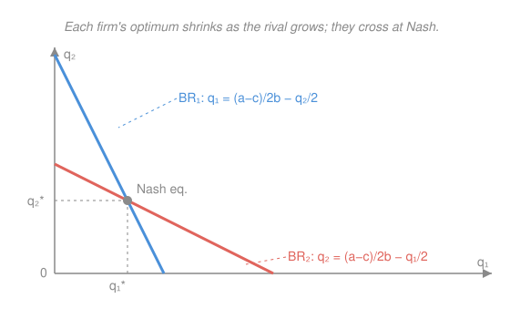

# Game Theory · Lesson 1.4: Strategic market models

> ⏱ ~15 min · Module 1: Static games of complete information · Builds on: [1.2 Nash equilibrium](01-02-nash-equilibrium.md), [`micro-refresher` 4.3](../../micro-refresher/lessons/04-03-oligopoly.md) · Unlocks: Module 2 (dynamic games)

## Why this matters

So far every game has been a finite table you could solve by scanning cells. But the games that actually run the economy — how much oil to pump, what price to post, how many cows to graze on the common — have a *continuum* of moves. You can't tabulate them; you differentiate. This lesson is where Nash equilibrium stops being a matrix exercise and becomes the working tool of industrial organization and environmental economics. The method — intersect best-response *functions* obtained from first-order conditions — is the same one that later powers Bayesian games and auctions. And the recurring moral is a welfare one: the equilibrium of self-interested play is almost always Pareto-*worse* than what the players could jointly achieve. `micro-refresher` [4.3](../../micro-refresher/lessons/04-03-oligopoly.md) met Cournot heuristically; here the equilibrium concept is made explicit and pushed to its edges.

## The idea

When strategies are numbers on a line, a "best response" is no longer one cell — it's a **function**. Firm $i$ looks at everyone else's choices $q_{-i}$, and for each possible $q_{-i}$ has an optimal reply $BR_i(q_{-i})$. A Nash equilibrium is a profile where every firm's number is simultaneously a best reply to the others: geometrically, the point where all the best-response curves cross. Finding it is calculus, not search — take each player's first-order condition, and solve the resulting system.

Three markets, one method, three lessons:

- **Cournot** (firms choose *quantities*): best responses slope gently downward — the more you make, the less I should. They cross once, at an outcome *between* monopoly and competition. Add firms and the crossing point marches toward the competitive price.
- **Bertrand** (firms choose *prices*): the logic of undercutting is so sharp that *two* firms already drive price to marginal cost. Same market power on paper, a completely different world — the strategic variable matters more than the number of firms.
- **The commons** (herders choose how much to *extract*): each ignores the damage he does to everyone else's yield, so all overuse the resource. The equilibrium is Pareto-dominated by cooperation — it is the **Prisoner's Dilemma with $n$ players and a dial**.

## The formal version

**Continuous games and best-response functions.** A firm's payoff $\pi_i(q_i, q_{-i})$ is now differentiable in its own action $q_i \in [0,\infty)$. Its best response solves $\max_{q_i}\pi_i$, so (for an interior optimum) it satisfies the first-order condition $\partial \pi_i/\partial q_i = 0$; solving that for $q_i$ gives the function $q_i = BR_i(q_{-i})$. In words: *set your own marginal payoff to zero, treating rivals as fixed, and read off your optimum as a function of theirs.* A **Nash equilibrium** is a profile $(q_1^*,\dots,q_n^*)$ with $q_i^* = BR_i(q_{-i}^*)$ for every $i$ — a simultaneous solution of all $n$ first-order conditions. (Check the second-order condition $\partial^2\pi_i/\partial q_i^2 < 0$ to confirm each is a max, not a min.)

**Cournot, $n$ symmetric firms.** Inverse demand $p = a - bQ$ with $Q = \sum_j q_j$, constant marginal cost $c$, and $a > c \ge 0$, $b > 0$. Firm $i$'s profit is $\pi_i = \big(a - bQ - c\big)q_i$. Its FOC,

$$\frac{\partial \pi_i}{\partial q_i} = a - bQ - bq_i - c = 0,$$

imposed symmetrically ($q_j = q^*$, $Q = nq^*$) gives

$$\boxed{q_i^* = \frac{a-c}{(n+1)b}}, \qquad Q^* = \frac{n(a-c)}{(n+1)b}, \qquad p^* = \frac{a + nc}{n+1}.$$

In words: *each firm shades the monopoly output because it internalizes only its own slice of the price drop.* As $n\to\infty$, $p^* \to c$ and $Q^* \to (a-c)/b$ — Cournot **converges to perfect competition**. ($n=1$ recovers monopoly; $n=2$ recovers the duopoly $q_i^* = (a-c)/3b$.)

**Bertrand paradox.** Two firms post prices; all buyers go to the cheaper, splitting on a tie. With equal marginal cost $c$, the *unique* Nash equilibrium is $p_1 = p_2 = c$. In words: *any price above cost invites an $\varepsilon$-undercut that steals the whole market, so the only stable prices are cost itself* — two firms suffice for the competitive outcome. The paradox breaks (positive markups return) when goods are **differentiated** or **capacity** is limited, so the winner can't actually serve everyone.

**Tragedy of the commons.** $n$ herders each choose grazing $g_i \ge 0$; total $G = \sum_j g_j$; the value per animal $v(G)$ falls as the common gets crowded ($v' < 0$); each animal costs $c$. Herder $i$'s payoff is $\pi_i = g_i\,v(G) - c\,g_i$. The FOC is

$$v(G) + g_i\,v'(G) - c = 0.$$

Each herder counts the congestion he inflicts on his *own* $g_i$ animals ($g_i v'$) but ignores the harm to everyone else's. A social planner maximizing total surplus $G\,v(G) - cG$ instead sets $v(G) + G\,v'(G) - c = 0$ — weighing the full $G v'$. Because $v' < 0$ and $g_i = G/n < G$, the private FOC understates the marginal damage, so the equilibrium **over-extracts**: $G^{\text{NE}} > G^{\text{opt}}$. The gap is the externality made quantitative (Problem 3).

## Picture

Axes are the two firms' outputs. $BR_1$ (blue) gives firm 1's optimal $q_1$ for each $q_2$; $BR_2$ (red) does the reverse. Each slopes down with slope $-\tfrac12$ in its own variable — a rival unit crowds out half a unit of mine. They meet exactly once, at the symmetric pair $q_1^* = q_2^* = (a-c)/3b$: the only profile where *both* firms are best-responding at the same time. Cartel (joint-profit) output lies *off* both lines — which is exactly why a cartel is unstable.

## Worked examples

**Example 1 (mechanical — best responses to a Nash point).** Duopoly with $p = 12 - Q$, $c = 0$. FOC for firm 1: $12 - 2q_1 - q_2 = 0 \Rightarrow BR_1(q_2) = 6 - q_2/2$; symmetrically $BR_2(q_1) = 6 - q_1/2$. Solve the pair: substitute, $q_1 = 6 - \tfrac12(6 - q_1/2) = 3 + q_1/4 \Rightarrow q_1^* = 4$, hence $q_2^* = 4$. Check against the formula $q_i^* = (a-c)/3b = 12/3 = 4$ ✓. Price $p^* = 12 - 8 = 4$, profit $4\cdot 4 = 16$ each.

**Example 2 (why you'd care — the commons dissipates the rent).** Take $v(G) = a - G$ (so $b=1$), cost $c$, with $a > c$. Herder $i$'s payoff is $g_i(a - G) - c g_i$; the FOC $a - G - g_i - c = 0$ under symmetry ($G = ng_i$) gives $g_i^{\text{NE}} = (a-c)/(n+1)$ and $G^{\text{NE}} = n(a-c)/(n+1)$ — *the very same algebra as $n$-firm Cournot*. The planner maximizes $G(a-G) - cG$, FOC $a - 2G - c = 0 \Rightarrow G^{\text{opt}} = (a-c)/2$. For any $n \ge 2$, $\tfrac{n}{n+1} > \tfrac12$, so the herd is too big; as $n\to\infty$, $G^{\text{NE}} \to a - c = 2\,G^{\text{opt}}$ — double the efficient herd, and the per-animal surplus $v - c \to 0$: the common's rent is fully **dissipated**. The over-grazing *is* an $n$-player Prisoner's Dilemma.

## Watch out

- **You might think** more firms always help consumers gradually, but the strategic variable jumps the outcome. Under Cournot the price glides down as $n$ grows; under Bertrand it *snaps* to $c$ at $n = 2$. Diagnose the mode of competition before counting heads.
- **You might think** the Nash equilibrium maximizes the firms' joint profit. It maximizes each firm's profit *given the others* — the joint optimum (cartel) sits off every best-response curve, and each partner's best response is to cheat toward it. Equilibrium is individual, not collective, optimality.
- **You might think** the commons is inefficient because herders are short-sighted. They are perfectly rational; the flaw is structural — each optimizes over his own $g_i$ share of the damage, not the whole $G$. Rationality plus an uncounted externality is enough; no myopia required.

## One-liner

> With a continuum of moves you find Nash by crossing best-response functions, not scanning a matrix — and the crossing point is almost always something all players would jointly pay to escape.

## Problems

**P1 (🟢)** Inverse demand $p = a - bQ$, $Q = q_1 + q_2$, both firms with constant marginal cost $c$ ($a > c$), Cournot. Derive each firm's best-response function from its FOC, solve for the symmetric equilibrium quantity, and confirm it equals $(a-c)/3b$. Give the equilibrium price.

**P2 (🟡)** *Bertrand paradox.* Two firms, a homogeneous good, common constant marginal cost $c$; buyers all buy from the cheaper firm and split evenly on a tie. Prove that $p_1 = p_2 = c$ is a Nash equilibrium, and that it is the *only* one — rule out every profile with $\min(p_1,p_2) \ne c$ by exhibiting a profitable deviation.

**P3 (🔴)** *Tragedy of the commons.* $n$ herders choose $g_i \ge 0$; total $G = \sum_j g_j$; value per animal $v(G)$ with $v' < 0$, $v'' \le 0$; cost $c$ per animal. (a) Write herder $i$'s FOC and the planner's FOC for $\max_G\, [G v(G) - cG]$, and explain the one-term difference. (b) With the linear value $v(G) = a - G$ ($a > c$), find the symmetric NE grazing $g_i^{\text{NE}}$, total $G^{\text{NE}}$, and the efficient total $G^{\text{opt}}$; show $G^{\text{NE}} > G^{\text{opt}}$ for $n \ge 2$ and compute the wedge $G^{\text{NE}} - G^{\text{opt}}$. What does it approach as $n\to\infty$?

Solutions

**P1** Firm 1 maximizes $\pi_1 = \big(a - b(q_1+q_2) - c\big)q_1$. FOC:

$$\frac{\partial \pi_1}{\partial q_1} = a - 2bq_1 - bq_2 - c = 0 \;\Longrightarrow\; BR_1(q_2) = \frac{a-c}{2b} - \frac{q_2}{2},$$

and symmetrically $BR_2(q_1) = \tfrac{a-c}{2b} - \tfrac{q_1}{2}$. (SOC $= -2b < 0$, a genuine max.) Impose $q_1^* = q_2^* = q^*$:

$$q^* = \frac{a-c}{2b} - \frac{q^*}{2} \;\Longrightarrow\; \frac32 q^* = \frac{a-c}{2b} \;\Longrightarrow\; q_i^* = \frac{a-c}{3b}.$$

Total $Q^* = \tfrac{2(a-c)}{3b}$, price $p^* = a - bQ^* = \tfrac{a+2c}{3}$.

*Check:* feed $q_i^*$ back into $BR_1$: $\tfrac{a-c}{2b} - \tfrac12\cdot\tfrac{a-c}{3b} = \tfrac{3(a-c) - (a-c)}{6b} = \tfrac{a-c}{3b} = q_i^*$ ✓, and $p^* - c = \tfrac{a-c}{3} > 0$ ✓ (price above cost, as market power requires).

**P2** *It is an equilibrium.* At $p_1 = p_2 = c$ each firm sells $D(c)/2$ at margin $0$, so profit is $0$. Raising your price → you sell nothing, still $0$. Cutting your price → $p < c$, you take the whole market at a *negative* margin, profit $< 0$. No deviation helps, so $(c,c)$ is a Nash equilibrium.

*It is unique.* Take any profile and let $p_{\min} = \min(p_1, p_2)$; WLOG $p_1 \le p_2$.

- *If $p_{\min} < c$:* the firm(s) posting the lowest price either make positive sales at a loss (margin $< 0$) or zero sales; whichever firm is at $p_{\min}$ with sales strictly prefers to deviate up to $c$ and earn $0 > $ its loss. Not an equilibrium.
- *If $p_{\min} > c$ and $p_1 < p_2$:* firm 1 takes the whole market at positive margin; firm 2 earns $0$ and can deviate to $p_1 - \varepsilon > c$ (small $\varepsilon$), capturing the whole market at a positive margin — profitable. Not an equilibrium.
- *If $p_{\min} > c$ and $p_1 = p_2 = p > c$:* each earns $(p-c)D(p)/2$. Deviating to $p - \varepsilon$ makes you strictly cheapest, so you get $(p - \varepsilon - c)D(p-\varepsilon)$, which for small $\varepsilon$ is $\approx (p-c)D(p)$ — nearly *double* your share. Profitable. Not an equilibrium.
- *If $p_1 = c < p_2$:* firm 1 wins the market at margin $0$, profit $0$, but could raise to any $p_1' \in (c, p_2)$, stay cheapest, and earn a positive margin — profitable. Not an equilibrium.

Every profile with $\min(p_1,p_2)\ne c$ (and the mixed remaining case $p_1=c<p_2$) admits a profitable deviation, so $p_1 = p_2 = c$ is the *unique* Nash equilibrium.

*Check:* the argument used only $a > c$-style positivity of demand and $v$-free reasoning; the equilibrium markup is $p^* - c = 0$, precisely the competitive outcome from just two firms — the paradox ✓. (Note the classic subtlety: for $p > c$ no firm has a well-defined *best* response, since there is no smallest $\varepsilon$; but that only reinforces that no such profile can be an equilibrium.)

**P3** (a) Herder $i$ maximizes $\pi_i = g_i v(G) - c g_i$ with $G = g_i + G_{-i}$, taking $G_{-i}$ fixed:

$$\frac{\partial \pi_i}{\partial g_i} = v(G) + g_i v'(G) - c = 0.$$

The planner maximizes $W(G) = G v(G) - cG$:

$$W'(G) = v(G) + G v'(G) - c = 0.$$

The two differ only in the coefficient on $v'(G)$: the herder weighs $g_i$ (his own animals' congestion), the planner weighs $G$ (everyone's). Since $v' < 0$ and $g_i = G/n < G$, the private marginal-value curve lies *above* the social one — each herder perceives too small a cost of adding animals, so the equilibrium herd is too large. (SOC: $\partial^2\pi_i/\partial g_i^2 = 2v' + g_i v'' < 0$ ✓; $W'' = 2v' + Gv'' < 0$ ✓.)

(b) With $v(G) = a - G$, so $v' = -1$. Herder $i$: payoff $g_i(a - G) - cg_i$, FOC $a - G - g_i - c = 0$. Symmetric $G = n g_i$:

$$a - (n+1)g_i - c = 0 \;\Longrightarrow\; g_i^{\text{NE}} = \frac{a-c}{n+1}, \qquad G^{\text{NE}} = \frac{n(a-c)}{n+1}.$$

Planner: $W(G) = G(a - G) - cG$, FOC $a - 2G - c = 0 \Rightarrow G^{\text{opt}} = \tfrac{a-c}{2}$. Since $\tfrac{n}{n+1} > \tfrac12 \iff 2n > n+1 \iff n > 1$, we have $G^{\text{NE}} > G^{\text{opt}}$ for all $n \ge 2$. Wedge:

$$G^{\text{NE}} - G^{\text{opt}} = (a-c)\!\left(\frac{n}{n+1} - \frac12\right) = (a-c)\cdot\frac{2n - (n+1)}{2(n+1)} = \frac{(a-c)(n-1)}{2(n+1)}.$$

As $n\to\infty$ the wedge $\to \tfrac{a-c}{2} = G^{\text{opt}}$: the equilibrium herd approaches $a - c = 2G^{\text{opt}}$, *twice* the efficient level.

*Check:* at $n=1$ (single owner) the wedge is $0$ — a sole herder is the planner, no externality ✓. At $G^{\text{NE}} \to a-c$ the value per animal is $v = a - (a-c) = c$, so margin $v - c \to 0$: the entire rent is competed away, the Cournot $n\to\infty$ story in ecological dress ✓.

## Flashback

**From Lesson 1.3 (Mixed strategies):** A couple picks an evening out. Both prefer being *together*, but disagree on where. Player 1 (row) and Player 2 (column) each choose Opera (O) or Football (F):

|        | O (col) | F (col) |
|--------|---------|---------|
| **O**  | 3, 1    | 0, 0    |
| **F**  | 0, 0    | 1, 2    |

Find the mixed-strategy Nash equilibrium (each player's probability on O) using the indifference principle, and the resulting expected payoffs.

Solution

Let player 1 play O with probability $p$ and player 2 play O with probability $q$. In a mixed equilibrium each player must be *indifferent* between the pure strategies they mix over — otherwise they'd shift all weight to the better one.

**Player 2's indifference** (fixing player 1's $p$): choosing O yields $1\cdot p + 0\cdot(1-p) = p$; choosing F yields $0\cdot p + 2\cdot(1-p) = 2(1-p)$. Equate:

$$p = 2(1-p) \;\Longrightarrow\; 3p = 2 \;\Longrightarrow\; p = \tfrac23.$$

**Player 1's indifference** (fixing player 2's $q$): choosing O yields $3q + 0 = 3q$; choosing F yields $0 + 1\cdot(1-q) = 1-q$. Equate:

$$3q = 1 - q \;\Longrightarrow\; 4q = 1 \;\Longrightarrow\; q = \tfrac14.$$

So the mixed NE is: player 1 plays O with probability $\tfrac23$, player 2 plays O with probability $\tfrac14$. Expected payoffs: player 1 gets $3q = \tfrac34$; player 2 gets $p = \tfrac23$.

*Check:* player 1's two payoffs match — $3q = \tfrac34$ and $1 - q = \tfrac34$ ✓ — so mixing is indeed optimal; likewise $p = 2(1-p) = \tfrac23$ for player 2 ✓. Note each player's *own* mixing probability is pinned by the *other's* payoffs — the hallmark of the indifference principle. (Both pure profiles $(O,O)$ and $(F,F)$ are also equilibria; this is the third, and the least efficient.)

## Connections

- **Backward:** this is [1.2](01-02-nash-equilibrium.md)'s "mutual best response" carried to a continuum — the best-response *correspondence* becomes a differentiable *function*, and the intersection is found by calculus instead of inspection. The commons and cartel instability are the [1.1](01-01-normal-form-dominance.md) Prisoner's Dilemma with $n$ players and continuous actions.
- **Forward:** Cournot with sequential timing is *Stackelberg* — solved by backward induction in [2.2](02-02-subgame-perfection-commitment.md), where committing to more output first is worth real profit. Whether the commons/cartel can escape its bad equilibrium through repetition is the [2.3](02-03-repeated-games-folk-theorem.md) Folk Theorem. The $n$-firm limit here is half of **Boss Problem 1**.
- **Sideways (micro):** this is the game-theoretic core of `micro-refresher` [4.3](../../micro-refresher/lessons/04-03-oligopoly.md) — there Nash was introduced heuristically as "the reaction curves cross"; here it is the explicit equilibrium concept, with Bertrand's uniqueness proved and the commons' welfare wedge quantified. The efficiency gap is the same externality the welfare theorems diagnose in general equilibrium.
