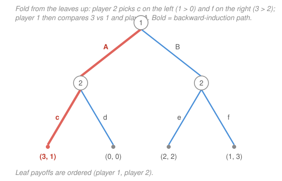

# Game Theory · Lesson 2.1: Extensive form and backward induction

> ⏱ ~15 min · Module 2: Dynamic games of complete information · Builds on: [1.2 Nash equilibrium](01-02-nash-equilibrium.md) · Unlocks: 2.2 (subgame perfection)

## Why this matters

Module 1 froze time: everyone moved at once, and a strategy was just a single choice. But most of economics is *sequential* — an entrant decides before the incumbent retaliates, a leader sets quantity before rivals react, a central bank announces before wages are set. Timing is not a cosmetic detail; it manufactures power. The player who moves first can shape what the second player rationally does, and the player who moves second can hold a *threat* over the first. To reason about any of this you need a representation that records *who knows what, when* — the **extensive form** — and an algorithm that respects the arrow of time — **backward induction**. This lesson also plants the seed that flowers in [2.2](02-02-subgame-perfection-commitment.md): once games have branches, the Nash concept from [1.2](01-02-nash-equilibrium.md) starts blessing predictions that no rational player would actually follow through on.

## The idea

Draw the game as a tree. Start at a root, branch at each moment someone chooses, and hang the payoffs off the leaves. Reading the tree top-down is reading the game *forward in time*: first this player moves, then that one, then payoffs land.

The trick is to solve it *backward*. Nobody at an early node can decide well without knowing what happens later — but the *last* mover faces no such uncertainty, because nothing follows them. So solve the last movers first: at each final decision, pick the action that's best for whoever moves there. Now those nodes have known values; replace each with its payoff and the tree is one layer shorter. Repeat. Rolling up from the leaves, you fold the whole game into a single predicted path. This is **backward induction**, and it is nothing but the sequential version of "assume everyone downstream is rational."

One subtlety makes dynamic games trickier than they look. A **strategy** here is not a move — it is a *complete contingent plan*: it must specify what you'd do at **every** decision point that could ever be yours, including points that your own earlier choices guarantee you'll never reach. "If we get to node 3, I play *d*" is part of your plan even in a world where you plan to end the game at node 1. This bookkeeping — a full plan, off-path branches included — is exactly what lets threats and promises exist, and it is why a small tree hides many more strategies than it has leaves.

## The formal version

An **extensive-form game** (of perfect information, for now) is a rooted tree with:

- **Decision nodes**, each labeled with the single player $\iota(x)$ who moves there, and a set of **actions** $A(x)$ — the outgoing branches.
- **Terminal nodes** (leaves), each carrying a payoff vector $(u_1,\dots,u_n)$.
- **Information sets** that partition each player's decision nodes. An information set $h$ groups nodes the mover *cannot tell apart* when choosing; every node in $h$ must offer the same action set $A(h)$.

**Perfect information** means every information set is a **singleton** — whenever you move, you know exactly which node you're at (you've observed everything so far). Simultaneous moves, by contrast, get modeled as a *non-singleton* information set: the second mover has a node for each thing the first could have done but can't distinguish them. This lesson stays in the perfect-information (singleton) world; the general case is [2.2](02-02-subgame-perfection-commitment.md)'s job.

**Strategy.** A pure strategy for player $i$ is a function

$$s_i : \{\text{$i$'s information sets}\} \to \text{actions}, \qquad s_i(h) \in A(h) \text{ for every } h,$$

assigning an action to *each* of $i$'s information sets. In words: a strategy is a fully specified contingency plan — an instruction for every situation that could arise, even the ones your plan avoids. The count follows immediately:

$$\#\{\text{pure strategies of } i\} \;=\; \prod_{h \,\in\, i\text{'s info sets}} |A(h)|.$$

Because this is a *product over all* $i$'s nodes, the number of strategies (and of profiles) typically **exceeds the number of terminal nodes** — many distinct plans lead to the same leaf, differing only in off-path branches.

**Backward induction.** In a finite tree, process nodes from the leaves up. At a node $x$ where $\iota(x) = i$, assume each child already carries the payoff of its solved subtree; $i$ picks the action maximizing $u_i$ among the children, and $x$ inherits that child's payoff vector. The path traced by these choices is the **backward-induction outcome**.

**Zermelo / Kuhn's theorem.** Every finite perfect-information game has a backward-induction solution, and it is a Nash equilibrium. In words: rolling back always works and never contradicts mutual best response. If, moreover, no player is ever indifferent between two distinct terminal payoffs (no ties), each fold-back choice is unique, so the outcome is **unique**. (This is the theorem behind "chess has a determined value.")

## Picture

Player 1 moves at the root ($A$ or $B$). Player 2 then moves at a *separate, known* node in each branch — after $A$ choosing $c$/$d$, after $B$ choosing $e$/$f$ — so this is perfect information (both of Player 2's information sets are singletons). Fold from the leaves: after $A$, Player 2 compares $1$ vs $0$ and plays $c$; after $B$, compares $3$ vs $2$ and plays $f$. Player 1, foreseeing $A \to (3,1)$ and $B \to (1,3)$, compares its own $3$ vs $1$ and plays $A$. Backward-induction outcome: **$(A, c)$ with payoff $(3,1)$**, the bold path.

## Worked examples

**Example 1 (mechanical — folding the tree).** Solve the game in the Picture. Work strictly bottom-up, one layer at a time.

- *Player 2, left node (after $A$).* Actions $c \to (3,1)$, $d \to (0,0)$. Player 2 keeps *its own* coordinate: $1 > 0$, so play $c$; the node is worth $(3,1)$.
- *Player 2, right node (after $B$).* $e \to (2,2)$, $f \to (1,3)$: $3 > 2$, so play $f$; the node is worth $(1,3)$.
- *Player 1, root.* Now $A$ leads to $(3,1)$ and $B$ to $(1,3)$. Player 1 compares its coordinate: $3 > 1$, so play $A$.

Backward-induction profile: Player 1 plays $A$; Player 2 plays $\big(c \text{ after } A,\ f \text{ after } B\big)$. Outcome $(3,1)$. Note we specified Player 2's move after $B$ *even though $B$ is never reached* — that off-path instruction is part of the strategy, and in the next example it turns out to matter.

**Example 2 (why you'd care — the same tree, flattened to normal form).** Every extensive game has a normal form: list each player's full strategy set and tabulate payoffs. Player 1 has two strategies, $\{A, B\}$. Player 2 has *two* information sets with two actions each, so $2 \times 2 = 4$ strategies, written as ordered pairs (action after $A$, action after $B$): $ce,\, cf,\, de,\, df$. That's $2 \times 4 = 8$ strategy profiles for a tree with only **4** leaves — the strategy count outruns the outcome count, exactly as the product formula warned.

| P1 \ P2 | $ce$ | $cf$ | $de$ | $df$ |
|---|---|---|---|---|
| **$A$** | $3,1$ | $3,1$ | $0,0$ | $0,0$ |
| **$B$** | $2,2$ | $1,3$ | $2,2$ | $1,3$ |

Run the best-response method from [1.2](01-02-nash-equilibrium.md). Player 1's best response is $A$ against $ce,cf$ (payoff $3$) and $B$ against $de,df$. Player 2's best response is $\{ce,cf\}$ against $A$ (payoff $1$) and $\{cf,df\}$ against $B$ (payoff $3$). Intersecting, the pure Nash equilibria are

$$(A,\,ce),\qquad (A,\,cf),\qquad (B,\,df).$$

Three Nash equilibria — but backward induction singled out just **one**, $(A, cf)$. What are the impostors? $(A, ce)$ gets the right *path* but prescribes $e$ after $B$, which is suboptimal there ($2 < 3$); its off-path plan is irrational. Worse, $(B, df)$ gives a completely different outcome, $(1,3)$: it is held up by Player 2's plan to play $d$ after $A$. But $d$ yields Player 2 only $0$ versus $c$'s $1$ — Player 2 would never actually do it. The "threat" $d$ deters Player 1 from $A$ only because Player 1 is never supposed to test it. This is a **non-credible threat**, and Nash swallows it whole. Backward induction spat it out. Ruling out exactly these off-path bluffs — turning "rational at every node" into a formal equilibrium refinement — is the entire mission of [2.2](02-02-subgame-perfection-commitment.md).

## Watch out

- You might think a strategy is a *move*. It is a *plan*: one action at **every** information set, off-path ones included. Two plans that reach the same leaf but differ on an unreached branch are genuinely different strategies — that is why an 8-profile tree can have only 4 leaves, and why threats can be written down at all.
- You might think every Nash equilibrium of the tree is a sensible prediction. Example 2 shows three Nash equilibria where rolling back gives one; the extras survive only by scripting irrational off-path play. Backward induction $\subsetneq$ Nash, and the gap is [2.2](02-02-subgame-perfection-commitment.md).
- You might think backward induction needs no caveats. It gives a *unique* outcome only when no player is ever indifferent between two terminal payoffs; a tie means a fold-back step has two winners and the outcome can branch. And it requires **perfect information** — with a genuine simultaneous-move pocket (a non-singleton information set) you cannot fold that pocket node-by-node, and must upgrade to subgame perfection.

## One-liner

> A strategy is a plan for every branch you might reach, even the ones you won't; solve the tree by folding rational play from the leaves up — and watch Nash quietly keep threats that folding throws away.

## Problems

**P1 (🟢)** An **Entrant** decides whether to enter a market (In / Out). If Out, the game ends with payoffs $(0, 4)$ (entrant, incumbent). If In, the **Incumbent** chooses Fight or Accommodate: Fight $\to (-1, 1)$, Accommodate $\to (2, 2)$. Solve by backward induction: state each player's action, the induced path, and the payoffs. In one sentence, say why the incumbent cannot get its preferred $(0,4)$.

**P2 (🟡)** A three-move tree. Player 1 at the root chooses **Out** $\to (2,2)$ or **In**. After In, Player 2 chooses **L** or **R**, with $R \to (1,3)$. After In-then-L, Player 1 moves again: **u** $\to (0,0)$ or **d** $\to (3,1)$. (Payoffs are (Player 1, Player 2).)
(a) Player 1 has two information sets. Enumerate Player 1's *full* strategy set and confirm it has more members than the tree has terminal nodes distinguishable by Player 1 alone. (b) Give the backward-induction strategy profile and the outcome. (c) Which of Player 1's four strategies are outcome-equivalent, and why does that not make them the *same* strategy?

**P3 (🔴) — Centipede.** Two players alternate. At each node the mover may **Take** (ending the game) or **Pass** (handing the move over and growing the pot). Payoffs $(u_1, u_2)$:
- Node 1 (P1): Take $\to (2,0)$, else Pass to node 2.
- Node 2 (P2): Take $\to (1,3)$, else Pass to node 3.
- Node 3 (P1): Take $\to (4,2)$, else Pass to node 4.
- Node 4 (P2): Take $\to (3,6)$, else Pass $\to (5,5)$.

Solve by backward induction, showing every fold. State the outcome, and explain in two sentences why it is jarring — and what feature of the payoffs drives the unraveling.

Solutions

**P1.** Fold from the leaf. *Incumbent (after In):* Accommodate gives $2$, Fight gives $1$; since $2 > 1$, the incumbent **Accommodates**, so the In-node is worth $(2,2)$. *Entrant (root):* In leads to $2$, Out gives $0$; since $2 > 0$, the entrant plays **In**. Backward-induction profile: (In, Accommodate); path In $\to$ Accommodate; payoffs $(2,2)$. The incumbent would love the monopoly payoff $4$ from Out, but it cannot *make* the entrant choose Out: the only lever it has is the threat to Fight, and Fight ($1$) is worse for the incumbent than Accommodate ($2$) once entry has happened — a non-credible threat the entrant ignores.

*Check:* at the incumbent's node $2 > 1$ ✓; at the entrant's node $2 > 0$ ✓; no player can improve by a unilateral switch on the path, so this is also a Nash equilibrium (Zermelo) ✓.

**P2.** (a) Player 1 moves at two information sets: the root $\{$Out, In$\}$ and the later node $\{$u, d$\}$ (reached only after In, L). A strategy fixes an action at *each*, so Player 1 has $2 \times 2 = 4$ strategies:

$$(\text{Out}, u),\quad (\text{Out}, d),\quad (\text{In}, u),\quad (\text{In}, d),$$

reading (root action; move at the u/d node). The tree has $4$ terminal nodes, but Player 1 alone controls the outcome only through the root plus the u/d node — and the two "Out" plans truncate the game at the same leaf $(2,2)$, so Player 1's four strategies induce only *three* distinct outcomes. More plans than outcomes: the extensive form's signature.

(b) Fold up. *Player 1 at the u/d node:* $d$ gives $3$, $u$ gives $0 \Rightarrow$ play **d**, node worth $(3,1)$. *Player 2 after In:* L now leads to $(3,1)$ so P2 gets $1$; R gives $3 \Rightarrow$ play **R**, node worth $(1,3)$. *Player 1 at root:* In leads to $(1,3)$ so P1 gets $1$; Out gives $2 \Rightarrow$ play **Out**. Backward-induction profile: Player 1 $= (\text{Out}, d)$, Player 2 $= \text{R}$; outcome **Out $\to (2,2)$**. Note the plan still specifies $d$ at a node the play never reaches.

(c) $(\text{Out}, u)$ and $(\text{Out}, d)$ are outcome-equivalent — both stop at the root with payoff $(2,2)$ regardless of the second component. They are still different *strategies* because they prescribe different actions at the u/d information set; that difference is invisible on the equilibrium path but becomes decisive if the game is ever perturbed to reach that node — and it is precisely such off-path stipulations that credibility arguments in [2.2](02-02-subgame-perfection-commitment.md) scrutinize.

*Check:* $3>0$, $3>1$, $2>1$ at the three folds ✓; $(\text{Out},d)$ paired with R survives any unilateral deviation (Player 1 to In earns $1<2$; Player 2's move is off-path and free), confirming a Nash equilibrium ✓.

**P3.** Fold from node 4 up, each mover keeping their own coordinate.
- *Node 4 (P2):* Take $6$ vs Pass $5$; $6 > 5 \Rightarrow$ **Take**, node worth $(3,6)$.
- *Node 3 (P1):* Take $4$ vs Pass (which leads to node 4's $(3,6)$, giving P1 $3$); $4 > 3 \Rightarrow$ **Take**, node worth $(4,2)$.
- *Node 2 (P2):* Take $3$ vs Pass (leads to $(4,2)$, giving P2 $2$); $3 > 2 \Rightarrow$ **Take**, node worth $(1,3)$.
- *Node 1 (P1):* Take $2$ vs Pass (leads to $(1,3)$, giving P1 $1$); $2 > 1 \Rightarrow$ **Take**.

Backward-induction outcome: **Player 1 Takes at node 1**, payoff $(2,0)$ — the game ends on the very first move. It is jarring because passing all the way to the end yields $(5,5)$, strictly better for *both* players than the $(2,0)$ they actually get; rationality throws away almost all the available surplus. The unraveling is driven by the fact that at *every* node the mover earns strictly more by taking now than by passing and letting the opponent take next ($2>1$, $3>2$, $4>3$, $6>5$): that single-step incentive, applied at the last node, propagates all the way back and collapses cooperation from the end.

*Check:* each fold uses a strict inequality, so the outcome is unique (no ties) ✓; total surplus rises along the pass-path ($2,4,6,9,10$) yet no player will pass, the exact tension the problem names ✓.

## Flashback

**From Lesson 1.2 (Nash equilibrium):** Two tech firms each pick a platform, $L$ or $R$. Payoffs $(u_1, u_2)$:

| | **L** | **R** |
|---|---|---|
| **T** | $2,\,1$ | $0,\,0$ |
| **B** | $0,\,0$ | $1,\,2$ |

Find every pure-strategy Nash equilibrium by the best-response method, and say what kind of game this is.

Solution

Mark best responses. *Row:* against $L$, $2 > 0 \Rightarrow$ T; against $R$, $0 < 1 \Rightarrow$ B. *Column:* against T, $1 > 0 \Rightarrow$ L; against B, $0 < 2 \Rightarrow$ R. Both marks coincide at $(T,L)$ and $(B,R)$: **two pure Nash equilibria**, $(T,L)$ with payoff $(2,1)$ and $(B,R)$ with payoff $(1,2)$. The off-diagonal cells carry no shared mark. This is a **coordination game with conflicting preferences** (Battle of the Sexes structure): both players prefer coordinating over mismatching, but Row favors the $(T,L)$ equilibrium while Column favors $(B,R)$.

*Check:* at $(T,L)$, Row switching to B drops $2 \to 0$ and Column switching to R drops $1 \to 0$ — no profitable unilateral deviation; symmetrically at $(B,R)$ ✓.

## Connections

- **Backward:** backward induction *is* the [1.2](01-02-nash-equilibrium.md) best-response logic run through time — at each node the mover best-responds to rational continuation — and Zermelo guarantees the result is a Nash equilibrium, so this refines rather than replaces Module 1. Example 2's normal-form table is literally the [1.1](01-01-normal-form-dominance.md) representation of a tree.
- **Forward:** [2.2](02-02-subgame-perfection-commitment.md) promotes backward induction to **subgame-perfect equilibrium**, formally deleting the non-credible-threat Nash equilibria that Example 2 exposed and extending the method to trees with simultaneous-move pockets; from there, commitment and Stackelberg leadership are the first-mover reasoning of this lesson weaponized. [2.3](02-03-repeated-games-folk-theorem.md) applies backward induction to *finitely* repeated games — where it unravels cooperation exactly as the centipede in P3 does.
- **Sideways (economics & CS):** the entry game (P1) is the skeleton of every predation and deterrence model; the centipede (P3) is the canonical stress test for whether real people reason by backward induction (experimentally, they cooperate far longer than the fold predicts); and Zermelo's theorem is the foundation of game-tree search in chess and Go engines.
