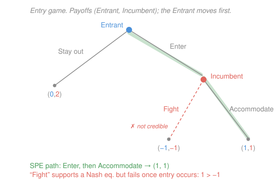

# Game Theory · Lesson 2.2: Subgame perfection and commitment

> ⏱ ~15 min · Module 2: Dynamic games of complete information · Builds on: [2.1 Extensive form and backward induction](02-01-extensive-form-backward-induction.md) · Unlocks: 2.3 (repeated games and the Folk Theorem)

## Why this matters

Nash equilibrium is too generous with dynamic games: it will happily bless a "if you do that, I'll blow us both up" threat that no rational player would ever carry out. Subgame perfection is the fix — it demands that every threat and promise be *credible*, i.e. optimal to execute when the moment actually arrives. Out of that single discipline falls the whole economics of commitment: why a first-mover can win by *tying its own hands*, why burning a bridge can be smart, and why two parties who both stand to gain from an investment can fail to make it (the hold-up problem). This is the lesson where "more options is always better" dies.

## The idea

Backward induction (from [2.1](02-01-extensive-form-backward-induction.md)) already told you the right answer in perfect-information trees: roll back from the leaves, at each node pick the move that's best *given* rational continuation. Subgame perfection is the same idea promoted to a definition that also works with simultaneous moves buried inside a tree.

The motivating failure: an incumbent monopolist tells a potential entrant "enter and I'll start a price war that ruins us both." If the entrant believes it, it stays out and the incumbent keeps the monopoly. This is a genuine *Nash* equilibrium — given "stay out," the incumbent never has to fight, so threatening costs nothing. But it's a **bluff**: the day entry actually happens, fighting is strictly worse for the incumbent than living and letting live. A rational entrant sees through it, enters anyway, and the incumbent accommodates. Subgame perfection is precisely the requirement that rules out the bluff — a strategy must be a best response *starting from every point in the tree*, including points that equilibrium play never reaches.

Once you internalize this, the surprising flip side appears: if a threat is only powerful when it's credible, then a player who can *make* an otherwise-empty threat credible — by removing their own escape route — gains real power. Committing to fewer choices can raise your payoff. That is the engine of first-mover advantage, and its failure to be available is the engine of the hold-up problem.

## The formal version

Fix an extensive-form game.

**Subgame.** A **subgame** is any node $x$ whose information set is a singleton (the player to move knows exactly where they are), together with everything that follows $x$ down the tree — and it must contain *whole* information sets, never slicing one in half. In words: a subgame is a self-contained game-within-the-game you could hand to a stranger and ask them to play from $x$ onward. The whole tree is a subgame of itself; in a perfect-information game *every* node starts a subgame.

**Subgame-perfect equilibrium (SPE).** A strategy profile $s = (s_1,\dots,s_n)$ is a **subgame-perfect equilibrium** if its restriction to every subgame is a Nash equilibrium *of that subgame*. In words: not only is $s$ a best response overall, it prescribes optimal play from every node — no reliance on threats you'd rather not execute. Formally, letting $s|_{G'}$ denote the profile restricted to subgame $G'$,

$$s \text{ is an SPE} \iff s|_{G'} \text{ is a Nash equilibrium of } G' \text{ for every subgame } G'.$$

**Equivalence (Kuhn).** In a finite game of perfect information, the set of SPE outcomes is exactly what backward induction produces; if no player is ever indifferent between two payoffs, the SPE is unique. In words: SPE *is* backward induction, generalized to handle simultaneous-move pockets.

**Why it bites.** Every SPE is a Nash equilibrium (the whole game is one of the subgames), but not conversely. The Nash equilibria that SPE discards are exactly those sustained by a **non-credible threat**: an action that is optimal to *announce* only because it sits off the equilibrium path and never has to be carried out.

## Picture

The Entrant moves first. If it enters, the Incumbent's *only* subgame is the choice Fight vs. Accommodate — and there, $1 > -1$, so Accommodate strictly wins. Subgame perfection forces the Incumbent to plan on accommodating; the Entrant, anticipating this, enters. The "Fight" threat props up a second Nash equilibrium (Stay out, Fight) that SPE correctly throws away.

## Worked examples

**Example 1 (the bluff, exposed).** Read the tree as a normal form. The Entrant chooses a row, the Incumbent a *full contingent plan* (what to do if entry occurs):

| Entrant \ Incumbent | Fight | Accommodate |
|---|---|---|
| **Enter** | $(-1,\,-1)$ | $(1,\,1)$ |
| **Stay out** | $(0,\,2)$ | $(0,\,2)$ |

Best responses give **two** pure Nash equilibria: $(\text{Enter},\text{Accommodate})$ — each is best-responding — and $(\text{Stay out},\text{Fight})$ — the Entrant prefers $0$ to $-1$ given Fight, and the Incumbent is indifferent ($2=2$) so Fight is a weak best response. Backward induction on the tree keeps only the first: in the entry subgame Accommodate strictly dominates Fight, so $(\text{Enter},\text{Accommodate})$ is the **unique SPE**. The equilibrium $(\text{Stay out},\text{Fight})$ survives Nash only because "Fight" never gets tested — a textbook non-credible threat.

**Example 2 (commitment turns the bluff real — Stackelberg).** Same two firms, now competing in quantities with inverse demand $P = 12 - Q$, $Q = q_1 + q_2$, zero cost. Under simultaneous **Cournot** (from [1.4](01-04-cournot-bertrand-applications.md)) each produces $q^\ast = 4$, price $P=4$, profit $16$ apiece.

Let firm 1 move *first* and firm 2 observe before choosing — a sequential game, solved as SPE by backward induction. Firm 2's subgame is a best response to whatever $q_1$ it sees:

$$\max_{q_2}\; q_2\,(12 - q_1 - q_2) \;\Rightarrow\; q_2 = \frac{12 - q_1}{2}.$$

Firm 1 folds this in:

$$\pi_1(q_1) = q_1\Big(12 - q_1 - \tfrac{12-q_1}{2}\Big) = q_1\cdot\frac{12 - q_1}{2}, \qquad \frac{d\pi_1}{dq_1} = \frac{12 - 2q_1}{2} = 0 \Rightarrow q_1 = 6.$$

Then $q_2 = 3$, $Q = 9$, $P = 3$: firm 1 earns $6\cdot 3 = 18 > 16$, firm 2 earns $3\cdot 3 = 9 < 16$. The leader gains purely by *committing* to overproduce. Note the paradox: if firm 1 could secretly revise after firm 2 moved, it would want to cut back toward $4$ — so the commitment has value *only because it can't be undone*. Moving first is what makes "I will flood the market" credible; simultaneity would make it an empty threat, exactly like Fight.

## Watch out

- You might think every Nash equilibrium is a reasonable prediction in a dynamic game. It isn't — Nash tests only unilateral deviations *on the equilibrium path* and lets off-path threats go unexamined. SPE tests every subgame, on-path or off.
- You might think "having more options can't hurt me." In strategic settings it routinely does: the ability to renege (revise your quantity, forgive a defector, re-bargain) is exactly what your opponent exploits. Credibly *destroying* an option — Schelling's burning bridges — is a move, and often a winning one.
- You might think a subgame can start anywhere. It can't start inside a non-singleton information set: if the player to move doesn't know which node they're at (simultaneous moves), those nodes don't head separate subgames — you analyze that pocket as one game. This is why SPE, not raw backward induction, is the general definition.

## One-liner

> Subgame perfection keeps only the threats you'd actually carry out — and once threats must be credible, tying your own hands becomes a weapon.

## Problems

**P1 (🟢)** Take the entry game of the Picture (payoffs in Example 1). (a) List every pure-strategy Nash equilibrium of the normal form, verifying each with best responses. (b) State the unique SPE and the path it induces. (c) Identify which Nash equilibrium survives *only* by a non-credible threat, and say precisely at which node credibility fails.

**P2 (🟡)** In the Stackelberg setup of Example 2 ($P = 12 - Q$, zero cost, firm 1 the leader), suppose firm 1 mistakenly commits to the *Cournot* quantity $q_1 = 4$ instead of its optimum. (a) What does firm 2 produce, and what are both profits? (b) Reconcile: firm 1's leader-optimal profit was $18$ and Cournot was $16$ — how can committing to the Cournot quantity leave firm 1 with a profit *between* those, and what does that say about the source of the first-mover gain?

**P3 (🔴) — Hold-up.** A buyer and a seller will trade one unit. First (period 1) the buyer sinks a relationship-specific investment $I \ge 0$ at cost $I$, raising the gross gains from trade to $v(I) = 2\sqrt{I}$ (worthless with any other partner). Then (period 2) they bargain and, by symmetry, split the realized surplus $v(I)$ fifty-fifty. Solve the game by backward induction. (a) Find the buyer's equilibrium investment $I_{HU}$ and the total surplus it produces. (b) Find the efficient investment $I^\ast$ that maximizes $v(I) - I$. (c) Show $I_{HU} < I^\ast$, explain *which* subgame's outcome causes the shortfall, and name a device that restores efficiency.

Solutions

**P1.** (a) Best responses. *Given Fight:* Entrant compares Enter $(-1)$ vs Stay out $(0)$ → Stay out; Incumbent, facing Stay out, gets $2$ from either action, so Fight is a (weak) best response. → $(\text{Stay out},\text{Fight})$ is a Nash equilibrium. *Given Accommodate:* Entrant compares Enter $(1)$ vs Stay out $(0)$ → Enter; Incumbent, facing Enter, compares Fight $(-1)$ vs Accommodate $(1)$ → Accommodate. → $(\text{Enter},\text{Accommodate})$ is a Nash equilibrium. Checking the remaining cells: $(\text{Enter},\text{Fight})$ fails (Incumbent deviates to Accommodate, $1>-1$); $(\text{Stay out},\text{Accommodate})$ fails (Entrant deviates to Enter, $1>0$). So exactly two pure NE.

(b) The only proper subgame besides the whole game begins at the Incumbent's node after Enter. There Accommodate ($1$) strictly beats Fight ($-1$), so any SPE plays Accommodate; the Entrant, anticipating payoff $1>0$, Enters. **Unique SPE: (Enter, Accommodate)**, inducing the path Enter → Accommodate with payoffs $(1,1)$.

(c) $(\text{Stay out},\text{Fight})$ survives Nash only by the threat "Fight." Credibility fails at the Incumbent's decision node *after entry*: were that node reached, Fight yields $-1$ against Accommodate's $+1$, so a rational Incumbent would never execute it. The threat is never tested on the equilibrium path, which is exactly why Nash tolerates it and SPE rejects it.

*Check:* both claimed profiles are mutual best responses (Nash ✓), and only the one whose off-path action is itself optimal survives subgame perfection ✓.

**P2.** (a) Firm 2 best-responds to $q_1 = 4$: $q_2 = (12 - 4)/2 = 4$. Then $Q = 8$, $P = 12 - 8 = 4$. Profits: firm 1 $= 4\cdot 4 = 16$, firm 2 $= 4\cdot 4 = 16$ — this is just the Cournot outcome, as it must be, since $(4,4)$ is the simultaneous fixed point.

(b) Committing to $q_1 = 4$ gives firm 1 the Cournot profit $16$, strictly below the leader-optimal $18$. There is no contradiction: the first-mover *advantage* is not commitment per se but commitment to the *right* quantity. Leadership is the ability to force firm 2 to react to your choice; that ability is only worth something if you exploit it by committing to the aggressive $q_1 = 6$, which pushes firm 2 down to $3$. Commit to a soft number and you throw the advantage away. (Committing to $q_1=6$: firm 1 earns $18$; committing to $q_1=4$: firm 1 earns $16$. The gap $18-16=2$ *is* the value of using the commitment well.)

*Check:* $(4,4)$ reproduces Cournot with $P=4$ and equal profits $16$ ✓; $16 < 18$, and the leader optimum solved in Example 2 was interior at $q_1=6$ ✓.

**P3.** Work backward.

*Period-2 subgame (I sunk).* The gross surplus $v(I)$ is on the table; the fifty-fifty split is the bargaining outcome, so each party receives $v(I)/2 = \tfrac{1}{2}\cdot 2\sqrt I = \sqrt I$. The sunk cost $I$ does not re-enter the split — it is gone — so it distorts nothing *here*; the split is a legitimate Nash outcome of the bargaining subgame.

*Period-1 (buyer chooses $I$).* The buyer anticipates receiving $\sqrt I$ and having paid $I$, so maximizes its net payoff

$$\max_{I\ge 0}\; \sqrt{I} - I, \qquad \frac{d}{dI}\big(\sqrt I - I\big) = \frac{1}{2\sqrt I} - 1 = 0 \;\Rightarrow\; \sqrt I = \tfrac12 \;\Rightarrow\; \boxed{I_{HU} = \tfrac14}.$$

(a) Total surplus at $I_{HU}=\tfrac14$: $v(I_{HU}) - I_{HU} = 2\sqrt{1/4} - \tfrac14 = 1 - \tfrac14 = \tfrac34$.

(b) Efficient level maximizes joint surplus $v(I) - I = 2\sqrt I - I$: $\frac{d}{dI}(2\sqrt I - I) = \frac{1}{\sqrt I} - 1 = 0 \Rightarrow \sqrt I = 1 \Rightarrow \boxed{I^\ast = 1}$, giving surplus $2 - 1 = 1$.

(c) $I_{HU} = \tfrac14 < 1 = I^\ast$: the buyer **underinvests**, and society loses $1 - \tfrac34 = \tfrac14$ of surplus. The distortion is born in the *period-2 subgame*: the buyer pays the full marginal cost of $I$ but the ex-post split hands half of every extra unit of value $v'(I)$ to the seller. Formally the buyer sets $\tfrac12 v'(I) = 1$, i.e. $v'(I) = 2$, whereas efficiency needs $v'(I) = 1$; with $v$ concave the higher required marginal product means a lower $I$. The seller's ability to *expropriate half the return ex post* — precisely because nothing was committed ex ante — kills the buyer's incentive. **Fix:** a long-term contract signed *before* the investment (price or quantity fixed in advance), or vertical integration / ownership that makes the buyer the residual claimant on $v'$ — any device that credibly commits the parties so the investor keeps its own marginal return. Commitment ex ante repairs what free bargaining ex post breaks.

*Check:* general split share $\beta$ gives $\beta v'(I)=1$, so $I=I^\ast$ iff $\beta=1$; any $\beta<1$ (here $\tfrac12$) yields underinvestment, matching $I_{HU}=\tfrac14<1$ ✓. Surpluses $\tfrac34 < 1$ confirm the efficiency loss ✓.

## Flashback

**From Lesson 2.1 (Extensive form and backward induction):** Player 1 moves first, choosing $A$ or $B$; then Player 2, observing the choice, moves. Terminal payoffs $(\text{Player 1},\text{Player 2})$ are:

- after $A$: choice $x \to (2,1)$, choice $y \to (0,0)$;
- after $B$: choice $z \to (1,3)$, choice $w \to (3,2)$.

Player 1 is tempted by the $(3,2)$ leaf reachable through $B$. Solve the game by backward induction: what does each player do, and what is the outcome?

Solution

Roll back from Player 2's two subgames.
- After $A$: Player 2 compares $x$ (payoff $1$) vs $y$ (payoff $0$) → plays $x$, outcome $(2,1)$.
- After $B$: Player 2 compares $z$ (payoff $3$) vs $w$ (payoff $2$) → plays $z$, outcome $(1,3)$.

Player 1 therefore faces $A \to 2$ versus $B \to 1$ and chooses $A$. **SPE: Player 1 plays $A$, Player 2 plays $x$ (and $z$ off-path); outcome $(2,1)$.** The $(3,2)$ leaf is a mirage — reaching it needs Player 2 to choose $w$, but $w$ gives Player 2 only $2 < 3$, so it is never played. Chasing an outcome that depends on your opponent acting against their own interest is the same non-credibility error the entry game punishes.

*Check:* each of Player 2's choices is optimal in its own subgame ($1>0$ and $3>2$), and Player 1's $A$ is optimal given that continuation ($2>1$) ✓.

## Connections

- **Backward:** SPE is [2.1](02-01-extensive-form-backward-induction.md)'s backward induction stated as an equilibrium refinement, so it survives the jump to simultaneous-move subgames; it prunes the Nash equilibria of [1.2](01-02-nash-equilibrium.md) down to the credible ones, and its Stackelberg application is the sequential twin of the Cournot model in [1.4](01-04-cournot-bertrand-applications.md).
- **Forward:** [2.3](02-03-repeated-games-folk-theorem.md) runs entirely on credibility — trigger strategies sustain cooperation only when the punishment they threaten is itself subgame-perfect, and the Folk Theorem is a catalogue of what credible punishments can enforce. Perfect Bayesian equilibrium ([3.3](03-03-signaling-pbe.md)) extends the same "sequential rationality" idea to games with hidden information.
- **Sideways (economics):** the hold-up problem is the microfoundation of incomplete-contract theory (Williamson; Grossman–Hart–Moore) and a standard argument for vertical integration — the same commitment logic reappears as the time-inconsistency of monetary policy (a central bank that *can* inflate ex post loses credibility ex ante) and as the value of dominant-strategy mechanisms in [4.2](04-02-mechanism-design.md).
