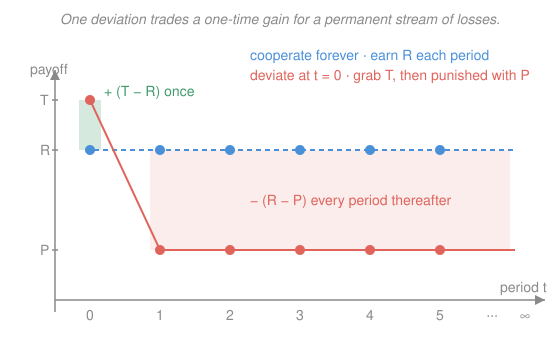

# Game Theory · Lesson 2.3: Repeated games and the Folk Theorem

> ⏱ ~15 min · Module 2: Dynamic games of complete information · Builds on: [2.2 Subgame perfection and commitment](02-02-subgame-perfection-commitment.md), [1.2 Nash equilibrium](01-02-nash-equilibrium.md) · Unlocks: Module 3 (incomplete information)

## Why this matters

The prisoner's dilemma is the canonical proof that rational players wreck a jointly good outcome: mutual defection is the unique equilibrium even though both would rather cooperate. Yet cartels hold, arms rivals keep the peace for decades, and colleagues do each other favors that never get repaid on the spot. The dissolving agent is **time**. When the same game recurs and players value the future, a defector trades a one-shot windfall for the collapse of an ongoing relationship — and if the future looms large enough, that trade is a loss. This lesson makes "the shadow of the future" a precise inequality on the discount factor, and then delivers the unsettling punchline (the Folk Theorem): once players are patient, cooperation is sustainable — but so is almost *any* outcome, so the theory predicts everything and therefore nothing sharp.

## The idea

Play the prisoner's dilemma once and defection is airtight: whatever the other does, defecting pays more *today*, and today is all there is. Now play it every period, forever, with both players caring about tomorrow. Cooperation can survive — not by changing anyone's preferences, but by *linking* periods with a strategy that makes today's choice carry future consequences.

The device is a **trigger**: "I cooperate as long as you have always cooperated; the first time you defect, I defect forever." Against this rule a defection buys you a one-time bonus (defect while the other still cooperates) but detonates the relationship — you both grind out the punishment payoff from then on. Whether to pull the trigger is a tug-of-war between a **finite gain now** and an **infinite stream of losses later**, discounted. Patience (a discount factor near 1) fattens the future and tips the balance toward cooperation. Impatience shrinks the future and cooperation falls apart.

Two structural facts frame this. **Finite** horizons kill cooperation entirely: the last period is an ordinary one-shot game, so both defect there; knowing that, the second-to-last period has nothing riding on it either, and the logic unravels backward to defection in *every* period. Only an **infinite** (or indefinite) horizon — no known last round to anchor the backward induction — lets the future discipline the present.

## The formal version

**Stage game and repeated game.** Fix a stage game $G$ (e.g. the prisoner's dilemma) with players $i$, actions, and payoffs $u_i$. The **infinitely repeated game** $G^\infty(\delta)$ plays $G$ in periods $t=0,1,2,\dots$; after each period every player observes what everyone did. A player's payoff is the **discounted sum** of stage payoffs,

$$U_i = \sum_{t=0}^{\infty} \delta^t\, u_i^{\,t}, \qquad \delta \in (0,1),$$

where $u_i^{\,t}$ is $i$'s stage payoff in period $t$ and $\delta$ is the **discount factor** (one dollar next period is worth $\delta$ now; equivalently $\delta = \tfrac{1}{1+r}$ for interest rate $r$). In words: value the whole future, but weight each period less the farther off it is. A *constant* stream of $x$ per period is worth $\sum_{t=0}^\infty \delta^t x = \frac{x}{1-\delta}$ — a geometric series (see [../../calc-refresher/lessons/03-01-series-convergence-tests.md](../../calc-refresher/lessons/03-01-series-convergence-tests.md)), convergent precisely because $|\delta|<1$.

**Finite horizon unravels.** If $G$ has a *unique* Nash equilibrium $a^\ast$ and is repeated a known finite number of times $T$, the *unique* subgame-perfect equilibrium is $a^\ast$ in every period. In words: with a fixed last round, backward induction (from [2.1](02-01-extensive-form-backward-induction.md)/[2.2](02-02-subgame-perfection-commitment.md)) forces the stage equilibrium at the end, which unwinds all the way to the start — no cooperation anywhere.

**Grim-trigger strategy.** In $G^\infty(\delta)$, the **grim trigger** prescribes: play the cooperative action $C$ in period $0$ and in every period so long as *all* players have played $C$ in every past period; if anyone ever deviates, play the stage-Nash action $D$ (the punishment) forever after. This profile is a **subgame-perfect equilibrium** iff no player can profit from a single deviation — and because the punishment phase is itself a Nash equilibrium of the stage game played forever, the threat is credible (subgame-perfect), not a bluff.

**The cooperation condition.** Write $\pi^{C}$ = per-period payoff under mutual cooperation, $\pi^{D}$ = the best one-shot payoff from deviating while the other still cooperates, and $\pi^{P}$ = the per-period punishment payoff ($\pi^{D} > \pi^{C} > \pi^{P}$). Cooperating forever pays $\frac{\pi^{C}}{1-\delta}$; deviating once pays $\pi^{D}$ today and $\pi^{P}$ forever after, i.e. $\pi^{D} + \frac{\delta\,\pi^{P}}{1-\delta}$. Grim trigger sustains cooperation iff

$$\frac{\pi^{C}}{1-\delta} \;\ge\; \pi^{D} + \frac{\delta\,\pi^{P}}{1-\delta} \quad\Longleftrightarrow\quad \delta \;\ge\; \delta^\ast \;=\; \frac{\pi^{D}-\pi^{C}}{\pi^{D}-\pi^{P}}.$$

In words: cooperation holds exactly when players are patient enough — the one-time temptation $\pi^{D}-\pi^{C}$ is outweighed by the discounted stream of lost cooperation $\pi^{C}-\pi^{P}$ you forfeit forever after. (Algebra: clear $1-\delta$, giving $\pi^{C} \ge (1-\delta)\pi^{D} + \delta\pi^{P}$, then solve for $\delta$.)

**Minmax value.** Player $i$'s **minmax payoff** is the lowest level the others can force on $i$ when $i$ best-responds:

$$\underline v_i \;=\; \min_{\sigma_{-i}}\ \max_{\sigma_i}\ u_i(\sigma_i,\sigma_{-i}).$$

In words: the worst the pack can do to you if you defend yourself optimally — a payoff you can always guarantee, so no equilibrium can ever pay you less. A profile $v$ is **feasible** if it lies in the convex hull of the stage game's payoff profiles (achievable by public randomization over action profiles), and **strictly individually rational** if $v_i > \underline v_i$ for every $i$.

**Folk Theorem (SPE version).** Let $v$ be any feasible, strictly individually rational payoff profile. Then there exists $\underline\delta < 1$ such that for every $\delta \in (\underline\delta, 1)$ the infinitely repeated game $G^\infty(\delta)$ has a subgame-perfect equilibrium whose per-period (average) payoffs are $v$. In words: **for patient players, essentially every payoff above the minmax floor is an equilibrium.** The simplest constructive version (Friedman): any feasible $v$ that strictly Pareto-dominates some *stage-game* Nash equilibrium is sustainable using that Nash equilibrium as the (automatically credible) punishment; the sharp version replacing the punishment with full minmax (Fudenberg–Maskin) reaches everything down to the minmax floor, under a mild full-dimensionality condition. The moral: repetition makes cooperation *possible*, not *inevitable* — "always defect" remains an equilibrium too, and so does a vast menu in between.

## Picture

The blue path is cooperation: earn $R$ every period. The red path defects at $t=0$: it spikes up to the temptation $T$ for a single period, then drops to the punishment $P$ forever. The one-time bump $+(T-R)$ is the whole prize; the permanent gap $-(R-P)$ below the cooperative line, summed and discounted, is what you pay for it. Patience ($\delta$ near 1) makes that discounted red tail huge, and cooperation wins.

## Worked examples

**Example 1 (the threshold, computed).** Prisoner's dilemma with stage payoffs $T=6$ (defect while other cooperates), $R=4$ (both cooperate), $P=2$ (both defect), $S=0$ (cooperate while other defects), $T>R>P>S$. The stage game's unique Nash equilibrium is $(D,D)$ paying $P=2$, so grim trigger punishes with $(D,D)$ forever. Here $\pi^{C}=R=4$, $\pi^{D}=T=6$, $\pi^{P}=P=2$. Cooperation survives iff

$$\frac{4}{1-\delta} \;\ge\; 6 + \frac{2\delta}{1-\delta} \;\Longrightarrow\; 4 \ge 6(1-\delta) + 2\delta \;\Longrightarrow\; 4 \ge 6 - 4\delta \;\Longrightarrow\; \delta \ge \tfrac{1}{2}.$$

Or straight from the formula: $\delta^\ast = \frac{T-R}{T-P} = \frac{6-4}{6-2} = \frac12$. So if the players value next period at least half as much as this one, the cartel holds; below that, it breaks. *Interpretation:* $\delta^\ast$ rises with the temptation $T-R$ and falls with the future stakes $R-P$ — greedier one-shot gains or feebler punishments demand more patience.

**Example 2 (the Folk Theorem's menu).** Same numbers. The minmax value here is $\underline v_i = 2$: the most an opponent can hold you to is by playing $D$, against which your best reply $D$ yields $2$ (playing $C$ would give $0$). So *any* feasible per-period profile with both payoffs above $2$ is an SPE outcome for $\delta$ near 1 — not just symmetric cooperation $(4,4)$, but lopsided deals like "alternate who plays the sucker" averaging, say, $(3,5)$, sustained by trigger strategies that revert to $(D,D)$ on any deviation. Cooperation is *one point* in a whole region the Folk Theorem certifies. That richness is the theorem's strength and its curse: it explains how cooperation *can* arise but refuses to single out *which* outcome will — sharper prediction needs extra structure (renegotiation-proofness, focal points, bounded memory).

## Watch out

- You might think a finitely repeated prisoner's dilemma allows *some* cooperation near the start "because the end is far away." It doesn't — with a known last period the backward-induction unravels to $(D,D)$ in *every* period, including the first. What rescues cooperation is genuine infinity or *uncertainty* about the end (a per-period continuation probability plays the exact role of $\delta$).
- You might think the punishment in a trigger strategy can be arbitrarily harsh. For the equilibrium to be *subgame-perfect* the punishment must itself be an equilibrium of the continuation game — grim trigger works because reverting to stage-Nash forever is credible. A threat to play something you'd rather not carry out is the non-credible bluff [2.2](02-02-subgame-perfection-commitment.md) already outlawed.
- You might read the Folk Theorem as "patience guarantees cooperation." It guarantees cooperation is *available*, alongside defection and a continuum of other outcomes. The theorem is an existence result about the equilibrium *set*, not a selection of what gets played.

## One-liner

> When the game never ends, cooperation is enforced not by goodwill but by the credible promise that betrayal ends the relationship — provided the future is discounted little enough to matter.

## Problems

**P1 (🟢)** Infinitely repeated prisoner's dilemma with stage payoffs $T=4$, $R=3$, $P=1$, $S=0$ (temptation / reward / punishment / sucker), players using grim trigger with $(D,D)$ punishment. (a) Write the payoff from cooperating forever and from deviating once, then derive the critical discount factor $\delta^\ast$ by comparing $\frac{R}{1-\delta}$ to $T + \frac{\delta P}{1-\delta}$. (b) Interpret: at $\delta = 0.4$, does cooperation hold? At $\delta = 0.9$?

**P2 (🟡)** Take the *same* prisoner's dilemma but repeated a known **finite** number of times $T=100$. Prove that the unique subgame-perfect equilibrium is $(D,D)$ in every one of the 100 periods. Pinpoint exactly why the last period pins the whole argument, and state what single change to the game's structure would let cooperation survive.

**P3 (🔴) — Repeated Cournot collusion.** Two firms face inverse demand $P = a - Q$, $Q=q_1+q_2$, constant marginal cost $c$; let $K=(a-c)^2$. Each period they either collude (each produces half the monopoly output) or compete. Per-firm profits are: collusive $\pi^{coll}=K/8$, static Cournot–Nash $\pi^{cournot}=K/9$. Using grim trigger with reversion to Cournot forever as punishment: (a) A firm that defects while its rival stays collusive best-responds with $q^{dev}=\tfrac{3(a-c)}{8}$; verify this and its profit $\pi^{dev}=9K/64$. (b) Derive the critical discount factor $\delta^\ast$ for collusion to be sustainable, and show it equals $\tfrac{9}{17}$.

Solutions

**P1.** (a) Grim trigger, cooperation held so far. **Cooperate forever:** $R$ each period, worth $\sum_{t=0}^\infty \delta^t R = \frac{R}{1-\delta} = \frac{3}{1-\delta}$. **Deviate once (at $t=0$):** grab $T=4$ today while the rival still cooperates, then both play $D$ forever earning $P=1$ from $t=1$ on:

$$T + \sum_{t=1}^{\infty}\delta^t P = T + \frac{\delta P}{1-\delta} = 4 + \frac{\delta}{1-\delta}.$$

No profitable deviation requires $\frac{3}{1-\delta} \ge 4 + \frac{\delta}{1-\delta}$. Multiply through by $1-\delta>0$: $3 \ge 4(1-\delta) + \delta = 4 - 3\delta$, so $3\delta \ge 1$, i.e.

$$\delta \ge \delta^\ast = \tfrac{1}{3}.$$

Cross-check with the formula: $\delta^\ast = \frac{T-R}{T-P} = \frac{4-3}{4-1} = \frac13$ ✓.

(b) At $\delta = 0.4 > \tfrac13$: cooperation is sustainable (the future is weighty enough). At $\delta = 0.9 \gg \tfrac13$: sustainable, comfortably. Cooperation *fails* only for very impatient players, $\delta < \tfrac13$. *Check at the knife-edge* $\delta=\tfrac13$: coop value $\frac{3}{2/3}=4.5$; deviate value $4 + \frac{1/3}{2/3}=4+0.5=4.5$ — equal, confirming $\delta^\ast=\tfrac13$ ✓.

**P2.** Label periods $1,\dots,100$. **Last period ($t=100$):** whatever the history, the continuation is a single one-shot prisoner's dilemma — there is no future to protect, so a strategy is subgame-perfect there only if it plays a stage-Nash action, and the PD's unique Nash equilibrium is $(D,D)$. Hence *every* SPE plays $(D,D)$ at $t=100$, regardless of what came before.

**Induction backward.** Suppose every SPE plays $(D,D)$ in periods $t+1,\dots,100$. Then the play in those periods is fixed and history-*independent*: nothing a player does at period $t$ can alter the future payoff stream (it's $(D,D)$ forever after no matter what). So period $t$'s continuation value is a constant, and maximizing total payoff reduces to maximizing the period-$t$ stage payoff alone — a one-shot PD — whose unique equilibrium is again $(D,D)$. By induction $(D,D)$ is played in every period; and since each step used the *uniqueness* of the stage Nash, the SPE is unique.

**Why the last period pins it:** cooperation must always be propped up by a threat of *future* punishment, but the final period has no future — so it cannot be disciplined, defection there is inevitable, and that certainty strips the second-to-last period of any leverage, and so on. Remove the anchor and the chain of reasoning has nothing to grip. **What restores cooperation:** an *infinite* (or indefinite) horizon — most cleanly, end the game after each period with probability $1-p$ and continue with probability $p$; the continuation probability $p$ then plays the exact algebraic role of a discount factor, and cooperation survives whenever $p$ (or $p\delta$) clears the threshold $\delta^\ast$. *Check:* the argument used only $T>R>P>S$ and a unique stage Nash — exactly the PD's structure — so it is airtight for this game ✓.

**P3.** (a) **Best deviation.** If firm 2 plays the collusive quantity $q_2 = \tfrac{a-c}{4}$ (half of monopoly output $\tfrac{a-c}{2}$), firm 1 maximizes its profit taking $q_2$ as given:

$$\max_{q_1}\ q_1\big(a - q_1 - \tfrac{a-c}{4} - c\big) = q_1\Big(\tfrac{3(a-c)}{4} - q_1\Big),\quad \text{FOC: } \tfrac{3(a-c)}{4} - 2q_1 = 0 \Rightarrow q_1 = \tfrac{3(a-c)}{8} = q^{dev}\ ✓.$$

Profit: $\pi^{dev} = q^{dev}\big(\tfrac{3(a-c)}{4} - q^{dev}\big) = \tfrac{3(a-c)}{8}\cdot\tfrac{3(a-c)}{8} = \tfrac{9(a-c)^2}{64} = \tfrac{9K}{64}\ ✓.$

(b) **Threshold.** Collude forever: $\frac{\pi^{coll}}{1-\delta}$. Deviate once, then Cournot forever: $\pi^{dev} + \frac{\delta\,\pi^{cournot}}{1-\delta}$. Collusion holds iff

$$\frac{\pi^{coll}}{1-\delta} \ge \pi^{dev} + \frac{\delta\,\pi^{cournot}}{1-\delta} \iff \delta \ge \delta^\ast = \frac{\pi^{dev}-\pi^{coll}}{\pi^{dev}-\pi^{cournot}}.$$

Plug in $\pi^{coll}=\tfrac{K}{8}$, $\pi^{cournot}=\tfrac{K}{9}$, $\pi^{dev}=\tfrac{9K}{64}$:

$$\pi^{dev}-\pi^{coll} = \tfrac{9K}{64}-\tfrac{K}{8} = \tfrac{9K-8K}{64} = \tfrac{K}{64},\qquad \pi^{dev}-\pi^{cournot} = \tfrac{9K}{64}-\tfrac{K}{9} = \tfrac{81K-64K}{576} = \tfrac{17K}{576}.$$

$$\delta^\ast = \frac{K/64}{17K/576} = \frac{1}{64}\cdot\frac{576}{17} = \frac{9}{17} \approx 0.53.$$

*Check* by equating both sides at $\delta=\tfrac{9}{17}$ (so $1-\delta=\tfrac{8}{17}$): collusion value $\frac{K/8}{8/17} = \tfrac{17K}{64}$; deviation value $\tfrac{9K}{64} + \frac{(9/17)(K/9)}{8/17} = \tfrac{9K}{64} + \tfrac{K}{8} = \tfrac{9K+8K}{64} = \tfrac{17K}{64}$ — equal, so $\delta^\ast=\tfrac{9}{17}$ exactly ✓. (Note $\tfrac{9}{17} > \tfrac13$: Cournot punishment is milder than the PD's, since colluders keep positive profit $K/9$ even in the "punishment," so sustaining the cartel needs more patience.)

## Flashback

**From Lesson 2.2 (Subgame perfection):** An incumbent and an entrant. The entrant first chooses **In** or **Out**. If **Out**, payoffs are $(0,\,3)$ (entrant, incumbent). If **In**, the incumbent then chooses **Fight** → $(-2,\,0)$ or **Accommodate** → $(2,\,1)$. Find every pure-strategy Nash equilibrium of the normal form, then the unique subgame-perfect equilibrium, and identify the non-credible threat.

Solution

Normal form (entrant chooses row, incumbent chooses a contingent plan for the post-entry node):

| Entrant \ Incumbent | Fight | Accommodate |
|---|---|---|
| **In** | $(-2,\,0)$ | $(2,\,1)$ |
| **Out** | $(0,\,3)$ | $(0,\,3)$ |

*Best responses.* Given **Fight**: entrant prefers Out ($0>-2$); given Out, incumbent gets $3$ either way, so Fight is a weak best response → **(Out, Fight)** is a Nash equilibrium. Given **Accommodate**: entrant prefers In ($2>0$); given In, incumbent prefers Accommodate ($1>0$) → **(In, Accommodate)** is a Nash equilibrium. So two pure NE.

*Subgame perfection.* The only proper subgame is the incumbent's post-entry choice, where Accommodate ($1$) strictly beats Fight ($0$). So any SPE has the incumbent accommodate; the entrant, foreseeing payoff $2>0$, enters. **Unique SPE: (In, Accommodate)**, path In → Accommodate, payoffs $(2,1)$.

The equilibrium **(Out, Fight)** survives Nash only through the threat "Fight," which is non-credible: were entry to occur, fighting yields $0<1$, so a rational incumbent never executes it. *Check:* both profiles are mutual best responses (Nash ✓); only the one whose off-path action is itself optimal survives SPE ✓.

## Connections

- **Backward:** the whole construction runs on [2.2](02-02-subgame-perfection-commitment.md)'s credibility discipline — grim trigger is an SPE only because its punishment phase is subgame-perfect — and it repeats the [1.2](01-02-nash-equilibrium.md) prisoner's dilemma whose one-shot Nash equilibrium becomes the credible punishment. The discounted payoff is a geometric series, convergent by the ratio test of [../../calc-refresher/lessons/03-01-series-convergence-tests.md](../../calc-refresher/lessons/03-01-series-convergence-tests.md).
- **Forward:** repeated interaction with *hidden* information (imperfect monitoring — you see a noisy signal of the rival's action, not the action itself) is the natural sequel once Module 3 introduces beliefs; the sequential-rationality logic here is the complete-information ancestor of perfect Bayesian equilibrium in [3.3](03-03-signaling-pbe.md).
- **Sideways (economics):** the collusion threshold $\delta^\ast$ is the theoretical backbone of antitrust and cartel stability — it predicts that collusion is easier the more patient firms are, the more frequent the interaction, and the harsher the price war triggered by cheating; the same folk-theorem logic underlies repeated-game accounts of international treaties, implicit labor contracts, and the sustainability of social norms.
