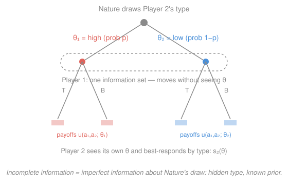

# Game Theory · Lesson 3.1: Bayesian games

> ⏱ ~15 min · Module 3: Games of incomplete information · Builds on: [1.3 Mixed strategies and existence](01-03-mixed-strategies.md), [`prob-stat-refresher` 1.2](../../prob-stat-refresher/lessons/01-02-conditional-probability-bayes.md) · Unlocks: 3.2 (auctions)

## Why this matters

Everything so far assumed the payoff matrix was common knowledge — you knew exactly what game you were in. Reality almost never grants that. You don't know a rival firm's true costs, a bidder's private valuation, an insured driver's risk, a poker opponent's hand. **Incomplete information** — not knowing others' payoffs — is the water modern economics swims in, and Harsanyi's 1967 insight is the boat: any such game can be turned into an ordinary one with a clever bookkeeping trick, and then solved with a mild upgrade of Nash equilibrium. This lesson builds that machinery. Its marquee application, auctions, is the very next lesson.

## The idea

Here is the problem: "I don't know your payoffs" is not a game in the sense of Module 1 — a game needs everyone's payoffs on the table. Harsanyi's move dissolves the difficulty by **relocating the uncertainty into a random move by Nature**.

Imagine that before anyone acts, a fictitious player — Nature — secretly rolls dice and assigns each player a **type**: a complete description of that player's private information (their cost, their valuation, their preferences). You observe *your own* type but not anyone else's. Crucially, everyone agrees on the *distribution* Nature draws from — a **common prior**. So "I'm unsure what game we're playing" becomes "we're playing one big, known game, but I didn't see Nature's roll for you." Incomplete information has been converted into **imperfect information** about a Nature move — and imperfect-information games we already know how to draw (Module 2's information sets).

Two consequences organize everything:

- A player's plan can't be a single action; it must say what to do **for each type they might be** — a *type-contingent strategy*, like a bidder's whole bid schedule "if my value is $v$, I bid $b(v)$."
- Because you don't see rivals' types, you can only best-respond **in expectation**, averaging their behavior over your beliefs about their types. Each of your types is, in effect, a separate decision-maker solving its own expected-payoff problem.

That's the entire idea. The formalism just makes "average over beliefs, type by type" precise.

## The formal version

**A Bayesian game** is a tuple $\big(N,\ \{A_i\},\ \{\Theta_i\},\ P,\ \{u_i\}\big)$:

- $N$ players; player $i$ has action set $A_i$.
- **Type set** $\Theta_i$: the possible values of $i$'s private information. A realized type is $\theta_i\in\Theta_i$; a type profile is $\theta=(\theta_1,\dots,\theta_n)$, and $\theta_{-i}$ collects everyone's types but $i$'s.
- **Common prior** $P$: a probability distribution over the full profile $\theta\in\Theta=\prod_i\Theta_i$, known to all.
- **Payoffs** $u_i(a_i,a_{-i};\theta)$: $i$'s payoff can depend on *everyone's* type, not just their own.

> In words: Nature draws the whole type profile $\theta$ from the shared distribution $P$; each player privately learns only their own coordinate $\theta_i$; then everyone moves.

**Beliefs (this is the Bayes in Bayes–Nash).** Having learned $\theta_i$, player $i$ updates to a conditional belief over rivals' types by the definition of conditional probability from [`prob-stat` 1.2](../../prob-stat-refresher/lessons/01-02-conditional-probability-bayes.md):

$$p_i(\theta_{-i}\mid\theta_i)=\frac{P(\theta_i,\theta_{-i})}{\displaystyle\sum_{\theta_{-i}'}P(\theta_i,\theta_{-i}')}.$$

> In words: condition the common prior on what you now know. If types are drawn independently, the denominator machinery collapses and $p_i(\theta_{-i}\mid\theta_i)$ is just the prior on $\theta_{-i}$ — your type tells you nothing about theirs.

**Strategy.** A (pure) strategy is a map

$$s_i:\Theta_i\to A_i,\qquad \theta_i\mapsto s_i(\theta_i),$$

specifying an action for each type $i$ could be. (Mixed strategies map into $\Delta(A_i)$; everything below carries over by linearity of expectation, exactly as in [1.3](01-03-mixed-strategies.md).)

**Bayes–Nash equilibrium (interim form).** A profile $(s_1^\ast,\dots,s_n^\ast)$ is a **Bayes–Nash equilibrium (BNE)** if for every player $i$ and every type $\theta_i$ occurring with positive probability,

$$s_i^\ast(\theta_i)\in\arg\max_{a_i\in A_i}\ \sum_{\theta_{-i}}p_i(\theta_{-i}\mid\theta_i)\;u_i\big(a_i,\,s_{-i}^\ast(\theta_{-i});\,\theta_i,\theta_{-i}\big).$$

> In words: **every type of every player best-responds in expectation** to the rivals' type-contingent strategies, averaging over its beliefs about their types. You optimize type-by-type, treating each of your possible selves as its own player.

**Interim vs. ex-ante.** The definition above is *interim* — you optimize after learning your own type. There is also an *ex-ante* view: before Nature moves, choose the whole map $s_i$ to maximize $\mathbb{E}_{\theta}\big[u_i\big]$. These coincide: because the ex-ante expectation is a $P$-weighted sum of the interim problems and each type gets a strictly positive weight, maximizing the sum is the same as maximizing every term separately. So "pick the best action for each type" and "pick the best overall plan" give the same equilibria — a fact we'll lean on when a bid function has a continuum of types.

**Existence.** A finite Bayesian game is just a finite game among the "type-agents," so [1.3](01-03-mixed-strategies.md)'s existence theorem applies: a (possibly mixed) BNE always exists.

## Picture

Nature draws Player 2's type ($\theta$ high with probability $p$, low with $1-p$). Player 1 sits inside **one information set** — the dashed box — so its move can't depend on $\theta$: it must be a single action chosen in expectation. Player 2, seeing its own $\theta$, plays a type-contingent $s_2(\theta)$. That asymmetry — one side knows, the other averages — is the whole subject.

## Worked examples

**Example 1 (mechanical — an entry game with a hidden incumbent).** An entrant (Player 1, uninformed) chooses **In** or **Out**. The incumbent (Player 2) is privately **tough** (probability $\tfrac13$) or **soft** (probability $\tfrac23$) and chooses **Fight** or **Share**. Payoffs $(u_1,u_2)$:

$$
\textbf{tough }(\tfrac13):\ 
\begin{array}{c|cc}
 & \text{Fight} & \text{Share}\\\hline
\text{In} & (-1,\,3) & (1,\,1)\\
\text{Out} & (0,\,2) & (0,\,0)
\end{array}
\qquad
\textbf{soft }(\tfrac23):\ 
\begin{array}{c|cc}
 & \text{Fight} & \text{Share}\\\hline
\text{In} & (-1,\,0) & (1,\,2)\\
\text{Out} & (0,\,1) & (0,\,3)
\end{array}
$$

*Step 1 — solve each type of the informed player.* Compare the incumbent's two columns within each type. Tough: Fight beats Share in both rows ($3>1$, $2>0$) — **Fight is dominant**. Soft: Share beats Fight in both rows ($2>0$, $3>1$) — **Share is dominant**. So $s_2^\ast(\text{tough})=\text{Fight}$, $s_2^\ast(\text{soft})=\text{Share}$, whatever the entrant does.

*Step 2 — the uninformed player best-responds in expectation.* The entrant faces Fight with probability $\tfrac13$ (tough) and Share with probability $\tfrac23$ (soft):

$$\mathbb{E}[u_1\mid \text{In}]=\tfrac13(-1)+\tfrac23(1)=\tfrac13,\qquad \mathbb{E}[u_1\mid \text{Out}]=0.$$

Since $\tfrac13>0$, the entrant plays **In**. The BNE is: *entrant plays In; incumbent Fights if tough, Shares if soft*. Note the entrant enters despite knowing it loses to a tough incumbent — the soft type is likely enough to make the gamble pay.

**Example 2 (why you'd care — auctions as the marquee Bayesian game).** Now let the type be a *number*. In a sealed-bid auction, bidder $i$'s type is their private value $\theta_i=v_i$, drawn from a common distribution on $[0,1]$; the action is a bid; a strategy is a **bid function** $s_i(\theta_i)=b(v_i)$ — a type-contingent plan with a continuum of types. The BNE condition says: for *each* value $v$, the bid $b(v)$ must maximize expected surplus, averaging over rivals' values via the prior. That single sentence — "each type best-responds in expectation" — is exactly what [3.2](03-02-auctions.md) solves to derive the shading rule $b(v)=\frac{n-1}{n}v$ and revenue equivalence. Bayesian games are the grammar; auctions are the first great sentence.

## Watch out

- You might think a strategy is an action. In a Bayesian game it's a **function of your type** — you must specify what *each* possible you would do, because equilibrium is checked type-by-type (and off-equilibrium types still constrain rivals' beliefs).
- You might think the informed player "averages over its own type." No — you *know* your type; you average over *others'* types. Only the uninformed side integrates over the hidden draw.
- You might think a common prior means everyone ends up believing the same thing. It means everyone starts from the same distribution $P$; after conditioning on their private $\theta_i$, players hold *different* posteriors. Shared prior, divergent beliefs.
- You might think BNE needs a new solution concept. It doesn't — it *is* Nash equilibrium of the expanded game whose players are the type-agents. Same fixed-point, richer player list.

## One-liner

> Turn "I don't know your payoffs" into "Nature secretly drew your type from a distribution we both know," then require every type of every player to best-respond in expectation.

## Problems

**P1 (🟢)** Player 1 (uninformed) chooses **T** or **B**. Player 2 is type **high** (probability $p$) or **low** (probability $1-p$) and chooses **L** or **R**. Payoffs $(u_1,u_2)$:

$$
\textbf{high }(p):\ 
\begin{array}{c|cc}
 & \text{L} & \text{R}\\\hline
\text{T} & (4,\,3) & (0,\,1)\\
\text{B} & (1,\,2) & (2,\,0)
\end{array}
\qquad
\textbf{low }(1-p):\ 
\begin{array}{c|cc}
 & \text{L} & \text{R}\\\hline
\text{T} & (1,\,0) & (0,\,2)\\
\text{B} & (1,\,1) & (3,\,3)
\end{array}
$$

(a) Find each type's best action. (b) For $p=\tfrac23$, find Player 1's action and state the BNE. (c) Find the threshold $p^\ast$ above which Player 1 switches actions.

**P2 (🟡)** *Cournot with an unknown-cost rival.* Inverse demand $P=12-Q$, $Q=q_1+q_2$. Firm 1's marginal cost is $0$ (known). Firm 2's marginal cost is **high** $c_H=6$ with probability $\tfrac12$ or **low** $c_L=0$ with probability $\tfrac12$; firm 2 knows its own cost, firm 1 does not. Find firm 2's type-contingent quantities $q_2(c_H),q_2(c_L)$ and firm 1's quantity $q_1$.

**P3 (🔴)** *When does a small doubt unravel coordination?* Pure-coordination game: both **A** $\to(2,2)$, both **B** $\to(1,1)$, mismatch $\to(0,0)$; "both A" is the good equilibrium. Perturb it: independently, each player is with probability $\varepsilon$ a **B-type** for whom B is strictly dominant (B pays them, A pays $0$, regardless of the opponent), else a **normal** type with the payoffs above. Each learns only its own type.
(a) What do B-types do? (b) Take a normal player and the candidate profile "all normal types play A." Compute its expected payoff from A vs. B, and show that for small $\varepsilon$ the good equilibrium *survives*. Find the exact threshold on $\varepsilon$. (c) Given (b), what extra ingredient is actually needed for a vanishingly small doubt to destroy A — and why is that a statement about *higher-order* beliefs, not about the probability $\varepsilon$ itself?

Solutions

**P1** (a) *Solve each type of the informed Player 2 (their action can't depend on Player 1's, which they don't see, so look for dominance across the two rows).*
- Type **high**: column L gives Player 2 payoffs $3$ (T), $2$ (B); column R gives $1$ (T), $0$ (B). Since $3>1$ and $2>0$, **L dominates** — high plays L.
- Type **low**: column L gives $0$ (T), $1$ (B); column R gives $2$ (T), $3$ (B). Since $2>0$ and $3>1$, **R dominates** — low plays R.

(b) Player 1 faces L with probability $p$ (high type) and R with probability $1-p$ (low type), earning the payoffs in the *on-path* cells (T,L) under high and (T,R) under low, etc.:

$$\mathbb{E}[u_1\mid \text{T}]=p(4)+(1-p)(0)=4p,\qquad \mathbb{E}[u_1\mid \text{B}]=p(1)+(1-p)(3)=3-2p.$$

At $p=\tfrac23$: $\mathbb{E}[u_1\mid\text{T}]=\tfrac83\approx2.67$ and $\mathbb{E}[u_1\mid\text{B}]=3-\tfrac43=\tfrac53\approx1.67$, so **Player 1 plays T**. BNE: *Player 1 plays T; Player 2 plays L if high, R if low.*

(c) T beats B iff $4p>3-2p\iff 6p>3\iff p>\tfrac12$. So $p^\ast=\tfrac12$: above it Player 1 plays T, below it B.

Check ($p=\tfrac23$): given Player 2's rule, T yields $\tfrac83>\tfrac53$, so T is Player 1's best response; given Player 1 plays T, high strictly prefers L ($3>1$) and low strictly prefers R ($2>0$). No profitable deviation for any type. ✓

**P2** *Solve the informed firm type-by-type, then the uninformed firm in expectation.* Each firm 2 type maximizes its own profit given firm 1's quantity $q_1$:

$$\max_{q_2}\ (12-q_1-q_2-c_t)\,q_2\ \Rightarrow\ q_2(c_t)=\frac{12-q_1-c_t}{2}.$$

Firm 1 doesn't know $c_2$, so it maximizes *expected* profit against $\mathbb{E}[q_2]=\tfrac12 q_2(c_H)+\tfrac12 q_2(c_L)$:

$$\max_{q_1}\ \big(12-q_1-\mathbb{E}[q_2]-0\big)\,q_1\ \Rightarrow\ q_1=\frac{12-\mathbb{E}[q_2]}{2}.$$

Take expectations of firm 2's rule: with $\mathbb{E}[c_2]=\tfrac12(6)+\tfrac12(0)=3$,

$$\mathbb{E}[q_2]=\frac{12-q_1-\mathbb{E}[c_2]}{2}=\frac{9-q_1}{2}.$$

Substitute into firm 1's rule: $q_1=\dfrac{12-\frac{9-q_1}{2}}{2}=\dfrac{24-9+q_1}{4}=\dfrac{15+q_1}{4}$, so $4q_1=15+q_1\Rightarrow q_1=5$. Then

$$q_2(c_H)=\frac{12-5-6}{2}=\tfrac12,\qquad q_2(c_L)=\frac{12-5-0}{2}=\tfrac72.$$

Check: $\mathbb{E}[q_2]=\tfrac12(\tfrac12)+\tfrac12(\tfrac72)=2$, and firm 1's best response is $\frac{12-2}{2}=5=q_1$ ✓. Each firm 2 type is best-responding to $q_1=5$ ✓. (Note the low-cost type produces much more — private good news is exploited, and firm 1, hedging against a rival it can't see, sits between the two full-information responses.)

**P3** (a) A B-type has B strictly dominant, so **every B-type plays B** — nothing to compute.

(b) A normal player believes the opponent is normal (plays A) with probability $1-\varepsilon$ and a B-type (plays B) with probability $\varepsilon$. Then

$$\mathbb{E}[u\mid \text{A}]=(1-\varepsilon)(2)+\varepsilon(0)=2-2\varepsilon,\qquad \mathbb{E}[u\mid \text{B}]=(1-\varepsilon)(0)+\varepsilon(1)=\varepsilon.$$

A is a best response iff $2-2\varepsilon>\varepsilon\iff\varepsilon<\tfrac23$. So for any $\varepsilon<\tfrac23$ — in particular any *small* doubt — "all normal types play A" is still a BNE. **An independent small perturbation does not unravel the good equilibrium.**

(c) The extra ingredient is the *failure of common knowledge*: the doubt must be structured so that the players' information is nested (as in Rubinstein's electronic-mail game / global games), where a player is unsure whether the opponent is sure whether the player is normal, and so on without end. In that setting a "dominance region" of certain B-types **infects** the type space by iterated best response — a type almost sure it faces a normal opponent still switches to B because it's not sure the *opponent* is sure, killing A everywhere in the unique rationalizable outcome. Part (b) is the punchline in disguise: what breaks coordination is not the magnitude $\varepsilon$ (which can be tiny) but the collapse of *higher-order* certainty. With independent types the higher-order beliefs stay pinned down and A survives; with nested signals they don't, and it doesn't.

Check (b): at $\varepsilon=\tfrac23$, $\mathbb{E}[u\mid\text{A}]=2-\tfrac43=\tfrac23=\varepsilon=\mathbb{E}[u\mid\text{B}]$ — exactly the indifference point, confirming A strictly optimal below it. ✓

## Flashback

**From Lesson 1.3 (Mixed strategies and existence):** Find the mixed-strategy Nash equilibrium of the following complete-information game, and each player's expected payoff. Player 1 chooses rows U/D, Player 2 columns L/R; payoffs $(u_1,u_2)$:

$$
\begin{array}{c|cc}
 & \text{L} & \text{R}\\\hline
\text{U} & (3,\,1) & (0,\,4)\\
\text{D} & (1,\,3) & (2,\,2)
\end{array}
$$

Solution

First check for pure equilibria via best responses: if 2 plays L, 1 prefers U ($3>1$); if 2 plays R, 1 prefers D ($2>0$); if 1 plays U, 2 prefers R ($4>1$); if 1 plays D, 2 prefers L ($3>2$). The best responses cycle $\text{U}\to\text{R}\to\text{D}\to\text{L}\to\text{U}$ — no pure NE, so the equilibrium is mixed.

*Indifference principle (1.3's engine):* each player mixes to make the *other* indifferent. Let Player 1 play U with probability $p$. Player 2 is indifferent between L and R when

$$\underbrace{p(1)+(1-p)(3)}_{u_2(\text{L})}=\underbrace{p(4)+(1-p)(2)}_{u_2(\text{R})}\ \Rightarrow\ 3-2p=2+2p\ \Rightarrow\ p=\tfrac14.$$

Let Player 2 play L with probability $q$. Player 1 is indifferent between U and D when

$$\underbrace{q(3)+(1-q)(0)}_{u_1(\text{U})}=\underbrace{q(1)+(1-q)(2)}_{u_1(\text{D})}\ \Rightarrow\ 3q=2-q\ \Rightarrow\ q=\tfrac12.$$

Equilibrium: Player 1 plays U with probability $\tfrac14$, Player 2 plays L with probability $\tfrac12$. Expected payoffs: $u_1=3q=\tfrac32$ (via the U row, equal to D by construction); $u_2=3-2p=\tfrac52$ (via the L column).

Check: at $p=\tfrac14$, $u_2(\text{L})=3-\tfrac12=\tfrac52$ and $u_2(\text{R})=2+\tfrac12=\tfrac52$ — equal, so any mix (including $q=\tfrac12$) is optimal for Player 2; symmetrically at $q=\tfrac12$, $u_1(\text{U})=u_1(\text{D})=\tfrac32$. Both indifferences hold, so neither can profitably deviate. ✓

## Connections

- **Backward:** BNE is [1.2](01-02-nash-equilibrium.md)'s Nash equilibrium applied to the expanded game of "type-agents," with expected payoffs computed exactly as in [1.3](01-03-mixed-strategies.md) — averaging over uncertainty, now uncertainty about *types* rather than about *mixing*. Solving each informed type by dominance is pure [1.1](01-01-normal-form-dominance.md).
- **Forward:** [3.2](03-02-auctions.md) makes the type a continuous private value and the strategy a bid function — the same "best-respond in expectation, type-by-type" condition, integrated instead of summed. [3.3](03-03-signaling-pbe.md) lets actions *reveal* type, upgrading BNE to perfect Bayesian equilibrium; [4.2](04-02-mechanism-design.md) *designs* the Bayesian game so truth-telling is an equilibrium.
- **Sideways (probability):** the belief update $p_i(\theta_{-i}\mid\theta_i)$ is literally conditional probability / Bayes' rule from [`prob-stat` 1.2](../../prob-stat-refresher/lessons/01-02-conditional-probability-bayes.md) — the common prior is the joint distribution, private types are the conditioning event, and posteriors drive every expected-payoff calculation in the module.
</content>
</invoke>
