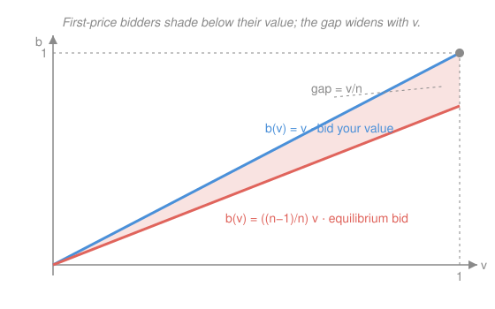

# Game Theory · Lesson 3.2: Auctions

> ⏱ ~15 min · Module 3: Games of incomplete information · Builds on: [3.1 Bayesian games](03-01-bayesian-games.md), [`prob-stat-refresher` 2.3](../../prob-stat-refresher/lessons/02-03-continuous-distributions.md) · Unlocks: 3.3 (signaling and PBE)

## Why this matters

Auctions are the purest Bayesian game: your value is private, everyone's is drawn from the same known distribution, and the rules turn beliefs about rivals into a single number — your bid. They also run the modern economy — spectrum licenses, Treasury debt, ad slots sold billions of times a day. The two headline results are almost paradoxical: in a second-price auction honesty is *dominant* (you never want to lie, whatever anyone else does), and across the two most common formats the seller earns **exactly the same expected revenue**. This lesson derives both, and along the way the equilibrium bid function that Boss Problem 3 asks for.

## The idea

Strip an auction to its core: one object, $n$ bidders, and each bidder $i$ privately knows how much the object is worth to them — a number $v_i$. Nobody knows anyone else's value, but everyone agrees the values are independent draws from one common distribution. That is the **independent private values (IPV)** world.

Now the two formats:

- **Second-price (Vickrey):** highest bid wins, but the winner pays the *second*-highest bid. The genius is that your bid decides *whether* you win, while someone else's bid decides *what you pay* — so tilting your own bid can only cost you a win you wanted or buy you one you didn't. Telling the truth, $b_i = v_i$, is the safe play no matter what — it is a dominant strategy.

- **First-price:** highest bid wins and pays their own bid. Now truth is suicidal — bid your value and winning nets you zero. So you **shade** your bid below your value, trading a slightly lower win probability for a positive profit when you do win. How much to shade is a genuine game: shade too little and you overpay, too much and you lose. Equilibrium pins down the exact amount.

The surprise waiting at the end: those two very different-looking games hand the seller the *same* expected check.

## The formal version

**Setup.** $n$ bidders. Bidder $i$'s value $v_i$ is drawn independently from a distribution with CDF $F$ on $[0,1]$; we specialize to **uniform**, $F(v)=v$. A **strategy** is a bid function $b_i(\cdot)$ mapping your value to your bid. Write $v_{(1)}\ge v_{(2)}\ge\cdots\ge v_{(n)}$ for the values sorted top-down, so $v_{(1)}$ is the highest and $v_{(2)}$ the runner-up (the *order statistics*).

**Second-price: truth is (weakly) dominant.** Bidding $b_i=v_i$ weakly dominates every other bid.

> In words: whatever the others do, no bid does strictly better than your true value, and some do worse. Proof is the case analysis in P1 — the payoff only changes in the narrow window where your bid crosses the top rival bid, and in that window lying always hurts.

Consequently the winner is the highest-value bidder and pays $v_{(2)}$: **second-price revenue $=\mathbb{E}[v_{(2)}]$.**

**First-price: solve the Bayesian game.** Look for a *symmetric* equilibrium in which everyone uses the same increasing bid function $\beta$. If you have value $v$ and bid $b$, you win exactly when your bid tops all $n-1$ rivals' bids. Since each rival $j$ bids $\beta(v_j)$ and $\beta$ is increasing, you beat $j$ iff $v_j<\beta^{-1}(b)$, which under uniform values happens with probability $\beta^{-1}(b)$. The $n-1$ rivals are independent, so

$$\Pr[\text{win}\mid \text{bid }b]=\big(\beta^{-1}(b)\big)^{\,n-1}.$$

Your expected surplus is value-minus-price times win-probability:

$$U(b)=(v-b)\,\big(\beta^{-1}(b)\big)^{\,n-1}.$$

Guess a linear rule $\beta(v)=c\,v$, so $\beta^{-1}(b)=b/c$ and (dropping the constant $c^{-(n-1)}$) maximizing $U$ means maximizing $(v-b)\,b^{\,n-1}$. The first-order condition:

$$\frac{d}{db}\Big[(v-b)\,b^{\,n-1}\Big]=-b^{\,n-1}+(v-b)(n-1)b^{\,n-2}=0.$$

Divide by $b^{\,n-2}$: $-b+(n-1)(v-b)=0\Rightarrow (n-1)v=nb$, giving

$$\boxed{\,b(v)=\frac{n-1}{n}\,v\,}$$

and this is consistent with the guess ($c=\tfrac{n-1}{n}$), so it *is* the symmetric equilibrium.

> In words: shade your value by the factor $\frac{n-1}{n}$. With $n=2$ you bid half your value; with many rivals the factor $\to 1$ and shading vanishes — competition forces you toward the truth.

**The runner-up reading.** There's a beautiful interpretation. The general symmetric first-price equilibrium is

$$b(v)=\mathbb{E}\big[\text{highest of the other }n-1\text{ values}\,\big|\,\text{they are all below }v\big].$$

> In words: bid what you'd expect the strongest rival to be worth, *conditional on your winning* (all others below you). You bid the price you'd just barely have to beat. For uniform values, the max of $n-1$ draws on $[0,v]$ has mean $\frac{n-1}{n}v$ — the same formula.

**Order-statistic facts (uniform on $[0,1]$).** The $k$th-highest of $n$ i.i.d. uniforms has mean

$$\mathbb{E}[v_{(k)}]=\frac{n+1-k}{n+1}.$$

So the highest averages $\mathbb{E}[v_{(1)}]=\frac{n}{n+1}$ and the runner-up $\mathbb{E}[v_{(2)}]=\frac{n-1}{n+1}$.

**Revenue equivalence.** Compute each format's expected revenue:

- Second-price: $\mathbb{E}[v_{(2)}]=\dfrac{n-1}{n+1}$.
- First-price: the winner is the top bidder, paying $b(v_{(1)})=\frac{n-1}{n}v_{(1)}$, so revenue is $\frac{n-1}{n}\,\mathbb{E}[v_{(1)}]=\frac{n-1}{n}\cdot\frac{n}{n+1}=\dfrac{n-1}{n+1}$.

They match. This is a special case of the **Revenue Equivalence Theorem**: *any* auction in the IPV model that (i) always awards the object to the highest-value bidder and (ii) gives the lowest possible type zero expected surplus yields the *same expected revenue* — here $\frac{n-1}{n+1}$. The format is a redistribution of *who pays what in which state*; the seller's average take is fixed by the allocation alone.

## Picture

The blue $45^\circ$ line is truthful bidding $b=v$; the red line is the first-price equilibrium $b(v)=\frac{n-1}{n}v$. The shaded wedge between them is the bid shading — width $v-\frac{n-1}{n}v=\frac{v}{n}$, growing with your value and shrinking as rivals multiply.

## Worked examples

**Example 1 (mechanical — shading with the numbers).** Three bidders ($n=3$), values uniform on $[0,1]$, first-price. The equilibrium bid function is $b(v)=\frac{2}{3}v$. A bidder who draws $v=0.9$ bids $0.6$; one who draws $v=0.3$ bids $0.2$. Everyone compresses their bids into the lower two-thirds of the value range, but the *ranking* is preserved — so the highest value still wins, exactly as revenue equivalence requires. Expected revenue is $\frac{n-1}{n+1}=\frac{2}{4}=\tfrac12$.

**Example 2 (why you'd care — comparing formats you might run).** You're selling one item to $n=5$ bidders. Second-price: you collect the runner-up value, on average $\mathbb{E}[v_{(2)}]=\frac{4}{6}=\tfrac23$. First-price: the winner shades to $\frac{4}{5}$ of their value, and the top value averages $\frac{5}{6}$, so revenue is $\frac{4}{5}\cdot\frac{5}{6}=\frac{4}{6}=\tfrac23$. Identical. The practical lesson: choosing between these formats is *not* about revenue — it's about robustness (second-price needs no distributional knowledge to play), collusion-resistance, and bidder psychology. The theorem frees you to pick on those grounds.

## Watch out

- You might think second-price truth-telling depends on rivals being honest too. It doesn't — it's a *dominant* strategy, optimal against *any* profile of rival bids, honest or not. That is exactly what makes it robust (and links to the revelation principle in [4.2](04-02-mechanism-design.md)).
- You might think shading means you sometimes lose a winnable object "on purpose." No — everyone shades by the same increasing factor, so the ranking of bids equals the ranking of values; the highest value always wins. Shading moves the *price*, not the *allocation*.
- You might think first-price revenue beats second-price because winners "pay their own high bid." But first-price winners pay a *shaded* bid, while second-price winners pay an *unshaded* runner-up value — and the two effects cancel exactly. Revenue equivalence, not intuition, is the reliable guide.
- The $\frac{n-1}{n}$ formula is uniform-specific; the *runner-up conditional-expectation* formula is the general one. Don't quote $\frac{n-1}{n}v$ for a non-uniform $F$.

## One-liner

> Second-price makes honesty dominant and charges the runner-up; first-price makes you shade to $\frac{n-1}{n}$ of your value — and both hand the seller the same expected revenue, because only the allocation matters.

## Problems

**P1 (🟢)** Second-price auction, your value $v$. Let $m$ be the highest bid among your rivals (you don't observe it). Prove that bidding $b=v$ weakly dominates both overbidding ($b>v$) and underbidding ($b<v$), by checking every way the outcome could differ.

**P2 (🟡, Boss 3)** First-price auction, $n$ bidders, values uniform on $[0,1]$. (a) Derive the symmetric equilibrium bid function $b(v)=\frac{n-1}{n}v$ (use either the FOC of expected surplus or the expected-runner-up argument). (b) Compute the seller's expected revenue, using $\mathbb{E}[v_{(1)}]=\frac{n}{n+1}$.

**P3 (🔴)** Verify revenue equivalence directly for $n=2$, uniform values. (a) Show the second-price expected revenue equals $\mathbb{E}[\min(v_1,v_2)]=\tfrac13$. (b) Show the first-price auction, using $b(v)=\tfrac{v}{2}$, yields the same $\tfrac13$. (Along the way, verify $\mathbb{E}[\max(v_1,v_2)]=\tfrac23$.)

Solutions

**P1** Fix the rivals' highest bid $m$; your bid $b$ affects only your own outcome. In a second-price auction you win iff $b>m$ and then pay $m$, so your surplus is $v-m$ if $b>m$ and $0$ if $b<m$ (ties are a measure-zero event we ignore).

*Truthful, $b=v$:* you win iff $v>m$. When you win, $v>m$ so surplus $v-m>0$; when you lose, $v<m$ so you'd only have won at a loss. Truthful bidding wins exactly the profitable auctions.

*Overbidding, $b>v$:* the outcome differs from truthful only when $m$ lands in $(v,b)$ — then you now win but pay $m>v$, so surplus $v-m<0$ instead of the $0$ you'd have gotten by losing. For every other $m$ the outcome is identical to truthful. So overbidding is *never better* and *sometimes strictly worse*.

*Underbidding, $b<v$:* the outcome differs only when $m\in(b,v)$ — then you now lose (surplus $0$) a good you'd have won at surplus $v-m>0$. Again never better, sometimes strictly worse.

Since no deviation ever beats $b=v$ and each is strictly worse for a positive-probability range of $m$, truthful bidding **weakly dominates**.
Check: the only states where your bid changes the outcome are those where it flips a win to a loss or vice versa, i.e. $m$ between $b$ and $v$; in that band the "extra" auctions you win/lose all have the wrong sign of $v-m$. ✓

**P2** (a) *FOC route.* In a symmetric increasing equilibrium $\beta$, a bidder of value $v$ choosing bid $b$ wins with probability $\big(\beta^{-1}(b)\big)^{n-1}$ (each of $n-1$ rivals independently has value below $\beta^{-1}(b)$, probability $\beta^{-1}(b)$ under uniform $F$). Expected surplus $U(b)=(v-b)\big(\beta^{-1}(b)\big)^{n-1}$. Guess $\beta(v)=cv$, so $\beta^{-1}(b)=b/c$; maximize $(v-b)b^{\,n-1}$:

$$\frac{d}{db}\big[(v-b)b^{\,n-1}\big]=-b^{\,n-1}+(v-b)(n-1)b^{\,n-2}=0\ \Rightarrow\ -b+(n-1)(v-b)=0\ \Rightarrow\ b=\frac{n-1}{n}v.$$

Consistency: the optimal bid $\frac{n-1}{n}v$ is linear in $v$, matching the guess with $c=\frac{n-1}{n}$, so $\beta(v)=\frac{n-1}{n}v$ is a symmetric equilibrium.

*Runner-up route.* Bidding the expected top rival value conditional on winning: the max of $n-1$ uniforms on $[0,v]$ has CDF $(x/v)^{n-1}$, density $\frac{(n-1)x^{n-2}}{v^{n-1}}$, and mean

$$\int_0^v x\cdot\frac{(n-1)x^{n-2}}{v^{n-1}}\,dx=\frac{n-1}{v^{n-1}}\cdot\frac{v^{n}}{n}=\frac{n-1}{n}v.$$

Same answer.

(b) The winner is the top bidder with value $v_{(1)}$ and pays $b(v_{(1)})=\frac{n-1}{n}v_{(1)}$. Expected revenue:

$$\mathbb{E}\!\left[\tfrac{n-1}{n}v_{(1)}\right]=\frac{n-1}{n}\,\mathbb{E}[v_{(1)}]=\frac{n-1}{n}\cdot\frac{n}{n+1}=\frac{n-1}{n+1}.$$

Check: equals $\mathbb{E}[v_{(2)}]=\frac{n-1}{n+1}$, the second-price revenue — revenue equivalence holds for every $n$. ✓

**P3** Two i.i.d. uniforms $v_1,v_2$ on $[0,1]$.

*Order statistics.* The max $M=\max(v_1,v_2)$ has CDF $\Pr[M\le x]=x^2$, density $2x$, so $\mathbb{E}[M]=\int_0^1 x\cdot 2x\,dx=\frac{2}{3}$. The min $m=\min(v_1,v_2)$ satisfies $\mathbb{E}[m]+\mathbb{E}[M]=\mathbb{E}[v_1+v_2]=1$, hence $\mathbb{E}[m]=1-\frac{2}{3}=\frac13$. (Directly: $\Pr[m>x]=(1-x)^2$, $\mathbb{E}[m]=\int_0^1(1-x)^2dx=\frac13$.)

(a) With $n=2$ the second-highest value *is* the minimum, so second-price revenue $=\mathbb{E}[v_{(2)}]=\mathbb{E}[\min(v_1,v_2)]=\frac13$.

(b) First-price with $n=2$: $b(v)=\frac{n-1}{n}v=\frac{v}{2}$. The winner has value $v_{(1)}=M$ and pays $\frac{M}{2}$, so expected revenue $=\mathbb{E}\!\left[\frac{M}{2}\right]=\frac12\cdot\frac23=\frac13$.

Check: both formats give $\frac13=\frac{n-1}{n+1}\big|_{n=2}$. ✓

## Flashback

**From Lesson 3.1 (Bayesian games):** Player 1 (uninformed) chooses $a$ or $b$. Player 2 has a privately known type, $H$ or $L$, each with probability $\tfrac12$, and chooses $x$ or $y$. Payoffs $(u_1,u_2)$:

$$
\textbf{Type }H:\quad
\begin{array}{c|cc}
 & x & y\\\hline
a & (4,3) & (1,1)\\
b & (0,2) & (1,0)
\end{array}
\qquad
\textbf{Type }L:\quad
\begin{array}{c|cc}
 & x & y\\\hline
a & (2,0) & (0,2)\\
b & (5,1) & (6,3)
\end{array}
$$

Find the Bayes–Nash equilibrium.

Solution

Player 2 knows their type, so solve each type's problem first — it is a single-agent choice given Player 1's action, and here each type has a *dominant* action.

- Type $H$: column $x$ gives Player 2 payoffs $3$ (row $a$) and $2$ (row $b$); column $y$ gives $1$ and $0$. Since $3>1$ and $2>0$, **$x$ strictly dominates** — type $H$ plays $x$.
- Type $L$: column $x$ gives $0$ and $1$; column $y$ gives $2$ and $3$. Since $2>0$ and $3>1$, **$y$ strictly dominates** — type $L$ plays $y$.

Now Player 1, not knowing the type, faces $x$ with probability $\tfrac12$ and $y$ with probability $\tfrac12$, and computes expected payoffs against the on-path rival actions ($x$ if $H$, $y$ if $L$):

$$\mathbb{E}[u_1\mid a]=\tfrac12\underbrace{(4)}_{a,x\text{ under }H}+\tfrac12\underbrace{(0)}_{a,y\text{ under }L}=2,\qquad \mathbb{E}[u_1\mid b]=\tfrac12\underbrace{(0)}_{b,x\text{ under }H}+\tfrac12\underbrace{(6)}_{b,y\text{ under }L}=3.$$

Since $3>2$, Player 1 plays $b$. The Bayes–Nash equilibrium is: **Player 1 plays $b$; Player 2 plays $x$ if type $H$ and $y$ if type $L$.**
Check: given Player 2's type-contingent strategy, $b$ is Player 1's best response ($3>2$); given Player 1 plays $b$, each type of Player 2 is best-responding ($x$ yields $2>0$ for $H$; $y$ yields $3>1$ for $L$). No player can profitably deviate. ✓

## Connections

- **Backward:** this is [3.1](03-01-bayesian-games.md)'s Bayes–Nash machinery applied to a continuum of types — a bid function is just a type-contingent strategy, and "win probability" is a belief computed from the common prior $F$. The second-price dominance argument is pure [1.1](01-01-normal-form-dominance.md) dominance, now in a game of incomplete information.
- **Forward:** [3.3](03-03-signaling-pbe.md) keeps the private-type structure but lets actions *reveal* type, moving from Bayes–Nash to perfect Bayesian equilibrium; and [4.2](04-02-mechanism-design.md) inverts the question — *design* the auction — where second-price truthfulness becomes the flagship of the revelation principle and revenue equivalence becomes a design constraint.
- **Sideways (probability):** the whole lesson runs on the uniform distribution and order statistics of [`prob-stat-refresher` 2.3](../../prob-stat-refresher/lessons/02-03-continuous-distributions.md) — expected max, expected runner-up, and conditional expectations are the probabilistic engine turning private values into bids and revenue.
