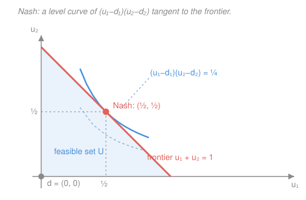

# Game Theory · Lesson 4.1: Bargaining

> ⏱ ~15 min · Module 4: Bargaining and mechanism design · Builds on: [2.2 Subgame perfection and commitment](02-02-subgame-perfection-commitment.md) · Unlocks: 4.2 (mechanism design)

## Why this matters

Two parties can jointly create a surplus — a dollar to divide, gains from trade, a merger's synergies — but only if they agree on how to split it. If they don't, nobody gets anything. That is *bargaining*, and it splits into two questions that turn out to give the same answer. **Cooperatively**: what division is *fair* and *sensible*, characterized by a short list of principles? **Non-cooperatively**: what division actually *emerges* when the parties trade offers back and forth, each impatient and strategic? Nash answered the first with four axioms; Rubinstein answered the second with an explicit game whose subgame-perfect equilibrium is unique. The punchline — the *Nash program* — is that as bargaining friction vanishes, the strategic answer converges exactly onto the axiomatic one. Two completely different roads, one destination.

## The idea

Strip a negotiation to its essentials. There is a menu of outcomes the two players *could* agree on, each giving them some pair of utilities — call the set of achievable pairs the **feasible set** $S$. And there is what happens if they walk away: the **disagreement point** $d = (d_1, d_2)$, the utilities each gets if no deal is struck. Bargaining is choosing a point of $S$, and $d$ is the outside option that gives each side leverage — the better your walk-away, the more you can demand.

The cooperative question: *which* point should they pick? You could just say "be Pareto efficient" (don't leave surplus on the table) and "be symmetric" (treat identical players identically), but that's not enough to pin down a single split when the players value things differently. Nash's move was to write down four reasonable-sounding requirements and prove that **exactly one** rule satisfies all of them — and that rule has a shockingly clean formula: maximize the product of the two players' *gains over disagreement*.

The non-cooperative question ignores fairness entirely and just watches people haggle. One player proposes a split; the other accepts (game over) or rejects and makes a counter-offer next period; and so on, potentially forever. The only friction is *impatience*: a dollar tomorrow is worth $\delta < 1$ times a dollar today. That impatience is what forces agreement — waiting is costly, so stalling forever is nobody's best play. Rubinstein showed this haggling game has a *unique* subgame-perfect equilibrium, and it hands the first proposer a share $\frac{1}{1+\delta}$ — a bit more than half, because being able to move first is worth something when delay hurts.

## The formal version

**The bargaining problem.** A two-player bargaining problem is a pair $(S, d)$ where $S \subseteq \mathbb{R}^2$ is the **feasible utility set** (convex, closed, bounded above) and $d = (d_1, d_2) \in S$ is the **disagreement point**. A **solution** is a rule $f$ that assigns to each such problem a point $f(S,d) \in S$. *In words:* $S$ is every utility pair a deal could deliver, $d$ is the no-deal fallback, and $f$ is a formula that picks the agreed division.

**Nash's axioms.** Nash asked that $f$ satisfy:

1. **Pareto efficiency** — $f(S,d)$ is not dominated: you can't make one player better off without hurting the other. *(No surplus wasted.)*
2. **Symmetry** — if the problem looks identical after swapping the players ($d_1 = d_2$ and $S$ is symmetric across the $45^\circ$ line), then $f_1 = f_2$. *(Identical players get identical shares.)*
3. **Scale invariance** — rescaling a player's utility by a positive affine transform (utility has no natural units) rescales the solution the same way; the physical outcome is unchanged. *(The answer can't depend on whether you measure in cents or dollars.)*
4. **Independence of irrelevant alternatives (IIA)** — if you shrink $S$ to a smaller set $S'$ that still contains the solution point, the solution doesn't move. *(Deleting options nobody would have chosen changes nothing.)*

**Theorem (Nash, 1950).** There is a *unique* solution satisfying axioms 1–4, the **Nash bargaining solution**: it is the point of $S$ (with $u \ge d$) maximizing the **Nash product**

$$f(S,d) = \arg\max_{(u_1,u_2)\in S,\; u \ge d}\; (u_1 - d_1)(u_2 - d_2).$$

*In words:* pick the feasible split that maximizes the product of both players' gains *above their walk-away values*. For splitting one unit of surplus with equal disagreement $d = (0,0)$ and utilities equal to shares ($u_1 + u_2 = 1$), maximizing $u_1 u_2$ gives $u_1 = u_2 = \tfrac12$ — the fifty-fifty split falls straight out.

**The Rubinstein alternating-offers game.** Two players divide one unit. In period $t = 1$ player 1 proposes a split $(x, 1-x)$; player 2 accepts (implemented) or rejects. On rejection, period $t = 2$ begins, player 2 proposes, player 1 responds, and so on — **infinite horizon**, players alternating as proposer. Both discount: a share $s$ agreed $k$ periods from now is worth $\delta^k s$ today, with **discount factor** $\delta \in (0,1)$. *In words:* trade offers forever if you must, but every round of delay shrinks the pie's present value by a factor $\delta$.

**Theorem (Rubinstein, 1982).** This game has a *unique* subgame-perfect equilibrium. It is **stationary** and agreement is **immediate**: player 1 (the first proposer) offers the split

$$\Big(\tfrac{1}{1+\delta},\; \tfrac{\delta}{1+\delta}\Big),$$

and player 2 accepts at once. *In words:* the proposer keeps $\frac{1}{1+\delta} > \tfrac12$, the responder gets $\frac{\delta}{1+\delta}$; the proposer's edge is the first-mover advantage, and it shrinks as $\delta \to 1$.

**The self-consistency that pins it down.** Call $x^*$ the proposer's equilibrium share (the *same* number for whoever is proposing, by stationarity). A responder who rejects becomes the proposer next period, so their continuation value is $\delta x^*$ (their proposer-share, one period delayed). Subgame perfection forces the proposer to offer the responder *exactly* that continuation value — no more (wasteful), no less (rejected) — keeping the rest:

$$x^* = 1 - \delta x^* \quad\Longrightarrow\quad x^*(1+\delta) = 1 \quad\Longrightarrow\quad x^* = \frac{1}{1+\delta}.$$

This is backward induction ([2.2](02-02-subgame-perfection-commitment.md)) applied to an infinite tree: the threat "reject and counter" is credible only because the counter-offer is itself the equilibrium play of the next subgame.

**The Nash program.** As friction vanishes, $\delta \to 1$:

$$\frac{1}{1+\delta} \;\longrightarrow\; \frac{1}{2}.$$

The strategic split converges to the symmetric Nash bargaining solution. *In words:* when waiting is nearly costless, moving first stops mattering, and the haggling outcome *is* the axiomatic fair split. The non-cooperative game **micro-founds** the cooperative solution.

## Picture

The Nash solution is where a hyperbola $(u_1 - d_1)(u_2 - d_2) = \text{const}$ — a level curve of the Nash product — is tangent to the efficient frontier of $S$, pushed out as far as feasibility allows. Move $d$ and the tangency point slides: a better outside option for a player tilts the split in their favor.

## Worked examples

**Example 1 (the Nash split, and how $d$ moves it).** Two players divide one unit, utilities equal to shares, so $S = \{(u_1, u_2): u_1 + u_2 \le 1\}$. With $d = (0,0)$, maximize $u_1 u_2$ on $u_1 + u_2 = 1$: substitute $u_2 = 1 - u_1$, maximize $u_1(1 - u_1)$, derivative $1 - 2u_1 = 0$, so $u_1 = u_2 = \tfrac12$. Fifty-fifty.

Now give player 1 an outside option $d = (\tfrac14, 0)$ — she gets $\tfrac14$ if talks fail. Maximize $(u_1 - \tfrac14)(u_2 - 0) = (u_1 - \tfrac14)(1 - u_1)$; derivative $(1 - u_1) - (u_1 - \tfrac14) = \tfrac54 - 2u_1 = 0$, so $u_1 = \tfrac58$, $u_2 = \tfrac38$. The Nash solution splits the *surplus above disagreement* equally: total surplus over $d$ is $1 - \tfrac14 = \tfrac34$, each gets $\tfrac38$ of it, so player 1 lands at $\tfrac14 + \tfrac38 = \tfrac58$. A stronger walk-away buys a bigger slice — leverage made quantitative.

**Example 2 (Rubinstein by self-consistency, then the limit).** Same unit pie, alternating offers, common discount $\delta$. Guess a stationary SPE where any proposer keeps $x^*$. A responder who rejects proposes next period and gets $x^*$ then — worth $\delta x^*$ now — so the current proposer must offer exactly $\delta x^*$ to secure acceptance, keeping $1 - \delta x^*$. Consistency demands $x^* = 1 - \delta x^*$, giving $x^* = \frac{1}{1+\delta}$.

Plug in $\delta = 0.9$: proposer keeps $\frac{1}{1.9} = \frac{10}{19} \approx 0.526$, responder gets $\frac{9}{19} \approx 0.474$. A modest first-mover premium of about $2.6$ percentage points. Now let patience grow, $\delta \to 1$: the share $\frac{1}{1+\delta} \to \tfrac12$, exactly the Nash solution of Example 1 with $d = (0,0)$. The strategic and axiomatic answers coincide in the frictionless limit — the Nash program in one line.

## Watch out

- You might think the Nash solution splits *total utility* equally. It splits the **gains over disagreement** equally (in the symmetric case) — that's why raising $d_1$ raises player 1's share. The product being maximized is $(u_1 - d_1)(u_2 - d_2)$, not $u_1 u_2$; the disagreement point is not decoration.
- You might think the Rubinstein proposer's share is $\delta$-independent "because it's just splitting a dollar." It's $\frac{1}{1+\delta}$: strictly above $\tfrac12$ for every $\delta < 1$, equal to $\tfrac12$ only in the limit. Impatience is the entire source of the first-mover premium — with $\delta = 0$ the responder is so desperate they'd take nothing, and the proposer takes all ($\frac{1}{1+0} = 1$).
- You might think IIA is obviously innocuous. It is the most contested axiom — dropping it (and adding a monotonicity requirement instead) yields a *different* rule, the Kalai–Smorodinsky solution. "The unique fair split" is unique *relative to Nash's particular four axioms*, not an absolute.
- You might expect delay in equilibrium — real negotiations drag on. In Rubinstein's complete-information game agreement is **immediate**: the responder knows exactly what rejection leads to, so the proposer offers just enough and it's accepted in period 1. Observed delay comes from *incomplete information* (uncertainty about the other's patience or value), which this baseline model deliberately omits.

## One-liner

> Fair bargaining maximizes the product of gains over disagreement, strategic bargaining hands the first mover $\frac{1}{1+\delta}$ — and as impatience vanishes the two answers become the same fifty-fifty split.

## Problems

**P1 (🟢)** Two players split one unit of surplus; utilities equal shares, so $S = \{(u_1, u_2): u_1 + u_2 = 1,\ u_i \ge 0\}$, disagreement $d = (0,0)$. Find the Nash bargaining solution by maximizing the Nash product two ways: (a) with a Lagrangian on the constraint $u_1 + u_2 = 1$, and (b) with the AM–GM inequality. Confirm both give fifty-fifty.

**P2 (🟡)** In the Rubinstein alternating-offers game with common discount factor $\delta$, derive the proposer's equilibrium share $x^* = \frac{1}{1+\delta}$ from the stationarity (self-consistency) condition, stating clearly why the proposer offers the responder exactly their continuation value. Then evaluate the full split at $\delta = 0.9$.

**P3 (🔴)** (Nash program and first-mover advantage.) (a) Show that the Rubinstein proposer share $\frac{1}{1+\delta} \to \tfrac12$ as $\delta \to 1$, and identify which term of the split captures the *responder's* limit. (b) Prove that for every $\delta \in (0,1)$ the proposer strictly benefits from moving first, i.e. $\frac{1}{1+\delta} > \tfrac12$, and show the premium $\frac{1}{1+\delta} - \tfrac12$ is decreasing in $\delta$. (c) In one sentence, state what part (a) says about the relationship between the cooperative and non-cooperative theories.

Solutions

**P1.** (a) *Lagrangian.* Maximize $u_1 u_2$ subject to $g = u_1 + u_2 - 1 = 0$. Form $\mathcal{L} = u_1 u_2 - \lambda(u_1 + u_2 - 1)$. First-order conditions:

$$\frac{\partial \mathcal{L}}{\partial u_1} = u_2 - \lambda = 0, \qquad \frac{\partial \mathcal{L}}{\partial u_2} = u_1 - \lambda = 0.$$

So $u_1 = \lambda = u_2$; with $u_1 + u_2 = 1$ this gives $u_1 = u_2 = \tfrac12$, $\lambda = \tfrac12$. (Second-order/boundary: the product is $0$ at the endpoints $u_1 \in \{0,1\}$ and positive interior, so this critical point is the maximum.)

(b) *AM–GM.* For nonnegative $u_1, u_2$, the arithmetic–geometric mean inequality gives $\sqrt{u_1 u_2} \le \frac{u_1 + u_2}{2} = \tfrac12$, hence $u_1 u_2 \le \tfrac14$, with equality **iff** $u_1 = u_2$. The constraint then forces $u_1 = u_2 = \tfrac12$. Same answer, no calculus.

*Check:* at $(\tfrac12,\tfrac12)$ the Nash product is $\tfrac14$; any perturbation $(\tfrac12+\varepsilon,\ \tfrac12-\varepsilon)$ gives $\tfrac14 - \varepsilon^2 < \tfrac14$, so fifty-fifty is the strict maximum. ✓ It is also Pareto efficient (on the frontier) and symmetric, as Nash's axioms require. ✓

**P2.** *Self-consistency.* By stationarity let $x^*$ be the share *any* proposer keeps in the unique SPE. Consider the responder's decision. If they reject the current offer, one period passes and they become the proposer, obtaining $x^*$ then — worth $\delta x^*$ in present value. Subgame perfection means:
- the proposer will never offer *more* than $\delta x^*$ (wasteful — the responder would accept less);
- the proposer must offer at least $\delta x^*$, or the responder rejects and takes the continuation.

So the proposer offers the responder **exactly** their continuation value $\delta x^*$ and keeps the remainder $1 - \delta x^*$. But that remainder *is* the proposer's share $x^*$, so

$$x^* = 1 - \delta x^* \;\Longrightarrow\; x^*(1 + \delta) = 1 \;\Longrightarrow\; x^* = \frac{1}{1+\delta}.$$

Agreement is immediate (the responder is offered exactly their walk-away, weakly accepts, and delay only destroys value). *Evaluate $\delta = 0.9$:* proposer keeps $\frac{1}{1.9} = \frac{10}{19} \approx 0.526$; responder gets $\frac{\delta}{1+\delta} = \frac{0.9}{1.9} = \frac{9}{19} \approx 0.474$.

*Check:* shares sum to $\frac{1}{1+\delta} + \frac{\delta}{1+\delta} = \frac{1+\delta}{1+\delta} = 1$ ✓ (a full split, no surplus lost). The responder's $\frac{9}{19}$ equals $\delta$ times the proposer's $\frac{10}{19}$: $0.9 \times \frac{10}{19} = \frac{9}{19}$ ✓, confirming the responder is held to exactly their discounted continuation value.

**P3.** (a) $\displaystyle\lim_{\delta \to 1} \frac{1}{1+\delta} = \frac{1}{2}$. The responder's share is $\frac{\delta}{1+\delta} \to \frac{1}{2}$ as well; both converge to $\tfrac12$, so the split becomes symmetric. The responder's term is the one that *rises* to $\tfrac12$ from below as patience grows (it equals $\frac{\delta}{1+\delta} < \tfrac12$ for all $\delta < 1$).

(b) For $\delta \in (0,1)$: $1 + \delta < 2$, so $\frac{1}{1+\delta} > \frac{1}{2}$ — strict first-mover advantage. For the premium, let $p(\delta) = \frac{1}{1+\delta} - \frac{1}{2}$. Then

$$p'(\delta) = -\frac{1}{(1+\delta)^2} < 0 \quad\text{for all } \delta,$$

so $p$ is strictly decreasing: the more patient the players (larger $\delta$), the smaller the proposer's edge. At $\delta \to 0^+$, $p \to \tfrac12$ (proposer takes almost everything against a desperate responder); at $\delta \to 1^-$, $p \to 0$.

(c) Part (a) is the **Nash program**: the unique subgame-perfect equilibrium of the non-cooperative alternating-offers game converges, as friction vanishes, to the symmetric Nash bargaining solution — so the strategic and axiomatic theories of bargaining agree in the limit, and the cooperative "fair split" is micro-founded by rational haggling.

*Check:* at $\delta = 0.9$, $p = \frac{10}{19} - \frac{1}{2} = \frac{20 - 19}{38} = \frac{1}{38} \approx 0.026$, matching the $\approx 2.6$ point premium from Example 2 ✓; and $p(\delta) \to 0$ monotonically as $\delta \to 1$, consistent with $\frac{1}{1+\delta} \to \tfrac12$ ✓.

## Flashback

**From Lesson 2.2 (Subgame perfection and commitment):** A sequential trust game. Player 1 chooses **In** or **Out**. If Out, the game ends at payoffs $(1, 1)$. If In, Player 2 chooses **Share** or **Grab**: Share yields $(2, 2)$, Grab yields $(-1, 3)$. Player 2 has publicly *promised* to Share. Solve the game by backward induction: what is the subgame-perfect equilibrium, and is Player 2's promise credible?

Solution

Roll back to Player 2's subgame (reached only after In). There Player 2 compares Grab ($3$) against Share ($2$) and, acting in their own interest, plays **Grab** — payoff $3 > 2$. The promise to Share is a **non-credible** commitment: honoring it costs Player 2 one unit, and nothing in the game binds them to it.

Anticipating Grab, Player 1 compares In ($\to (-1,3)$, giving Player 1 $-1$) against Out ($1$) and chooses **Out**. **SPE: Player 1 plays Out; Player 2 would Grab if reached; outcome $(1,1)$.** The efficient $(2,2)$ is unreachable in equilibrium — it requires Player 2 to act against their own ex-post interest, exactly the credibility failure of the entry game's "Fight." Note the bargaining echo: without a binding commitment device, the mutually beneficial deal collapses — the same hold-up logic, and precisely why the Rubinstein game's threats must be self-enforcing to bite.

*Check:* Player 2's Grab is optimal in its subgame ($3 > 2$), and given Grab, Player 1's Out is optimal ($1 > -1$) ✓. The Pareto-superior $(2,2)$ is not subgame-perfect because it rests on a threat/promise no rational Player 2 executes ✓.

## Connections

- **Backward:** Rubinstein's SPE *is* [2.2](02-02-subgame-perfection-commitment.md)'s subgame perfection carried to an infinite-horizon tree — the self-consistency equation $x^* = 1 - \delta x^*$ is backward induction with stationarity standing in for a terminal node, and the discounting is the same $\delta$ that powered trigger strategies in [2.3](02-03-repeated-games-folk-theorem.md). The outside option $d$ generalizes the walk-away logic of the hold-up problem: a better $d$ is exactly a stronger commitment/threat point.
- **Forward:** [4.2](04-02-mechanism-design.md) flips the question from *how do we split a fixed surplus* to *how do we design the rules so the right surplus is created and truthfully revealed* — bargaining is the simplest mechanism, and its inefficiency under incomplete information (Myerson–Satterthwaite) is the motivating failure that mechanism design confronts.
- **Sideways (economics):** the Nash bargaining solution is the workhorse of labor economics (wage setting as a firm–union split), the theory of the firm, and search-and-matching models where every matched pair Nash-bargains over the match surplus — and the "split the gains above your outside option" rule is the same marginal logic as constrained optimization: the Lagrangian in P1 is literally the [micro-refresher](../../micro-refresher/syllabus.md)'s constrained utility maximization wearing a bargaining hat.
