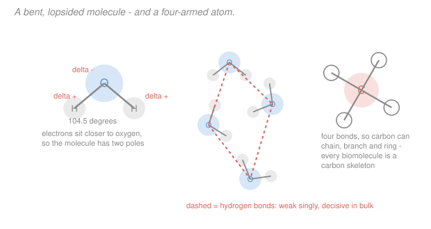

# General Biology · Lesson 1.1: The chemistry of life

> ⏱ ~15 min · Module 1: The cell & the molecules of life · Builds on: nothing — this is the course's first lesson · Unlocks: 1.2 (the four biomolecules)

## Why this matters

Biology is chemistry that got complicated enough to copy itself. Every later idea in this course — enzymes, membranes, DNA, even natural selection — rests on a handful of chemical facts, and two of them do most of the work: **water is lopsided**, and **carbon has four hands**.

This lesson is deliberately quick. You've almost certainly met polar bonds and hydrogen bonding before. What's worth slowing down for is not the chemistry itself but *why life had no real alternative* — why these two facts, and not others, are the ones biology is built on.

## The idea

**Water is a magnet with a bend in it.** Oxygen pulls electrons harder than hydrogen does, so the shared electrons in an O–H bond sit closer to the oxygen. That would be unremarkable if water were a straight line — the two pulls would cancel. But water is bent at about 104.5 degrees, so the pulls *don't* cancel: the oxygen end carries a slight negative charge and the hydrogen ends a slight positive one.

That single asymmetry gives you almost everything. Water molecules stick to each other (**cohesion**), which is why water climbs a tree trunk and why a pond's surface holds an insect. It takes a lot of energy to break all those attractions, so water resists temperature change and moderates climates and cell interiors alike. And because water is charged at both ends, it surrounds and separates other charged things — **it dissolves them**. Life happens in solution because water is a good solvent, and water is a good solvent because it's bent.

The same property sorts the world into two camps: things water welcomes (**hydrophilic** — charged or polar) and things it excludes (**hydrophobic** — nonpolar, mostly hydrocarbon). That sorting isn't a minor detail. It is the reason cell membranes exist at all, and the reason proteins fold into the shapes they do. Water doesn't just host life; it *pushes life into shape*.

**Carbon is the universal connector.** Carbon has four outer electrons and needs four more, so it forms four covalent bonds. Four is the magic number: with two you get only chains, with three you get limited branching, but with four you can build chains, branches, rings, and rings fused to chains — arbitrarily large, arbitrarily specific structures. Carbon also bonds happily to itself with real strength, so those skeletons are stable at the temperatures where water is liquid.

Nothing else on the periodic table combines those two properties as well. That is why every molecule in the rest of this course is a carbon skeleton with things hung off it.

## The formal version

**Electronegativity and bond types.** Electronegativity is an atom's pull on shared electrons. The difference between two bonded atoms sets the bond type:

| Difference | Bond | Example |
|---|---|---|
| large (roughly > 1.7) | **ionic** — electron transferred outright | $\ce{NaCl}$ |
| moderate (~0.4 to 1.7) | **polar covalent** — shared unequally | $\ce{O-H}$ in water |
| small (< 0.4) | **nonpolar covalent** — shared evenly | $\ce{C-H}$, $\ce{C-C}$ |

*In words: how unfairly two atoms share electrons decides whether you get a charged pair, a lopsided bond, or an even one.* Oxygen (3.44) versus hydrogen (2.20) gives 1.24 — solidly polar. Carbon (2.55) versus hydrogen (2.20) gives 0.35 — essentially nonpolar, which is exactly why hydrocarbons are hydrophobic.

**The hydrogen bond.** When a hydrogen already bonded to $\ce{O}$, $\ce{N}$, or $\ce{F}$ is attracted to a nearby lone pair, you get a **hydrogen bond**: about 20 kJ/mol, roughly one-twentieth the strength of the covalent $\ce{O-H}$ bond it hangs off.

*In words: individually weak enough to break at body temperature, but so numerous that in bulk they dominate.* That combination — weak but many — is a recurring theme. It's how DNA's two strands hold together firmly yet can be pried apart by a passing enzyme ([3.3](03-03-dna-structure-replication.md)), and how proteins hold a fold that can still flex ([1.2](01-02-four-biomolecules.md)).

**Water's four consequences**, each traceable to that bent polarity:

1. **Cohesion and adhesion** — water sticks to itself and to polar surfaces. Drives capillary action and water transport in plants.
2. **High specific heat** — breaking hydrogen bonds absorbs energy, so temperature changes slowly. Cells and oceans are thermally buffered.
3. **Solvent power** — polar and ionic solutes get surrounded by a *hydration shell* and dissolve. Biochemistry is aqueous chemistry.
4. **Ice floats** — the hydrogen-bond lattice is more open than the liquid, so solid water is *less dense*. Lakes freeze top-down, and life below survives.

**The hydrophobic effect.** Nonpolar molecules in water aren't repelled by water so much as *excluded* by it: water molecules can hydrogen-bond to each other more freely if the nonpolar intruders are herded together. So oil droplets merge, membranes form spontaneously, and proteins bury their greasy parts inward.

*In words: the "attraction" between hydrophobic things is really water's preference for its own company.* This is the single most underrated force in biology — it builds membranes ([1.3](01-03-cell-theory-two-kinds-of-cell.md)) and folds proteins with no enzyme, no energy input, and no instructions.

**pH, briefly.** Water dissociates slightly, $\ce{H2O <=> H+ + OH-}$, and $\mathrm{pH} = -\log_{10}[\ce{H+}]$ measures the result. Cytoplasm sits near 7.2; the difference matters because charge on a protein — hence its shape — depends on it. See [pH](../reference.md#ph).

## Picture

## Worked examples

**Example 1 (mechanical — will it dissolve?).** Predict whether each dissolves readily in water, and say why.

| Molecule | Verdict | Reason |
|---|---|---|
| Table salt, $\ce{NaCl}$ | **Yes** | Ionic — water's poles surround $\ce{Na+}$ and $\ce{Cl-}$ separately |
| Glucose, $\ce{C6H12O6}$ | **Yes** | Studded with $\ce{-OH}$ groups; each hydrogen-bonds to water |
| Octane, $\ce{C8H18}$ | **No** | Pure $\ce{C-H}$ and $\ce{C-C}$ — nonpolar, excluded |
| A phospholipid | **Both ends disagree** | Polar head dissolves, nonpolar tails don't — see below |

The rule of thumb is "like dissolves like," but the mechanism is worth holding onto: dissolving means water can form *favourable* interactions with the solute, so it happens exactly when the solute is charged or polar.

**Example 2 (why you'd care — the molecule that couldn't decide).** That last row is not a failure of the rule; it's the most important case in biology. A **phospholipid** has a charged phosphate head and two long hydrocarbon tails. Drop a lot of them into water and the tails are excluded while the heads are welcomed — so they arrange themselves tails-inward, heads-outward, into a **bilayer**.

Nothing directs this. No enzyme, no template, no energy input. It's the hydrophobic effect and nothing else, and it produces a sheet that is:

- **self-sealing** — puncture it and the exposed tails are pushed back together,
- **selectively permeable** — nonpolar molecules slip through the greasy middle, charged ones cannot,
- **fluid** — the molecules are held sideways only by weak forces, so the sheet flows.

Those three properties define what a cell *is*: an inside separated from an outside, with controlled traffic between them. **The first step toward life was a chemical accident of water's shape** — and every cell you'll meet in [1.3](01-03-cell-theory-two-kinds-of-cell.md) is wrapped in one.

## Watch out

- **You might think hydrogen bonds are a kind of covalent bond.** They aren't bonds in the electron-sharing sense — no electrons are shared. They're strong electrostatic attractions, about 5 percent the strength of a covalent bond, which is precisely what makes them useful: strong enough to hold, weak enough to release.
- **You might say hydrophobic molecules "hate water."** There is no repulsion. Water is simply better off hydrogen-bonded to itself, and clustering the nonpolar molecules is the arrangement that lets it do so. The driving force is on water's side, not the oil's.
- **You might expect ice to sink.** Almost every substance is denser as a solid. Water's open hydrogen-bond lattice makes ice about 9 percent less dense, which is why ponds don't freeze solid from the bottom and kill everything in them.
- **You might treat carbon as special because it's abundant.** It isn't especially abundant — silicon is far more common in Earth's crust and also forms four bonds. Carbon wins on *bond strength and versatility*: $\ce{C-C}$ bonds are stable in water, $\ce{Si-Si}$ bonds are not, and carbon readily forms double and triple bonds where silicon barely does.

## One-liner

> Water's bend makes it polar, polarity makes it a solvent and a sorter of molecules into wet and greasy, and carbon's four bonds make skeletons complex enough to be worth dissolving.

## Problems

**P1 (🟢)** Rank these by expected water solubility, highest first, and justify each: ammonia ($\ce{NH3}$), methane ($\ce{CH4}$), and potassium chloride ($\ce{KCl}$).

**P2 (🟡)** Sweating cools you far more effectively than the same mass of water simply warming up would suggest. Explain using hydrogen bonding, and connect it to water's high specific heat.

**P3 (🔴)** A synthetic biologist proposes a cell whose membrane is made of molecules that are polar at *both* ends. Predict what happens when these are dropped into water, and explain why no bilayer forms.

Solutions

**P1** Highest to lowest:

1. **$\ce{KCl}$** — ionic. It dissociates completely into $\ce{K+}$ and $\ce{Cl-}$, each surrounded by an oriented hydration shell (water's oxygens face the cation, hydrogens face the anion). Ionic compounds are the most soluble class.
2. **$\ce{NH3}$** — polar covalent. Nitrogen (3.04) versus hydrogen (2.20) gives a difference of 0.84, and the molecule is pyramidal rather than symmetric, so the pulls don't cancel. It both donates and accepts hydrogen bonds, so it is very soluble.
3. **$\ce{CH4}$** — nonpolar. The $\ce{C-H}$ difference is 0.35 and the tetrahedral shape is symmetric, so any small pulls cancel exactly. Essentially insoluble.

*Check.* The ordering tracks the electronegativity-difference table exactly ✓. Note that *both* conditions matter — polar bonds **and** an asymmetric shape. $\ce{CO2}$ has quite polar $\ce{C=O}$ bonds but is linear, so it is only modestly soluble; that fact shows up again in photosynthesis ([2.3](02-03-photosynthesis.md)).

**P2** Two distinct effects, both from hydrogen bonding:

*High specific heat.* Adding heat to liquid water goes partly into breaking hydrogen bonds rather than into molecular motion, so the temperature rises slowly — about 4.18 J per gram per degree, several times most liquids. Water is a thermal buffer.

*High heat of vaporization.* Evaporating requires breaking hydrogen bonds *entirely* so a molecule can escape the liquid, which costs about **2260 J per gram** — roughly 540 times the energy needed to warm that same gram by one degree.

So sweating exploits the far larger effect. The molecules that escape are the highest-energy ones, and they carry that energy away, leaving the remaining water — and the skin under it — cooler.

*Check.* The ratio $2260/4.18 \approx 540$ says evaporating one gram of sweat removes as much heat as cooling 540 grams of water by one degree ✓, which is why a small volume of sweat is so effective.

**P3** Drop them in water and they **dissolve individually** — no membrane forms.

*Why.* A bilayer forms because water *excludes* the nonpolar tails and, in doing so, drives them together; the heads stay in contact with water and the tails are hidden from it. That arrangement is favourable only because there is something water wants to hide. A molecule polar at both ends gives water no reason to sequester anything: every part of it can hydrogen-bond happily to the surrounding water, so the lowest-energy state is fully dispersed solution.

The general principle: **the bilayer is built by the hydrophobic effect, so a membrane lipid must be amphipathic** — polar at one end and nonpolar at the other. Remove either half and the structure has no reason to exist.

*Check.* Test the converse: molecules nonpolar at *both* ends (say, octane) don't form bilayers either — they form a bulk oil droplet, which minimizes contact area but has no defined inside or outside ✓. Only the two-faced molecule produces a *sheet*, and only a sheet can enclose a cell.

## Connections

- **Backward:** nothing — this is the course's starting point. If you want the underlying quantum picture of why electronegativity varies across the periodic table, that's [`general-chemistry` 1.3](../../general-chemistry/lessons/01-03-periodic-trends.md).
- **Forward:** [1.2](01-02-four-biomolecules.md) builds the four macromolecule families on carbon skeletons; [1.3](01-03-cell-theory-two-kinds-of-cell.md) wraps a cell in the bilayer that Example 2 assembled.
- **Sideways (chemistry, go deeper):** this lesson is the two-page version of [`biochemistry` 1.1](../../biochemistry/lessons/01-01-water-ph-buffers.md), which treats water, pH and buffers quantitatively. You don't need it to continue here — but it is where to go when "roughly 20 kJ/mol" stops being enough.
