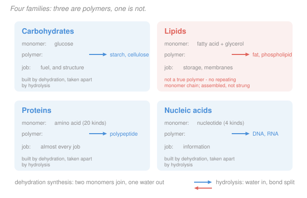

# General Biology · Lesson 1.2: The four biomolecules

> ⏱ ~15 min · Module 1: The cell & the molecules of life · Builds on: [1.1](01-01-chemistry-of-life.md) · Unlocks: 1.3 (cell theory)

## Why this matters

Life uses an astonishingly small parts catalogue. Four families of large molecule, built from a few dozen distinct small ones, account for essentially everything a cell is made of and everything it does. A bacterium and a blue whale run on the same four families with the same chemistry.

The reason to learn them as *families* rather than as a list is that each family's job follows from its structure, and once you see that link you can predict function from a structure you've never seen before — which is exactly what the rest of this course asks you to do.

## The idea

Three of the four families are built the same way: pick a small molecule, string many together into a chain. The chain is a **polymer**, the units are **monomers**, and the joining reaction removes a water molecule (**dehydration synthesis**). Run it backwards by adding water (**hydrolysis**) and the chain comes apart. That single reaction pair builds and dismantles almost every large molecule in you — it's what digestion *is*.

What differs between the families is how much the monomers vary, and that turns out to be the whole story.

- **Carbohydrates** use essentially one monomer (glucose and its close relatives). One repeated unit means the product is a bulk material: fuel to burn, or fibre to build with. Little information, lots of substance.
- **Proteins** use **twenty** different monomers, and can string them in any order. Twenty choices at each of a few hundred positions is an astronomically large space of possible chains, and each chain folds into its own specific three-dimensional shape. Shape is what lets a molecule recognize another molecule — so proteins are the cell's tools, sensors, motors and catalysts.
- **Nucleic acids** use **four**, which is few enough to copy accurately and many enough to encode meaning. They are storage, not machinery.
- **Lipids** break the pattern entirely — they're the odd one out, and worth flagging early. There is no repeating lipid monomer and no lipid "chain". They're defined not by a shared structure but by a shared *behaviour*: they don't dissolve in water. That's a definition by chemistry, not by architecture ([1.1](01-01-chemistry-of-life.md)).

Hold that contrast — **one monomer for bulk, four for information, twenty for machinery, and lipids defined by not dissolving** — and you can reconstruct most of this lesson from scratch.

## The formal version

**The two reactions.** For any polymer family:

$$\text{monomer} + \text{monomer} \xrightarrow{\ \text{dehydration}\ } \text{dimer} + \ce{H2O}, \qquad \text{polymer} + \ce{H2O} \xrightarrow{\ \text{hydrolysis}\ } \text{fragments}$$

*In words: joining costs a water molecule; breaking returns one.* Both need enzymes in practice ([2.1](02-01-energy-atp-enzymes.md)) — left alone, these reactions are far too slow to matter.

### Carbohydrates

**Monomer:** a monosaccharide, most often glucose, $\ce{C6H12O6}$. **Polymer:** a polysaccharide.

| Polymer | Structure | Job |
|---|---|---|
| Starch | glucose, $\alpha$ linkage | plant energy storage |
| Glycogen | glucose, $\alpha$, heavily branched | animal energy storage |
| Cellulose | glucose, $\beta$ linkage | plant cell wall |
| Chitin | modified glucose | fungal walls, insect exoskeleton |

**Starch and cellulose are both pure glucose chains** and differ only in how the linkage is oriented. That tiny geometric difference is why you can digest a potato and not a tree: your enzymes fit $\alpha$ linkages and not $\beta$ ones. *A one-bond change in geometry is the difference between food and furniture* — the clearest early example of structure dictating function.

### Lipids

**No monomer.** Defined by being hydrophobic. Three types matter here:

- **Triglycerides** (fats and oils): glycerol plus three fatty acids. Energy-dense — about 9 kcal/g against 4 for carbohydrate — because they are highly reduced, i.e. rich in $\ce{C-H}$ bonds with a lot of energy to release ([2.2](02-02-cellular-respiration.md)). *Saturated* means no $\ce{C=C}$ double bonds, so the tails pack tightly and the fat is solid; *unsaturated* means kinked tails that can't pack, so it's oil.
- **Phospholipids:** a triglyceride with one fatty acid swapped for a phosphate group, making it **amphipathic** — the membrane-builder from [1.1](01-01-chemistry-of-life.md).
- **Steroids:** four fused rings. Cholesterol tunes membrane fluidity; the sex hormones are chemically small variations on it.

### Proteins

**Monomer:** an amino acid — a central carbon carrying an amino group, a carboxyl group, a hydrogen, and a variable **R group**. Twenty R groups exist, sorted by how they treat water: nonpolar, polar, acidic, basic. **The R groups are the entire source of protein diversity**; everything else is identical.

Monomers link by a **peptide bond** (dehydration between one's carboxyl and the next's amino) to give a polypeptide. Structure comes in four levels:

| Level | What it is | Held by |
|---|---|---|
| Primary | the amino-acid sequence | peptide bonds (covalent) |
| Secondary | local $\alpha$-helices and $\beta$-sheets | hydrogen bonds along the backbone |
| Tertiary | the whole chain's 3D fold | R-group interactions, especially the hydrophobic effect |
| Quaternary | several chains assembled | the same weak forces, between chains |

*In words: sequence determines fold, and fold determines function.* Note what drives tertiary structure — nonpolar R groups get buried inward, away from water, exactly as [1.1](01-01-chemistry-of-life.md) predicted. Heat or extreme pH breaks the weak interactions and the protein **denatures**: the sequence survives, the shape does not, and the function goes with the shape.

### Nucleic acids

**Monomer:** a nucleotide — a five-carbon sugar, a phosphate, and one of a few nitrogenous bases. **Polymer:** DNA or RNA.

| | DNA | RNA |
|---|---|---|
| Sugar | deoxyribose | ribose |
| Bases | A, T, G, C | A, **U**, G, C |
| Strands | double helix | usually single |
| Job | long-term storage | working copy, and some catalysis |

Details wait for [3.3](03-03-dna-structure-replication.md); what matters now is the category — **nucleic acids are the only family whose job is to carry information.**

## Picture

## Worked examples

**Example 1 (mechanical — count the waters).** A protein is 150 amino acids long. How many water molecules were released building it, and how many are consumed digesting it completely back to amino acids?

Each peptide bond joins two units and releases one water. Linking $n$ monomers into one chain takes $n-1$ bonds, so

$$150 - 1 = \mathbf{149}\ \text{water molecules released.}$$

Complete hydrolysis reverses every bond, so **149 water molecules are consumed**.

*The general rule:* a linear polymer of $n$ monomers has $n-1$ bonds. This is why digestion is chemically just "add water, with help" — and why a protein's mass is slightly less than the sum of its amino acids' masses, by 149 water molecules' worth.

**Example 2 (why you'd care — sickle cell, one letter).** Normal haemoglobin has glutamic acid at position 6 of its beta chain. In sickle-cell disease that one amino acid is valine.

Glutamic acid has a **charged, hydrophilic** R group; valine has a **nonpolar, hydrophobic** one. That swap puts a greasy patch on the protein's surface where a water-friendly one belonged. Surface patches like that behave exactly as [1.1](01-01-chemistry-of-life.md) says: water pushes them together. So haemoglobin molecules stick to one another, polymerize into stiff fibres, and deform the red cell into a crescent that jams capillaries.

Trace the causal chain, because this is the shape of nearly every molecular explanation in biology:

$$\text{one DNA base} \to \text{one amino acid} \to \text{one surface patch} \to \text{proteins aggregate} \to \text{cell deforms} \to \text{disease}$$

**One letter changed out of 147, and the sequence-determines-fold-determines-function rule does the rest.** It also explains why the disease persists: carriers with one copy resist malaria, a trade-off you'll meet again as balancing selection in [4.2](04-02-evolution-in-populations.md).

## Watch out

- **You might call lipids polymers.** They aren't. A triglyceride is three fatty acids attached to one glycerol — an assembly, not a chain of repeating units, and there's no way to make it longer by adding more of the same.
- **You might think starch and cellulose differ a lot.** They're both glucose. The difference is the *orientation* of the linkage, and that alone decides digestibility.
- **You might treat denaturation as destruction.** Denaturing breaks the weak interactions holding the fold; the peptide bonds survive intact, so the primary structure is unchanged. A cooked egg white is denatured, not depolymerized.
- **You might expect all twenty amino acids to be chemically exotic.** They differ only in the R group — the backbone is identical in every one. When a textbook says a protein's properties "come from its amino acids," it means the R groups and nothing else.
- **You might read "four bases" as a limitation.** Four symbols at each of millions of positions is ample: the information capacity is $4^n$, and a modest 1000-base gene already has $4^{1000}$ possible sequences.

## One-liner

> Three families are chains built by removing water — one monomer for bulk, four for information, twenty for machinery — and lipids are the exception, defined by refusing to dissolve.

## Problems

**P1 (🟢)** A polysaccharide contains 500 glucose units. How many dehydration reactions built it? How many water molecules are needed to hydrolyse it completely?

**P2 (🟡)** Two proteins have identical amino-acid *composition* (the same count of each of the 20 types) but different sequences. Will they have the same shape and function? Explain.

**P3 (🔴)** A mutation replaces a nonpolar amino acid buried in a protein's core with a charged one. Predict the effect on folding and stability, and contrast it with the sickle-cell mutation, which put a nonpolar residue on the *surface*.

Solutions

**P1** A linear chain of $n$ monomers has $n-1$ bonds:

$$500 - 1 = \mathbf{499}\ \text{dehydration reactions}, \qquad \mathbf{499}\ \text{water molecules to hydrolyse it}.$$

*Check.* Every bond formed released one water and every bond broken consumes one, so the two numbers must match ✓. (A *branched* polymer like glycogen still obeys $n-1$: each added monomer needs exactly one new bond regardless of where it attaches — branching changes the shape, not the bond count.)

**P2** **No — different sequences give different shapes and, almost certainly, different functions.**

Composition says *which* R groups are present; sequence says *where*. Folding is driven by which R groups end up near each other — nonpolar ones burying together away from water, oppositely charged ones pairing, specific pairs hydrogen-bonding. Rearranging the order completely rearranges those contacts, so the chain settles into a different fold.

The concrete way to see it: a protein folds so that hydrophobic residues sit in the core. Whether a given residue *can* reach the core depends on its position along the chain and what its neighbours do. Move it and it may be stranded on the surface, destabilizing the fold or preventing it.

*Check.* Example 2 is the extreme case of this principle — there the composition changed by exactly one residue, and even that was enough ✓. Composition is a weak constraint; sequence is the real specification, which is why DNA stores a *sequence* and not a recipe of proportions.

**P3** **Burying a charge is far more destabilizing than exposing a greasy patch.**

*The core mutation.* The protein's interior is a nonpolar environment with no water available. A charged R group placed there cannot be solvated — there is nothing to stabilize its charge — which costs a great deal of energy. Three outcomes are possible, all bad:

1. the protein folds anyway but is badly destabilized and unfolds easily;
2. it distorts locally to drag the charge toward the surface, wrecking the geometry of any nearby active site;
3. it fails to fold at all and gets degraded by the cell.

*The contrast with sickle cell.* There the mutation put a **nonpolar residue on the surface**, where water is present. That is unfavourable but only mildly so — the protein still folds correctly and still carries oxygen normally. The damage is not to the individual molecule but to how molecules *interact*: the exposed patch makes them stick together at high concentration.

**The general lesson: core mutations break the protein; surface mutations break its relationships.** Core positions are therefore far more conserved across species than surface ones — which is exactly the pattern you'd use to infer common descent in [4.3](04-03-tree-of-life.md).

*Check.* Consistent with the hydrophobic effect ([1.1](01-01-chemistry-of-life.md)): the cost of exposing a nonpolar group to water is modest and local, while the cost of burying a charge with no water to solvate it is large ✓.

## Connections

- **Backward:** the hydrophobic effect from [1.1](01-01-chemistry-of-life.md) is what folds proteins and assembles membranes; the dehydration/hydrolysis pair is the polar chemistry of that lesson applied over and over.
- **Forward:** [1.3](01-03-cell-theory-two-kinds-of-cell.md) builds the cell out of these four families; [2.1](02-01-energy-atp-enzymes.md) is entirely about one class of protein; [3.4](03-04-central-dogma.md) shows how a nucleic-acid sequence specifies a protein sequence.
- **Sideways (chemistry, go deeper):** each family has a full treatment waiting — [`biochemistry` 1.2](../../biochemistry/lessons/01-02-amino-acids-peptide-bond.md) and [1.3](../../biochemistry/lessons/01-03-four-levels-protein-structure.md) for proteins, [3.1](../../biochemistry/lessons/03-01-carbohydrates-structure-storage.md) for carbohydrates, [4.1](../../biochemistry/lessons/04-01-lipids-fatty-acids-triacylglycerols-sterols.md) for lipids, [4.4](../../biochemistry/lessons/04-04-nucleic-acids-dna-rna-structure.md) for nucleic acids. Nothing here depends on them.
