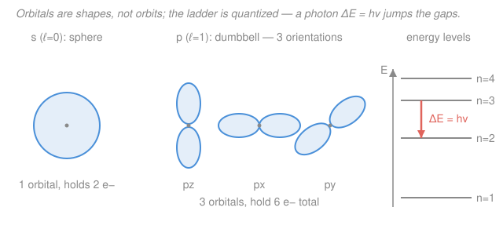

# General Chemistry · Lesson 1.1: The Quantum Atom

> ⏱ ~15 min · Module 1: Atoms, the Periodic Table & Bonding · Builds on: first lesson of the course — no prerequisites · Unlocks: [1.2 Electron configurations & the periodic table](01-02-electron-configurations-periodic-table.md)

## Why this matters

Every fact chemistry will hand you — why sodium is soft and violently reactive while neon does nothing, why water bends, why a flame test glows a specific color — is bookkeeping on where electrons live and how much energy it takes to move them. That bookkeeping runs on one non-negotiable idea: electrons are quantum. They don't orbit like planets and they can't sit at just any energy. Get the atom's floor plan right here and the entire periodic table becomes readable in [1.2](01-02-electron-configurations-periodic-table.md). Get it wrong and you'll be memorizing forever.

## The idea

An atom is a dense, tiny **nucleus** — protons and neutrons packed together — surrounded by a fuzzy **cloud** of electrons. The nucleus carries essentially all the mass but almost none of the volume: if the atom were a stadium, the nucleus would be a marble at center field and the electrons a haze in the stands. The atom is mostly empty space.

Three particles, three jobs. **Protons** carry charge $+1$ and their count — the **atomic number** $Z$ — *is* the element's identity: 6 protons is carbon, always. **Neutrons** are neutral and add mass; change their number and you get a different **isotope** of the same element. **Electrons** carry charge $-1$, weigh almost nothing, and do all the chemistry.

Now the quantum twist. An electron is not a dot on a track; it's a smeared-out probability cloud, and it can only hold certain discrete amounts of energy — like stairs, not a ramp. It sits on one "step," and the only way up or down is to swallow or spit out a photon whose energy exactly matches the gap. That's why heated elements emit sharp, specific colors (line spectra) instead of a smooth rainbow: each line is one electron falling a fixed number of steps.

## The formal version

**The nucleus and isotopes.** Two integers pin down any nucleus:

$$Z = \text{number of protons (atomic number)}, \qquad A = Z + N \ \text{(mass number)},$$

where $N$ is the neutron count. *In words: $Z$ names the element; $A$ counts the heavy particles (protons + neutrons).* A neutral atom has as many electrons as protons, so electrons $= Z$. We write a nuclide as $\ce{^{A}_{Z}X}$, e.g. $\ce{^{12}_{6}C}$. **Isotopes** share $Z$ but differ in $N$ (hence $A$): $\ce{^{12}C}$ and $\ce{^{14}C}$ are both carbon, with 6 and 8 neutrons. Masses are quoted in **atomic mass units** (1 amu $\approx$ the mass of one proton or neutron). Because a real sample is a mix of isotopes, the **average atomic mass** on the periodic table is the abundance-weighted average:

$$\bar{m} = \sum_i f_i\, m_i, \qquad \sum_i f_i = 1,$$

with $f_i$ the fractional abundance and $m_i$ the mass of isotope $i$. *In words: weight each isotope's mass by how common it is.*

**Quantized energy.** An electron bound to an atom can occupy only a discrete set of energy levels $E_1 < E_2 < E_3 < \cdots$. A jump between two of them requires a photon carrying exactly the energy difference:

$$\Delta E = h\nu = \frac{hc}{\lambda},$$

where $h = 6.626\times10^{-34}\ \mathrm{J\,s}$ is Planck's constant, $\nu$ the photon frequency (Hz), $\lambda$ its wavelength (m), and $c = 3.00\times10^8\ \mathrm{m/s}$. *In words: only photons whose energy matches a gap get absorbed or emitted — everything else passes through.* This is not a model quirk; it is the reason atomic spectra are a barcode. The energy levels themselves are the **standing-wave solutions of the hydrogen atom** you'll derive in the quantum-mechanics course — see its [syllabus](../../quantum-mechanics/syllabus.md). An electron confined near a nucleus is like a guitar string clamped at both ends: only certain wave patterns "fit," and each allowed pattern is one energy level.

**Quantum numbers — the electron's address.** Each electron in an atom is labeled by four numbers (intuition first, full machinery in quantum mechanics):

- **Principal** $n = 1, 2, 3, \ldots$ — the **shell**: sets size and roughly the energy. Bigger $n$ = bigger, higher-energy cloud, farther from the nucleus.
- **Angular momentum** $\ell = 0, 1, \ldots, n-1$ — the **subshell**, which fixes the *shape*. By tradition $\ell = 0,1,2$ are named **s, p, d**.
- **Magnetic** $m_\ell = -\ell, \ldots, 0, \ldots, +\ell$ — the *orientation* of that shape in space. There are $2\ell + 1$ choices, one per **orbital**.
- **Spin** $m_s = \pm\tfrac12$ — the electron's own two-way "up/down" degree of freedom.

An **orbital** is one $(n,\ell,m_\ell)$ region where an electron is likely found, and it holds **exactly 2 electrons** (one spin up, one down). Counting orbitals per subshell from $2\ell+1$:

$$\underbrace{\text{s}}_{\ell=0}:\ 1\ \text{orbital} \to 2\,e^-, \qquad \underbrace{\text{p}}_{\ell=1}:\ 3 \to 6\,e^-, \qquad \underbrace{\text{d}}_{\ell=2}:\ 5 \to 10\,e^-.$$

## Picture

The shapes track $\ell$: **s** is a sphere (one way to orient a ball — 1 orbital), **p** is a dumbbell with three perpendicular orientations ($p_x, p_y, p_z$ — 3 orbitals), and **d** is a cloverleaf with five. On the right, the rungs are the allowed energies; they crowd together as $n$ grows, and the coral arrow is an electron dropping a rung and emitting a photon of exactly the gap's energy.

## Worked examples

**Example 1 (read the symbol, then average).** Take $\ce{^{37}Cl}$. Chlorine's atomic number is $Z = 17$, so it has **17 protons** and, being neutral, **17 electrons**; neutrons are $N = A - Z = 37 - 17 = 20$. Now suppose a chlorine sample is 75.77% $\ce{^{35}Cl}$ (mass 34.969 amu) and 24.23% $\ce{^{37}Cl}$ (mass 36.966 amu). The average atomic mass is

$$\bar{m} = (0.7577)(34.969) + (0.2423)(36.966) = 26.50 + 8.96 = 35.45\ \mathrm{amu},$$

matching the 35.45 printed under Cl on the periodic table. Note it lands *below* 36 — the lighter isotope dominates.

**Example 2 (a spectral line is a subtraction).** Sodium streetlamps glow amber because excited sodium atoms drop between two specific levels, emitting $\lambda = 589\ \mathrm{nm}$ light. The energy released per photon is

$$\Delta E = \frac{hc}{\lambda} = \frac{(6.626\times10^{-34})(3.00\times10^8)}{589\times10^{-9}} = 3.37\times10^{-19}\ \mathrm{J}.$$

That single number is the *gap* between two of sodium's energy rungs. Change the element and you change the ladder spacing, hence the color — which is exactly how astronomers read the composition of stars they'll never touch.

## Watch out

- **You might picture electrons orbiting like planets.** They don't — an orbital is a *probability cloud*, a fuzzy region, not a path. "Where is the electron right now?" has no sharp answer; only "how likely is it here?" does.
- **You might confuse mass number $A$ with atomic mass.** $A = Z + N$ is a whole-number count of nucleons for *one* nuclide; the periodic-table value (e.g. 35.45 for Cl) is a *weighted average over isotopes* and is rarely a whole number.
- **You might think any photon can bump an electron up.** Only one matching a gap works. Too little energy and nothing happens; the wrong energy passes straight through. This all-or-nothing matching is what "quantized" buys you.
- **You might expect a subshell to be one blob.** A p subshell is *three* separate dumbbells ($p_x,p_y,p_z$); a d subshell is *five* orbitals. More orbitals means more room: s holds 2 electrons, p holds 6, d holds 10.

## One-liner

> An atom is a mass-heavy nucleus ($Z$ protons set the element, $A=Z+N$) wrapped in electrons that live in shaped, quantized orbitals — and only a photon with $\Delta E = h\nu$ can move one between levels.

## Problems

**P1 (🟢)** (a) For carbon-14, $\ce{^{14}C}$, state the number of protons, neutrons, and electrons. (b) Boron occurs as $\ce{^{10}B}$ (mass 10.013 amu, 19.9% abundance) and $\ce{^{11}B}$ (mass 11.009 amu, 80.1% abundance). Compute boron's average atomic mass.

**P2 (🟡)** Consider the **3d** subshell. State the principal quantum number $n$, the subshell letter and its $\ell$ value, the number of orbitals, and the maximum number of electrons it can hold.

**P3 (🔴)** In a hydrogen atom, an electron falls from the $n=3$ level to the $n=2$ level, emitting red light of wavelength $\lambda = 656\ \mathrm{nm}$ (the Balmer $\text{H}_\alpha$ line). Find the photon's energy in joules using $E = hc/\lambda$, and explain what that number represents in the quantized-level picture. Use $h = 6.626\times10^{-34}\ \mathrm{J\,s}$, $c = 3.00\times10^8\ \mathrm{m/s}$.

Solutions

**P1** (a) Carbon has $Z = 6$, so **6 protons** and (neutral) **6 electrons**. The mass number is $A = 14$, so neutrons $= A - Z = 14 - 6 = \mathbf{8}$.

(b) Weight each isotope mass by its fractional abundance:

$$\bar{m} = (0.199)(10.013) + (0.801)(11.009) = 1.993 + 8.818 = 10.81\ \mathrm{amu}.$$

*Check.* The result sits between 10.013 and 11.009 and leans toward 11 because $\ce{^{11}B}$ is far more abundant — and 10.81 is indeed the periodic-table value for boron. ✓

**P2** The leading digit is $n$, the letter is the subshell:
- Principal quantum number: $n = 3$.
- Subshell: **d**, which means $\ell = 2$.
- Number of orbitals: $2\ell + 1 = 2(2) + 1 = 5$.
- Maximum electrons: $2 \times 5 = 10$.

*Check.* The d block of the periodic table is exactly 10 columns wide — that is these 10 electrons. ✓

**P3** Apply $E = hc/\lambda$ with $\lambda = 656\ \mathrm{nm} = 656\times10^{-9}\ \mathrm{m}$:

$$E = \frac{(6.626\times10^{-34})(3.00\times10^8)}{656\times10^{-9}} = \frac{1.988\times10^{-25}}{6.56\times10^{-7}} = 3.03\times10^{-19}\ \mathrm{J}.$$

That energy is precisely the **gap between the $n=3$ and $n=2$ energy levels** of hydrogen, $\Delta E = E_3 - E_2$. The electron can only shed energy in this fixed lump, so it emits exactly one photon of exactly this energy — producing a single sharp red line rather than a smear. Every hydrogen atom in the universe emits *this same* wavelength for this jump, which is why the Balmer series is a fixed fingerprint.

*Check.* Converting, $3.03\times10^{-19}\ \mathrm{J} \div (1.602\times10^{-19}\ \mathrm{J/eV}) \approx 1.89\ \mathrm{eV}$, the textbook value for the $\text{H}_\alpha$ line. Units: $(\mathrm{J\,s})(\mathrm{m/s})/\mathrm{m} = \mathrm{J}$ ✓. ✓

## Connections

- **Forward:** [1.2 Electron configurations & the periodic table](01-02-electron-configurations-periodic-table.md) fills these orbitals in energy order, and the resulting pattern *is* the shape of the periodic table — periods are shells, blocks are subshells. The s/p/d capacities (2/6/10) you counted here become the widths of its blocks.
- **Sideways (quantum mechanics):** the discrete energy levels and orbital shapes aren't postulated here for convenience — they fall out of solving the hydrogen atom as a confined standing wave, the centerpiece of the quantum-mechanics course ([syllabus](../../quantum-mechanics/syllabus.md)). The quantum numbers $n, \ell, m_\ell$ are the labels on those solutions.
- **Sideways (light & energy):** $\Delta E = h\nu$ ties chemistry to photons and spectroscopy; the same relation governs why molecules absorb specific colors, the basis for reading composition from emitted or absorbed light.
