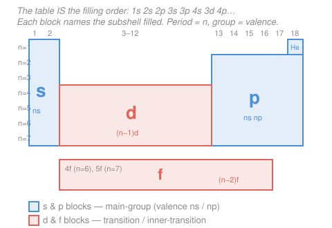

# General Chemistry · Lesson 1.2: Electron Configurations & the Periodic Table

> ⏱ ~15 min · Module 1: Atoms, the Periodic Table & Bonding · Builds on: [1.1 The Quantum Atom](01-01-quantum-atom.md) · Unlocks: [1.3 Periodic Trends](01-03-periodic-trends.md)

## Why this matters

Almost everything an atom *does* chemically — the bonds it forms, the ions it prefers, its color, its magnetism — is set by how its electrons are arranged. Lesson 1.1 gave you the orbitals ($s, p, d, f$) as the allowed homes for electrons. This lesson is the seating chart: which electrons sit where, and why. The payoff is huge and slightly magical — once you know the filling rules, the entire periodic table stops being a memorized grid and becomes a *picture of the rules themselves*. The table's shape is not a coincidence of history; it is literally the order in which orbitals fill.

## The idea

Electrons filling an atom behave like guests taking seats in a theater with tiered pricing: **cheap seats first**. Each orbital is a "seat" at a certain energy, and electrons pile into the lowest-energy ones available before touching anything higher. That is the whole game — with two etiquette rules layered on top. First, no seat holds more than two people, and those two must "face opposite ways" (opposite spins). Second, when a row of equal-price seats is open, people spread out one-per-seat before anyone doubles up — nobody shares until they have to.

The surprise from Lesson 1.1's hydrogen picture is that once you add more than one electron, the energy ladder stops being simple. The $4s$ orbital sinks *below* $3d$, so it fills first. That single re-ordering is what creates the transition metals and gives the table its distinctive blocky shape. Get the fill order right and configurations write themselves.

## The formal version

An **electron configuration** lists the occupied subshells with the number of electrons in each as a superscript, e.g. $\ce{Fe}$: $1s^2\,2s^2\,2p^6\,3s^2\,3p^6\,4s^2\,3d^6$. Three rules build it.

**1. Aufbau principle ("building-up").** Fill orbitals from lowest energy upward. For multi-electron atoms the order is
$$1s\ 2s\ 2p\ 3s\ 3p\ 4s\ 3d\ 4p\ 5s\ 4d\ 5p\ 6s\ 4f\ 5d\ 6p\ 7s\ 5f\ 6d\ 7p.$$
*In words: put each new electron in the cheapest empty seat.* The mnemonic: write the subshells in a grid by $n$ and read the **diagonals** (arrows) top-right to bottom-left —

$$
\begin{array}{lllll}
1s & & & &\\
2s & 2p & & &\\
3s & 3p & 3d & &\\
4s & 4p & 4d & 4f &\\
5s & 5p & 5d & 5f &\\
6s & 6p & \cdots & &\\
\end{array}
$$

Read each diagonal ($1s$; then $2s$; then $2p,3s$; then $3p,4s$; then $3d,4p,5s$; …) and you recover the order above — this is why $4s$ beats $3d$.

**2. Pauli exclusion principle.** No two electrons in an atom share all four quantum numbers, so each orbital holds **at most 2 electrons, with opposite spins** ($\uparrow\downarrow$). *In words: a seat holds two, and they must spin opposite ways.* This is what caps $s$ at 2, $p$ at 6, $d$ at 10, $f$ at 14 (each subshell has $2\ell+1$ orbitals, each holding 2).

**3. Hund's rule.** Within a set of **degenerate** (equal-energy) orbitals — the three $p$'s, five $d$'s — add electrons **one per orbital with parallel spins** before pairing any up. *In words: everyone gets their own seat before anyone shares, and the singles all spin the same way.* Reason: electrons repel, so spreading out lowers energy.

**Core vs. valence.** The **noble-gas core** is the configuration of the nearest preceding noble gas, abbreviated in brackets; the rest are **valence** electrons — the chemically active outer electrons. So $\ce{Fe}$ becomes $[\ce{Ar}]\,4s^2\,3d^6$. **Valence electrons** are those in the highest occupied principal level $n$ (plus a partly filled $d$ for transition metals) — they do the bonding.

An **orbital-box diagram** draws each orbital as a box and each electron as an arrow, making Hund's rule visible. For the valence shell of nitrogen ($2p^3$):
$$2p:\ \boxed{\uparrow}\ \boxed{\uparrow}\ \boxed{\uparrow}\qquad(\text{not } \boxed{\uparrow\downarrow}\ \boxed{\uparrow}\ \boxed{\ })$$

## Picture

The table is just the fill order wrapped into rows. Start at H, sweep left-to-right across each period, drop to the next, and you trace $1s \to 2s \to 2p \to \dots$ exactly. **Each block tells you which subshell is filling:** groups 1–2 fill $ns$ (s-block), groups 13–18 fill $np$ (p-block), the middle 10 columns fill $(n-1)d$ (d-block, the transition metals), and the two bottom rows fill $(n-2)f$ (f-block). The **period number is the highest $n$**; for main-group elements the **group number gives the valence-electron count** (groups 1–2 → 1–2 valence $e^-$; groups 13–18 → 3–8).

## Worked examples

**Example 1 (mechanical — build a configuration).** Iron, $\ce{Fe}$, $Z = 26$. Walk the Aufbau order, stopping when the electrons run out:
$$1s^2\,2s^2\,2p^6\,3s^2\,3p^6\ (=18,\ \text{the }\ce{Ar}\text{ core})\ \underbrace{4s^2}_{20}\ \underbrace{3d^6}_{26}.$$
Full: $1s^2\,2s^2\,2p^6\,3s^2\,3p^6\,4s^2\,3d^6$. Shorthand: $[\ce{Ar}]\,4s^2\,3d^6$. The $3d^6$ box diagram, by Hund, is $\boxed{\uparrow\downarrow}\,\boxed{\uparrow}\,\boxed{\uparrow}\,\boxed{\uparrow}\,\boxed{\uparrow}$ — four unpaired electrons, which is exactly why iron is magnetic.

**Example 2 (why you'd care — ions and stability).** To make $\ce{Fe^2+}$, remove **the highest-$n$ electrons first** — and $4s$ ($n=4$) outranks $3d$ ($n=3$), so the $4s$ electrons leave *before* any $3d$, even though $4s$ filled first:
$$\ce{Fe^2+} = [\ce{Ar}]\,3d^6 \quad(\text{remove } 4s^2),\qquad \ce{Fe^3+} = [\ce{Ar}]\,3d^5 \ (\text{then one } 3d).$$
Note $\ce{Fe^3+}$ lands on a **half-filled** $3d^5$ — every $d$ orbital singly occupied — which is unusually stable and part of why $\ce{Fe^3+}$ is so common in nature (rust, hemoglobin). Removing electrons from a full $4s$ before a lower $3d$ is the single most-missed point in configurations; the "fill order" and the "remove order" are not the same list.

## Watch out

- **You might think you remove $3d$ before $4s$ in cations because $4s$ filled last.** Backwards. You *fill* $4s$ before $3d$, but once both are occupied the $4s$ electrons are higher in $n$ and further out, so they **leave first**. $\ce{Fe^2+}$ is $[\ce{Ar}]3d^6$, never $[\ce{Ar}]4s^2 3d^4$.
- **You might write $\ce{Cr}$ as $[\ce{Ar}]4s^2 3d^4$ and $\ce{Cu}$ as $[\ce{Ar}]4s^2 3d^9$.** Both are wrong by one electron. The real configs are $\ce{Cr}=[\ce{Ar}]4s^1 3d^5$ and $\ce{Cu}=[\ce{Ar}]4s^1 3d^{10}$: an electron promotes from $4s$ to $3d$ because a **half-filled** ($3d^5$) or **fully filled** ($3d^{10}$) $d$ subshell is extra-stable and the $4s$–$3d$ gap is tiny. These two anomalies are worth memorizing.
- **You might double up in $p$ or $d$ orbitals too early.** Hund's rule: singly fill all degenerate orbitals first. Carbon's $2p^2$ is $\boxed{\uparrow}\,\boxed{\uparrow}\,\boxed{\ }$ (two unpaired), not $\boxed{\uparrow\downarrow}\,\boxed{\ }\,\boxed{\ }$.

## One-liner

> Fill cheapest orbitals first ($1s2s2p3s3p4s3d\dots$), two-per-seat opposite-spin, spread out before pairing — and the periodic table is nothing but that fill order drawn as a grid.

## Problems

**P1 (🟢)** Write both the full and noble-gas-core electron configurations for sulfur ($\ce{S}$, $Z=16$), calcium ($\ce{Ca}$, $Z=20$), and bromine ($\ce{Br}$, $Z=35$). State how many valence electrons each has.

**P2 (🟡)** Write the noble-gas-core configurations of the ions $\ce{Fe^3+}$, $\ce{O^2-}$, and $\ce{Ca^2+}$. Which of these three is **isoelectronic** with a noble gas, and which noble gas? Name one more species isoelectronic with $\ce{O^2-}$.

**P3 (🔴)** An element's configuration ends in $\dots 4s^2\,3d^{10}\,4p^3$. Identify it: give its period, group, block, and number of valence electrons. Then explain, in terms of subshell stability, why copper is $[\ce{Ar}]4s^1 3d^{10}$ rather than the "expected" $[\ce{Ar}]4s^2 3d^9$.

Solutions

**P1.**
- $\ce{S}$, $Z=16$: $1s^2\,2s^2\,2p^6\,3s^2\,3p^4 = [\ce{Ne}]\,3s^2\,3p^4$. Valence = $3s^2 3p^4$ → **6** valence electrons (group 16). ✓ (electron count $10+2+4=16$)
- $\ce{Ca}$, $Z=20$: $1s^2\,2s^2\,2p^6\,3s^2\,3p^6\,4s^2 = [\ce{Ar}]\,4s^2$. Valence = $4s^2$ → **2** (group 2). ✓ ($18+2=20$)
- $\ce{Br}$, $Z=35$: $1s^2\,2s^2\,2p^6\,3s^2\,3p^6\,4s^2\,3d^{10}\,4p^5 = [\ce{Ar}]\,4s^2\,3d^{10}\,4p^5$. Valence = $4s^2 4p^5$ (the filled $3d$ is core-like for a main-group element) → **7** (group 17). ✓ ($18+2+10+5=35$)

**P2.**
- $\ce{Fe}=[\ce{Ar}]4s^2 3d^6$. Remove 3 electrons, highest-$n$ first: strip $4s^2$, then one $3d$ → $\ce{Fe^3+}=[\ce{Ar}]\,3d^5$ (a stable half-filled $d$). It has $23$ electrons — not a noble-gas count.
- $\ce{O}=1s^2 2s^2 2p^4$. Anions **add** electrons toward the next noble gas: add 2 → $\ce{O^2-}=1s^2 2s^2 2p^6=[\ce{Ne}]$. ($10$ electrons.)
- $\ce{Ca}=[\ce{Ar}]4s^2$. Remove $4s^2$ → $\ce{Ca^2+}=[\ce{Ar}] = 1s^2 2s^2 2p^6 3s^2 3p^6$. ($18$ electrons.)

Isoelectronic = same number of electrons. $\ce{Ca^2+}$ has 18 electrons → **isoelectronic with argon, $\ce{Ar}$** (and with $\ce{K+}$, $\ce{Cl-}$). $\ce{O^2-}$ has 10 electrons, matching neon; one more species isoelectronic with it: **$\ce{F-}$** (also $\ce{Na+}$, $\ce{Mg^2+}$, or $\ce{Ne}$ itself). ✓

**P3.** Count electrons: $[\ce{Ar}]=18$, plus $4s^2 (2) + 3d^{10}(10) + 4p^3(3) = 15$, so $Z = 33$ → **arsenic, $\ce{As}$**.
- **Period 4** (highest principal number is $n=4$).
- **p-block** (the last electrons fill $4p$).
- **Group 15** (main-group group number = valence electrons + 10 for the p-block: valence $4s^2 4p^5$… careful — valence is $4s^2 4p^3 = 5$; p-block group $= 12 + \#\,p\text{-electrons} = 12+3 = 15$).
- **Valence electrons = 5** ($4s^2 4p^3$; the filled $3d^{10}$ is treated as core for a main-group atom).

Copper anomaly: the "expected" $[\ce{Ar}]4s^2 3d^9$ is beaten by $[\ce{Ar}]4s^1 3d^{10}$ because a **completely filled** $3d^{10}$ subshell is a low-energy, extra-stable arrangement (maximized exchange stabilization among the ten $d$ electrons). Since the $4s$ and $3d$ energies are very close, promoting one $4s$ electron into $3d$ to *complete* the $d$ subshell lowers the atom's total energy. The same logic gives chromium $[\ce{Ar}]4s^1 3d^5$ (a stable half-filled $3d^5$). ✓

## Connections

- **Backward:** the orbitals being filled here — $s, p, d, f$ with capacities $2, 6, 10, 14$ — are exactly the quantum-number solutions from [1.1 The Quantum Atom](01-01-quantum-atom.md); those same shapes are the hydrogen-atom wavefunctions you meet again in quantum mechanics (see the [quantum-mechanics](../../quantum-mechanics/syllabus.md) syllabus). Pauli exclusion and electron spin are the quantum-statistics facts underneath the whole seating chart.
- **Forward:** [1.3 Periodic Trends](01-03-periodic-trends.md) reads atomic size, ionization energy, and electronegativity straight off these configurations — every trend is a story about valence electrons and effective nuclear charge. Valence-electron counts feed directly into Lewis structures and bonding in [1.4](01-04-ionic-covalent-bonds-lewis-structures.md).
- **Sideways:** the "fill lowest energy first" logic is the zero-temperature limit of the Boltzmann/Fermi occupation you meet in statistical mechanics — electrons pack the lowest available energy states, and Pauli exclusion (two per orbital) is precisely what makes them *fermions* rather than piling into one ground state.
