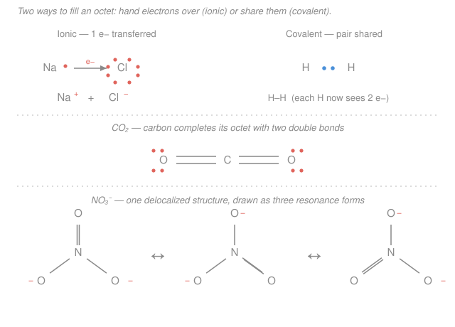

# General Chemistry · Lesson 1.4: Ionic & Covalent Bonds and Lewis Structures

> ⏱ ~15 min · Module 1: Atoms, the Periodic Table & Bonding · Builds on: [1.3 Periodic Trends](01-03-periodic-trends.md) · Unlocks: [1.5 Molecular Shape: VSEPR, Hybridization & MO](01-05-molecular-shape-vsepr-hybridization-mo.md)

## Why this matters

Everything past this lesson — shapes, polarity, reactions, acids, energetics — is bookkeeping on where the valence electrons went. A bond is just two atoms settling their electron accounts to look like a noble gas, and there are only two ways to do it: **give electrons away** or **share them**. Lewis structures are the napkin sketch that tracks that settlement, and once you can draw one you can read a molecule's geometry, its reactive sites, and its dipole straight off the page. This is the single most reused skill in the course, and it feeds Boss Problem 1 directly.

## The idea

Atoms in [1.3](01-03-periodic-trends.md) came with a personality number: **electronegativity** $\chi$, how hard an atom pulls on shared electrons. A bond is a tug-of-war, and the *mismatch* in pull, $\Delta\chi = |\chi_A - \chi_B|$, decides what kind of bond you get.

- **Huge mismatch** (a hungry nonmetal meets a generous metal): the strong puller just *takes* the electron outright. One atom becomes a positive ion (cation), the other negative (anion), and they stick by plain electrostatic attraction. That's an **ionic bond** — think $\ce{NaCl}$, sodium handing its lone valence electron to chlorine.
- **No mismatch** (two identical atoms, or near-twins): neither wins, so they **share** the pair equally down the middle. That's a **nonpolar covalent bond** — $\ce{H2}$, $\ce{Cl2}$.
- **In between**: they share, but *unevenly* — the electron pair spends more time near the stronger puller, leaving it slightly negative ($\delta-$) and its partner slightly positive ($\delta+$). That's a **polar covalent bond**, the most common kind — the $\ce{O-H}$ bonds in water.

So it isn't "ionic vs. covalent" as two boxes; it's a **spectrum** dialed by $\Delta\chi$. And the goal every atom is chasing is the same: a full outer shell, usually **eight** valence electrons.

## The formal version

**The octet rule.** Main-group atoms gain, lose, or share electrons to reach **8 valence electrons** — the stable noble-gas configuration from [1.2](01-02-electron-configurations-periodic-table.md). *In words: atoms want a full outer shell.* Hydrogen is the exception: it's happy at **2** (a full $1s$).

**The bonding spectrum by $\Delta\chi$** (Pauling scale; treat cutoffs as guidelines, not laws):

| $\Delta\chi$ | Bond type | What happens | Example |
|---|---|---|---|
| $\gtrsim 1.7$ | Ionic | electron **transferred**; ions form | $\ce{NaCl}$ ($\Delta\chi \approx 2.1$) |
| $0.4$–$1.7$ | Polar covalent | shared **unequally**; $\delta+/\delta-$ | $\ce{H2O}$ ($\Delta\chi \approx 1.2$) |
| $< 0.4$ | Nonpolar covalent | shared **equally** | $\ce{Cl2}$ ($\Delta\chi = 0$) |

*In words: the bigger the electronegativity gap, the more one-sided the electrons, until at large gaps the sharing stops entirely and becomes a handoff.*

**Drawing a Lewis structure — the algorithm.** A Lewis structure shows every valence electron as either a **bonding pair** (a line) or a **lone pair** (two dots).

1. **Count total valence electrons.** Sum each atom's group number of valence electrons. Add one per unit of negative charge; subtract one per unit of positive charge.
2. **Pick the central atom:** the *least* electronegative one (it shares most willingly). Never hydrogen — H makes only one bond.
3. **Connect** the central atom to each terminal atom with a **single bond** (one shared pair = 2 electrons).
4. **Complete the octets of the terminal atoms** with lone pairs.
5. **Put any leftover electrons** as lone pairs on the central atom.
6. **If the central atom is short of an octet, form multiple bonds** by converting a terminal lone pair into a second (or third) shared pair.

**Formal charge (FC)** — the tiebreaker for "which drawing is best":

$$\mathrm{FC} = (\text{valence electrons}) - (\text{lone-pair electrons}) - \tfrac12(\text{bonding electrons}).$$

*In words: count how many electrons an atom "owns" in the drawing (all its lone-pair electrons plus half of every bond it's in) and compare to how many it brought.* The best structure has formal charges **closest to zero**, and any negative formal charge sitting on the **most electronegative** atom. Formal charges must sum to the overall charge of the species.

**Resonance.** When the algorithm gives two or more *equivalent* valid structures that differ only in where a multiple bond / lone pair sits (e.g. $\ce{NO3-}$, $\ce{O3}$), the real molecule is **none of them** — it's the **delocalized average**, with the bonding spread evenly over all positions. We draw the set connected by double-headed arrows $\leftrightarrow$; each drawing is a "resonance form," not a real flickering state.

**Octet exceptions** (know these three):

- **Incomplete octets:** $\ce{B}$ and $\ce{Be}$ are content with fewer — $\ce{BF3}$ leaves boron with 6, $\ce{BeCl2}$ with 4.
- **Odd-electron radicals:** an odd total can't pair up fully — $\ce{NO}$ has 11 valence electrons, one unpaired.
- **Expanded octets:** central atoms in **period 3 or below** ($\ce{P}$, $\ce{S}$, $\ce{Cl}$, $\ce{Xe}$…) can hold **more than 8** by using low-lying $d$-orbitals — $\ce{PCl5}$ (10 around P), $\ce{SF6}$ (12 around S), $\ce{SF4}$ (10 around S, previewing Boss Problem 1).

## Picture

The top row contrasts the two settlements: sodium *hands over* its electron (coral) to become $\ce{Na+}$ and $\ce{Cl-}$, while the two hydrogens *split* a pair (blue) down the middle. The middle shows $\ce{CO2}$, where carbon needs two double bonds to reach its octet. The bottom shows $\ce{NO3-}$ as three equivalent resonance forms — the double bond (and the two $-1$ charges) rotate around the three oxygens, so in reality each $\ce{N-O}$ bond is identical and one-third double.

## Worked examples

**Example 1 (mechanical — $\ce{CO2}$, running the algorithm).**

1. **Count:** $\ce{C}$ has 4 valence electrons, each $\ce{O}$ has 6, so total $= 4 + 2(6) = 16$.
2. **Central atom:** carbon ($\chi \approx 2.5$) is less electronegative than oxygen ($\chi \approx 3.4$), so C is central: $\ce{O{-}C{-}O}$.
3. **Single bonds:** two of them use $2 \times 2 = 4$ electrons; 12 remain.
4. **Complete terminal octets:** each O needs 6 more (3 lone pairs). That's $2 \times 6 = 12$ electrons — using up all 12. None left.
5. **Central atom:** carbon now has only 4 electrons (its two single bonds). Short of an octet.
6. **Multiple bonds:** convert one lone pair on *each* oxygen into a second bond to carbon, giving two **double bonds**: $\ce{O=C=O}$. Now carbon has 8 (four bonds), each oxygen has 8 (one double bond + 2 lone pairs).

Formal-charge check: carbon $= 4 - 0 - \tfrac12(8) = 0$; each oxygen $= 6 - 4 - \tfrac12(4) = 0$. All zero — the ideal structure.

**Example 2 (why you'd care — $\ce{NO3-}$, formal charge and resonance).**

1. **Count:** $\ce{N}$ gives 5, each $\ce{O}$ gives 6, plus **1 for the negative charge**: $5 + 3(6) + 1 = 24$.
2. **Central atom:** nitrogen ($\chi \approx 3.0$) is less electronegative than oxygen, so N is central with three O's around it.
3. **Single bonds:** three, using 6 electrons; 18 remain.
4. **Terminal octets:** three O's need 6 each $= 18$ electrons. Used up.
5. **Central:** nitrogen has only 6 (three single bonds). Short.
6. **Multiple bond:** promote one O's lone pair into a **double bond** to N. Now N has 8.

Formal charges: $\ce{N} = 5 - 0 - \tfrac12(8) = +1$; the double-bonded $\ce{O} = 6 - 4 - \tfrac12(4) = 0$; each single-bonded $\ce{O} = 6 - 6 - \tfrac12(2) = -1$. Sum $= +1 + 0 - 1 - 1 = -1$ ✓ (matches the ion's charge). But **which** oxygen gets the double bond? All three are identical, so there are **three equivalent structures** — this is resonance. The true nitrate ion has three identical bonds, each partway between single and double, and the $-1$ charge smeared over all three oxygens.

## Watch out

- **You might think a large formal charge means a bad atom.** Formal charge is a *bookkeeping* fiction, not a real charge — it assumes perfectly equal sharing. It's a tool for *ranking* candidate structures (minimize it, and park any negative on the most electronegative atom), not a physical measurement. Don't confuse it with the $\delta+/\delta-$ partial charges that come from electronegativity.
- **You might force an octet on everything.** Period-3+ central atoms ($\ce{S}$, $\ce{P}$, $\ce{Xe}$) routinely *expand* past 8, and $\ce{B}$/$\ce{Be}$ fall *short*. Blindly capping at 8 will make you miss the correct $\ce{SF4}$, $\ce{PCl5}$, or $\ce{BF3}$ structure. Terminal atoms, though, obey the octet — expansion only happens on the **central** atom.
- **You might read resonance as flipping back and forth.** The molecule does **not** oscillate between the forms. The real structure is a single, static, delocalized average; the multiple drawings are a limitation of the line-and-dot notation, not a real motion.

## One-liner

> A bond settles an electron debt — transferred if $\Delta\chi$ is big (ionic), shared equally if it's tiny (nonpolar), shared unevenly in between (polar) — and a Lewis structure is just octet-driven bookkeeping, with formal charge as the tiebreaker and resonance the average when several drawings tie.

## Problems

**P1 (🟢)** Draw the Lewis structures of $\ce{H2O}$, $\ce{NH3}$, and $\ce{CH4}$. For each, count the total valence electrons and state how many lone pairs sit on the central atom.

**P2 (🟡)** Draw all resonance structures of the nitrate ion $\ce{NO3-}$ and assign the formal charge on every atom in one of them. Confirm the formal charges sum to the ion's charge.

**P3 (🔴, Boss-1 rehearsal)** Draw the Lewis structure of $\ce{SF4}$. Account for all **34** valence electrons, show the **expanded octet** on sulfur (sulfur keeps exactly one lone pair), and state the total electron count around the sulfur atom.

Solutions

**P1.**

- **$\ce{H2O}$:** valence $= 2(1) + 6 = 8$ electrons. Oxygen central, two $\ce{O-H}$ single bonds (4 electrons); the remaining 4 electrons go on oxygen as **2 lone pairs**. Structure: H–O–H with two lone pairs on O. *(Bent — that's [1.5](01-05-molecular-shape-vsepr-hybridization-mo.md)'s story.)*
- **$\ce{NH3}$:** valence $= 5 + 3(1) = 8$. Nitrogen central, three $\ce{N-H}$ bonds (6 electrons); remaining 2 electrons on nitrogen as **1 lone pair**.
- **$\ce{CH4}$:** valence $= 4 + 4(1) = 8$. Carbon central, four $\ce{C-H}$ bonds (8 electrons); nothing left, so **0 lone pairs** on carbon.

Nice pattern: same 8 electrons each time, but the number of central lone pairs (2, 1, 0) tracks the group (O, N, C) — and that count sets the shape next lesson.

**P2.** Total valence $= 5 + 3(6) + 1 = 24$ electrons. Nitrogen central; one $\ce{N=O}$ double bond and two $\ce{N-O}$ single bonds; the double-bonded O carries 2 lone pairs, each single-bonded O carries 3 lone pairs; N carries none. Because any of the three oxygens can be the double-bonded one, there are **three equivalent resonance forms**, drawn connected by $\leftrightarrow$ (see the figure).

Formal charges in any one form:
$$\ce{N}: 5 - 0 - \tfrac12(8) = +1, \quad \ce{O_{double}}: 6 - 4 - \tfrac12(4) = 0, \quad \ce{O_{single}}: 6 - 6 - \tfrac12(2) = -1 \ (\times 2).$$
Sum $= +1 + 0 + (-1) + (-1) = -1$ ✓, matching the charge of $\ce{NO3-}$. The negatives sit on oxygen, the most electronegative atom — as they should.

**P3.** Total valence $= 6\ (\ce{S}) + 4 \times 7\ (\ce{F}) = 6 + 28 = 34$ electrons.

Sulfur is central (less electronegative than F) with four $\ce{S-F}$ single bonds $= 8$ electrons. Remaining $34 - 8 = 26$ electrons. Give each of the four fluorines its 3 lone pairs to complete their octets: $4 \times 6 = 24$ electrons. Leftover $= 26 - 24 = 2$ electrons $=$ **one lone pair, placed on sulfur**.

Electron count around sulfur: 4 bonding pairs ($4 \times 2 = 8$) $+$ 1 lone pair ($2$) $= \mathbf{10\ electrons}$ (5 electron domains) — an **expanded octet**, legal because sulfur is in period 3. Full tally: $8$ (bonds) $+ 24$ (F lone pairs) $+ 2$ (S lone pair) $= 34$ ✓. *(Those 5 domains give the seesaw shape and the polar dipole you'll finish in Boss Problem 1.)*

## Flashback

**From Lesson 1.3 (Periodic Trends):** Rank the four bonds $\ce{C-C}$, $\ce{C-N}$, $\ce{C-O}$, and $\ce{C-F}$ from **least to most polar**, and for the most polar one state which atom carries $\delta-$. (Use Pauling electronegativities $\chi$: $\ce{C}=2.5$, $\ce{N}=3.0$, $\ce{O}=3.4$, $\ce{F}=4.0$.)

Solution

Bond polarity grows with $\Delta\chi = |\chi_A - \chi_B|$:
$$\Delta\chi_{\ce{C-C}} = 0, \quad \Delta\chi_{\ce{C-N}} = 0.5, \quad \Delta\chi_{\ce{C-O}} = 0.9, \quad \Delta\chi_{\ce{C-F}} = 1.5.$$
Least to most polar: $\ce{C-C} < \ce{C-N} < \ce{C-O} < \ce{C-F}$. The order just follows the partners' rising electronegativity, which itself climbs left-to-right and bottom-to-top across the table (1.3) as effective nuclear charge grows.

The most polar bond is $\ce{C-F}$; fluorine is the stronger puller, so **fluorine is $\delta-$** and carbon is $\delta+$. (Note $\Delta\chi_{\ce{C-F}} = 1.5$ sits in the polar-covalent band, not ionic — carbon and fluorine still *share*, just very lopsidedly.)

## Connections

- **Backward:** the whole bonding spectrum is powered by electronegativity from [1.3](01-03-periodic-trends.md), and the octet target is the noble-gas configuration from [1.2](01-02-electron-configurations-periodic-table.md) — lose/gain/share until the valence shell reads like argon or neon.
- **Forward:** [1.5](01-05-molecular-shape-vsepr-hybridization-mo.md) turns the Lewis structure into a 3-D shape — the count of bonding pairs and lone pairs on the central atom (2/1/0 for C/N/O above, 4+1 for $\ce{SF4}$) *is* the input to VSEPR, and combined with bond polarity it decides whether the whole molecule has a net dipole.
- **Sideways:** covalent electron sharing is really overlapping atomic orbitals — the shared pair lives in a bonding orbital, which is where the molecular-orbital picture (1.5) and the deeper quantum-mechanical account of chemical bonds in [physical chemistry](../../physical-chemistry/syllabus.md) take over. The delocalization you drew as resonance in $\ce{NO3-}$ is exactly what a molecular-orbital treatment predicts as a single spread-out bonding orbital.
