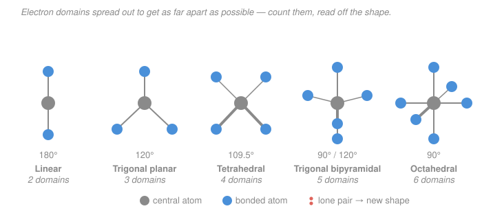

# General Chemistry · Lesson 1.5: Molecular Shape: VSEPR, Hybridization & a Taste of MO

> ⏱ ~15 min · Module 1: Atoms, the Periodic Table & Bonding · Builds on: [1.4 Ionic & Covalent Bonds and Lewis Structures](01-04-ionic-covalent-bonds-lewis-structures.md) · Unlocks: [2.1 The Mole, Molar Mass & Formulas](02-01-mole-molar-mass-formulas.md)

## Why this matters

A Lewis structure is flat, but molecules are not — and shape is destiny. Whether water is bent or linear decides whether it's polar, whether it dissolves salt, whether ice floats, whether life happens. The same shape rules explain why $\ce{CO2}$ traps heat but doesn't stick to itself, why an enzyme grips exactly one molecule, why $\ce{SF4}$ (your boss problem) is lopsided. This lesson gives you a two-step machine — **count electron domains, then read off the geometry** — that turns any Lewis structure into a 3-D shape, its bond angles, its orbital picture, and its polarity. It closes Module 1 by making the flat drawings from [1.4](01-04-ionic-covalent-bonds-lewis-structures.md) three-dimensional.

## The idea

Here's the whole trick, and it fits in one sentence: **groups of electrons around an atom push each other apart, so they spread out as far as they can.** A bonding pair and a lone pair are both just clouds of negative charge; both want elbow room. Count how many independent clouds surround the central atom — we'll call each one an **electron domain** — and geometry follows automatically, because there's exactly one way to arrange 2, 3, 4, 5, or 6 points on a sphere to maximize their mutual distance.

Two subtleties make it powerful. First, a **double or triple bond counts as one domain**, not two or three — the extra electrons sit in the same direction, so they push as a single fat cloud. Second, **lone pairs count when arranging domains but vanish when you name the shape**, because "molecular shape" is the shape drawn by the *atoms only*. So $\ce{NH3}$ has four domains (tetrahedral arrangement) but only three of them lead to atoms — the fourth is an invisible lone pair pushing the three $\ce{H}$ down into a pyramid. That gap between the *electron-domain* geometry and the *molecular* geometry is where all the interesting shapes come from. This whole scheme is **VSEPR**: Valence-Shell Electron-Pair Repulsion.

## The formal version

**The domain count.** For the central atom, add up: (number of atoms bonded to it) + (number of lone pairs on it). Each multiple bond contributes just 1 to the first count. That total is the number of electron domains, and it fixes the **electron-domain geometry**:

| Domains | Electron-domain geometry | Ideal bond angle | Hybridization |
|---|---|---|---|
| 2 | linear | $180^\circ$ | $sp$ |
| 3 | trigonal planar | $120^\circ$ | $sp^2$ |
| 4 | tetrahedral | $109.5^\circ$ | $sp^3$ |
| 5 | trigonal bipyramidal | $90^\circ$ and $120^\circ$ | $sp^3d$ |
| 6 | octahedral | $90^\circ$ | $sp^3d^2$ |

*In words: the number of clouds picks the skeleton, full stop.*

**From domains to molecular shape.** Now subtract the lone pairs — keep the arrangement, but name only the atom positions. The important cases:

- **4 domains, 1 lone pair** → **trigonal pyramidal** ($\ce{NH3}$, angle squeezed to $\sim107^\circ$).
- **4 domains, 2 lone pairs** → **bent** ($\ce{H2O}$, squeezed to $\sim104.5^\circ$).
- **5 domains, 1 lone pair** → **seesaw** ($\ce{SF4}$ — your boss problem).

Why the squeeze? **A lone pair is fatter than a bonding pair** — it's held by only one nucleus, so it splays out and shoves the bonding pairs closer together. Each lone pair knocks a few degrees off the ideal angle. In the trigonal bipyramid, lone pairs always take an **equatorial** site (in the 3-atom belt), never axial — equatorial gives them only two close ($90^\circ$) neighbors instead of three, minimizing repulsion. That single rule is why $\ce{SF4}$ is a seesaw and not something else.

**Hybridization — the orbitals behind the shape.** Bonds point where the geometry says, so the atom mixes its own $s$ and $p$ (and sometimes $d$) orbitals into that many equivalent **hybrid orbitals** aimed along the domains. Read hybridization straight off the domain count (last column above): $sp$ for 2, up to $sp^3d^2$ for 6. The bonds themselves come in two flavors:

- A **$\sigma$ (sigma) bond** is head-on overlap along the bond axis — every single bond is one $\sigma$, built from hybrid orbitals.
- A **$\pi$ (pi) bond** is sideways overlap of leftover *unhybridized* $p$ orbitals, above and below the axis.

So a **double bond = 1 $\sigma$ + 1 $\pi$**, a **triple bond = 1 $\sigma$ + 2 $\pi$**. The $\sigma$ sets the direction (and the domain); the $\pi$'s just add glue in the same direction — which is exactly why a multiple bond counts as one domain.

**Molecular polarity.** A polar bond has a little dipole (from the electronegativity difference, [1.3](01-03-periodic-trends.md)/[1.4](01-04-ionic-covalent-bonds-lewis-structures.md)). The **molecule** is polar only if those bond dipoles, added as vectors, don't cancel:

$$\vec{\mu}_{\text{net}} = \sum_i \vec{\mu}_i.$$

*In words: point an arrow along each polar bond, add them like forces; a nonzero sum means a polar molecule.* Symmetric shapes with identical bonds cancel exactly — **nonpolar even though every bond is polar**: $\ce{CO2}$ (linear), $\ce{CCl4}$ (tetrahedral), $\ce{SF6}$ (octahedral). Break the symmetry — with different atoms or a lone pair taking a slot — and the arrows no longer cancel: **polar** $\ce{H2O}$, $\ce{NH3}$, $\ce{SF4}$. Lone pairs are the usual symmetry-wreckers.

**A taste of MO theory.** VSEPR and hybridization are a bookkeeping picture; the deeper truth is that when two atoms approach, their atomic orbitals **combine into molecular orbitals** spread over both nuclei. Two $1s$ orbitals give two combinations:

- **in-phase** (add) → a **bonding** MO, $\sigma_{1s}$, piled up between the nuclei, **lower** in energy;
- **out-of-phase** (subtract) → an **antibonding** MO, $\sigma_{1s}^*$, with a node between the nuclei, **higher** in energy.

Fill these with the available electrons (lowest first, Pauli/Hund from [1.2](01-02-electron-configurations-periodic-table.md)), then

$$\text{bond order} = \tfrac12\left(\,n_{\text{bonding}} - n_{\text{antibonding}}\,\right).$$

*In words: net bonds = half the surplus of bonding electrons over antibonding ones.* A positive bond order means the molecule holds together. Full MO theory is a physical-chemistry topic (see the [physical chemistry](../../physical-chemistry/syllabus.md) course) built on the quantum orbitals of the [quantum mechanics](../../quantum-mechanics/syllabus.md) course — here we just taste it.

## Picture

## Worked examples

**Example 1 (the machine, end to end — $\ce{H2O}$).** Central $\ce{O}$ has 2 bonds (to $\ce{H}$) and 2 lone pairs → **4 domains**. Skeleton: **tetrahedral** electron-domain geometry, so $\ce{O}$ is **$sp^3$**. Two slots hold atoms, two hold lone pairs → molecular shape is **bent**. The two fat lone pairs squeeze the H–O–H angle from $109.5^\circ$ down to $104.5^\circ$. Polarity: the two $\ce{O-H}$ dipoles point toward $\ce{O}$; in a bent molecule they don't oppose, so they add to a net dipole bisecting the angle — **polar**. Every property of water traces back to this one bent, $sp^3$, polar picture.

**Example 2 (why symmetry kills polarity — $\ce{CO2}$).** Central $\ce{C}$ has 2 bonded atoms and 2 double bonds; **each double bond is one domain**, and $\ce{C}$ has no lone pairs → **2 domains**. Geometry: **linear**, $\ce{C}$ is **$sp$**. Each $\ce{C=O}$ is very polar (O pulls hard), but the two dipole arrows point in *exactly opposite* directions along the line and cancel: $\vec{\mu}_{\text{net}}=0$ → **nonpolar**. Bonus orbital count: each $\ce{C=O}$ is $1\sigma + 1\pi$, so $\ce{CO2}$ has 2 $\sigma$ and 2 $\pi$ bonds — the two $\pi$'s use $\ce{C}$'s two leftover unhybridized $p$ orbitals. Contrast with bent $\ce{H2O}$: same "central atom, two bonds," opposite polarity — **shape, not bond count, decides.**

## Watch out

- **You might count a double bond as two domains.** It's one — the extra electrons lie in the same direction. $\ce{CO2}$ has 2 domains (linear), not 4.
- **You might report the electron-domain geometry as the molecular shape.** $\ce{NH3}$ is *tetrahedral in its domains* but **trigonal pyramidal** as a molecule — lone pairs arrange but don't get named. Always do both steps.
- **You might call a molecule nonpolar because its bonds are "even," or polar because they're strong.** Neither. Polarity is about whether the dipole *vectors* cancel, which is a question of **shape**. $\ce{CCl4}$ has four strongly polar bonds and zero net dipole; $\ce{SF4}$ has a lone pair and so it's polar.
- **You might put a trigonal-bipyramidal lone pair in an axial slot.** It goes **equatorial** — fewer close ($90^\circ$) neighbors, less repulsion. This is the whole reason $\ce{SF4}$ is a seesaw.

## One-liner

> Count the electron domains (multiple bonds count once, lone pairs count here), read the geometry and hybridization off the table, drop the lone pairs to name the shape, then add the bond-dipole arrows to test polarity.

## Problems

**P1 (🟢)** For each of $\ce{CH4}$, $\ce{NH3}$, $\ce{H2O}$, and $\ce{CO2}$, give (i) the electron-domain geometry, (ii) the molecular geometry, and (iii) the central-atom hybridization.

**P2 (🟡)** Decide whether each of $\ce{CO2}$, $\ce{H2O}$, and $\ce{CCl4}$ is polar or nonpolar, and justify it by whether the bond dipoles cancel (every one of these has polar bonds).

**P3 (🔴, Boss-1 rehearsal)** From its Lewis structure ($\ce{S}$ with four $\ce{S-F}$ bonds and one lone pair — 34 valence electrons total, expanded octet), work out $\ce{SF4}$: (i) electron-domain geometry, (ii) molecular geometry, (iii) sulfur's hybridization, and (iv) explain, from where the lone pair sits, why the molecule is **polar**.

Solutions

**P1** Count domains on the central atom, then subtract lone pairs for the shape; hybridization comes straight from the domain count.

- **$\ce{CH4}$:** $\ce{C}$ has 4 bonds, 0 lone pairs → 4 domains. Electron-domain geometry **tetrahedral**; molecular geometry **tetrahedral** (no lone pairs to remove); hybridization **$sp^3$**. Angle $109.5^\circ$.
- **$\ce{NH3}$:** $\ce{N}$ has 3 bonds + 1 lone pair → 4 domains. Electron-domain **tetrahedral**; molecular **trigonal pyramidal**; **$sp^3$**. Angle $\sim107^\circ$.
- **$\ce{H2O}$:** $\ce{O}$ has 2 bonds + 2 lone pairs → 4 domains. Electron-domain **tetrahedral**; molecular **bent**; **$sp^3$**. Angle $\sim104.5^\circ$.
- **$\ce{CO2}$:** $\ce{C}$ has 2 bonded atoms via two double bonds (each = 1 domain), 0 lone pairs → 2 domains. Electron-domain **linear**; molecular **linear**; **$sp$**. Angle $180^\circ$.

*Check.* All three of $\ce{CH4}/\ce{NH3}/\ce{H2O}$ share the tetrahedral/$sp^3$ skeleton and differ only in how many domains hold lone pairs (0, 1, 2) — the shapes step tetrahedral → pyramidal → bent, exactly the "same skeleton, fewer atoms" pattern. ✓

**P2** Give each bond a dipole arrow (toward the more electronegative atom) and add as vectors.

- **$\ce{CO2}$ — nonpolar.** Linear; the two $\ce{C=O}$ dipoles point opposite along one line and cancel: $\vec{\mu}_{\text{net}}=0$.
- **$\ce{H2O}$ — polar.** Bent ($104.5^\circ$); the two $\ce{O-H}$ dipoles (toward $\ce{O}$) don't oppose, so they add to a net dipole bisecting the angle.
- **$\ce{CCl4}$ — nonpolar.** Tetrahedral with four identical $\ce{C-Cl}$ dipoles at $109.5^\circ$; by symmetry they sum to zero (the four vectors to the corners of a tetrahedron cancel).

*Check.* Same lesson: polar bonds are necessary but not sufficient — $\ce{CO2}$ and $\ce{CCl4}$ are symmetric so they cancel; $\ce{H2O}$'s lone pairs break the symmetry so it doesn't. Shape decides. ✓

**P3 — $\ce{SF4}$.**
- **Domains on $\ce{S}$:** 4 bonds + 1 lone pair = **5 domains** → electron-domain geometry **trigonal bipyramidal**.
- **Lone-pair placement:** the lone pair takes an **equatorial** site (only two $90^\circ$ neighbors there, vs. three if axial — minimum repulsion). Removing that one position from the trigonal bipyramid leaves two axial $\ce{F}$ and two equatorial $\ce{F}$ → molecular geometry **seesaw**.
- **Hybridization:** 5 domains → **$sp^3d$**.
- **Polarity — polar.** The two axial $\ce{S-F}$ bonds point roughly opposite and their dipoles largely cancel. But the two equatorial $\ce{S-F}$ bonds sit on the same side of the molecule — the side *opposite* the bulky lone pair — so their dipoles add rather than cancel. With no bond on the lone-pair side to balance them, there's a net dipole pointing away from the lone pair: the molecule is **polar**. (Compare $\ce{SF6}$: 6 bonds, no lone pair, perfectly octahedral → nonpolar. The single lone pair is the whole difference.)

*Check.* Valence electrons: $\ce{S}$ 6 $+ 4\times\ce{F}$ 7 $= 34$, matching the boss-problem count. Accounted for as 4 $\ce{S-F}$ bonds (8 e) $+$ 3 lone pairs on each of the four F's (24 e) $+$ S's one lone pair (2 e) $= 34$ ✓. Seesaw + $sp^3d$ + polar is the standard result. ✓

## Flashback

**From Lesson 1.4 (Lewis Structures & Formal Charge):** Draw a Lewis structure for the **nitrite ion**, $\ce{NO2^-}$. Give the total valence-electron count, assign the formal charge on each atom, and state why the ion has **two resonance structures**.

Solution

**Electron count:** $\ce{N}$ 5 $+ 2\times\ce{O}$ 6 $+ 1$ (the $-1$ charge) $= \mathbf{18}$ valence electrons (9 pairs).

**Structure:** $\ce{N}$ is central, bonded to the two $\ce{O}$. To satisfy octets with 18 electrons, use one $\ce{N=O}$ double bond and one $\ce{N-O}$ single bond, with a lone pair on $\ce{N}$:
- $\ce{N}$: 1 lone pair, a double bond, a single bond (3 bonds total).
- double-bonded $\ce{O}$: 2 lone pairs.
- single-bonded $\ce{O}$: 3 lone pairs.

Tally: bonds $4+2 = 6$ e, oxygen lone pairs $4+6 = 10$ e, nitrogen lone pair $2$ e $= 18$ ✓.

**Formal charges** (valence $-$ lone-pair e $-$ bonds):
- $\ce{N}$: $5 - 2 - 3 = 0$.
- double-bonded $\ce{O}$: $6 - 4 - 2 = 0$.
- single-bonded $\ce{O}$: $6 - 6 - 1 = -1$.

Sum $= -1$, matching the ion's charge ✓.

**Resonance:** the double bond could equally be drawn to the *other* oxygen, giving a second, energetically identical structure. Neither is real on its own — the true ion is the average, with the negative charge and the "$1.5$" bond order **shared equally** over both $\ce{O}$ atoms (both $\ce{N-O}$ bonds are the same length in reality). (Geometrically, VSEPR from this lesson: $\ce{N}$ has 3 domains → bent, $\sim115^\circ$.)

## Connections

- **Backward:** every input here — Lewis structures, lone pairs, formal charge, and bond polarity from electronegativity — comes from [1.4](01-04-ionic-covalent-bonds-lewis-structures.md) and [1.3](01-03-periodic-trends.md). VSEPR is just what you *do* with a finished Lewis structure, and it closes Module 1 by feeding **Boss Problem 1** ($\ce{SF4}$, rehearsed in P3).
- **Forward:** shape and polarity drive intermolecular forces and solubility, which underlie the solution chemistry of [2.3](02-03-aqueous-reactions-precipitation-acid-base-redox.md) and the physical behavior of gases and liquids in Module 3. First, [2.1](02-01-mole-molar-mass-formulas.md) makes chemistry quantitative with the mole.
- **Sideways (quantum & physical chemistry):** hybrid orbitals and the bonding/antibonding split are cartoons of the real thing — the electron orbitals that are the hydrogen-atom solutions in the [quantum mechanics](../../quantum-mechanics/syllabus.md) course. The full molecular-orbital treatment (correct $\ce{O2}$ magnetism, bond orders for everything) lives in [physical chemistry](../../physical-chemistry/syllabus.md). Worth previewing: MO theory correctly predicts $\ce{O2}$ has **bond order 2 and is paramagnetic** (two unpaired electrons in its $\pi^*$ orbitals) — a fact the Lewis double-bond picture, with all electrons paired, gets wrong. That's the payoff of the deeper theory.
