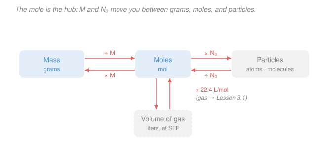

# General Chemistry · Lesson 2.1: The Mole, Molar Mass & Formulas

> ⏱ ~15 min · Module 2: Stoichiometry & Reactions · Builds on: [1.5 Molecular shape: VSEPR, hybridization & MO](01-05-molecular-shape-vsepr-hybridization-mo.md) · Unlocks: [2.2 Stoichiometry & limiting reagents](02-02-stoichiometry-limiting-reagents.md)

## Why this matters

Chemistry happens one atom at a time, but you work in the lab one *gram* at a time. A balanced equation tells you "two hydrogens per oxygen" — a statement about *counts* — yet your balance reads *mass*. The mole is the exchange rate between those two worlds. Get fluent with it and every quantitative problem in the rest of this course — limiting reagents, gas volumes, solution concentrations, reaction enthalpies — becomes the same three-step conversion. This lesson is the workbench you'll stand at for all of Module 2 and beyond.

## The idea

You can't count atoms — there are too many and they're too small. But you *can* weigh them, and nature made that easy: a carbon atom is 12 times heavier than a hydrogen atom, and that same ratio holds whether you have two atoms or two trillion. So if you scoop out "12 grams of carbon" and "1 gram of hydrogen," you've got the *same number* of each, even though you never counted.

That fixed number has a name: **Avogadro's number**, and a mole is just "that many" of anything — the chemist's *dozen*. A dozen eggs is 12 eggs; a mole of eggs is $6.022\times10^{23}$ eggs. The whole point is that the mole is chosen so that **one mole of a substance weighs, in grams, the same number you already read off the periodic table in amu.** Carbon is 12.01 amu per atom, so one mole of carbon is 12.01 grams. That coincidence-by-design is what lets you slide between the countable world and the weighable world without ever counting.

## The formal version

**Avogadro's number.** One mole contains

$$N_A = 6.022\times10^{23}\ \text{particles per mole.}$$

*In words: a mole is a count, exactly like "a dozen," just enormous — it's the number of atoms in 12 g of carbon-12.* "Particles" means whatever you're counting: atoms, molecules, ions, electrons.

**Molar mass.** The **molar mass** $M$ of a substance is the mass of one mole of it, in grams per mole ($\mathrm{g/mol}$). For an element it equals the atomic weight from the periodic table; for a compound you *add up* the molar masses of its atoms:

$$M(\ce{H2O}) = 2(1.008) + 16.00 = 18.02\ \mathrm{g/mol}.$$

*In words: molar mass is the "price tag" that converts between grams and moles — sum the atomic masses of every atom in the formula.*

**The conversion hub.** Molar mass and $N_A$ give you two conversion factors that connect three quantities — mass $m$ (grams), amount $n$ (moles), and number of particles $N$:

$$n = \frac{m}{M}, \qquad N = n\,N_A.$$

*In words: divide mass by molar mass to get moles; multiply moles by Avogadro's number to get particles.* Run either backward by flipping the operation ($m = nM$, $\ n = N/N_A$). **Moles sit in the middle** — you almost never jump straight from grams to molecules; you route through moles.

**Percent composition.** The **mass percent** of an element in a compound is the fraction of the compound's molar mass contributed by that element:

$$\%\,\text{element} = \frac{\text{mass of that element in 1 mol}}{M_{\text{compound}}}\times 100\%.$$

*In words: of the total weight of one mole, what share is this one element?*

**Empirical vs. molecular formula.** The **empirical formula** is the simplest whole-number ratio of atoms (e.g. $\ce{CH2O}$); the **molecular formula** is the *actual* count per molecule (e.g. $\ce{C6H12O6}$). They differ by an integer multiple:

$$\text{molecular} = (\text{empirical})\times n, \qquad n = \frac{M_{\text{molecular}}}{M_{\text{empirical formula}}}.$$

*In words: the molecular formula is a whole-number copy of the empirical one; find how many copies by dividing the true molar mass by the empirical formula's mass.* To get the empirical formula from **percent-composition (or combustion) data**: assume a 100 g sample (so percents become grams), convert each element's grams to moles, divide all mole counts by the smallest, and round to whole numbers.

## Picture

## Worked examples

**Example 1 (mechanical — grams to molecules).** How many molecules are in $9.00\ \mathrm{g}$ of $\ce{CO2}$?

First the molar mass: $M(\ce{CO2}) = 12.01 + 2(16.00) = 44.01\ \mathrm{g/mol}$. Route through moles:

$$n = \frac{m}{M} = \frac{9.00\ \mathrm{g}}{44.01\ \mathrm{g/mol}} = 0.2045\ \mathrm{mol}, \qquad N = nN_A = 0.2045 \times 6.022\times10^{23} = 1.23\times10^{23}\ \text{molecules.}$$

The units cancel cleanly: $\mathrm{g}\div(\mathrm{g/mol}) = \mathrm{mol}$, then $\mathrm{mol}\times(\text{particles/mol}) = \text{particles}$. That unit bookkeeping *is* the method — chase the units and the arithmetic follows.

**Example 2 (why you'd care — reading a label).** A fertilizer bag lists ammonium nitrate, $\ce{NH4NO3}$. What fraction of its mass is actually nitrogen, the nutrient you're paying for?

$$M(\ce{NH4NO3}) = 2(14.01) + 4(1.008) + 3(16.00) = 28.02 + 4.03 + 48.00 = 80.05\ \mathrm{g/mol}.$$

Nitrogen contributes $28.02\ \mathrm{g}$ of that:

$$\%\,\ce{N} = \frac{28.02}{80.05}\times100\% = 35.0\%.$$

So a 50 kg bag delivers about 17.5 kg of nitrogen — the number the agronomy world quotes directly. Percent composition turns a formula into a purchasing decision.

## Watch out

- **You might think "molecules" and "moles" are interchangeable words.** They aren't: a mole is a *number of* particles ($6.022\times10^{23}$ of them). Grams → moles uses $M$; moles → molecules uses $N_A$. Two different conversion factors, two different arrows on the map — don't multiply by $N_A$ when you meant to divide by $M$.
- **You might read subscripts as multiplying only the nearest atom.** In $\ce{Ca(NO3)2}$ the trailing 2 distributes over *everything in the parentheses*: two N and six O, not two N and three O. Miscount the oxygens and every downstream number is wrong.
- **You might stop at the empirical formula.** Percent-composition data alone can *never* give the molecular formula — $\ce{CH2O}$, $\ce{C2H4O2}$, and $\ce{C6H12O6}$ all share the same percentages. You need the molar mass to pick which multiple is real.

## One-liner

> The mole converts weighable grams into countable particles: divide mass by molar mass to reach moles, then multiply by $N_A = 6.022\times10^{23}$ to reach atoms.

## Problems

**P1 (🟢)** (a) A beaker holds $54.0\ \mathrm{g}$ of water, $\ce{H2O}$. How many moles is that, and how many molecules? (b) Find the molar mass of calcium nitrate, $\ce{Ca(NO3)2}$.

**P2 (🟡)** Find the mass percent of nitrogen in ammonium nitrate, $\ce{NH4NO3}$, from scratch. (Then sanity-check: is it more or less than the percent nitrogen in ammonia, $\ce{NH3}$, at $82\%$? Explain in one line.)

**P3 (🔴)** A compound is $40.0\%$ carbon, $6.7\%$ hydrogen, and $53.3\%$ oxygen by mass, with a measured molar mass of $180\ \mathrm{g/mol}$. Find its empirical formula and its molecular formula.

Solutions

**P1 (a)** Molar mass of water: $M(\ce{H2O}) = 2(1.008) + 16.00 = 18.02\ \mathrm{g/mol}$.

$$n = \frac{m}{M} = \frac{54.0\ \mathrm{g}}{18.02\ \mathrm{g/mol}} = 3.00\ \mathrm{mol}.$$

$$N = nN_A = 3.00 \times 6.022\times10^{23} = 1.81\times10^{24}\ \text{molecules.}$$

*Check.* Units: $\mathrm{g}\div(\mathrm{g/mol}) = \mathrm{mol}$ ✓, then $\mathrm{mol}\times(\text{molecules/mol}) = \text{molecules}$ ✓. And $54.0/18.02 \approx 3$, so three water molecules' worth of moles — reasonable for a small beaker.

**(b)** $\ce{Ca(NO3)2}$ has one Ca, two N, and six O (the subscript 2 distributes over the parenthesis):

$$M = 40.08 + 2(14.01) + 6(16.00) = 40.08 + 28.02 + 96.00 = 164.10\ \mathrm{g/mol}.$$

**P2** $M(\ce{NH4NO3}) = 2(14.01) + 4(1.008) + 3(16.00) = 28.02 + 4.03 + 48.00 = 80.05\ \mathrm{g/mol}$.

$$\%\,\ce{N} = \frac{2(14.01)}{80.05}\times100\% = \frac{28.02}{80.05}\times100\% = 35.0\%.$$

Sanity check: ammonia $\ce{NH3}$ is $\dfrac{14.01}{14.01 + 3(1.008)}\times100\% = \dfrac{14.01}{17.03}\times100\% = 82.3\%$ nitrogen — *much* higher, because $\ce{NH3}$ carries no heavy oxygen dead-weight. Ammonium nitrate dilutes its nitrogen with three oxygens, so a lower percent is exactly what we'd expect. ✓

**P3** Assume a $100\ \mathrm{g}$ sample, so the percents become grams: $40.0\ \mathrm{g}$ C, $6.7\ \mathrm{g}$ H, $53.3\ \mathrm{g}$ O. Convert each to moles:

$$n_{\ce{C}} = \frac{40.0}{12.01} = 3.33, \quad n_{\ce{H}} = \frac{6.7}{1.008} = 6.65, \quad n_{\ce{O}} = \frac{53.3}{16.00} = 3.33.$$

Divide all by the smallest ($3.33$):

$$\ce{C}: \frac{3.33}{3.33} = 1.00, \quad \ce{H}: \frac{6.65}{3.33} = 2.00, \quad \ce{O}: \frac{3.33}{3.33} = 1.00.$$

So the **empirical formula is $\ce{CH2O}$**, with empirical formula mass $12.01 + 2(1.008) + 16.00 = 30.03\ \mathrm{g/mol}$.

Now find how many empirical units make one molecule:

$$n = \frac{M_{\text{molecular}}}{M_{\text{empirical}}} = \frac{180}{30.03} = 5.99 \approx 6.$$

Multiply the empirical formula by 6: **molecular formula $\ce{C6H12O6}$** (glucose).

*Check.* $M(\ce{C6H12O6}) = 6(12.01) + 12(1.008) + 6(16.00) = 72.06 + 12.10 + 96.00 = 180.16\ \mathrm{g/mol}$, matching the given $180$ ✓.

## Flashback

**From Lesson 1.2 (Electron configurations & the periodic table):** Calcium ($Z = 20$) appears in this lesson inside $\ce{Ca(NO3)2}$. Write the ground-state electron configuration of a neutral calcium atom, then of the $\ce{Ca^2+}$ ion it becomes in that salt. Which noble gas is $\ce{Ca^2+}$ isoelectronic with?

Solution

Neutral calcium has 20 electrons; fill in order of increasing energy ($4s$ before $3d$):

$$\ce{Ca}:\ 1s^2\,2s^2\,2p^6\,3s^2\,3p^6\,4s^2 \quad=\quad [\ce{Ar}]\,4s^2.$$

To form $\ce{Ca^2+}$, remove the two outermost ($4s$) electrons — the valence electrons, always the first to go:

$$\ce{Ca^2+}:\ 1s^2\,2s^2\,2p^6\,3s^2\,3p^6 \quad=\quad [\ce{Ar}].$$

With 18 electrons, $\ce{Ca^2+}$ is **isoelectronic with argon** ($Z = 18$) — a full, stable octet shell, which is exactly why calcium so readily gives up two electrons to sit in ionic compounds like $\ce{Ca(NO3)2}$.

## Connections

- **Backward:** the atomic masses you sum for molar mass come straight from the periodic table of [1.2](01-02-electron-configurations-periodic-table.md), and *which* formula a compound takes (the subscripts you're now counting) was set by the bonding and charge-balance rules of [1.4](01-04-ionic-covalent-bonds-lewis-structures.md).
- **Forward:** [2.2 Stoichiometry & limiting reagents](02-02-stoichiometry-limiting-reagents.md) uses this mole ↔ mass conversion on *both sides* of a balanced equation to predict product amounts; the dashed branch in the figure — moles to gas volume — is [3.1 Gases & the ideal gas law](03-01-gases-ideal-gas-law-kinetic-theory.md).
- **Sideways:** Avogadro's number is the same bridge between the microscopic and macroscopic that underlies statistical mechanics (counting states of $\sim\!10^{23}$ particles) and reappears when molar quantities meet energy in [physical chemistry](../../physical-chemistry/syllabus.md).
