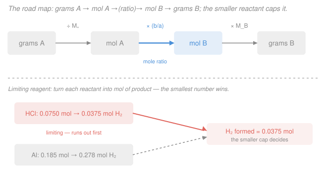

# General Chemistry · Lesson 2.2: Stoichiometry & Limiting Reagents

> ⏱ ~15 min · Module 2: Stoichiometry & Reactions · Builds on: [2.1 The mole, molar mass & formulas](02-01-mole-molar-mass-formulas.md) · Unlocks: [2.3 Aqueous reactions](02-03-aqueous-reactions-precipitation-acid-base-redox.md)

## Why this matters

Every quantitative statement about a reaction — how much product a factory yields, how much oxygen a rocket needs, how much drug forms in a synthesis — is stoichiometry. It's the accounting layer of chemistry: a balanced equation is a recipe, and the coefficients tell you the *ratios* in which molecules combine. Once you can convert grams to moles and back through those ratios, "how much?" stops being a guess. This lesson is also direct prep for **Boss Problem 2**, and the limiting-reagent idea returns whenever a reaction can't go to completion.

## The idea

A chemical equation is a recipe written in molecules. "2 hydrogen + 1 oxygen makes 2 water" doesn't mean 2 grams and 1 gram — atoms are counted, not weighed. So the numbers out front, the **coefficients**, are *mole ratios*: for every 1 mol of $\ce{O2}$ you consume 2 mol of $\ce{H2}$ and make 2 mol of $\ce{H2O}$. That ratio is the hinge everything turns on.

But you can't count molecules in the lab — you weigh grams. So every real problem is a three-step trip: weigh what you have, **convert grams to moles** (divide by molar mass, from [2.1](02-01-mole-molar-mass-formulas.md)), hop across the equation using the **mole ratio**, then **convert moles back to grams** of whatever you want. Grams → moles → moles → grams. The middle hop is pure chemistry; the outer two are just unit conversions.

One catch: recipes assume you have every ingredient in the right proportion. In reality one reactant usually runs out first — the **limiting reagent** — and it, alone, sets how much product you can make. Everything else is leftover.

## The formal version

**Balancing.** Atoms are neither created nor destroyed, so each element must have the same total count on both sides (and net charge must match for ionic equations). You balance by adjusting **coefficients only — never subscripts**, because changing a subscript changes the *substance*. Take propane combustion:

$$\ce{C3H8 + O2 -> CO2 + H2O} \quad\longrightarrow\quad \ce{C3H8 + 5O2 -> 3CO2 + 4H2O}.$$

Check: C: $3 = 3$. H: $8 = 4\times 2 = 8$. O: $5\times 2 = 10 = 3\times 2 + 4\times 1 = 10$. ✓ *In words: 1 molecule of propane needs 5 of oxygen to make 3 of carbon dioxide and 4 of water* — equivalently, those same numbers as **moles**.

**The stoichiometry pipeline.** To get from a mass of reactant $A$ to a mass of product $B$:

$$\underbrace{m_A\ \text{(g A)}}_{\text{weigh}} \;\xrightarrow{\;\div\, M_A\;}\; \underbrace{n_A\ \text{(mol A)}}_{\text{count}} \;\xrightarrow{\;\times\, b/a\;}\; \underbrace{n_B\ \text{(mol B)}}_{\text{mole ratio}} \;\xrightarrow{\;\times\, M_B\;}\; \underbrace{m_B\ \text{(g B)}}_{\text{weigh}}$$

where $M_A, M_B$ are molar masses (g/mol) and $a, b$ are the coefficients of $A$ and $B$ in the **balanced** equation. *In words: divide by molar mass to count, multiply by the mole ratio to cross the equation, multiply by molar mass to weigh again.* The mole ratio $b/a$ is the heart — everything else is bookkeeping.

**Limiting reagent.** When two reactants are both specified, convert **each** to the moles of product it could make on its own. The reactant giving the **smaller** amount is the limiting reagent; it runs out first and caps the product. The other is in **excess** — some of it is left over.

**Yields.** The **theoretical yield** is the product computed from the limiting reagent (the maximum possible). The **actual yield** is what you measure in the lab (always less — spills, side reactions, incomplete conversion). Their ratio is the

$$\text{percent yield} = \frac{\text{actual yield}}{\text{theoretical yield}}\times 100\%.$$

## Picture

## Worked examples

**Example 1 (mass-to-mass, the full pipeline).** How many grams of $\ce{CO2}$ come from burning $22.0\ \mathrm{g}$ of propane? Use the balanced equation above; $M(\ce{C3H8}) = 3(12.01)+8(1.008) = 44.09\ \mathrm{g/mol}$, $M(\ce{CO2}) = 44.01\ \mathrm{g/mol}$.

- **Grams → mol A:** $n_{\ce{C3H8}} = \dfrac{22.0}{44.09} = 0.499\ \mathrm{mol}$.
- **Mol ratio ($\ce{CO2}:\ce{C3H8} = 3:1$):** $n_{\ce{CO2}} = 0.499 \times \dfrac{3}{1} = 1.497\ \mathrm{mol}$.
- **Mol B → grams:** $m_{\ce{CO2}} = 1.497 \times 44.01 = 65.9\ \mathrm{g}$.

So $22.0\ \mathrm{g}$ of propane yields about $65.9\ \mathrm{g}$ of $\ce{CO2}$. Notice the mass grew — you're counting three big $\ce{CO2}$ molecules per propane, plus the oxygen that got incorporated.

**Example 2 (why the mole ratio, not the mass ratio).** Suppose you'd (wrongly) reasoned "3 out, 1 in, so triple the grams": $3\times 22.0 = 66.0\ \mathrm{g}$ — close, but a coincidence of molar masses here. The ratio $3:1$ is a ratio of *counts*, and it only becomes a mass answer after you route it through molar masses. Change the product to water ($M = 18.02$) with ratio $4:1$ and the mass answer is completely different: $0.499 \times 4 \times 18.02 = 36.0\ \mathrm{g}$ of $\ce{H2O}$. Same fuel, same reaction — the mole ratio and molar mass together set each product's mass.

## Watch out

- **You might balance by changing a subscript.** Writing $\ce{H2O2}$ to "get more oxygen" turns water into hydrogen peroxide — a different compound. Only the coefficients out front are yours to adjust.
- **You might skip straight from grams to grams using coefficients.** Coefficients are mole ratios, *not* mass ratios. You must pass through moles both ways; the balanced equation lives in mole-land.
- **You might multiply the limiting reagent by the excess.** Once you've identified the limiting reagent, the product depends on it *alone*. The excess reagent's amount is irrelevant to the yield — it only tells you how much is left over.

## One-liner

> Balance first, then march grams → mol → (mole ratio) → mol → grams; when two reactants compete, the one that makes the least product wins and caps everything.

## Problems

**P1 (🟢)** Given the balanced equation $\ce{2H2 + O2 -> 2H2O}$, how many grams of water form from $4.00\ \mathrm{g}$ of $\ce{H2}$ (with oxygen in excess)? Use $M(\ce{H2}) = 2.016$, $M(\ce{H2O}) = 18.02\ \mathrm{g/mol}$.

**P2 (🟡)** Balance $\ce{Fe + O2 -> Fe2O3}$, then find the mass of $\ce{Fe2O3}$ produced from $11.2\ \mathrm{g}$ of iron (oxygen in excess). Use $M(\ce{Fe}) = 55.85$, $M(\ce{O}) = 16.00\ \mathrm{g/mol}$.

**P3 (🔴, Boss-2 rehearsal)** For $\ce{2Al + 6HCl -> 2AlCl3 + 3H2}$, you mix $5.00\ \mathrm{g}$ of aluminum with $25.0\ \mathrm{mL}$ of $3.00\ \mathrm{M}$ HCl (which is $0.0750\ \mathrm{mol}$ HCl). Identify the limiting reagent and compute the grams of $\ce{H2}$ produced. Use $M(\ce{Al}) = 26.98$, $M(\ce{H2}) = 2.016\ \mathrm{g/mol}$.

Solutions

**P1** Grams → mol: $n_{\ce{H2}} = \dfrac{4.00}{2.016} = 1.984\ \mathrm{mol}$. Mole ratio $\ce{H2O}:\ce{H2} = 2:2 = 1:1$, so $n_{\ce{H2O}} = 1.984\ \mathrm{mol}$. Mol → grams: $m_{\ce{H2O}} = 1.984 \times 18.02 = 35.8\ \mathrm{g}$.

*Check.* Mass is conserved overall, so the water mass equals the hydrogen plus the oxygen that combined with it — more than the $4.00\ \mathrm{g}$ of $\ce{H2}$ alone, as found. ✓

**P2** Balance: iron needs an even count to pair with $\ce{Fe2O3}$, oxygen comes in $\ce{O2}$. $\ce{4Fe + 3O2 -> 2Fe2O3}$ (Fe: $4=2\times2$; O: $3\times2 = 6 = 2\times3$). ✓

Grams → mol: $n_{\ce{Fe}} = \dfrac{11.2}{55.85} = 0.2005\ \mathrm{mol}$. Mole ratio $\ce{Fe2O3}:\ce{Fe} = 2:4 = 1:2$, so $n_{\ce{Fe2O3}} = \dfrac{0.2005}{2} = 0.1003\ \mathrm{mol}$. Molar mass $M(\ce{Fe2O3}) = 2(55.85) + 3(16.00) = 111.70 + 48.00 = 159.70\ \mathrm{g/mol}$. Mol → grams: $m = 0.1003 \times 159.70 = 16.0\ \mathrm{g}$.

*Check.* Every 2 mol Fe makes 1 mol $\ce{Fe2O3}$, so the product's mole count is half the iron's — and the rest of the mass ($16.0 - 11.2 = 4.8\ \mathrm{g}$) is the oxygen picked up, consistent with $0.1003 \times 48.00 = 4.8\ \mathrm{g}$ of O. ✓

**P3** Convert each reactant to moles of $\ce{H2}$ it could make.

- Aluminum: $n_{\ce{Al}} = \dfrac{5.00}{26.98} = 0.1853\ \mathrm{mol}$. Ratio $\ce{H2}:\ce{Al} = 3:2$, so it could make $0.1853 \times \dfrac{3}{2} = 0.278\ \mathrm{mol}\ \ce{H2}$.
- Hydrochloric acid: $n_{\ce{HCl}} = 0.0750\ \mathrm{mol}$. Ratio $\ce{H2}:\ce{HCl} = 3:6 = 1:2$, so it could make $0.0750 \times \dfrac{1}{2} = 0.0375\ \mathrm{mol}\ \ce{H2}$.

The smaller is $0.0375\ \mathrm{mol}$, from HCl — so **HCl is the limiting reagent** (Al is in excess). Theoretical yield: $m_{\ce{H2}} = 0.0375 \times 2.016 = 0.0756\ \mathrm{g}\ \ce{H2}$.

*Check (excess).* HCl consumes Al in ratio $2:6 = 1:3$, so Al used $= 0.0750/3 = 0.0250\ \mathrm{mol} = 0.674\ \mathrm{g}$, leaving $5.00 - 0.674 = 4.33\ \mathrm{g}$ of Al unreacted — confirming aluminum was indeed the one in excess. ✓

## Flashback

**From Lesson 2.1 (The mole, molar mass & formulas):** A compound is found to be $40.0\%$ carbon, $6.7\%$ hydrogen, and $53.3\%$ oxygen by mass. Find its empirical formula. (Use $M(\ce{C})=12.01$, $M(\ce{H})=1.008$, $M(\ce{O})=16.00\ \mathrm{g/mol}$.)

Solution

Assume a $100\ \mathrm{g}$ sample, so the percentages become grams. Convert each to moles:

$$n_{\ce{C}} = \frac{40.0}{12.01} = 3.33,\qquad n_{\ce{H}} = \frac{6.7}{1.008} = 6.65,\qquad n_{\ce{O}} = \frac{53.3}{16.00} = 3.33\ \mathrm{mol}.$$

Divide by the smallest ($3.33$): $\ce{C}: 1$, $\ce{H}: \dfrac{6.65}{3.33} = 2.0$, $\ce{O}: 1$. The empirical formula is $\ce{CH2O}$.

*Check.* This is the empirical unit of carbohydrates (e.g. glucose $\ce{C6H12O6}$ is $(\ce{CH2O})_6$) — the empirical formula fixes the ratio, not the true molecule size, which you'd pin down with a separately measured molar mass. ✓

## Connections

- **Backward:** the grams ↔ moles conversions at both ends are exactly the mole / molar-mass machinery from [2.1](02-01-mole-molar-mass-formulas.md); stoichiometry just chains two of them across a mole ratio.
- **Forward:** [2.3 Aqueous reactions](02-03-aqueous-reactions-precipitation-acid-base-redox.md) applies this to reactions in solution, where molarity (mol/L) replaces "grams weighed" as the way you count reactant — the same pipeline with a different first step. The limiting-reagent logic also underlies **Boss Problem 2**.
- **Sideways:** conservation of atoms in balancing is the chemical face of a conservation law — the same bookkeeping spirit as conserving mass and charge, and a cousin of the conserved-quantity reasoning you meet in thermodynamics and physical chemistry.
