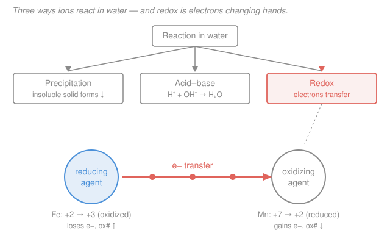

# General Chemistry · Lesson 2.3: Aqueous Reactions — Precipitation, Acid–Base & Redox

> ⏱ ~15 min · Module 2: Stoichiometry & Reactions · Builds on: [2.2 Stoichiometry & limiting reagents](02-02-stoichiometry-limiting-reagents.md) · Unlocks: [3.1 Gases & the ideal-gas law](03-01-gases-ideal-gas-law-kinetic-theory.md)

## Why this matters

Almost all the chemistry you meet — in a cell, a battery, a river, a beaker — happens in water, and it comes in exactly three flavors. Learn to look at two dissolved compounds and instantly call the play (a solid drops out, an acid neutralizes a base, or electrons change hands) and the whole "zoo of reactions" collapses into three patterns. This lesson closes Module 2 by adding the last quantitative tool — **molarity**, how we count moles in solution — and the last classification skill — **redox and half-reactions** — that you'll lean on for equilibrium, acids/bases (Module 4), and every electrochemical cell downstream. It also feeds directly into Boss Problem 2.

## The idea

Dissolve table salt in water and the crystal doesn't just sit there — it comes apart into free-swimming $\ce{Na+}$ and $\ce{Cl-}$ ions. Compounds that split completely like this are **strong electrolytes**, and the picture to hold is a soup of *independent* ions, not intact molecules. Reactions in that soup are just ions finding partners.

There are three things that can happen when you mix two such soups:

1. **Precipitation** — two ions grab each other so tightly that they fall out of solution as a solid. (A cloudy solid appears.)
2. **Acid–base** — a hydrogen-ion donor meets a hydroxide (or other base) and they cancel to water. (Fizz, heat, neutralization.)
3. **Redox** — one species hands *electrons* to another. Nothing precipitates and no water need form; what moves is charge. (This is what runs batteries and metabolism.)

The tell for the first two is *what forms* (a solid, or water). The tell for redox is subtler — you track a bookkeeping number, the **oxidation number**, and watch it change. The rest of the lesson is how to spot each and how to write the reaction honestly, keeping only the ions that actually do something.

## The formal version

**Molarity.** Concentration in solution is measured as

$$M = \frac{\text{mol solute}}{\text{L solution}}.$$

*In words: molarity is how many moles of stuff sit in each liter of liquid.* A $3.00\ \mathrm{M}$ solution has $3.00\ \mathrm{mol}$ dissolved per liter. Moles and volume connect through $n = M\,V$ (with $V$ in liters), the solution-phase cousin of $n = m/\mathcal{M}$ from [2.1](02-01-mole-molar-mass-formulas.md).

**Dilution.** Adding solvent spreads the *same* moles through more volume, so moles are conserved:

$$M_1 V_1 = M_2 V_2.$$

*In words: concentration times volume before = concentration times volume after* — both sides equal the (unchanged) moles of solute.

**Dissociation.** A strong electrolyte splits fully; write it out. E.g.

$$\ce{AgNO3(s) -> Ag+(aq) + NO3^-(aq)}, \qquad \ce{Na2SO4(s) -> 2Na+(aq) + SO4^2-(aq)}.$$

### 1. Precipitation and the net ionic equation

Whether a pairing makes a solid is decided by **solubility rules**. The ones worth memorizing:

- **Always soluble:** nitrates ($\ce{NO3-}$), group-1 salts ($\ce{Na+}, \ce{K+}, \dots$), and ammonium ($\ce{NH4+}$).
- **Sulfates** ($\ce{SO4^2-}$) soluble *except* $\ce{BaSO4}$, $\ce{PbSO4}$, $\ce{CaSO4}$.
- **Halides** ($\ce{Cl-}, \ce{Br-}, \ce{I-}$) soluble *except* with $\ce{Ag+}$, $\ce{Pb^2+}$, $\ce{Hg2^2+}$.
- **Usually insoluble:** carbonates ($\ce{CO3^2-}$), hydroxides ($\ce{OH-}$), sulfides ($\ce{S^2-}$) — except with the always-soluble cations above.

To write the reaction honestly, go through three forms. Take $\ce{AgNO3 + NaCl}$:

$$\underbrace{\ce{AgNO3(aq) + NaCl(aq) -> AgCl(v) + NaNO3(aq)}}_{\text{molecular}}$$

Split every strong electrolyte into ions (the solid stays whole):

$$\underbrace{\ce{Ag+ + NO3^- + Na+ + Cl- -> AgCl(v) + Na+ + NO3^-}}_{\text{complete ionic}}$$

Cancel the ions that appear unchanged on both sides — the **spectators** ($\ce{Na+}$, $\ce{NO3-}$) — to get the **net ionic equation**:

$$\boxed{\ce{Ag+ + Cl- -> AgCl(v)}}$$

*In words: strip away the ions that just watch; what's left is the actual chemistry.*

### 2. Acid–base (neutralization)

An acid supplies $\ce{H+}$, a base supplies $\ce{OH-}$; they combine to salt + water:

$$\ce{HCl(aq) + NaOH(aq) -> NaCl(aq) + H2O(l)}.$$

For a **strong** acid + **strong** base, everything but the water is a spectator, so the net ionic equation is always the same:

$$\boxed{\ce{H+ + OH- -> H2O}}$$

(The full story of weak acids, $\mathrm{pH}$, and how much dissociates waits for Module 4, [4.1](04-01-acids-bases-ph-strength.md).)

### 3. Redox and oxidation numbers

A **redox** (reduction–oxidation) reaction transfers electrons. To see it, assign each atom an **oxidation number** — a bookkeeping charge it *would* have if every bond were fully ionic. The rules, applied in order:

1. A free element is $0$ ($\ce{Al}$, $\ce{H2}$, $\ce{O2}$ all $0$).
2. A monatomic ion equals its charge ($\ce{Na+}$ is $+1$, $\ce{S^2-}$ is $-2$).
3. Oxygen is usually $-2$; hydrogen is usually $+1$.
4. The oxidation numbers in a species sum to its overall charge (0 for a neutral molecule).

Then read the changes:

- **Oxidation = loss of electrons = oxidation number goes *up*.**
- **Reduction = gain of electrons = oxidation number goes *down*.**

Mnemonic: **OIL RIG** — *Oxidation Is Loss, Reduction Is Gain* (of electrons); or **LEO the lion says GER** — *Lose Electrons = Oxidation, Gain Electrons = Reduction*. The species that *gets oxidized* hands electrons away, so it's the **reducing agent** (it reduces the other guy); the species that *gets reduced* is the **oxidizing agent**. The two roles are always paired — you can't have one without the other.

### Balancing redox by half-reactions (acidic solution)

Split the reaction into an **oxidation half** and a **reduction half**, balance each separately, then recombine. Procedure, per half-reaction:

1. Balance the atom being oxidized/reduced.
2. Balance $\ce{O}$ by adding $\ce{H2O}$.
3. Balance $\ce{H}$ by adding $\ce{H+}$.
4. Balance charge by adding electrons ($\ce{e-}$).

Finally, scale the two halves so the electrons lost equal the electrons gained, and add. *In words: conserve atoms in each half, then conserve electrons across both.* The worked example below runs the full machine.

## Picture

## Worked examples

**Example 1 (mechanical — a precipitation, all three forms).** Mix aqueous barium chloride and sodium sulfate. Sulfate is insoluble with $\ce{Ba^2+}$ (rule: $\ce{BaSO4}$ is the exception), so a solid drops:

$$\ce{BaCl2(aq) + Na2SO4(aq) -> BaSO4(v) + 2NaCl(aq)}$$

Complete ionic (split every soluble strong electrolyte):

$$\ce{Ba^2+ + 2Cl- + 2Na+ + SO4^2- -> BaSO4(v) + 2Na+ + 2Cl-}$$

Spectators $\ce{Na+}$ and $\ce{Cl-}$ cancel:

$$\ce{Ba^2+ + SO4^2- -> BaSO4(v)}$$

**Example 2 (why you'd care — balance a redox by half-reactions).** In acidic solution, permanganate oxidizes iron(II): $\ce{MnO4- + Fe^2+ -> Mn^2+ + Fe^3+}$. First the oxidation numbers: $\ce{Mn}$ goes $+7$ (in $\ce{MnO4-}$: $4(-2) + \text{Mn} = -1 \Rightarrow \text{Mn} = +7$) down to $+2$ — **reduced**; $\ce{Fe}$ goes $+2$ up to $+3$ — **oxidized**. Split them:

*Reduction half* — balance Mn, then O with $\ce{H2O}$, then H with $\ce{H+}$, then charge with $\ce{e-}$:

$$\ce{MnO4- -> Mn^2+ + 4H2O} \;\Rightarrow\; \ce{8H+ + MnO4- -> Mn^2+ + 4H2O} \;\Rightarrow\; \ce{5e- + 8H+ + MnO4- -> Mn^2+ + 4H2O}$$

(Left charge $-1+8-5 = +2$ matches the right. ✓)

*Oxidation half:*

$$\ce{Fe^2+ -> Fe^3+ + e-}$$

Equalize electrons — the reduction eats 5, the oxidation gives 1, so multiply the oxidation by 5 — and add:

$$\ce{MnO4- + 8H+ + 5Fe^2+ -> Mn^2+ + 4H2O + 5Fe^3+}$$

*Check.* Charge: left $-1+8+10 = +17$; right $+2+0+15 = +17$. ✓ Atoms: 1 Mn, 4 O, 8 H, 5 Fe each side. ✓ This exact reaction is how a titration measures iron content.

## Watch out

- **You might split the precipitate into ions.** Only *dissolved* strong electrolytes (aq) break apart. The solid product — the whole point — stays written as one unit with the $(v)$ (or $(s)$) label. Same for water and weak electrolytes.
- **You might think oxidation number = actual charge.** It's a fiction that pretends every bond is ionic. The $\ce{Mn}$ in $\ce{MnO4-}$ is assigned $+7$, but there is no bare $\ce{Mn^7+}$ floating around — it's a bookkeeping device that only has to *balance*.
- **You might mix up the agents.** The species that gets **oxidized** is the **reducing** agent (it donates electrons and thereby reduces its partner). It feels backwards; say "the one that's oxidized does the reducing" until it sticks.
- **You might forget spectators aren't optional.** A "net ionic equation" that still shows $\ce{Na+}$ on both sides isn't finished — cancel anything identical on both sides.

## One-liner

> In water, ask three questions — does a solid drop, does water form, or do oxidation numbers change? — and for redox, balance each half-reaction's atoms and then its electrons.

## Problems

**P1 (🟢)** (a) Write the net ionic equation for $\ce{Pb(NO3)2(aq) + 2KI(aq) -> PbI2(v) + 2KNO3(aq)}$. (b) You need $250\ \mathrm{mL}$ of $0.300\ \mathrm{M}$ $\ce{HCl}$ but only have a $3.00\ \mathrm{M}$ stock. What volume of stock do you dilute?

**P2 (🟡)** Assign the oxidation number of *every* atom in $\ce{Cr2O7^2-}$ (dichromate) and in $\ce{KMnO4}$ (potassium permanganate). Then, for $\ce{2Na + Cl2 -> 2NaCl}$, state which element is oxidized and which is reduced, and name the oxidizing agent.

**P3 (🔴, Boss-2 rehearsal)** Show that $\ce{2Al + 6HCl -> 2AlCl3 + 3H2}$ is a redox reaction: assign oxidation numbers to $\ce{Al}$ and $\ce{H}$ on both sides, state what is oxidized and what is reduced, and balance the two half-reactions to reproduce the electron count.

Solutions

**P1** (a) Everything is a soluble strong electrolyte except the product $\ce{PbI2}$ (iodides are insoluble with $\ce{Pb^2+}$). Complete ionic:

$$\ce{Pb^2+ + 2NO3^- + 2K+ + 2I- -> PbI2(v) + 2K+ + 2NO3^-}$$

Cancel spectators $\ce{K+}$ and $\ce{NO3-}$:

$$\boxed{\ce{Pb^2+ + 2I- -> PbI2(v)}}$$

(b) Use $M_1 V_1 = M_2 V_2$ with target side "2" ($M_2 = 0.300\ \mathrm{M}$, $V_2 = 250\ \mathrm{mL}$) and stock side "1" ($M_1 = 3.00\ \mathrm{M}$):

$$V_1 = \frac{M_2 V_2}{M_1} = \frac{(0.300\ \mathrm{M})(250\ \mathrm{mL})}{3.00\ \mathrm{M}} = 25.0\ \mathrm{mL}.$$

*Check.* Diluting $25.0\ \mathrm{mL}$ to $250\ \mathrm{mL}$ is a $10\times$ volume increase, and $3.00 / 0.300 = 10$ — concentration drops by the same factor. ✓ (Measure $25.0\ \mathrm{mL}$ of stock, add water to the $250\ \mathrm{mL}$ mark.)

**P2** *Dichromate $\ce{Cr2O7^2-}$:* oxygen is $-2$, and there are 7, contributing $-14$. Let Cr be $x$: $2x + 7(-2) = -2 \Rightarrow 2x = +12 \Rightarrow x = +6$. So **$\ce{Cr}$ is $+6$, each $\ce{O}$ is $-2$.**

*Permanganate $\ce{KMnO4}$ (neutral):* K is $+1$, each O is $-2$ (total $-8$). Let Mn be $y$: $+1 + y + (-8) = 0 \Rightarrow y = +7$. So **$\ce{K}$ is $+1$, $\ce{Mn}$ is $+7$, each $\ce{O}$ is $-2$.**

*For $\ce{2Na + Cl2 -> 2NaCl}$:* free elements $\ce{Na}$ and $\ce{Cl2}$ start at $0$. In $\ce{NaCl}$, $\ce{Na}$ is $+1$ and $\ce{Cl}$ is $-1$. So $\ce{Na}: 0 \to +1$ (up) is **oxidized**, and $\ce{Cl}: 0 \to -1$ (down) is **reduced**. The **oxidizing agent is $\ce{Cl2}$** (it's the species being reduced). (Sideways link: this is the same electron transfer that *makes* the ionic bond in [1.4](01-04-ionic-covalent-bonds-lewis-structures.md).)

**P3** Oxidation numbers. Left: $\ce{Al}$ is a free element, $0$; $\ce{H}$ in $\ce{HCl}$ is $+1$ (with $\ce{Cl}$ at $-1$). Right: in $\ce{AlCl3}$, $\ce{Cl}$ is $-1\times 3 = -3$, so $\ce{Al}$ is $+3$; in $\ce{H2}$ (free element) $\ce{H}$ is $0$. So:

- $\ce{Al}: 0 \to +3$ — loses 3 electrons — **oxidized** (reducing agent).
- $\ce{H}: +1 \to 0$ — gains 1 electron each — **reduced** ($\ce{HCl}$ is the oxidizing agent).
- $\ce{Cl}$ stays $-1$ throughout — spectator.

Because oxidation numbers change, it **is** redox. Half-reactions:

$$\text{oxidation:}\quad \ce{Al -> Al^3+ + 3e-} \qquad\qquad \text{reduction:}\quad \ce{2H+ + 2e- -> H2}$$

Electrons lost ($3$) must equal electrons gained ($2$); the least common multiple is $6$, so multiply the oxidation by $2$ and the reduction by $3$:

$$\ce{2Al -> 2Al^3+ + 6e-}, \qquad \ce{6H+ + 6e- -> 3H2}.$$

Add (the $6\,\ce{e-}$ cancel): $\ce{2Al + 6H+ -> 2Al^3+ + 3H2}$. Restoring the 6 spectator $\ce{Cl-}$ gives $\ce{2Al + 6HCl -> 2AlCl3 + 3H2}$ — the original equation, confirmed as balanced redox. ✓

## Flashback

**From Lesson 2.2 (Stoichiometry & limiting reagents):** Ammonia forms by $\ce{N2 + 3H2 -> 2NH3}$. You react $28.0\ \mathrm{g}$ of $\ce{N2}$ with $10.0\ \mathrm{g}$ of $\ce{H2}$. Which is the limiting reagent, and what mass of $\ce{NH3}$ can form? (Use $\mathcal{M}_{\ce{N2}} = 28.0$, $\mathcal{M}_{\ce{H2}} = 2.02$, $\mathcal{M}_{\ce{NH3}} = 17.0\ \mathrm{g/mol}$.)

Solution

Convert each reactant to moles:

$$n_{\ce{N2}} = \frac{28.0}{28.0} = 1.00\ \mathrm{mol}, \qquad n_{\ce{H2}} = \frac{10.0}{2.02} = 4.95\ \mathrm{mol}.$$

The ratio required is $1\,\ce{N2} : 3\,\ce{H2}$. To consume all $1.00\ \mathrm{mol}$ of $\ce{N2}$ you'd need $3.00\ \mathrm{mol}$ of $\ce{H2}$ — and you have $4.95\ \mathrm{mol}$, more than enough. So **$\ce{N2}$ is limiting** and $\ce{H2}$ is in excess. Product:

$$n_{\ce{NH3}} = 1.00\ \mathrm{mol\ N2} \times \frac{2\ \mathrm{mol\ NH3}}{1\ \mathrm{mol\ N2}} = 2.00\ \mathrm{mol}, \qquad m_{\ce{NH3}} = 2.00 \times 17.0 = 34.0\ \mathrm{g}.$$

*Check.* Equivalently test $\ce{H2}$: $4.95\ \mathrm{mol\ H2} \times \tfrac{1}{3} = 1.65\ \mathrm{mol\ N2}$ needed to use it all, but only $1.00\ \mathrm{mol\ N2}$ is present — same conclusion, $\ce{N2}$ runs out first. ✓

## Connections

- **Backward:** molarity is [2.1](02-01-mole-molar-mass-formulas.md)'s mole applied to solutions, and balancing half-reactions reuses the atom-conservation discipline of [2.2](02-02-stoichiometry-limiting-reagents.md) — now with electrons as an extra conserved quantity. The electron transfer in $\ce{2Na + Cl2}$ is literally the ionic-bond formation from [1.4](01-04-ionic-covalent-bonds-lewis-structures.md).
- **Forward:** redox and half-reactions are the engine of the electrochemistry taste in [4.4](04-04-taste-of-electrochemistry.md) (galvanic cells, cell potentials); the acid–base neutralization sketched here gets its full quantitative treatment — $\mathrm{pH}$, strength, buffers — in [4.1](04-01-acids-bases-ph-strength.md) and [4.2](04-02-buffers-titration.md). And this lesson completes the Module 2 toolkit that Boss Problem 2 assembles.
- **Sideways:** electron transfer and reduction potentials reappear as free-energy differences in thermodynamics and in physical chemistry (the [physical chemistry](../../physical-chemistry/syllabus.md) course), where $\Delta G = -nFE$ links a redox cell's voltage to the same state-function bookkeeping used for enthalpy in Module 3.
