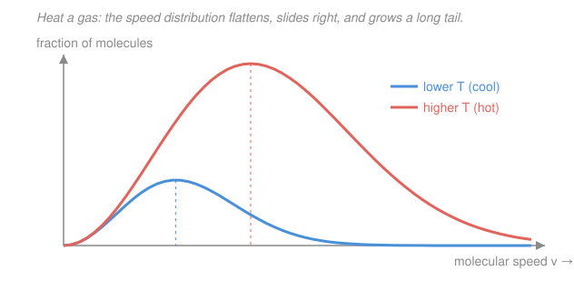

# General Chemistry · Lesson 3.1: Gases — the Ideal-Gas Law & Kinetic Theory

> ⏱ ~15 min · Module 3: Gases, Thermochemistry & Equilibrium · Builds on: [2.3 Aqueous Reactions](02-03-aqueous-reactions-precipitation-acid-base-redox.md) · Unlocks: [3.2 Thermochemistry](03-02-thermochemistry-enthalpy-calorimetry.md)

## Why this matters

Gases are the one state of matter that barely cares what it's made of: cram argon, nitrogen, or carbon dioxide into the same box at the same temperature and pressure, and each holds the *same number of molecules*. That astonishing indifference is captured in a single equation, $PV = nRT$, which turns out to be enough to predict how much gas a reaction produces, how a balloon behaves in the cold, or the molar mass of an unknown vapor. And it isn't an empirical accident — it falls straight out of picturing a gas as a swarm of tiny particles bouncing around, which is your first bridge to statistical mechanics (see the [statistical mechanics](../../stat-mech/syllabus.md) syllabus).

## The idea

Picture a sealed box full of gas molecules, each zipping in a straight line until it slams into a wall and rebounds. **Pressure** is nothing more than the accumulated drumbeat of those collisions — countless tiny impacts per second, averaged into a steady push per unit area. That single picture explains every gas law by common sense:

- Shrink the box (less **volume**): molecules hit the walls more often → pressure rises. That's Boyle.
- Heat the gas (more **temperature**): molecules move faster, hit harder and more often → pressure or volume rises. That's Charles.
- Add more molecules (more **moles**): more hits → more pressure or volume. That's Avogadro.

Every gas law is the same story with one knob turned. The remarkable part is that the *identity* of the molecule drops out: a heavy, sluggish molecule and a light, fast one deliver the same average push at the same temperature, because temperature fixes their average *kinetic energy*, not their speed. Bookkeep all three knobs at once and you get $PV = nRT$.

## The formal version

**The ideal-gas law.**

$$PV = nRT$$

- $P$ = pressure, in atmospheres (atm) or pascals (Pa; $1\ \mathrm{atm} = 101{,}325\ \mathrm{Pa}$).
- $V$ = volume, in liters (L).
- $n$ = amount of gas, in moles (mol).
- $T$ = temperature, **always in kelvin** ($T_{\mathrm K} = T_{^\circ\mathrm C} + 273.15$). This is the single most common gas-law mistake — Celsius will silently wreck every answer.
- $R$ = the universal gas constant, $0.08206\ \mathrm{L\,atm/(mol\,K)}$ if you work in atm and L, or $8.314\ \mathrm{J/(mol\,K)}$ in SI.

*In words: pressure times volume equals the amount of gas times a universal constant times absolute temperature.* Pick your $R$ to match your units and the whole thing stays consistent.

**The simple laws as special cases.** Hold two quantities fixed and $PV = nRT$ collapses:

$$PV = \text{const}\ (\text{Boyle: fixed } n,T), \qquad \frac{V}{T} = \text{const}\ (\text{Charles: fixed } n,P), \qquad V \propto n\ (\text{Avogadro: fixed } P,T).$$

Combine the first two and you get the **combined gas law**, the workhorse for "before/after" problems where $n$ doesn't change:

$$\frac{P_1 V_1}{T_1} = \frac{P_2 V_2}{T_2}.$$

*In words: the group $PV/T$ is constant for a fixed amount of gas, so any change in one variable is compensated by the others.*

**Molar volume and density.** At **STP** (standard temperature and pressure: $0\,^\circ\mathrm C = 273.15\ \mathrm K$ and $1\ \mathrm{atm}$), one mole of any ideal gas occupies

$$V_m = \frac{RT}{P} = \frac{(0.08206)(273.15)}{1} \approx 22.4\ \mathrm{L/mol}.$$

Rearranging $PV = nRT$ with $n = m/M$ (mass over molar mass) gives gas density $\rho = m/V$:

$$\rho = \frac{PM}{RT} \qquad\Longleftrightarrow\qquad M = \frac{\rho RT}{P}.$$

*In words: denser gases are heavier per mole — so measuring a gas's density at known $P,T$ hands you its molar mass.*

**Dalton's law of partial pressures.** In a mixture, each gas pushes on the walls independently, so the total pressure is the sum of the parts:

$$P_\text{total} = \sum_i P_i, \qquad P_i = x_i\, P_\text{total},$$

where $x_i = n_i / n_\text{total}$ is the **mole fraction** of gas $i$. *In words: each gas contributes pressure in proportion to how many of the molecules are it.* One everyday use: gas collected over water is contaminated by water vapor, so $P_\text{gas} = P_\text{total} - P_{\ce{H2O}}$ (look up $P_{\ce{H2O}}$ at the temperature).

**Kinetic-molecular theory — the *why* behind the law.** Model the gas as: (1) many tiny particles in constant random motion, (2) whose own volume is negligible next to the container, (3) with no forces between them, colliding (4) perfectly elastically. Grinding through the mechanics of wall collisions yields $PV = nRT$ *and* the punchline that average translational kinetic energy depends **only** on temperature:

$$\overline{KE} = \tfrac{3}{2} k_B T,$$

where $k_B = 1.381\times10^{-23}\ \mathrm{J/K}$ is Boltzmann's constant. Setting $\overline{KE} = \tfrac12 m \overline{v^2}$ and solving for the root-mean-square speed of a gas of molar mass $M$ (in kg/mol):

$$v_\text{rms} = \sqrt{\frac{3RT}{M}}.$$

*In words: at a given temperature every gas carries the same average kinetic energy, so lighter molecules must move faster.* Halve the mass and speeds rise by $\sqrt2$; this is why hydrogen leaks and effuses faster than oxygen (**Graham's law**: effusion rate $\propto 1/\sqrt M$). The full spread of speeds — not just the average — is the **Maxwell–Boltzmann distribution**, which is exactly where the [statistical mechanics](../../stat-mech/syllabus.md) course picks up the thread.

**Real gases.** The four assumptions fail when molecules are crowded (high $P$) or slow and sticky (low $T$): their finite volume and mutual attraction start to matter. The **van der Waals equation** patches both:

$$\left(P + \frac{a n^2}{V^2}\right)(V - nb) = nRT.$$

*In words: $a$ corrects for intermolecular attraction (which pulls molecules inward, lowering the pressure they exert), and $b$ subtracts off the volume the molecules themselves occupy.* At low pressure both corrections vanish and you recover $PV = nRT$.

## Picture

The area under each curve is fixed (it's *all* the molecules), so as heating spreads the distribution rightward, the peak drops and a long fast tail grows — the physical meaning of "average kinetic energy rises with $T$."

## Worked examples

**Example 1 (mechanical — plug into $PV = nRT$).** What volume does $0.500\ \mathrm{mol}$ of an ideal gas occupy at $2.00\ \mathrm{atm}$ and $25\,^\circ\mathrm C$?

First convert temperature: $T = 25 + 273.15 = 298\ \mathrm K$. Then solve for $V$:

$$V = \frac{nRT}{P} = \frac{(0.500)(0.08206)(298)}{2.00} \approx 6.11\ \mathrm{L}.$$

Choosing $R = 0.08206$ (matching atm and L) means the units cancel to leave liters — no further conversion needed.

**Example 2 (why you'd care — molar mass from density).** A reaction produces a gas whose density is $1.34\ \mathrm{g/L}$ at $1.00\ \mathrm{atm}$ and $273\ \mathrm K$. What is it?

$$M = \frac{\rho RT}{P} = \frac{(1.34)(0.08206)(273)}{1.00} \approx 30.0\ \mathrm{g/mol}.$$

A molar mass near $30\ \mathrm{g/mol}$ points to $\ce{NO}$ ($14 + 16 = 30$) or $\ce{C2H6}$ ($24 + 6 = 30$) — density alone won't distinguish isomers, but it has pinned the molar mass cold. This is exactly how unknown vapors were identified before mass spectrometers.

## Watch out

- **You might use Celsius in $PV = nRT$.** Never. The law is built on *absolute* temperature — $0\ \mathrm K$ is where molecular motion stops. Plugging in $25$ instead of $298$ isn't a small error; it changes the answer by more than tenfold. Convert to kelvin *first*, every time.
- **You might think 22.4 L/mol works at any conditions.** It's the molar volume **only at STP** ($0\,^\circ\mathrm C$, $1\ \mathrm{atm}$). At room temperature it's already about $24.5\ \mathrm{L/mol}$. When in doubt, don't memorize 22.4 — just compute $V = nRT/P$.
- **You might expect real gases to always exert *less* pressure than ideal.** Attractions ($a$) do lower pressure, but at very high pressure the finite molecular volume ($b$) dominates and pushes the real pressure *above* ideal. The two corrections fight, and which wins depends on the regime.

## One-liner

> A gas is a swarm of tiny particles whose wall-collisions are pressure and whose average kinetic energy is temperature — bookkeep that and every gas law is $PV = nRT$.

## Problems

**P1 (🟢)** Find the volume occupied by $2.00\ \mathrm{mol}$ of an ideal gas at $300\ \mathrm K$ and $1.50\ \mathrm{atm}$. (Check that your temperature is already in kelvin.)

**P2 (🟡)** A gas has a density of $1.96\ \mathrm{g/L}$ at STP. Find its molar mass and identify the gas.

**P3 (🔴)** A metal–acid reaction liberates $0.0375\ \mathrm{mol}$ of $\ce{H2}$ gas, which is collected at STP. (a) What volume does it occupy? (b) Compare the root-mean-square speed of these $\ce{H2}$ molecules to that of $\ce{O2}$ molecules at the same temperature — which is faster, and by what factor?

Solutions

**P1** Temperature is already in kelvin, so solve $PV = nRT$ for $V$:

$$V = \frac{nRT}{P} = \frac{(2.00)(0.08206)(300)}{1.50} = \frac{49.24}{1.50} \approx 32.8\ \mathrm{L}.$$

*Check.* Units: $\dfrac{\mathrm{mol}\cdot\frac{\mathrm{L\,atm}}{\mathrm{mol\,K}}\cdot\mathrm K}{\mathrm{atm}} = \mathrm L$ ✓. Sanity: at STP $2\ \mathrm{mol}$ would be $44.8\ \mathrm L$; here it's warmer than STP (good, wants more volume) but at $1.5\times$ the pressure (wants less), and $32.8 < 44.8$ — the pressure squeeze wins, as expected. ✓

**P2** Use $M = \dfrac{\rho RT}{P}$ with STP values $T = 273\ \mathrm K$, $P = 1.00\ \mathrm{atm}$:

$$M = \frac{(1.96)(0.08206)(273)}{1.00} \approx 43.9\ \mathrm{g/mol}.$$

That's $\approx 44\ \mathrm{g/mol}$ — carbon dioxide, $\ce{CO2}$ ($12 + 2\times16 = 44$).

*Check.* Equivalently, at STP $M = \rho \times 22.4\ \mathrm{L/mol} = 1.96 \times 22.4 \approx 43.9\ \mathrm{g/mol}$ — same answer, confirming the density route. ✓

**P3 (a)** At STP each mole is $22.4\ \mathrm L$, so

$$V = n \times 22.4\ \mathrm{L/mol} = 0.0375 \times 22.4 \approx 0.840\ \mathrm{L}.$$

**(b)** From $v_\text{rms} = \sqrt{3RT/M}$, at the same $T$ the ratio depends only on molar mass:

$$\frac{v_\text{rms}(\ce{H2})}{v_\text{rms}(\ce{O2})} = \sqrt{\frac{M_{\ce{O2}}}{M_{\ce{H2}}}} = \sqrt{\frac{32.0}{2.02}} \approx \sqrt{16} = 4.$$

So $\ce{H2}$ molecules move about **4 times faster** than $\ce{O2}$ molecules at the same temperature — the lighter molecule must be quicker to carry the same average kinetic energy $\tfrac32 k_B T$.

*Check.* Units of the volume: $\mathrm{mol}\cdot\mathrm{L/mol} = \mathrm L$ ✓. The speed ratio is dimensionless and greater than 1 for the lighter gas, exactly as kinetic theory demands. ✓

## Flashback

**From Lesson 2.3 (Aqueous Reactions):** Zinc metal reacts with hydrochloric acid: $\ce{Zn(s) + 2HCl(aq) -> ZnCl2(aq) + H2(g)}$. Assign oxidation numbers to zinc and to hydrogen on both sides, and identify what is oxidized and what is reduced. (Fresh variant — this is the very reaction that generated the $\ce{H2}$ in P3.)

Solution

Oxidation numbers:

- **Zinc:** $\ce{Zn(s)}$ is a free element, so it is $0$; in $\ce{ZnCl2}$ zinc is $+2$. Zinc goes $0 \to +2$ — it **loses** electrons, so it is **oxidized** (and is the reducing agent).
- **Hydrogen:** in $\ce{HCl}$ hydrogen is $+1$ (bonded to more-electronegative chlorine); in $\ce{H2(g)}$ it is $0$ (free element). Hydrogen goes $+1 \to 0$ — it **gains** electrons, so it is **reduced**.

Chlorine stays $-1$ throughout (spectator). The half-reactions are $\ce{Zn -> Zn^2+ + 2e-}$ (oxidation) and $\ce{2H+ + 2e- -> H2}$ (reduction); the two electrons transferred balance.

*Check.* One species oxidized and one reduced, with electrons lost equal to electrons gained ($2 = 2$) — the hallmark of a balanced redox reaction. ✓

## Connections

- **Backward:** the mole–mass bookkeeping here ($n = m/M$, molar volume) is the [mole and molar-mass machinery](02-01-mole-molar-mass-formulas.md) from Module 2 applied to gases; P3 uses the [stoichiometry](02-02-stoichiometry-limiting-reagents.md) habit of converting moles of product into a measurable quantity, and its reaction is the redox process from [2.3](02-03-aqueous-reactions-precipitation-acid-base-redox.md).
- **Forward:** [3.2 Thermochemistry](03-02-thermochemistry-enthalpy-calorimetry.md) tracks the *energy* a gas carries and exchanges as heat and work — the $\tfrac32 k_B T$ kinetic energy of this lesson is the microscopic root of that heat. Gas-phase equilibria in [3.4](03-04-chemical-equilibrium-k-le-chatelier.md) are written in partial pressures straight from Dalton's law.
- **Sideways (physics):** kinetic-molecular theory is the doorway to [statistical mechanics](../../stat-mech/syllabus.md) — the Maxwell–Boltzmann speed distribution in the figure, the equipartition result $\overline{KE} = \tfrac32 k_B T$, and Boltzmann's constant $k_B$ all live there in full generality. The elastic-collision picture is the same one [Newtonian mechanics](../../mechanics-refresher/syllabus.md) uses for momentum transfer.
