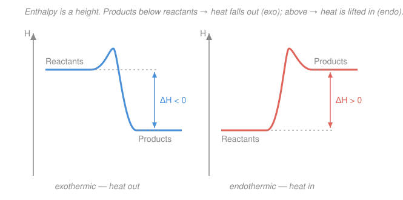

# General Chemistry · Lesson 3.2: Thermochemistry — Enthalpy & Calorimetry

> ⏱ ~15 min · Module 3: Gases, Thermochemistry & Equilibrium · Builds on: [3.1 Gases & the ideal-gas law](03-01-gases-ideal-gas-law-kinetic-theory.md) · Unlocks: [3.3 Hess's law & enthalpies of formation](03-03-hess-law-enthalpies-formation.md)

## Why this matters

Every reaction moves energy. Burning fuel, dissolving a salt, a hand-warmer clicking to life — each one either dumps heat into the room or quietly drinks it in. Thermochemistry is the bookkeeping that says *how much* and *which way*. The central quantity, the **enthalpy change** $\Delta H$, is the number stamped on every reaction in the rest of chemistry: it drives Hess's law next lesson ([3.3](03-03-hess-law-enthalpies-formation.md)), decides which way equilibria shift when you heat them ([3.4](03-04-chemical-equilibrium-k-le-chatelier.md)), and is the chemist's slice of the physicists' first law of thermodynamics — the same energy conservation you'll meet formally in thermodynamics and statistical mechanics.

## The idea

Split the universe into two pieces: the **system** (the reaction you care about — the molecules in the flask) and the **surroundings** (everything else — the solvent, the flask, the air, you). Energy can cross the boundary two ways: as **heat** ($q$, flow driven by a temperature difference) or as **work** ($w$, pushing on something). The first law just says energy is never lost, only moved: whatever the system gains, the surroundings lose.

For chemistry there's a lovely simplification. Most reactions happen in an open beaker — constant atmospheric pressure — and gases do only piddling amounts of push-the-air work compared to the heat sloshing around. So chemists track *heat* almost exclusively, and give it a name: at constant pressure, the heat of a reaction is its **enthalpy change** $\Delta H$. Negative $\Delta H$ means the beaker gets warm (energy leaks out as heat — **exothermic**); positive means it goes cold (the reaction pulls heat in — **endothermic**). That's the whole emotional content of the subject: *does it feel hot or cold, and by how much?*

And "how much" you measure the obvious way — stick a thermometer in and watch the temperature move. That's **calorimetry**.

## The formal version

**First law.** The change in a system's **internal energy** $U$ (its total microscopic energy, in joules J) is

$$\Delta U = q + w,$$

where $q$ is heat added *to* the system and $w$ is work done *on* the system. *In words: a system's energy rises by whatever heat you pour in plus whatever work you do on it.* Sign convention (the one that makes the plus signs work): **heat in is positive, work done on the system is positive**. When a gas expands and pushes the surroundings, the system does work *on* them, so $w<0$.

**Enthalpy.** Define

$$H = U + PV,$$

with $P$ the pressure and $V$ the volume. $H$ is a bookkeeping combination, but it earns its keep at **constant pressure**: there the only work is the gas expanding against $P$ (so $w=-P\Delta V$), and a line of algebra gives

$$\boxed{\;\Delta H = q_p\;}$$

*In words: at constant pressure, the enthalpy change simply equals the heat exchanged.* That's why $\Delta H$ is the chemist's currency — it's the heat you actually feel, already corrected for the little bit of expansion work. $H$ is a **state function**: it depends only on the start and end states, not the path (the fact that powers Hess's law in [3.3](03-03-hess-law-enthalpies-formation.md)).

- $\Delta H < 0$ — **exothermic**: system releases heat, surroundings warm up.
- $\Delta H > 0$ — **endothermic**: system absorbs heat, surroundings cool down.

**Heat and temperature.** How much does a given amount of heat move the thermometer? For a pure substance,

$$q = m\,c\,\Delta T,$$

where $m$ is mass (g), $\Delta T = T_\text{final}-T_\text{initial}$ (°C or K — the *change* is the same either way), and $c$ is the **specific heat** — joules to warm one gram by one degree, in $\mathrm{J/(g\cdot{}^\circ C)}$. *In words: heat = mass × how stubborn the substance is × how far the temperature moved.* Water is famously stubborn: $c_\text{water} = 4.18\ \mathrm{J/(g\cdot{}^\circ C)}$, which is why oceans buffer climate and why you scald your tongue on soup long after the bowl has cooled. If you'd rather track a whole object than per-gram, lump $mc$ into one **heat capacity** $C$ (J/°C) and write $q = C\,\Delta T$.

**Calorimetry.** To measure a reaction's heat, run it in an insulated container and let it warm (or cool) a known mass of stuff. Energy conservation across the insulated boundary means the heat the reaction releases is exactly the heat the surroundings gain:

$$q_\text{reaction} = -\,q_\text{calorimeter}.$$

*In words: whatever the reaction gives up, the water-and-cup soaks up — equal and opposite.* Two flavors of instrument:

- **Coffee-cup calorimeter** — a reaction in solution in an insulated cup, open to the air, so **constant pressure**. It measures $q_p = \Delta H$ directly. This is the everyday tool.
- **Bomb calorimeter** — a sealed rigid steel vessel, so **constant volume** ($\Delta V=0$, hence $w=0$). It measures $q_v = \Delta U$, not $\Delta H$. Used for combustion (food Calories, fuels).

**Thermochemical equations.** A balanced equation with its $\Delta H$ attached, e.g. $\ce{CH4(g) + 2O2(g) -> CO2(g) + 2H2O(l)}$, $\Delta H = -890\ \mathrm{kJ}$, carries two rules that make $\Delta H$ compose like arithmetic:

1. **$\Delta H$ scales with amount.** It's *per mole of reaction as written*. Double every coefficient and you double $\Delta H$; run half as much and you halve it. (Enthalpy is *extensive* — proportional to how much stuff reacts.)
2. **$\Delta H$ reverses sign when the reaction reverses.** If forward releases $890\ \mathrm{kJ}$, backward absorbs $890\ \mathrm{kJ}$: $\Delta H_\text{reverse} = -\Delta H_\text{forward}$.

Those two rules are the entire machinery Hess's law ([3.3](03-03-hess-law-enthalpies-formation.md)) will exploit to add reactions together.

## Picture

Height on the vertical axis *is* enthalpy. The curve climbs over an activation barrier (the transition state — kinetics, [4.3](04-03-taste-of-kinetics.md)) either way, but $\Delta H$ cares only about the two **levels**: reactants minus products. Downhill (blue) sheds heat; uphill (coral) drinks it.

## Worked examples

**Example 1 (mechanical — heat a known mass).** How much heat warms $150\ \mathrm{g}$ of water from $25\,^\circ\mathrm{C}$ to $100\,^\circ\mathrm{C}$?

$$q = m\,c\,\Delta T = 150 \times 4.18 \times (100-25) = 150 \times 4.18 \times 75 = 47{,}025\ \mathrm{J} \approx 47.0\ \mathrm{kJ}.$$

Positive, because we *added* heat. Notice the mass and the specific heat are what make boiling a full kettle take real time.

**Example 2 (why you'd care — a coffee-cup measurement).** A student mixes solutions in a coffee-cup calorimeter; the reaction consumes $0.0400\ \mathrm{mol}$ of reactant and the $120.0\ \mathrm{g}$ of solution warms from $21.0\,^\circ\mathrm{C}$ to $28.0\,^\circ\mathrm{C}$. Find $\Delta H$ per mole. (Take the solution's specific heat as water's, $4.18\ \mathrm{J/(g\cdot{}^\circ C)}$.)

The solution *gained* heat:

$$q_\text{cal} = m\,c\,\Delta T = 120.0 \times 4.18 \times (28.0-21.0) = 120.0 \times 4.18 \times 7.0 = 3511\ \mathrm{J} = 3.51\ \mathrm{kJ}.$$

By conservation the reaction *lost* that heat: $q_\text{rxn} = -q_\text{cal} = -3.51\ \mathrm{kJ}$. It's constant pressure, so $\Delta H = q_\text{rxn}$. Per mole:

$$\Delta H = \frac{-3.51\ \mathrm{kJ}}{0.0400\ \mathrm{mol}} = -87.8\ \mathrm{kJ/mol}.$$

Negative — exothermic, matching the warming we saw. That single number now plugs straight into Hess's-law cycles next lesson.

## Watch out

- **You might sign $q_\text{rxn}$ from the reaction's point of view but read $\Delta T$ from the water's.** They're opposite. If the solution *warms* ($\Delta T>0$), the reaction *released* heat, so $q_\text{rxn}<0$ and $\Delta H<0$. Always insert the minus sign: $q_\text{rxn}=-q_\text{cal}$.
- **You might think a bomb calorimeter gives $\Delta H$.** It doesn't — it's constant *volume*, so it measures $\Delta U = q_v$. Only the constant-*pressure* coffee cup hands you $\Delta H$ directly. (The two differ by the $\Delta(PV)$ term, usually small.)
- **You might forget $\Delta H$ is per mole *of reaction as written*.** A $\Delta H$ quoted for $\ce{2H2 + O2 -> 2H2O}$ is for *two* moles of water forming; halve the equation and you must halve $\Delta H$. Units of "kJ/mol" always beg the question "per mole of *what*?"

## One-liner

> At constant pressure the heat of a reaction *is* its enthalpy change $\Delta H$ — measure it by watching a known mass change temperature ($q=mc\Delta T$), remembering the reaction loses exactly what the calorimeter gains.

## Problems

**P1 (🟢)** How much heat (in kJ) is required to warm $250\ \mathrm{g}$ of water from $20\,^\circ\mathrm{C}$ to $80\,^\circ\mathrm{C}$? Use $c = 4.18\ \mathrm{J/(g\cdot{}^\circ C)}$.

**P2 (🟡)** In a coffee-cup calorimeter, a reaction warms $100.0\ \mathrm{g}$ of solution by $6.5\,^\circ\mathrm{C}$. Taking $c = 4.18\ \mathrm{J/(g\cdot{}^\circ C)}$, find $q_\text{rxn}$. If $0.0500\ \mathrm{mol}$ of reactant was consumed, what is $\Delta H$ per mole, and is the reaction exo- or endothermic?

**P3 (🔴)** $1.70\ \mathrm{g}$ of a salt ($M = 85.0\ \mathrm{g/mol}$) is dissolved in $75.0\ \mathrm{g}$ of water in a coffee-cup calorimeter; the temperature *falls* from $22.0\,^\circ\mathrm{C}$ to $18.5\,^\circ\mathrm{C}$. Treat the solution mass as $75.0\ \mathrm{g}$ with $c=4.18\ \mathrm{J/(g\cdot{}^\circ C)}$. (a) Is dissolving exo- or endothermic? (b) Find $\Delta H$ in kJ/mol with the correct sign. (c) What happens to $\Delta H$ if you write the dissolution equation for twice as much salt? If you write it in reverse (crystallization)?

Solutions

**P1** Directly from $q=mc\Delta T$ with $\Delta T = 80-20 = 60\,^\circ\mathrm{C}$:

$$q = 250 \times 4.18 \times 60 = 62{,}700\ \mathrm{J} = 62.7\ \mathrm{kJ}.$$

*Check.* Positive (heat added), and roughly warming a quarter-litre by 60 degrees costs tens of kJ — a small kettle's worth. Units: $\mathrm{g}\cdot\mathrm{J/(g\cdot{}^\circ C)}\cdot{}^\circ\mathrm{C} = \mathrm{J}$ ✓.

**P2** The solution gained heat:

$$q_\text{cal} = 100.0 \times 4.18 \times 6.5 = 2717\ \mathrm{J} = 2.72\ \mathrm{kJ}.$$

The reaction supplied it: $q_\text{rxn} = -q_\text{cal} = -2.72\ \mathrm{kJ}$. Then

$$\Delta H = \frac{-2.72\ \mathrm{kJ}}{0.0500\ \mathrm{mol}} = -54.3\ \mathrm{kJ/mol}.$$

The solution warmed, so the reaction is **exothermic** ($\Delta H<0$) — consistent with the negative sign.

**P3** Temperature *dropped*, so the solution *lost* heat:

$$q_\text{cal} = m\,c\,\Delta T = 75.0 \times 4.18 \times (18.5-22.0) = 75.0 \times 4.18 \times (-3.5) = -1097\ \mathrm{J} = -1.10\ \mathrm{kJ}.$$

(a) The dissolution *absorbed* that heat: $q_\text{rxn} = -q_\text{cal} = +1.10\ \mathrm{kJ}$, positive — **endothermic** (the cup felt cold; classic cold-pack behavior).

(b) Moles of salt: $n = 1.70\ \mathrm{g} \div 85.0\ \mathrm{g/mol} = 0.0200\ \mathrm{mol}$. So

$$\Delta H = \frac{+1.10\ \mathrm{kJ}}{0.0200\ \mathrm{mol}} = +54.9\ \mathrm{kJ/mol}.$$

(c) $\Delta H$ is extensive: **doubling** the amount of salt in the written equation **doubles** it to $+109.8\ \mathrm{kJ}$ per mole of reaction as written. **Reversing** it (crystallization from solution) **flips the sign** to $-54.9\ \mathrm{kJ/mol}$ — crystallizing this salt would release heat.

*Check.* Endothermic dissolving matching a temperature drop, and $+55\ \mathrm{kJ/mol}$ is the right order of magnitude for a salt like ammonium nitrate. ✓

## Flashback

**From Lesson 3.1 (Gases & the ideal-gas law):** What volume does $0.50\ \mathrm{mol}$ of an ideal gas occupy at $300\ \mathrm{K}$ and $1.5\ \mathrm{atm}$? Use $R = 0.08206\ \mathrm{L\cdot atm/(mol\cdot K)}$.

Solution

Rearrange $PV = nRT$ for volume:

$$V = \frac{nRT}{P} = \frac{0.50 \times 0.08206 \times 300}{1.5} = \frac{12.31}{1.5} \approx 8.2\ \mathrm{L}.$$

*Check.* Units: $\dfrac{\mathrm{mol}\cdot\mathrm{L\cdot atm/(mol\cdot K)}\cdot\mathrm{K}}{\mathrm{atm}} = \mathrm{L}$ ✓. Sanity: one mole at STP-ish conditions is roughly 22 L; half a mole at slightly above 1 atm landing near 8 L is the right ballpark. ✓

## Connections

- **Backward:** the "per mole" conversions that turn a measured heat into $\Delta H$ in kJ/mol are the same mole bookkeeping from [2.1](02-01-mole-molar-mass-formulas.md) and [2.2](02-02-stoichiometry-limiting-reagents.md); the balanced equations carrying $\Delta H$ are those stoichiometric equations wearing an energy tag.
- **Forward:** [3.3 Hess's law](03-03-hess-law-enthalpies-formation.md) turns the two thermochemical-equation rules (scaling and sign-reversal) into a full algebra for adding reactions to get $\Delta H$ without ever running them; the exo/endo language returns in [3.4](03-04-chemical-equilibrium-k-le-chatelier.md) to predict how heating shifts an equilibrium.
- **Sideways (physics):** $\Delta U = q + w$ and the state function $H = U + PV$ are the chemist's entry point to the [first law of thermodynamics](../../thermodynamics-physics/syllabus.md) — and the reason enthalpy is a *state* function (path-independent) is exactly the microscopic energy-counting made precise in statistical mechanics.
