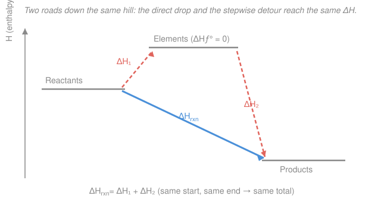

# General Chemistry · Lesson 3.3: Hess's Law & Enthalpies of Formation

> ⏱ ~15 min · Module 3: Gases, Thermochemistry & Equilibrium · Builds on: [3.2 Thermochemistry: enthalpy & calorimetry](03-02-thermochemistry-enthalpy-calorimetry.md) · Unlocks: [3.4 Chemical equilibrium & Le Châtelier](03-04-chemical-equilibrium-k-le-chatelier.md)

## Why this matters

You can't always stick a reaction in a calorimeter — some are too slow, too explosive, or run through messy side products. Yet you still need its $\Delta H$. Hess's law is the accountant's trick that gets it anyway: build the reaction you want out of reactions you *can* measure, and just add up the heats. It rests on one clean fact — enthalpy is a **state function** — which is the same idea that anchors the first law of thermodynamics (see thermodynamics-physics). Combine it with a single tabulated number per compound and you can predict the heat of essentially *any* reaction without lighting a match.

## The idea

Imagine you hike from a mountaintop lodge down to a lake. The elevation you lose is fixed — it's just (lodge height) − (lake height) — no matter whether you take the steep direct trail or a winding path through a meadow and back down. Altitude is a **state function**: it depends only on *where you are*, not on *how you got there*.

Enthalpy behaves exactly the same way. The heat released or absorbed by a reaction depends only on the initial reactants and the final products — not on the sequence of steps in between. So if the reaction you care about can be written as a **sum of steps**, its $\Delta H$ is just the **sum of the steps' $\Delta H$**. That's **Hess's law**. And it gives you a toolkit: you can add reactions, reverse them (which flips the sign of $\Delta H$), and scale them up or down (which scales $\Delta H$ by the same factor) — whatever it takes to make the pieces assemble into your target.

Push this to its logical end and you get an even slicker tool. Route *every* reaction through the same universal waypoint — the pure elements — and each compound gets a single characteristic number, its **enthalpy of formation**. Then every reaction's heat is one subtraction: products minus reactants.

## The formal version

**State function → Hess's law.** Enthalpy $H$ is a state function, so for any reaction the change $\Delta H$ depends only on the initial and final states. Therefore, if a target reaction is the algebraic sum of steps,

$$\Delta H_\text{target} = \sum_i \Delta H_i.$$

*In words: if you build a reaction by adding up other reactions, you add up their enthalpy changes too.* The manipulation rules:

- **Reverse** a reaction $\Rightarrow$ flip the sign of its $\Delta H$ (going uphill costs exactly what going downhill returned).
- **Multiply** a reaction by a factor $n$ $\Rightarrow$ multiply its $\Delta H$ by $n$ (twice the reaction, twice the heat — $\Delta H$ is *extensive*).
- **Add** reactions $\Rightarrow$ add their $\Delta H$; cancel any species that appear identically on both sides.

**Standard enthalpy of formation.** The **standard enthalpy of formation** $\Delta H_f^\circ$ of a compound is the enthalpy change to form **1 mol** of it from its constituent **elements in their standard states**, at standard conditions ($25\,^\circ\mathrm{C}$, $1\ \mathrm{atm}$). The little circle $^\circ$ means "standard conditions"; the subscript $f$ means "formation." *In words: the heat of the reaction "elements → one mole of compound."*

By definition, **an element already in its standard state has $\Delta H_f^\circ = 0$** — forming it from itself changes nothing. Standard states are the stablest form at those conditions: $\ce{O2(g)}$ (not $\ce{O}$ atoms or $\ce{O3}$), $\ce{H2(g)}$, $\ce{N2(g)}$, $\ce{C(graphite)}$ (not diamond), $\ce{Hg(l)}$, $\ce{Na(s)}$.

**The master formula.** Because every reactant and product can be decomposed into or built from elements, Hess's law through formation reactions collapses to:

$$\boxed{\;\Delta H_\text{rxn}^\circ = \sum n\,\Delta H_f^\circ(\text{products}) \;-\; \sum n\,\Delta H_f^\circ(\text{reactants})\;}$$

where $n$ is each species' stoichiometric coefficient. *In words: add up the formation enthalpies of the products, subtract those of the reactants, each weighted by how many moles the balanced equation calls for.* Elements in their standard states drop out of both sums (their $\Delta H_f^\circ = 0$) — you only ever plug in the compounds.

## Picture

The direct blue path (reactants → products) and the coral detour (reactants → elements → products) start and end at the same two levels, so their total vertical drop — the total $\Delta H$ — is identical. The master formula *is* the coral path: step 1 tears reactants apart into elements ($-\sum \Delta H_f^\circ$ of reactants), step 2 assembles products from those elements ($+\sum \Delta H_f^\circ$ of products).

## Worked examples

**Example 1 (Hess's law — assemble the target).** Find $\Delta H$ for $\ce{C(s) + 1/2 O2(g) -> CO(g)}$ — impossible to measure cleanly, because carbon burning in oxygen wants to go all the way to $\ce{CO2}$. But two combustions *are* easy to measure:

$$\text{(1)}\quad \ce{C(s) + O2(g) -> CO2(g)}, \qquad \Delta H_1 = -393.5\ \mathrm{kJ}$$
$$\text{(2)}\quad \ce{CO(g) + 1/2 O2(g) -> CO2(g)}, \qquad \Delta H_2 = -283.0\ \mathrm{kJ}$$

I want $\ce{CO}$ as a **product**, but in (2) it's a reactant — so **reverse (2)**, flipping the sign:

$$\text{(2')}\quad \ce{CO2(g) -> CO(g) + 1/2 O2(g)}, \qquad \Delta H_{2'} = +283.0\ \mathrm{kJ}$$

Add (1) + (2'). The $\ce{CO2}$ cancels (product of one, reactant of the other), and $\ce{O2} - \tfrac12\ce{O2} = \tfrac12\ce{O2}$ on the left:

$$\ce{C(s) + 1/2 O2(g) -> CO(g)}, \qquad \Delta H = -393.5 + 283.0 = \boxed{-110.5\ \mathrm{kJ}}.$$

**Example 2 (master formula — combustion of methane).** Find $\Delta H_\text{rxn}^\circ$ for burning natural gas,

$$\ce{CH4(g) + 2O2(g) -> CO2(g) + 2H2O(l)},$$

given $\Delta H_f^\circ$ in $\mathrm{kJ/mol}$: $\ce{CH4(g)} = -74.8$, $\ce{CO2(g)} = -393.5$, $\ce{H2O(l)} = -285.8$, and $\ce{O2(g)} = 0$ (element). Apply products − reactants, weighting by coefficients:

$$\Delta H_\text{rxn}^\circ = \big[\underbrace{(-393.5)}_{\ce{CO2}} + \underbrace{2(-285.8)}_{2\,\ce{H2O}}\big] - \big[\underbrace{(-74.8)}_{\ce{CH4}} + \underbrace{2(0)}_{2\,\ce{O2}}\big]$$
$$= (-393.5 - 571.6) - (-74.8) = -965.1 + 74.8 = \boxed{-890.3\ \mathrm{kJ}}.$$

Strongly exothermic, as burning a fuel should be — the negative sign is the heat that warms your house. Notice $\ce{O2}$ contributed nothing; only the three compounds mattered.

## Watch out

- **You might forget to flip the sign when you reverse a reaction.** Reversing turns an exothermic step into an endothermic one — the magnitude stays, the sign flips. Skipping this is the single most common Hess's-law error.
- **You might scale the equation but not its $\Delta H$.** If you double a reaction to get the coefficients to match, you must double its $\Delta H$ too. The heat is *extensive* — it tracks the amount of stuff.
- **You might plug the master formula in as reactants − products.** It's **products minus reactants**. Reverse it and every sign is wrong. (Memory hook: the products are what you *end* with, and $\Delta H = H_\text{final} - H_\text{initial}$.)
- **You might assign a nonzero $\Delta H_f^\circ$ to an element.** Only the *standard-state* form is zero — $\ce{O2(g)}$ is $0$, but atomic $\ce{O(g)}$ or ozone $\ce{O3(g)}$ are not, because making them from $\ce{O2}$ costs energy.

## One-liner

> Enthalpy is a state function, so heats of reaction add like altitudes — reverse-and-flip, scale-and-multiply your way to any target, or route everything through the elements and just take products minus reactants.

## Problems

**P1 (🟢)** You're given two reactions:

$$\text{(A)}\quad \ce{H2(g) + 1/2 O2(g) -> H2O(g)}, \qquad \Delta H_A = -242\ \mathrm{kJ}$$
$$\text{(B)}\quad \ce{2H2(g) + O2(g) -> 2H2O(l)}, \qquad \Delta H_B = -572\ \mathrm{kJ}$$

Combine them (reverse and/or scale as needed) to find $\Delta H$ for the condensation of water vapor, $\ce{H2O(g) -> H2O(l)}$.

**P2 (🟡)** Using $\Delta H_f^\circ$ values (kJ/mol): $\ce{C2H4(g)} = +52.4$, $\ce{CO2(g)} = -393.5$, $\ce{H2O(l)} = -285.8$, $\ce{O2(g)} = 0$, compute $\Delta H_\text{rxn}^\circ$ for the combustion of ethylene:

$$\ce{C2H4(g) + 3O2(g) -> 2CO2(g) + 2H2O(l)}.$$

**P3 (🔴, Boss-3 rehearsal)** For the Haber synthesis of ammonia,

$$\ce{N2(g) + 3H2(g) -> 2NH3(g)}, \qquad \Delta H_f^\circ(\ce{NH3}) = -46\ \mathrm{kJ/mol},$$

with the elements $\ce{N2(g)}$ and $\ce{H2(g)}$ in their standard states. Use the master formula to verify $\Delta H_\text{rxn}^\circ = -92\ \mathrm{kJ}$, and explain in one sentence why the elements contribute zero.

Solutions

**P1** Target: $\ce{H2O(g) -> H2O(l)}$ — vapor is a reactant, liquid a product.

- $\ce{H2O(g)}$ must appear on the **left**, but in (A) it's a product, so **reverse (A)**: $\ce{H2O(g) -> H2(g) + 1/2 O2(g)}$, $\Delta H = +242\ \mathrm{kJ}$.
- $\ce{H2O(l)}$ must appear on the **right**; (B) makes 2 mol of it, so **scale (B) by $\tfrac12$**: $\ce{H2(g) + 1/2 O2(g) -> H2O(l)}$, $\Delta H = \tfrac12(-572) = -286\ \mathrm{kJ}$.

Add the two. The $\ce{H2}$ and $\tfrac12\ce{O2}$ cancel (product of the first, reactant of the second):

$$\ce{H2O(g) -> H2O(l)}, \qquad \Delta H = +242 + (-286) = \boxed{-44\ \mathrm{kJ}}.$$

*Check.* Condensation releases heat (exothermic, $\Delta H < 0$) — correct in sign, and $-44\ \mathrm{kJ/mol}$ is indeed water's heat of vaporization with the sign flipped. ✓

**P2** Master formula, products − reactants, weighted by coefficients:

$$\Delta H_\text{rxn}^\circ = \big[2(-393.5) + 2(-285.8)\big] - \big[(+52.4) + 3(0)\big]$$
$$= (-787.0 - 571.6) - 52.4 = -1358.6 - 52.4 = \boxed{-1411.0\ \mathrm{kJ}}.$$

*Check.* A hydrocarbon combustion should be strongly exothermic — it is. Ethylene's positive $\Delta H_f^\circ$ (it's an energy-rich, slightly unstable molecule) *raises* the reactant enthalpy, making the drop to $\ce{CO2}$ and $\ce{H2O}$ even larger. ✓

**P3** Only $\ce{NH3}$ is a compound; the reactants are elements in standard state, so $\Delta H_f^\circ = 0$ for each:

$$\Delta H_\text{rxn}^\circ = \big[2\,\Delta H_f^\circ(\ce{NH3})\big] - \big[\Delta H_f^\circ(\ce{N2}) + 3\,\Delta H_f^\circ(\ce{H2})\big] = 2(-46) - \big[0 + 3(0)\big] = \boxed{-92\ \mathrm{kJ}}.$$

The elements contribute zero because $\Delta H_f^\circ$ is defined as the heat to form a substance *from its elements in their standard states* — for an element already in that state there is nothing to form, so its formation enthalpy is exactly $0$ by definition.

*Check.* Forming 2 mol of $\ce{NH3}$ at $-46\ \mathrm{kJ}$ each gives $-92\ \mathrm{kJ}$ — the reaction enthalpy is just twice one compound's formation enthalpy here, precisely because everything else is an element. ✓

## Flashback

**From Lesson 3.2 (Thermochemistry: enthalpy & calorimetry):** In a coffee-cup calorimeter, a reaction warms $150.0\ \mathrm{g}$ of water from $25.0\,^\circ\mathrm{C}$ to $31.2\,^\circ\mathrm{C}$. Taking $c_\text{water} = 4.18\ \mathrm{J/(g\cdot{}^\circ C)}$ and assuming all the heat goes into the water, find the heat absorbed by the water, and state the sign of $\Delta H$ for the reaction.

Solution

Use $q = mc\,\Delta T$ with $\Delta T = 31.2 - 25.0 = 6.2\,^\circ\mathrm{C}$:

$$q_\text{water} = (150.0\ \mathrm{g})(4.18\ \mathrm{J/(g\cdot{}^\circ C)})(6.2\,^\circ\mathrm{C}) = 3887\ \mathrm{J} \approx \boxed{+3.89\ \mathrm{kJ}}.$$

The water *gains* this heat, so it came *from* the reaction: $q_\text{rxn} = -3.89\ \mathrm{kJ}$. The reaction releases heat, so it is **exothermic** and $\Delta H < 0$.

*Check.* Temperature went *up*, which only happens if the reaction dumps heat into the surroundings — consistent with a negative $\Delta H$, the same sign convention this lesson's combustions carry. ✓

## Connections

- **Backward:** this is the pen-and-paper counterpart to [3.2](03-02-thermochemistry-enthalpy-calorimetry.md)'s calorimetry — calorimetry *measures* $\Delta H$ for reactions you can run; Hess's law *computes* it for reactions you can't, from ones you can. Both hinge on $\Delta H$ being a state function.
- **Forward:** [3.4 Chemical equilibrium & Le Châtelier](03-04-chemical-equilibrium-k-le-chatelier.md) uses the sign and size of $\Delta H$ to predict how heating or cooling shifts an equilibrium — exothermic reactions ($\Delta H < 0$, computed here) run backward when heated. The reaction enthalpies you tabulate now also feed **Boss Problem 3**.
- **Sideways (thermodynamics):** "state function" is the load-bearing idea of the first law in thermodynamics-physics — internal energy $U$ and enthalpy $H$ depend only on state, so path-independent bookkeeping like Hess's law works. Formation enthalpies later combine with entropies to give the Gibbs free energies that decide spontaneity — the bridge into physical chemistry ([physical-chemistry syllabus](../../physical-chemistry/syllabus.md)).
