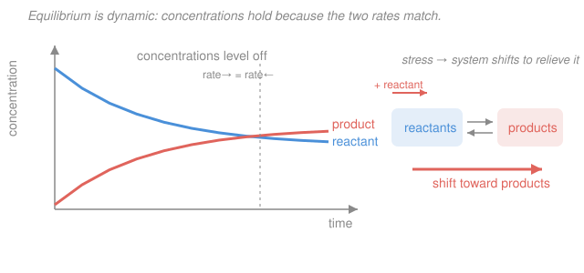

# General Chemistry · Lesson 3.4: Chemical Equilibrium: K & Le Châtelier

> ⏱ ~15 min · Module 3: Gases, Thermochemistry & Equilibrium · Builds on: [3.3 Hess's law & enthalpies of formation](03-03-hess-law-enthalpies-formation.md) · Unlocks: [4.1 Acids, bases & pH](04-01-acids-bases-ph-strength.md)

## Why this matters

Almost no reaction runs to completion. Reactants don't all convert to products — instead the reaction settles into a standoff where both are present in fixed amounts, and *that* mixture is what you actually get out of a flask. Predicting the ratio (the **equilibrium constant** $K$) and how to push it in your favor (**Le Châtelier's principle**) is the whole game of industrial chemistry: it's why the Haber process feeds the planet, and it's the exact same machinery you'll reuse for acids and bases in [4.1](04-01-acids-bases-ph-strength.md) ($K_a$, $K_b$), solubility, and buffers. The word "equilibrium" also hides a beautiful physics idea — a *dynamic* balance of two opposing rates — that reappears as the Boltzmann distribution in statistical mechanics.

## The idea

Put $\ce{H2}$ and $\ce{I2}$ in a sealed flask and they react to make $\ce{HI}$. But $\ce{HI}$ also falls apart back into $\ce{H2}$ and $\ce{I2}$. At first the forward reaction dominates (lots of reactants, little product). As reactants deplete, the forward rate slows; as product builds, the reverse rate speeds up. Eventually the two rates become **equal** — and from that instant the concentrations stop changing. Not because the reaction stopped: molecules are still converting both ways, furiously, but every $\ce{HI}$ formed is matched by one destroyed. This is **dynamic equilibrium** — a busy intersection with balanced traffic, not an empty one. We write reversible reactions with a double arrow: $\ce{H2 + I2 <=> 2HI}$.

Here's the remarkable part: no matter what amounts you start with, the *ratio* of products to reactants at equilibrium (each raised to its stoichiometric power) always lands on the same number at a given temperature. That number is $K$. A big $K$ means the balance sits far to the product side; a tiny $K$ means barely anything reacts.

## The formal version

**Equilibrium constant.** For a balanced reaction

$$\ce{aA + bB <=> cC + dD},$$

the equilibrium constant in concentrations (mol/L, denoted M) is

$$K_c = \frac{[\ce{C}]^c\,[\ce{D}]^d}{[\ce{A}]^a\,[\ce{B}]^b},$$

where each $[\ \cdot\ ]$ is the **equilibrium** concentration and the exponents are the coefficients. *In words: products over reactants, each raised to its coefficient.* **Pure solids and pure liquids are omitted** — their "concentration" is a fixed property of the substance, so they're folded into $K$. For reactions of gases you can equally use partial pressures, giving $K_p$; the two relate by

$$K_p = K_c\,(RT)^{\Delta n}, \qquad \Delta n = (\text{moles of gas products}) - (\text{moles of gas reactants}).$$

*In words: convert between the pressure and concentration constants with a factor of $RT$ per net mole of gas.* Large $K$ ($\gg 1$): products favored. Small $K$ ($\ll 1$): reactants favored.

**Reaction quotient.** The same expression evaluated at whatever concentrations you have *right now* (not necessarily equilibrium) is the quotient $Q$. Comparing $Q$ to $K$ tells you which way the reaction must move:

$$Q < K \;\Rightarrow\; \text{shift forward (right)}, \qquad Q > K \;\Rightarrow\; \text{shift reverse (left)}, \qquad Q = K \;\Rightarrow\; \text{at equilibrium}.$$

*In words: if you have too few products ($Q$ too small) the reaction makes more; too many and it eats them back.* $Q$ is your compass.

**Le Châtelier's principle.** *A system at equilibrium, when disturbed, shifts in the direction that partially counteracts the disturbance.* Concretely:

- **Add/remove a species:** the system shifts *away from* whatever you add and *toward* whatever you remove. Add reactant → shift right; remove product → shift right.
- **Compress (raise pressure / lower volume) a gas mixture:** shifts toward the side with **fewer moles of gas** (to reduce the crowding). If both sides have equal gas moles, pressure has no effect.
- **Change temperature:** treat heat as a reagent. For an **exothermic** reaction ($\Delta H < 0$, heat is a *product*), raising $T$ shifts **left** and **lowers $K$**; for endothermic, raising $T$ shifts right and raises $K$. *Temperature is the only stress that actually changes the value of $K$.*
- **Add a catalyst:** speeds the forward and reverse reactions *equally* — it reaches equilibrium faster but does **not** shift it. $K$ is unchanged.

## Picture

## Worked examples

**Example 1 (mechanical — compute $K_c$).** At $\ce{H2 + I2 <=> 2HI}$ equilibrium a flask holds $[\ce{H2}] = 0.20\ \mathrm{M}$, $[\ce{I2}] = 0.20\ \mathrm{M}$, $[\ce{HI}] = 1.0\ \mathrm{M}$. Then

$$K_c = \frac{[\ce{HI}]^2}{[\ce{H2}][\ce{I2}]} = \frac{(1.0)^2}{(0.20)(0.20)} = \frac{1.0}{0.040} = 25.$$

$K_c > 1$, so this mixture leans toward product — consistent with lots of $\ce{HI}$ and little leftover $\ce{H2}$, $\ce{I2}$. Note $K_c$ is dimensionless here because the powers cancel (2 on top, 2 on bottom); in general we treat $K$ as a pure number.

**Example 2 (why you'd care — an ICE table with the small-$x$ shortcut).** Phosgene decomposes: $\ce{COCl2(g) <=> CO(g) + Cl2(g)}$ with $K_c = 2.2\times10^{-10}$. Start with $[\ce{COCl2}] = 0.10\ \mathrm{M}$ and nothing else. Find all equilibrium concentrations.

Set up an **ICE table** (Initial / Change / Equilibrium), letting $x$ be the moles/L of $\ce{COCl2}$ that react:

| | $\ce{COCl2}$ | $\ce{CO}$ | $\ce{Cl2}$ |
|---|---|---|---|
| **I** | $0.10$ | $0$ | $0$ |
| **C** | $-x$ | $+x$ | $+x$ |
| **E** | $0.10 - x$ | $x$ | $x$ |

Plug the equilibrium row into $K_c$:

$$K_c = \frac{[\ce{CO}][\ce{Cl2}]}{[\ce{COCl2}]} = \frac{x^2}{0.10 - x} = 2.2\times10^{-10}.$$

Because $K_c$ is minuscule, almost no phosgene reacts, so $x \ll 0.10$ and $0.10 - x \approx 0.10$ (the **small-$x$ approximation**). This kills the quadratic:

$$\frac{x^2}{0.10} \approx 2.2\times10^{-10} \;\Rightarrow\; x^2 = 2.2\times10^{-11} \;\Rightarrow\; x = 4.7\times10^{-6}\ \mathrm{M}.$$

So $[\ce{CO}] = [\ce{Cl2}] = 4.7\times10^{-6}\ \mathrm{M}$ and $[\ce{COCl2}] \approx 0.10\ \mathrm{M}$. **Validate the approximation:** $x/0.10 = 4.7\times10^{-5} = 0.0047\%$, far below the 5% rule of thumb, so dropping $x$ was justified. A small $K$ literally means "the reactant side barely moves."

## Watch out

- **You might think equilibrium means the reaction stopped, or that reactants and products are equal.** Neither. Both reactions run on at equal *rates*, and the amounts are whatever makes $Q = K$ — they're rarely 50/50.
- **You might include solids and liquids in $K$.** Don't. For $\ce{CaCO3(s) <=> CaO(s) + CO2(g)}$, $K_c = [\ce{CO2}]$ alone — the two solids drop out.
- **You might think a catalyst gives you more product.** It doesn't shift equilibrium at all; it only gets you there faster. To change the *amount* of product you must change concentration, pressure, or temperature.
- **You might apply the small-$x$ shortcut when $K$ isn't small.** Only drop $x$ when it's under ~5% of the initial value; otherwise solve the full quadratic.

## One-liner

> At equilibrium the forward and reverse rates tie, pinning the ratio products/reactants at $K$; compare $Q$ to $K$ to see which way it moves, and Le Châtelier says a disturbed system shifts to undo the disturbance.

## Problems

**P1 (🟢)** (a) Write the $K_c$ expression for $\ce{C(s) + CO2(g) <=> 2CO(g)}$, remembering to omit solids. (b) At equilibrium a vessel has $[\ce{CO2}] = 0.30\ \mathrm{M}$ and $[\ce{CO}] = 0.60\ \mathrm{M}$. Compute $K_c$.

**P2 (🟡)** For $\ce{H2(g) + I2(g) <=> 2HI(g)}$, $K_c = 50.0$ at the reaction temperature. A flask currently holds $[\ce{H2}] = 0.10\ \mathrm{M}$, $[\ce{I2}] = 0.10\ \mathrm{M}$, $[\ce{HI}] = 0.50\ \mathrm{M}$. Compute $Q$ and predict which direction the reaction shifts.

**P3 (🔴, Boss-3 rehearsal)** The Haber process is $\ce{N2(g) + 3H2(g) <=> 2NH3(g)}$, $\Delta H^\circ = -92\ \mathrm{kJ}$. Predict the shift (toward $\ce{NH3}$ or away) for each stress, with a one-line justification: (i) compress the mixture, (ii) raise the temperature, (iii) remove $\ce{NH3}$ as it forms, (iv) add an iron catalyst. Then compute the initial total pressure of a charge of $2.0\ \mathrm{mol}\ \ce{N2}$ and $6.0\ \mathrm{mol}\ \ce{H2}$ in a $10.0\ \mathrm{L}$ reactor at $400\ \mathrm{K}$ (use $PV = nRT$, $R = 0.08206\ \mathrm{L\,atm\,mol^{-1}K^{-1}}$).

Solutions

**P1** (a) Carbon is a pure solid, so it's omitted:

$$K_c = \frac{[\ce{CO}]^2}{[\ce{CO2}]}.$$

(b) Substitute:

$$K_c = \frac{(0.60)^2}{0.30} = \frac{0.36}{0.30} = 1.2.$$

*Check.* $K_c \approx 1$, so neither side is strongly favored — reasonable for comparable $\ce{CO}$ and $\ce{CO2}$ amounts. ✓

**P2** Same expression as $K_c$, but with current concentrations:

$$Q = \frac{[\ce{HI}]^2}{[\ce{H2}][\ce{I2}]} = \frac{(0.50)^2}{(0.10)(0.10)} = \frac{0.25}{0.010} = 25.$$

Since $Q = 25 < K = 50.0$, there is *too little* product relative to equilibrium, so the reaction shifts **forward (right)**, making more $\ce{HI}$ until $Q$ climbs to 50.

*Check.* $Q < K$ ⇒ shift toward products; the compass points right. ✓

**P3** *Qualitative.* Balanced gas moles: 4 on the left ($1 + 3$), 2 on the right.

- **(i) Compress:** shifts toward the side with fewer gas moles — the right (2 < 4). **Toward $\ce{NH3}$.** High pressure favors ammonia (why the Haber process runs at ~200 atm).
- **(ii) Raise $T$:** the reaction is exothermic ($\Delta H^\circ = -92\ \mathrm{kJ}$, heat is a product), so adding heat shifts **away from $\ce{NH3}$ (left)** and lowers $K$. (Industrially you compromise at ~450 °C for acceptable rate despite the yield penalty.)
- **(iii) Remove $\ce{NH3}$:** removing a product pulls the reaction to replace it — shift **toward $\ce{NH3}$ (right)**. Continuously condensing out ammonia keeps driving the reaction.
- **(iv) Add catalyst:** speeds forward and reverse equally — **no shift**, just faster arrival at the same equilibrium.

*Pressure calculation.* Total moles $n = 2.0 + 6.0 = 8.0\ \mathrm{mol}$. Then

$$P = \frac{nRT}{V} = \frac{(8.0)(0.08206)(400)}{10.0} = \frac{262.6}{10.0} \approx 26.3\ \mathrm{atm}.$$

*Check.* Units: $\dfrac{\mathrm{mol}\cdot\mathrm{L\,atm\,mol^{-1}K^{-1}}\cdot\mathrm{K}}{\mathrm{L}} = \mathrm{atm}$ ✓. The total pressure depends only on total moles of gas (Dalton), not on which gases — 8 mol in 10 L at 400 K gives ~26 atm. ✓

## Flashback

**From Lesson 3.3 (Hess's law & enthalpies of formation):** Using standard enthalpies of formation, find $\Delta H^\circ$ for the ammonia-oxidation step of nitric-acid manufacture,

$$\ce{4NH3(g) + 5O2(g) -> 4NO(g) + 6H2O(g)},$$

given $\Delta H^\circ_f$: $\ce{NH3(g)} = -46.1$, $\ce{NO(g)} = +90.3$, $\ce{H2O(g)} = -241.8\ \mathrm{kJ/mol}$ (and $\ce{O2(g)} = 0$, an element in its standard state).

Solution

Use $\Delta H^\circ_{\text{rxn}} = \sum \Delta H^\circ_f(\text{products}) - \sum \Delta H^\circ_f(\text{reactants})$, each weighted by its coefficient:

$$\Delta H^\circ = \big[\,4(90.3) + 6(-241.8)\,\big] - \big[\,4(-46.1) + 5(0)\,\big]\ \mathrm{kJ}.$$

Products: $361.2 - 1450.8 = -1089.6\ \mathrm{kJ}$. Reactants: $-184.4\ \mathrm{kJ}$. So

$$\Delta H^\circ = -1089.6 - (-184.4) = -905.2\ \mathrm{kJ}.$$

*Check.* Strongly exothermic — as expected for burning ammonia, and consistent with the reaction running once lit over a hot Pt gauze. The elemental $\ce{O2}$ contributes zero, and the $-92\ \mathrm{kJ}$ Haber step above shows the same $\Delta H^\circ_f$ bookkeeping. ✓

## Connections

- **Backward:** the temperature effect on $K$ is exactly the enthalpy sign from [3.2 thermochemistry](03-02-thermochemistry-enthalpy-calorimetry.md) / [3.3](03-03-hess-law-enthalpies-formation.md) — an exothermic reaction ($\Delta H < 0$) treats heat as a product. The $K_p$–$K_c$ conversion and P3's pressure calculation are the ideal gas law $PV = nRT$ from [3.1](03-01-gases-ideal-gas-law-kinetic-theory.md).
- **Forward:** [4.1 Acids, bases & pH](04-01-acids-bases-ph-strength.md) is this lesson wearing new labels — $K_a$, $K_b$, and $K_w$ are equilibrium constants, and weak-acid problems are ICE tables with the small-$x$ shortcut. Buffers ([4.2](04-02-buffers-titration.md)) are Le Châtelier in action.
- **Sideways (physics/phys-chem):** dynamic equilibrium as a balance of opposing *rates* is the chemistry face of the Boltzmann distribution and detailed balance in statistical mechanics — see the statistical mechanics syllabus [`stat-mech`](../../stat-mech/syllabus.md). And $K$ connects to free energy through $\Delta G^\circ = -RT\ln K$, the bridge you'll build in physical chemistry [`physical-chemistry`](../../physical-chemistry/syllabus.md).
