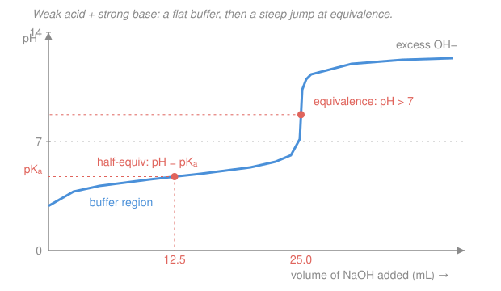

# General Chemistry · Lesson 4.2: Buffers & Titration

> ⏱ ~15 min · Module 4: Acids, Bases & Intros to Kinetics and Electrochemistry · Builds on: [4.1 Acids, bases, pH & strength](04-01-acids-bases-ph-strength.md) · Unlocks: [4.3 A taste of kinetics](04-03-taste-of-kinetics.md)

## Why this matters

Your blood sits at pH 7.4 and barely budges even as you exercise, digest, and dump acid into it — because it is a **buffer**. The same trick keeps enzymes alive, calibrates lab instruments, and stabilizes reactions. And when you slowly add base to an acid and watch the pH, you get a **titration curve** whose shape reveals both *how much* acid was there and *how strong* it was. Two ideas, one equilibrium engine — the $K_a$ machinery from [4.1](04-01-acids-bases-ph-strength.md), now put to work.

## The idea

A buffer is a **weak acid and its conjugate base living in the same beaker at comparable amounts** (equivalently, a weak base plus its conjugate acid). Why does that resist pH change? Because the solution keeps *both* a proton-donor and a proton-sponge on hand:

- Pour in acid ($\ce{H+}$)? The conjugate base $\ce{A-}$ mops it up: $\ce{A- + H+ -> HA}$.
- Pour in base ($\ce{OH-}$)? The weak acid $\ce{HA}$ neutralizes it: $\ce{HA + OH- -> A- + H2O}$.

Either way the invader is converted into a member of the pair instead of roaming free and swinging the pH. This is **Le Châtelier** from [3.4](03-04-chemical-equilibrium-k-le-chatelier.md) doing bookkeeping: stress the equilibrium $\ce{HA <=> H+ + A-}$ and it shifts to blunt the stress. The catch — a buffer only has so much $\ce{HA}$ and $\ce{A-}$ in reserve. Overwhelm either one and the pH lurches. That reserve is the buffer's **capacity**.

The punchline formula is almost embarrassingly simple: the pH is set by the acid's identity (its $\mathrm{p}K_a$) plus a small nudge from the *ratio* of base to acid. Get the ratio to 1 and the pH just equals the $\mathrm{p}K_a$.

## The formal version

Start from the $K_a$ equilibrium of the weak acid (from [4.1](04-01-acids-bases-ph-strength.md)):

$$\ce{HA <=> H+ + A-}, \qquad K_a = \frac{[\ce{H+}][\ce{A-}]}{[\ce{HA}]}.$$

Solve for $[\ce{H+}]$, then take $-\log_{10}$ of both sides. Using $\mathrm{pH} = -\log_{10}[\ce{H+}]$ and $\mathrm{p}K_a = -\log_{10}K_a$:

$$[\ce{H+}] = K_a\frac{[\ce{HA}]}{[\ce{A-}]} \;\Longrightarrow\; \boxed{\;\mathrm{pH} = \mathrm{p}K_a + \log_{10}\frac{[\ce{A-}]}{[\ce{HA}]}\;}$$

This is the **Henderson–Hasselbalch equation**. *In words: the pH is the acid's $\mathrm{p}K_a$, shifted up when there's more conjugate base than acid and down when there's more acid.* Note it uses the *ratio* $[\ce{A-}]/[\ce{HA}]$ — the two species share the same volume, so their mole ratio works just as well as their concentration ratio.

Three consequences fall right out:

- **When $[\ce{A-}] = [\ce{HA}]$, the log is $\log 1 = 0$, so $\mathrm{pH} = \mathrm{p}K_a$.** This is the design principle: to build a buffer at a target pH, pick an acid whose $\mathrm{p}K_a$ is *near* that pH, then tune the ratio.
- **Effective range: $\mathrm{pH} = \mathrm{p}K_a \pm 1$.** At the edges the ratio is $10{:}1$ or $1{:}10$; push past that and one partner is nearly exhausted, so the buffer stops absorbing. Choose your acid so the target sits inside this window.
- **Buffer capacity** — how much acid or base it can swallow before breaking — is largest when $[\ce{HA}] \approx [\ce{A-}]$ **and** both concentrations are high. Equal amounts means neither reserve runs out first; high concentration means the reserves are deep.

**Titration curve.** Add strong base (say $\ce{NaOH}$) drop by drop to a weak acid and plot pH vs. volume added. Four acts:

1. **Initial** — just weak acid: pH from the $K_a$ approximation $[\ce{H+}] \approx \sqrt{K_a C}$ ([4.1](04-01-acids-bases-ph-strength.md)).
2. **Buffer region** — each drop of $\ce{OH-}$ converts some $\ce{HA}$ into $\ce{A-}$, so both are present: Henderson–Hasselbalch governs, and the curve is flat (that's the buffering).
3. **Half-equivalence point** — exactly half the $\ce{HA}$ has been converted, so $[\ce{HA}] = [\ce{A-}]$ and $\mathrm{pH} = \mathrm{p}K_a$. *You can read the acid's $K_a$ straight off the graph here.*
4. **Equivalence point** — all $\ce{HA}$ is now $\ce{A-}$. The solution is a weak base (the conjugate), so for a weak acid + strong base the equivalence pH is **basic, $>7$** — computed from $K_b = K_w/K_a$ of $\ce{A-}$. Just past it, excess strong base takes over and pH climbs toward the titrant's.

At the equivalence point the pH shoots up almost vertically — that steep jump is what an **indicator** watches for. An indicator is itself a weak acid that changes color over a narrow pH window; pick one whose transition **brackets the equivalence pH**. (For a strong acid + strong base titration the equivalence point is exactly pH 7, since neither product ion hydrolyzes.)

## Picture

## Worked examples

**Example 1 (Henderson–Hasselbalch, mechanical).** An acetate buffer holds $0.10\ \mathrm{M}$ acetic acid $\ce{CH3COOH}$ and $0.10\ \mathrm{M}$ sodium acetate $\ce{CH3COONa}$, with $K_a = 1.8\times10^{-5}$. Then $\mathrm{p}K_a = -\log_{10}(1.8\times10^{-5}) = 4.74$, and since the two concentrations are equal,

$$\mathrm{pH} = 4.74 + \log_{10}\frac{0.10}{0.10} = 4.74 + 0 = 4.74.$$

The buffer parks right at the $\mathrm{p}K_a$ — and because both partners are present in equal, sizeable amounts, this is also where its capacity peaks.

**Example 2 (why you'd care — designing blood's pH).** Suppose you need a buffer at physiological $\mathrm{pH} = 7.4$. First pick an acid whose $\mathrm{p}K_a$ lands within $\pm 1$: dihydrogen phosphate $\ce{H2PO4-}$ (conjugate base $\ce{HPO4^2-}$) has $\mathrm{p}K_a = 7.20$ — inside the window. Now solve for the ratio:

$$7.4 = 7.20 + \log_{10}\frac{[\ce{HPO4^2-}]}{[\ce{H2PO4-}]} \;\Longrightarrow\; \log_{10}\frac{[\ce{HPO4^2-}]}{[\ce{H2PO4-}]} = 0.20 \;\Longrightarrow\; \frac{[\ce{HPO4^2-}]}{[\ce{H2PO4-}]} = 10^{0.20} \approx 1.6.$$

So mix about $1.6$ parts conjugate base to $1$ part acid. (This phosphate pair is one of the real buffers keeping your cells at 7.4.)

## Watch out

- **You might think you need *strong* acids for a buffer.** The opposite — a strong acid has no meaningful conjugate base to fight back with, so it *can't* buffer. Buffering requires a *weak* pair that keeps both forms around.
- **You might think the equivalence point is always pH 7.** Only for strong + strong. Weak acid + strong base leaves a basic conjugate ($\mathrm{pH} > 7$); weak base + strong acid leaves an acidic one ($\mathrm{pH} < 7$). "Equivalence" means *stoichiometrically equal*, not *neutral*.
- **You might confuse the equivalence and half-equivalence points.** Half-equivalence is where $\mathrm{pH} = \mathrm{p}K_a$ (flat, middle of the buffer region); equivalence is the steep jump where all acid is consumed. They sit at half and full titrant volume respectively.
- **You might grab any indicator.** Its color-change window must straddle the equivalence pH. Using one that flips in the buffer region reports the endpoint far too early.

## One-liner

> A buffer is a weak acid and its conjugate base holding pH near $\mathrm{p}K_a$ via $\mathrm{pH} = \mathrm{p}K_a + \log_{10}\frac{[\ce{A-}]}{[\ce{HA}]}$; titrate it and the half-equivalence point hands you $\mathrm{p}K_a$ while a basic equivalence point marks the end.

## Problems

**P1 (🟢)** A buffer contains $0.10\ \mathrm{M}$ acetic acid $\ce{CH3COOH}$ and $0.10\ \mathrm{M}$ sodium acetate ($K_a = 1.8\times10^{-5}$). (a) Find its pH. (b) Now find the pH if instead the conjugate base is twice the acid, i.e. a $2{:}1$ ratio of $[\ce{A-}]{:}[\ce{HA}]$.

**P2 (🟡)** You want a buffer at $\mathrm{pH} = 4.00$. From the choices — formic acid ($\mathrm{p}K_a = 3.75$), acetic acid ($\mathrm{p}K_a = 4.74$), and hypochlorous acid ($\mathrm{p}K_a = 7.5$) — pick the best acid and find the required $[\ce{A-}]/[\ce{HA}]$ ratio.

**P3 (🔴, Boss-4 rehearsal)** You titrate $25.0\ \mathrm{mL}$ of $0.100\ \mathrm{M}$ acetic acid ($K_a = 1.8\times10^{-5}$) with $0.100\ \mathrm{M}\ \ce{NaOH}$. Find the pH (a) at the half-equivalence point and (b) at the equivalence point. Use $K_w = 1.0\times10^{-14}$.

Solutions

**P1** $\mathrm{p}K_a = -\log_{10}(1.8\times10^{-5}) = 4.74$.

(a) Equal concentrations: $\mathrm{pH} = 4.74 + \log_{10}(0.10/0.10) = 4.74 + \log_{10}(1) = \boxed{4.74}$.

(b) Ratio $[\ce{A-}]/[\ce{HA}] = 2$: $\mathrm{pH} = 4.74 + \log_{10}(2) = 4.74 + 0.301 = \boxed{5.04}$.

*Check.* More conjugate base than acid pushes pH *up* from the $\mathrm{p}K_a$, and the shift is under one unit (ratio well within $10{:}1$), consistent with staying inside the buffer window. ✓

**P2** Best acid = the one whose $\mathrm{p}K_a$ is closest to the target $4.00$: **formic acid**, $\mathrm{p}K_a = 3.75$ (target is inside $3.75 \pm 1$). Solve Henderson–Hasselbalch for the ratio:

$$4.00 = 3.75 + \log_{10}\frac{[\ce{A-}]}{[\ce{HA}]} \;\Longrightarrow\; \log_{10}\frac{[\ce{A-}]}{[\ce{HA}]} = 0.25 \;\Longrightarrow\; \frac{[\ce{A-}]}{[\ce{HA}]} = 10^{0.25} \approx \boxed{1.8}.$$

*Check.* Acetic acid ($\mathrm{p}K_a = 4.74$) would need a ratio $10^{4.00-4.74} = 10^{-0.74} \approx 0.18$ — a $1{:}5.6$ base-poor mix that buffers poorly; hypochlorous at $7.5$ is $3.5$ units off and useless here. Formic wins. ✓

**P3** Moles of acid initially: $25.0\ \mathrm{mL} \times 0.100\ \mathrm{M} = 2.50\ \mathrm{mmol}$.

(a) **Half-equivalence:** half the acid is neutralized, so $[\ce{HA}] = [\ce{A-}]$ and Henderson–Hasselbalch gives $\mathrm{pH} = \mathrm{p}K_a = -\log_{10}(1.8\times10^{-5}) = \boxed{4.74}$. (This happens at $12.5\ \mathrm{mL}$ of base — half the equivalence volume.)

(b) **Equivalence:** all $2.50\ \mathrm{mmol}$ of acid is converted to acetate $\ce{CH3COO-}$. Equal-molarity titrant means equal volume, $25.0\ \mathrm{mL}$, so total volume is $50.0\ \mathrm{mL}$ and

$$C = \frac{2.50\ \mathrm{mmol}}{50.0\ \mathrm{mL}} = 0.0500\ \mathrm{M}\ \ce{CH3COO-}.$$

Acetate is a weak base with $K_b = \dfrac{K_w}{K_a} = \dfrac{1.0\times10^{-14}}{1.8\times10^{-5}} = 5.6\times10^{-10}$. Using the weak-base approximation $[\ce{OH-}] \approx \sqrt{K_b\,C}$:

$$[\ce{OH-}] = \sqrt{(5.6\times10^{-10})(0.0500)} = \sqrt{2.8\times10^{-11}} = 5.3\times10^{-6}\ \mathrm{M}.$$

$$\mathrm{pOH} = -\log_{10}(5.3\times10^{-6}) = 5.28, \qquad \mathrm{pH} = 14.00 - 5.28 = \boxed{8.72}.$$

*Check.* Equivalence pH is above $7$, exactly as expected for a weak acid + strong base (the leftover conjugate base is mildly basic), and the approximation is safe: $[\ce{OH-}]/C \approx 0.01\%$. ✓

## Flashback

**From Lesson 4.1 (Acids, bases, pH & strength):** Hypochlorous acid $\ce{HOCl}$ is a weak acid with $K_a = 3.0\times10^{-8}$. Find the pH and pOH of a $0.10\ \mathrm{M}$ solution. (Fresh variant — a single weak acid, no conjugate base added, so *not* a buffer.)

Solution

For a weak acid $\ce{HA <=> H+ + A-}$ with initial concentration $C$, the approximation $[\ce{H+}] \approx \sqrt{K_a C}$ holds when dissociation is small:

$$[\ce{H+}] = \sqrt{(3.0\times10^{-8})(0.10)} = \sqrt{3.0\times10^{-9}} = 5.5\times10^{-5}\ \mathrm{M}.$$

$$\mathrm{pH} = -\log_{10}(5.5\times10^{-5}) = 4.26, \qquad \mathrm{pOH} = 14.00 - \mathrm{pH} = 9.74.$$

*Check.* Only about $0.055\%$ of the acid dissociates ($5.5\times10^{-5}/0.10$), so the "small $x$" approximation is well justified, and a pH just under the neutral $7$ is right for a very weak acid at moderate dilution. ✓

## Connections

- **Backward:** the whole lesson runs on the $K_a$ equilibrium and $[\ce{H+}] \approx \sqrt{K_a C}$ from [4.1](04-01-acids-bases-ph-strength.md), and the "add stress, equilibrium pushes back" logic behind buffering is Le Châtelier's principle from [3.4](03-04-chemical-equilibrium-k-le-chatelier.md).
- **Forward:** this feeds **Boss Problem 4** (a full weak-acid titration) and sets up [4.3 A taste of kinetics](04-03-taste-of-kinetics.md), where we stop asking *where* equilibrium sits and start asking *how fast* reactions get there.
- **Sideways:** buffer and titration equilibria are the everyday face of acid–base theory developed rigorously in physical chemistry — see the [physical chemistry syllabus](../../physical-chemistry/syllabus.md) — and the log-ratio form of Henderson–Hasselbalch is the same free-energy-vs-concentration relationship that reappears as the Nernst equation in electrochemistry ([4.4](04-04-taste-of-electrochemistry.md)).
