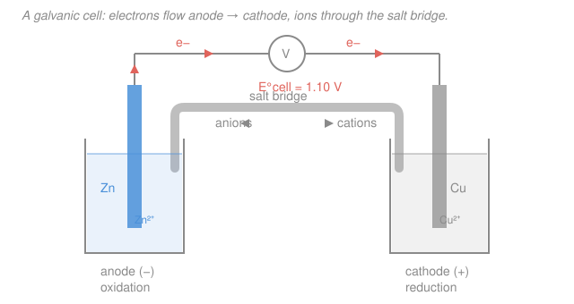

# General Chemistry · Lesson 4.4: A Taste of Electrochemistry

> ⏱ ~15 min · Module 4: Acids, Bases & Intros to Kinetics and Electrochemistry · Builds on: [4.3 A taste of kinetics](04-03-taste-of-kinetics.md), [2.3 Aqueous reactions (redox)](02-03-aqueous-reactions-precipitation-acid-base-redox.md) · Unlocks: **course complete** — next stop, physical chemistry / electrochemistry

## Why this matters

Every battery in your life — phone, car, laptop, pacemaker — is a redox reaction with a wire soldered into the middle of it. Instead of letting electrons hop straight from one reactant to another, you *force them to take the long way around*, through a circuit, and collect their energy as electricity. This is the payoff lesson of the course: it ties redox (Lesson 2.3), spontaneity and $\Delta G$ (the thermochemistry of Module 3), and a measurable voltmeter reading into one clean equation. Electrochemistry is also where "is this reaction spontaneous?" stops being abstract and becomes a number you can read off a meter.

## The idea

A redox reaction is just electrons changing owners. Normally that transfer happens by direct contact — drop zinc metal into copper sulfate and the copper plates out on the zinc, electrons jumping across in a chaotic instant, releasing their energy as useless heat. A **galvanic cell** (also called a **voltaic cell**) is a trick to *separate the two halves in space*. Put the zinc in one beaker, the copper in another, and the only way for an electron to get from zinc to copper is to run through a wire you provide. Now that electron current does work — spins a motor, lights a bulb.

Two words to keep straight, and one mnemonic that fixes them forever: **"An Ox, Red Cat."** **An**ode = **Ox**idation (electrons *lost*), **Red**uction = **Cat**hode (electrons *gained*). Oxidation is the source of electrons, so the anode is where they exit into the wire; reduction consumes them, so the cathode is where they arrive. Electrons always flow **anode → cathode** through the external wire.

One loose end: as zinc dissolves it leaves its beaker positively charged, and the copper beaker goes negative as cations plate out. Charge pile-up would stop the reaction dead in a fraction of a second. The **salt bridge** — a tube of inert ions — fixes this by letting ions drift to cancel the imbalance: anions toward the anode, cations toward the cathode. Wire carries electrons; salt bridge carries ions; together they close the loop.

## The formal version

**The cell and its convention.** By convention we draw the **anode on the left** (labeled $-$) and the **cathode on the right** (labeled $+$). The classic **Daniell cell** is written in **cell notation**:

$$\ce{Zn(s) | Zn^2+(aq) || Cu^2+(aq) | Cu(s)}$$

where a single bar $|$ is a phase boundary (electrode/solution) and the double bar $||$ is the salt bridge. Read left to right: oxidation first, reduction last. The two **half-reactions** are

$$\underbrace{\ce{Zn -> Zn^2+ + 2e-}}_{\text{oxidation (anode)}} \qquad \underbrace{\ce{Cu^2+ + 2e- -> Cu}}_{\text{reduction (cathode)}}$$

*In words: zinc gives up two electrons and dissolves; those electrons travel the wire and are handed to copper ions, which plate out as metal.* Add the halves (the electrons cancel) for the overall reaction $\ce{Zn + Cu^2+ -> Zn^2+ + Cu}$.

**Standard reduction potentials.** Each half-reaction has a tabulated **standard reduction potential** $E^\circ$ (volts), *always written as a reduction*, measured against the **standard hydrogen electrode** (SHE, $\ce{2H+ + 2e- -> H2}$) which is *defined* as $E^\circ = 0$ V. Standard conditions mean 1 M solutions, 1 bar gases, 25 °C.

- More positive $E^\circ$ = **stronger pull on electrons** = more eager to be reduced. ($\ce{Cu^2+/Cu}$: $+0.34$ V; $\ce{Zn^2+/Zn}$: $-0.76$ V.)

**Cell potential.** The voltage the cell delivers is

$$\boxed{\,E^\circ_\text{cell} = E^\circ_\text{cathode} - E^\circ_\text{anode}\,}$$

with *both* values taken from the table as reduction potentials. *In words: subtract the weaker electron-grabber (which is forced to run backwards, as oxidation) from the stronger one.* For the Daniell cell,

$$E^\circ_\text{cell} = \underbrace{0.34}_{\ce{Cu}} - \underbrace{(-0.76)}_{\ce{Zn}} = 1.10\ \mathrm{V}.$$

A positive $E^\circ_\text{cell}$ means the reaction as written runs **spontaneously** — the defining feature of a galvanic cell. If your arithmetic gives a negative number, you picked the wrong electrode as cathode; swap them.

**The link to thermodynamics.** Voltage is energy per charge, so multiply by the charge moved to get energy. The bridge to the free energy of Module 3 is

$$\boxed{\,\Delta G^\circ = -nFE^\circ_\text{cell}\,}$$

where $n$ is the moles of electrons transferred in the balanced reaction and $F = 96485\ \mathrm{C/mol}$ is the **Faraday constant** (the charge of one mole of electrons). *In words: a positive cell voltage is exactly a negative $\Delta G^\circ$* — the two spontaneity criteria are the same statement:

$$E^\circ_\text{cell} > 0 \;\Longleftrightarrow\; \Delta G^\circ < 0 \;\Longleftrightarrow\; \text{spontaneous.}$$

**Two doors left open.** For **non-standard** conditions (concentrations $\neq 1$ M), the **Nernst equation** $E = E^\circ_\text{cell} - \frac{RT}{nF}\ln Q$ corrects the voltage for concentration — this is why a battery's voltage sags as it drains and $Q$ climbs. And running the arrow backwards, **electrolysis** applies an *external* voltage larger than $E^\circ_\text{cell}$ to *force* a nonspontaneous reaction (charging a battery, electroplating, splitting water). Both are the front door to a physical-chemistry / electrochemistry course.

## Picture

## Worked examples

**Example 1 (mechanical — build the cell).** A cell pairs $\ce{Cu^2+/Cu}$ ($E^\circ = +0.34$ V) with $\ce{Ni^2+/Ni}$ ($E^\circ = -0.26$ V). Which is the cathode? The more positive potential wins the electrons, so **copper is the cathode** (reduction) and **nickel is the anode** (oxidation). Then

$$E^\circ_\text{cell} = E^\circ_\text{cathode} - E^\circ_\text{anode} = 0.34 - (-0.26) = 0.60\ \mathrm{V} > 0,$$

so the spontaneous reaction is $\ce{Ni + Cu^2+ -> Ni^2+ + Cu}$: nickel dissolves, copper plates out.

**Example 2 (why you'd care — voltage is free energy).** How much energy does that cell store per mole of reaction? Here $n = 2$ (nickel gives up two electrons), so

$$\Delta G^\circ = -nFE^\circ_\text{cell} = -(2)(96485)(0.60) = -1.16\times10^{5}\ \mathrm{J} \approx -116\ \mathrm{kJ/mol}.$$

Negative, so spontaneous — consistent with $E^\circ_\text{cell} > 0$. That $116$ kJ is the useful electrical work the cell can deliver, and it came from a voltmeter reading and a constant. This is the exact same $\Delta G^\circ$ that told us reaction spontaneity back in Module 3 — now measured with a wire instead of a calorimeter.

## Watch out

- **You might think you flip the sign of $E^\circ$ for the anode because it runs as oxidation.** You don't — the formula $E^\circ_\text{cell} = E^\circ_\text{cathode} - E^\circ_\text{anode}$ already uses *both* tabulated **reduction** potentials, and the subtraction does the flipping for you. Reversing the sign yourself double-counts it.
- **You might think $E^\circ$ scales when you multiply a half-reaction.** It does not. To balance electrons you might double $\ce{Ag+ + e- -> Ag}$, but $E^\circ$ is an intensive property (volts = energy *per charge*) and stays $+0.80$ V. Only $n$ in $\Delta G^\circ = -nFE^\circ_\text{cell}$ picks up the factor.
- **You might mix up which way the ions go.** Electrons go anode → cathode in the *wire*; in the *salt bridge*, cations chase the electrons toward the cathode and anions drift back toward the anode, each half-cell staying neutral. Wire = electrons, bridge = ions.

## One-liner

> A galvanic cell splits a spontaneous redox reaction into two half-cells so its electrons must cross a wire; the voltage $E^\circ_\text{cell} = E^\circ_\text{cathode} - E^\circ_\text{anode} > 0$ is just $\Delta G^\circ = -nFE^\circ_\text{cell} < 0$ read off a meter.

## Problems

**P1 (🟢)** A cell is built from $\ce{Zn^2+/Zn}$ ($E^\circ = -0.76$ V) and $\ce{Cu^2+/Cu}$ ($E^\circ = +0.34$ V). Identify the cathode and the anode, compute $E^\circ_\text{cell}$, and write the spontaneous overall reaction.

**P2 (🟡)** A cell has $E^\circ_\text{cell} = 1.10$ V and transfers $n = 2$ moles of electrons per mole of reaction. Compute $\Delta G^\circ$ (use $F = 96485\ \mathrm{C/mol}$) and confirm the sign is consistent with a spontaneous galvanic cell.

**P3 (🔴)** Build a cell from $\ce{Ag+/Ag}$ ($E^\circ = +0.80$ V) and $\ce{Fe^2+/Fe}$ ($E^\circ = -0.44$ V). Pick the cathode and anode, balance the overall reaction (mind that silver takes 1 electron but iron gives up 2), compute $E^\circ_\text{cell}$, and then $\Delta G^\circ$.

Solutions

**P1** The more positive reduction potential is the cathode: $\ce{Cu^2+/Cu}$ at $+0.34$ V is the **cathode** (reduction), and $\ce{Zn^2+/Zn}$ at $-0.76$ V is the **anode** (oxidation).

$$E^\circ_\text{cell} = E^\circ_\text{cathode} - E^\circ_\text{anode} = 0.34 - (-0.76) = 1.10\ \mathrm{V}.$$

Half-reactions: $\ce{Zn -> Zn^2+ + 2e-}$ (anode) and $\ce{Cu^2+ + 2e- -> Cu}$ (cathode); the electrons cancel, giving

$$\ce{Zn + Cu^2+ -> Zn^2+ + Cu}.$$

*Check.* $E^\circ_\text{cell} > 0$, so the reaction runs as written — this is the Daniell cell. ✓

**P2** Direct substitution:

$$\Delta G^\circ = -nFE^\circ_\text{cell} = -(2)(96485)(1.10) = -212{,}267\ \mathrm{J} \approx -212\ \mathrm{kJ/mol}.$$

$\Delta G^\circ < 0$, consistent with $E^\circ_\text{cell} > 0$ and a spontaneous galvanic cell. ✓

*Check.* Units: $\mathrm{mol}\times(\mathrm{C/mol})\times\mathrm{V} = \mathrm{C\cdot V} = \mathrm{J}$ ✓ (a volt is a joule per coulomb).

**P3** Silver has the more positive potential, so $\ce{Ag+/Ag}$ ($+0.80$ V) is the **cathode** and $\ce{Fe^2+/Fe}$ ($-0.44$ V) is the **anode**.

$$E^\circ_\text{cell} = E^\circ_\text{cathode} - E^\circ_\text{anode} = 0.80 - (-0.44) = 1.24\ \mathrm{V}.$$

Balance electrons: reduction $\ce{Ag+ + e- -> Ag}$ needs $\times 2$ to match oxidation $\ce{Fe -> Fe^2+ + 2e-}$. The potential is intensive, so **doubling the silver half does not change** $E^\circ$. Adding:

$$\ce{2Ag+ + Fe -> 2Ag + Fe^2+}, \qquad n = 2.$$

Then

$$\Delta G^\circ = -nFE^\circ_\text{cell} = -(2)(96485)(1.24) = -239{,}283\ \mathrm{J} \approx -239\ \mathrm{kJ/mol}.$$

*Check.* $E^\circ_\text{cell} = 1.24\ \mathrm{V} > 0$ and $\Delta G^\circ < 0$ agree — spontaneous. Note $E^\circ_\text{cell}$ stayed $1.24$ V even though we doubled a half-reaction; only $n$ carried the count. ✓

## Flashback

**From Lesson 2.3 (Aqueous reactions — redox):** In the single-displacement reaction $\ce{Fe + 2HCl -> FeCl2 + H2}$, assign the oxidation number of each element on both sides, and identify what is oxidized and what is reduced. (Fresh variant — a new reaction.)

Solution

Assign oxidation numbers (free elements are 0; H is $+1$ when bonded to nonmetals, Cl is $-1$):

- $\ce{Fe}$: $0 \to +2$ (in $\ce{FeCl2}$, since two $\ce{Cl^-}$ at $-1$ demand $+2$ on iron).
- $\ce{H}$: $+1$ in $\ce{HCl} \to 0$ in $\ce{H2}$.
- $\ce{Cl}$: $-1$ throughout (spectator, unchanged).

Iron's number rises ($0 \to +2$): it **loses** electrons, so iron is **oxidized** (and is the reducing agent). Hydrogen's number falls ($+1 \to 0$): it **gains** electrons, so hydrogen is **reduced** (the $\ce{H+}$ is the oxidizing agent).

*Check.* Electrons balance: Fe releases 2 e⁻; two $\ce{H+}$ each gain 1 e⁻ to form $\ce{H2}$ — total 2 e⁻ gained. "An Ox" (iron oxidized, would be the anode) and "Red Cat" (hydrogen reduced, would be the cathode) if you split this into a cell. ✓

## Connections

- **Backward:** this is [2.3](02-03-aqueous-reactions-precipitation-acid-base-redox.md)'s redox and oxidation numbers made to do work — half-reactions are literally split into two beakers. The spontaneity verdict $\Delta G^\circ = -nFE^\circ_\text{cell}$ is the free energy of Module 3 ([3.2](03-02-thermochemistry-enthalpy-calorimetry.md)–[3.4](03-04-chemical-equilibrium-k-le-chatelier.md)), now measurable as a voltage; and like [4.3](04-03-taste-of-kinetics.md)'s kinetics, thermodynamics tells you *whether*, not *how fast*, the cell runs.
- **Forward — and the end of the course:** the Nernst equation ties $E_\text{cell}$ to the reaction quotient $Q$ (and, at equilibrium, to $K$ from [3.4](03-04-chemical-equilibrium-k-le-chatelier.md)), while electrolysis and real batteries carry these ideas further. All of it is the opening chapter of **physical chemistry** — see the [physical chemistry syllabus](../../physical-chemistry/syllabus.md) — which develops electrochemistry, thermodynamics, and kinetics rigorously. That is your next stop.
- **Sideways:** $\Delta G^\circ = -nFE^\circ_\text{cell}$ is the same free energy that governs equilibrium and phase changes in thermodynamics (physics), and the electron-transfer driving force reappears in biochemistry as the redox potentials powering the cell's electron-transport chain. You have now closed General Chemistry — congratulations.
