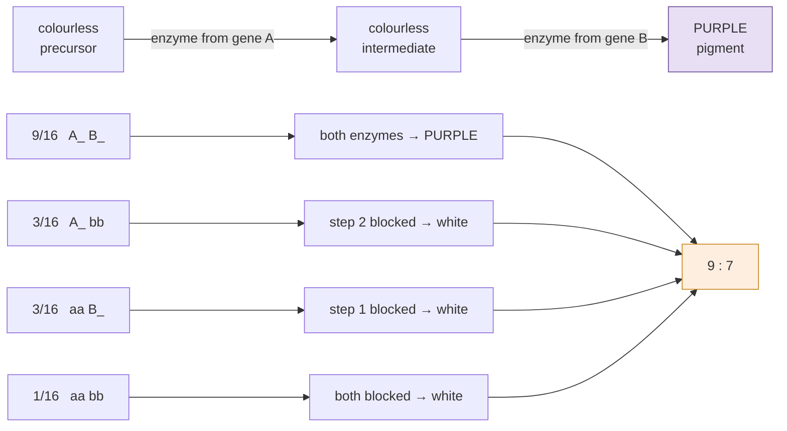

# Genetics · Lesson 1.3: Genes interacting — epistasis & pleiotropy

> ⏱ ~15 min · Module 1: Transmission Genetics — Mendel & Its Extensions · Builds on: [1.2](01-02-when-dominance-breaks-down.md), [1.1](01-01-mendels-laws-probability.md) · Unlocks: 1.4 (pedigrees)

## Why this matters

[1.2](01-02-when-dominance-breaks-down.md) broke the one-gene-to-one-phenotype map by showing that dominance depends on dosage. This lesson breaks it in the other direction — the map is not one-to-one at either end. **Several genes contribute to one trait** (epistasis), and **one gene contributes to several traits** (pleiotropy).

The payoff is that the "weird" $F_2$ ratios — $9{:}7$, $12{:}3{:}1$, $9{:}3{:}4$, $15{:}1$ — stop being a list to memorize. Each is a $9{:}3{:}3{:}1$ with some classes merged, and **which classes merge tells you the shape of the underlying biochemical pathway.** A ratio becomes a diagram of a metabolic route, which is one of the genuinely satisfying inferences in classical genetics.

## The idea

**Epistasis is one gene masking another.** The word means "standing upon": the epistatic gene's phenotype stands on top of the hypostatic gene's and hides it. Mechanistically it is almost always a **pathway** — if an early enzyme is missing, it does not matter what the later enzyme's genotype is, because the substrate never arrives.

**Start with the pathway and the ratio follows.** Consider a pigment made in two steps:

$$\text{colourless precursor} \;\xrightarrow{\ \text{gene } A\ }\; \text{colourless intermediate} \;\xrightarrow{\ \text{gene } B\ }\; \text{purple pigment}$$

Pigment requires *both* enzymes, so only $A\_B\_$ is purple. From $AaBb \times AaBb$:

$$\underbrace{9\,A\_B\_}_{\text{purple}} : \underbrace{3\,A\_bb + 3\,aaB\_ + 1\,aabb}_{\text{all white}} \;=\; \mathbf{9 : 7}.$$

**The $9{:}7$ ratio is a two-step pathway.** Nothing was memorized — the ratio was derived from the biochemistry in one line.

**The catalogue, and how to read it.** Every modified ratio is $9{:}3{:}3{:}1$ with classes pooled:

| Ratio | Pooling | Mechanism | Called |
|---|---|---|---|
| $9{:}3{:}3{:}1$ | none | two independent traits | (no interaction) |
| $\mathbf{9{:}7}$ | $3+3+1$ | both gene products needed for one step-wise product | **complementary genes** |
| $\mathbf{15{:}1}$ | $9+3+3$ | either gene alone suffices — redundant paralogues | **duplicate genes** |
| $\mathbf{12{:}3{:}1}$ | $9+3$ | dominant $A$ masks $B$ entirely | **dominant epistasis** |
| $\mathbf{9{:}3{:}4}$ | $3+1$ | $aa$ masks $B$ — an early block | **recessive epistasis** |
| $\mathbf{13{:}3}$ | $9+3+1$ | dominant $A$ *inhibits* the pathway | **dominant suppression** |
| $\mathbf{9{:}6{:}1}$ | $3+3$ | either gene alone gives one phenotype, both give another | **duplicate genes with cumulative effect** |

**You do not memorize this table — you reconstruct it.** Given a mechanism, pool the classes. Given a ratio, ask which pooling produces it and what pathway that implies.

**Pleiotropy is the reverse.** One gene, many effects — usually because the product is used in several tissues or sits upstream of several processes. Marfan syndrome is one mutation in fibrillin producing tall stature, long fingers, lens dislocation, and aortic dilation, because fibrillin is a connective-tissue protein used everywhere. **Pleiotropy is the default, not the exception**: most genes do several things, which is why "the gene for X" is nearly always a bad phrase.

**Penetrance and expressivity are what makes real data messy.**

- **Penetrance** — the *fraction* of individuals with a genotype who show the phenotype at all. Yes-or-no, measured across people.
- **Expressivity** — how *severely* the phenotype shows in those who have it. A range, measured within a person.

An allele can be 60 percent penetrant with variable expressivity: 40 percent of carriers look normal, and among the rest the severity varies. **Incomplete penetrance is why a dominant disease can appear to skip a generation**, and it is the single commonest reason a clean Mendelian pedigree looks non-Mendelian.

## The formal version

**The general recipe.** For a dihybrid cross $AaBb \times AaBb$ with independent assortment, the four phenotypic classes have proportions

$$\tfrac{9}{16}\,A\_B\_, \qquad \tfrac{3}{16}\,A\_bb, \qquad \tfrac{3}{16}\,aaB\_, \qquad \tfrac{1}{16}\,aabb .$$

Any epistatic interaction is a **map from these four classes onto a smaller set of phenotypes.** Write down the map and the ratio follows by addition. That is the entire method.

**Reading a ratio backwards, systematically.** Given an observed ratio, write it in sixteenths and identify the pooling:

$$9{:}3{:}4 \;\rightarrow\; \tfrac{9}{16},\ \tfrac{3}{16},\ \tfrac{4}{16} \;\rightarrow\; \text{the } \tfrac{4}{16} \text{ is } 3+1 = aaB\_ + aabb = aa\_\_ .$$

*In words: everything homozygous recessive at $A$ has the same phenotype regardless of $B$, so $aa$ is epistatic to $B$.* And that means $A$ acts **upstream** of $B$ in the pathway — losing $A$ blocks the route before $B$'s step matters.

**The ordering rule, which is the useful part:**

$$\text{the gene whose loss masks the other acts } \textbf{earlier} \text{ in the pathway.}$$

This is how classical genetics determined the order of steps in metabolic pathways decades before anyone could assay the enzymes — Beadle and Tatum's *Neurospora* work, and the reason "one gene, one enzyme" was formulated at all.

**Complementation versus epistasis** — easy to confuse, so state the difference:

- **Complementation test** ([3.1](03-01-gene-as-molecule-complementation.md)) asks whether two mutations are in the *same gene*. Cross two mutants; if the offspring are wild-type, the mutations complement and are in different genes.
- **Epistasis analysis** asks, for mutations already known to be in *different* genes, which one acts **earlier**.

*Complementation tells you how many genes; epistasis tells you their order.* Both are done by crossing mutants, which is why they blur together, and both are worth keeping distinct.

**Penetrance, quantitatively.** If a dominant allele has penetrance $f$, then among the offspring of $Aa \times aa$ the observed affected fraction is

$$P(\text{affected}) = \underbrace{\tfrac12}_{\text{inherits } A} \times f ,$$

so an apparent transmission ratio of $0.3$ implies $f = 0.6$. **Penetrance is estimated by comparing the observed ratio with the Mendelian expectation** — and this is exactly the calculation a genetic counsellor performs.

## Picture

**Every modified ratio is this picture with a different pooling.** Write the four classes, decide from the mechanism which look alike, and add:

| Pooled as | Ratio | Pathway logic |
|---|---|---|
| $3+3+1$ | $9{:}7$ | both products needed for one route — **complementary** |
| $9+3+3$ | $15{:}1$ | either alone suffices — **duplicate** |
| $9+3$ | $12{:}3{:}1$ | dominant $A$ masks $B$ — **dominant epistasis** |
| $3+1$ | $9{:}3{:}4$ | $aa$ masks $B$ — **recessive epistasis, early block** |
| $9+3+1$ | $13{:}3$ | dominant $A$ *inhibits* — **dominant suppression** |
| $3+3$ | $9{:}6{:}1$ | either alone gives one phenotype, both another |

And the reverse reading, which is the useful direction: **a $\frac{4}{16}$ class means $3+1$ were pooled, which means one homozygous-recessive genotype masks the other gene entirely — so that gene acts earlier.**

## Worked examples

**Example 1 (mechanical — derive $9{:}3{:}4$ from a pathway, then read it backwards).** In mice, gene $C$ controls whether pigment is made at all ($C\_$ = pigment, $cc$ = albino) and gene $B$ controls its colour ($B\_$ = black, $bb$ = brown). (a) Predict the $F_2$ ratio from $CcBb \times CcBb$. (b) Now do it in reverse: given only the ratio, deduce the pathway order.

(a) Map the four classes onto phenotypes:

| Class | Fraction | Phenotype |
|---|---|---|
| $C\_B\_$ | $\tfrac{9}{16}$ | **black** |
| $C\_bb$ | $\tfrac{3}{16}$ | **brown** |
| $ccB\_$ | $\tfrac{3}{16}$ | **albino** — no pigment to colour |
| $ccbb$ | $\tfrac{1}{16}$ | **albino** |

$$9\ \text{black} : 3\ \text{brown} : 4\ \text{albino} \;=\; \mathbf{9 : 3 : 4}.$$

(b) Reverse direction. The $\tfrac{4}{16}$ class must be $3 + 1$, and the only $3+1$ pooling available is $ccB\_ + ccbb = cc\_\_$. So **every $cc$ animal has the same phenotype regardless of $B$** — $cc$ is epistatic to $B$.

By the ordering rule, $C$ acts **earlier**: it gates whether pigment exists at all, and $B$ only decides its colour if pigment is made.

$$\text{precursor} \;\xrightarrow{\ C\ }\; \text{pigment} \;\xrightarrow{\ B\ }\; \text{black (or brown if } bb) $$

**Note that the ratio alone gave the pathway order**, with no biochemistry. This is the inference that made classical genetics powerful, and the reason $9{:}3{:}4$ is worth recognizing on sight — not as a memorized ratio, but as the fingerprint of a recessive early block.

**Example 2 (why you'd care — a dominant disease that skips a generation).** A family shows a dominant condition. The grandmother is affected; her son is **unaffected**; two of the son's four children are affected. (a) Explain why this is not evidence against dominant inheritance. (b) The condition is found to be 70 percent penetrant. Compute the probability that the unaffected son carries the allele. (c) The son and his unaffected wife are expecting. What is the probability the child is affected?

(a) A truly dominant allele with **complete** penetrance cannot skip a generation — an affected child's affected parent must exist. But the son's children are affected, which means the son must carry the allele and transmit it. The only consistent explanation is that the son **carries the allele and does not show the phenotype** — incomplete penetrance.

**Skipping a generation is the signature of incomplete penetrance, not a refutation of dominance.** Ruling out dominant inheritance because of an unaffected obligate carrier is one of the commonest errors in reading a pedigree.

(b) Here the son is an **obligate carrier** — his children are affected, so he must have transmitted the allele. Given the pedigree, $P(\text{carrier}) = \mathbf{1}$.

The more interesting version of the question is: *before* his children were born, given that his mother was affected ($Aa$, since the allele is rare) and he was unaffected, what was $P(\text{carrier})$? Use Bayes:

$$P(Aa) = \tfrac12, \quad P(\text{unaffected} \mid Aa) = 1 - 0.7 = 0.3, \quad P(aa) = \tfrac12, \quad P(\text{unaffected}\mid aa) = 1 .$$

$$P(Aa \mid \text{unaffected}) = \frac{(0.5)(0.3)}{(0.5)(0.3) + (0.5)(1)} = \frac{0.15}{0.65} = \mathbf{0.231}.$$

So an unaffected child of an affected parent had a 23 percent chance of carrying the allele — **not zero, and this is precisely why unaffected relatives in such families are still counselled and offered testing.**

(c) The son is a known carrier ($Aa$), his wife is $aa$:

$$P(\text{child affected}) = \underbrace{\tfrac12}_{\text{inherits } A} \times \underbrace{0.7}_{\text{penetrance}} = \mathbf{0.35}.$$

**The counselling number is 35 percent, not 50** — and note that the *risk of carrying* is 50 percent while the *risk of being affected* is 35 percent. Those are different numbers answering different questions, and conflating them is a real clinical error: a child who inherits the allele but does not express it can still pass it on at 50 percent.

## Watch out

- **You might try to memorize the modified ratios.** Derive them. Write the four dihybrid classes, decide which look alike given the mechanism, and add. Reverse the process to read a ratio.
- **You might confuse epistasis with dominance.** Dominance is between **alleles at one locus**; epistasis is between **loci**. "$aa$ is epistatic to $B$" and "$A$ is dominant to $a$" are statements about different relationships and can both be true at once.
- **You might confuse epistasis with complementation.** Complementation asks *how many genes*; epistasis asks *what order*. Both involve crossing mutants; only one gives you a pathway.
- **You might read "the gene for X."** Pleiotropy makes this nearly always wrong — the gene is not *for* the trait you noticed, it makes a product used in several places, and the trait you noticed is one downstream consequence.
- **You might treat incomplete penetrance as noise.** It has causes — modifier genes, environment, stochastic gene expression ([molecular-cell-biology 4.2](../../molecular-cell-biology/lessons/04-02-eukaryotic-transcription-machine.md)) — and a 70 percent penetrant allele is 70 percent penetrant *in a specified population*, not universally.

## One-liner

> Every strange $F_2$ ratio is $9{:}3{:}3{:}1$ with classes pooled, and which classes pooled tells you the shape of the pathway — the gene whose loss masks the other acts earlier.

## Problems

**P1 (🟢)** In squash, fruit colour is controlled by two genes. A dominant allele $W$ produces white fruit regardless of the second gene; in $ww$ plants, $Y\_$ gives yellow and $yy$ gives green. (a) Predict the $F_2$ ratio from $WwYy \times WwYy$. (b) Name the type of epistasis. (c) Which gene acts earlier, and how do you know?

**P2 (🟡)** A cross between two pure-breeding white-flowered varieties gives an all-purple $F_1$, and the $F_2$ is 178 purple : 142 white. (a) What ratio is this, tested against your best candidate? Compute $\chi^2$ with 1 df (critical value 3.84). (b) What mechanism does it imply? (c) Explain why crossing two *white* strains gave a *purple* $F_1$ — this is the observation that gives the mechanism away.

**P3 (🔴, bridges to 3.1 and to biochemistry)** Four independently-isolated recessive mutants of a fungus all fail to synthesize an amino acid and all grow if the finished amino acid is supplied. The pathway has three intermediates, $P \to I_1 \to I_2 \to I_3 \to \text{product}$. Growth on each intermediate is:

| Mutant | grows on $I_1$? | $I_2$? | $I_3$? | product? |
|---|---|---|---|---|
| m1 | no | no | yes | yes |
| m2 | yes | yes | yes | yes |
| m3 | no | no | no | yes |
| m4 | no | yes | yes | yes |

(a) Deduce which step each mutant blocks. (b) Two of these mutants, crossed to each other, give wild-type offspring; another pair gives mutant offspring. What does each result tell you, and which test is this? (c) Explain the general logic connecting "the earliest-blocked mutant grows on the fewest intermediates" to the epistasis ordering rule of this lesson.

Solutions

**P1 (a)** Map the classes:

| Class | Fraction | Phenotype |
|---|---|---|
| $W\_Y\_$ | $\tfrac{9}{16}$ | white |
| $W\_yy$ | $\tfrac{3}{16}$ | white |
| $wwY\_$ | $\tfrac{3}{16}$ | yellow |
| $wwyy$ | $\tfrac{1}{16}$ | green |

$$12\ \text{white} : 3\ \text{yellow} : 1\ \text{green} = \mathbf{12 : 3 : 1}.$$

**(b)** **Dominant epistasis** — a single dominant allele $W$ masks the second gene entirely.

**(c)** $W$ acts **earlier**. The evidence is the masking itself: the $Y$ genotype makes no difference whenever $W$ is present, so whatever $W$ does happens before $Y$'s step can matter. Mechanistically $W$ is most naturally read as a **dominant inhibitor** that blocks pigment production upstream — one functional copy is enough to shut the pathway down, which is why it is dominant.

**P2 (a)** Total $= 178 + 142 = 320$. The candidate is **$9{:}7$**, giving expected

$$E_{\text{purple}} = 320 \times \tfrac{9}{16} = 180, \qquad E_{\text{white}} = 320 \times \tfrac{7}{16} = 140 .$$

$$\chi^{2} = \frac{(178-180)^{2}}{180} + \frac{(142-140)^{2}}{140} = \frac{4}{180} + \frac{4}{140} = 0.0222 + 0.0286 = \mathbf{0.051}.$$

With 1 df, $0.051 \ll 3.84$ — an excellent fit. (For comparison, $3{:}1$ would predict 240 : 80 and give $\chi^2 = (62)^2/240 + (62)^2/80 = 16.0 + 48.1 = 64.1$, decisively rejected.)

**(b)** **Complementary gene action**: two genes, each producing an enzyme required for a different step of one pathway, and pigment appears only when both dominant alleles are present ($A\_B\_$). The two parental white strains were therefore blocked at *different* steps.

**(c)** This is the observation that gives it away, and it is worth stating carefully. The two white parents were $AAbb$ and $aaBB$ — each pure-breeding, each white, each missing a *different* enzyme. Their $F_1$ is

$$AAbb \times aaBB \;\longrightarrow\; \text{all } AaBb ,$$

which has at least one functional copy of **both** genes and therefore both enzymes. The pathway runs, pigment is made, and the offspring are purple.

**Each parent supplied what the other lacked** — the two mutations *complement*. This is precisely the complementation test of [3.1](03-01-gene-as-molecule-complementation.md), performed here inadvertently, and it is the standard demonstration that two mutations with the same phenotype lie in different genes. It also explains the otherwise startling fact that crossing two white strains produces coloured offspring, which is the kind of result that looks like a mistake and is in fact the whole point.

**P3 (a)** A mutant grows on any intermediate that lies **downstream** of its block, because it can pick up the pathway from there. So the earlier the block, the fewer things rescue it.

| Mutant | Grows on | Block is before | Step blocked |
|---|---|---|---|
| m3 | product only | $I_1$ | $P \to I_1$ (first) |
| m1 | $I_3$, product | $I_3$ | $I_2 \to I_3$ (third) |
| m4 | $I_2$, $I_3$, product | $I_2$ | $I_1 \to I_2$ (second) |
| m2 | everything incl. $I_1$ | — | it is **not** blocked in this pathway |

m2's result is the odd one: it grows on $I_1$, the earliest intermediate, so its block must be *before* $I_1$ — but m3 already occupies that step, and m2 also grows on the precursor-derived $I_1$ without supplementation issues. The consistent reading is that **m2 is blocked at the very first step too**, in the same reaction as m3 (or in a gene whose product feeds it), since supplying $I_1$ rescues it completely. *So the pathway order is:*

$$P \;\xrightarrow{\ \text{m3, m2}\ }\; I_1 \;\xrightarrow{\ \text{m4}\ }\; I_2 \;\xrightarrow{\ \text{m1}\ }\; I_3 \;\longrightarrow\; \text{product}$$

**(b)** This is the **complementation test** ([3.1](03-01-gene-as-molecule-complementation.md)).

*Wild-type offspring:* the two mutations **complement** — they lie in **different genes**, and each parent supplies the function the other lacks. Given (a), this would be any cross between mutants blocking different steps, e.g. m3 × m4.

*Mutant offspring:* the mutations **fail to complement** — they lie in the **same gene**, so neither parent can supply a working copy. Given (a), this is **m2 × m3**, which is the independent confirmation that they block the same step.

**(c)** Both are the same logic seen from two sides.

In a pathway, blocking an early step means nothing downstream ever gets made, so the *early* block determines the phenotype regardless of what the later genes are doing. In an epistasis cross that appears as **the early gene masking the later one**; in a supplementation experiment it appears as **the early mutant needing more things supplied to rescue it**, because more of the pathway lies downstream of its lesion.

$$\text{earliest block} \;\Longleftrightarrow\; \text{masks the most genes} \;\Longleftrightarrow\; \text{rescued by the fewest intermediates}$$

**Both experiments order a pathway, and neither requires assaying a single enzyme** — which is why Beadle and Tatum could dissect *Neurospora* biosynthesis in 1941 and arrive at "one gene, one enzyme" from nothing but growth on supplemented media.

## Flashback

**From Lesson 1.1 (the product rule and the binomial):** In a cross $AaBbCc \times AaBbCc$ with independent assortment: (a) What fraction of offspring are $A\_bbC\_$? (b) What fraction show the recessive phenotype at exactly one of the three genes? (c) Two such offspring are chosen at random — what is the probability both are $aabbcc$?

Solution

**(a)** Per gene: $P(A\_) = \tfrac34$, $P(bb) = \tfrac14$, $P(C\_) = \tfrac34$.

$$\tfrac34 \times \tfrac14 \times \tfrac34 = \mathbf{\tfrac{9}{64}}.$$

**(b)** "Recessive at exactly one gene" means one specific gene recessive, two dominant, with $\binom{3}{1} = 3$ choices of which:

$$3 \times \left(\tfrac14\right)^{1}\left(\tfrac34\right)^{2} = 3 \times \tfrac14 \times \tfrac{9}{16} = \mathbf{\tfrac{27}{64}}.$$

**(c)** $P(aabbcc) = \left(\tfrac14\right)^3 = \tfrac{1}{64}$ per offspring, and the two choices are independent:

$$\left(\tfrac{1}{64}\right)^{2} = \mathbf{\tfrac{1}{4096}}.$$

## Connections

- **Backward:** [1.1](01-01-mendels-laws-probability.md)'s $9{:}3{:}3{:}1$ is the parent of every ratio here; [1.2](01-02-when-dominance-breaks-down.md)'s dosage view of dominance explains why a dominant inhibitor like squash $W$ works with one copy.
- **Forward:** [1.4](01-04-pedigrees-human-inheritance.md) uses penetrance and Bayes to read human families; [3.1](03-01-gene-as-molecule-complementation.md) formalizes the complementation test that Example 2(c) and P3(b) both stumbled into.
- **Sideways:** the pathway-ordering logic is the same as the *lac* operon epistasis analysis in [3.4](03-04-prokaryotic-regulation-operon.md); pleiotropy is why one gene's variance shows up in several traits in [4.1](04-01-quantitative-traits-heritability.md), and stochastic expression as a source of incomplete penetrance is [molecular-cell-biology 4.2](../../molecular-cell-biology/lessons/04-02-eukaryotic-transcription-machine.md).
