# Genetics · Lesson 3.1: The gene as a molecule

> ⏱ ~15 min · Module 3: Molecular Genetics & Gene Regulation · Builds on: [2.4](02-04-chromosomal-mutations.md), [1.3](01-03-epistasis-pleiotropy.md) · Unlocks: 3.2 (mutation)

## Why this matters

Modules 1 and 2 treated a gene as an **address** — a point on a chromosome that segregates, recombines, and can be mapped. That was enough to build genetic maps, and it says nothing whatever about what a gene *is*.

The question that closes the gap is deceptively practical: **given two mutants with the same phenotype, are they broken in the same gene?** You cannot sequence them (assume it is 1955), you cannot see them, and the answer determines whether you are studying one gene or two. The **complementation test** answers it with a single cross, and pushing that test to its limits is what turned the gene from a point into a stretch of DNA with internal structure.

## The idea

**The complementation test, in one sentence.** Cross two recessive mutants with the same phenotype and look at the offspring:

$$\text{offspring wild-type} \Rightarrow \textbf{complementation} \Rightarrow \textbf{different genes}$$
$$\text{offspring mutant} \Rightarrow \textbf{no complementation} \Rightarrow \textbf{same gene}$$

**Why it works.** Each parent supplies one intact copy of every gene except the one it is mutant in. If the mutations are in different genes, each parent covers the other's defect and the hybrid has a functional copy of both:

$$\frac{m_1^{-}\ \ m_2^{+}}{m_1^{+}\ \ m_2^{-}} \qquad \text{both functions present} \Rightarrow \text{wild-type}$$

If they are in the same gene, the hybrid has two broken copies of it and nothing supplies the missing function:

$$\frac{m^{-}_{(a)}}{m^{-}_{(b)}} \qquad \text{no functional copy} \Rightarrow \text{mutant}$$

**You saw this already without the name.** In [1.3](01-03-epistasis-pleiotropy.md), two pure-breeding *white* flower strains crossed to give a *purple* $F_1$ — because each supplied the enzyme the other lacked. That was a complementation test.

**The gene becomes a unit of function.** Benzer named the unit defined by the complementation test the **cistron**, and the definition is operational rather than physical: *a cistron is a region within which two mutations fail to complement.* No molecular knowledge required — and that is exactly why the test survived the transition to molecular biology unchanged.

**Then Benzer pushed it to the limit.** Working with the *rII* region of phage T4, he could screen $10^{8}$ progeny and detect recombination frequencies down to $10^{-4}$ percent. Two results, both decisive:

1. **Mutations at different sites within one gene *recombine*.** So a gene is not a point — it is an extended structure with many mutable sites, and recombination can occur *between* them.
2. **But those same mutations do not complement.** Recombination and complementation measure different things.

$$\textbf{gene} \ne \textbf{mutation site} \ne \textbf{recombination unit}$$

**That is the intellectual payoff of the lesson.** The gene of Mendel and Morgan — an indivisible point — is replaced by a **stretch of DNA** containing hundreds of mutable sites, any two of which can be separated by recombination while both destroy the same function.

## The formal version

**The complementation matrix.** Test $n$ mutants pairwise and tabulate. Write $+$ for complementation (wild-type offspring) and $-$ for failure:

| | m1 | m2 | m3 | m4 |
|---|---|---|---|---|
| **m1** | $-$ | $-$ | $+$ | $+$ |
| **m2** | | $-$ | $+$ | $+$ |
| **m3** | | | $-$ | $-$ |
| **m4** | | | | $-$ |

*Read it as a grouping problem:* mutants that fail to complement each other go in the same group. Here $\{m1, m2\}$ and $\{m3, m4\}$ — **two complementation groups, therefore two genes.**

The diagonal is always $-$ (a mutant crossed to itself cannot complement). And the relation is, in the idealized case, an **equivalence relation** — reflexive, symmetric, transitive — so the mutants partition cleanly into groups. **When transitivity fails, something interesting is happening** (see the caveats below).

**Two conditions the test requires**, and they are the ones people forget:

1. **Both mutations must be recessive.** A dominant mutation causes a phenotype even with a functional copy present, so it will appear to "fail to complement" everything. Dominant mutations cannot be assigned to complementation groups by this test.
2. **The test must be done in *trans*.** The two mutations must be on *different* homologues. Putting both on one chromosome (*cis*) leaves the other homologue completely wild-type, which always gives a wild-type phenotype and tells you nothing. **This is why the test is properly called the *cis-trans* test** — the *cis* configuration is the control.

**Recombination within a gene, quantitatively.** Two mutant sites within one gene, separated by a small physical distance, recombine at a low but measurable rate. In Benzer's system:

$$\text{cross } m_a \times m_b \;\longrightarrow\; \text{rare wild-type recombinants at frequency } f$$

and since a *reciprocal* double mutant is produced at the same rate, the recombination frequency is

$$\mathrm{RF} = 2f .$$

Benzer resolved sites separated by roughly **0.01 percent recombination**, which in T4 corresponds to a handful of base pairs — effectively the resolution limit of recombination itself, and evidence that the mutable site is a **single nucleotide pair**.

**Two exceptions worth knowing, because both look like broken logic.**

*Intragenic complementation.* Two mutations in the same gene sometimes *do* complement, weakly. This happens when the protein is a **multimer**: two differently-damaged subunits can sometimes assemble into a partly-functional complex, each compensating for the other's defect. The signature is that complementation is **partial** — the hybrid is intermediate, not fully wild-type — and that transitivity in the matrix fails.

*Second-site non-complementation.* Two mutations in **different** genes occasionally fail to complement, when the two proteins interact physically and both are near-threshold. Rare, but it is a real source of false grouping — and, turned around, a genuine method for finding interacting proteins.

**These exceptions do not undermine the test; they refine it.** Both have mechanistic explanations at the level of protein structure ([biochemistry 1.3](../../biochemistry/lessons/01-03-four-levels-protein-structure.md)), which is exactly the sort of information the test was designed to work without.

## Picture

```mermaid
flowchart TD
    Q["Two recessive mutants,<br/>same phenotype.<br/>Same gene or two genes?"] --> X["Cross them &mdash; in trans"]
    X --> WT{"Are the offspring<br/>wild-type?"}
    WT -->|YES: complementation| DIFF["DIFFERENT genes<br/>m1&minus; m2+ / m1+ m2&minus;<br/>each parent covers the other"]
    WT -->|NO: no complementation| SAME["SAME gene<br/>m&minus;(a) / m&minus;(b)<br/>no functional copy anywhere"]
    SAME --> BENZER["Now cross them and screen 10&#8312; progeny:<br/>rare WILD-TYPE RECOMBINANTS appear"]
    BENZER --> CONC["So mutations in one gene can recombine.<br/><b>gene &ne; mutation site &ne; recombination unit</b><br/>A gene is a stretch, not a point."]

    DIFF --> CAV1["Caveat: second-site non-complementation<br/>&mdash; interacting proteins can fail to complement"]
    SAME --> CAV2["Caveat: intragenic complementation<br/>&mdash; multimers can partly complement"]

    style CONC fill:#e8dff5,stroke:#6a4c93
    style DIFF fill:#e6f4ea,stroke:#2e8b57
    style SAME fill:#fbe9eb,stroke:#d1495b
```

**Read the two branches as answering different questions.** Complementation asks about *function* — is a working copy present anywhere in the cell? Recombination asks about *position* — can these two lesions be separated physically? The whole conceptual advance is that the answers can differ.

## Worked examples

**Example 1 (mechanical — build the groups from a matrix).** Six flower-colour mutants, all recessive white, are tested pairwise. Complementation results:

| | m1 | m2 | m3 | m4 | m5 | m6 |
|---|---|---|---|---|---|---|
| **m1** | $-$ | $+$ | $-$ | $+$ | $+$ | $-$ |
| **m2** | | $-$ | $+$ | $-$ | $+$ | $+$ |
| **m3** | | | $-$ | $+$ | $+$ | $-$ |
| **m4** | | | | $-$ | $+$ | $+$ |
| **m5** | | | | | $-$ | $+$ |
| **m6** | | | | | | $-$ |

(a) How many genes? (b) Assign each mutant. (c) A seventh mutant, m7, fails to complement m1, m3 and m6 but *also* fails to complement m2. What are the two possibilities?

(a)–(b) Group by failure to complement:

- m1 fails with m3 and m6 → $\{m1, m3, m6\}$.
- m2 fails with m4 → $\{m2, m4\}$.
- m5 fails with nothing → $\{m5\}$ alone.

Check transitivity: m3 and m6 fail with each other ✓; m2 and m4 fail ✓. Consistent.

$$\textbf{Three complementation groups} \Rightarrow \textbf{three genes.}$$

(c) m7 failing with the whole of group A **and** with a member of group B breaks the partition. Two explanations:

1. **A deletion spanning two genes.** m7 removes part of gene A *and* part of gene B, so it cannot complement mutants in either. Deletions are the classic transitivity-breakers, and their pattern — failing to complement a *contiguous block* of mutants — is what Benzer exploited to build **deletion maps**, ordering mutations without any recombination data at all.
2. **Second-site non-complementation** between m7 and m2, if the gene-A and gene-B products physically interact.

**How to distinguish them:** a deletion cannot revert and cannot recombine with any mutation inside its span. Cross m7 to a gene-A point mutant and screen for wild-type recombinants — if none appear, m7 is a deletion covering that site. **A deletion is the only mutation that fails both the complementation *and* the recombination test with everything in its interval**, which makes it uniquely informative for mapping.

**Example 2 (why you'd care — the fine-structure map, and why it mattered).** In 1955 Benzer studied *rII* mutants of phage T4. He could plate $10^{8}$ progeny phage and select wild-type recombinants directly, because *rII* mutants fail to grow on *E. coli* K and wild-type grows fine. (a) Why is that selection so important? (b) He found *rII* splits into exactly two complementation groups, rIIA and rIIB. What does that mean? (c) He found over 300 distinct sites within rIIA that could recombine with each other. What did that establish, and what number did it let him estimate?

(a) Because **resolution is limited by how many progeny you can screen.** In a fly cross with 1000 offspring, the smallest detectable RF is about 0.1 percent — nowhere near intragenic distances. Benzer's selection detects a *single* wild-type recombinant among $10^{8}$, giving a resolution of

$$\mathrm{RF}_{\min} \approx 10^{-8} \times 2 = 2\times10^{-6}\ \text{percent},$$

roughly **a million times finer than classical genetics.** The biology of the phage did not change what recombination is; it changed what could be *seen*. This is a recurring pattern — most conceptual advances in genetics came from a system that allowed a larger $N$.

(b) Two complementation groups means **two genes** in the region, each encoding a separate polypeptide, both required for the *rII* function. This is the cistron definition doing exactly its job: it partitioned a region that classical mapping had treated as a single locus.

(c) Over 300 recombining sites within one complementation group established that **a gene is an extended, linearly-ordered structure with many independently mutable positions.** The gene is divisible; the complementation unit is not the recombination unit.

And it let him estimate the size of the mutable unit. The whole T4 genome is about $2\times10^{5}$ base pairs and about 800 map units. So

$$\text{1 map unit} \approx \frac{2\times10^{5}\ \mathrm{bp}}{800} = 250\ \mathrm{bp}.$$

The smallest recombination distances he measured within *rII* were about 0.02 map units:

$$0.02 \times 250\ \mathrm{bp} = \mathbf{5\ \mathrm{bp}} .$$

**Benzer concluded that the unit of mutation and the unit of recombination are of the order of a single nucleotide pair** — two years after Watson and Crick, without any sequencing, from recombination frequencies alone. It is one of the best examples in biology of a purely genetic argument reaching a molecular conclusion.

## Watch out

- **You might run a complementation test with a dominant mutation.** It cannot work — a dominant mutation gives a mutant phenotype regardless of what the other homologue carries, so it appears to fail to complement everything.
- **You might set the test up in *cis*.** Both mutations on one chromosome leaves a wild-type homologue and always gives wild-type. The *trans* configuration is the test; *cis* is the control.
- **You might conflate complementation with recombination.** Complementation is about *function in one cell*; recombination is about *physical separation*. Two mutations in one gene fail to complement and still recombine, and that discrepancy is the whole discovery.
- **You might expect the complementation matrix to always partition cleanly.** Deletions, intragenic complementation of multimers, and second-site non-complementation all break transitivity — and each breakage is informative rather than a nuisance.
- **You might think the cistron definition is obsolete.** It is still the working definition of a gene in mutant screens, precisely because it needs no molecular information. Sequencing tells you a gene's boundaries; complementation tells you whether two phenotypes have one cause.

## One-liner

> Cross two mutants: if the offspring are normal, each parent covered the other's defect and the genes are different — and the discovery that mutations in the *same* gene still recombine is what turned the gene from a point into a stretch of DNA.

## Problems

**P1 (🟢)** Five recessive mutants with identical phenotypes give this complementation matrix:

| | a | b | c | d | e |
|---|---|---|---|---|---|
| **a** | $-$ | $+$ | $+$ | $-$ | $+$ |
| **b** | | $-$ | $-$ | $+$ | $+$ |
| **c** | | | $-$ | $+$ | $+$ |
| **d** | | | | $-$ | $+$ |
| **e** | | | | | $-$ |

How many genes are represented, and which mutants are in each?

**P2 (🟡)** Two independently isolated recessive mutants, $x$ and $y$, both cause the same albino phenotype. Crossing $x/x$ to $y/y$ gives all wild-type offspring. (a) What do you conclude? (b) Those $F_1$ are intercrossed; predict the $F_2$ phenotype ratio and explain it in terms of [1.3](01-03-epistasis-pleiotropy.md). (c) In a *different* pair of mutants $p$ and $q$, the cross gives all mutant offspring, but crossing $p/p \times q/q$ and screening 500,000 offspring yields 3 wild-type individuals. Explain both observations together.

**P3 (🔴, bridges to biochemistry and to 3.2)** A researcher isolates 8 recessive mutants unable to make an amino acid. Complementation testing gives three groups: $\{1,4,7\}$, $\{2,5\}$, $\{3,6,8\}$. However, mutants 3 and 6 complement *partially* — their hybrid grows at 30 percent of wild-type rate — while 3 and 8 do not complement at all. (a) What does the partial complementation between 3 and 6 suggest about the protein? (b) Predict what happens if you assay the enzyme activity in extracts of the 3/6 hybrid versus a mixture of separate 3/3 and 6/6 extracts, and say what result would confirm your hypothesis. (c) Mutant 8 fails to complement 3, fails to complement 6, and also fails to recombine with either — no wild-type progeny in $10^{6}$. What is mutant 8, and how would you use it?

Solutions

**P1** Group by failure to complement ($-$ off the diagonal):

- $a$ fails with $d$ → $\{a, d\}$
- $b$ fails with $c$ → $\{b, c\}$
- $e$ fails with nothing → $\{e\}$

Check consistency: $a$ complements $b, c, e$ ✓; $d$ complements $b, c, e$ ✓; $b$ and $c$ complement $a, d, e$ ✓.

$$\textbf{Three genes}: \{a,d\}, \{b,c\}, \{e\}.$$

**P2 (a)** They **complement**, so $x$ and $y$ are in **different genes**. Each parent supplies a functional copy of the gene the other lacks; the $F_1$ is $\dfrac{x^{-}\ y^{+}}{x^{+}\ y^{-}}$ and has both functions.

**(b)** The $F_1$ is a dihybrid $XxYy$ (writing $X$/$Y$ for the wild-type alleles). If both gene products are required — which the albino phenotype of each single mutant establishes — then only $X\_Y\_$ is pigmented:

$$\mathbf{9\ \text{pigmented} : 7\ \text{albino}},$$

which is exactly the **complementary gene action** of [1.3](01-03-epistasis-pleiotropy.md). The $F_2$ ratio is the independent confirmation that the two mutations lie in different genes, obtained from the same cross one generation later.

**(c)** The two observations are consistent and are the central result of this lesson.

*All mutant offspring* means $p$ and $q$ **fail to complement**, so they are in the **same gene** — neither chromosome supplies a functional product.

*Three wild-type in 500,000* means they **do recombine**, at

$$\mathrm{RF} = 2 \times \frac{3}{500{,}000} = 1.2\times10^{-5} = 0.0012\ \text{map units},$$

(the factor of 2 because the reciprocal double mutant is produced equally often and is not detected).

So $p$ and $q$ are **two different mutable sites within one gene**. They destroy the same function — hence no complementation — and they are at different physical positions — hence rare recombination. This is Benzer's result reproduced: **the gene is a stretch containing many separable sites**, and the two tests are measuring different things.

**P3 (a)** Partial complementation between two mutations in the same complementation group is **intragenic complementation**, and it strongly suggests the protein is a **multimer** ([biochemistry 1.3](../../biochemistry/lessons/01-03-four-levels-protein-structure.md)).

The mechanism: in the 3/6 hybrid, both mutant polypeptides are made and they co-assemble. If mutation 3 damages one region of the subunit and mutation 6 a different region, a mixed multimer can have at least one intact copy of each functional region contributed by a different subunit — the subunits compensate for each other *within* the complex. The complementation is partial because only some of the assembled multimers have a favourable subunit composition.

Note that this also explains why 3 and 8 do **not** complement: mutation 8 presumably damages the same region as 3, so no mixed multimer helps.

**(b)** *Prediction.* The 3/6 **hybrid extract** should show substantial activity (around 30 percent, matching the growth rate), because the two mutant subunits were synthesized in the same cell and co-assembled into mixed multimers.

A **mixture of separate extracts** — 3/3 extract plus 6/6 extract combined *in vitro* — should show **no activity**, or nearly none, because the multimers in each extract are already assembled from identical mutant subunits and do not spontaneously exchange subunits.

**The result that confirms the hypothesis** is precisely this asymmetry: activity in the hybrid, none in the mixture. It demonstrates that compensation requires **co-assembly**, which requires the subunits to have been made together — and co-assembly is only meaningful if the protein is a multimer.

*And the follow-up that clinches it:* denature and renature the mixed extracts together. If subunit exchange is forced, activity should appear — which converts the observation from a correlation into a demonstration.

**(c)** Mutant 8 is a **deletion** spanning both the site of mutation 3 and the site of mutation 6.

The evidence is the combination: it fails to complement both (the gene product is absent, so nothing is supplied) *and* it fails to recombine with either (there is no DNA there to recombine with — a deletion removes the sequence, so no crossover can restore a wild-type allele). **Only a deletion produces both failures**; a point mutation anywhere in the gene would still recombine with a point mutation at a different site.

*How to use it — this is the valuable part.* A set of deletions of known extent lets you **map any new point mutation without measuring a single recombination frequency**. Cross the new mutant to each deletion and ask only whether wild-type recombinants appear:

- **Recombinants appear** → the mutation lies **outside** the deletion.
- **No recombinants** → the mutation lies **inside** it.

With a nested set of overlapping deletions, a handful of yes/no crosses assigns any mutation to an interval. This is **deletion mapping**, it is far faster and more reliable than quantitative recombination frequencies, and it is how Benzer localized thousands of *rII* mutations into 47 intervals before doing any fine-scale recombination measurement at all.

## Flashback

**From Lesson 2.4 (chromosomal mutations):** A woman is a balanced reciprocal translocation carrier between chromosomes 5 and 9. (a) Explain why she is phenotypically normal. (b) Roughly what fraction of her conceptions is expected to be unbalanced, and by which segregation modes? (c) Her brother is found to carry the same translocation. Predict whether his reproductive risk is higher or lower than hers, and give the mechanism.

Solution

**(a)** She has **all her genetic material present in the normal dose** — segments of chromosomes 5 and 9 have been exchanged, not lost or duplicated. Since phenotype depends on gene dosage, and no dosage has changed, she is normal. (The exceptions — a breakpoint disrupting a gene, or separating an enhancer from its promoter across a domain boundary — occur but are a minority.)

**(b)** Her meiosis forms a **quadrivalent**, and only **alternate segregation** gives balanced products. Roughly:

$$\text{alternate} \approx 50\%\ \text{(balanced)}, \qquad \text{adjacent-1} \approx 40\%, \qquad \text{adjacent-2 and 3:1} \approx 10\%\ \text{(both unbalanced)}.$$

So about **half her conceptions are unbalanced**, and nearly all of those with large autosomal imbalances are lost early — the clinical picture of recurrent first-trimester miscarriage.

**(c)** His reproductive risk of an **affected liveborn child is lower**, though his risk of infertility is higher.

The mechanism is selection during gametogenesis. Spermatogenesis produces enormous numbers of cells under competition, and has a stringent **pachytene checkpoint** that eliminates germ cells with improperly paired chromosomes — a quadrivalent triggers it. Unbalanced sperm are therefore largely removed before they can fertilize anything, and translocation carriers are over-represented among men with oligospermia and infertility.

Oogenesis has no such competition — the oocyte stock is fixed and small — and a markedly more permissive checkpoint, so unbalanced oocytes are ovulated and fertilized.

**Same rearrangement, opposite consequences by sex:** unbalanced conceptions through eggs, reduced sperm counts through sperm. This is the same oogenesis-is-permissive / spermatogenesis-is-selective contrast that explains the maternal-age effect on aneuploidy and the paternal-age effect on point mutations ([2.4](02-04-chromosomal-mutations.md)).

## Connections

- **Backward:** [1.3](01-03-epistasis-pleiotropy.md)'s two white strains giving a purple $F_1$ was a complementation test run without the name; [2.2](02-02-linkage-recombination.md)'s recombination is here pushed to intragenic resolution.
- **Forward:** [3.2](03-02-mutation.md) asks what a mutation *is* at the level of bases, now that a gene has been established as a stretch of them; [3.3](03-03-dna-repair.md) asks what the cell does about them.
- **Sideways:** the multimer explanation for intragenic complementation is [biochemistry 1.3](../../biochemistry/lessons/01-03-four-levels-protein-structure.md); the modern version of "how many genes cause this phenotype" is done by sequencing in [3.6](03-06-reading-editing-genes.md) and [4.5](04-05-human-genetics-genome-medicine.md), where the complementation logic reappears as the problem of deciding whether two variants are in the same gene.
