# Genetics · Lesson 3.3: DNA repair

> ⏱ ~15 min · Module 3: Molecular Genetics & Gene Regulation · Builds on: [3.2](03-02-mutation.md), [general-biology 3.3](../../general-biology/lessons/03-03-dna-structure-replication.md) · Unlocks: 3.4 (the operon)

## Why this matters

[3.2](03-02-mutation.md) quoted a mutation rate of about $10^{-8}$ per base per generation. That number is not the rate at which DNA is damaged — it is the rate at which damage **survives**. Your DNA sustains tens of thousands of lesions per cell per day: 10,000 spontaneous depurinations, hundreds of cytosine deaminations, oxidative damage from ordinary metabolism, and replication errors.

The observed mutation rate is therefore the product of a damage rate and a repair failure rate, and repair is doing the overwhelming majority of the work. **DNA is the only cellular molecule that gets repaired rather than replaced** — everything else, protein and RNA alike, is degraded and remade when damaged ([molecular-cell-biology 4.4](../../molecular-cell-biology/lessons/04-04-protein-quality-control-degradation.md)). It has to be, because there is only one copy and it *is* the master template.

## The idea

**The organizing principle: repair needs a template, and where it gets one determines the pathway.**

Because DNA is double-stranded and complementary, **damage to one strand leaves the information intact on the other.** Every pathway below except direct reversal exploits this: excise the damaged stretch and resynthesize from the undamaged partner. That is why double-strand breaks are categorically different and get their own treatment ([molecular-cell-biology 3.3](../../molecular-cell-biology/lessons/03-03-double-strand-breaks-hr-nhej.md)) — there is no intact partner.

**Match the lesion to the pathway.** This is the practical content of the lesson:

| Lesion | Pathway | How it finds the problem |
|---|---|---|
| Wrong base inserted during replication | **Proofreading** (polymerase 3′→5′ exonuclease) | mispaired 3′ end stalls the polymerase |
| Mismatch that escaped proofreading | **Mismatch repair (MMR)** | distortion in the new duplex; strand discrimination tells it which base is wrong |
| Single damaged/altered base (deaminated C, oxidized G) | **Base excision repair (BER)** | a **glycosylase** specific to that lesion |
| Bulky, helix-distorting adduct (UV dimer, chemical adduct) | **Nucleotide excision repair (NER)** | recognizes *distortion*, not the specific chemistry |
| Alkylated base | **Direct reversal** | a dedicated enzyme removes the group |
| Double-strand break | **HR or NHEJ** | see [molecular-cell-biology 3.3](../../molecular-cell-biology/lessons/03-03-double-strand-breaks-hr-nhej.md) |

**The critical distinction between BER and NER**, which is the one worth getting right: **BER is lesion-specific, NER is distortion-generic.** BER uses a library of glycosylases, each recognizing one chemical lesion; NER uses one machine that detects any bulky distortion of the helix, whatever caused it. That is why NER handles UV damage and cisplatin adducts and tobacco carcinogen adducts with the same apparatus.

**Strand discrimination is the hard part of mismatch repair.** A mismatch means one of the two bases is wrong — but which? Correcting the wrong one *fixes the error into the sequence.* The cell must identify the newly-synthesized strand:

- **In *E. coli*:** the parental strand is **methylated** at GATC sites; the new strand is transiently unmethylated. MMR corrects the unmethylated strand. Clean, and directly observable.
- **In eukaryotes:** the mechanism uses **nicks** in the new strand — the unligated gaps between Okazaki fragments on the lagging strand, and the 3′ end on the leading strand — plus the sliding clamp's orientation.

*In words: the cell fixes the strand it just made, because that is the one likely to be wrong.*

**Repair failure has a name and a phenotype: the mutator.** Lose a repair pathway and the mutation rate rises by orders of magnitude. And because the risk of accumulating a set of driver mutations scales as $\mu^{k}$ ([molecular-cell-biology 3.4](../../molecular-cell-biology/lessons/03-04-cancer-failure-of-control.md)), a modest-sounding increase in mutation rate is a catastrophic increase in cancer risk.

## The formal version

**The layered error rate, which is the number worth carrying.** Replication fidelity is achieved in three successive filters, each multiplying the error rate down:

| Stage | Error rate | Improvement |
|---|---|---|
| Base pairing alone (nucleotide selectivity) | $\sim 10^{-4}$ to $10^{-5}$ | — |
| + Polymerase **proofreading** | $\sim 10^{-7}$ | $\times 100$ |
| + **Mismatch repair** | $\sim 10^{-9}$ to $10^{-10}$ | $\times 100$–1000 |

$$\text{overall fidelity} = \text{(selectivity)} \times \text{(proofreading)} \times \text{(MMR)}$$

**The filters multiply, so losing one is a hundredfold, not a small percentage.** This is exactly the multiplicative structure you have seen in cascades ([molecular-cell-biology 2.3](../../molecular-cell-biology/lessons/02-03-kinase-cascades-switch.md)) — and the same consequence: one failed stage ruins the product.

**Base excision repair, step by step.** Worth knowing as a sequence because each step is a distinct enzyme and each is a disease gene:

1. A **DNA glycosylase** recognizes one specific damaged base and cleaves the base–sugar bond, leaving an **AP site** (apurinic/apyrimidinic — a sugar with no base).
2. **AP endonuclease** nicks the backbone at the AP site.
3. A **polymerase** removes the sugar-phosphate and inserts the correct nucleotide using the intact strand as template.
4. **Ligase** seals the nick.

*Note that spontaneous depurination produces an AP site directly*, entering the pathway at step 2 — which is why BER is the busiest repair pathway in the cell, handling roughly 10,000 events per cell per day.

**Nucleotide excision repair, and its two flavours.** NER excises an oligonucleotide of about 24–32 nucleotides containing the lesion, then fills the gap. Two sub-pathways differ only in how the lesion is *found*:

- **Global genome NER** — a surveillance protein scans the genome for distortion.
- **Transcription-coupled NER** — an RNA polymerase **stalled at a lesion** recruits the repair machinery directly.

*In words: the cell repairs the genes it is currently reading first.* This is a sensible priority, and it explains a clinical puzzle: **Cockayne syndrome** patients have defective transcription-coupled NER but intact global NER, and they show developmental and neurological disease **without** the extreme skin-cancer predisposition of xeroderma pigmentosum, in which global NER fails. Two diseases, one pathway, two sub-branches, two completely different phenotypes.

**Repair-deficiency diseases, as a table to reason from rather than memorize:**

| Disease | Pathway lost | Signature |
|---|---|---|
| **Xeroderma pigmentosum** | NER (global) | extreme UV sensitivity, ~1000× skin cancer risk |
| **Cockayne syndrome** | NER (transcription-coupled) | developmental, neurological; **not** cancer-prone |
| **Lynch syndrome (HNPCC)** | **MMR** | colorectal and endometrial cancer; **microsatellite instability** |
| **Ataxia telangiectasia** | ATM damage signalling | radiation sensitivity, immunodeficiency, cancer |
| **BRCA1/2 carriers** | homologous recombination | breast/ovarian cancer; PARP-inhibitor sensitivity |

**Microsatellite instability is MMR's fingerprint.** Repetitive tracts like $(\mathrm{CA})_n$ are where polymerase slips most, generating small indels that MMR normally corrects. Without MMR, every microsatellite in the genome becomes variable in length — a signal detectable in a tumour with a handful of PCR reactions ([3.6](03-06-reading-editing-genes.md)), and now a **treatment-selecting biomarker**: MMR-deficient tumours accumulate enormous numbers of mutations, therefore many neoantigens, and respond exceptionally well to immune checkpoint inhibitors.

**The quantitative consequence of losing MMR.** If MMR contributes a hundredfold to fidelity, losing it multiplies the mutation rate by 100. With $k$ driver mutations required for cancer ([molecular-cell-biology 3.4](../../molecular-cell-biology/lessons/03-04-cancer-failure-of-control.md)):

$$\frac{P_{\text{MMR-null}}}{P_{\text{normal}}} \approx 100^{\,k}$$

For $k = 5$ that is $10^{10}$. **This is why a lifetime colorectal cancer risk near 70 percent follows from inheriting one defective MMR allele.**

## Picture

```mermaid
flowchart TD
    D["DNA damage"] --> Q1{"Is the other<br/>strand intact?"}
    Q1 -->|"NO &mdash; double-strand break"| DSB["HR (needs a sister chromatid)<br/>or NHEJ &mdash; see MCB 3.3"]
    Q1 -->|"YES &mdash; template available"| Q2{"What kind<br/>of lesion?"}

    Q2 -->|"wrong base just inserted"| PR["PROOFREADING<br/>polymerase 3'&rarr;5' exonuclease<br/>&times;100 fidelity"]
    Q2 -->|"mismatch that escaped proofreading"| MMR["MISMATCH REPAIR<br/>&times;100&ndash;1000 fidelity<br/>strand discrimination: methylation (E. coli)<br/>or nicks (eukaryotes)"]
    Q2 -->|"single altered base<br/>(deaminated C, oxidized G, AP site)"| BER["BASE EXCISION REPAIR<br/>lesion-SPECIFIC glycosylase &rarr;<br/>AP endonuclease &rarr; pol &rarr; ligase"]
    Q2 -->|"bulky helix-distorting adduct<br/>(UV dimer, cisplatin, tobacco)"| NER["NUCLEOTIDE EXCISION REPAIR<br/>recognizes DISTORTION, not chemistry<br/>excises 24&ndash;32 nt, fills the gap"]
    Q2 -->|"alkylated base"| DR["DIRECT REVERSAL<br/>one enzyme removes the group"]

    NER --> GG["global genome: scans everywhere"]
    NER --> TC["transcription-coupled: a stalled<br/>RNA polymerase calls it in"]
    GG -.->|"lost &rarr;"| XP["Xeroderma pigmentosum<br/>~1000&times; skin cancer"]
    TC -.->|"lost &rarr;"| CS["Cockayne syndrome<br/>neurological, NOT cancer-prone"]
    MMR -.->|"lost &rarr;"| LY["Lynch syndrome<br/>microsatellite instability"]

    style Q1 fill:#fdeee0,stroke:#c9871f
    style Q2 fill:#fdeee0,stroke:#c9871f
    style DSB fill:#fbe9eb,stroke:#d1495b
```

**Read the first diamond as the whole organizing idea.** Complementarity means one damaged strand is always recoverable from the other; a double-strand break is the one lesion where that fails, and that is why it needs an entirely different chapter.

## Worked examples

**Example 1 (mechanical — match lesion to pathway, and predict the failure).** For each, name the repair pathway and predict the specific mutation that results if it fails.

**(a) Cytosine deaminates to uracil.** Uracil is not a DNA base, so a **uracil-DNA glycosylase** excises it — **BER**. If repair fails, replication reads U as T:

$$\mathrm{C}{:}\mathrm{G} \;\longrightarrow\; \mathrm{T}{:}\mathrm{A}, \qquad \textbf{a transition.}$$

**(b) 5-methylcytosine deaminates to thymine.** Now the product is a legitimate DNA base, so no glycosylase can identify it as foreign by chemistry alone — the cell must instead notice a G:T **mismatch**, which is ambiguous (is the T wrong, or the G?). A specialized thymine-DNA glycosylase handles it, but far less efficiently.

$$\text{Result: } \mathrm{C}{:}\mathrm{G} \to \mathrm{T}{:}\mathrm{A} \text{ at high frequency — the CpG hotspot of } [3.2](03-02-mutation.md).$$

**Comparing (a) and (b) is the point of the example.** Identical chemistry — deamination of a cytosine — but in (a) the product is an *illegal* base and easily found, and in (b) it is a *legal* base and hard to find. **The repairability of a lesion, not its frequency, determines its mutational impact.**

**(c) UV creates a thymine dimer.** Two adjacent thymines covalently join, kinking the helix — **NER**, which recognizes the distortion. Failure gives C→T transitions at dipyrimidine sites (the "UV signature") and, in xeroderma pigmentosum, skin cancer at roughly 1000 times the normal rate.

**(d) Polymerase inserts a G opposite a T.** Proofreading catches most; **MMR** catches the rest. Failure fixes the mismatch as a permanent

$$\mathrm{A}{:}\mathrm{T} \;\longrightarrow\; \mathrm{G}{:}\mathrm{C} \ \text{transition on one daughter}.$$

**Example 2 (why you'd care — Lynch syndrome, from one allele to a 70 percent risk).** A woman inherits one defective copy of *MLH1*, a mismatch-repair gene. She is healthy. (a) Why is she healthy, given that she has half the normal MMR capacity? (b) A colonic epithelial cell loses its remaining functional copy. Estimate the effect on that cell lineage's mutation rate and on its cancer risk. (c) Her tumour, when it appears, shows high microsatellite instability. Explain, and say what treatment this predicts.

(a) **Haplosufficiency** ([1.2](01-02-when-dominance-breaks-down.md)). MMR is a catalytic system with capacity well above the load — half the normal amount of MLH1 still repairs mismatches essentially completely. This is the general reason most loss-of-function alleles are recessive: enzymes are made in excess.

Note that this makes *MLH1* a classical **two-hit tumour suppressor** ([molecular-cell-biology 3.4](../../molecular-cell-biology/lessons/03-04-cancer-failure-of-control.md)) — a **caretaker** specifically, since it does not control growth at all.

(b) With both copies gone, that cell has lost the final hundredfold filter:

$$\mu: \ 10^{-9} \;\longrightarrow\; 10^{-7}, \qquad \text{a } \mathbf{100\text{-fold}} \text{ rise}.$$

For cancer requiring $k \approx 5$ drivers:

$$\frac{P_{\text{MMR-null}}}{P_{\text{normal}}} \approx 100^{5} = 10^{10}.$$

**Ten orders of magnitude.** The lineage is not slightly more likely to become cancerous; it is overwhelmingly likely to, given enough cell divisions — and colonic epithelium divides constantly. Hence a lifetime colorectal cancer risk near 70 percent, against 4 percent in the general population.

**The asymmetry is worth stating explicitly.** She inherited *one* broken allele, which does nothing on its own. What she really inherited is a **greatly raised probability that some cell, somewhere, will lose the second one** — because a single somatic hit now suffices where the general population needs two. The inherited allele is not the cause of the cancer; it is the removal of a safety margin.

(c) **Microsatellite instability** is MMR's diagnostic fingerprint. Repetitive tracts like $(\mathrm{CA})_n$ are where polymerase slips, generating one- and two-base indels; MMR normally corrects them. Without MMR, every microsatellite drifts in length independently in every lineage, so the tumour's microsatellites differ from the patient's normal tissue — detectable with a handful of PCR reactions.

**Treatment prediction: immune checkpoint inhibitors.** An MMR-deficient tumour has accumulated an enormous mutational burden — often thousands of mutations against tens in a typical tumour. Many produce altered peptides displayed on MHC as **neoantigens** the immune system can recognize as foreign. Such tumours are heavily infiltrated by T cells that have been held in check by inhibitory checkpoints; releasing that brake with a PD-1 inhibitor lets them attack.

This prediction was confirmed spectacularly: **pembrolizumab was granted the first-ever tissue-agnostic approval in 2017**, licensed for any MMR-deficient solid tumour regardless of where in the body it arose. That is a remarkable thing — a drug indication defined by a *repair pathway* rather than by an organ — and it follows directly from the chain in this lesson: lose MMR → raise $\mu$ → accumulate neoantigens → become visible to the immune system.

## Watch out

- **You might think the mutation rate is the damage rate.** It is the damage rate times the **failure** rate of repair. Thousands of lesions per cell per day become roughly $10^{-8}$ mutations per base per generation because repair is nearly perfect.
- **You might confuse BER with NER.** BER is **lesion-specific** — a library of glycosylases, one per chemical lesion, excising a single base. NER is **distortion-generic** — one machine for any bulky adduct, excising 24–32 nucleotides.
- **You might forget that MMR must know which strand is new.** Repairing the wrong strand converts an error into a mutation. Strand discrimination (methylation in bacteria, nicks in eukaryotes) is the hard part and the part that fails.
- **You might expect all repair defects to cause cancer.** Cockayne syndrome loses transcription-coupled NER and causes developmental and neurological disease **without** cancer predisposition; xeroderma pigmentosum loses global NER and is overwhelmingly cancer-prone. Which sub-pathway fails determines the phenotype.
- **You might treat "100-fold higher mutation rate" as a moderate increase.** With cancer requiring several independent drivers, risk scales as $\mu^{k}$, so a hundredfold rate becomes ten orders of magnitude in risk.

## One-liner

> Complementarity means one damaged strand can always be rebuilt from the other, so every pathway except direct reversal is a variation on "cut out the bad strand and copy the good one" — and the observed mutation rate is what survives three multiplicative filters, so losing one is a hundredfold, not a percentage.

## Problems

**P1 (🟢)** Name the repair pathway for each and state whether it is lesion-specific or distortion-generic: (a) an oxidized guanine (8-oxo-G); (b) a cisplatin intrastrand crosslink; (c) a G:T mismatch left after replication; (d) an $O^{6}$-methylguanine; (e) a spontaneous AP site from depurination.

**P2 (🟡)** Replication fidelity is $10^{-5}$ from base pairing alone, $10^{-7}$ with proofreading, and $10^{-9}$ with mismatch repair. (a) By what factor does each stage improve fidelity? (b) A polymerase mutant loses proofreading but retains MMR. Estimate the resulting mutation rate. (c) A human cell divides with a $3\times10^{9}$ bp genome. How many new mutations per division at each of the three fidelity levels, and comment on which are survivable.

**P3 (🔴, bridges to 3.2 and to cancer therapy)** A tumour is found to be MMR-deficient. (a) Predict its mutational burden relative to an MMR-proficient tumour of the same type, and give the mechanism. (b) Predict its response to (i) a conventional DNA-damaging chemotherapy and (ii) a PD-1 checkpoint inhibitor, justifying each. (c) A second tumour is *POLE*-mutant — it has lost polymerase proofreading but retains MMR. Predict its mutational burden and its checkpoint-inhibitor response, and explain why the two mechanisms converge on the same clinical recommendation despite affecting different filters.

Solutions

**P1**

| | Pathway | Specificity |
|---|---|---|
| (a) 8-oxo-guanine | **BER** (OGG1 glycosylase) | **lesion-specific** |
| (b) cisplatin crosslink | **NER** | **distortion-generic** |
| (c) G:T mismatch after replication | **MMR** | recognizes mispairing, not chemistry |
| (d) $O^{6}$-methylguanine | **direct reversal** (MGMT transfers the methyl to itself) | lesion-specific, single enzyme |
| (e) AP site from depurination | **BER**, entering at the AP endonuclease step | the glycosylase step is skipped — the base is already gone |

Note (d) is worth remembering clinically: MGMT is the enzyme that undoes temozolomide's damage, so **MGMT promoter methylation** (silencing it, [molecular-cell-biology 4.1](../../molecular-cell-biology/lessons/04-01-chromatin-packaging-regulation.md)) predicts a *better* response to temozolomide in glioblastoma — a tumour is more treatable because it has lost a repair enzyme.

**P2 (a)** $$\text{proofreading: } \frac{10^{-5}}{10^{-7}} = \mathbf{100\times}, \qquad \text{MMR: } \frac{10^{-7}}{10^{-9}} = \mathbf{100\times}.$$

Overall $10^{-5} \to 10^{-9}$ is a **$10^{4}$-fold** improvement, and the two stages contribute equally.

**(b)** Losing proofreading removes one $100\times$ filter. Base pairing gives $10^{-5}$; MMR still supplies its $100\times$:

$$10^{-5} \times \tfrac{1}{100} = \mathbf{10^{-7}}\ \text{per base per replication},$$

a **100-fold** rise over normal.

**(c)**

| Fidelity | Mutations per genome per division |
|---|---|
| $10^{-5}$ (base pairing only) | $3\times10^{9} \times 10^{-5} = \mathbf{30{,}000}$ |
| $10^{-7}$ (+ proofreading) | $\mathbf{300}$ |
| $10^{-9}$ (+ MMR) | $\mathbf{3}$ |

**Comment.** Three mutations per division is survivable and is roughly what a real cell sustains. Three hundred per division is a severe mutator — viable in the short term (this is roughly the *POLE*-mutant tumour phenotype) but incompatible with a healthy multicellular organism over a lifetime. **Thirty thousand per division is not survivable at all** — it exceeds the number of coding bases a cell can afford to corrupt per generation, and the lineage would suffer error catastrophe within a few divisions.

**This is why the filters exist and why they multiply.** Base pairing alone is roughly four orders of magnitude short of what a genome this size requires; each filter closes two of them.

**P3 (a)** **Roughly 10 to 100 times higher** — MMR-deficient tumours characteristically carry $10^{3}$–$10^{4}$ somatic mutations against tens to a few hundred in a typical MMR-proficient tumour of the same tissue.

Mechanism: MMR supplied a hundredfold filter (P2), so losing it raises the per-division mutation rate a hundredfold, and mutations accumulate over every division of the tumour lineage. The signature is skewed toward the errors MMR specialized in: single-base substitutions and, most distinctively, **small indels at microsatellites**.

**(b)(i) Conventional DNA-damaging chemotherapy: often *worse* response.** This is counterintuitive and worth stating carefully. Several agents — notably the fluoropyrimidine 5-FU and methylating agents — depend on MMR to *recognize* the damage they cause and trigger apoptosis. An MMR-deficient cell incorporates the damage, fails to detect it, and simply carries on dividing. **The drug needs an intact sensor, and the tumour has removed it.** MMR-deficient colorectal cancers derive little benefit from adjuvant 5-FU, and this is standard clinical knowledge.

**(ii) PD-1 checkpoint inhibitor: excellent response.** The high mutational burden generates many **neoantigens** — altered peptides presented on MHC that T cells recognize as foreign. The tumour is immunologically visible, and is typically already infiltrated by T cells that have been shut down by inhibitory checkpoint signalling. Blocking PD-1 releases that brake.

Response rates in MMR-deficient tumours run around 40–50 percent against roughly zero in MMR-proficient tumours of the same type — one of the largest biomarker effects in oncology, and the basis of pembrolizumab's tissue-agnostic approval.

**(c)** A *POLE*-mutant tumour has lost **proofreading** rather than MMR. From P2(b), that is also a hundredfold rate increase — and in practice *POLE*-mutant tumours are **hypermutated even beyond MMR-deficient ones**, often exceeding $10^{4}$ mutations, because the polymerase makes errors continuously and MMR's capacity is eventually saturated.

Predicted checkpoint response: **excellent**, for the identical downstream reason — enormous mutational burden, many neoantigens, an immunologically visible tumour.

**Why they converge.** The two lesions disable *different filters in the same multiplicative chain*:

$$\text{fidelity} = \underbrace{\text{selectivity}}_{10^{-5}} \times \underbrace{\text{proofreading}}_{\times 10^{-2}} \times \underbrace{\text{MMR}}_{\times 10^{-2}}$$

Knock out either of the last two and the product rises a hundredfold. Since what the immune system responds to is **total neoantigen load** — a downstream consequence of the mutation rate, indifferent to which filter failed — the clinical recommendation is the same.

**The general lesson is the one this course keeps returning to: in a multiplicative system, different lesions with the same effect on the product have the same consequence.** It is why "tumour mutational burden" has become a biomarker in its own right, measured directly rather than inferred from which repair gene is broken — the mechanism matters for the biology and the *number* matters for the treatment.

## Flashback

**From Lesson 3.2 (mutation classification):** A coding sequence reads `ATG CCG TTA CAG TGG`. Using CCG/CCA = Pro, TTA = Leu, CAG = Gln, TGG = Trp, TGA = stop, CTG = Leu, ATG = Met: (a) classify `CCG → CCA`; (b) classify `CAG → TAG` (TAG = stop); (c) delete the first `C` of codon 2 and give the first four codons of the new reading frame, then classify.

Solution

**(a)** `CCG → CCA`: both encode Pro, so **silent**. Base change G→A is purine↔purine, a **transition**.

**(b)** `CAG → TAG`: Gln → stop, so **nonsense**. Base change C→T is pyrimidine↔pyrimidine, a **transition**. The protein is truncated after Leu — and since this stop lies upstream of the final codon in a spliced transcript, nonsense-mediated decay would likely destroy the message entirely ([molecular-cell-biology 4.3](../../molecular-cell-biology/lessons/04-03-rna-processing-mrna-life-cycle.md)).

**(c)** Original: `ATG CCG TTA CAG TGG`. Deleting the first C of codon 2 gives the string `ATGCGTTACAGTGG`, re-grouped as

$$\texttt{ATG CGT TAC AGT GG...}$$

Met-Arg-Tyr-Ser-… — **frameshift**. Every codon from position 2 onward differs, and a premature stop will appear within roughly 21 codons on average. This single-base deletion is a **null allele**, where the single-base substitutions in (a) and (b) changed nothing and truncated one protein respectively.

## Connections

- **Backward:** [3.2](03-02-mutation.md) catalogued the lesions; this lesson is what the cell does about each of them, and explains why the CpG hotspot exists (the deamination product is a legal base).
- **Forward:** [3.6](03-06-reading-editing-genes.md) uses repair pathways deliberately — CRISPR works by making a break and letting NHEJ or HR resolve it.
- **Sideways:** double-strand-break repair and its clinical exploitation are [molecular-cell-biology 3.3](../../molecular-cell-biology/lessons/03-03-double-strand-breaks-hr-nhej.md); the damage *decision* layer — sensing, p53, arrest versus apoptosis — is [molecular-cell-biology 3.2](../../molecular-cell-biology/lessons/03-02-dna-damage-response.md); the $\mu^{k}$ scaling of caretaker loss is [molecular-cell-biology 3.4](../../molecular-cell-biology/lessons/03-04-cancer-failure-of-control.md).
