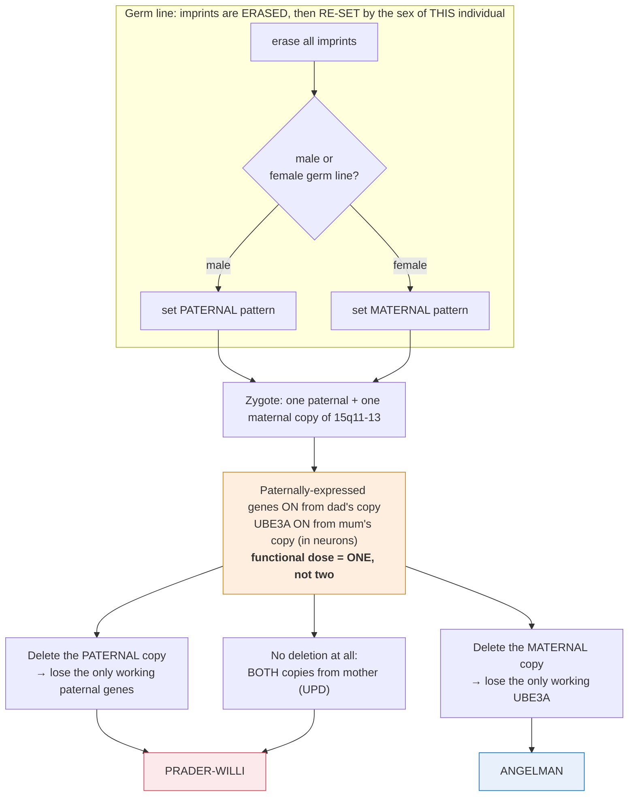

# Genetics · Lesson 3.5: Eukaryotic regulatory logic & epigenetic inheritance

> ⏱ ~15 min · Module 3: Molecular Genetics & Gene Regulation · Builds on: [3.4](03-04-prokaryotic-regulation-operon.md), [2.1](02-01-chromosomal-basis-sex-linkage.md) · Unlocks: 3.6 (reading & editing genes)

## Why this matters

[3.4](03-04-prokaryotic-regulation-operon.md) gave you the *cis*/*trans* distinction in its cleanest form: a diffusible repressor that rescues in *trans*, an operator that acts only in *cis*. That distinction survives intact into eukaryotes — and everything else about the picture changes.

More interestingly, eukaryotes break an assumption Mendel's laws depend on. **Two alleles with identical DNA sequences can behave differently depending on which parent they came from**, and that difference is inherited through cell division. Pedigrees start showing patterns that no combination of dominance, sex linkage, or penetrance can explain — and the explanation is not in the sequence at all.

## The idea

**What survives from the operon picture:** *cis*-acting DNA sites, *trans*-acting diffusible factors, and the merodiploid logic for telling them apart.

**What changes:**

| | Prokaryote | Eukaryote |
|---|---|---|
| Co-regulation | **operon** — adjacent genes, one mRNA | **regulon** — shared binding sites, genes anywhere |
| *cis* elements | operator, within ~50 bp of the promoter | enhancers up to **megabases** away, either side |
| Default state | accessible; regulation is mostly repression | **packaged and inaccessible**; regulation is mostly activation |
| Number of inputs | one or two | dozens — combinatorial |
| Extra layers | none | splicing, mRNA stability, translation, protein turnover |

**The default flip is the single most important difference.** Bacterial DNA is naked and RNA polymerase can find any promoter, so the problem is keeping genes *off*. Eukaryotic DNA is wrapped in nucleosomes, so the problem is getting genes *on* — and that is why eukaryotic regulation is dominated by activators, coactivators, and chromatin openers rather than by repressors.

**Enhancers are *cis*-acting and that has consequences you can see in a pedigree.** An enhancer acts on promoters within its topological domain, on the same DNA molecule. So a mutation that deletes an enhancer behaves *exactly* like an $O^{c}$ mutation in [3.4](03-04-prokaryotic-regulation-operon.md): it affects only the allele it sits on, and a normal enhancer on the other homologue cannot help.

$$\textbf{Regulatory mutations are } \textit{cis}\textbf{-acting, so they are allele-specific.}$$

This produces **allele-specific expression** — one allele transcribed, the other silent, in the same nucleus. It is detectable by sequencing the mRNA and asking which of two heterozygous alleles appears.

**Position effects.** Move a gene next to heterochromatin and it gets silenced in some cells and not others, clonally — **position-effect variegation** ([molecular-cell-biology 4.1](../../molecular-cell-biology/lessons/04-01-chromatin-packaging-regulation.md)). The gene's sequence is untouched; its *neighbourhood* changed. This is a genuine violation of the idea that a gene's behaviour is determined by its sequence.

**And then the part that breaks Mendel: imprinting.** At about 100 human loci, **only one parental allele is expressed** and which one depends on the parent of origin. The silencing is established in the germ line, erased and re-established each generation, and maintained by DNA methylation.

$$\text{maternally imprinted} = \text{the } \textbf{maternal} \text{ copy is silenced; only the paternal one works.}$$

**A single mutation therefore has different consequences depending on which parent transmitted it** — and that is a pedigree pattern with no Mendelian explanation.

## The formal version

**Imprinting notation and logic.** For an imprinted locus, the functional gene dose is **one**, not two. So:

- A **loss-of-function mutation in the expressed allele** behaves as a **null** — there is no second copy to compensate.
- The **same mutation in the silenced allele** is phenotypically invisible, and is transmitted silently until it passes through the other parent's germ line.

*In words: an imprinted locus is functionally hemizygous, so recessive mutations behave dominantly — but only through one parent.*

**The canonical example, worked because the logic is complete.** The 15q11–13 region contains genes that are **paternally expressed** (including *SNRPN*) and genes that are **maternally expressed** (*UBE3A*, in neurons). Loss of the region produces two entirely different syndromes:

| Lost region | Which genes are lost | Syndrome |
|---|---|---|
| **Paternal** 15q11–13 | the paternally-expressed genes (the only working copies) | **Prader–Willi** |
| **Maternal** 15q11–13 | *UBE3A* (the only working copy in neurons) | **Angelman** |

**The same deletion, on the same chromosome, at the same coordinates — two different diseases depending on which parent it came from.** No amount of dominance or penetrance reasoning produces that. It requires the parental origin to carry information the sequence does not.

**Uniparental disomy makes the same point without any deletion.** If a child inherits **both** copies of chromosome 15 from the mother and none from the father, they have two chromosome 15s, no deletion, and a normal karyotype at the resolution of chromosome counting — and they have **Prader–Willi syndrome**, because both copies are maternally imprinted and the paternally-expressed genes are silent on both.

$$\textbf{Two intact copies, correct total dosage, and a disease} \;-\; \text{because gene dose is not the whole story.}$$

**Reading the pedigree signature.** For an imprinted disorder:

| Observation | What it means |
|---|---|
| Affected children of affected **fathers** only, silent through mothers | the locus is **maternally imprinted** (paternal copy expressed) |
| Affected children of affected **mothers** only | **paternally imprinted** (maternal copy expressed) |
| Unaffected carriers who transmit to affected children of one sex of parent only | the mutation was silenced in the carrier and unmasked on transmission |

**Compare with mitochondrial inheritance**, which also gives parent-of-origin asymmetry and is easy to confuse:

| | Imprinting | Mitochondrial |
|---|---|---|
| Transmitting parent | either, with different effect | **mother only** |
| Affected offspring | ~half, either sex | **all** children of an affected mother |
| Can a father transmit? | **yes** | **no** |
| Skips generations? | yes, through the silencing parent | no |

**X-inactivation, formally.** Each female somatic cell silences one X, chosen at random early in development and inherited by all descendants ([2.1](02-01-chromosomal-basis-sex-linkage.md)). Consequences:

- A heterozygous female is a **mosaic** of two clonal populations.
- The expected fraction of cells expressing either X is $\tfrac12$, but the realized fraction in a small founder population is a **binomial sample** — so skewing happens by chance.
- **Skewed X-inactivation produces symptomatic carriers.** If $n$ cells make the choice, the standard deviation of the fraction is $\sqrt{p(1-p)/n} = 1/(2\sqrt n)$, so a small founder pool gives large variance.

**Estimating the founder number from the observed skew is a real inference.** Observed inactivation ratios in human females have a standard deviation of roughly 0.13, which gives

$$n \approx \frac{1}{4\sigma^{2}} = \frac{1}{4(0.13)^{2}} = 15,$$

so **roughly 15 to 20 cells make the X-inactivation choice** in the early human embryo. That is a number about early development inferred entirely from adult blood samples.

**Epigenetic marks are heritable through mitosis but reset in meiosis.** DNA methylation is copied at the replication fork by a maintenance methyltransferase reading the hemimethylated CpG ([molecular-cell-biology 4.1](../../molecular-cell-biology/lessons/04-01-chromatin-packaging-regulation.md)), so a silenced state persists through hundreds of cell divisions. In the germ line it is **erased and re-established according to the sex of that individual** — which is why an imprint you inherited from your mother becomes a paternal imprint if you are male and transmit it.

$$\textbf{The imprint is not inherited; the } \textit{rule for setting it} \textbf{ is.}$$

## Picture

**Read the bottom row as the punchline.** The same deletion at the same coordinates gives two different diseases, and uniparental disomy gives one of them with no deletion at all and a normal chromosome count. **Gene dosage is not the whole story; parental origin carries information the sequence does not.**

## Worked examples

**Example 1 (mechanical — read an imprinted pedigree).** A dominant condition shows this pattern: affected individuals appear in every generation; **affected men have about half their children affected, of both sexes; affected women have no affected children at all**, though their children can have affected children of their own. (a) Rule out the standard modes. (b) What is the mechanism? (c) An unaffected woman has an affected father and two affected sons. Explain.

(a) Eliminate systematically:

- **Autosomal dominant with complete penetrance:** would give affected children from affected mothers *and* fathers. Ruled out.
- **X-linked dominant:** an affected father would give **all** daughters affected and **no** sons. Here affected fathers give **both sexes** at about half. Ruled out.
- **Y-linked:** would affect only males and pass father to son exclusively. Ruled out.
- **Mitochondrial:** transmits through **mothers only**, exactly backwards. Ruled out.

(b) **A maternally imprinted locus** — the maternal allele is silenced, so only the paternal copy is expressed.

An affected father transmits the mutant allele to half his children, and in them it is the *expressed* copy, so they are affected. An affected mother also transmits it to half her children, but in them it arrives as the *maternal* copy and is **silenced** — so they are unaffected carriers. Their own children, if they are male, will transmit it as a paternal copy and it will be expressed again.

$$\textbf{Transmitted by everyone, expressed only through fathers.}$$

(c) The unaffected woman inherited the mutant allele from her affected father. In her it was a *paternal* copy and would have been expressed — so either she inherited the normal allele from him, or (the informative case) she is a **germline transmitter** whose own copy was silenced.

The clean reading: she inherited the mutation from her father but, because her sons are affected, she must have transmitted it. Since her sons are affected, the allele was expressed in them — meaning it reached them as a **paternal-pattern** allele. This cannot happen through a mother. So either the imprint in her germ line was incompletely reset, or — the standard explanation — **she is not the mechanism; the pedigree has been misread and the affected sons received it from their father.**

**The honest answer, and the one a geneticist would give:** this observation is inconsistent with clean maternal imprinting and demands additional data — molecular testing of the woman, her father, and her sons to establish who carries the mutation and what its methylation status is. **A pedigree pattern that violates the model you just fitted is evidence about the model, not a puzzle to be forced.** Incomplete imprinting, mosaicism, and a second independent mutation are all live possibilities, and only the molecular test distinguishes them.

**Example 2 (why you'd care — three routes to the same syndrome).** Prader–Willi syndrome arises from loss of paternally-expressed genes at 15q11–13. Three molecular mechanisms produce it. (a) Name them. (b) For each, state the recurrence risk for the parents' next child and justify it. (c) Explain why a standard karyotype and even a standard sequencing panel can miss two of the three.

(a) The three routes:

1. **Paternal deletion** of 15q11–13 (~70 percent of cases) — arising *de novo* in the father's germ line.
2. **Maternal uniparental disomy** (~25 percent) — the child receives both chromosome 15s from the mother, usually from a trisomy-15 conception that "rescued" itself by losing the paternal copy.
3. **Imprinting-centre defect** (~1–3 percent) — a mutation or epimutation in the element controlling the imprint, so the paternal chromosome carries a maternal-pattern imprint.

(b)

| Mechanism | Recurrence risk | Why |
|---|---|---|
| *De novo* paternal deletion | **< 1 percent** | a sporadic event in one germ cell; not carried by the father |
| Maternal UPD | **< 1 percent** | arises from a nondisjunction event plus trisomy rescue, both sporadic |
| **Imprinting-centre defect** | **up to 50 percent** | if the father carries a mutation in the imprinting centre, he transmits it at Mendelian frequency and it will silence his chromosome in every child that inherits it |

**The spread is from under 1 percent to 50 percent, and it is decided entirely by which mechanism is present** — which makes molecular diagnosis genuinely consequential rather than academic. A family told "less than 1 percent" when the true figure is 50 percent has been badly advised.

(c) **A karyotype misses maternal UPD entirely** — the child has 46 chromosomes, two normal-looking chromosome 15s, and nothing visibly wrong. Chromosome counting cannot detect that both came from one parent.

**Sequencing misses both UPD and imprinting-centre epimutations** — the DNA *sequence* is normal in both. In UPD there is no mutation at all; in an epimutation the sequence is intact and only the methylation is wrong. A variant-calling pipeline reports nothing.

**What detects them:** a **methylation test** at the 15q11–13 imprinting centre, which asks directly whether the region carries a paternal or a maternal methylation pattern. All three mechanisms converge on the same answer — no paternal pattern present — so a single methylation assay diagnoses roughly 99 percent of Prader–Willi cases regardless of mechanism. **Follow-up testing (FISH or SNP array) then distinguishes deletion from UPD from imprinting defect**, which is what sets the recurrence risk.

**The general lesson worth carrying into [4.5](04-05-human-genetics-genome-medicine.md):** sequencing reads the letters, and there is real, clinically decisive genetic information that is not in the letters. A normal genome sequence does not mean a normal genome.

## Watch out

- **You might expect eukaryotic regulation to be mostly repression.** It is mostly **activation**, because packaged DNA is off by default. The operon's logic — a repressor holding an accessible gene shut — is the bacterial situation and inverts in eukaryotes.
- **You might treat a regulatory mutation as affecting both alleles.** Enhancers and promoters are ***cis*-acting**, so a regulatory mutation is allele-specific — the same conclusion as $O^{c}$ in [3.4](03-04-prokaryotic-regulation-operon.md), reached in a completely different system.
- **You might confuse imprinting with mitochondrial inheritance.** Both give parent-of-origin effects. Mitochondrial transmits **only** through mothers and affects **all** her children; imprinting transmits through both parents and is expressed through one.
- **You might think an imprinted locus is a special kind of dominance.** It is functional **hemizygosity** — only one copy is expressed, so a recessive-type loss-of-function mutation behaves as a null, but only when it arrives from the expressing parent.
- **You might assume a normal sequence means a normal genome.** Uniparental disomy and imprinting epimutations both leave the sequence intact and both cause disease. Methylation testing is a separate assay for a separate kind of information.

## One-liner

> *cis* and *trans* survive from the operon, but the default flips from on to off, enhancers act megabases away on their own allele only, and at imprinted loci the same mutation causes two different diseases depending on which parent it came from.

## Problems

**P1 (🟢)** For each observation, state whether the mechanism is imprinting, mitochondrial inheritance, or X-linked dominant: (a) an affected mother's six children are all affected, both sexes; (b) an affected father's four daughters are all affected and his three sons are not; (c) affected children appear only when the allele passes through the father, and only about half of his children are affected, both sexes.

**P2 (🟡)** X-inactivation is a binomial choice made by a small founder population of cells. (a) If $n$ cells make the choice independently with $p = \tfrac12$, write the standard deviation of the fraction inactivating a given X. (b) The observed standard deviation of X-inactivation ratios among human females is about 0.13. Estimate $n$. (c) Explain how this predicts the existence of symptomatic female carriers of X-linked recessive disease, and estimate roughly what fraction of carriers would have 80 percent or more of their cells expressing the mutant X.

**P3 (🔴, bridges to 4.5 and to clinical genetics)** A child presents with Angelman syndrome. Testing shows: normal karyotype; no deletion on chromosomal microarray; normal *UBE3A* sequence; **abnormal methylation** at the 15q11–13 imprinting centre showing a paternal-only pattern. (a) What is the mechanism? (b) List the two sub-possibilities and state how you would distinguish them. (c) For each sub-possibility, give the recurrence risk and explain the reasoning. (d) State in one sentence what this case demonstrates about the limits of sequencing.

Solutions

**P1 (a)** **Mitochondrial.** All children of an affected mother affected, both sexes, is the mitochondrial signature — she transmits her mitochondria to every child. Imprinting would affect about half; X-linked dominant would affect about half.

**(b)** **X-linked dominant.** An affected father gives every daughter his single X (carrying the allele) and every son his Y. All daughters, no sons, is decisive ([2.1](02-01-chromosomal-basis-sex-linkage.md)).

**(c)** **Imprinting** — specifically a **maternally imprinted** locus (only the paternal copy expressed). Expression only through the father, both sexes, about half — the allele segregates Mendelianly and is expressed only when it arrives as the paternal copy.

**P2 (a)** For a binomial proportion with $n$ trials and $p = \tfrac12$:

$$\sigma = \sqrt{\frac{p(1-p)}{n}} = \sqrt{\frac{1/4}{n}} = \frac{1}{2\sqrt{n}}.$$

**(b)** Set $\sigma = 0.13$:

$$0.13 = \frac{1}{2\sqrt n} \;\Longrightarrow\; \sqrt n = \frac{1}{2(0.13)} = 3.85 \;\Longrightarrow\; n \approx \mathbf{15}.$$

**Roughly 15 cells make the X-inactivation decision in the early human embryo** — a fact about a stage of development nobody has observed directly, inferred from the variance of a ratio measured in adult blood. (Published estimates cluster around 8–16, so this is right.)

**(c)** With $n$ this small, the realized fraction varies widely. A carrier whose cells happen to have inactivated mostly the **normal** X will express predominantly the mutant allele in whatever tissue was founded that way — and if that tissue is the relevant one, she is symptomatic.

Estimating the fraction with $\ge 80$ percent skew: the fraction $X$ is approximately normal with mean 0.5 and $\sigma = 0.13$.

$$z = \frac{0.80 - 0.50}{0.13} = 2.31 \;\Longrightarrow\; P(X \ge 0.8) \approx 0.010 .$$

Counting both directions of skew, roughly **2 percent of females are skewed to 80 percent or beyond**, and about **1 percent** are skewed toward expressing a given X.

**So about 1 in 100 carriers of an X-linked recessive would express the mutant allele in 80 percent or more of their cells** — enough, for many conditions, to produce symptoms. This is the quantitative basis for the well-documented existence of manifesting carriers in Duchenne muscular dystrophy, haemophilia and Fabry disease, and it means "carrier females are unaffected" is a rule with a calculable exception rate rather than an absolute. (Real skewing is somewhat more common than this estimate, because selection can act on the two cell populations over a lifetime — a further departure from the pure binomial.)

**P3 (a)** The mechanism is an **imprinting defect**: the maternal chromosome 15 is carrying a **paternal** methylation pattern, so *UBE3A* — which is expressed only from the maternal copy in neurons — is silenced on both chromosomes.

Note what has been excluded: the karyotype and microarray rule out deletion, and the normal *UBE3A* sequence rules out a point mutation in the gene itself. The methylation test is the only assay that found anything.

**(b)** Two sub-possibilities:

1. **An imprinting-centre deletion or point mutation** in the mother's germ line — a *sequence* change in the imprinting control element that prevents the maternal pattern from being established.
2. **A primary epimutation** — no sequence change at all; the imprint simply failed to be reset correctly during the mother's oogenesis or in the early embryo. These are usually sporadic.

*How to distinguish:* **sequence and array-analyse the imprinting centre itself**, at high resolution. A microdeletion of a few kilobases in the imprinting centre would be missed by a standard microarray and requires targeted testing. If a sequence lesion is found, it is possibility 1; if the imprinting centre is structurally normal, it is possibility 2. Testing the mother is also essential — she should carry the same imprinting-centre mutation on one of her chromosome 15s if possibility 1 holds.

**(c)**

| Sub-possibility | Recurrence risk | Reasoning |
|---|---|---|
| **Imprinting-centre mutation** in the mother | **up to 50 percent** | She carries it on one chromosome 15 and transmits that chromosome to half her children; in each of them it will fail to acquire the maternal imprint, silencing *UBE3A*. It segregates Mendelianly. |
| **Primary epimutation** | **~1 percent** (near background) | A stochastic failure of imprint establishment in one gamete or one early embryo. Nothing heritable was transmitted, so the event is unlikely to repeat. |

**A fifty-fold difference in recurrence risk turns on a distinction invisible to every test that was run first.** This is why the imprinting centre is sequenced specifically once a methylation abnormality is found without a deletion — the answer changes the family's reproductive counselling completely.

**(d)** **Sequencing reads the letters, and this child's letters are entirely normal** — the disease is caused by a mark on the DNA rather than a change in it, so a normal genome sequence is not evidence of a normal genome, and any diagnostic strategy that relies on sequencing alone will systematically miss an entire class of disease.

## Flashback

**From Lesson 3.4 (merodiploids and *cis*/*trans*):** For each *lac* genotype, state whether β-galactosidase is made without and with lactose, and name the principle: (a) $I^{S}P^{+}O^{+}Z^{+}$ (haploid); (b) $I^{-}P^{+}O^{c}Z^{+} / I^{+}P^{+}O^{+}Z^{-}$; (c) $I^{+}P^{-}O^{+}Z^{+} / I^{-}P^{+}O^{+}Z^{-}$.

Solution

**(a)** $I^{S}$ makes a repressor that binds the operator and cannot be released by inducer.

$$\text{no lactose: } \textbf{NO}, \qquad \text{lactose: } \textbf{NO} \qquad \textbf{— uninducible.}$$

*Principle:* a mutation that produces a **poison** ($I^{S}$) behaves differently from one that produces **nothing** ($I^{-}$) — the operon version of the dominant-negative/null distinction from [1.2](01-02-when-dominance-breaks-down.md).

**(b)** Repressor is present (the plasmid's $I^{+}$ is diffusible). Chromosome: $O^{c}$ cannot be repressed → constitutive, and it carries $Z^{+}$. Plasmid: $O^{+}$ regulated normally, but $Z^{-}$.

$$\text{no lactose: } \textbf{YES}, \qquad \text{lactose: } \textbf{YES} \qquad \textbf{— constitutive.}$$

*Principle:* **$O^{c}$ is *cis*-dominant.** Good repressor is present and cannot help, because the operator it needs to bind is broken on the molecule that carries the working gene.

**(c)** Chromosome: $P^{-}$ → no transcription at all, so its $Z^{+}$ is never expressed. Plasmid: $I^{-}$ contributes no repressor, but the chromosome's $I^{+}$ is diffusible and supplies it; $O^{+}$ regulated normally — but $Z^{-}$.

**No functional $Z$ is ever transcribed:** the only $Z^{+}$ sits behind a dead promoter, and the only working promoter drives a $Z^{-}$.

$$\text{no lactose: } \textbf{NO}, \qquad \text{lactose: } \textbf{NO} \qquad \textbf{— uninducible.}$$

*Principle:* **$P^{-}$, like $O^{c}$, is *cis*-acting** — a dead promoter cannot be rescued by a good promoter elsewhere in the cell, because a promoter only works on what is attached to it. The two *cis* elements fail for the same structural reason and produce opposite phenotypes.

## Connections

- **Backward:** [3.4](03-04-prokaryotic-regulation-operon.md)'s *cis*/*trans* logic transfers intact; [2.1](02-01-chromosomal-basis-sex-linkage.md)'s X-inactivation is quantified here as a binomial founder-cell sample.
- **Forward:** [3.6](03-06-reading-editing-genes.md) covers the methylation and expression assays this lesson kept demanding; [4.5](04-05-human-genetics-genome-medicine.md) returns to the theme that a normal sequence is not a normal genome.
- **Sideways:** the chromatin machinery — nucleosomes, marks, readers and writers, the self-propagating silencing loop — is [molecular-cell-biology 4.1](../../molecular-cell-biology/lessons/04-01-chromatin-packaging-regulation.md), and enhancer action through topological domains is [molecular-cell-biology 4.2](../../molecular-cell-biology/lessons/04-02-eukaryotic-transcription-machine.md); this lesson is the *inheritance patterns* those mechanisms produce.
